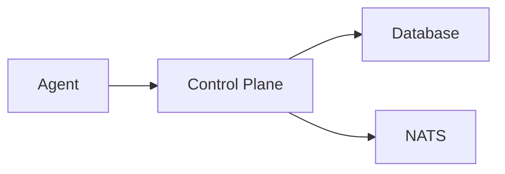

# CLAUDE.md

This file provides guidance to Claude Code (claude.ai/code) when working with code in this repository.

---

## ⚠️ CRITICAL: TODO Approval Workflow ⚠️

**STOP** before fixing any TODO.md item. You MUST:
1. Present a plan to the user
2. **WAIT for explicit "yes" or approval**
3. Only then implement the fix

This applies ALWAYS - including after session resumption or context summarization.
**Never batch-fix TODOs without per-item approval.**

---

## Commit Message AI Attribution

- Use the DCO-required AI disclosure in commit messages.
- `Co-Authored-By` must identify the current agent (not Claude or another tool).
  Example: `Co-Authored-By: Codex <noreply@openai.com>` (adjust name/email per agent).

---
## Coding notes
- Do not add superfluous comments
- Commit and push as progress is made (don't wait until the end of a task)
- Keep user documentation updated as tasks are completed:
  - `docs/` - User-facing documentation
  - `AGENTS.md` - Agent instructions and project status
  - `README.md` - Project overview
  - `docs/content/en/docs/executive-summary/_index.md` - Executive summary
  - Other related documentation files as appropriate

### TODO Workflow

**IMPORTANT**: When working on items from `TODO.md`, always follow this workflow:

1. **Review** the TODO item and related code/documentation
2. **Present a plan** describing what changes will be made
3. **Wait for user approval** before making any changes
4. **Implement** the approved changes
5. **Commit and push** the changes

Do NOT proceed with TODO fixes without explicit user approval of the plan. This applies even when resuming from a previous session or continuing through multiple TODOs.

### Documentation Requirements

All code changes **must** include corresponding documentation updates:
- **CLI changes**: Update `docs/content/en/docs/reference/cli.md` and `cli-quick-reference.md`
- **New features**: Add user-facing documentation explaining usage and examples
- **API changes**: Update relevant API documentation
- **Configuration changes**: Update configuration reference docs

### Testing Requirements

All code changes **must** include corresponding tests:
- **New functions/methods**: Add unit tests covering normal operation, edge cases, and error conditions
- **New types**: Add tests for constructors, methods, and interface compliance
- **Bug fixes**: Add regression tests that would have caught the bug
- **Test coverage targets**: >70% for critical packages, >40% for CLI (see TODO.md)

Tests should follow existing patterns in the codebase:
- Use table-driven tests where appropriate
- Use `t.TempDir()` for filesystem isolation
- Test both success and error paths
- Include interface compliance tests (e.g., `var _ Interface = (*Type)(nil)`)

### State Machine Pattern Guidelines

Use the `pkg/statemachine` library for components with complex state transitions:

**When to use state machines:**
- Components with 3+ distinct states
- State transitions that require validation
- Lifecycle management (init, start, run, stop)
- Workflows with sequential steps
- Retry/recovery logic with phases

**Implementation pattern:**
```go
// Define states and events as typed constants
type ConnectionState string
const (
    StateDisconnected ConnectionState = "disconnected"
    StateConnecting   ConnectionState = "connecting"
    StateConnected    ConnectionState = "connected"
)

type ConnectionEvent string
const (
    EventConnect    ConnectionEvent = "connect"
    EventConnected  ConnectionEvent = "connected"
    EventDisconnect ConnectionEvent = "disconnect"
)

// Build machine with transitions and callbacks
machine := statemachine.New[ConnectionState, ConnectionEvent](StateDisconnected).
    AddTransition(StateDisconnected, EventConnect, StateConnecting).
    AddTransition(StateConnecting, EventConnected, StateConnected).
    WithHistory(100).
    MustBuild()
```

**Required for state machine implementations:**
- Document state diagram in markdown documentation (not in code comments) using Mermaid
- Test all valid transitions
- Test that invalid transitions are rejected
- Use guards for conditional transitions
- Use callbacks for side effects (logging, metrics, events)

**Note:** Mermaid diagrams should only be placed in markdown files (`.md`), not in code comments. Code comments should use plain text descriptions of states and transitions.

See `docs/content/en/docs/contributing/state-machines.md` for full documentation.

---

## Recent Updates

- **Epic 42 Phase 1 COMPLETE**: NETCONF Protocol Adapter (RFC 6241):
  - Core adapter: types, RPC encoding, SSH transport, session management, operations, capabilities, filters
  - Full RFC 6241 operation set with NETCONF 1.0/1.1 framing
  - Extended `NetconfAdapter` interface, YANG model metadata, subtree/XPath filters
  - 90 unit tests passing, documentation at `docs/content/en/docs/reference/netconf.md`
- **Epic 42 Phase 2 COMPLETE**: RESTCONF Protocol Adapter (RFC 8040):
  - Core adapter: types, error parsing, root path discovery, operations, SSE streams, adapter lifecycle
  - Full RFC 8040 data operations (GET/POST/PUT/PATCH/DELETE), RPC invocation, query parameters
  - SSE notification stream subscriptions, well-known root path discovery (RFC 6415)
  - Extended `RestconfAdapter` interface with typed methods beyond generic `Execute()`
  - Composes with REST adapter's `rest.Client` and `rest.Authenticator` infrastructure
  - Registered in protocol adapter registry (both ProtocolAdapter and RestconfAdapter factories)
  - 78 unit tests passing (92.3% coverage), documentation at `docs/content/en/docs/reference/restconf.md`
- **Epic 42 Phase 3 COMPLETE**: Telnet Protocol Adapter (RFC 854/855):
  - IAC negotiation state machine: WILL/WONT/DO/DONT, sub-negotiation (TermType, WindowSize)
  - Security enforcer: IP allowlisting (CIDR), deprecation warnings, audit logging, session time limits
  - Session management: expect-style I/O, prompt-based login, CR+LF line endings, IAC stripping
  - Adapter lifecycle: Connect/Execute/Disconnect/HealthCheck, factory registration, SSHPasswordCredential reuse
  - 56 unit tests passing (85.6% coverage), documentation at `docs/content/en/docs/reference/telnet.md`
- **Epic 42 Phase 5 COMPLETE**: P0 Vendor Drivers (9 new network device platforms):
  - HP/Aruba: ProCurve (`hp_procurve`), ArubaOS (`hp_arubaos`), AOS-CX (`hp_aoscx`) — SSH adapters with vendor-specific CLI patterns
  - Dell: OS10 (`dell_os10`), OS9/FTOS (`dell_os9`), PowerSwitch (`dell_powerswitch`) — SSH adapters for modern and legacy Dell platforms
  - Security vendors: FortiOS (`fortinet_fortios`) with config/edit/set/next/end CLI, PAN-OS (`paloalto_panos`) with transactional commits, F5 BIG-IP (`f5_bigip`) with tmsh shell
  - 9 VendorType constants, 9 state config modules, factory auto-registration for all drivers
  - 16 total vendor drivers now supported (up from 7)
  - 125+ unit tests across all new vendor packages, documentation at `docs/content/en/docs/reference/vendor-drivers.md`
- **Epic 42 Phase 4 COMPLETE**: gNMI Protocol Adapter (gRPC Network Management Interface):
  - Core adapter: Connect/Execute/Disconnect/HealthCheck, Config, factory registration, init()
  - Full gNMI RPC support: Capabilities, Get, Set, Subscribe with channel-based streaming
  - mTLS + per-RPC metadata authentication via dedicated GNMICredential type
  - OpenConfig path parsing with key selectors, origin prefixes, proto path round-trips
  - Subscription modes: ONCE, STREAM, POLL; stream sub-modes: TARGET_DEFINED, ON_CHANGE, SAMPLE
  - Execute command parser for scripting: capabilities, get, set (update/replace/delete), subscribe
  - gNOI stubs (Reboot, Ping, Traceroute) for future openconfig/gnoi dependency
- **Epic 42 Phase 6 COMPLETE**: P1/P2 Vendor Drivers (9 new network device platforms):
  - P1: Check Point Gaia (clish), MikroTik RouterOS (path-based CLI), Ubiquiti EdgeOS (Vyatta), Extreme EXOS (direct commands)
  - P2: Nokia SR OS (TiMOS/classic CLI), Huawei VRP (system-view/display), Mellanox/NVIDIA Onyx (IOS-like), Allied Telesis AlliedWare Plus (IOS-like), Ciena SAOS (noun-first commands)
  - 9 VendorType constants, 9 vendor adapters with full test suites, 9 state modules, 9 discovery profiles
  - Total vendor drivers: 25 (up from 16)
  - 44 unit tests passing with race detector, documentation at `docs/content/en/docs/reference/gnmi.md`
- **Epic 42 Phase 8 COMPLETE**: State Modules and Documentation:
  - T8.1: NETCONF state modules (`netconf_interface`, `netconf_vlan`, `netconf_routing`, `netconf_acl`) using OpenConfig YANG models with candidate datastore lock/edit/validate/commit/unlock workflow
  - T8.2: Vendor state modules (`fortios_policy`, `panos_rule`, `bigip_pool`, `bigip_virtual`, `checkpoint_rule`) using vendor REST/XML APIs
  - T8.3: Documentation — proxy state modules reference, vendor configuration guide, protocol compatibility matrix, proxy troubleshooting guide
  - 9 new module registrations in executor, 108+ tests passing with race detector
- **Epic 42 Phase 7 COMPLETE**: Credential Rotation Framework:
  - T7.1: Core rotation engine with state machine (Pending → Validating → Generating → Applying → Verifying → Storing → Cleanup → Completed), rollback on failure
  - T7.2: Protocol providers — SSH (password/key), SNMP (v2c/v3), REST (basic/bearer/apikey/oauth2), Certificate (gNMI TLS)
  - T7.3: Policy engine with age-based evaluation, cron scheduling via secrets.ParseCron, automatic rotation of due credentials
  - Package: `internal/credentials/rotation/` with 16 files, 165+ tests passing with race detector
- **Epic 100 DEFERRED**: 0.1.0 Release Readiness (moved to future epics):
  - Phases 1-4 complete (signing, versions, repo gen, docs); Phase 5 (VM validation) remaining
- **Epic 41 COMPLETE**: DNS Provider Management:
  - Week 1-2: Core DNS package (`internal/dns/`) with types, diff logic, provider registry, sync engine
  - Week 3-4: DNS state module for statemgmt integration, mock provider for testing
  - Week 5-6: Observability with metrics collection and audit logging
  - Week 7-8: Documentation and real provider implementations
  - Supports A, AAAA, CNAME, TXT, MX, SRV, CAA, NS, ALIAS, PTR record types
  - Real providers: Cloudflare, Route53, Google Cloud DNS, Azure DNS, DigitalOcean, DNSMadeEasy, Hetzner
  - libdns adapter for easy provider integration
- **Epic 37 COMPLETE**: Enhanced runbook automation system fully implemented across 6 phases (24 weeks):
  - Phase 1: Core engine with YAML definitions, execution engine, 6 step handlers, SQLite storage
  - Phase 2: Conditional logic with expression evaluator, if/switch/loop/parallel handlers
  - Phase 3: Human-in-the-loop approvals with multi-approver support, escalation, notifications
  - Phase 4: Advanced step handlers (state, deploy, rollback, script, plugin)
  - Phase 5: Triggers (event, schedule, webhook) and ITSM integration (PagerDuty, Opsgenie, ServiceNow)
  - Phase 6: Execution management (pause/resume/retry/skip), audit logging, metrics, performance benchmarks, documentation
- **Epic 36 Week 22**: Release preparation - added KMS benchmarks, integration tests for real backends, migration guide, and changelog entry.
- **Epic 39 COMPLETE**: State machine pattern refactoring finished with 15 components using explicit state machines and 150+ tests.
- `make security` now runs tooling in Docker/Podman containers (no local installs required).
- Added state machine library (`pkg/statemachine`) with generic, type-safe implementation for managing complex state transitions.
- Added contributor documentation for state machine patterns at `docs/content/en/docs/contributing/state-machines.md`.
- Expanded configuration reference coverage for control plane, auth, webhook, NATS, storage, and agent settings.
- Documented module registry configuration and added CLI coverage for agent management, load testing, and test runner tools.
- Aligned registry config documentation with CLI flags and added agent bootstrap env/flag reference plus blueprint registry/cache env variables.
- Added Docsy Hugo module placeholder setup steps for local docs builds.
- Replaced time.Sleep usage in tests with deterministic waits and time adjustments to reduce flakiness.
- Made retry/backoff delays cancelable in REST client, storage failover, and observability backend paths.
- Made blueprint and module registry retries cancelable with timeout-bounded waits.
- Swapped polling sleeps for tickers with cancellation in cluster fencing and bootstrap health checks.
- Made identity rotation retry waits cancelable and added coverage for early-stop behavior.
- Made Kafka consumer retries and leaf buffer publish retries cancelable.
- Made syslog reconnect waits cancelable and unblocked by Close.
- Made mirror sync retries and bandwidth limiting waits cancelable.
- Made SPIRE client stream retry waits cancelable with context-aware timers.
- Made transaction rollback retry waits cancelable and cancel-aware.
- Replaced execution kill timeout and upgrade health waits with timers.
- Refactored Windows service wait loops to timer-based polling with tests.
- Replaced profiling sleeps with timer-based waits and added coverage.
- Refactored SSH shell pacing waits to timer-based pauses with context handling.
- Replaced Loki pusher retry sleeps with timer-based backoff waits.
- Added shared wait utilities in pkg/wait and refactored recent timing helpers to use them.
- Added polling helpers to pkg/wait with coverage.
- Reused pkg/wait polling/duration helpers in test helper packages.
- Exposed configurable TLS min version defaults/validation across core config, syslog, etcd, and gateway, with docs updated.
- Aligned TLS min_version examples in NATS and security docs with TLS 1.3 defaults.
- Hardened exec TLS skip-verify gating, server/registry JSON responses, and doc generator templates; tightened compose and Kubernetes security examples; cleared TODO list.
- Refactored retry delay helpers to use pkg/wait across REST, registry, storage, events, and SPIRE clients.
- Added stop-channel wait helpers in pkg/wait and refactored retry delays to use them.
- Reused pkg/wait helpers for schedule stop waits and SPIRE/statemgmt retry delays.
- Reused pkg/wait helpers in retry/backoff and upgrade scheduling waits.
- Reused pkg/wait for schedule retry delays and upgrade batch delays.
- Reused pkg/wait in audit waits, event delays, and REST adapter rate limiting.
- Reused pkg/wait in backpressure and plugin resource loops; tightened drop strategy CAS.
- Reused pkg/wait in transfer throttling, proxy shutdown waits, and NATS ordering retries.
- Reused pkg/wait in upgrade manager/rollback delays and network failover retries.
- Reused pkg/wait in gitops promotion/verification delays and event bridge backoff.
- Reused pkg/wait in gateway log/metric/trace retry backoffs.
- Reused pkg/wait in cluster shutdown waits and coordination retries.
- Reused pkg/wait in module test timeouts.
- Moved most implementation packages from pkg/ to internal/ and marked public pkg APIs as unstable.

## Repository Purpose

This is the **design documentation repository** for Keystone Core, a cloud-native runtime infrastructure control plane. Keystone Core is positioned as the operational layer between GitOps/IaC deployments and runtime infrastructure, inspired by Salt Project but modernized for cloud-native environments.

**Key Concept**: "GitOps deploys it. We keep it running."

## Project Status

This repository contains working implementations of **Epics 1-29**. The project has transitioned from design-only to a working implementation with:

- Full NATS integration (embedded, external, and leaf modes)
- Working agent system with registration, heartbeat, and command execution
- SQLite-based state management
- Git-style plugin architecture for CLI extensibility
- Cross-platform remote execution with targeting
- Declarative state management with drift detection and CLI
- Event-driven automation with filtering, routing, enrichment, reactors
- GitOps integration with webhooks, verification, rollback, promotion pipelines
- Policy enforcement with OPA/CEL engines, auditing, compliance reporting
- High availability clustering with etcd-based coordination
- Telemetry gateway for aggregating metrics, logs, and traces
- Proxy agents for managing unmanaged devices via SSH, SNMP, REST, WinRM
- File distribution over NATS with multiple backends, mirror groups
- Self-management workflows: bootstrap, backup/restore, upgrades
- Standard deployment blueprints catalog
- Single-binary bootstrap experience
- Comprehensive test suite (>79% coverage across all core packages)
- Explicit state machine patterns for 15 core components (150+ tests)
- Full runbook automation system with triggers, approvals, ITSM integration, audit logging

**Current Status**: Epics 1-32, 36-37, 39-42 COMPLETE ✅ | Epic 43 PLANNED

## Repository Structure

```
/
├── docs/project/DESIGN.md             # Main design document
└── epics/                             # Epic-level implementation plans
    ├── 01-core-infrastructure.md      # NATS, agents, control plane
    ├── 02-remote-execution.md         # Command execution system
    ├── 03-state-management.md         # Declarative configuration
    ├── 04-event-system.md             # Event-driven automation
    ├── 05-gitops-integration.md       # ArgoCD/Flux integration
    ├── 06-policy-enforcement.md       # OPA/CEL policy engine
    ├── 07-observability.md            # Metrics, logging, tracing
    ├── 08-multi-environment.md        # K8s, VMs, bare metal, edge
    ├── 09-plugin-system.md            # Starlark/WASM plugin architecture
    ├── 10-documentation.md            # Hugo + Docsy documentation
    ├── 11-clustering.md               # High availability clustering
    ├── 12-e2e-testing.md              # End-to-end & performance testing
    ├── 13-cgo-removal.md              # Pure Go build
    ├── 14-nats-mesh-communication.md  # NATS-only communication
    ├── 15-observability-enhancements.md  # NATS telemetry, syslog, audit
    ├── 16-stdlib-system-modules.md       # Cross-platform system modules
    ├── 17-spiffe-identity.md             # SPIFFE/SPIRE identity
    ├── 18-ipv6-support.md                # IPv6 and dual-stack
    ├── 19-observability-gateway.md       # Telemetry gateway
    ├── 20-windows-support.md             # Windows agent
    ├── 21-proxy-agents.md                # Proxy agents
    ├── 22-file-distribution.md           # File distribution over NATS
    ├── 23-self-management.md             # Bootstrap, backup, upgrades
    ├── 24-document-review.md             # Documentation review
    ├── 25-blueprints.md                  # Reusable state collections
    ├── 26-needswork-remediation.md       # Issue remediation
    ├── 27-agent-bootstrap-experience.md  # Single-binary bootstrap
    ├── 28-standard-deployment-blueprints.md  # Official blueprints
    ├── 29-bootstrap-testing-infrastructure.md  # Bootstrap tests
    ├── 30-cli-ux-restructuring.md        # CLI UX restructuring
    ├── 31-nist-design-principles.md      # NIST design principles
    ├── 32-advanced-networking.md         # Advanced networking (WiFi, 802.1X, etc.)
    ├── 36-deep-secrets-management.md     # Deep secrets management integration
    ├── 37-enhanced-runbooks.md           # Enhanced runbook automation
    ├── 38-air-gapped-deployments.md      # Air-gapped deployment support
    ├── 39-state-machine-refactoring.md   # State machine pattern refactoring
    ├── 40-test-coverage-remediation.md   # Test coverage for untested packages
    ├── 41-dns-provider-management.md    # DNS record management via provider APIs
    ├── 42-network-protocol-expansion.md # Network protocol expansion (NETCONF, RESTCONF, gNMI, Telnet)
    ├── 43-secrets-api-implementation.md   # Secrets REST/gRPC API layer
    ├── 44-cluster-join-tokens.md          # Cluster join token management
    ├── 100-release-readiness-0.1.0.md     # 0.1.0 release readiness (future)
    ├── future-mcp-server.md               # MCP server for AI-assisted operations (future)
    └── future-web-ui-management-console.md  # Web UI (future, not scheduled)
```

## Architecture Overview

Keystone Core fills the gap between declarative GitOps tools and runtime operations:

**Core Architecture Components:**
- **Control Plane**: API Server, State Manager, Event/Reactor Engine
- **Message Bus**: NATS with three deployment modes:
  - **Embedded mode**: In-process NATS for initial setups, small deployments (<100 nodes)
  - **External cluster mode**: Dedicated NATS cluster for production (100+ nodes)
  - **Hybrid mode**: Control plane uses external cluster, agents use embedded NATS as leaf nodes
  - JetStream for event persistence (supported in all modes)
- **Agents**: Lightweight Go binaries on managed nodes (K8s, VMs, bare metal, edge)
- **State Storage**: SQLite or PostgreSQL for operational state
  - **SQLite (embedded)**: Zero dependencies, for dev/testing/small deployments
  - **PostgreSQL**: Production deployments, high availability (100+ nodes)
  - Automated migration tooling from SQLite → PostgreSQL (`kscore-migrate` CLI)

**Key Design Decisions**:
- Use NATS JetStream for events/messaging, but SQLite/PostgreSQL for state due to query patterns, indexing needs, and transactional semantics
- SQLite for getting started (mirrors embedded NATS philosophy), PostgreSQL for production

## Epic Dependencies

Implementation order:
1. **Epic 1** (Core Infrastructure) - ✅ COMPLETE
2. **Epic 2** (Remote Execution) - ✅ COMPLETE
3. **Epic 3** (State Management) - ✅ COMPLETE
4. **Epic 4** (Event System) - ✅ COMPLETE - Depends on Epic 1
5. **Epic 5** (GitOps Integration) - ✅ COMPLETE - Depends on Epic 2, 3, 4
6. **Epic 6** (Policy Enforcement) - ✅ COMPLETE - Depends on Epic 2, 3, 4
7. **Epic 7** (Observability) - ✅ COMPLETE - Instruments all epics
8. **Epic 8** (Multi-Environment) - ✅ COMPLETE - Depends on Epic 1, 2, 3
9. **Epic 9** (Plugin System) - ✅ COMPLETE - Depends on Epic 3, 4, 5, 6
10. **Epic 10** (Documentation) - ✅ COMPLETE - Documents Epic 1-9
11. **Epic 11** (Clustering) - ✅ COMPLETE - Depends on Epic 1, 7
12. **Epic 12** (E2E Testing) - ✅ COMPLETE
13. **Epic 13** (CGO Removal) - ✅ COMPLETE - Independent
14. **Epic 14** (NATS Mesh Communication) - ✅ COMPLETE - Depends on Epic 1, 7, 11
15. **Epic 15** (Observability Enhancements) - ✅ COMPLETE - Depends on Epic 7, 14
16. **Epic 16** (Stdlib System Modules) - ✅ COMPLETE - Depends on Epic 3, 8
17. **Epic 17** (SPIFFE Identity) - ✅ COMPLETE - Depends on Epic 1, 11, 14
18. **Epic 18** (IPv6 Support) - ✅ COMPLETE - Depends on Epic 1, 11, 14
19. **Epic 19** (Observability Gateway) - ✅ COMPLETE - Depends on Epic 7, 14, 15
20. **Epic 20** (Windows Support) - ✅ COMPLETE - Depends on Epic 1, 2, 3, 13
21. **Epic 21** (Proxy Agents) - ✅ COMPLETE - Depends on Epic 1, 2, 3, 4, 8, 14
22. **Epic 22** (File Distribution) - ✅ COMPLETE - Depends on Epic 1, 4, 6, 14, 17, 21
23. **Epic 23** (Self-Management) - ✅ COMPLETE - Depends on Epic 1, 3, 4, 5, 7, 11, 17, 22
24. **Epic 24** (Document Review) - ✅ COMPLETE - Depends on Epic 10
25. **Epic 25** (Blueprints) - ✅ COMPLETE - Depends on Epic 3, 4, 9, 22
26. **Epic 26** (NEEDSWORK Remediation) - ✅ COMPLETE
27. **Epic 27** (Agent Bootstrap Experience) - ✅ COMPLETE - Depends on Epic 23, 25
28. **Epic 28** (Standard Deployment Blueprints) - ✅ COMPLETE - Depends on Epic 25, 27
29. **Epic 29** (Bootstrap Testing Infrastructure) - ✅ COMPLETE - Depends on Epic 27, 28
30. **Epic 30** (CLI UX Restructuring) - ✅ COMPLETE - Depends on Epic 1, 2, 3
31. **Epic 31** (NIST Design Principles) - ✅ COMPLETE - Documentation only
32. **Epic 32** (Advanced Networking) - ✅ COMPLETE - WiFi, 802.1X, link settings, promiscuous mode
36. **Epic 36** (Deep Secrets Management) - ✅ COMPLETE - Depends on Epic 1, 3, 4, 6, 17
37. **Epic 37** (Enhanced Runbooks) - ✅ COMPLETE - Depends on Epic 1, 2, 3, 4
39. **Epic 39** (State Machine Refactoring) - ✅ COMPLETE - Independent refactoring epic
40. **Epic 40** (Test Coverage Remediation) - ✅ COMPLETE - Add tests to 23 untested packages
41. **Epic 41** (DNS Provider Management) - ✅ COMPLETE - Depends on Epic 3, 6, 9 - State-based DNS records via libdns; providers: Cloudflare, Route 53, Google Cloud DNS, Azure DNS, DigitalOcean DNS, DNSMadeEasy, Hetzner DNS
42. **Epic 42** (Network Protocol Expansion) - ✅ COMPLETE - NETCONF, RESTCONF, Telnet, gNMI adapters + 25 vendor drivers + credential rotation + NETCONF/vendor state modules + documentation

### Planned

43. **Epic 43** (Secrets API Implementation) - NOT STARTED - REST handlers, gRPC service, public client package, CLI wiring for `internal/secrets/`
44. **Epic 44** (Cluster Join Tokens) - NOT STARTED - Depends on Epic 1, 11 - Secure join token system for cluster membership with durable storage (etcd/SQLite/PostgreSQL), configurable TTL and use limits, CLI commands, REST API, audit logging
45. **Epic 45** (Control Plane Config Wiring) - NOT STARTED - Wire agents, execution, state, events, gitops, security config sections into `internal/config.Config` and `kscore-server`
46. **Epic 46** (gRPC Service Implementation) - NOT STARTED - Depends on Epic 1, 3, 4, 6, 11 - Generate stubs and implement servers for StateService, EventService, PolicyService, ClusterService; register AgentService and CoordinationService in kscore-server

### Future Epics (Not Yet Planned)

- **Epic 100: 0.1.0 Release Readiness** - Blueprint signing, version reset, docs audit, VM validation - See `epics/100-release-readiness-0.1.0.md`

- **Epic 38: Air-Gapped Deployments** - USB/ISO bootstrap, offline registries, upgrade packages, data diodes (deferred until release infrastructure is established)
- **Release & Distribution** - Release automation, package repos, artifact signing
- **Multi-Tenancy** - Namespace isolation, per-tenant RBAC/quotas, SSO integration
- **Interactive OIDC Signing** - OAuth 2.0 device flow or browser-based authorization for keyless signing without pre-provided tokens
- **Scheduled Operations** - Centralized job scheduler, maintenance windows
- **Web UI / Management Console** - Web-based dashboard, enterprise auth (2FA, SSO), user/group management - See `epics/future-web-ui-management-console.md`
- **Mobile Monitoring App** - Native mobile app for monitoring and alerts
- **MCP Server** - Model Context Protocol server (`kscore-mcp`) exposing Keystone Core operations to AI clients (Claude Desktop, Claude Code, Cursor) - See `epics/future-mcp-server.md`
- **Automatic Drift Remediation** - Opt-in auto-fix, approval workflows
- **Agent Self-Update** - Secure binary distribution, staged rollouts
- **Compliance Framework Presets** - CIS Benchmarks, SOC 2, HIPAA, PCI-DSS
- **Network Discovery & Topology** - Automatic scanning, L2/L3 mapping
- **Advanced State Orchestration** - Statecharts, workflows, actors, event sourcing - See `epics/future-advanced-state-orchestration.md`
- **Simplification** - Aggressive refactor to minimal required code - See `epics/future-simplification.md`
- **Terraform Provider** - Terraform provider for Keystone Core resources
- **ITSM Integration** - ServiceNow integration, change requests, CMDB sync

## Key Architectural Patterns

### Salt Project-Like Features (Modernized)
- Remote execution with flexible targeting
- Declarative state management (idempotent)
- Event-driven reactor system
- Vars (configuration data) and Facts (agent metadata)

### Cloud-Native Extensions
- GitOps integration (ArgoCD, Flux) for deployment verification and rollback
- Policy-as-code (OPA/CEL) for continuous compliance
- Kubernetes operator mode with CRDs
- Multi-cloud support (AWS, GCP, Azure)
- Service mesh integration (Istio, Linkerd, Consul)

### Technology Stack
- **Language**: Go 1.25+
- **Message Bus**: NATS 2.10+ with JetStream (embedded or external)
- **State Storage**: SQLite 3.x (embedded) or PostgreSQL 14+ (production)
- **API**: gRPC + REST (gRPC-gateway)
- **Observability**: Prometheus, OpenTelemetry, Grafana
- **Policy**: OPA (Rego), CEL
- **Modules**: Starlark runtime, WASM (wazero - pure Go), Cosign signatures
- **SQLite**: modernc.org/sqlite (pure Go, no CGO)

### Module System Architecture

Keystone Core's module system enables secure extensibility through versioned, dependency-managed packages:

**Module Format:**
- **module.yaml**: Manifest declaring dependencies, capabilities, limits, entrypoints
- **module.lock**: Pinned dependency versions for reproducible builds
- **Structured layout**: `states/` (Starlark), `providers/` (WASM), `tests/`, SBOM, provenance
- **Namespaced**: Modules identified as `vendor/package` (e.g., `std/files`, `myorg/custom-state`)

**Security Model - Capability-Based Access:**
- **No Ambient Authority**: Modules can only access explicitly granted capabilities
- **Sandboxed Execution**: Starlark and WASM runtimes prevent escape
- **Cryptographic Verification**: Cosign signatures + SumDB-style transparency log
- **Deterministic**: Modules are pure functions with no side effects

**Host Capabilities** (minimal, audited interfaces):
- `fs.read` / `fs.write` - Filesystem access (path-scoped)
- `http.get` / `http.post` - HTTP requests (domain-scoped)
- `exec` - Command execution (command allowlist)
- `secrets.read` / `secrets.write` - Secret access (path-scoped)
- `log` - Structured logging (rate-limited)
- `time` - Time access (breaks determinism, rarely granted)
- `kv` - Module key-value storage (namespace-scoped)

## Working with Design Documents

### Documentation Formatting Requirements

**Diagrams must use Mermaid format.** All diagrams in documentation should be written in Mermaid syntax rather than ASCII art.

Example Mermaid diagram:


### Updating Epic Documents
Each epic follows a consistent structure:
- **Overview & Success Criteria**: High-level goals
- **User Stories**: Feature requirements with acceptance criteria
- **Technical Tasks**: Week-by-week implementation breakdown
- **Dependencies**: Required epics and libraries
- **Risks & Mitigations**: Known challenges
- **Testing Strategy**: Unit, integration, performance tests
- **Definition of Done**: Completion checklist

### Cross-Epic Coordination
Many features span multiple epics:
- **Deployment Verification**: Epic 5 (GitOps) uses Epic 2 (Execution) and Epic 3 (State)
- **Drift Detection**: Epic 3 (State) generates Epic 4 (Events) that trigger Epic 6 (Policy)
- **Real-time Dashboards**: Epic 7 (Observability) visualizes data from all epics
- **Plugin System**: Epic 9 extends Epic 3, 4, 5, and 6

When updating one epic, check if related epics need updates.

## CLI Architecture (Plugin Pattern)

Keystone Core uses a Git-style plugin architecture for its CLI:

**Main CLI: `kscorectl`**
- Lightweight dispatcher that discovers and executes `kscore-*` binaries
- Similar to how `git` works with `git-*` plugins
- All user-facing commands go through `kscorectl`

**Plugin Binaries: `kscore-*`**
- `kscore-module` - Module management (init, build, sign, publish, resolve, install)
- `kscore-state` - State management (apply, check, diff)
- `kscore-exec` - Remote execution (run commands on agents)
- Custom extensions can add `kscore-customtool` and it works as `kscorectl customtool`

**How it works:**
```bash
# User runs kscorectl command
kscorectl module install vendor/pkg_apt

# kscorectl looks for kscore-module in $PATH
# Executes: kscore-module install vendor/pkg_apt

# Third-party plugins also work
kscorectl custom-backup run  # Executes kscore-custom-backup run
```

**Server Binaries (not plugins):**
- `kscore-server` - Control plane daemon
- `kscore-agent` - Agent daemon on managed nodes
- `kscore-registry` - Module registry server

## Binary Summary

### 1. **User-Facing CLI**
- **`kscorectl`** - Main CLI tool (plugin dispatcher)

### 2. **Server Daemons** (long-running services)
- **`kscore-server`** - Control plane daemon
- **`kscore-agent`** - Agent daemon on managed nodes
- **`kscore-registry`** - Module registry server
- **`kscore-telemetry-gateway`** - Telemetry aggregation gateway

### 3. **CLI Plugins** (invoked via kscorectl)

**Core Operations:**
- **`kscore-exec`** - Remote execution
- **`kscore-state`** - State management
- **`kscore-module`** - Module management
- **`kscore-monitor`** - Real-time TUI monitoring
- **`kscore-agents`** - Agent management (list, show, delete, tags)

**Policy & Compliance:**
- **`kscore-policy`** - Policy enforcement
- **`kscore-audit`** - Audit logs and compliance reporting

**GitOps & Webhooks:**
- **`kscore-gitops`** - GitOps integration
- **`kscore-webhook`** - Webhook handler management

**Cluster & Identity:**
- **`kscore-cluster`** - Cluster management
- **`kscore-cluster-backup`** - Cluster backup and restore
- **`kscore-identity`** - SPIFFE identity management
- **`kscore-federation`** - Trust federation management

**Blueprints:**
- **`kscore-blueprint`** - Blueprint management
- **`kscore-blueprint-publish`** - Blueprint publishing
- **`kscore-blueprint-state`** - Blueprint state operations

**File Distribution:**
- **`kscore-files`** - File distribution client/server
- **`kscore-files-storage`** - File storage administration

**Proxy & Devices:**
- **`kscore-proxy`** - Proxy agent and device management

**Operations & Maintenance:**
- **`kscore-backup`** - Backup management
- **`kscore-events`** - Event management
- **`kscore-schedule`** - Schedule and maintenance windows
- **`kscore-upgrade`** - Upgrade management
- **`kscore-migrate`** - Database migration tool
- **`kscore-bootstrap`** - Cluster bootstrap

### 4. **Third-Party Plugins** (optional)
- Any binary named `kscore-<name>` in $PATH automatically works as `kscorectl <name>`

### 5. **Development/Testing Utilities**
- **`kscore-loadtest`** - Load testing harness
- **`kscore-test`** - Test runner

**Total Core Binaries**: 30 (1 CLI + 4 servers + 25 built-in plugins)

## Key Design Principles

When implementing Keystone Core, follow these principles:

1. **Zero Dependencies for Getting Started**:
   - Embedded NATS mode (no external message broker required)
   - Embedded SQLite storage (no external database required)
   - Single binary deployment (`kscore-server`) runs everything
2. **Security by Default**: Capability-based access, signed plugins, policy enforcement
3. **Determinism**: Plugins and operations should be reproducible (same input → same output)
4. **Minimal Attack Surface**: Only grant necessary capabilities, sandbox all untrusted code
5. **Auditability**: Comprehensive logging, transparency logs, policy decisions tracked
6. **Performance**: <100ms command execution to 1000 nodes, <10ms plugin overhead
7. **Hybrid Infrastructure**: Unified interface for K8s, VMs, bare metal, edge devices
8. **Graceful Scaling**: Seamless migration paths as deployments grow:
   - Embedded NATS → External NATS cluster
   - SQLite → PostgreSQL
   - Both with automated migration tooling

## Recent Updates

- Default TLS minimum version set to 1.3 with per-component overrides (exec CLI, federation HTTP client, service mesh connection tests, and federation discovery).
