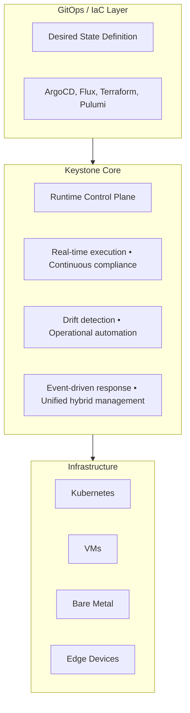
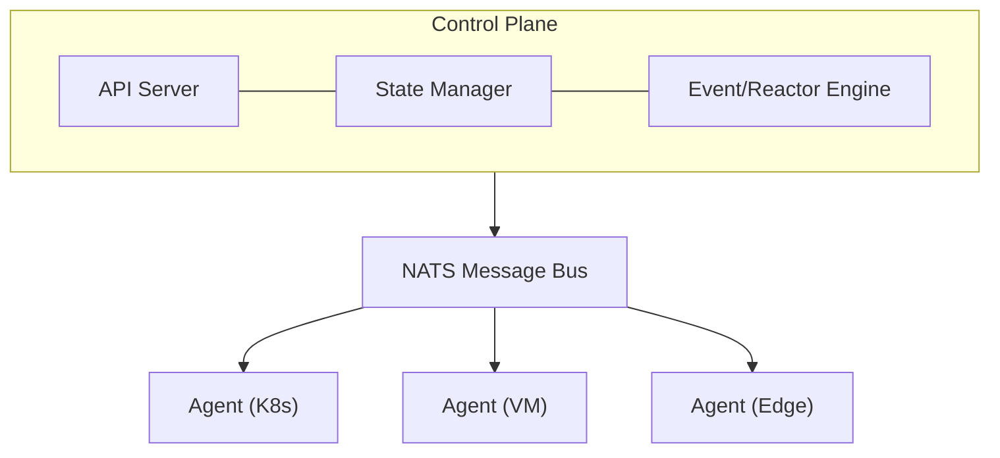
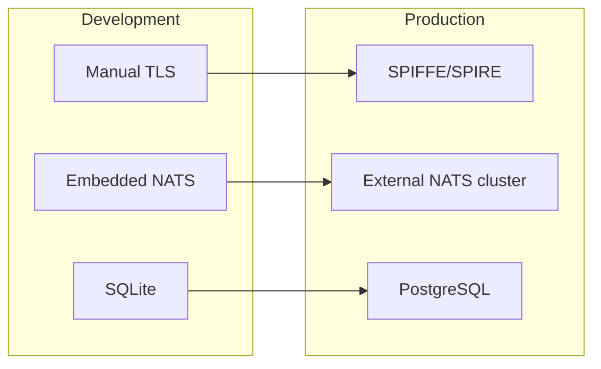

# Keystone Core Design Document

## Executive Summary

Keystone Core is a cloud-native runtime infrastructure control plane that provides real-time execution, continuous compliance, and operational automation across hybrid environments. It complements GitOps and Infrastructure-as-Code tools by managing what happens between deployments.

**Tagline**: *GitOps deploys it. We keep it running.*

## Market Position & Why This is Needed

### The Gap in Modern Infrastructure Management

Modern infrastructure teams use a combination of tools:
- **GitOps** (ArgoCD, Flux): Declarative application deployment
- **Infrastructure-as-Code** (Terraform, Pulumi): Declarative infrastructure provisioning
- **Configuration Management** (Ansible): Ad-hoc configuration and deployment

However, a critical gap exists in the operational layer:

#### Problems Keystone Core Solves

**1. The GitOps Deployment Gap**
- GitOps handles "what should be deployed" but not "what happens after"
- No real-time verification that deployed state matches desired state
- Manual drift detection and remediation
- Slow response to runtime issues (commit → PR → merge → deploy cycle)

**2. Real-time Operations at Scale**
- Ansible doesn't scale well beyond 1000+ nodes
- No good solution for "execute this NOW across 5000 servers"
- Incident response requires ad-hoc scripts or manual intervention
- Coordinated operations across hybrid infrastructure are complex

**3. Continuous Compliance & Drift**
- Runtime drift happens between deployments (manual changes, failed updates, security violations)
- Compliance checking only at deployment time, not continuously
- No automated remediation of policy violations
- Audit requirements need real-time enforcement, not eventual consistency

**4. Hybrid Infrastructure Complexity**
- Teams manage Kubernetes clusters, VMs, bare metal, edge devices
- Different tools for different environments
- No unified operational control plane
- Inconsistent policy enforcement across infrastructure types

### How Keystone Core Augments Existing Tools

Keystone Core is **not a replacement** for GitOps or IaC - it's the **operational layer** that ensures they run reliably.



### Comparison Matrix

| Capability | GitOps/IaC | Ansible | Keystone Core |
|------------|------------|---------|------------|
| Deployment speed | Minutes | Minutes | Seconds |
| Scale (nodes) | Unlimited | ~500 | 10,000+ |
| Real-time execution | ❌ | ❌ | ✅ |
| Continuous compliance | ❌ | ❌ | ✅ |
| Event-driven | Limited | ❌ | ✅ |
| Hybrid infra | Separate tools | ✅ | ✅ |
| GitOps integration | N/A | Manual | Native |
| Declarative state | ✅ | ✅ | ✅ |
| Imperative actions | ❌ | ✅ | ✅ |

## High-Level Architecture

### Core Components



### Key Architectural Decisions

**1. NATS as Message Bus**
- Proven scalability (millions of messages/sec)
- **Embedded mode** for initial setups, small deployments, and agents (zero external dependencies)
- External cluster mode for production scale and high availability
- Leaf nodes for edge/disconnected scenarios
- JetStream for persistence and event sourcing
- Seamless migration path from embedded to external cluster as deployments grow

**2. Written in Go**
- Single static binary (no runtime dependencies)
- Excellent performance and low resource usage
- Cross-platform support
- Strong concurrency primitives
- Large ecosystem for cloud-native integration

**3. Agent-Based Architecture**
- Lightweight agents on managed nodes
- Pull and push modes supported
- Secure by default (mutual TLS)
- Self-healing and auto-reconnection
- Local execution prevents network dependency

**4. API-First Design**
- Everything accessible via API
- CLI wraps API calls
- Easy integration with existing tools
- OpenAPI/Swagger documentation
- Event streaming via WebSockets

### NATS Deployment Modes

Keystone Core supports flexible NATS deployment strategies to match operational requirements:

**Embedded Mode** (Recommended for getting started)
- NATS server runs in-process with control plane or agent
- Zero external dependencies - single binary deployment
- Ideal for:
  - Development and testing environments
  - Small deployments (<100 nodes)
  - Edge agents in disconnected scenarios
  - Quick proof-of-concept installations
- Automatic upgrade path to external NATS cluster
- Full JetStream support for local persistence

**External Cluster Mode** (Recommended for production)
- Dedicated NATS cluster infrastructure
- High availability with automatic failover
- Ideal for:
  - Production deployments (100+ nodes)
  - Multi-region infrastructures
  - Environments requiring guaranteed uptime
  - Shared NATS infrastructure across multiple Keystone Core instances
- Supports NATS clustering and JetStream replication

**Hybrid Mode**
- Control plane uses external NATS cluster
- Agents use embedded NATS with leaf node connections
- Ideal for:
  - Edge computing with intermittent connectivity
  - Multi-cloud deployments
  - Geographically distributed infrastructure
- Agents maintain local queue during network partitions

### State Storage Deployment Modes

Keystone Core provides flexible storage options following the same zero-dependencies philosophy:

**SQLite Mode** (Recommended for getting started)
- Embedded database - zero external dependencies
- Single-file storage with ACID guarantees
- Ideal for:
  - Development and testing environments
  - Small deployments (<100 nodes)
  - Home labs and proof-of-concept installations
  - Quick setup without infrastructure overhead
- Full-featured with proper indexing and query support
- Automated migration tooling to PostgreSQL when scaling up

**PostgreSQL Mode** (Recommended for production)
- External database for high availability
- Advanced features: replication, point-in-time recovery
- Ideal for:
  - Production deployments (100+ nodes)
  - High availability requirements
  - Multi-instance Keystone Core deployments
  - Enterprise environments
- Seamless migration from SQLite with zero downtime

**Design Rationale: Why Not JetStream for State?**
- JetStream is perfect for events and messaging (temporal, ordered data)
- State requires: complex queries, secondary indexes, transactional semantics, relational joins
- SQLite/PostgreSQL provide mature query optimization and ACID guarantees
- This separation of concerns follows best practices: events in NATS, operational state in relational DB

## Feature Categories

Keystone Core combines proven Salt Project-like capabilities with modern cloud-native features:

### Core Salt Project-Like Features

1. **Remote Execution** - Run commands across infrastructure instantly
2. **State Management** - Declarative configuration with idempotent execution
3. **Event System** - Pub/sub event bus for system events
4. **Targeting** - Flexible node selection (facts, roles, attributes)
5. **Vars System** - Configuration data distribution

### Modern Cloud-Native Features

6. **GitOps Integration** - Native integration with ArgoCD, Flux, Git webhooks
7. **Policy Enforcement** - Continuous compliance with OPA/CEL
8. **Kubernetes Native** - Operator mode, CRDs, pod exec, service mesh integration
9. **Observability** - Prometheus metrics, OpenTelemetry, structured logging
10. **Multi-Environment** - Unified management of K8s, VMs, bare metal, edge

### Operational Excellence Features

11. **Workflow Orchestration** - Complex multi-step operations with dependencies
12. **Drift Detection** - Continuous monitoring and auto-remediation
13. **Rollback Capabilities** - Automated rollback on failures
14. **Break-Glass Operations** - Emergency access with full audit trail
15. **Secret Management** - Integration with Vault, K8s secrets, cloud KMS

### Extensibility & Security Features

16. **Plugin System** - Secure, sandboxed plugins (Starlark/WASM) with capability-based security
17. **Cryptographic Verification** - Cosign signatures and SumDB-style transparency for plugins
18. **Deterministic Execution** - Pure, side-effect-free plugin logic with auditable behavior

## Use Cases

### 1. Deployment Verification
```
ArgoCD deploys new version → Keystone Core verifies health across fleet
→ Detects errors → Triggers automated rollback via GitOps
```

### 2. Incident Response
```
Alert: Memory leak detected → Keystone Core gathers diagnostics from 500 pods
→ Restarts affected services → Coordinates traffic shift → All in <60s
```

### 3. Continuous Compliance
```
Security policy: No containers run as root → Keystone Core continuously monitors
→ Kills violating pods → Alerts security team → Blocks re-deployment
```

### 4. Coordinated Maintenance
```
Maintenance window → Keystone Core drains nodes by zone → Applies updates
→ Verifies health → Returns to service → Moves to next zone
```

### 5. Hybrid Infrastructure Management
```
Single command → Execute across K8s pods, VMs, bare metal, edge devices
→ Unified reporting → Consistent policy enforcement
```

## Technology Stack

### Core Technologies
- **Language**: Go 1.21+
- **Message Bus**: NATS 2.10+ with JetStream (embedded or external cluster)
- **Storage**: SQLite (embedded) or PostgreSQL for state
- **API**: gRPC + REST (gRPC-gateway)
- **Security**: mTLS, RBAC, audit logging

### Integration Technologies
- **Kubernetes**: client-go, controller-runtime
- **GitOps**: ArgoCD API, Flux controllers
- **Policy**: Open Policy Agent (OPA), CEL
- **Observability**: Prometheus, OpenTelemetry, Grafana
- **Secrets**: HashiCorp Vault, cloud KMS providers

## Security Model

Keystone Core follows the same "simple → production" philosophy for security as it does for NATS and storage. Two security modes are supported, allowing users to start simple and upgrade to zero-trust as they scale.

### Manual TLS Mode (Default)

**Purpose**: Zero dependencies for getting started, development, testing, and small deployments.

**How it works:**
- Static CA and certificates generated via `pkg/security/tls.go`
- Control plane generates CA on first startup
- Agents receive signed certificates during registration
- Certificates stored on disk, manually rotated
- Traditional mTLS between agents and control plane

**Best for:**
- Development and testing environments
- Small deployments (<100 nodes)
- Air-gapped environments without external dependencies
- Quick proof-of-concept deployments

**Configuration:**
```yaml
security:
  mode: manual
  manual:
    ca_cert: /etc/kscore/ca.pem
    ca_key: /etc/kscore/ca-key.pem
    server_cert: /etc/kscore/server.pem
    server_key: /etc/kscore/server-key.pem
    cert_validity: 8760h  # 1 year
```

**Limitations:**
- Manual certificate rotation required
- No automatic identity attestation
- Static credentials (compromise risk)
- Certificate distribution to agents needed

### SPIFFE/SPIRE Mode (Production)

**Purpose**: Zero-trust security with automatic identity provisioning and rotation for production deployments.

**How it works:**
- SPIRE server runs alongside Keystone Core control plane
- SPIRE agents run alongside Keystone Core agents
- Workload attestation proves agent identity without secrets
- SVIDs (SPIFFE Verifiable Identity Documents) auto-rotate every 1 hour
- Cryptographic identities encode agent metadata (role, labels, environment)

**Best for:**
- Production deployments (100+ nodes)
- Compliance-required environments (SOC2, PCI-DSS, HIPAA)
- Multi-cloud and hybrid infrastructure
- Service mesh integration (Istio, Linkerd, Consul)
- Plugin system with privileged modules (Epic 9)

**Configuration:**
```yaml
security:
  mode: spire
  spire:
    server_address: unix:///tmp/spire-server/api.sock
    trust_domain: kscore.local

    # Workload attestation method (platform-specific)
    node_attestor: k8s_sat  # Kubernetes Service Account Token
    # Alternatives: aws_iid (AWS Instance Identity)
    #               gcp_iit (GCP Instance Identity)
    #               unix (Unix process UID/GID)
    #               x509pop (X.509 Proof of Possession)

    # SPIFFE ID template for agents
    agent_spiffe_id_template: "spiffe://{{.TrustDomain}}/agent/{{.AgentID}}"
```

**Benefits:**
- **Automatic rotation**: SVIDs rotate every hour without downtime
- **No secret distribution**: Agents prove identity via platform attestation
- **Zero-trust by default**: Every connection requires valid SPIFFE identity
- **Service mesh ready**: Native integration with Istio, Linkerd, Consul
- **Cryptographic identity**: SPIFFE IDs encode role, environment, labels
- **Immediate revocation**: Compromised identities revoked in real-time
- **Audit compliance**: Full identity lifecycle logging

**SPIFFE Identity Examples:**
```
# Control plane server
spiffe://kscore.local/server/control-plane

# Agent on Kubernetes node
spiffe://kscore.local/agent/k8s-node-123
  selectors:
    - k8s:ns:kube-system
    - k8s:sa:kscore-agent
    - label:env=prod
    - label:region=us-east-1

# Agent on AWS EC2 instance
spiffe://kscore.local/agent/i-0abc123def456
  selectors:
    - aws:account-id:123456789
    - aws:instance-id:i-0abc123def456
    - label:env=staging
    - label:vpc=vpc-xyz

# Plugin module with restricted capabilities
spiffe://kscore.local/module/vendor/firewall-manager
  selectors:
    - capability:network.configure
    - label:role=network-admin
```

**Workload Attestation by Platform:**

| Platform | Attestation Method | Identity Proof |
|----------|-------------------|----------------|
| Kubernetes | Service Account Token | K8s API validates token |
| AWS | Instance Identity Document | AWS API validates signature |
| GCP | Instance Identity Token | GCP API validates JWT |
| Azure | Managed Service Identity | Azure API validates token |
| Unix/VM | Process UID/GID | Kernel process inspection |
| SSH | Certificate | SSH CA signature verification |

### Security Mode Comparison

| Feature | Manual TLS | SPIFFE/SPIRE |
|---------|-----------|--------------|
| **Setup Complexity** | Low (single binary) | Medium (SPIRE server + agents) |
| **External Dependencies** | None | SPIRE server/agent |
| **Credential Rotation** | Manual | Automatic (hourly) |
| **Identity Attestation** | None | Platform-based |
| **Zero-Trust Ready** | No | Yes |
| **Service Mesh Integration** | Manual | Native |
| **Certificate Lifetime** | 1 year | 1 hour |
| **Revocation** | CRL/OCSP (slow) | Immediate |
| **Compliance** | Basic | Advanced (SOC2, PCI-DSS) |
| **Plugin Security** | Basic TLS | SPIFFE identity + selectors |
| **Best For** | Dev, testing, <100 nodes | Production, 100+ nodes |

### Migration Path

Keystone Core is designed to start simple and upgrade as you scale:

**Development → Production:**



**Migration steps:**
1. Deploy SPIRE server alongside control plane
2. Deploy SPIRE agents alongside Keystone Core agents
3. Update configuration: `security.mode: spire`
4. Restart control plane (picks up SPIRE workload API)
5. Agents auto-register with SPIRE-issued SVIDs
6. Old manual TLS certificates expire naturally

**Zero-downtime migration:**
- Control plane accepts both manual TLS and SPIRE connections during migration
- Agents migrate on rolling restart basis
- Configuration flag: `security.allow_legacy_tls: true`

### Security Integration Points

**1. Agent Authentication (Epic 1)**
- Agents authenticate to control plane via mTLS
- SPIRE mode: Agent identity proven via platform attestation
- Manual mode: Agent uses static certificate

**2. Command Authorization (Epic 2)**
- Commands authorized based on agent identity
- SPIRE selectors enable fine-grained RBAC
- Example: Only agents with `label:role=db-admin` can run database commands

**3. Policy Enforcement (Epic 6)**
- Policies reference SPIFFE identities and selectors
- Example policy: "Agents without `label:compliant=true` cannot execute privileged commands"

**4. Module System (Epic 9)**
- Modules must present valid SPIFFE identity to load
- Control plane validates module signature AND SPIFFE selectors
- Example: Firewall module requires `capability:network.configure` selector

**5. Service Mesh Integration (Epic 8)**
- Keystone Core shares SPIRE trust domain with Istio/Linkerd
- Agents can authenticate to mesh services
- Unified zero-trust across infrastructure and application layers

### Security Recommendations

**Development/Testing:**
- Use `manual` mode for speed and simplicity
- Embedded NATS + SQLite + manual TLS = single binary, no dependencies

**Production (<100 nodes):**
- Consider `manual` mode if:
  - No compliance requirements
  - Air-gapped environment
  - Simplified operations preferred
- Implement certificate rotation automation

**Production (100+ nodes, compliance required):**
- Use `spire` mode for:
  - Zero-trust security posture
  - Automatic credential rotation
  - Compliance requirements (SOC2, PCI-DSS, HIPAA)
  - Service mesh integration
  - Plugin system with privileged modules

**Enterprise:**
- SPIRE mode required
- External NATS cluster for HA
- PostgreSQL with replication
- Multi-region SPIRE federation

## Success Metrics

### Adoption Metrics
- Time to first successful remote execution: <5 minutes
- Number of nodes managed per installation
- Multi-environment adoption rate (K8s + VMs)

### Performance Metrics
- Command execution latency: <100ms to 1000 nodes
- Event processing throughput: >100k events/sec
- State application time: <30s for 5000 nodes

### Operational Metrics
- Drift detection time: <60s from occurrence
- Incident response time reduction: >70%
- Compliance violation detection rate: 100%

## Project Phases

### Phase 1: Core Foundation (MVP)
- NATS integration and agent communication
- Remote execution engine
- Basic state management
- CLI and API server

### Phase 2: GitOps Integration
- Event receivers from ArgoCD/Flux
- Deployment verification workflows
- Rollback capabilities
- Webhook support

### Phase 3: Policy & Compliance
- OPA integration
- Continuous compliance monitoring
- Drift detection and remediation
- Audit logging

### Phase 4: Multi-Environment
- Kubernetes operator mode
- VM/bare metal support
- Edge computing scenarios
- Unified targeting

### Phase 5: Enterprise Features
- RBAC and multi-tenancy
- High availability and disaster recovery
- Advanced workflow orchestration
- Enterprise integrations

## Competitive Differentiation

**vs. Ansible**
- 10x faster execution at scale
- Real-time vs. sequential execution
- Event-driven automation
- Better GitOps integration

**vs. Salt Project**
- Modern Go implementation (single binary)
- Cloud-native first (K8s, service mesh)
- Active development and community
- Clear open-source licensing

**vs. Kubernetes Operators**
- Works across all infrastructure types
- Not limited to K8s resources
- Operational commands, not just state management
- Unified interface for hybrid environments

## Open Source Strategy

- **License**: Apache 2.0
- **Repository**: GitHub with public roadmap
- **Community**: Discord, monthly community calls
- **Documentation**: Comprehensive docs site with tutorials
- **Extensions**: Plugin system for community contributions

## Next Steps

See individual epic documents in `/epics` for detailed implementation plans:

1. Core Infrastructure (`epics/01-core-infrastructure.md`)
2. Remote Execution (`epics/02-remote-execution.md`)
3. State Management (`epics/03-state-management.md`)
4. Event System (`epics/04-event-system.md`)
5. GitOps Integration (`epics/05-gitops-integration.md`)
6. Policy Enforcement (`epics/06-policy-enforcement.md`)
7. Observability (`epics/07-observability.md`)
8. Multi-Environment Support (`epics/08-multi-environment.md`)
9. Plugin System & Extensibility (`epics/09-plugin-system.md`)
