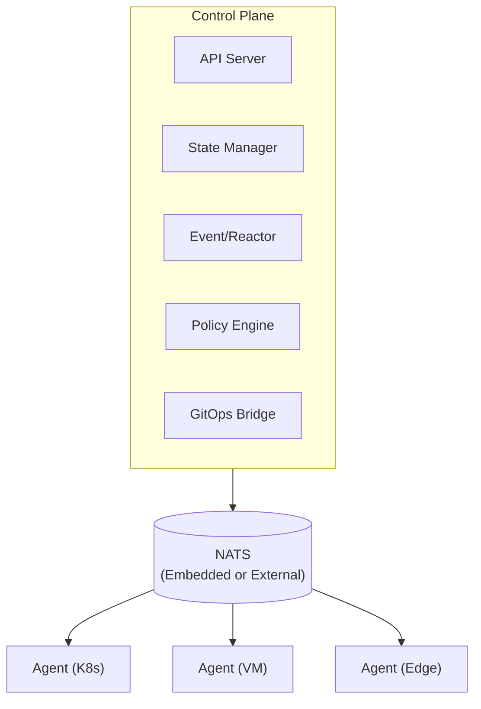

# Keystone Core

**GitOps deploys it. We keep it running.**

Keystone Core is a cloud-native runtime infrastructure control plane that provides real-time execution, continuous compliance, and operational automation across hybrid environments. Inspired by Salt Project but modernized for cloud-native workflows.

## Project Status

| Status | Description |
|--------|-------------|
| **Epics 1-10** | COMPLETE |
| **Epic 11** | IN PROGRESS (Clustering - Phase 1 complete) |
| **Epic 12** | PLANNED (E2E & Performance Testing) |

### Completed Capabilities

- **Core Infrastructure** - NATS messaging (embedded/external/leaf modes), SQLite/PostgreSQL storage
- **Remote Execution** - Cross-platform command execution with flexible targeting and batch operations
- **State Management** - Declarative configuration with 6 modules, drift detection, and remediation
- **Event-Driven Automation** - Event bus, filtering, routing, reactors, and external integration (Kafka, CloudEvents)
- **GitOps Integration** - ArgoCD/Flux webhooks, deployment verification, rollback automation, promotion pipelines
- **Policy Enforcement** - OPA (Rego) and CEL policy engines, auditing, and compliance reporting
- **Observability** - Prometheus metrics, structured logging, OpenTelemetry tracing, TUI monitor, Grafana dashboards
- **Multi-Environment** - Kubernetes, VMs, bare metal, edge devices, cloud (AWS/GCP/Azure), service mesh
- **Plugin System** - Starlark and WASM runtimes, capability-based security, cryptographic verification, SDKs
- **Documentation** - Hugo + Docsy site with 45 pages of comprehensive documentation

## Quick Start

### Prerequisites

- Go 1.21 or later
- Make

### Build

```bash
# Build all binaries
make build
```

### Run Server (Zero Dependencies)

```bash
# Run with embedded NATS + SQLite (no external services needed)
./bin/kscore-server
```

### Run Agent

```bash
# Run agent (connects to control plane)
./bin/kscore-agent
```

### Execute Commands

```bash
# Run command on all Linux agents
./bin/kscorectl exec run "uptime" --target "os:linux"

# Run on specific agents by glob pattern
./bin/kscorectl exec run "df -h" --target "hostname:web-*"
```

### Apply State

```bash
# Apply declarative state configuration
./bin/kscorectl state apply /path/to/state.yaml

# Check for drift without applying changes
./bin/kscorectl state check /path/to/state.yaml

# Detect configuration drift
./bin/kscorectl state drift /path/to/state.yaml
```

### Monitor System

```bash
# Launch real-time TUI monitor
./bin/kscorectl monitor
```

## CLI Tools

| Binary | Description |
|--------|-------------|
| `kscorectl` | Main CLI tool (plugin dispatcher, like git) |
| `kscore-server` | Control plane daemon |
| `kscore-agent` | Agent daemon for managed nodes |
| `kscore-exec` | Remote execution plugin |
| `kscore-state` | State management plugin |
| `kscore-monitor` | Real-time TUI monitoring (8 views) |

## Architecture



## Key Features

### Remote Execution
- Cross-platform shell abstraction (Bash, PowerShell, Cmd)
- Flexible targeting: glob patterns, label selectors, compound expressions
- Parallel batch execution across thousands of agents
- Streaming output with job tracking

### State Management
- Six built-in modules: `file`, `package`, `service`, `user`, `group`, `cmd`
- Dependency resolution with requisites (`require`, `watch`, `prereq`, `onchanges`)
- Template rendering with vars and facts
- Drift detection with severity levels

### Event System
- 15 event types across 5 categories (agent, job, state, system, user)
- CEL-based event filtering and routing
- Reactor system for automated responses
- External integration: Kafka, CloudEvents, webhooks

### Policy Enforcement
- Dual engine support: OPA (Rego) and CEL
- Enforcement modes: Enforce, Audit, Warn
- Comprehensive audit logging
- Compliance reporting with violation tracking

### GitOps Integration
- Webhook handlers for ArgoCD, Flux, GitHub, GitLab
- Deployment verification framework
- Automated rollback with approval workflows
- Multi-environment promotion pipelines

### Observability
- Prometheus metrics (70+ metrics)
- Structured logging with correlation IDs
- OpenTelemetry distributed tracing
- TUI monitor with 8 interactive views
- Pre-built Grafana dashboards

### Multi-Environment Support
- **Kubernetes**: CRDs, operators, pod execution
- **VMs**: Platform detection, cross-distro package/service management
- **Bare Metal**: Hardware detection, BMC/IPMI integration
- **Edge**: Offline mode, local caching, connection resilience
- **Cloud**: AWS, GCP, Azure metadata and detection
- **Service Mesh**: Istio, Linkerd, Consul integration

### Plugin System
- **Starlark Runtime**: Python-like sandboxed scripting
- **WASM Runtime**: High-performance modules in Rust/Go/C++
- **Capability-Based Security**: Explicit permission grants
- **Cryptographic Verification**: Cosign signatures, SumDB transparency
- **SDKs**: Starlark, Rust, Go (TinyGo), C++ SDKs included

## Configuration

### NATS Modes

| Mode | Use Case | Description |
|------|----------|-------------|
| **Embedded** | Dev, small deployments | In-process NATS, zero dependencies |
| **External** | Production | Connect to NATS cluster for HA |
| **Leaf** | Edge deployments | Embedded NATS as leaf node, works offline |

### Storage Backends

| Backend | Use Case | Description |
|---------|----------|-------------|
| **SQLite** | Dev, small deployments | Embedded, zero configuration |
| **PostgreSQL** | Production | HA, replication, scalable |

See `keystone-core.yaml.example` for all configuration options.

## Project Structure

```
keystone-core/
├── cmd/
│   ├── kscore-server/        # Control plane daemon
│   ├── kscore-agent/         # Agent daemon
│   ├── kscorectl/            # Main CLI (plugin dispatcher)
│   ├── kscore-exec/          # Remote execution plugin
│   ├── kscore-state/         # State management plugin
│   └── kscore-monitor/       # TUI monitoring tool
├── pkg/
│   ├── agent/                # Agent implementation
│   ├── controlplane/         # Control plane services
│   ├── state/                # SQLite/PostgreSQL storage
│   ├── statemgmt/            # State declarations, modules, drift
│   ├── events/               # Event bus, reactors, storage
│   ├── policy/               # OPA/CEL engines, enforcement
│   ├── gitops/               # Webhooks, verification, rollback
│   ├── metrics/              # Prometheus metrics
│   ├── logging/              # Structured logging
│   ├── tracing/              # OpenTelemetry tracing
│   ├── health/               # Health checks, circuit breaker
│   ├── k8s/                  # Kubernetes integration
│   ├── platform/             # OS/distro detection
│   ├── baremetal/            # Hardware detection, IPMI
│   ├── edge/                 # Edge mode, offline support
│   ├── cloud/                # AWS, GCP, Azure integration
│   ├── container/            # Docker, containerd detection
│   ├── servicemesh/          # Istio, Linkerd, Consul
│   ├── module/               # Plugin system
│   │   ├── runtime/          # Starlark and WASM runtimes
│   │   ├── capabilities/     # Capability implementations
│   │   ├── resolver/         # Dependency resolution
│   │   └── verify/           # Signature verification
│   └── cluster/              # HA clustering (Epic 11)
├── modules/
│   ├── sdk/                  # SDKs (Starlark, Rust, Go, C++)
│   ├── stdlib/               # Standard library modules
│   └── examples/             # Example modules
├── deploy/
│   └── grafana/              # Grafana dashboards and alerts
├── docs/                     # Hugo + Docsy documentation
├── epics/                    # Epic design documents
└── api/proto/                # Protobuf definitions
```

## Documentation

Full documentation is available in the `docs/` directory (Hugo + Docsy):

```bash
cd docs && hugo server
```

### Documentation Sections

- **Getting Started**: Installation, quick start, architecture overview
- **Core Concepts**: Control plane, agents, state management, events, policy
- **Reference**: API, CLI, configuration, modules, events, metrics
- **Operations**: Deployment, monitoring, maintenance, security
- **Community**: Contributing, development guide, roadmap

## Development

### Running Tests

```bash
# Run all tests
make test

# Run with coverage
go test -cover ./...
```

### Test Coverage

Core packages maintain >75% test coverage:
- `pkg/agent`: 77.9%
- `pkg/state`: 90.1%
- `pkg/config`: 96.6%
- `pkg/controlplane`: 85.9%
- `pkg/events`: 80%+
- `pkg/policy`: 79%+

### Building Documentation

```bash
cd docs
hugo server  # Local development
hugo         # Build to docs/public/
```

## Roadmap

| Epic | Status | Description |
|------|--------|-------------|
| 1-10 | Complete | Core functionality |
| 11 | In Progress | HA clustering with etcd |
| 12 | Planned | E2E and performance testing |

See `epics/` directory for detailed implementation plans.

## License

Apache 2.0

## Contributing

See the [Contributing Guide](docs/content/en/docs/community/contributing.md) for development setup and contribution workflow.
