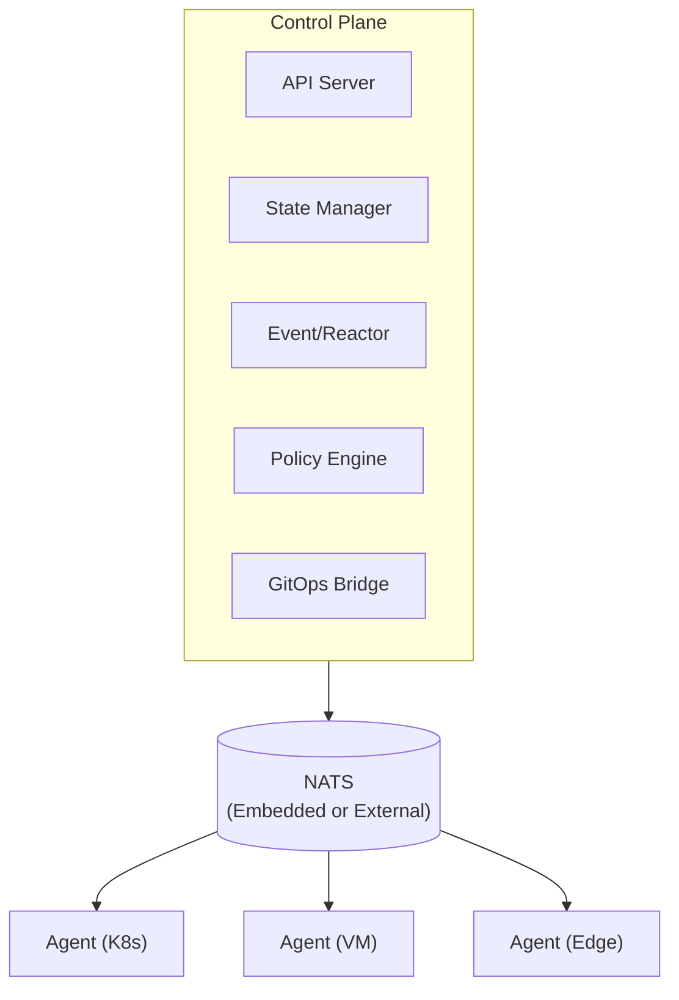

# Keystone Core

[](LICENSE)
[](https://go.dev/)
[](docs/project/AI-CONTRIBUTIONS.md)
[](CONTRIBUTING.md)

**GitOps deploys it. We keep it running.**

Keystone Core is a cloud-native runtime infrastructure control plane that provides real-time execution, continuous compliance, and operational automation across hybrid environments. Inspired by Salt Project but modernized for cloud-native workflows.

## Project Status

---
>## 🚧 Early Preview / Not Production Ready
>
> Keystone Core is under active development and **not yet suitable for production**.
>
> **We welcome early testers!**  
> Try it in your lab or homelab and please share feedback, open issues, or propose features
---


| Status         | Description |
|----------------|-------------|
| **Epics 1-29** | COMPLETE |
| **Epic 30-31** | PLANNED |

### Completed Capabilities

- **Core Infrastructure** - NATS messaging (embedded/external/leaf/supercluster), SQLite/PostgreSQL storage
- **Remote Execution** - Cross-platform command execution with flexible targeting and batch operations
- **State Management** - Declarative configuration with 94 modules, drift detection, and remediation
- **Event-Driven Automation** - Event bus, filtering, routing, reactors, external integration (Kafka, CloudEvents)
- **GitOps Integration** - ArgoCD/Flux webhooks, deployment verification, rollback automation, promotion pipelines
- **Policy Enforcement** - OPA (Rego) and CEL policy engines, auditing, and compliance reporting
- **Observability** - Prometheus metrics, structured logging, OpenTelemetry tracing, TUI monitor, Grafana dashboards
- **Multi-Environment** - Kubernetes, VMs, bare metal, edge devices, cloud (AWS/GCP/Azure), service mesh
- **Plugin System** - Starlark and WASM runtimes, capability-based security, cryptographic verification, SDKs
- **HA Clustering** - etcd-based coordination, leader election, automatic failover, work distribution
- **NATS Mesh** - Superclusters, leaf nodes, WebSocket transport, NAT traversal, discovery
- **SPIFFE Identity** - Embedded provider, SPIRE/cloud/mesh integration, trust federation
- **Telemetry Gateway** - Aggregates metrics/logs/traces from isolated agents for Prometheus/Loki/Tempo
- **Windows Support** - Native Windows agent, PowerShell execution, Windows state modules
- **IPv6 Support** - Full dual-stack networking across all components
- **Proxy Agents** - Manage unmanaged devices via SSH, SNMP, REST, WinRM; network device support (Cisco, Juniper, Arista)
- **File Distribution** - NATS-based file server, multiple backends (S3/GCS/Azure/Git), mirror groups, proxy caching
- **Self-Management** - Bootstrap from scratch, backup/restore, rolling/canary upgrades, self-management states, operational runbooks
- **Document Review** - Documentation validation, example testing, gap analysis
- **Blueprints** - Pre-packaged, reusable state collections with standard catalog
- **Documentation** - Hugo + Docsy site with comprehensive documentation

## Frequently Asked Questions (FAQ)

### Q: Why does this exist?
Existing automation tools either do too little or too much, or require heavy cloud-native abstractions for simple deployments.
Also, "deploying a stack" and "maintaining a stack" are not the same thing. Neither should require large teams with complex incantations to complete.

### Q: Is this production-ready?
Not yet. We're just getting stated. If you need something like this for production, setup Keystone Core in a home lab and give us some feedback.


## Contributing
Contributions are welcome. Issues, pull requests, and design discussions help steer the direction of the project. Please maintain clarity, functionality, and testability in all contributions.

### Q: Can I use AI-generated code or documentation?
Yes. AI-generated contributions are welcome as long as they meet quality standards, follow our [Developer Certificate of Origin](docs/project/DCO.md),  [AI Contributions Policy](docs/project/AI-CONTRIBUTIONS.md), and other policies.  Of course, humans are still responsible for the consequences.

## Quick Start

### Prerequisites

- Go 1.25 or later
- Make

### Build

```bash
# Build all binaries
make build
```

### Run Server (Zero Dependencies)

```bash
# Run with embedded NATS + SQLite (no external services needed)
./bin/kscore-server
```

### Run Agent

```bash
# Run agent (connects to control plane)
./bin/kscore-agent
```

### Execute Commands

```bash
# Run command on all Linux agents
./bin/kscorectl exec run "uptime" --target "os:linux"

# Run on specific agents by glob pattern
./bin/kscorectl exec run "df -h" --target "hostname:web-*"
```

### Apply State

```bash
# Apply declarative state configuration
./bin/kscorectl state apply /path/to/state.yaml

# Check for drift without applying changes
./bin/kscorectl state check /path/to/state.yaml

# Detect configuration drift
./bin/kscorectl state drift /path/to/state.yaml
```

### Monitor System

```bash
# Launch real-time TUI monitor
./bin/kscorectl monitor
```

## CLI Tools

| Binary                     | Description                                    |
|----------------------------|------------------------------------------------|
| `kscorectl`                | Main CLI tool (plugin dispatcher, like git)    |
| `kscore-server`            | Control plane daemon                           |
| `kscore-agent`             | Agent daemon for managed nodes                 |
| `kscore-exec`              | Remote execution plugin                        |
| `kscore-state`             | State management plugin                        |
| `kscore-monitor`           | Real-time TUI monitoring (8 views)             |
| `kscore-module`            | Module management (init, build, sign, publish) |
| `kscore-policy`            | Policy management and evaluation               |
| `kscore-gitops`            | GitOps operations and webhooks                 |
| `kscore-cluster`           | Cluster management and status                  |
| `kscore-identity`          | SPIFFE identity and certificate management     |
| `kscore-migrate`           | Database migration (SQLite → PostgreSQL)       |
| `kscore-registry`          | Module registry server                         |
| `kscore-telemetry-gateway` | Telemetry aggregation for isolated agents      |
| `kscore-blueprint`         | Blueprint management (init, install, publish)  |
| `kscore-bootstrap`         | Cluster bootstrap and setup                    |
| `kscore-files`             | File distribution management                   |

## Architecture



## Key Features

### Remote Execution
- Cross-platform shell abstraction (Bash, PowerShell, Cmd)
- Flexible targeting: glob patterns, label selectors, compound expressions
- Parallel batch execution across thousands of agents
- Streaming output with job tracking

### State Management
- 94 built-in modules across 14 categories (file, package, service, user, network, firewall, storage, containers, databases, web servers, certificates, and more)
- Dependency resolution with requisites (`require`, `watch`, `prereq`, `onchanges`)
- Template rendering with vars and facts
- Drift detection with severity levels
- Cross-platform support (Linux, macOS, Windows)

### Event System
- 15 event types across 5 categories (agent, job, state, system, user)
- CEL-based event filtering and routing
- Reactor system for automated responses
- External integration: Kafka, CloudEvents, webhooks

### Policy Enforcement
- Dual engine support: OPA (Rego) and CEL
- Enforcement modes: Enforce, Audit, Warn
- Comprehensive audit logging
- Compliance reporting with violation tracking

### GitOps Integration
- Webhook handlers for ArgoCD, Flux, GitHub, GitLab
- Deployment verification framework
- Automated rollback with approval workflows
- Multi-environment promotion pipelines

### Observability
- Prometheus metrics (70+ metrics)
- Structured logging with correlation IDs
- OpenTelemetry distributed tracing
- TUI monitor with 8 interactive views
- Pre-built Grafana dashboards

### Multi-Environment Support
- **Kubernetes**: CRDs, operators, pod execution
- **VMs**: Platform detection, cross-distro package/service management
- **Bare Metal**: Hardware detection, BMC/IPMI integration
- **Edge**: Offline mode, local caching, connection resilience
- **Cloud**: AWS, GCP, Azure metadata and detection
- **Service Mesh**: Istio, Linkerd, Consul integration

### Plugin System
- **Starlark Runtime**: Python-like sandboxed scripting
- **WASM Runtime**: High-performance modules in Rust/Go/C++
- **Capability-Based Security**: Explicit permission grants
- **Cryptographic Verification**: Cosign signatures, SumDB transparency
- **SDKs**: Starlark, Rust, Go (TinyGo), C++ SDKs included

### High Availability
- **etcd-based Clustering**: Distributed coordination and leader election
- **Automatic Failover**: Agent reassignment on control plane failure
- **Work Distribution**: Consistent hashing for agent-to-server assignment
- **NATS Superclusters**: Multi-region deployment with gateway routing

### Identity & Security
- **SPIFFE Identity**: Zero-config embedded provider or external SPIRE
- **Trust Federation**: Cross-domain identity validation
- **Cloud Integration**: AWS IAM, GCP Workload Identity, Azure MI
- **Service Mesh**: Istio, Linkerd, Consul Connect identity extraction

### Proxy Agents
- **Protocol Adapters**: SSH, SNMP v2c/v3, REST/HTTP, WinRM
- **Network Device Support**: Cisco IOS/NX-OS, Juniper JUNOS, Arista EOS, VyOS, pfSense, OPNsense
- **Credential Management**: Vault, Kubernetes secrets, encrypted file storage
- **Discovery**: Automatic device discovery with approval workflows
- **State Modules**: Execute state configurations through proxy protocols

## Configuration

### NATS Modes

| Mode         | Use Case               | Description                               |
|--------------|------------------------|-------------------------------------------|
| **Embedded** | Dev, small deployments | In-process NATS, zero dependencies        |
| **External** | Production             | Connect to NATS cluster for HA            |
| **Leaf**     | Edge deployments       | Embedded NATS as leaf node, works offline |

### Storage Backends

| Backend        | Use Case               | Description                  |
|----------------|------------------------|------------------------------|
| **SQLite**     | Dev, small deployments | Embedded, zero configuration |
| **PostgreSQL** | Production             | HA, replication, scalable    |

See `keystone-core.yaml.example` for all configuration options.

## Project Structure

```
keystone-core/
├── cmd/                      # CLI tools and daemons
│   ├── kscore-server/        # Control plane daemon
│   ├── kscore-agent/         # Agent daemon
│   ├── kscorectl/            # Main CLI (plugin dispatcher)
│   ├── kscore-*/             # CLI plugins (exec, state, monitor, module, policy, gitops, cluster, identity, migrate)
│   ├── kscore-registry/      # Module registry server
│   └── kscore-telemetry-gateway/  # Telemetry aggregation
├── pkg/
│   ├── agent/                # Agent implementation
│   ├── controlplane/         # Control plane services
│   ├── state/                # SQLite/PostgreSQL storage
│   ├── statemgmt/            # 94 state modules, drift detection
│   ├── events/               # Event bus, reactors, storage
│   ├── policy/               # OPA/CEL engines, enforcement
│   ├── gitops/               # Webhooks, verification, rollback
│   ├── nats/                 # NATS mesh, discovery, WebSocket
│   ├── cluster/              # HA clustering, etcd, leader election
│   ├── identity/             # SPIFFE identity, federation
│   ├── gateway/              # Telemetry gateway (metrics/logs/traces)
│   ├── metrics/              # Prometheus metrics
│   ├── logging/              # Structured logging, syslog
│   ├── tracing/              # OpenTelemetry tracing
│   ├── audit/                # CLI audit logging
│   ├── health/               # Health checks, circuit breaker
│   ├── k8s/                  # Kubernetes integration
│   ├── platform/             # OS/distro detection
│   ├── hardware/             # Hardware detection, IPMI
│   ├── edge/                 # Edge mode, offline support
│   ├── cloud/                # AWS, GCP, Azure integration
│   ├── container/            # Docker, containerd detection
│   ├── servicemesh/          # Istio, Linkerd, Consul
│   ├── proxy/                # Proxy agents, device management, discovery
│   ├── protocols/            # SSH, SNMP, REST, WinRM adapters
│   ├── vendors/              # Cisco, Juniper, Arista, VyOS, pfSense adapters
│   ├── credentials/          # Credential storage (Vault, K8s, encrypted file)
│   └── module/               # Plugin system (runtime, capabilities, resolver, verify)
├── modules/
│   ├── sdk/                  # SDKs (Starlark, Rust, Go, C++)
│   ├── stdlib/               # Standard library modules
│   └── examples/             # Example modules
├── deploy/                   # Deployment configurations
│   ├── grafana/              # Grafana dashboards and alerts
│   ├── kubernetes/           # K8s manifests
│   ├── helm/                 # Helm charts
│   └── gateway/              # Telemetry gateway deployment
├── docs/                     # Hugo + Docsy documentation
├── epics/                    # Epic design documents
├── test/e2e/                 # End-to-end tests
└── api/proto/                # Protobuf definitions
```

## Documentation

Full documentation is available in the `docs/` directory (Hugo + Docsy):

```bash
cd docs && hugo server
```

### Documentation Sections

- **Getting Started**: Installation, quick start, architecture overview
- **Core Concepts**: Control plane, agents, state management, events, policy
- **Reference**: API, CLI, configuration, modules, events, metrics
- **Operations**: Deployment, monitoring, maintenance, security
- **Community**: Contributing, development guide, roadmap

## Development

### Running Tests

```bash
# Run all tests
make test

# Run with coverage
go test -cover ./...
```

### Test Coverage

Core packages maintain >75% test coverage. Key packages:
- `pkg/state`: >90%
- `pkg/config`: >95%
- `pkg/controlplane`: >85%
- `pkg/events`: >80%
- `pkg/policy`: >79%
- `pkg/identity`: >80% (332 tests)

### Building Documentation

```bash
cd docs
hugo server  # Local development
hugo         # Build to docs/public/
```

## Roadmap

| Epic  | Status   | Description                                                                                                        |
|-------|----------|--------------------------------------------------------------------------------------------------------------------|
| 1-11  | Complete | Core infrastructure, execution, state, events, GitOps, policy, observability, multi-env, plugins, docs, clustering |
| 12-13 | Complete | E2E testing infrastructure, CGO removal (pure Go)                                                                  |
| 14-15 | Complete | NATS mesh communication, observability enhancements                                                                |
| 16-17 | Complete | 84 stdlib system modules, SPIFFE identity framework                                                                |
| 18-20 | Complete | IPv6 support, telemetry gateway, Windows support                                                                   |
| 21    | Complete | Proxy agents for unmanaged devices (SSH, SNMP, REST, WinRM, vendor adapters)                                       |
| 22    | Complete | File distribution over NATS with multiple backends, mirror groups                                                  |
| 23    | Complete | Self-management (bootstrap, backup/restore, state modules, validation, upgrades, runbooks)                         |
| 24    | Complete | Documentation review, validation, example testing, gap analysis                                                    |
| 25    | Complete | Blueprints - pre-packaged, reusable state collections (design)                                                     |
| 26    | Complete | NEEDSWORK remediation - security, API, testing, documentation, code quality improvements                           |
| 27    | Complete | Agent bootstrap experience - single-binary TUI-guided bootstrap for all deployment modes                           |
| 28    | Complete | Standard deployment blueprints - 14 official blueprints for demo/production/enterprise                             |
| 29    | Complete | Bootstrap testing infrastructure - Docker-based validation across platforms        |
| 30    | Planned  | CLI UX restructuring                                                                |
| 31    | Planned  | NIST design principles - documentation only                                         |

### Future Epics

- **0.1.0 Release Readiness** - Blueprint signing, version reset, docs audit, VM validation
- **Advanced State Orchestration** - Statecharts, workflows, actors, event sourcing (see `epics/future-advanced-state-orchestration.md`)

See `epics/` directory for detailed implementation plans.

## AI-Friendly Contributions

This project welcomes AI-assisted contributions. We've established clear policies to enable transparent collaboration between human developers and AI tools while addressing the evolving legal landscape around AI-generated code.

- **Disclosure**: AI involvement must be marked in commits
- **Accountability**: Human contributors review and take responsibility for AI-generated code
- **Transparency**: No copyright claimed on purely AI-generated portions
- **Licensing**: All contributions covered under Apache 2.0

See [AI-CONTRIBUTIONS.md](docs/project/AI-CONTRIBUTIONS.md) for details and [CONTRIBUTING.md](CONTRIBUTING.md) for the full contribution guide.

## License

Apache 2.0

## Contributing

See [CONTRIBUTING.md](CONTRIBUTING.md) for development setup and contribution workflow.

## Compatibility & Support

Keystone Core follows a predictable release cadence (every 6 months) with a 2-year support window. See [COMPATIBILITY.md](docs/project/COMPATIBILITY.md) for details on:

- Versioning (SemVer) and release schedule
- Support windows and upgrade paths
- Controller ↔ Agent compatibility
- Breaking change policies

### Governance (TL;DR)

Keystone Core is run as a **technical meritocracy** with a **BDFL** (Benevolent Dictator for Life)
who guides long-term direction, architecture, and compatibility.

- **Governance:** Day-to-day decisions by maintainers; big changes go through RFCs; BDFL has final
  say on project direction and breaking changes

For details, see [GOVERNANCE.md](docs/project/GOVERNANCE.md) and [RFC.md](docs/project/RFC.md).
