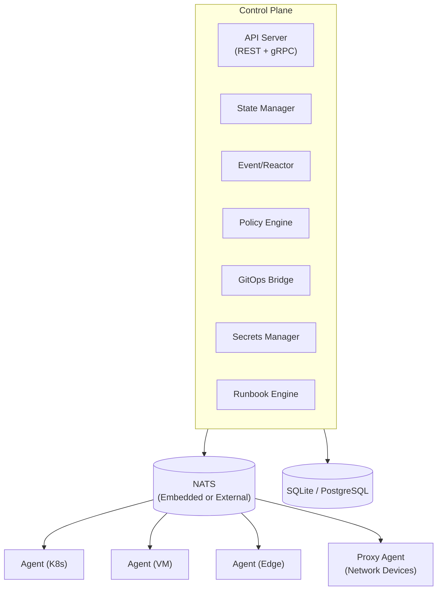

# Keystone Core

[](LICENSE)
[](https://go.dev/)
[](docs/project/AI-CONTRIBUTIONS.md)
[](CONTRIBUTING.md)

**GitOps deploys it. We keep it running.**

Keystone Core is a cloud-native runtime infrastructure control plane that provides real-time execution, continuous compliance, and operational automation across hybrid environments. Inspired by Salt Project but modernized for cloud-native workflows.

## Project Status

---
>## Early Preview / Not Production Ready
>
> Keystone Core is under active development and **not yet suitable for production**.
>
> **We welcome early testers!**
> Try it in your lab or homelab and please share feedback, open issues, or propose features
---
> ## AI Use in This Project (Transparency + Standards)
>
> Keystone-core was intentionally bootstrapped with AI assistance to accelerate early development (code, docs, scaffolding, and build tooling). The objective was speed-to-foundation: get to a working, reviewable baseline quickly—then spend sustained human effort on the last 10% (polish, scaling, validation, reliability, and maintainability).
>
> We’re upfront about this because “AI-assisted” should not imply “low quality.” The bar is the bar.
>
> **What we care about**
> - Correctness, clarity, and maintainability over cleverness
> - Reproducible builds and understandable architecture
> - Tests and verification proportional to risk
> - Security-minded changes and careful dependency choices
> - Reviewable PRs and accountable maintainers
>
> AI-assisted contributions are welcome. Please disclose meaningful AI use in your PR description (e.g., “AI helped draft X; I verified Y”) and be prepared to explain/justify changes. See [CONTRIBUTING.md](CONTRIBUTING.md) for details. If you can’t confidently review it, it doesn’t belong in main.
> ***Quality is enforced by process, not by origin.*** Contributions (human- or AI-assisted) are expected to meet the same standards: readable design, reproducible builds, tests where appropriate, security-minded changes, and reviewable diffs. Maintainers are responsible for what gets merged.


---
| Status          | Description |
|-----------------|-------------|
| **Epics 1-32**  | COMPLETE |
| **Epics 36-60** | COMPLETE |

### Completed Capabilities

- **Core Infrastructure** - NATS messaging (embedded/external/leaf/supercluster), SQLite/PostgreSQL storage, default TLS 1.3
- **Remote Execution** - Cross-platform command execution with flexible targeting and batch operations
- **State Management** - Declarative configuration with 94 modules, drift detection, and remediation
- **Event-Driven Automation** - Event bus, filtering, routing, reactors, external integration (Kafka, CloudEvents)
- **GitOps Integration** - ArgoCD/Flux webhooks, deployment verification, rollback automation, promotion pipelines
- **Policy Enforcement** - OPA (Rego) and CEL policy engines, auditing, and compliance reporting
- **Observability** - Prometheus metrics, structured logging, OpenTelemetry tracing, TUI monitor, Grafana dashboards
- **Multi-Environment** - Kubernetes, VMs, bare metal, edge devices, cloud (AWS/GCP/Azure), service mesh
- **Plugin System** - Starlark and WASM runtimes, capability-based security, cryptographic verification, SDKs
- **HA Clustering** - etcd-based coordination, leader election, automatic failover, work distribution, resilience testing
- **NATS Mesh** - Superclusters, leaf nodes, WebSocket transport, NAT traversal, discovery
- **SPIFFE Identity** - Embedded provider, SPIRE/cloud/mesh integration, trust federation
- **Telemetry Gateway** - Aggregates metrics/logs/traces from isolated agents for Prometheus/Loki/Tempo
- **Windows Support** - Native Windows agent, PowerShell execution, Windows state modules
- **IPv6 Support** - Full dual-stack networking across all components
- **Proxy Agents** - Manage unmanaged devices via 8 protocols (SSH, SNMP, REST, WinRM, NETCONF, RESTCONF, gNMI, Telnet); 20 vendor drivers (Cisco, Juniper, Arista, Fortinet, Palo Alto, F5, and more)
- **File Distribution** - NATS-based file server, multiple backends (S3/GCS/Azure/Git), mirror groups, proxy caching
- **Self-Management** - Bootstrap from scratch, backup/restore, rolling/canary upgrades, self-management states, operational runbooks
- **Blueprints** - Pre-packaged, reusable state collections with standard catalog
- **Secrets Management** - REST + gRPC API, client package, CLI, encrypted cache (AES-GCM), rotation policies, multiple backends (Vault, K8s, encrypted file)
- **Runbook Automation** - Trigger-based automation with approvals, ITSM integration, REST API, CLI
- **Kubernetes Operator** - CRD watching, reconciliation, drift detection
- **gRPC Services** - ControlPlane, Secrets, Agent, State, Event, Policy, Cluster services; 15 REST API handlers
- **Outbound Webhooks** - Persistent subscriptions, HMAC-SHA256 signing, exponential backoff retry
- **Air-Gapped Deployments** - Bootstrap packages, offline registry, upgrade packages, export/import data transfer, UDP data diode, compliance validation
- **MCP Server** - AI-assisted operations via `kscore-mcp` for Claude Desktop, Claude Code, Cursor; capability profiles, audit attribution
- **DNS Provider Management** - DNS record automation
- **Saga Coordinator** - Multi-step workflows with compensating transactions, resume support
- **Documentation** - Hugo + Docsy site with comprehensive documentation

## Frequently Asked Questions (FAQ)

### Q: Why does this exist?
Existing automation tools either do too little or too much, or require heavy cloud-native abstractions for simple deployments.
Also, "deploying a stack" and "maintaining a stack" are not the same thing. Neither should require large teams with complex incantations to complete.

### Q: Is this production-ready?
Not yet. We're just getting started. If you need something like this for production, set up Keystone Core in a home lab and give us some feedback.

### Q: Can I use AI-generated code or documentation?
Yes. AI-generated contributions are welcome as long as they meet quality standards, follow our [Developer Certificate of Origin](docs/project/DCO.md), [AI Contributions Policy](docs/project/AI-CONTRIBUTIONS.md), and other policies. Of course, humans are still responsible for the consequences.

## Contributing

Contributions are welcome. Issues, pull requests, and design discussions help steer the direction of the project. Please maintain clarity, functionality, and testability in all contributions.

See [CONTRIBUTING.md](CONTRIBUTING.md) for development setup and contribution workflow.

## Quick Start

### Prerequisites

- Go 1.25 or later
- Make

### Build

```bash
# Build all binaries (outputs to build/bin/<os>/<arch>/)
make build
```

### Run Server (Zero Dependencies)

```bash
# Run with embedded NATS + SQLite (no external services needed)
./build/bin/$(go env GOOS)/$(go env GOARCH)/kscore-server
```

### Run Agent

```bash
# Run agent (connects to control plane)
./build/bin/$(go env GOOS)/$(go env GOARCH)/kscore-agent
```

### Execute Commands

```bash
# Run command on all Linux agents
kscorectl exec run "uptime" --target "os:linux"

# Run on specific agents by glob pattern
kscorectl exec run "df -h" --target "hostname:web-*"
```

### Apply State

```bash
# Apply declarative state configuration
kscorectl state apply /path/to/state.yaml

# Check for drift without applying changes
kscorectl state check /path/to/state.yaml

# Detect configuration drift
kscorectl state drift /path/to/state.yaml
```

### Monitor System

```bash
# Launch real-time TUI monitor
kscorectl monitor
```

## CLI Tools

Git-style plugin architecture: `kscorectl` dispatches to `kscore-*` binaries in `$PATH`.

### Server Daemons

| Binary                     | Description                                           |
|----------------------------|-------------------------------------------------------|
| `kscore-server`            | Control plane daemon                                  |
| `kscore-agent`             | Agent daemon for managed nodes                        |
| `kscore-registry`          | Module registry server                                |
| `kscore-telemetry-gateway` | Telemetry aggregation for isolated agents             |

### Companion Services

| Binary       | Description                                          |
|--------------|------------------------------------------------------|
| `kscore-mcp` | MCP server for AI clients (Claude Desktop, Cursor)   |

### CLI Plugins (26 built-in)

| Binary                     | Description                                    |
|----------------------------|------------------------------------------------|
| `kscorectl`                | Main CLI tool (plugin dispatcher, like git)    |
| `kscore-exec`              | Remote execution                               |
| `kscore-state`             | State management                               |
| `kscore-monitor`           | Real-time TUI monitoring (8 views)             |
| `kscore-module`            | Module management (init, build, sign, publish) |
| `kscore-agents`            | Agent management and enrollment                |
| `kscore-policy`            | Policy management and evaluation               |
| `kscore-audit`             | Audit log operations                           |
| `kscore-gitops`            | GitOps operations and webhooks                 |
| `kscore-webhook`           | Webhook management (inbound/outbound)          |
| `kscore-cluster`           | Cluster management and status                  |
| `kscore-cluster-backup`    | Cluster backup operations                      |
| `kscore-identity`          | SPIFFE identity and certificate management     |
| `kscore-federation`        | Federation management                          |
| `kscore-blueprint`         | Blueprint management (init, install, publish)  |
| `kscore-blueprint-publish` | Blueprint publishing                           |
| `kscore-blueprint-state`   | Blueprint state operations                     |
| `kscore-files`             | File distribution management                   |
| `kscore-files-storage`     | File storage backend management                |
| `kscore-proxy`             | Proxy agent operations                         |
| `kscore-backup`            | Backup and restore                             |
| `kscore-events`            | Event management and queries                   |
| `kscore-schedule`          | Schedule and maintenance window management     |
| `kscore-secrets`           | Secrets management (backends, rotation, policies) |
| `kscore-runbook`           | Runbook automation                             |
| `kscore-upgrade`           | Upgrade package management                     |
| `kscore-migrate`           | Database migration (SQLite to PostgreSQL)       |
| `kscore-bootstrap`         | Cluster bootstrap and air-gap packaging        |
| `kscore-transfer`          | Air-gapped data export/import                  |

### Dev/Test

| Binary           | Description          |
|------------------|----------------------|
| `kscore-loadtest` | Load testing utility |
| `kscore-test`     | Test utility         |

Third-party: any `kscore-<name>` in `$PATH` works as `kscorectl <name>`.

**Total**: 37 binaries (1 CLI + 4 servers + 1 companion + 26 plugins + 2 dev/test + 3 internal tools)

## Architecture



## Key Features

### Remote Execution
- Cross-platform shell abstraction (Bash, PowerShell, Cmd)
- Flexible targeting: glob patterns, label selectors, compound expressions
- Parallel batch execution across thousands of agents
- Streaming output with job tracking

### State Management
- 94 built-in modules across 14 categories (file, package, service, user, network, firewall, storage, containers, databases, web servers, certificates, and more)
- Dependency resolution with requisites (`require`, `watch`, `prereq`, `onchanges`)
- Template rendering with vars and facts
- Drift detection with severity levels
- Cross-platform support (Linux, macOS, Windows)

### Event System
- 15 event types across 5 categories (agent, job, state, system, user)
- CEL-based event filtering and routing
- Reactor system for automated responses
- External integration: Kafka, CloudEvents, webhooks
- Outbound webhook subscriptions with HMAC signing and retry

### Policy Enforcement
- Dual engine support: OPA (Rego) and CEL
- Enforcement modes: Enforce, Audit, Warn
- Comprehensive audit logging
- Compliance reporting with violation tracking

### GitOps Integration
- Webhook handlers for ArgoCD, Flux, GitHub, GitLab
- Deployment verification framework
- Automated rollback with approval workflows
- Multi-environment promotion pipelines

### Observability
- Prometheus metrics (70+ metrics)
- Structured logging with correlation IDs
- OpenTelemetry distributed tracing
- TUI monitor with 8 interactive views
- Pre-built Grafana dashboards

### Multi-Environment Support
- **Kubernetes**: CRDs, operator with reconciliation, pod execution, drift detection
- **VMs**: Platform detection, cross-distro package/service management
- **Bare Metal**: Hardware detection, BMC/IPMI integration
- **Edge**: Offline mode, local caching, connection resilience
- **Cloud**: AWS, GCP, Azure metadata and detection
- **Service Mesh**: Istio, Linkerd, Consul integration

### Plugin System
- **Starlark Runtime**: Python-like sandboxed scripting
- **WASM Runtime**: High-performance modules in Rust/Go/C++
- **Capability-Based Security**: Explicit permission grants
- **Cryptographic Verification**: Cosign signatures, SumDB transparency
- **SDKs**: Starlark, Rust, Go (TinyGo), C++ SDKs included

### High Availability
- **etcd-based Clustering**: Distributed coordination and leader election
- **Automatic Failover**: Agent reassignment on control plane failure
- **Work Distribution**: Consistent hashing for agent-to-server assignment
- **NATS Superclusters**: Multi-region deployment with gateway routing
- **Resilience Tested**: E2E tests for node failure, network partitions, split-brain prevention

### Identity & Security
- **SPIFFE Identity**: Zero-config embedded provider or external SPIRE
- **Trust Federation**: Cross-domain identity validation
- **Cloud Integration**: AWS IAM, GCP Workload Identity, Azure MI
- **Service Mesh**: Istio, Linkerd, Consul Connect identity extraction
- **TLS 1.3**: Default minimum with per-component overrides

### Secrets Management
- **Multi-Backend**: Vault, Kubernetes secrets, encrypted file storage
- **API Access**: REST and gRPC APIs with client packages
- **Rotation**: Automated rotation policies with scheduling
- **Encryption**: AES-GCM encrypted cache, transit operations

### Proxy Agents
- **8 Protocol Adapters**: SSH, SNMP v2c/v3, REST/HTTP, WinRM, NETCONF, RESTCONF, gNMI, Telnet
- **20 Vendor Drivers**: Cisco IOS/NX-OS, Juniper JUNOS, Arista EOS, Fortinet, Palo Alto, F5, HP, Huawei, Dell, Nokia, Ubiquiti, MikroTik, VyOS, pfSense, OPNsense, and more
- **Credential Management**: Vault, Kubernetes secrets, encrypted file storage
- **Discovery**: Automatic device discovery with approval workflows
- **State Modules**: Execute state configurations through proxy protocols

### Air-Gapped Deployments
- **Bootstrap Packages**: Signed archives with binaries, modules, policies, config templates
- **Offline Registry**: Filesystem-backed module registry with trust store
- **Upgrade Packages**: Versioned upgrades with migrations, rollback support
- **Data Transfer**: Export/import with encryption and selective dataset filtering
- **Data Diode**: UDP-based unidirectional transfer with FEC
- **Compliance Validation**: Scans binaries, configs, modules, and network connections

### AI-Assisted Operations (MCP)
- **MCP Server**: `kscore-mcp` binary for Claude Desktop, Claude Code, Cursor
- **16 Tools**: Agent, execution, cluster, state, event, and runbook operations
- **Capability Profiles**: read_only, ops_safe, ops_admin
- **Audit Attribution**: Credential pass-through with MCP metadata in audit logs

## Configuration

### NATS Modes

| Mode         | Use Case               | Description                               |
|--------------|------------------------|-------------------------------------------|
| **Embedded** | Dev, small deployments | In-process NATS, zero dependencies        |
| **External** | Production             | Connect to NATS cluster for HA            |
| **Leaf**     | Edge deployments       | Embedded NATS as leaf node, works offline |

### Storage Backends

| Backend        | Use Case               | Description                  |
|----------------|------------------------|------------------------------|
| **SQLite**     | Dev, small deployments | Embedded, zero configuration |
| **PostgreSQL** | Production             | HA, replication, scalable    |

See `keystone-core.yaml.example` for all configuration options.

## Project Structure

```
keystone-core/
├── cmd/                      # CLI tools and daemons (37 binaries)
│   ├── kscore-server/        # Control plane daemon
│   ├── kscore-agent/         # Agent daemon
│   ├── kscorectl/            # Main CLI (plugin dispatcher)
│   ├── kscore-mcp/           # MCP server for AI clients
│   └── kscore-*/             # CLI plugins and utilities
├── internal/                 # Private implementation packages
│   ├── controlplane/         # Control plane services
│   ├── statemgmt/            # 94 state modules, drift detection
│   ├── events/               # Event bus, reactors, storage
│   ├── policy/               # OPA/CEL engines, enforcement
│   ├── secrets/              # Secrets management
│   ├── runbook/              # Runbook automation
│   ├── gitops/               # Webhooks, verification, rollback
│   ├── nats/                 # NATS mesh, discovery, WebSocket
│   ├── cluster/              # HA clustering, etcd, leader election
│   ├── identity/             # SPIFFE identity, federation
│   ├── k8s/                  # Kubernetes operator
│   ├── proxy/                # Proxy agents, device management
│   ├── protocols/            # SSH, SNMP, REST, WinRM, NETCONF, RESTCONF, gNMI, Telnet
│   ├── vendors/              # 20 network device vendor drivers
│   ├── mcp/                  # MCP server implementation
│   ├── airgap/               # Air-gapped deployment support
│   ├── webhook/              # Outbound webhook subscriptions
│   ├── dns/                  # DNS provider management
│   ├── gateway/              # Telemetry gateway
│   └── .../                  # ~40 more packages (agent, config, metrics, etc.)
├── pkg/                      # Public library packages
│   ├── api/                  # gRPC/REST API definitions and clients
│   ├── module/               # Plugin system (runtime, capabilities, resolver, verify)
│   ├── saga/                 # Saga coordinator for multi-step workflows
│   ├── statemachine/         # State machine library with checkpoint support
│   ├── secrets/              # Secrets client package
│   ├── policy/               # Policy gRPC client
│   ├── dbutil/               # SQLite connection factory
│   ├── wait/                 # Cancelable timers/polling utilities
│   └── .../                  # version, semver, plugin
├── modules/
│   ├── sdk/                  # SDKs (Starlark, Rust, Go, C++)
│   ├── stdlib/               # Standard library modules
│   └── examples/             # Example modules
├── deploy/                   # Deployment configurations
│   ├── grafana/              # Grafana dashboards and alerts
│   ├── kubernetes/           # K8s manifests
│   ├── helm/                 # Helm charts
│   └── gateway/              # Telemetry gateway deployment
├── docs/                     # Hugo + Docsy documentation
├── epics/                    # Epic design documents
├── test/e2e/                 # End-to-end tests
└── api/proto/                # Protobuf definitions
```

## Documentation

Full documentation is available in the `docs/` directory (Hugo + Docsy):

```bash
cd docs && hugo server
```

### Documentation Sections

- **Getting Started**: Installation, quick start, architecture overview
- **Core Concepts**: Control plane, agents, state management, events, policy
- **Reference**: API, CLI, configuration, modules, events, metrics
- **Operations**: Deployment, monitoring, maintenance, security
- **Community**: Contributing, development guide, roadmap

## Development

### Running Tests

```bash
# Run all tests
make test

# Run with coverage
go test -cover ./...
```

### Test Coverage

Core packages maintain >79% test coverage with 15 state machine components and E2E resilience tests.

### Building Documentation

```bash
cd docs
hugo server  # Local development
hugo         # Build to docs/public/
```

## Roadmap

### Completed

| Epic  | Description                                                                                                        |
|-------|--------------------------------------------------------------------------------------------------------------------|
| 1-11  | Core infrastructure, execution, state, events, GitOps, policy, observability, multi-env, plugins, docs, clustering |
| 12-13 | E2E testing infrastructure, CGO removal (pure Go)                                                                  |
| 14-15 | NATS mesh communication, observability enhancements                                                                |
| 16-17 | 84 stdlib system modules, SPIFFE identity framework                                                                |
| 18-20 | IPv6 support, telemetry gateway, Windows support                                                                   |
| 21    | Proxy agents for unmanaged devices (8 protocols, 20 vendor drivers)                                                |
| 22    | File distribution over NATS with multiple backends, mirror groups                                                  |
| 23    | Self-management (bootstrap, backup/restore, state modules, validation, upgrades, runbooks)                         |
| 24    | Documentation review, validation, example testing, gap analysis                                                    |
| 25    | Blueprints - pre-packaged, reusable state collections                                                              |
| 26    | NEEDSWORK remediation - security, API, testing, documentation, code quality                                        |
| 27    | Agent bootstrap experience - single-binary TUI-guided bootstrap                                                    |
| 28    | Standard deployment blueprints - 14 official blueprints                                                            |
| 29    | Bootstrap testing infrastructure - Docker-based validation                                                         |
| 30    | CLI UX restructuring                                                                                               |
| 31    | NIST design principles documentation                                                                               |
| 32    | Advanced networking                                                                                                |
| 33-35 | *(numbers reserved, never used)*                                                                                   |
| 36    | Secrets management (deep)                                                                                          |
| 37    | Runbook automation enhancements                                                                                    |
| 38    | Air-gapped deployments (bootstrap, offline registry, upgrade, transfer, diode)                                     |
| 39    | State machine refactoring                                                                                          |
| 40    | Test coverage remediation                                                                                          |
| 41    | DNS provider management                                                                                            |
| 42    | Network protocol expansion (NETCONF, RESTCONF, gNMI, Telnet + vendor drivers)                                     |
| 43    | Secrets API implementation (gRPC + REST)                                                                           |
| 44    | Cluster join tokens                                                                                                |
| 45    | Control plane config wiring                                                                                        |
| 46    | gRPC service implementation                                                                                        |
| 47    | Registry storage backends                                                                                          |
| 48    | Kubernetes operator (CRDs, reconciliation, drift detection)                                                        |
| 49    | REST API handler wiring (15 handlers)                                                                              |
| 50    | Outbound webhooks (persistent subscriptions, HMAC signing)                                                         |
| 51    | HA resilience testing (E2E: node failure, network partitions, split-brain)                                         |
| 52    | Critical bug fixes                                                                                                 |
| 53    | gRPC service completion                                                                                            |
| 54    | CLI wiring: core operations (events, schedule, runbook, exec)                                                      |
| 55    | CLI wiring: secrets and compliance                                                                                 |
| 56    | CLI wiring: GitOps and infrastructure                                                                              |
| 57    | Error handling hardening                                                                                           |
| 58    | Advanced state orchestration (saga coordinator, checkpoint adapter)                                                |
| 59    | Simplification (~11K lines removed, 8 bugs fixed)                                                                  |
| 60    | MCP server for AI-assisted operations                                                                              |

### Future

| Epic                          | Description                                                   |
|-------------------------------|---------------------------------------------------------------|
| Web UI / Management Console   | Browser-based management interface                            |
| Release & Distribution        | Release packaging, signing, distribution pipelines            |
| Blueprint Marketplace         | Community marketplace for sharing blueprints                  |
| Cross-Platform Testing        | Expanded platform coverage validation                         |
| Multi-Cloud Testing           | Cloud provider integration testing                            |

See `epics/` directory for detailed implementation plans.

## AI-Friendly Contributions

This project welcomes AI-assisted contributions. We've established clear policies to enable transparent collaboration between human developers and AI tools while addressing the evolving legal landscape around AI-generated code.

- **Disclosure**: AI involvement must be marked in commits
- **Accountability**: Human contributors review and take responsibility for AI-generated code
- **Transparency**: No copyright claimed on purely AI-generated portions
- **Licensing**: All contributions covered under Apache 2.0

See [AI-CONTRIBUTIONS.md](docs/project/AI-CONTRIBUTIONS.md) for details and [CONTRIBUTING.md](CONTRIBUTING.md) for the full contribution guide.

## License

Apache 2.0

## Compatibility & Support

Keystone Core follows a predictable release cadence (every 6 months) with a 2-year support window. See [COMPATIBILITY.md](docs/project/COMPATIBILITY.md) for details on:

- Versioning (SemVer) and release schedule
- Support windows and upgrade paths
- Controller / Agent compatibility
- Breaking change policies

### Governance (TL;DR)

Keystone Core is run as a **technical meritocracy** with a **BDFL** (Benevolent Dictator for Life)
who guides long-term direction, architecture, and compatibility.

- **Governance:** Day-to-day decisions by maintainers; big changes go through RFCs; BDFL has final
  say on project direction and breaking changes

For details, see [GOVERNANCE.md](docs/project/GOVERNANCE.md) and [RFC.md](docs/project/RFC.md).
