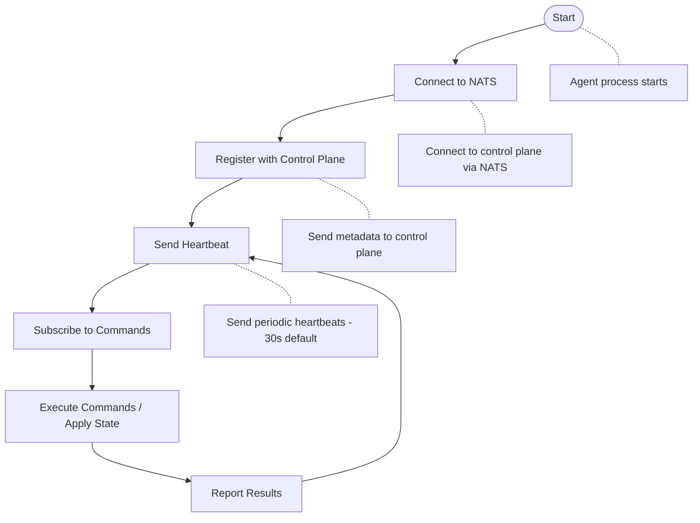
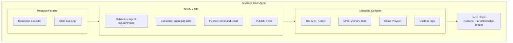
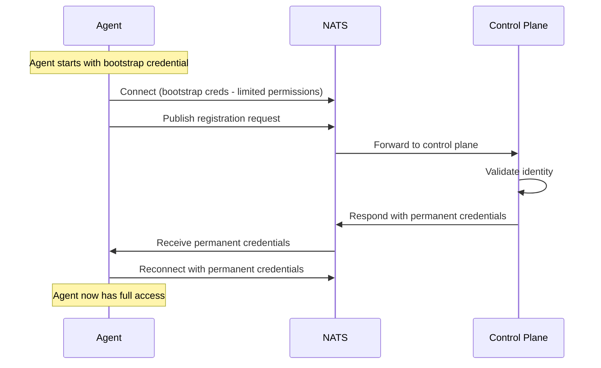

## Overview

Keystone Core agents are lightweight Go binaries that run on every managed node in your infrastructure. They provide the execution layer for all Keystone Core operations.

**Key Characteristics**:
- **Lightweight**: <50MB binary, <100MB memory footprint
- **Cross-platform**: Linux, Windows, macOS, ARM support
- **Secure**: Authenticated connections, sandboxed execution
- **Resilient**: Automatic reconnection, local buffering
- **Extensible**: Plugin architecture for custom modules

## Agent Lifecycle



### Startup Sequence

1. **Initialize**: Load configuration, set up logging
2. **Connect**: Establish connection to NATS (retry with exponential backoff)
3. **Register**: Send agent metadata to control plane
4. **Subscribe**: Subscribe to command and state channels
5. **Heartbeat**: Start heartbeat goroutine (every 30 seconds)
6. **Ready**: Agent is ready to receive work

### Shutdown Sequence

1. **Graceful**: Finish current work before exiting
2. **Unsubscribe**: Unsubscribe from NATS channels
3. **Disconnect**: Send disconnect event to control plane
4. **Close**: Close NATS connection
5. **Exit**: Terminate process

## Architecture

### Components



### Command Execution

When a command is received:

1. **Receive**: Get command from NATS channel
2. **Validate**: Check command syntax and permissions
3. **Execute**: Run command in appropriate shell
4. **Capture**: Capture stdout, stderr, exit code
5. **Report**: Send result back to control plane
6. **Emit**: Emit execution event

Supported shells:
- **Linux**: bash, sh
- **Windows**: PowerShell, cmd
- **macOS**: bash, zsh

### State Execution

When a state configuration is received:

1. **Parse**: Parse state YAML
2. **Validate**: Validate module parameters
3. **Resolve**: Resolve dependencies (requisites)
4. **Execute**: Run modules idempotently
5. **Detect**: Detect configuration drift
6. **Report**: Send results and drift information
7. **Emit**: Emit state events

### Metadata Collection

Agents automatically collect system metadata:

**Operating System**:
- OS type (linux, windows, darwin)
- Distribution (ubuntu, centos, rhel, debian, etc.)
- Version
- Kernel version

**Hardware**:
- CPU count, model, vendor, frequency, cache size
- Total memory, available memory, swap
- Disk devices, partitions, usage
- Network interfaces, MAC addresses, IP addresses
- BMC/IPMI (if present on bare metal servers)

**Network**:
- Hostname
- Primary IP address
- All IP addresses

**Cloud Provider** (auto-detected):
- AWS (EC2, ECS, Lambda)
- GCP (Compute Engine, GKE, Cloud Functions)
- Azure (VM, AKS, Azure Functions)

**Container Runtime**:
- Docker (if present)
- containerd (if present)
- Kubernetes pod information (if running in K8s)

**Service Mesh**:
- Istio (sidecar detection)
- Linkerd (proxy detection)
- Consul (agent detection)

## Hardware Detection

Agents collect detailed hardware information useful for inventory management, capacity planning, and hardware-aware workload placement.

### CPU Information

```go
type CPUInfo struct {
    Model       string    // e.g., "Intel(R) Core(TM) i9-9980HK CPU @ 2.40GHz"
    Vendor      string    // e.g., "GenuineIntel" or "AuthenticAMD"
    Cores       int       // Physical cores per socket
    Threads     int       // Total logical threads
    Sockets     int       // Number of physical CPUs
    MHz         float64   // Current frequency
    CacheSize   int64     // L2/L3 cache size in bytes
    Flags       []string  // CPU feature flags (avx, aes, etc.)
    PhysicalIDs []int     // Physical CPU IDs
}
```

### Memory Information

```go
type MemoryInfo struct {
    Total       uint64   // Total physical memory
    Available   uint64   // Available memory
    Used        uint64   // Used memory
    UsedPercent float64  // Usage percentage
    SwapTotal   uint64   // Total swap space
    SwapFree    uint64   // Free swap space
    SwapUsed    uint64   // Used swap space
}
```

### Disk Information

For each mounted filesystem:

```go
type DiskInfo struct {
    Device      string   // e.g., "/dev/sda1"
    Mountpoint  string   // e.g., "/" or "C:\"
    Filesystem  string   // e.g., "ext4", "xfs", "ntfs"
    Total       uint64   // Total space
    UsedBytes   uint64   // Used space
    FreeBytes   uint64   // Free space
    UsedPercent float64  // Usage percentage
    Serial      string   // Disk serial number (if available)
}
```

### Network Information

For each network interface:

```go
type NetworkInfo struct {
    Name         string   // e.g., "eth0", "en0"
    HardwareAddr string   // MAC address
    Addresses    []string // IP addresses (IPv4 and IPv6)
    MTU          int      // Maximum transmission unit
    Flags        []string // Interface flags (up, broadcast, etc.)
}
```

### BMC/IPMI Detection

For bare metal servers with Baseboard Management Controllers, agents detect:

```go
type BMCInfo struct {
    Present         bool   // Whether a BMC is detected
    IPAddress       string // BMC management IP
    MACAddress      string // BMC MAC address
    FirmwareVersion string // BMC firmware version
    Manufacturer    string // e.g., "Supermicro", "Dell", "HPE"
    ProductID       string // BMC product identifier
}
```

**Detection Methods** (in order):

1. **IPMI Device Files** (Linux): Check for `/dev/ipmi0`, `/dev/ipmi/0`, `/dev/ipmidev/0`
2. **ipmitool**: If available, query BMC info and LAN configuration
3. **DMI/SMBIOS**: Check sysfs for IPMI kernel modules (`ipmi_si`, `ipmi_devintf`)

**Requirements for BMC Detection**:
- Linux: `ipmitool` package installed (optional, for detailed info)
- Linux: IPMI kernel modules loaded (`ipmi_si`, `ipmi_devintf`, `ipmi_msghandler`)
- Windows/macOS: Limited detection (no IPMI device files)

**Example BMC Metadata**:
```json
{
  "bmc": {
    "present": true,
    "ip_address": "192.168.1.100",
    "mac_address": "3c:ec:ef:12:34:56",
    "firmware_version": "2.65",
    "manufacturer": "Supermicro",
    "product_id": "2083 (0x0823) (AOC-SLG3-4E2P)"
  }
}
```

**Use Cases**:
- **Inventory Management**: Track all BMC endpoints in your infrastructure
- **Out-of-Band Management**: Power on/off servers when OS is unresponsive
- **Hardware Monitoring**: Query BMC sensors for temperature, fan speed, etc.
- **Firmware Updates**: Identify BMC firmware versions for patching

### Caching

Hardware detection results are cached (default 5 minutes) to avoid repeated system calls:

```go
type DefaultDetector struct {
    cache    *Info
    cacheAge time.Duration  // Default: 5 minutes
}
```

The cache is automatically invalidated when:
- Cache age exceeds `cacheAge`
- Explicit refresh requested

### Using Hardware Information

Hardware metadata is available via agent registration and the control plane API:

```bash
# Query agent hardware info
kscorectl agents get agent-123 --format json | jq '.metadata.hardware'

# Target agents by hardware characteristics
kscorectl exec "memory.total > 64GB and cpu.vendor == 'AuthenticAMD'" -- uptime

# Find all servers with BMC
kscorectl agents list --filter "bmc.present == true"

# Find servers with low disk space
kscorectl agents list --filter "disk.used_percent > 90"
```

## Configuration

### Basic Configuration

```yaml
# Control Plane Connection
control_plane:
  url: "nats://control-plane.example.com:4222"
  credentials: /etc/kscore/agent.creds  # Optional NATS auth
  tls:
    enabled: false
    ca_file: /etc/kscore/ca.crt
    cert_file: /etc/kscore/agent.crt
    key_file: /etc/kscore/agent.key

# Agent Identity
agent:
  id: ""                      # Auto-generated if empty (hostname-based)
  datacenter: "us-east-1"
  environment: "production"
  role: "web"
  tags:
    - "nginx"
    - "frontend"
    - "public"

# Heartbeat Configuration
heartbeat:
  interval: "30s"
  timeout: "10s"

# Logging
logging:
  level: "info"               # debug, info, warn, error
  format: "json"              # json, logfmt, text
  file: "/var/log/kscore/agent.log"

# Local Cache (for edge/offline mode)
cache:
  enabled: false
  directory: "/var/lib/kscore/cache"
  max_size: "1GB"
```

### Advanced Configuration

```yaml
# Execution Settings
execution:
  timeout: "5m"               # Default command timeout
  max_concurrent: 10          # Max concurrent commands
  shell: "bash"               # Default shell (bash, sh, zsh, powershell, cmd)
  working_dir: "/tmp"

# State Management
state:
  modules_dir: "/var/lib/kscore/modules"
  cache_enabled: true
  dry_run: false

# Resource Limits
limits:
  max_memory: "512MB"         # Max memory for agent process
  max_cpu_percent: 80         # Max CPU usage percent
  max_disk_io: "100MB/s"

# Offline Mode (for edge deployments)
offline:
  enabled: false
  buffer_size: 1000           # Commands/states buffered while offline
  reconnect_interval: "1m"
  max_offline_duration: "24h"

# Security
security:
  sandbox: true               # Sandbox command execution
  allowed_commands: []        # Command whitelist (empty = all)
  blocked_commands: []        # Command blacklist
  run_as_user: ""             # Run commands as specific user
```

## Deployment

### Systemd Service (Linux)

Create `/etc/systemd/system/kscore-agent.service`:

```ini
[Unit]
Description=Keystone Core Agent
After=network.target

[Service]
Type=simple
ExecStart=/usr/local/bin/kscore-agent --config /etc/kscore/agent.yaml
Restart=on-failure
RestartSec=5s
User=kscore
Group=kscore

# Security hardening
NoNewPrivileges=true
PrivateTmp=true
ProtectSystem=strict
ProtectHome=true
ReadWritePaths=/var/lib/kscore /var/log/kscore

[Install]
WantedBy=multi-user.target
```

Enable and start:
```bash
sudo systemctl daemon-reload
sudo systemctl enable kscore-agent
sudo systemctl start kscore-agent
```

### Docker Container

```bash
docker run -d \
  --name kscore-agent \
  --restart unless-stopped \
  -e CONTROL_PLANE_URL=nats://control-plane:4222 \
  -e AGENT_DATACENTER=us-east-1 \
  -e AGENT_ENVIRONMENT=production \
  -e AGENT_ROLE=web \
  -v /var/run/docker.sock:/var/run/docker.sock:ro \
  kscore/agent:latest
```

### Kubernetes DaemonSet

```yaml
apiVersion: apps/v1
kind: DaemonSet
metadata:
  name: kscore-agent
  namespace: kscore-system
spec:
  selector:
    matchLabels:
      app: kscore-agent
  template:
    metadata:
      labels:
        app: kscore-agent
    spec:
      serviceAccountName: kscore-agent
      containers:
      - name: agent
        image: kscore/agent:latest
        env:
        - name: CONTROL_PLANE_URL
          value: "nats://kscore-nats:4222"
        - name: AGENT_DATACENTER
          valueFrom:
            fieldRef:
              fieldPath: spec.nodeName
        - name: AGENT_ENVIRONMENT
          value: "production"
        - name: AGENT_ROLE
          value: "kubernetes"
        resources:
          requests:
            memory: "64Mi"
            cpu: "100m"
          limits:
            memory: "256Mi"
            cpu: "500m"
        securityContext:
          privileged: false
          runAsNonRoot: true
          runAsUser: 1000
          capabilities:
            drop:
            - ALL
      tolerations:
      - effect: NoSchedule
        operator: Exists
```

## Cross-Platform Support

### Linux

**Distributions**:
- Ubuntu (all versions)
- Debian (all versions)
- CentOS / RHEL (7+)
- Fedora
- Alpine Linux
- Arch Linux
- openSUSE

**Package Managers**:
- apt (Debian, Ubuntu)
- yum/dnf (RHEL, CentOS, Fedora)
- zypper (openSUSE)
- pacman (Arch)
- apk (Alpine)

**Init Systems**:
- systemd (primary)
- upstart (legacy)
- sysvinit (legacy)
- OpenRC (Alpine)

### Windows

**Versions**:
- Windows Server 2016+
- Windows 10+
- Windows 11

**Shells**:
- PowerShell 5.1+
- PowerShell Core 7+
- cmd.exe

**Service Management**:
- Windows Service Manager
- NSSM (Non-Sucking Service Manager)

**Package Managers**:
- Chocolatey
- winget
- scoop

### macOS

**Versions**:
- macOS 10.15+ (Catalina and newer)

**Shells**:
- bash
- zsh (default on macOS 10.15+)

**Service Management**:
- launchd

**Package Managers**:
- Homebrew

### ARM Support

- ARM64 (aarch64)
- ARMv7

Common platforms:
- Raspberry Pi (all models)
- AWS Graviton
- Ampere Altra

## Edge and Offline Mode

For edge deployments or unreliable network connectivity:

### Offline Mode Features

1. **Local Buffering**: Commands and state changes queued locally
2. **Automatic Reconnection**: Exponential backoff reconnection
3. **Graceful Degradation**: Operate independently when disconnected
4. **Sync on Reconnect**: Replay buffered operations when online

### Configuration

```yaml
offline:
  enabled: true
  buffer_size: 1000
  reconnect_interval: "1m"
  max_offline_duration: "24h"

cache:
  enabled: true
  directory: "/var/lib/kscore/cache"
  max_size: "1GB"
```

### Use Cases

- **Edge Computing**: Run agents on edge devices with intermittent connectivity
- **Remote Locations**: Branches with unreliable internet
- **Mobile Deployments**: Vehicles, ships, aircraft
- **Air-Gapped Networks**: Disconnected environments with periodic sync

## Security

### Sandboxing

Commands execute in sandboxed environments:

**Linux**:
- seccomp filters
- cgroups for resource limits
- Namespace isolation (optional)

**Windows**:
- Process isolation
- Job objects for resource limits

### Bootstrap Registration

New agents use a secure bootstrap flow to register with the control plane:



**Bootstrap Credential Types**:
- **NKey**: NATS NKey-based authentication (recommended)
- **Token**: Simple token authentication
- **JWT**: JWT-based authentication with claims

**Security Properties**:
- **Time-limited**: Bootstrap credentials expire (default 5 minutes, max 24 hours)
- **Minimal permissions**: Can only publish to registration topic
- **Single-use**: Optionally limited to one registration
- **Audited**: All bootstrap events logged

**Configuration**:
```yaml
bootstrap:
  enabled: true
  credential_type: nkey  # nkey, token, or jwt
  ttl: 5m                # Time-to-live
  max_ttl: 24h           # Maximum allowed TTL
  max_uses: 1            # 0 = unlimited
  allowed_agent_ids: []  # Empty = any agent ID
  allowed_labels: {}     # Required labels for registration
```

**Extensibility**:
- `IdentityVerifier` interface for custom identity verification (SPIFFE, cloud IAM)
- `CredentialIssuer` interface for custom credential generation
- Integration points for future SPIFFE/SPIRE support

### Authentication

Agents authenticate to control plane using:
- NATS credentials (JWT-based)
- TLS client certificates
- NKey-based authentication (recommended for production)
- Shared secrets (less secure, not recommended)

### Permissions

Commands run with configurable permissions:
- Run as specific user
- Command whitelist/blacklist
- Sudo/elevation restrictions

## Monitoring

### Agent Metrics

Exposed via internal metrics (scraped by control plane):

```
# Resource Usage
kscore_agent_cpu_usage_percent
kscore_agent_memory_usage_bytes
kscore_agent_disk_usage_bytes

# Operations
kscore_agent_commands_executed_total
kscore_agent_states_applied_total
kscore_agent_events_emitted_total

# Connection
kscore_agent_heartbeat_sent_total
kscore_agent_reconnections_total
kscore_agent_connected{status="online|offline"}
```

### Health Checks

Agents support health checks:
- Process alive check
- NATS connection check
- Control plane reachability
- Resource utilization check

## Troubleshooting

### Agent Won't Start

**Problem**: Agent process fails to start

Check:
- Config file syntax: `kscore-agent --config agent.yaml --test-config`
- Permissions: Agent user has access to config file and directories
- Dependencies: NATS URL is accessible

### Agent Won't Connect

**Problem**: Agent can't connect to control plane

Check:
- Network connectivity: `ping control-plane.example.com`
- NATS port open: `nc -zv control-plane.example.com 4222`
- TLS certificates valid (if using TLS)
- NATS credentials correct (if using auth)

Debug:
```bash
kscore-agent --config agent.yaml --log-level debug
```

### High CPU Usage

**Problem**: Agent consuming excessive CPU

Check:
- Number of concurrent commands: `max_concurrent` setting
- Command timeouts: Long-running commands blocking
- State module performance: Complex state files

Fix:
- Reduce `max_concurrent` setting
- Set shorter timeouts
- Optimize state files

### High Memory Usage

**Problem**: Agent consuming excessive memory

Check:
- Buffer size (offline mode)
- Command output size (streaming vs buffering)
- Cache size

Fix:
```yaml
limits:
  max_memory: "256MB"

cache:
  max_size: "500MB"

offline:
  buffer_size: 500
```

## Best Practices

### Deployment

1. **Auto-Register**: Use hostname-based agent IDs for automatic registration
2. **Tag Everything**: Use tags for flexible targeting
3. **Monitor Resources**: Set resource limits to prevent runaway processes
4. **Update Gradually**: Roll out agent updates in batches

### Operations

1. **Graceful Restarts**: Always stop agents gracefully to finish current work
2. **Log Rotation**: Configure log rotation to prevent disk full
3. **Backup Configs**: Version control agent configurations
4. **Test Changes**: Test config changes on dev agents first

### Security

1. **Use TLS**: Always encrypt agent-control plane communication in production
2. **Least Privilege**: Run agents with minimum required permissions
3. **Sandbox Commands**: Enable command sandboxing
4. **Audit Logs**: Enable comprehensive logging for compliance

## Next Steps

- Understand the [Message Bus](message-bus/) that agents connect to
- Learn about [Remote Execution](remote-execution/) for command dispatch
- Explore [State Management](state-management/) for configuration
- See [Multi-Environment](../kubernetes/) support for K8s, VMs, edge
