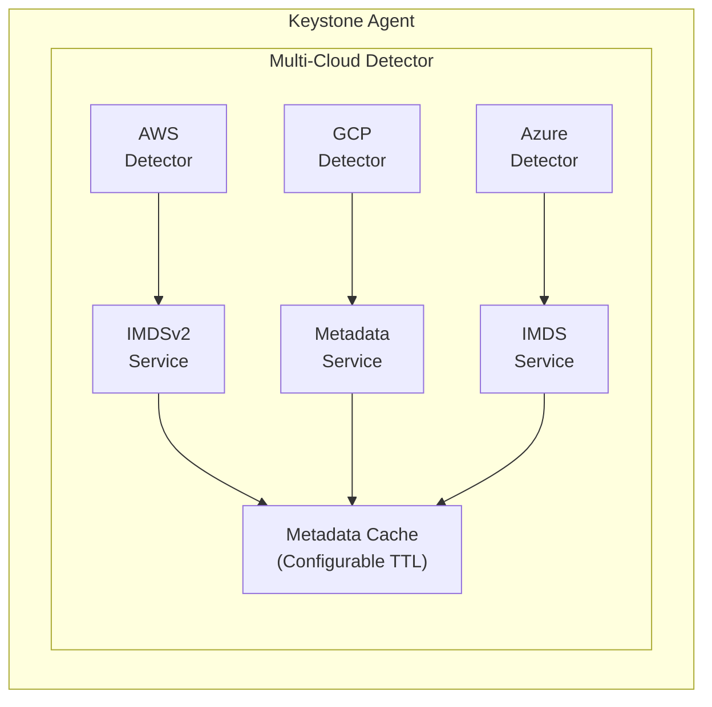

## Overview

Keystone Core automatically detects the cloud environment where agents are running, collecting rich metadata from cloud provider metadata services. This enables cloud-aware targeting, automatic tagging, and seamless integration with cloud-native services.

## Supported Cloud Providers

| Provider | Compute | Containers | Serverless |
|----------|---------|------------|------------|
| **AWS** | EC2 | ECS | Lambda |
| **GCP** | Compute Engine | GKE | Cloud Functions, Cloud Run |
| **Azure** | Virtual Machines | AKS | Azure Functions, Container Instances |

## Architecture



## AWS Integration

### Supported Environment Types

- **EC2 Instances**: Full metadata including instance type, AMI, VPC, availability zone
- **ECS Tasks**: Container metadata, task ARN, cluster information
- **Lambda Functions**: Function name, memory, runtime, invocation context

### Detected Metadata

```yaml
cloud:
  provider: aws
  region: us-east-1
  availabilityZone: us-east-1a
  accountId: "123456789012"

  # EC2-specific
  ec2:
    instanceId: i-0abc123def456
    instanceType: t3.medium
    amiId: ami-12345678
    vpcId: vpc-abc123
    subnetId: subnet-def456
    privateIp: 10.0.1.100
    publicIp: 54.123.45.67
    securityGroups:
      - sg-123456
    iamRole: MyInstanceRole
    tags:
      Name: web-server-01
      Environment: production

  # ECS-specific (when running in ECS)
  ecs:
    cluster: production-cluster
    taskArn: arn:aws:ecs:us-east-1:123456789012:task/abc123
    taskDefinition: web-app:5
    containerName: app
    launchType: FARGATE

  # Lambda-specific (when running in Lambda)
  lambda:
    functionName: my-function
    functionVersion: $LATEST
    memoryLimitMB: 512
    runtime: provided.al2
```

### IMDSv2 Support

Keystone Core uses IMDSv2 (Instance Metadata Service v2) for enhanced security:

```go
// IMDSv2 requires a session token
// Keystone Core handles this automatically
client := aws.NewIMDSv2Client(aws.IMDSv2Config{
    TokenTTL:     6 * time.Hour,
    Timeout:      2 * time.Second,
    MaxRetries:   3,
})
```

## GCP Integration

### Supported Environment Types

- **Compute Engine**: Instance metadata, machine type, network interfaces
- **GKE**: Cluster name, node pool, Kubernetes metadata
- **Cloud Run**: Service name, revision, configuration
- **Cloud Functions**: Function name, region, memory allocation

### Detected Metadata

```yaml
cloud:
  provider: gcp
  region: us-central1
  zone: us-central1-a
  projectId: my-project-123
  projectNumber: "123456789012"

  # Compute Engine-specific
  computeEngine:
    instanceId: "1234567890123456789"
    instanceName: web-server-01
    machineType: e2-medium
    networkInterfaces:
      - network: default
        ip: 10.128.0.2
        externalIp: 34.123.45.67
    serviceAccount: default
    tags:
      - web
      - production

  # GKE-specific
  gke:
    clusterName: production-cluster
    clusterLocation: us-central1
    nodePool: default-pool
    nodeName: gke-prod-default-pool-abc123

  # Cloud Run-specific
  cloudRun:
    service: my-service
    revision: my-service-00001
    configuration: my-service

  # Cloud Functions-specific
  cloudFunctions:
    functionName: my-function
    region: us-central1
    memoryMB: 256
    runtime: go121
```

### Metadata Service Access

```go
// GCP metadata service at metadata.google.internal
client := gcp.NewMetadataClient(gcp.MetadataConfig{
    BaseURL:  "http://metadata.google.internal",
    Timeout:  2 * time.Second,
})
```

## Azure Integration

### Supported Environment Types

- **Virtual Machines**: Instance metadata, VM size, network configuration
- **AKS**: Cluster information, node pool details
- **Container Instances**: Container group metadata
- **Azure Functions**: Function app details

### Detected Metadata

```yaml
cloud:
  provider: azure
  region: eastus
  subscriptionId: "12345678-1234-1234-1234-123456789012"
  resourceGroup: my-resource-group

  # VM-specific
  virtualMachine:
    vmId: "12345678-1234-1234-1234-123456789012"
    vmName: web-server-01
    vmSize: Standard_D2s_v3
    location: eastus
    zone: "1"
    offer: UbuntuServer
    publisher: Canonical
    sku: 22_04-lts
    version: latest
    privateIp: 10.0.1.4
    publicIp: 52.123.45.67
    tags:
      Environment: production

  # AKS-specific
  aks:
    clusterName: production-cluster
    resourceGroup: aks-rg
    nodePool: agentpool
    nodeName: aks-agentpool-12345678-vmss000000

  # Container Instances-specific
  containerInstances:
    containerGroupName: my-container-group
    containerName: app
    location: eastus

  # Azure Functions-specific
  azureFunctions:
    functionAppName: my-function-app
    functionName: my-function
```

### Instance Metadata Service

```go
// Azure IMDS at 169.254.169.254
client := azure.NewIMDSClient(azure.IMDSConfig{
    BaseURL:    "http://169.254.169.254",
    APIVersion: "2021-02-01",
    Timeout:    2 * time.Second,
})
```

## Multi-Cloud Detection

The `MultiCloudDetector` automatically determines the cloud provider:

```go
detector := cloud.NewMultiCloudDetector(cloud.DetectorConfig{
    CacheTTL:       5 * time.Minute,
    DetectTimeout:  5 * time.Second,
    EnableAWS:      true,
    EnableGCP:      true,
    EnableAzure:    true,
})

// Detect cloud provider and collect metadata
cloudInfo, err := detector.Detect(ctx)
if err != nil {
    log.Printf("Not running in a cloud environment: %v", err)
}
```

### Detection Order

1. **AWS**: Check for IMDSv2 availability at `169.254.169.254`
2. **GCP**: Check for metadata service at `metadata.google.internal`
3. **Azure**: Check for IMDS at `169.254.169.254` with Azure-specific headers
4. **None**: Fall back to on-premises/bare-metal mode

## Configuration

### Agent Configuration

```yaml
agent:
  cloud:
    # Enable cloud detection (default: true)
    enabled: true

    # Metadata cache TTL (default: 5m)
    cacheTTL: 5m

    # Detection timeout per provider (default: 2s)
    detectTimeout: 2s

    # Enable specific providers
    providers:
      aws: true
      gcp: true
      azure: true

    # AWS-specific settings
    aws:
      # Use IMDSv2 (required in some environments)
      imdsv2: true
      # Token TTL for IMDSv2
      tokenTTL: 6h

    # Add cloud metadata to agent labels
    enrichLabels: true
```

### Label Enrichment

When `enrichLabels` is enabled, cloud metadata is automatically added to agent labels:

```yaml
labels:
  # Automatically added
  cloud.provider: aws
  cloud.region: us-east-1
  cloud.zone: us-east-1a
  cloud.instance.type: t3.medium
  cloud.instance.id: i-0abc123def456
```

## Targeting by Cloud Metadata

### Target by Provider

```yaml
target:
  expression: cloud.provider == "aws"
```

### Target by Region

```yaml
target:
  expression: cloud.region == "us-east-1" || cloud.region == "us-west-2"
```

### Target by Instance Type

```yaml
target:
  expression: cloud.instance.type =~ "t3.*"
```

### Target by Environment Type

```yaml
target:
  # Target only ECS tasks
  expression: cloud.provider == "aws" && cloud.ecs.cluster != ""

  # Target only GKE nodes
  expression: cloud.provider == "gcp" && cloud.gke.clusterName != ""
```

### Complex Cloud Targeting

```yaml
target:
  expression: |
    (cloud.provider == "aws" && cloud.region in ["us-east-1", "us-west-2"]) ||
    (cloud.provider == "gcp" && cloud.region == "us-central1") ||
    (cloud.provider == "azure" && cloud.region == "eastus")
```

## Use Cases

### Multi-Cloud Deployments

Deploy configurations across multiple cloud providers:

```yaml
states:
  file:
    - id: /etc/app/config.yaml
      state: present
      parameters:
        source: template://config.yaml.tpl
        mode: "0644"
      # Template uses cloud facts
      # {{ if eq .facts.cloud.provider "aws" }}
      # region: {{ .facts.cloud.region }}
      # {{ end }}
```

### Cloud-Specific Configurations

Apply provider-specific settings:

```yaml
include:
  - path: aws-specific.yaml
    condition: cloud.provider == "aws"
  - path: gcp-specific.yaml
    condition: cloud.provider == "gcp"
  - path: azure-specific.yaml
    condition: cloud.provider == "azure"
```

### Hybrid Cloud Operations

Manage workloads across cloud and on-premises:

```yaml
target:
  # All cloud instances
  expression: cloud.provider != ""

target:
  # On-premises only
  expression: cloud.provider == ""
```

## Best Practices

### Metadata Caching

Configure appropriate cache TTL based on your environment:

- **Stable environments**: 15-30 minutes
- **Dynamic environments (auto-scaling)**: 1-5 minutes
- **Serverless**: Disable caching (0)

### Security Considerations

1. **IMDSv2**: Always use IMDSv2 on AWS for enhanced security
2. **Network Policies**: Restrict metadata service access to necessary pods
3. **Role Permissions**: Use minimal IAM/service account permissions

### Error Handling

Handle cases where cloud detection fails:

```yaml
# Graceful degradation for non-cloud environments
defaults:
  region: "default"
  provider: "on-premises"
```

## Troubleshooting

### Detection Fails on AWS

Check IMDSv2 hop limit:

```bash
# Instance must allow metadata access
aws ec2 modify-instance-metadata-options \
  --instance-id i-0abc123def456 \
  --http-tokens required \
  --http-put-response-hop-limit 2
```

### Detection Fails on GCP

Verify metadata service access:

```bash
curl -H "Metadata-Flavor: Google" \
  http://metadata.google.internal/computeMetadata/v1/instance/zone
```

### Detection Fails on Azure

Check IMDS connectivity:

```bash
curl -H "Metadata: true" \
  "http://169.254.169.254/metadata/instance?api-version=2021-02-01"
```

### Slow Detection

If detection is slow, check network connectivity to metadata services and consider increasing timeout values.

## See Also

- [Agents](/docs/concepts/agents/) - Agent architecture and metadata
- [Multi-Environment Support](/docs/concepts/multi-environment/) - Cross-platform operations
- [Kubernetes Integration](/docs/concepts/kubernetes/) - Container orchestration
- [Edge Computing](/docs/concepts/edge/) - Disconnected environments
