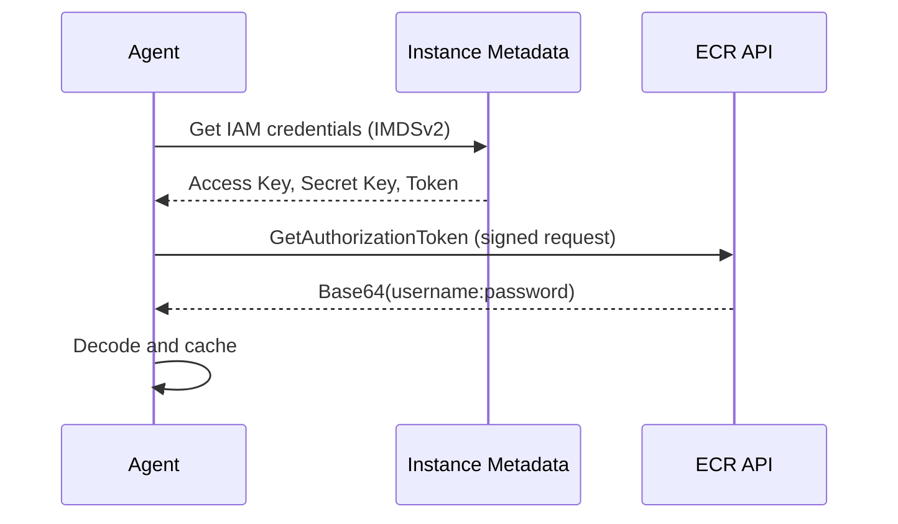
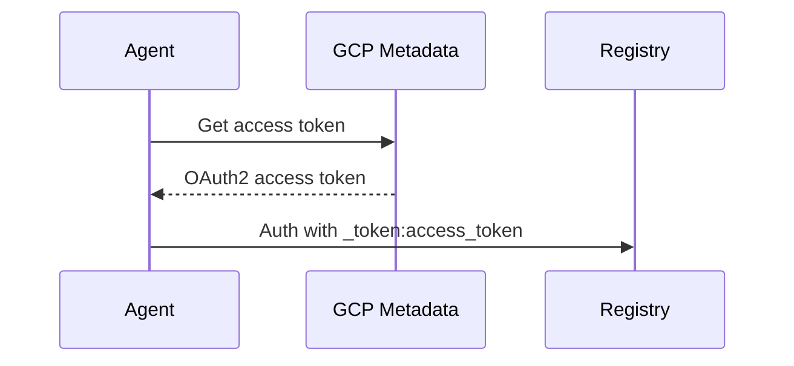
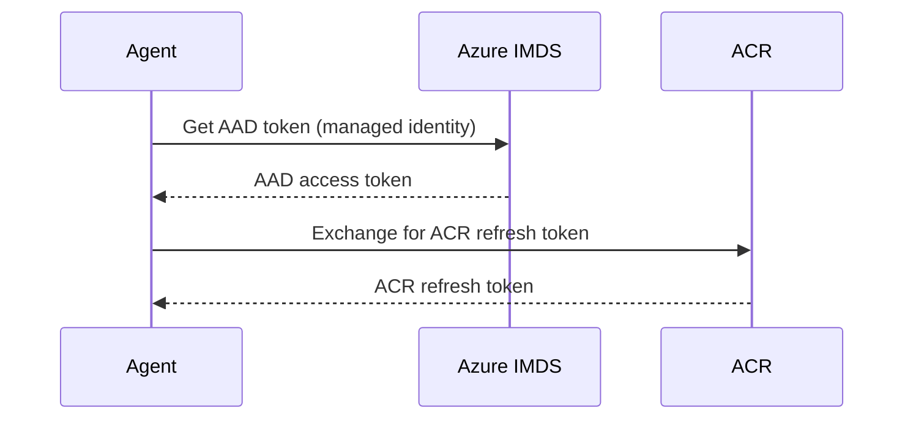

## Overview

Keystone Core provides comprehensive container registry authentication to pull images from private registries. The credential resolution system supports multiple authentication sources with automatic cloud provider detection.

## Supported Registries

| Registry | Type | Auto-Detection |
|----------|------|----------------|
| AWS ECR | Cloud | Yes (via instance metadata) |
| Google GCR / Artifact Registry | Cloud | Yes (via metadata service) |
| Azure ACR | Cloud | Yes (via managed identity) |
| Docker Hub | Public/Private | Via Docker config |
| GitHub Container Registry | Private | Via Docker config |
| Quay.io | Private | Via Docker config |
| Generic OCI | Private | Via Docker config |

## Authentication Methods

### No Authentication

For public registries, no authentication is needed:

```yaml
nginx_image:
  module: docker_image
  state: present
  name: nginx
  tag: latest
```

### Docker Config

Use credentials from your local Docker configuration (`~/.docker/config.json`):

```yaml
private_image:
  module: docker_image
  state: present
  name: myregistry.example.com/myapp
  tag: v1.0.0
  registry_auth: docker-config
```

This reads credentials from:

1. `credHelpers` entries for registry-specific helpers
2. `auths` entries for direct credentials
3. `credsStore` for the default credential helper

### Cloud Auto-Detection

Automatically detect and use cloud provider credentials:

```yaml
ecr_image:
  module: docker_image
  state: present
  name: 123456789.dkr.ecr.us-west-2.amazonaws.com/myapp
  tag: latest
  registry_auth: cloud-auto
```

**How it works**:

1. **AWS ECR**: Uses instance metadata (IMDSv2) to get temporary credentials, then calls ECR GetAuthorizationToken API
2. **GCP GCR/Artifact Registry**: Uses metadata service to get access token, authenticates as `_token:<access_token>`
3. **Azure ACR**: Uses managed identity to get AAD token, exchanges for ACR refresh token

**Requirements**:

- Instance/pod must have appropriate IAM role/service account
- For AWS: IAM role with `ecr:GetAuthorizationToken` permission
- For GCP: Service account with `roles/artifactregistry.reader`
- For Azure: Managed identity with `AcrPull` role

### Kubernetes imagePullSecrets

Use credentials from a Kubernetes Secret:

```yaml
private_image:
  module: docker_image
  state: present
  name: myregistry.example.com/myapp
  tag: v1.0.0
  registry_auth: k8s:default/my-pull-secret
```

**Format**: `k8s:<namespace>/<secret-name>`

The secret must be of type `kubernetes.io/dockerconfigjson` or `kubernetes.io/dockercfg`:

```yaml
apiVersion: v1
kind: Secret
metadata:
  name: my-pull-secret
  namespace: default
type: kubernetes.io/dockerconfigjson
data:
  .dockerconfigjson: <base64-encoded-docker-config>
```

## Credential Resolution Order

When `registry_auth` is set, credentials are resolved in this order:

1. **Cached credentials** - Previously resolved, non-expired credentials
2. **Docker credential helpers** - External helper binaries (e.g., `docker-credential-gcloud`)
3. **Cloud providers** - Auto-detected based on registry URL
4. **Docker config.json** - Direct `auths` entries
5. **Kubernetes secrets** - If `k8s:` prefix is used

## Cloud Provider Details

### AWS ECR

**Detection**: Registry URL matches `*.dkr.ecr.*.amazonaws.com`

**Credential Flow**:



**Credential format**:

- Username: `AWS`
- Password: Temporary authorization token
- Expires: 12 hours

### Google GCR / Artifact Registry

**Detection**: Registry URL matches `*.gcr.io` or `*-docker.pkg.dev`

**Credential Flow**:



**Credential format**:

- Username: `_token`
- Password: OAuth2 access token
- Expires: 1 hour

### Azure ACR

**Detection**: Registry URL matches `*.azurecr.io`

**Credential Flow**:



**Credential format**:

- Username: `00000000-0000-0000-0000-000000000000` (GUID)
- Password: ACR refresh token
- Expires: 3 hours

## Docker Credential Helpers

Keystone Core supports external Docker credential helper binaries:

| Helper | Binary | Use Case |
|--------|--------|----------|
| ECR | `docker-credential-ecr-login` | AWS ECR |
| GCR | `docker-credential-gcr` | Google GCR |
| gcloud | `docker-credential-gcloud` | GCP Artifact Registry |
| ACR | `docker-credential-acr-env` | Azure ACR |
| osxkeychain | `docker-credential-osxkeychain` | macOS Keychain |
| wincred | `docker-credential-wincred` | Windows Credential Manager |
| secretservice | `docker-credential-secretservice` | Linux Secret Service |
| pass | `docker-credential-pass` | pass password manager |

Configure helpers in `~/.docker/config.json`:

```json
{
  "credHelpers": {
    "gcr.io": "gcloud",
    "us.gcr.io": "gcloud",
    "123456789.dkr.ecr.us-west-2.amazonaws.com": "ecr-login",
    "myregistry.azurecr.io": "acr-env"
  },
  "credsStore": "osxkeychain"
}
```

## Examples

### Pull from AWS ECR

```yaml
# Using cloud auto-detection
ecr_app:
  module: docker_image
  state: present
  name: 123456789.dkr.ecr.us-west-2.amazonaws.com/myapp
  tag: v2.1.0
  registry_auth: cloud-auto

# Using Docker credential helper
ecr_app_helper:
  module: docker_image
  state: present
  name: 123456789.dkr.ecr.us-west-2.amazonaws.com/myapp
  tag: v2.1.0
  registry_auth: docker-config  # Uses ecr-login helper from config.json
```

### Pull from GCP Artifact Registry

```yaml
gcr_app:
  module: docker_image
  state: present
  name: us-docker.pkg.dev/myproject/myrepo/myapp
  tag: latest
  registry_auth: cloud-auto
```

### Pull from Azure ACR

```yaml
acr_app:
  module: docker_image
  state: present
  name: myregistry.azurecr.io/myapp
  tag: v1.0.0
  registry_auth: cloud-auto
```

### Pull with Kubernetes Secret

```yaml
private_app:
  module: docker_image
  state: present
  name: registry.example.com/myapp
  tag: latest
  registry_auth: k8s:production/registry-credentials
```

### Multi-Registry Deployment

```yaml
# Base infrastructure from public registry
nginx:
  module: docker_image
  state: present
  name: nginx
  tag: "1.25"

# Application from private ECR
backend:
  module: docker_image
  state: present
  name: 123456789.dkr.ecr.us-west-2.amazonaws.com/backend
  tag: {{ .vars.backend_version }}
  registry_auth: cloud-auto

# ML model from GCR
model_server:
  module: docker_image
  state: present
  name: gcr.io/ml-project/model-server
  tag: {{ .vars.model_version }}
  registry_auth: cloud-auto
```

## Troubleshooting

### Credential Resolution Failed

**Problem**: `failed to resolve credentials for registry`

**Solutions**:

1. Verify the registry URL is correct
2. Check that cloud metadata service is accessible
3. Verify IAM role/service account has required permissions
4. Ensure Docker config.json has correct entries

### Cloud Auto-Detection Not Working

**Problem**: Cloud credentials not auto-detected

**Check**:

```bash
# AWS - verify instance has IAM role
curl -H "X-aws-ec2-metadata-token: $(curl -X PUT "http://169.254.169.254/latest/api/token" -H "X-aws-ec2-metadata-token-ttl-seconds: 21600")" \
  http://169.254.169.254/latest/meta-data/iam/security-credentials/

# GCP - verify service account
curl -H "Metadata-Flavor: Google" \
  http://metadata.google.internal/computeMetadata/v1/instance/service-accounts/default/token

# Azure - verify managed identity
curl -H "Metadata: true" \
  "http://169.254.169.254/metadata/identity/oauth2/token?api-version=2018-02-01&resource=https://management.azure.com/"
```

### Kubernetes Secret Not Found

**Problem**: `secret not found` or `no credentials for registry`

**Check**:

1. Verify secret exists in the specified namespace
2. Verify secret type is `kubernetes.io/dockerconfigjson`
3. Verify the `.dockerconfigjson` data contains credentials for the target registry

```bash
kubectl get secret my-pull-secret -n default -o jsonpath='{.data.\.dockerconfigjson}' | base64 -d | jq .
```

### Credential Helper Not Found

**Problem**: `docker-credential-* not found in PATH`

**Solution**: Install the required credential helper:

```bash
# AWS ECR
# Install amazon-ecr-credential-helper

# GCP
gcloud components install docker-credential-gcr

# Azure
# Install azure-cli (includes acr-env helper)
```

## Security Considerations

1. **Credential Caching**: Credentials are cached in memory with TTL based on expiration time
2. **No Disk Storage**: Temporary credentials are never written to disk
3. **Instance Metadata**: Cloud credentials require appropriate IAM roles on the instance
4. **K8s Secrets**: Ensure RBAC restricts access to imagePullSecrets
5. **Rotation**: Cloud provider credentials auto-rotate; manual credentials should be rotated regularly

## See Also

- [State Management](/docs/concepts/state-management/) - Docker/Podman image modules
- [Kubernetes Integration](/docs/concepts/kubernetes/) - K8s-specific features
- [Cloud Platforms](/docs/concepts/cloud-platforms/) - Cloud provider setup
