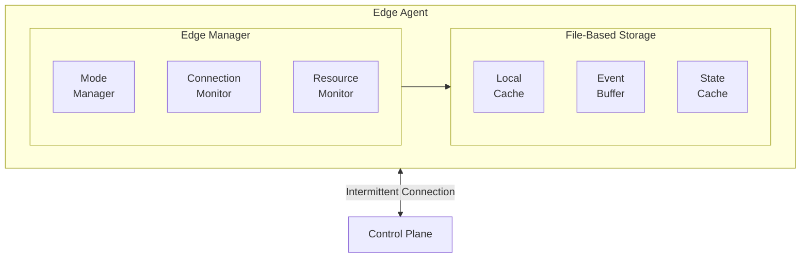
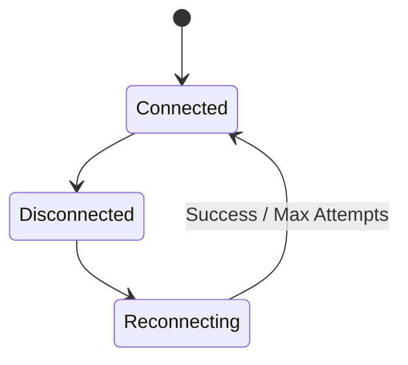
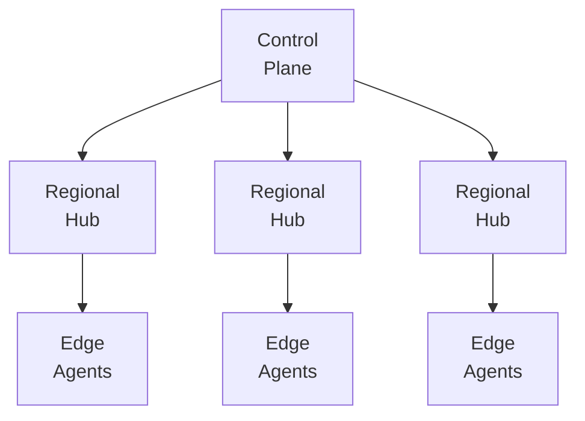

## Overview

Keystone Core supports edge computing scenarios where agents may operate with intermittent connectivity, limited resources, or complete network isolation. The edge subsystem provides local caching, automatic reconnection, and graceful degradation to ensure reliable operation in challenging environments.

## Operating Modes

### Online Mode

Normal operation with continuous connectivity to the control plane:

- Real-time command execution
- Immediate state synchronization
- Live event streaming
- Direct heartbeat reporting

### Offline Mode

Operation when disconnected from the control plane:

- Local command buffering
- Cached state application
- Event queuing for later transmission
- Autonomous operation using cached policies

### Lightweight Mode

Resource-constrained operation for IoT and embedded devices:

- Reduced memory footprint
- Minimal CPU usage
- Compressed communications
- Essential features only

## Architecture



## Local Caching

### Cache Architecture

The file-based cache stores data locally for offline operation:

```go
cache, err := edge.NewFileCache("/var/lib/keystone/cache")
if err != nil {
    log.Fatalf("failed to create cache: %v", err)
}
```

### Cached Content

| Content Type | Description | Default TTL |
|--------------|-------------|-------------|
| **States** | State declarations and parameters | 24 hours |
| **Policies** | Policy rules for offline evaluation | 12 hours |
| **Variables** | Configuration variables | 6 hours |
| **Facts** | System facts and metadata | 1 hour |
| **Commands** | Queued command results | Until sync |

### Cache Operations

```go
// Store data in cache
err := cache.Set(&edge.CacheEntry{
    ID:        "web-config",
    Type:      "state",
    Data:      stateData,
    CreatedAt: time.Now(),
    ExpiresAt: time.Now().Add(24 * time.Hour),
    Size:      int64(len(stateData)),
})

// Retrieve from cache
entry, err := cache.Get("web-config")
if err != nil {
    // Handle cache miss or expired entry
}

// List all cached entries
entries, err := cache.List()

// Prune expired entries
err = cache.Prune()

// Get cache statistics
stats, err := cache.GetStats()
```

### Size Management

The cache automatically manages size through LRU eviction:

```yaml
cache:
  maxSize: 100MB
  eviction:
    # Evict when 90% full
    threshold: 0.9
    # Keep at least this many entries
    minEntries: 100
    # Never evict high-priority items first
    priorityAware: true
```

### Cache Invalidation Policies

Keystone Core supports multiple cache invalidation strategies to ensure edge agents have fresh data while minimizing network traffic and control plane load.

#### Invalidation Strategies

| Strategy | Description | Use Case |
|----------|-------------|----------|
| **TTL-based** | Entries expire after configured time | Default, works offline |
| **Event-driven** | Control plane pushes invalidations | Real-time updates |
| **Version-based** | Compare version numbers | Explicit versioning |
| **Content-hash** | Compare content hashes | Detect any change |
| **Hybrid** | Combine multiple strategies | Production recommended |

#### TTL-Based Invalidation

Configure TTL (Time-To-Live) for different content types:

```yaml
agent:
  edge:
    cache:
      # Default TTL for all cached content
      defaultTTL: 24h

      # Per-type TTL configuration
      ttl:
        # State files - longer TTL since they change infrequently
        states:
          default: 24h
          # Override for specific states
          overrides:
            "critical-config": 1h
            "security-policy": 30m
            "frequently-updated-*": 15m  # Glob patterns supported

        # Policies - shorter TTL for security
        policies:
          default: 12h
          # Security policies refresh more frequently
          security: 1h
          compliance: 6h

        # Variables - varies by environment
        vars:
          default: 6h
          overrides:
            "secrets/*": 1h          # Secrets refresh frequently
            "static/*": 168h         # Static config rarely changes
            "feature-flags": 15m     # Feature flags change often

        # Facts - system facts change rarely
        facts:
          default: 1h
          # Hardware facts almost never change
          hardware: 24h
          # Network facts can change
          network: 15m

        # Command results - until synced
        commands:
          default: 0  # No expiration, sync-based

        # Files from file distribution
        files:
          default: 168h  # 1 week
          # Large files cached longer
          large_files: 720h  # 30 days
```

#### TTL Calculation Rules

TTL is determined in the following order of precedence:

1. **Explicit override** - Specific entry name matches override pattern
2. **Category default** - Type-specific default (states, policies, vars)
3. **Global default** - `defaultTTL` setting
4. **System default** - Built-in default (24h)

**Example:**
```yaml
ttl:
  defaultTTL: 24h
  states:
    default: 48h
    overrides:
      "nginx-config": 1h
```

- `nginx-config` state → 1h (explicit override)
- `postgres-config` state → 48h (category default)
- Unknown content type → 24h (global default)

#### Event-Driven Invalidation

Control plane can push cache invalidations to connected agents:

```yaml
agent:
  edge:
    cache:
      invalidation:
        # Enable event-driven invalidation
        eventDriven:
          enabled: true

          # Subscribe to invalidation events
          subjects:
            - "kscore.cache.invalidate.>"
            - "kscore.state.updated.>"

          # How to handle invalidation events
          action: invalidate  # invalidate, refresh, mark_stale
```

**Invalidation event format:**
```json
{
  "type": "cache.invalidate",
  "data": {
    "pattern": "states/nginx-*",    // Glob pattern
    "reason": "state_updated",
    "timestamp": "2026-01-18T10:30:00Z",
    "source": "control-plane",
    "new_version": "v1.2.3"         // Optional
  }
}
```

**Triggering invalidation from control plane:**
```bash
# Invalidate specific entry
kscorectl cache invalidate "states/nginx-config" --target "region=us-west"

# Invalidate by pattern
kscorectl cache invalidate "states/web-*" --target "*"

# Invalidate all policies (security update)
kscorectl cache invalidate "policies/*" --target "*" --priority high
```

#### Version-Based Invalidation

Track versions and only refresh when version changes:

```yaml
agent:
  edge:
    cache:
      invalidation:
        versionBased:
          enabled: true

          # How to check versions
          checkInterval: 5m

          # Only fetch if version differs
          fetchOnMismatch: true

          # Version source: header, metadata, or api
          versionSource: metadata
```

**Version metadata in cached entries:**
```json
{
  "id": "states/nginx-config",
  "version": "v1.2.3",
  "etag": "abc123def456",
  "lastModified": "2026-01-18T10:00:00Z",
  "data": "..."
}
```

**Version check flow:**
```
Agent                           Control Plane
  |                                   |
  |--- HEAD /states/nginx-config ---->|
  |    If-None-Match: "abc123"        |
  |                                   |
  |<-- 304 Not Modified --------------|  (Cache valid)
  |                                   |
  |<-- 200 OK + new content ----------|  (Cache stale, refresh)
  |    ETag: "def456"                 |
```

#### Content-Hash Invalidation

Detect changes by comparing content hashes:

```yaml
agent:
  edge:
    cache:
      invalidation:
        contentHash:
          enabled: true

          # Hash algorithm
          algorithm: sha256  # md5, sha1, sha256

          # Store hash alongside content
          storeHash: true

          # Verify on read (detect corruption)
          verifyOnRead: true
```

**Hash verification:**
```bash
# Verify cache integrity
kscorectl cache verify

# Output:
# Verifying cache entries...
# states/nginx-config: OK (sha256: abc123...)
# states/postgres-config: OK (sha256: def456...)
# policies/security: MISMATCH - refreshing
# Total: 150 entries, 149 valid, 1 refreshed
```

#### Hybrid Invalidation Strategy

Combine multiple strategies for production deployments:

```yaml
agent:
  edge:
    cache:
      invalidation:
        # Primary: TTL-based (works offline)
        ttl:
          enabled: true
          default: 24h

        # Secondary: Event-driven (real-time when connected)
        eventDriven:
          enabled: true
          subjects:
            - "kscore.cache.invalidate.>"

        # Tertiary: Version check (periodic verification)
        versionBased:
          enabled: true
          checkInterval: 30m

        # Priority order for invalidation decisions
        priority:
          - eventDriven   # Immediate if connected
          - versionBased  # Periodic check
          - ttl           # Fallback

        # Stale-while-revalidate
        staleWhileRevalidate:
          enabled: true
          maxStaleAge: 1h  # Serve stale for up to 1h while refreshing
```

#### Stale-While-Revalidate

Serve stale content while refreshing in background:

```yaml
agent:
  edge:
    cache:
      staleWhileRevalidate:
        enabled: true

        # Maximum age of stale content to serve
        maxStaleAge: 1h

        # Content types that allow stale serving
        allowedTypes:
          - states
          - vars
          - facts

        # Never serve stale (always wait for refresh)
        neverStale:
          - policies      # Security critical
          - credentials   # Must be current
```

**Behavior:**
```
Request for "nginx-config" (TTL expired 10 minutes ago)
  |
  |-- maxStaleAge: 1h, expired 10m ago → within window
  |
  |-- Return stale content immediately
  |-- Trigger background refresh
  |-- Next request gets fresh content
```

#### Invalidation Events and Metrics

**Events emitted:**
```json
// Cache entry expired
{
  "type": "cache.entry.expired",
  "data": {
    "id": "states/nginx-config",
    "expired_at": "2026-01-18T10:00:00Z",
    "ttl": "24h",
    "action": "evicted"
  }
}

// Cache entry invalidated
{
  "type": "cache.entry.invalidated",
  "data": {
    "id": "states/nginx-config",
    "reason": "event_driven",
    "source": "control-plane"
  }
}

// Cache entry refreshed
{
  "type": "cache.entry.refreshed",
  "data": {
    "id": "states/nginx-config",
    "old_version": "v1.2.2",
    "new_version": "v1.2.3",
    "refresh_duration_ms": 150
  }
}
```

**Metrics:**
```promql
# Cache invalidation rate by reason
rate(kscore_edge_cache_invalidations_total{reason="ttl|event|version|hash"}[5m])

# Stale content served
rate(kscore_edge_cache_stale_served_total[5m])

# Background refresh latency
histogram_quantile(0.95, rate(kscore_edge_cache_refresh_duration_seconds_bucket[5m]))

# Cache freshness (entries not yet expired)
kscore_edge_cache_fresh_entries / kscore_edge_cache_total_entries
```

#### TTL Tuning Guidelines

**By Connectivity Pattern:**

| Scenario | Recommended TTL | Rationale |
|----------|-----------------|-----------|
| Always connected | 1-6h | Fresh data available |
| Intermittent (daily sync) | 24-48h | Survive disconnection |
| Weekly sync | 168h+ | Extended offline operation |
| Air-gapped | 720h+ | Manual sync cycles |

**By Content Criticality:**

| Content Type | Low Criticality | Medium | High (Security) |
|--------------|-----------------|--------|-----------------|
| States | 48h | 24h | 6h |
| Policies | 24h | 12h | 1h |
| Variables | 12h | 6h | 1h |
| Credentials | N/A | N/A | 30m |

**By Change Frequency:**

| Content | Typical Change Rate | Recommended TTL |
|---------|---------------------|-----------------|
| Static config | Monthly | 168h (1 week) |
| Application config | Weekly | 24-48h |
| Feature flags | Daily | 1-6h |
| Secrets/credentials | On rotation | 30m-1h |

#### Cache Invalidation CLI

```bash
# View cache entry details including TTL
kscorectl cache show states/nginx-config

# Output:
# ID: states/nginx-config
# Type: state
# Created: 2026-01-18T08:00:00Z
# Expires: 2026-01-19T08:00:00Z (in 22h)
# TTL: 24h
# Version: v1.2.3
# Size: 2.3KB
# Hash: sha256:abc123...

# List entries by TTL status
kscorectl cache list --expiring-soon 1h
kscorectl cache list --expired

# Manually invalidate entry
kscorectl cache invalidate states/nginx-config

# Refresh entry (fetch new version)
kscorectl cache refresh states/nginx-config

# Bulk refresh by pattern
kscorectl cache refresh "states/*" --force

# Set custom TTL for entry
kscorectl cache set-ttl states/nginx-config 6h

# View invalidation history
kscorectl cache history --type invalidation --limit 50
```

#### Invalidation Alerts

```yaml
groups:
  - name: edge_cache_alerts
    rules:
      - alert: EdgeCacheHighStaleRate
        expr: >
          rate(kscore_edge_cache_stale_served_total[5m])
          / rate(kscore_edge_cache_requests_total[5m]) > 0.1
        for: 15m
        labels:
          severity: warning
        annotations:
          summary: "High rate of stale cache content being served"

      - alert: EdgeCacheRefreshFailures
        expr: rate(kscore_edge_cache_refresh_failures_total[5m]) > 1
        for: 10m
        labels:
          severity: warning
        annotations:
          summary: "Cache refresh failures on edge agent {{ $labels.agent }}"

      - alert: EdgeCacheTTLMisconfigured
        expr: kscore_edge_cache_avg_ttl_seconds < 3600
        for: 5m
        labels:
          severity: info
        annotations:
          summary: "Very short average TTL may cause excessive refreshes"
```

## Connection Resilience

### Reconnection Strategy

The agent uses exponential backoff for reconnection:

```yaml
connection:
  # Initial reconnect delay
  initialDelay: 1s

  # Maximum reconnect delay
  maxDelay: 5m

  # Backoff multiplier
  multiplier: 2.0

  # Add jitter to prevent thundering herd
  jitter: 0.1

  # Maximum reconnection attempts (0 = infinite)
  maxAttempts: 0
```

### Connection States



### Health Monitoring

Connection health is monitored through the edge manager, which tracks connectivity status and triggers mode transitions:

```yaml
agent:
  edge:
    connection:
      # Health check interval
      healthCheckInterval: 30s
      # Timeout for health checks
      healthCheckTimeout: 5s
      # Mark unhealthy after N failures
      failureThreshold: 3
      # Mark healthy after N successes
      successThreshold: 2
```

## Resource Constraints

### Memory Management

Configure memory limits for edge devices:

```yaml
resources:
  memory:
    # Maximum memory usage
    limit: 64MB

    # Trigger GC at this threshold
    gcThreshold: 48MB

    # Actions when limit approached
    onPressure:
      - evictCache
      - reduceBuffers
      - disableNonEssential
```

### CPU Management

Control CPU usage:

```yaml
resources:
  cpu:
    # Maximum CPU percentage
    limit: 25

    # Throttle when exceeded
    throttle: true

    # Delay between operations
    operationDelay: 100ms
```

### Storage Management

Manage local storage:

```yaml
resources:
  storage:
    # Cache directory
    cacheDir: /var/lib/keystone/cache

    # Maximum cache size
    maxCacheSize: 50MB

    # Log rotation
    logMaxSize: 10MB
    logMaxAge: 7d
```

## Configuration

### Agent Configuration

```yaml
agent:
  edge:
    # Enable edge mode (auto-detected if not set)
    enabled: true

    # Operating mode: auto, online, offline, lightweight
    mode: auto

    # Cache settings
    cache:
      enabled: true
      directory: /var/lib/keystone/cache
      maxSize: 100MB
      defaultTTL: 24h

    # Connection resilience
    connection:
      initialDelay: 1s
      maxDelay: 5m
      multiplier: 2.0
      healthCheckInterval: 30s

    # Resource limits
    resources:
      memoryLimit: 64MB
      cpuLimit: 25
      storageLimit: 100MB

    # Offline behavior
    offline:
      # Allow state application from cache
      allowCachedStates: true
      # Buffer events for later sync
      bufferEvents: true
      # Max events to buffer
      maxBufferedEvents: 10000
```

### Mode-Specific Settings

#### Lightweight Mode

```yaml
agent:
  edge:
    mode: lightweight

    # Disable non-essential features
    features:
      metrics: false
      tracing: false
      verboseLogging: false

    # Reduce update frequency
    heartbeat:
      interval: 5m  # Reduced from 30s

    # Smaller buffers
    buffers:
      command: 10
      event: 100
```

#### Offline Mode

```yaml
agent:
  edge:
    mode: offline

    # Extended cache TTLs
    cache:
      defaultTTL: 168h  # 1 week
      statesTTL: 720h   # 30 days
      policiesTTL: 168h # 1 week

    # Local-only operations
    offline:
      allowLocalExec: true
      allowCachedStates: true
      requirePolicyCache: true
```

## Offline Operations

### Cached State Application

When offline, agents can apply locally stored state files that were synced earlier:

```bash
# Apply local state
kscorectl state apply web-config.yaml

# Check local desired state
kscorectl state check web-config.yaml
```

### Event Buffering

Events are buffered during offline periods and automatically synced when connectivity is restored:

```yaml
agent:
  edge:
    offline:
      # Enable event buffering when disconnected
      bufferEvents: true
      # Maximum events to buffer
      maxBufferedEvents: 10000
      # Maximum age of buffered events
      maxBufferAge: 168h  # 7 days
      # Automatically flush on reconnect
      flushOnSync: true
```

The edge manager handles event buffering automatically based on connection state.

### Offline Policy Evaluation

Policies can be evaluated locally using cached rules:

```yaml
policy:
  offline:
    enabled: true
    cachePolicies: true
    defaultDecision: deny  # When no cached policy exists
```

## Edge Deployment Patterns

### Hub and Spoke

Central hub with remote edge nodes:



Configuration for regional hub:

```yaml
agent:
  mode: hub
  edge:
    # Act as local relay
    relay:
      enabled: true
      maxConnections: 100
      bufferSize: 1000

    # Cache for downstream agents
    cache:
      shared: true
      maxSize: 1GB
```

### Mesh Topology

Peer-to-peer edge communication:

```yaml
agent:
  edge:
    mesh:
      enabled: true
      discovery: mdns
      syncInterval: 5m
```

### Store and Forward

For severely disconnected environments:

```yaml
agent:
  edge:
    storeAndForward:
      enabled: true
      # Sync when connection available
      syncOnConnect: true
      # Or on schedule
      syncSchedule: "0 */6 * * *"  # Every 6 hours
```

## Monitoring Edge Agents

### Edge-Specific Metrics

```yaml
metrics:
  - kscore_edge_mode{mode="offline|online|lightweight"}
  - kscore_edge_cache_size_bytes
  - kscore_edge_cache_hit_ratio
  - kscore_edge_buffer_size
  - kscore_edge_connection_state{state="connected|disconnected|reconnecting"}
  - kscore_edge_last_sync_timestamp
  - kscore_edge_sync_lag_seconds
```

### Health Checks

```bash
# Check edge agent status
kscorectl agent status --edge

# View cache statistics
kscorectl cache stats

# Check sync status
kscorectl sync status
```

## Best Practices

### Cache Sizing

Size cache based on:
- Number of states to cache
- Policy complexity
- Event buffer requirements
- Available storage

```yaml
# Small edge device (Raspberry Pi)
cache:
  maxSize: 50MB

# Industrial gateway
cache:
  maxSize: 500MB

# Regional hub
cache:
  maxSize: 5GB
```

### Connection Tuning

Adjust reconnection based on connectivity patterns:

```yaml
# Cellular/satellite (expensive, intermittent)
connection:
  initialDelay: 5m
  maxDelay: 1h
  healthCheckInterval: 10m

# WiFi (frequent drops, quick recovery)
connection:
  initialDelay: 1s
  maxDelay: 30s
  healthCheckInterval: 10s
```

### State Design for Edge

Design states that work offline:

```yaml
# Good: Self-contained, idempotent
file:
  - id: /etc/app/config.yaml
    state: present
    parameters:
      contents: |
        server:
          port: 8080

# Avoid: Depends on external resources
file:
  - id: /etc/app/config.yaml
    state: present
    parameters:
      source: https://config-server/config.yaml  # Won't work offline
```

### Event Prioritization

Prioritize critical events:

```yaml
events:
  priority:
    critical:
      - security.*
      - state.drift.critical
    high:
      - agent.error
      - state.apply.failed
    normal:
      - state.apply.success
      - heartbeat
```

## Troubleshooting

### Agent Stuck in Offline Mode

Check connectivity:

```bash
# Test NATS connection
kscorectl connection test

# View connection logs
journalctl -u kscore-agent | grep -i "connection\|reconnect"
```

### Cache Corruption

Rebuild cache:

```bash
# Clear cache
kscorectl cache clear

# Re-sync from control plane
kscorectl sync force
```

### High Memory Usage

Check cache size:

```bash
# View cache statistics
kscorectl cache stats

# Manually evict old entries
kscorectl cache evict --older-than 7d
```

### Sync Failures

Check sync status and logs:

```bash
# View pending sync items
kscorectl sync status --pending

# Force sync specific items
kscorectl sync force --type events
```

## See Also

- [Agents](/docs/concepts/agents/) - Agent architecture
- [NATS Mesh](/docs/concepts/nats-mesh/) - Message bus and connectivity
- [Cloud Platforms](/docs/concepts/cloud-platforms/) - Cloud integration
- [State Management](/docs/concepts/state-management/) - Declarative configuration
