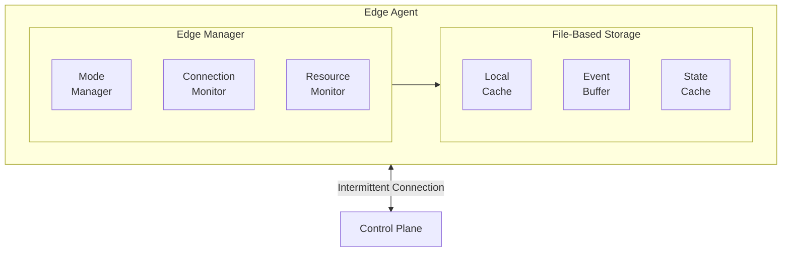
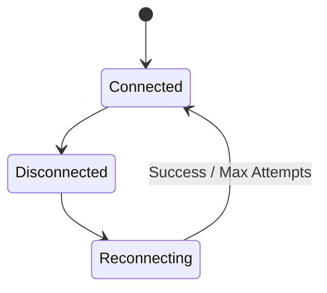
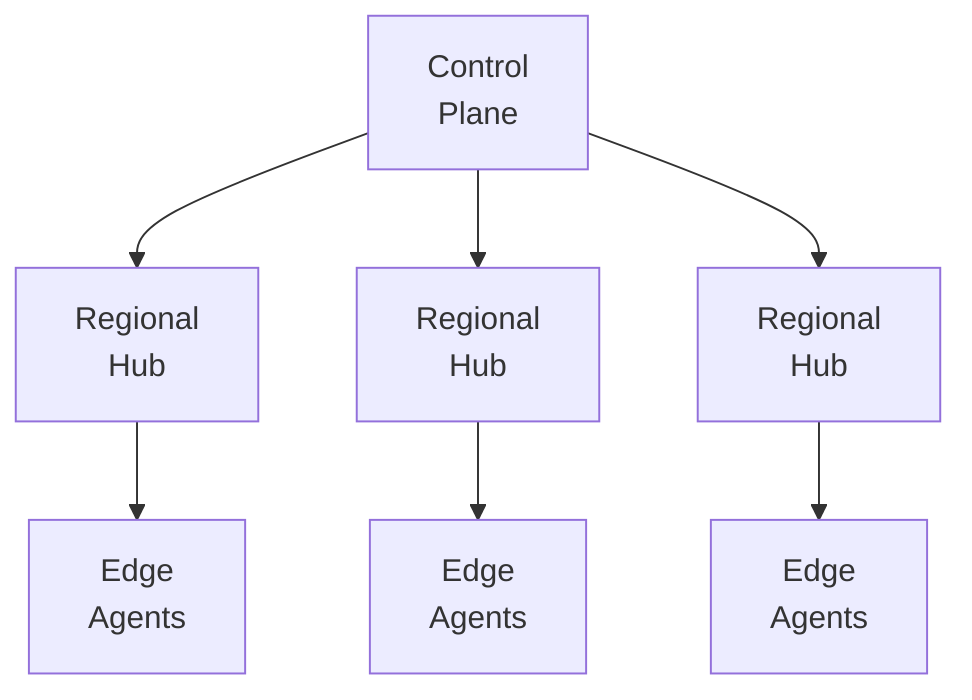

## Overview

Keystone Core supports edge computing scenarios where agents may operate with intermittent connectivity, limited resources, or complete network isolation. The edge subsystem provides local caching, automatic reconnection, and graceful degradation to ensure reliable operation in challenging environments.

## Operating Modes

### Online Mode

Normal operation with continuous connectivity to the control plane:

- Real-time command execution
- Immediate state synchronization
- Live event streaming
- Direct heartbeat reporting

### Offline Mode

Operation when disconnected from the control plane:

- Local command buffering
- Cached state application
- Event queuing for later transmission
- Autonomous operation using cached policies

### Lightweight Mode

Resource-constrained operation for IoT and embedded devices:

- Reduced memory footprint
- Minimal CPU usage
- Compressed communications
- Essential features only

## Architecture



## Local Caching

### Cache Architecture

The file-based cache stores data locally for offline operation:

```go
cache := edge.NewCache(edge.CacheConfig{
    // Cache storage directory
    Directory: "/var/lib/keystone/cache",

    // Maximum cache size
    MaxSize: 100 * 1024 * 1024, // 100MB

    // Time-to-live for cached entries
    DefaultTTL: 24 * time.Hour,

    // Enable LRU eviction when full
    EnableLRU: true,
})
```

### Cached Content

| Content Type | Description | Default TTL |
|--------------|-------------|-------------|
| **States** | State declarations and parameters | 24 hours |
| **Policies** | Policy rules for offline evaluation | 12 hours |
| **Variables** | Configuration variables | 6 hours |
| **Facts** | System facts and metadata | 1 hour |
| **Commands** | Queued command results | Until sync |

### Cache Operations

```go
// Store data in cache
err := cache.Put(ctx, "states/web-config", stateData, edge.CacheOptions{
    TTL:      24 * time.Hour,
    Priority: edge.PriorityHigh,
})

// Retrieve from cache
data, err := cache.Get(ctx, "states/web-config")

// Check if entry exists and is valid
if cache.Has(ctx, "states/web-config") {
    // Use cached data
}

// List all cached entries
entries, err := cache.List(ctx, "states/")
```

### Size Management

The cache automatically manages size through LRU eviction:

```yaml
cache:
  maxSize: 100MB
  eviction:
    # Evict when 90% full
    threshold: 0.9
    # Keep at least this many entries
    minEntries: 100
    # Never evict high-priority items first
    priorityAware: true
```

## Connection Resilience

### Reconnection Strategy

The agent uses exponential backoff for reconnection:

```yaml
connection:
  # Initial reconnect delay
  initialDelay: 1s

  # Maximum reconnect delay
  maxDelay: 5m

  # Backoff multiplier
  multiplier: 2.0

  # Add jitter to prevent thundering herd
  jitter: 0.1

  # Maximum reconnection attempts (0 = infinite)
  maxAttempts: 0
```

### Connection States



### Health Monitoring

```go
monitor := edge.NewConnectionMonitor(edge.MonitorConfig{
    // Health check interval
    CheckInterval: 30 * time.Second,

    // Timeout for health checks
    Timeout: 5 * time.Second,

    // Mark unhealthy after N failures
    FailureThreshold: 3,

    // Mark healthy after N successes
    SuccessThreshold: 2,
})
```

## Resource Constraints

### Memory Management

Configure memory limits for edge devices:

```yaml
resources:
  memory:
    # Maximum memory usage
    limit: 64MB

    # Trigger GC at this threshold
    gcThreshold: 48MB

    # Actions when limit approached
    onPressure:
      - evictCache
      - reduceBuffers
      - disableNonEssential
```

### CPU Management

Control CPU usage:

```yaml
resources:
  cpu:
    # Maximum CPU percentage
    limit: 25

    # Throttle when exceeded
    throttle: true

    # Delay between operations
    operationDelay: 100ms
```

### Storage Management

Manage local storage:

```yaml
resources:
  storage:
    # Cache directory
    cacheDir: /var/lib/keystone/cache

    # Maximum cache size
    maxCacheSize: 50MB

    # Log rotation
    logMaxSize: 10MB
    logMaxAge: 7d
```

## Configuration

### Agent Configuration

```yaml
agent:
  edge:
    # Enable edge mode (auto-detected if not set)
    enabled: true

    # Operating mode: auto, online, offline, lightweight
    mode: auto

    # Cache settings
    cache:
      enabled: true
      directory: /var/lib/keystone/cache
      maxSize: 100MB
      defaultTTL: 24h

    # Connection resilience
    connection:
      initialDelay: 1s
      maxDelay: 5m
      multiplier: 2.0
      healthCheckInterval: 30s

    # Resource limits
    resources:
      memoryLimit: 64MB
      cpuLimit: 25
      storageLimit: 100MB

    # Offline behavior
    offline:
      # Allow state application from cache
      allowCachedStates: true
      # Buffer events for later sync
      bufferEvents: true
      # Max events to buffer
      maxBufferedEvents: 10000
```

### Mode-Specific Settings

#### Lightweight Mode

```yaml
agent:
  edge:
    mode: lightweight

    # Disable non-essential features
    features:
      metrics: false
      tracing: false
      verboseLogging: false

    # Reduce update frequency
    heartbeat:
      interval: 5m  # Reduced from 30s

    # Smaller buffers
    buffers:
      command: 10
      event: 100
```

#### Offline Mode

```yaml
agent:
  edge:
    mode: offline

    # Extended cache TTLs
    cache:
      defaultTTL: 168h  # 1 week
      statesTTL: 720h   # 30 days
      policiesTTL: 168h # 1 week

    # Local-only operations
    offline:
      allowLocalExec: true
      allowCachedStates: true
      requirePolicyCache: true
```

## Offline Operations

### Cached State Application

When offline, agents can apply cached states:

```bash
# Apply cached state
kscorectl state apply --cached web-config.yaml

# Check against cached desired state
kscorectl state check --cached
```

### Event Buffering

Events are buffered during offline periods:

```go
buffer := edge.NewEventBuffer(edge.BufferConfig{
    MaxSize:     10000,
    MaxAge:      7 * 24 * time.Hour,
    FlushOnSync: true,
})

// Events are automatically buffered when offline
agent.PublishEvent(event) // Buffered if disconnected

// Manual flush when back online
buffer.Flush(ctx)
```

### Offline Policy Evaluation

Policies can be evaluated locally using cached rules:

```yaml
policy:
  offline:
    enabled: true
    cachePolicies: true
    defaultDecision: deny  # When no cached policy exists
```

## Edge Deployment Patterns

### Hub and Spoke

Central hub with remote edge nodes:



Configuration for regional hub:

```yaml
agent:
  mode: hub
  edge:
    # Act as local relay
    relay:
      enabled: true
      maxConnections: 100
      bufferSize: 1000

    # Cache for downstream agents
    cache:
      shared: true
      maxSize: 1GB
```

### Mesh Topology

Peer-to-peer edge communication:

```yaml
agent:
  edge:
    mesh:
      enabled: true
      discovery: mdns
      syncInterval: 5m
```

### Store and Forward

For severely disconnected environments:

```yaml
agent:
  edge:
    storeAndForward:
      enabled: true
      # Sync when connection available
      syncOnConnect: true
      # Or on schedule
      syncSchedule: "0 */6 * * *"  # Every 6 hours
```

## Monitoring Edge Agents

### Edge-Specific Metrics

```yaml
metrics:
  - kscore_edge_mode{mode="offline|online|lightweight"}
  - kscore_edge_cache_size_bytes
  - kscore_edge_cache_hit_ratio
  - kscore_edge_buffer_size
  - kscore_edge_connection_state{state="connected|disconnected|reconnecting"}
  - kscore_edge_last_sync_timestamp
  - kscore_edge_sync_lag_seconds
```

### Health Checks

```bash
# Check edge agent status
kscorectl agent status --edge

# View cache statistics
kscorectl cache stats

# Check sync status
kscorectl sync status
```

## Best Practices

### Cache Sizing

Size cache based on:
- Number of states to cache
- Policy complexity
- Event buffer requirements
- Available storage

```yaml
# Small edge device (Raspberry Pi)
cache:
  maxSize: 50MB

# Industrial gateway
cache:
  maxSize: 500MB

# Regional hub
cache:
  maxSize: 5GB
```

### Connection Tuning

Adjust reconnection based on connectivity patterns:

```yaml
# Cellular/satellite (expensive, intermittent)
connection:
  initialDelay: 5m
  maxDelay: 1h
  healthCheckInterval: 10m

# WiFi (frequent drops, quick recovery)
connection:
  initialDelay: 1s
  maxDelay: 30s
  healthCheckInterval: 10s
```

### State Design for Edge

Design states that work offline:

```yaml
# Good: Self-contained, idempotent
file:
  - id: /etc/app/config.yaml
    state: present
    parameters:
      contents: |
        server:
          port: 8080

# Avoid: Depends on external resources
file:
  - id: /etc/app/config.yaml
    state: present
    parameters:
      source: https://config-server/config.yaml  # Won't work offline
```

### Event Prioritization

Prioritize critical events:

```yaml
events:
  priority:
    critical:
      - security.*
      - state.drift.critical
    high:
      - agent.error
      - state.apply.failed
    normal:
      - state.apply.success
      - heartbeat
```

## Troubleshooting

### Agent Stuck in Offline Mode

Check connectivity:

```bash
# Test NATS connection
kscorectl connection test

# View connection logs
journalctl -u kscore-agent | grep -i "connection\|reconnect"
```

### Cache Corruption

Rebuild cache:

```bash
# Clear cache
kscorectl cache clear

# Re-sync from control plane
kscorectl sync force
```

### High Memory Usage

Check cache size:

```bash
# View cache statistics
kscorectl cache stats

# Manually evict old entries
kscorectl cache evict --older-than 7d
```

### Sync Failures

Check sync status and logs:

```bash
# View pending sync items
kscorectl sync status --pending

# Force sync specific items
kscorectl sync force --type events
```

## See Also

- [Agents](/docs/concepts/agents/) - Agent architecture
- [NATS Mesh](/docs/concepts/nats-mesh/) - Message bus and connectivity
- [Cloud Platforms](/docs/concepts/cloud-platforms/) - Cloud integration
- [State Management](/docs/concepts/state-management/) - Declarative configuration
