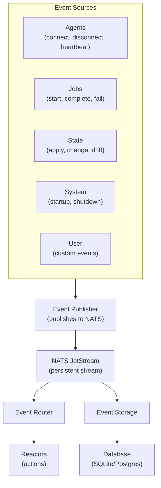
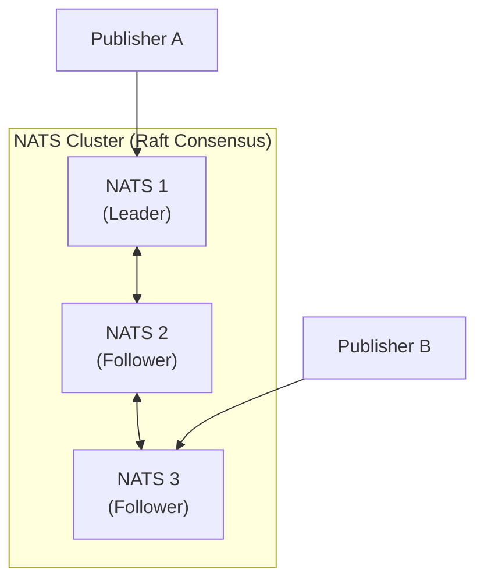

## Overview

Keystone Core's event system enables event-driven automation by capturing, routing, and storing all infrastructure events. Everything that happens in your infrastructure generates events that can trigger automated responses.

**Key Features**:
- **15 Event Types**: Comprehensive coverage of all operations
- **Pub/Sub Architecture**: NATS JetStream for reliable delivery
- **Powerful Filtering**: CEL expressions for complex event routing
- **Persistent Storage**: SQLite/PostgreSQL for queries and audit
- **External Integration**: Kafka, CloudEvents, HTTP webhooks
- **Event Enrichment**: Add context and metadata automatically

## Event Types

Keystone Core defines 22 standard event types across 6 categories:

### Agent Events

**agent.connect**:
- Emitted when agent registers with control plane
- Data: agent metadata (ID, datacenter, environment, role, OS, arch)

**agent.disconnect**:
- Emitted when agent disconnects (graceful or timeout)
- Data: disconnect reason, last heartbeat time

**agent.heartbeat**:
- Emitted for agent heartbeat events
- Data: heartbeat info, missed count if applicable

**agent.error**:
- Emitted when agent encounters an error
- Data: error details, affected operations

### Job Events

**job.start**:
- Emitted when command execution begins
- Data: job ID, command, target count

**job.complete**:
- Emitted when command execution succeeds
- Data: job ID, results, duration

**job.fail**:
- Emitted when command execution fails
- Data: job ID, error, failed agents

**job.output**:
- Emitted when job produces output
- Data: job ID, stdout, stderr, exit code

### State Events

**state.apply.start**:
- Emitted when state application begins
- Data: state file, target agents, module count

**state.apply.done**:
- Emitted when state application completes
- Data: results summary, changed count, failed count

**state.apply.fail**:
- Emitted when state application fails
- Data: error, failed modules

**state.change**:
- Emitted when state resources change
- Data: module ID, old state, new state

**state.drift**:
- Emitted when configuration drift detected
- Data: drift details, severity, affected resources

### System Events

**system.startup**:
- Emitted when control plane starts
- Data: version, configuration summary

**system.shutdown**:
- Emitted when control plane shuts down gracefully
- Data: shutdown reason, uptime

**system.error**:
- Emitted when system encounters an error
- Data: error details, component affected

### User Events

**user.login**:
- Emitted when user logs in
- Data: user identity, login method, source IP

**user.command**:
- Emitted when user executes a command
- Data: command, arguments, target

**user.error**:
- Emitted when user operation encounters an error
- Data: error details, operation attempted

### Policy Events

**policy.pass**:
- Emitted when policy evaluation passes
- Data: policy ID, resource, evaluation details

**policy.violation**:
- Emitted when policy violation is detected
- Data: policy ID, severity, violation details, remediation

## Event Structure

Every event follows this schema:

```go
type Event struct {
    ID            string                 // Unique event ID
    Type          EventType              // Event type (agent.connect, job.start, etc.)
    Source        string                 // Event source (agent ID or system component)
    Time          time.Time              // When event occurred
    Severity      Severity               // debug, info, warning, error, critical
    CorrelationID string                 // For tracking related events
    Tags          map[string]string      // Custom tags as key-value pairs
    Data          map[string]interface{} // Event-specific data
    Subject       string                 // NATS subject for this event
}
```

**Example Event** (agent.connect):
```json
{
  "id": "550e8400-e29b-41d4-a716-446655440000",
  "type": "agent.connect",
  "source": "web-01",
  "timestamp": "2024-01-15T10:23:45Z",
  "severity": "info",
  "correlation_id": "agent-web-01",
  "tags": {"env": "production", "region": "us-east-1"},
  "data": {
    "agent_id": "web-01",
    "datacenter": "us-east-1",
    "environment": "production",
    "role": "web",
    "os": "linux",
    "arch": "amd64",
    "metadata": {
      "hostname": "web-01.example.com",
      "ip": "10.0.1.100"
    }
  }
}
```

## Event Flow



## Event Publishing

### From Code

> **Note**: The events package is internal (`internal/events`). For external integrations,
> use the CLI or HTTP API shown below.

Internal code uses the fluent builder API:

```go
// Internal usage only (internal/events)
event := events.NewEvent(events.EventTypeJobComplete).
    Source("control-plane").
    Severity(events.SeverityInfo).
    CorrelationID("job-" + jobID).
    Tag("env", "production").
    DataMap(map[string]interface{}{
        "job_id": jobID,
        "status": "success",
        "duration": duration.Seconds(),
    }).
    Build()

// Publish
publisher.Publish(event)
```

### From CLI

Emit custom events:

```bash
kscorectl events emit \
  --type user.custom \
  --source "maintenance-script" \
  --severity info \
  --data '{"action":"backup","database":"mydb","status":"success"}'
```

### From HTTP API

POST to `/api/v1/events`:

```bash
curl -X POST http://control-plane:8080/api/v1/events \
  -H "Content-Type: application/json" \
  -d '{
    "type": "user.custom",
    "source": "external-system",
    "severity": "warning",
    "data": {"alert": "disk usage high"}
  }'
```

## Event Filtering

Filter events using CEL expressions:

### Simple Filters

```go
// By type
filter: "type == 'agent.connect'"

// By source
filter: "source == 'web-01'"

// By severity
filter: "severity >= 'warning'"

// By tag
filter: "tags contains 'production'"
```

### Complex Filters

```go
// Multiple conditions (AND)
filter: "type == 'job.fail' and severity == 'critical'"

// Multiple conditions (OR)
filter: "type == 'agent.connect' or type == 'agent.disconnect'"

// Regex matching
filter: "source =~ 'web-.*'"

// Data field access
filter: "data.exit_code != 0"

// Nested data
filter: "data.agent.environment == 'production'"
```

### Filtering Operators

**Comparison**:
- `==`, `!=` - Equality
- `>`, `>=`, `<`, `<=` - Comparison
- `=~` - Regex match
- `~~` - Glob match

**Logical**:
- `and`, `&&` - Logical AND
- `or`, `||` - Logical OR
- `not`, `!` - Logical NOT

**Container**:
- `contains` - String/array contains
- `in` - Element in array

**Examples**:
```go
// Severity comparison
severity >= 'warning'  // warning, error, critical

// Pattern matching
source =~ '^web-.*'    // web-01, web-02, etc.
source ~~ 'web-*'      // same using glob

// Array operations
tags contains 'production'
'nginx' in tags
```

## Event Routing

Route events to different handlers based on filters:

```yaml
# Routing configuration
routes:
  - name: critical_alerts
    filter: "severity == 'critical'"
    priority: 1
    handler: pagerduty_webhook

  - name: production_state_changes
    filter: "type == 'state.change' and data.environment == 'production'"
    priority: 2
    handler: slack_webhook

  - name: all_agent_events
    filter: "type startsWith 'agent.'"
    priority: 10
    handler: event_storage
```

### Router Behavior

- Routes evaluated in priority order (lower = higher priority)
- Multiple routes can match (fan-out)
- `stop_on_match: true` stops after first match

## Event Storage

Events are persisted to SQLite or PostgreSQL for querying and audit.

### Storage Schema

```sql
CREATE TABLE events (
    id TEXT PRIMARY KEY,
    type TEXT NOT NULL,
    source TEXT NOT NULL,
    timestamp TIMESTAMP NOT NULL,
    severity TEXT NOT NULL,
    correlation_id TEXT,
    tags TEXT,  -- JSON array
    data TEXT,  -- JSON object
    INDEX idx_type (type),
    INDEX idx_source (source),
    INDEX idx_timestamp (timestamp),
    INDEX idx_severity (severity),
    INDEX idx_correlation (correlation_id)
);
```

### Querying Events

**CLI**:
```bash
# List recent events
kscorectl events list

# Filter by type
kscorectl events list --type agent.connect

# Filter by time range
kscorectl events list --since 1h --until now

# Filter by severity
kscorectl events list --severity warning,error,critical

# Query with expression
kscorectl events query "type == 'job.fail' and severity == 'error'"
```

**API**:
```bash
# GET /api/v1/events
curl "http://control-plane:8080/api/v1/events?type=agent.connect&limit=100"
```

**Go Code**:
```go
// Filter events using EventFilter
filter := &events.EventFilter{
    Types:    []events.EventType{events.EventTypeAgentConnect},
    Severity: events.SeverityWarning,
    Since:    &since,
    Until:    &until,
}

// Subscribe with filter
subscriber.SubscribeWithFilter("agent.>", filter, func(event *events.Event) error {
    // Handle matching events
    return nil
})
```

### Retention Policies

Configure automatic event cleanup:

```yaml
event_storage:
  retention:
    max_age: 30d        # Delete events older than 30 days
    max_count: 1000000  # Keep max 1 million events
    min_severity: info  # Delete debug events after 7 days

  # Per-type retention
  type_retention:
    agent.heartbeat: 1d   # Keep heartbeats for 1 day
    state.drift: 90d      # Keep drift events for 90 days
    user.custom: 365d     # Keep custom events for 1 year
```

## Event Enrichment

Automatically add context to events:

### Tag Enrichment

Add tags based on event properties:

```go
enricher := enrichment.NewTagEnricher(map[string]string{
    "environment": "production",
    "region": "us-east-1",
})
```

### Data Enrichment

Add data fields:

```go
enricher := enrichment.NewDataEnricher(map[string]interface{}{
    "cluster": "prod-cluster-01",
    "version": "1.2.3",
})
```

### Function Enrichment

Custom enrichment logic:

```go
enricher := enrichment.NewFunctionEnricher(func(event *Event) error {
    // Add hostname
    event.Data["hostname"] = os.Hostname()

    // Add timestamp fields
    event.Data["hour"] = event.Timestamp.Hour()
    event.Data["day_of_week"] = event.Timestamp.Weekday()

    return nil
})
```

### Conditional Enrichment

Enrich only if filter matches:

```go
enricher := enrichment.NewConditionalEnricher(
    "type == 'agent.connect'",  // Filter
    enrichment.NewDataEnricher(map[string]interface{}{
        "first_connect": true,
    }),
)
```

### Chaining Enrichers

Compose multiple enrichers:

```go
enricher := enrichment.ChainEnrichers(
    enrichment.NewTagEnricher(...),
    enrichment.NewDataEnricher(...),
    enrichment.NewFunctionEnricher(...),
)
```

## External Integration

### Kafka

Publish events to Kafka:

```yaml
kafka:
  enabled: true
  brokers:
    - kafka1.example.com:9092
    - kafka2.example.com:9092
  topic: kscore-events
  compression: snappy
```

```go
publisher := events.NewKafkaPublisher(config)
publisher.Publish(ctx, event)
```

### CloudEvents

Convert to CloudEvents format:

```go
// Keystone Core Event → CloudEvent
cloudEvent := events.ToCloudEvent(event)

// CloudEvent → Keystone Core Event
event := events.FromCloudEvent(cloudEvent)
```

Send via HTTP:

```go
handler := events.NewHTTPCloudEventHandler()
http.HandleFunc("/cloudevents", handler.Handle)
```

### HTTP Webhooks

Forward events to external HTTP endpoints:

```yaml
webhooks:
  - name: slack
    url: https://hooks.slack.com/services/XXX/YYY/ZZZ
    filter: "severity >= 'warning'"
    headers:
      Content-Type: application/json
    retry:
      attempts: 3
      backoff: exponential
```

### Event Bridge

Bridge events between systems by subscribing to one event source and publishing to another:

```go
// Subscribe to state events and forward to Kafka
filter := &events.EventFilter{
    Types: []events.EventType{
        events.EventTypeStateApplyStart,
        events.EventTypeStateApplyDone,
        events.EventTypeStateChange,
        events.EventTypeStateDrift,
    },
}

sourceSubscriber.SubscribeWithFilter("state.>", filter, func(event *events.Event) error {
    // Transform and forward to Kafka
    return kafkaPublisher.Publish(event)
})
```

## Event Replay

Replay historical events for testing or recovery using the CLI:

```bash
# Replay events from last hour
kscorectl events replay --since 1h --until now

# Replay specific event types
kscorectl events replay --type state.change --since 24h

# Replay to a different target
kscorectl events replay --since 1h --target webhook:https://example.com/events
```

**Use Cases**:
- Test reactor changes with historical data
- Recover from processing failures
- Audit and compliance reviews
- Debugging event-driven workflows

## Event Ordering Semantics

Understanding event ordering is critical for building reliable event-driven systems. Keystone Core provides specific ordering guarantees through NATS JetStream.

### Ordering Guarantees

| Scope | Guarantee | Notes |
|-------|-----------|-------|
| Single source | Strict FIFO | Events from same source are ordered |
| Single subject | Strict FIFO | Events on same NATS subject are ordered |
| Across sources | No guarantee | Events from different sources may interleave |
| Across subjects | No guarantee | Use correlation IDs to track related events |

### Per-Source Ordering

Events from the same source (agent, control plane component) are delivered in the order they were published:

```
Source: web-01
Events: E1 → E2 → E3 → E4
Delivery: E1, E2, E3, E4 (guaranteed order)
```

This is achieved through:
- Single publisher per source
- NATS JetStream sequence numbers
- Ordered consumer configuration

### Per-Subject Ordering

NATS subjects partition the event stream. Events on the same subject maintain order:

```
Subject: kscore.events.agent.connect
Publisher 1: E1, E3
Publisher 2: E2, E4

Possible delivery: E1, E2, E3, E4 (within subject, order maintained per publisher)
```

**Subject hierarchy:**
```
kscore.events.                    # All events
kscore.events.agent.              # Agent events (connect, disconnect, etc.)
kscore.events.agent.connect       # Specific event type
kscore.events.job.                # Job events
kscore.events.state.              # State events
```

### Cross-Source Ordering

Events from different sources have **no ordering guarantee**:

```
Source A: E1a, E2a, E3a (timestamps: 10:00:01, 10:00:02, 10:00:03)
Source B: E1b, E2b, E3b (timestamps: 10:00:01, 10:00:02, 10:00:03)

Possible delivery orders:
- E1a, E1b, E2a, E2b, E3a, E3b
- E1a, E2a, E1b, E3a, E2b, E3b
- E1b, E1a, E2a, E2b, E3a, E3b
- ... (any valid interleaving)
```

**Why this matters:**
- Job results may arrive before job start notification (from different agents)
- Agent disconnect may arrive before related error events
- State changes from multiple agents interleave unpredictably

### Clustered NATS Considerations

In multi-node NATS clusters, additional factors affect ordering:

#### Leader-Based Ordering

JetStream uses Raft consensus for streams. The stream leader sequences all messages:



Both publishers' events are sequenced by the leader.

#### During Leader Elections

When a leader election occurs:
- Publishing pauses briefly (typically <100ms)
- No events are lost (Raft guarantees)
- Order is preserved across election
- Consumers may see brief delay

#### Network Partitions

During network partitions:
- Minority partition cannot publish (no quorum)
- Majority partition continues normally
- After healing, all events are delivered in order
- Consumers on minority side may miss events until reconnect

### Achieving Global Ordering

If you need strict global ordering across all events, use one of these strategies:

#### 1. Centralized Sequencing

Route all events through a single sequencer:

```yaml
event_processing:
  ordering:
    mode: centralized
    sequencer: control-plane-1
```

**Trade-offs:**
- Single point of bottleneck
- Higher latency
- Guaranteed global order

#### 2. Timestamp-Based Reordering

Buffer events and reorder by timestamp before processing:

```yaml
event_processing:
  ordering:
    mode: reorder
    buffer_window: 5s  # Wait 5 seconds for late events
    clock_skew_tolerance: 1s
```

**Trade-offs:**
- Adds latency equal to buffer window
- Requires synchronized clocks (NTP)
- May still have edge cases with high clock skew

#### 3. Correlation-Based Processing

Group related events by correlation ID and process as a unit:

```yaml
event_processing:
  ordering:
    mode: correlation
    correlation_timeout: 30s  # Wait for related events
```

**Trade-offs:**
- Only orders within correlation groups
- Requires proper correlation ID usage
- Good for job/workflow tracking

### Clock Synchronization

Event timestamps depend on source clocks. For accurate ordering:

1. **Use NTP on all nodes**:
   ```bash
   # Install and configure NTP
   systemctl enable chronyd
   systemctl start chronyd
   chronyc tracking  # Verify sync
   ```

2. **Monitor clock skew**:
   ```promql
   # Alert if clock skew exceeds 100ms
   ALERT ClockSkew
     IF abs(node_timex_offset_seconds) > 0.1
     FOR 5m
   ```

3. **Configure tolerance**:
   ```yaml
   event_processing:
     clock_skew_tolerance: 100ms
   ```

### Consumer Configuration

Configure consumers for ordered delivery:

```yaml
# Ordered consumer (single active)
consumers:
  ordered_processor:
    deliver_policy: all
    ack_policy: explicit
    max_ack_pending: 1  # Process one at a time
    replay_policy: instant

# Parallel consumer (multiple active, per-subject order)
consumers:
  parallel_processor:
    deliver_policy: all
    ack_policy: explicit
    max_ack_pending: 100  # Process multiple in parallel
    replay_policy: instant
```

### Idempotency

Because events may be redelivered (network issues, consumer restart), design handlers to be idempotent:

```go
func handleEvent(event *events.Event) error {
    // Check if already processed
    if store.HasProcessed(event.ID) {
        return nil  // Skip duplicate
    }

    // Process event
    if err := processEvent(event); err != nil {
        return err
    }

    // Mark as processed
    store.MarkProcessed(event.ID)
    return nil
}
```

### Debugging Ordering Issues

```bash
# Check event sequence numbers via NATS
nats stream info KSCORE_EVENTS --json | jq '.state.messages'

# List recent events from a source
kscorectl events list --source web-01 --limit 100

# View consumer lag
nats consumer info KSCORE_EVENTS processor

# Check stream info
nats stream info KSCORE_EVENTS
```

## Retention Sizing Recommendations

Proper retention sizing balances storage costs with operational and compliance needs. This section provides guidance for sizing event storage based on deployment scale.

### Sizing Factors

| Factor | Impact on Storage | Typical Range |
|--------|-------------------|---------------|
| Agent count | Linear | 10 - 10,000 agents |
| Event rate | Linear | 1 - 100 events/agent/minute |
| Event size | Linear | 0.5 - 5 KB average |
| Retention period | Linear | 7 - 365 days |
| Query patterns | Index overhead | 20-50% additional |

### Event Size Reference

| Event Type | Typical Size | Notes |
|------------|--------------|-------|
| agent.heartbeat | 0.5 KB | High volume, minimal data |
| agent.connect/disconnect | 1 KB | Includes metadata |
| job.start/complete | 2 KB | Includes command info |
| job.output | 1-50 KB | Varies with output size |
| state.change | 2 KB | Module diff data |
| state.drift | 3 KB | Includes drift details |
| policy.violation | 2 KB | Policy context |
| user.custom | 1-10 KB | Depends on payload |

### Sizing Formula

```
Daily Storage (GB) = Agents × Events/Agent/Day × Avg Event Size (KB) / 1,000,000

Total Storage (GB) = Daily Storage × Retention Days × (1 + Index Overhead)
```

### Sizing Examples

#### Small Deployment (50 agents)

**Assumptions:**
- 50 agents
- 100 events/agent/day (heartbeats disabled in storage)
- 2 KB average event size
- 30 days retention
- 30% index overhead

**Calculation:**
```
Daily: 50 × 100 × 2 KB = 10 MB/day
30 days: 10 MB × 30 × 1.3 = 390 MB

Recommended: 1 GB (SQLite adequate)
```

**Configuration:**
```yaml
event_storage:
  backend: sqlite
  retention:
    max_age: 30d
    max_size: 1GB
  type_retention:
    agent.heartbeat: 1d    # Short retention for heartbeats
```

#### Medium Deployment (500 agents)

**Assumptions:**
- 500 agents
- 200 events/agent/day
- 2 KB average event size
- 30 days retention
- 30% index overhead

**Calculation:**
```
Daily: 500 × 200 × 2 KB = 200 MB/day
30 days: 200 MB × 30 × 1.3 = 7.8 GB

Recommended: 15 GB (PostgreSQL recommended)
```

**Configuration:**
```yaml
event_storage:
  backend: postgresql
  retention:
    max_age: 30d
    max_count: 50000000    # 50M events
  type_retention:
    agent.heartbeat: 1d
    job.output: 7d         # Large events, shorter retention
```

#### Large Deployment (5,000 agents)

**Assumptions:**
- 5,000 agents
- 500 events/agent/day (high automation)
- 2.5 KB average event size
- 90 days retention
- 30% index overhead

**Calculation:**
```
Daily: 5,000 × 500 × 2.5 KB = 6.25 GB/day
90 days: 6.25 GB × 90 × 1.3 = 731 GB

Recommended: 1 TB (PostgreSQL with partitioning)
```

**Configuration:**
```yaml
event_storage:
  backend: postgresql
  retention:
    max_age: 90d
    max_count: 500000000   # 500M events
  partitioning:
    enabled: true
    strategy: monthly
  type_retention:
    agent.heartbeat: 12h   # Minimal heartbeat storage
    job.output: 14d        # Medium retention for output
    state.drift: 180d      # Long retention for drift
  archival:
    enabled: true
    after: 30d
    destination: s3://events-archive/
```

#### Enterprise Deployment (50,000 agents)

**Assumptions:**
- 50,000 agents
- 200 events/agent/day
- 2 KB average event size
- 365 days retention
- 30% index overhead

**Calculation:**
```
Daily: 50,000 × 200 × 2 KB = 20 GB/day
365 days: 20 GB × 365 × 1.3 = 9.5 TB

Recommended: Multi-TB PostgreSQL cluster with archival
```

**Configuration:**
```yaml
event_storage:
  backend: postgresql
  cluster:
    enabled: true
    read_replicas: 3
  retention:
    hot: 30d              # Fast storage
    warm: 90d             # Standard storage
    cold: 365d            # Archive storage
  partitioning:
    enabled: true
    strategy: weekly
  archival:
    enabled: true
    after: 30d
    destination: s3://events-archive/
    storage_class: GLACIER
```

### Per-Type Retention Strategy

Optimize storage by setting different retention periods per event type:

| Event Type | Typical Retention | Rationale |
|------------|-------------------|-----------|
| agent.heartbeat | 1-7 days | High volume, low value after short period |
| agent.connect | 30-90 days | Useful for connection history |
| agent.disconnect | 30-90 days | Useful for troubleshooting |
| job.start | 30-90 days | Audit trail |
| job.complete | 30-90 days | Audit trail |
| job.fail | 90-365 days | Important for pattern analysis |
| job.output | 7-30 days | Large size, archive if needed |
| state.apply.done | 30-90 days | State history |
| state.change | 90-180 days | Configuration audit |
| state.drift | 180-365 days | Compliance evidence |
| policy.violation | 365+ days | Compliance requirement |
| user.* | 365+ days | Audit trail |

**Configuration:**
```yaml
event_storage:
  retention:
    default: 30d
  type_retention:
    agent.heartbeat: 1d
    agent.connect: 90d
    agent.disconnect: 90d
    job.start: 90d
    job.complete: 90d
    job.fail: 365d
    job.output: 14d
    state.apply.done: 90d
    state.change: 180d
    state.drift: 365d
    policy.violation: 730d    # 2 years
    policy.pass: 30d
    user.*: 730d              # Wildcard for user events
```

### JetStream vs Database Sizing

Events flow through both JetStream (streaming) and database (queries):

**JetStream Sizing:**
```yaml
nats:
  jetstream:
    # Size for replay window, not long-term storage
    max_memory: 1GB          # Recent events in memory
    max_file: 10GB           # Short-term persistence

streams:
  KSCORE_EVENTS:
    max_age: 7d              # JetStream keeps 7 days
    max_bytes: 10GB
    storage: file
```

**Database Sizing:**
```yaml
event_storage:
  # Long-term storage and queries
  retention:
    max_age: 90d             # Database keeps 90 days
    max_size: 100GB
```

**Relationship:**
- JetStream: Short-term buffer for real-time processing
- Database: Long-term storage for queries and audit

### Monitoring Storage

```promql
# Current event count by type
sum(kscore_events_count) by (type)

# Storage usage
kscore_events_storage_bytes
kscore_events_storage_percent_used

# Growth rate (events per second)
rate(kscore_events_stored_total[1h])

# Estimated days until full
(kscore_events_storage_max_bytes - kscore_events_storage_bytes)
  / (rate(kscore_events_storage_bytes[1d]) * 86400)
```

**Alerts:**
```yaml
- alert: EventStorageHigh
  expr: kscore_events_storage_percent_used > 80
  for: 1h
  labels:
    severity: warning
  annotations:
    summary: "Event storage at {{ $value }}%"

- alert: EventStorageCritical
  expr: kscore_events_storage_percent_used > 95
  for: 15m
  labels:
    severity: critical
  annotations:
    summary: "Event storage nearly full at {{ $value }}%"

- alert: EventRetentionNotRunning
  expr: time() - kscore_events_retention_last_run_timestamp > 86400
  for: 1h
  labels:
    severity: warning
```

### Cost Optimization

1. **Disable heartbeat storage** if not needed for troubleshooting:
   ```yaml
   type_retention:
     agent.heartbeat: 0    # Don't store heartbeats
   ```

2. **Truncate large events** before storage:
   ```yaml
   event_storage:
     truncation:
       job.output: 10KB    # Only store first 10KB of output
   ```

3. **Archive to cold storage** after hot period:
   ```yaml
   archival:
     after: 30d
     storage_class: GLACIER
   ```

4. **Compress archived events**:
   ```yaml
   archival:
     compression: zstd
     compression_level: 3
   ```

5. **Use partitioning** for faster retention enforcement:
   ```yaml
   partitioning:
     enabled: true
     strategy: monthly   # Drop entire partitions vs row-by-row delete
   ```

## Performance

### Throughput

- **Publish**: 50,000 events/sec
- **Subscribe**: 40,000 events/sec
- **Storage**: 10,000 writes/sec (SQLite), 50,000 writes/sec (PostgreSQL)
- **Query**: 100,000 reads/sec

### Latency

- **Publish → JetStream**: <5ms (p95)
- **JetStream → Subscriber**: <10ms (p95)
- **End-to-end**: <20ms (p95)

### Resource Usage

**Per 10,000 events/sec**:
- CPU: 0.5 cores
- Memory: 200MB
- Disk I/O: 50 MB/s

## Best Practices

### Event Design

1. **Use Standard Types**: Prefer standard event types over custom
2. **Meaningful Sources**: Use descriptive source names
3. **Consistent Data**: Keep data structure consistent per event type
4. **Correlation IDs**: Always set for related events
5. **Appropriate Severity**: Match severity to actual impact

### Filtering

1. **Specific Filters**: Write narrow filters to reduce processing
2. **Test Filters**: Verify filters match expected events
3. **Avoid Heavy Logic**: Keep filter expressions simple

### Storage

1. **Retention Policies**: Configure appropriate retention
2. **Index Strategy**: Index frequently queried fields
3. **Partition Data**: Consider partitioning by month/year for large volumes
4. **Archive Old Events**: Move to cold storage (S3, GCS) after retention period

### Integration

1. **Async Publishing**: Don't block on event publish
2. **Retry Logic**: Implement retries for external systems
3. **Circuit Breakers**: Protect against downstream failures
4. **Monitoring**: Track event lag and processing errors

## Monitoring

### Metrics

```
# Publishing
kscore_events_published_total{type}
kscore_events_publish_errors_total

# Subscribing
kscore_events_received_total{type}
kscore_events_processing_errors_total

# Storage
kscore_events_stored_total
kscore_events_storage_errors_total
kscore_events_count{type}  # Current count

# Performance
kscore_event_processing_duration_seconds{quantile}
kscore_event_lag_seconds
```

### Health Checks

Monitor event system health:

- **Publisher**: Events successfully publishing
- **Subscriber**: No processing errors
- **Storage**: Database reachable and writable
- **Lag**: Event processing lag <1 second

## Troubleshooting

### Events Not Published

**Problem**: Events not appearing in storage

Check:
```bash
# Check publisher metrics
curl http://control-plane:8080/metrics | grep events_published

# Check NATS JetStream
nats stream info KSCORE_EVENTS

# Check consumer status
nats consumer info KSCORE_EVENTS processor
```

### High Event Lag

**Problem**: Event processing falling behind

Check:
- Subscriber processing speed
- Database write performance
- Filter complexity

Fix:
- Add more subscribers (horizontal scaling)
- Optimize filters
- Increase database resources

### Storage Full

**Problem**: Event database out of space

Fix:
```bash
# Check storage usage via metrics
curl http://control-plane:8080/metrics | grep events_storage

# Check JetStream storage
nats stream info KSCORE_EVENTS

# Retention is managed automatically via server configuration
# To manually purge old events from JetStream:
nats stream purge KSCORE_EVENTS --keep 1000000

# For database storage, use retention policy configuration
# or manual SQL cleanup if using PostgreSQL
```

## Next Steps

- Learn about [Reactors](/docs/concepts/reactors/) that respond to events
- Understand [Control Plane](/docs/concepts/control-plane/) event engine
- Explore [Message Bus](/docs/concepts/message-bus/) JetStream integration
- See [Observability](/docs/concepts/observability/) for event metrics
