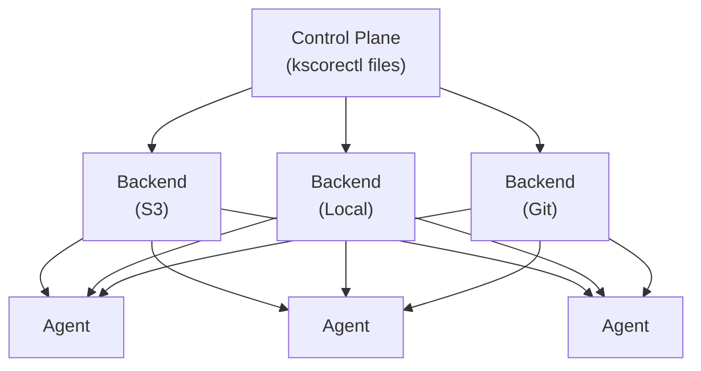

# File Distribution

Keystone Core includes a distributed file system for managing configuration files, binaries, and other assets across your infrastructure. Built on NATS and supporting multiple storage backends, it provides reliable, secure, and efficient file distribution at scale.

## Overview

The file distribution system enables:

- **Centralized file management**: Store and version files in a central location
- **Efficient distribution**: Push files to thousands of agents over NATS
- **Multiple backends**: Local filesystem, S3, GCS, Azure Blob, Git, NATS Object Store
- **Content-addressed storage**: Deduplicate identical files automatically
- **Access control**: Namespace-based permissions with ACLs
- **Mirror groups**: Geographic routing and high availability
- **Proxy caching**: Cache files at edge locations for offline access

## Architecture



## Storage Backends

### Local Filesystem

The simplest backend, storing files on the local disk:

```yaml
# kscorectl files configuration
backend:
  type: local
  local:
    root: /var/lib/keystone-core/files
```

### Amazon S3

Store files in S3 with optional encryption:

```yaml
backend:
  type: s3
  s3:
    bucket: my-kscorectl files
    region: us-west-2
    prefix: files/
    # Optional: use IAM roles or explicit credentials
    access_key_id: ${AWS_ACCESS_KEY_ID}
    secret_access_key: ${AWS_SECRET_ACCESS_KEY}
```

### Google Cloud Storage

Store files in GCS:

```yaml
backend:
  type: gcs
  gcs:
    bucket: my-kscorectl files
    prefix: files/
    # Uses GOOGLE_APPLICATION_CREDENTIALS
```

### Azure Blob Storage

Store files in Azure:

```yaml
backend:
  type: azure
  azure:
    container: kscorectl files
    account: mystorageaccount
    # Uses AZURE_STORAGE_KEY or managed identity
```

### Git Repository

Store files in a Git repository with full version history:

```yaml
backend:
  type: git
  git:
    url: https://github.com/myorg/kscorectl files.git
    branch: main
    local_path: /var/lib/keystone-core/git-files
    # Auth: token, ssh-key, or ssh-agent
    auth:
      type: token
      token: ${GIT_TOKEN}
```

### NATS Object Store

Use NATS JetStream for file storage:

```yaml
backend:
  type: nats
  nats:
    bucket: kscorectl files
    # Uses existing NATS connection
```

## Content-Addressed Storage

Files are stored using content-addressed hashing:

- **Deduplication**: Identical files stored once regardless of path
- **Integrity**: SHA-256 hashes verify file integrity
- **Efficient sync**: Only changed files are transferred

```go
// File stored by hash
hash := sha256.Sum256(content)
path := fmt.Sprintf("%s/%x", hash[:2], hash) // e.g., "ab/ab3def..."
```

## Namespaces

Files are organized into namespaces for access control:

```yaml
# Create a namespace
kscorectl files namespace create prod-configs --description "Production configs"

# Set access controls
kscorectl files namespace access prod-configs \
  --allow-user role:ops \
  --read-write

# List files in namespace
kscorectl files list prod-configs/
```

### Namespace Permissions

- `read`: Read file contents and metadata
- `write`: Create and update files
- `delete`: Remove files
- `list`: List files in namespace
- `admin`: Manage namespace ACLs

## Mirror Groups

Mirror groups provide geographic routing and high availability:

```yaml
# Mirror group configuration
mirror_groups:
  - id: us-mirrors
    name: US Region Mirrors
    mirrors:
      - id: us-west
        cluster_id: cluster-west
        location: "37.7749,-122.4194"  # San Francisco
        is_primary: true
      - id: us-east
        cluster_id: cluster-east
        location: "40.7128,-74.0060"   # New York
    read_strategy: nearest    # Route reads to nearest mirror
    write_policy: all         # Write to all mirrors
```

### Read Strategies

| Strategy | Description |
|----------|-------------|
| `nearest` | Route to geographically nearest healthy mirror |
| `round-robin` | Distribute across all healthy mirrors |
| `failover` | Use primary, fail to secondary |
| `fastest` | Route based on recent response times |

### Write Policies

| Policy | Description |
|--------|-------------|
| `all` | Write to all mirrors (strongest consistency) |
| `quorum` | Write to majority of mirrors |
| `primary-only` | Write to primary only |
| `primary-secondary` | Write to primary, sync to one secondary |

## Synchronization

Mirrors automatically synchronize:

```bash
# View sync status
kscorectl files mirrors sync-status us-mirrors

# Trigger manual sync
kscorectl files mirrors sync us-mirrors

# View sync history
kscorectl files mirrors history --group us-mirrors
```

### Conflict Resolution

When files conflict across mirrors:

```bash
# List conflicts
kscorectl files mirrors conflicts --group us-mirrors

# Resolve conflict
kscorectl files mirrors resolve-conflict <conflict-id> \
  --strategy source  # or: target, manual
```

## Proxy Agent Caching

Edge agents can cache files locally:

```yaml
# Agent configuration
files:
  cache:
    enabled: true
    path: /var/cache/keystone-core/files
    max_size: 10GB
    ttl: 24h
    offline_mode: true  # Serve from cache when disconnected
```

### Cache Behavior

1. **On request**: Check local cache first
2. **Cache miss**: Fetch from server, store locally
3. **Cache hit**: Serve from cache, check freshness async
4. **Offline**: Serve stale cache entries if available

## CLI Commands

### File Operations

```bash
# Upload a file
kscorectl files put local-file.txt namespace/path/file.txt

# Download a file
kscorectl files get namespace/path/file.txt local-file.txt

# List files
kscorectl files list namespace/

# Delete a file
kscorectl files delete namespace/path/file.txt

# Get file metadata
kscorectl files info namespace/path/file.txt

# Get file hash (included in info output)
kscorectl files info namespace/path/file.txt
```

### Mirror Management

```bash
# List mirror groups
kscorectl files mirrors list

# Show mirror group details
kscorectl files mirrors show <group-id>

# Check mirror health
kscorectl files mirrors health --group <group-id>

# Trigger failover
kscorectl files mirrors failover <group-id> --to <mirror-id>
```

### Server Administration

```bash
# Start file server
kscorectl files serve --config /etc/keystone-core/files.yaml

# Check backend health
kscorectl files backend health

# Check specific backend status
kscorectl files backend status <backend-name>
```

## State Module Integration

Files can be managed through state declarations:

```yaml
# State file
- id: deploy-nginx-config
  module: file
  params:
    path: /etc/nginx/nginx.conf
    source: files://prod-configs/nginx/nginx.conf
    mode: "0644"
    owner: root
    group: root
```

The `files://` source protocol:
1. Fetches file from central file server
2. Uses content hash for change detection
3. Applies local file management

## Metrics

The file distribution system exposes Prometheus metrics:

| Metric | Type | Description |
|--------|------|-------------|
| `kscore_mirror_groups_total` | Gauge | Number of mirror groups |
| `kscore_mirror_health` | Gauge | Mirror health (1=healthy, 0=unhealthy) |
| `kscore_mirror_read_operations_total` | Counter | Total read operations |
| `kscore_mirror_write_operations_total` | Counter | Total write operations |
| `kscore_mirror_read_bytes_total` | Counter | Total bytes read |
| `kscore_mirror_write_bytes_total` | Counter | Total bytes written |
| `kscore_mirror_sync_operations_total` | Counter | Total sync operations |
| `kscore_mirror_sync_conflicts_total` | Counter | Total sync conflicts |
| `kscore_mirror_read_latency_seconds` | Histogram | Read latency |
| `kscore_mirror_write_latency_seconds` | Histogram | Write latency |

## Grafana Dashboard

A pre-built Grafana dashboard is available at `deploy/grafana/dashboards/file-mirrors.json` with panels for:

- Mirror group overview
- Health status per mirror
- Read/write throughput
- Sync operations and conflicts
- Latency percentiles
- Error rates

## Alert Rules

Alerting rules are provided at `deploy/grafana/alerts/file-mirrors-alerts.yml`:

| Alert | Severity | Description |
|-------|----------|-------------|
| MirrorUnhealthy | Warning | Mirror unhealthy for 5+ minutes |
| MirrorGroupDegraded | Warning | <75% of mirrors healthy |
| MirrorGroupCritical | Critical | <50% of mirrors healthy |
| NoHealthyMirrors | Critical | All mirrors unhealthy |
| HighSyncFailureRate | Warning | >10% sync failures |
| ManyUnresolvedConflicts | Warning | >10 conflicts per hour |
| HighReadErrorRate | Warning | >1% read errors |

## Best Practices

### File Organization

- Use namespaces to separate environments (dev, staging, prod)
- Use consistent directory structures across namespaces
- Store configuration files in versioned paths

### High Availability

- Configure at least 3 mirrors for critical data
- Place mirrors in different geographic regions
- Use quorum write policy for consistency

### Performance

- Enable proxy caching for edge agents
- Use content hashing to avoid redundant transfers
- Monitor sync latency and adjust intervals

### Security

- Use ACLs to restrict namespace access
- Enable TLS for all connections
- Rotate credentials regularly
- Audit file access through events

## Troubleshooting

### Mirror Out of Sync

```bash
# Check sync status
kscorectl files mirrors sync-status <group>

# Trigger resync
kscorectl files mirrors sync <group>
```

### High Latency

```bash
# Check latency metrics
kscorectl files mirrors latency --group <group>

# Verify network connectivity to mirrors
kscorectl files mirrors health --group <group>
```

### Conflict Resolution

```bash
# List all conflicts
kscorectl files mirrors conflicts

# Resolve a specific conflict
kscorectl files mirrors resolve-conflict <conflict-id>

# Auto-resolve using source version
kscorectl files mirrors resolve-conflict <id> --strategy source
```

## See Also

- [Storage Backends Reference](/docs/reference/file-backends)
