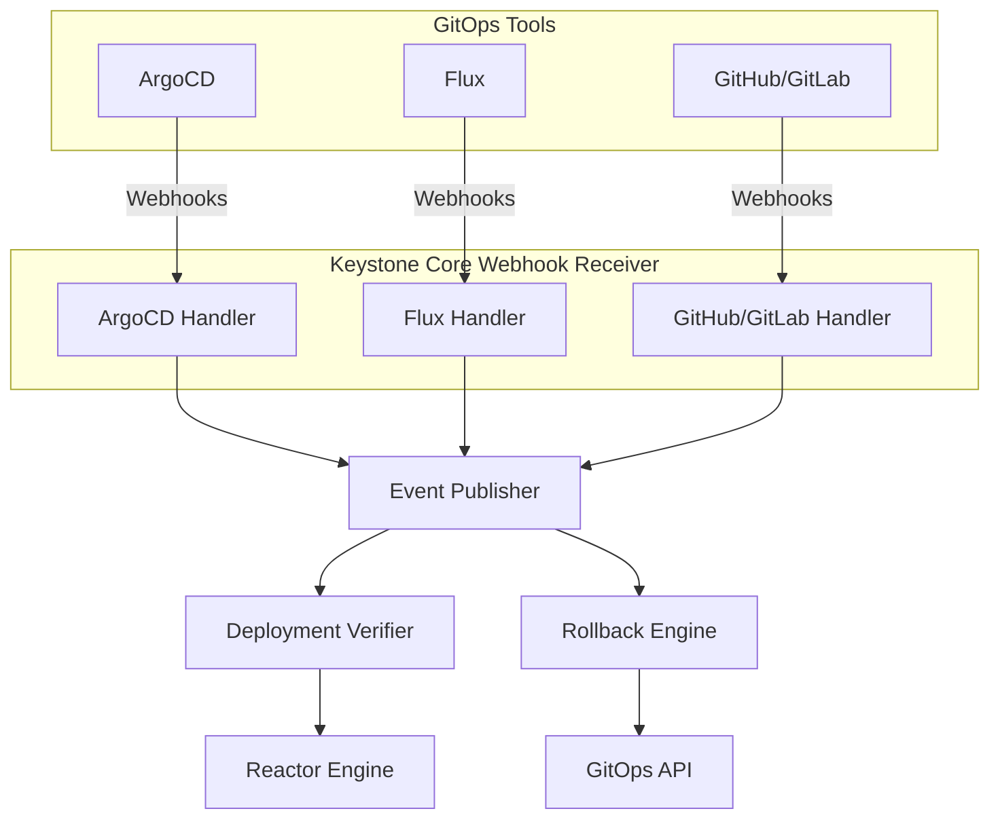

## Overview

Keystone Core integrates with GitOps tools to bridge the gap between declarative deployment and runtime operations. While GitOps handles deployment, Keystone Core verifies the runtime state, enables automated rollback, and manages progressive delivery across environments.

**Key Concept**: "GitOps deploys it. We keep it running."

**Core Capabilities**:

- **Webhook Integration**: Receive events from ArgoCD, Flux, GitHub, GitLab
- **Deployment Verification**: Validate deployments with health checks, commands, K8s resources
- **Automated Rollback**: Rollback failed deployments automatically
- **Promotion Pipelines**: Progressive delivery across environments (dev → staging → prod)
- **Git Sync**: Sync state files, reactors, policies from Git repositories

## Architecture



## Webhook Integration

### Supported Webhook Sources

Keystone Core receives webhooks from:

1. **ArgoCD**: Application sync, health, deployment events
2. **Flux**: Kustomization, HelmRelease reconciliation events
3. **GitHub**: Deployment, workflow, push events
4. **GitLab**: Deployment, pipeline, push events

### Webhook Receiver

```yaml
# Control plane configuration
gitops:
  webhooks:
    enabled: true
    listen: "0.0.0.0:8090"
    path: "/webhooks"

    # Authentication
    auth:
      type: hmac           # none, hmac, bearer
      secret: "webhook-secret"

    # Event processing
    async: true
    queue_size: 1000
```

### ArgoCD Webhook

**Configure ArgoCD**:

```yaml
apiVersion: v1
kind: ConfigMap
metadata:
  name: argocd-notifications-cm
data:
  service.webhook.kscore: |
    url: http://kscore-server:8090/webhooks/argocd
    headers:
    - name: X-ArgoCD-Secret
      value: $secret
```

**Events received**:

- `gitops.argocd.sync` - Application sync started/completed
- `gitops.argocd.health` - Application health changed
- `gitops.argocd.deployment` - Deployment event

**Example event**:

```json
{
  "type": "gitops.argocd.deployment",
  "source": "argocd",
  "data": {
    "application": "myapp",
    "namespace": "production",
    "status": "Healthy",
    "revision": "abc123",
    "repo_url": "https://github.com/org/repo.git",
    "target_revision": "main"
  }
}
```

**Note**: The `status` field contains either the sync status (Synced, OutOfSync) or health status (Healthy, Degraded, Progressing) depending on the event type.

### Flux Webhook

**Configure Flux**:

```yaml
apiVersion: notification.toolkit.fluxcd.io/v1beta1
kind: Provider
metadata:
  name: kscore
spec:
  type: generic
  address: http://kscore-server:8090/webhooks/flux
  secretRef:
    name: webhook-secret
```

**Events received**:

- `gitops.flux.kustomization` - Kustomization reconciliation
- `gitops.flux.helmrelease` - HelmRelease reconciliation
- `gitops.flux.sync` - Sync event

**Example event**:

```json
{
  "type": "gitops.flux.ReconciliationSucceeded",
  "source": "flux",
  "data": {
    "kind": "HelmRelease",
    "api_version": "helm.toolkit.fluxcd.io/v2beta1",
    "severity": "info",
    "message": "Release reconciliation succeeded",
    "reason": "ReconciliationSucceeded",
    "metadata": {
      "revision": "1.2.3"
    }
  }
}
```

**Note**: The `status` field contains the Flux severity level ("info", "warning", "error"), not a Kubernetes Ready condition.

### GitHub Webhook

**Configure GitHub** (repository settings):

- Payload URL: `http://kscore-server:8090/webhooks/github`
- Content type: `application/json`
- Secret: `your-webhook-secret`
- Events: Deployments, Workflow runs, Pushes

**Events received**:

- `gitops.github.deployment` - Deployment created
- `gitops.github.deployment_status` - Deployment status updated (success, failure, pending, etc.)
- `gitops.github.workflow_run` - Workflow run completed
- `gitops.github.push` - Code pushed

### GitLab Webhook

**Configure GitLab** (repository settings):

- URL: `http://kscore-server:8090/webhooks/gitlab`
- Secret token: `your-webhook-secret`
- Trigger: Deployment events, Pipeline events, Push events

**Events received**:

- `gitops.gitlab.deployment` - Deployment event
- `gitops.gitlab.pipeline` - Pipeline completed
- `gitops.gitlab.push` - Code pushed
- `gitops.gitlab.merge_request` - Merge request created/updated

### Webhook Payload Field Mappings

Understanding how webhook payloads are parsed and mapped to Keystone Core events is important for writing event filters and reactors.

#### GitHub Payload Mapping

GitHub webhooks are identified by the `X-GitHub-Event` header. The following fields are extracted from the JSON payload:

**Parsed Payload Structure:**

| JSON Field | Type | Description |
|------------|------|-------------|
| `action` | string | Event action (e.g., "completed", "created") |
| `repository.name` | string | Repository name |
| `repository.full_name` | string | Full repository name (org/repo) |
| `repository.html_url` | string | Repository URL |
| `sender.login` | string | User who triggered the event |
| `deployment.id` | int64 | Deployment ID |
| `deployment.sha` | string | Commit SHA for deployment |
| `deployment.ref` | string | Git reference (branch/tag) |
| `deployment.task` | string | Deployment task name |
| `deployment.environment` | string | Target environment |
| `deployment.description` | string | Deployment description |
| `deployment_status.state` | string | Deployment status (success, failure, pending, etc.) |
| `deployment_status.description` | string | Status description |
| `deployment_status.created_at` | timestamp | Status creation time |
| `workflow_run.id` | int64 | Workflow run ID |
| `workflow_run.name` | string | Workflow name |
| `workflow_run.status` | string | Workflow status |
| `workflow_run.conclusion` | string | Workflow conclusion (success, failure, etc.) |
| `workflow_run.head_sha` | string | Commit SHA for workflow |
| `ref` | string | Git ref (for push events) |
| `after` | string | After commit SHA (for push events) |
| `before` | string | Before commit SHA (for push events) |
| `commits` | array | Array of commit objects (for push events) |

**Event Type to WebhookEvent Mapping:**

| Event Type | Application | Namespace | Revision | Status |
|------------|-------------|-----------|----------|--------|
| `deployment` | `repository.name` | `deployment.environment` | `deployment.sha` | `"deployed"` |
| `deployment_status` | `repository.name` | `deployment.environment` | `deployment.sha` | `deployment_status.state` |
| `workflow_run` | `repository.name` | *(empty)* | `workflow_run.head_sha` | `workflow_run.conclusion` or `workflow_run.status` |
| `push` | `repository.name` | *(empty)* | `after` | `"pushed"` |

**Data Field Contents:**

The `data` map in the resulting event contains:

- `action` - Event action
- `repository` - Full repository name
- `repository_url` - Repository HTML URL
- `sender` - Sender login
- `deployment` - Full deployment object
- `deployment_status` - Full deployment status object
- `workflow_run` - Full workflow run object
- `ref` - Git reference
- `commits` - Commits array

**Example: Filtering GitHub Deployment Status Events**

```yaml
# Filter for successful GitHub deployments
my_reactor:
  filter: |
    type == "gitops.github.deployment_status" and
    data.deployment_status.state == "success" and
    data.deployment.environment == "production"
  actions:
    - type: log
      message: "Production deployment succeeded for {{ data.repository }}"
```

#### GitLab Payload Mapping

GitLab webhooks are identified by the `X-Gitlab-Event` header, or the `object_kind` / `event_name` fields in the payload body.

**Parsed Payload Structure:**

| JSON Field | Type | Description |
|------------|------|-------------|
| `object_kind` | string | Event type (deployment, pipeline, push, etc.) |
| `event_name` | string | Alternative event type field |
| `project.id` | int64 | Project ID |
| `project.name` | string | Project name |
| `project.path_with_namespace` | string | Full project path (group/project) |
| `project.web_url` | string | Project URL |
| `user.name` | string | User's full name |
| `user.username` | string | User's username |
| `user.email` | string | User's email |
| `status` | string | Deployment/pipeline status |
| `environment` | string | Target environment name |
| `environment_tier` | string | Environment tier (production, staging, etc.) |
| `ref` | string | Git reference |
| `sha` | string | Commit SHA |
| `deployment_id` | int64 | Deployment ID |
| `created_at` | timestamp | Event creation time |
| `object_attributes.id` | int64 | Object ID (for pipeline/MR events) |
| `object_attributes.ref` | string | Git reference |
| `object_attributes.sha` | string | Commit SHA |
| `object_attributes.status` | string | Object status |
| `object_attributes.created_at` | timestamp | Object creation time |
| `object_attributes.finished_at` | timestamp | Object completion time |
| `before` | string | Before commit SHA (for push events) |
| `after` | string | After commit SHA (for push events) |
| `commits` | array | Array of commit objects (for push events) |

**Event Type Detection Priority:**

1. `X-Gitlab-Event` header (e.g., "Deployment Hook", "Pipeline Hook")
2. `object_kind` field in payload
3. `event_name` field in payload

**Event Type to WebhookEvent Mapping:**

| Event Type | Application | Namespace | Revision | Status |
|------------|-------------|-----------|----------|--------|
| `deployment` | `project.name` | `environment` | `sha` | `status` |
| `pipeline` | `project.name` | *(empty)* | `object_attributes.sha` | `object_attributes.status` |
| `merge_request` | `project.name` | *(empty)* | `object_attributes.sha` | `object_attributes.status` |
| `push` | `project.name` | *(empty)* | `after` | `"pushed"` |

**Data Field Contents:**

The `data` map in the resulting event contains:

- `object_kind` - Event type
- `event_name` - Event name
- `project` - Full project path
- `project_url` - Project web URL
- `user` - Username
- `environment_tier` - Environment tier
- `ref` - Git reference
- `deployment_id` - Deployment ID
- `created_at` - Creation timestamp
- `object_attributes` - Full object attributes (for pipeline/MR)
- `commits` - Commits array (for push)
- `before` - Before commit SHA (for push)
- `after` - After commit SHA (for push)

**Example: Filtering GitLab Pipeline Events**

```yaml
# Filter for successful GitLab production pipelines
my_reactor:
  filter: |
    type == "gitops.gitlab.pipeline" and
    data.object_attributes.status == "success" and
    data.ref == "main"
  actions:
    - type: log
      message: "Main branch pipeline succeeded for {{ data.project }}"
```

#### Common WebhookEvent Structure

All webhook sources produce events with this common structure:

```go
type WebhookEvent struct {
    ID          string                 // Unique event ID
    Type        WebhookType            // "github" or "gitlab"
    EventType   string                 // Specific event (deployment, pipeline, push)
    Source      string                 // "github" or "gitlab"
    Timestamp   time.Time              // Event processing time
    Application string                 // Repository/project name
    Namespace   string                 // Environment (if applicable)
    Revision    string                 // Commit SHA
    Status      string                 // Event-specific status
    Data        map[string]interface{} // All parsed fields
}
```

**Keystone Core Event Conversion:**

When converted to a Keystone Core event, the `type` field becomes:

- GitHub: `gitops.github.<event_type>` (e.g., `gitops.github.deployment_status`)
- GitLab: `gitops.gitlab.<event_type>` (e.g., `gitops.gitlab.pipeline`)

All `Data` fields are merged into the event's data map, along with:

- `webhook_id` - Original webhook event ID
- `webhook_type` - Source type (github/gitlab)
- `application` - Application name
- `namespace` - Target namespace
- `revision` - Commit revision
- `status` - Event status

## Deployment Verification

Verify deployments with health checks, command execution, and K8s resource checks:

### Verification Workflow

```yaml
# Example: verify-deployment.yaml
myapp_verification:
  name: "Verify myapp deployment"

  # Triggered by ArgoCD deployment event
  trigger:
    event_filter: "type == 'gitops.argocd.deployment' and data.application == 'myapp'"

  # Verification steps
  steps:
    - name: "Wait for pods"
      type: k8s_check
      resource: deployment/myapp
      namespace: "{{ event.data.namespace }}"
      condition: available
      timeout: "5m"

    - name: "HTTP health check"
      type: http_check
      url: "http://myapp.{{ event.data.namespace }}.svc.cluster.local/health"
      method: GET
      expected_status: 200
      timeout: "30s"
      retry:
        attempts: 3
        delay: "10s"

    - name: "Run smoke tests"
      type: command
      command: "./scripts/smoke-test.sh {{ event.data.namespace }}"
      expected_exit_code: 0
      timeout: "2m"

    - name: "Check metrics"
      type: script
      script: |
        #!/bin/bash
        ERROR_RATE=$(curl -s prometheus:9090/api/v1/query?query='rate(http_requests_total{status="500"}[5m])' | jq -r '.data.result[0].value[1]')
        if (( $(echo "$ERROR_RATE > 0.01" | bc -l) )); then
          echo "Error rate too high: $ERROR_RATE"
          exit 1
        fi
      timeout: "30s"

  # Execution settings
  sequential: true        # Run steps in order
  continue_on_failure: false
  timeout: "10m"

  # On failure
  on_failure:
    - type: rollback
      application: "{{ event.data.application }}"
      namespace: "{{ event.data.namespace }}"
```

### Verification Step Types

**HTTP Health Check**:

```yaml
- name: "API health check"
  type: http_check
  url: "https://api.example.com/health"
  method: GET
  headers:
    Authorization: "Bearer {{ secrets.api_token }}"
  expected_status: 200
  expected_body: '{"status":"healthy"}'
  timeout: "30s"
```

**K8s Resource Check**:

```yaml
- name: "Check deployment ready"
  type: k8s_check
  resource: deployment/myapp  # Format: kind/name (deployment, statefulset, daemonset, service, pod)
  namespace: production
  name: myapp
  condition: available     # available, ready, complete
  replicas: 3             # Expected replica count
  timeout: "5m"
```

**Command Execution**:

```yaml
- name: "Database migration check"
  type: command
  command: "kubectl exec -n production myapp-0 -- /app/check-migrations"
  expected_exit_code: 0
  expected_output: "All migrations applied"
  timeout: "1m"
```

**Script Execution**:

```yaml
- name: "Custom validation"
  type: script
  script: |
    #!/bin/bash
    # Custom validation logic
    ./validate-deployment.sh "$NAMESPACE" "$APP"
  env:
    NAMESPACE: "{{ event.data.namespace }}"
    APP: "{{ event.data.application }}"
  timeout: "2m"
```

### Sequential vs Parallel Execution

**Sequential** (default):

```yaml
sequential: true
steps:
  - name: "Step 1"
    # Runs first
  - name: "Step 2"
    # Runs after Step 1 completes
```

**Parallel**:

```yaml
sequential: false
steps:
  - name: "Health check API"
    # Runs in parallel
  - name: "Health check DB"
    # Runs in parallel
  - name: "Health check cache"
    # Runs in parallel
```

### Retry Logic

```yaml
- name: "Flaky health check"
  type: http_check
  url: "http://myapp/health"
  retry:
    attempts: 5
    delay: "10s"        # Delay between attempts
    backoff: linear     # linear, exponential, constant
    max_delay: "1m"     # Max delay for exponential backoff
```

## Automated Rollback

Automatically rollback failed deployments:

### Rollback Configuration

```yaml
# Rollback policy
rollback_policy:
  enabled: true

  # When to rollback
  triggers:
    - verification_failed
    - health_degraded
    - error_rate_high

  # Approval required
  require_approval: true
  approval_timeout: "10m"

  # Rollback strategy
  strategy: previous    # previous, last_known_good, specific

  # Post-rollback verification
  verify_after_rollback: true
```

### Rollback Types

**ArgoCD Rollback**:

```yaml
rollback:
  type: argocd
  application: myapp
  namespace: production
  strategy: previous      # Roll back to previous revision
```

**Flux Rollback**:

```yaml
rollback:
  type: flux
  resource: helmrelease
  name: myapp
  namespace: production
  strategy: last_known_good
```

**Git Rollback**:

```yaml
rollback:
  type: git
  repository: "https://github.com/myorg/myapp-config"
  branch: main
  strategy: specific
  revision: "abc123"      # Specific commit to rollback to
```

**Manual Rollback**:

```yaml
rollback:
  type: manual
  instructions: |
    1. Run: kubectl rollout undo deployment/myapp -n production
    2. Verify: kubectl get pods -n production
    3. Check health: curl http://myapp/health
```

### Rollback Strategies

**Previous**: Rollback to immediately previous deployment

```yaml
strategy: previous
```

**Last Known Good**: Rollback to last healthy deployment

```yaml
strategy: last_known_good
```

**Specific Revision**: Rollback to specific commit/revision

```yaml
strategy: specific
revision: "abc123"
```

### Approval Workflow

```yaml
rollback_policy:
  require_approval: true
  approval_timeout: "10m"

  # Auto-approve for non-production
  auto_approve_environments:
    - dev
    - staging

  # Require approval for production
  require_approval_environments:
    - production

  # Approvers
  approvers:
    - slack://ops-channel
    - email://ops-team@example.com
```

**Approve rollback**:

```bash
# List pending rollbacks
kscorectl gitops rollbacklist --status pending

# Approve
kscorectl gitops rollbackapprove abc123 --message "Approved by ops team"

# Reject
kscorectl gitops rollbackreject abc123 --message "False alarm, deployment is healthy"
```

## Promotion Pipelines

Progressive delivery across environments:

### Pipeline Definition

```yaml
# Example: myapp-pipeline.yaml
pipeline:
  name: "myapp-deployment-pipeline"

  # Environments
  environments:
    - name: dev
      auto_promote: true
      verification:
        - type: http_check
          url: "http://myapp.dev.example.com/health"

    - name: staging
      auto_promote: false    # Requires approval
      require_approval: true
      verification:
        - type: http_check
          url: "http://myapp.staging.example.com/health"
        - type: command
          command: "./run-integration-tests.sh staging"

    - name: production
      auto_promote: false
      require_approval: true
      verification:
        - type: http_check
          url: "http://myapp.example.com/health"
        - type: k8s_check
          resource: deployment/myapp
          replicas: 5

      # Canary deployment
      strategy: canary
      canary:
        steps:
          - weight: 25
            duration: "10m"
          - weight: 50
            duration: "10m"
          - weight: 75
            duration: "10m"
          - weight: 100

      # Rollback on failure
      rollback_on_failure: true
```

### Promotion Strategies

**Immediate** (all-at-once):

```yaml
strategy: immediate
```

**Canary** (gradual traffic shift):

```yaml
strategy: canary
canary:
  steps:
    - weight: 25        # 25% traffic
      duration: "10m"   # For 10 minutes
    - weight: 50
      duration: "10m"
    - weight: 75
      duration: "10m"
    - weight: 100       # Full traffic
```

**Blue/Green**:

```yaml
strategy: blue_green
blue_green:
  # Deploy to green
  # Verify green
  # Switch traffic to green
  auto_promote: false
  verification_required: true
```

**Rolling**:

```yaml
strategy: rolling
rolling:
  max_surge: 1
  max_unavailable: 0
```

### Promotion Triggers

**Manual**:

```bash
kscorectl gitops promotemyapp --from staging --to production
```

**Automatic** (on verification success):

```yaml
environments:
  - name: dev
    auto_promote: true
```

**Scheduled**:

```yaml
environments:
  - name: production
    auto_promote: true
    schedule: "0 2 * * 1"  # Monday 2 AM
```

**Event-Driven** (via reactor):

```yaml
auto_promote_on_tag:
  filter: "type == 'gitops.github.push' and data.ref =~ 'refs/tags/v.*'"
  actions:
    - type: promote
      pipeline: myapp
      from: staging
      to: production
```

## Git Sync

Sync configuration from Git repositories:

### Repository Configuration

```yaml
git_sync:
  enabled: true

  repositories:
    - name: "infrastructure-config"
      url: "https://github.com/myorg/infrastructure-config"
      branch: main

      # Authentication
      auth:
        type: ssh
        ssh_key_path: /etc/keystone-core/id_rsa

      # What to sync
      paths:
        states: "states/"
        reactors: "reactors/"
        vars: "vars/"
        workflows: "workflows/"

      # Sync interval
      sync_interval: "5m"

  # Webhook for instant sync
  webhook:
    enabled: true
    secret: "git-webhook-secret"
```

### Synced Resources

**State Files**:

```
states/
├── base/
│   ├── users.yaml
│   └── packages.yaml
├── web/
│   └── nginx.yaml
└── db/
    └── postgres.yaml
```

**Reactors**:

```
reactors/
├── self-healing/
│   └── restart-failed-services.yaml
└── compliance/
    └── enforce-policies.yaml
```

**Vars**:

```
vars/
├── environments/
│   ├── dev.yaml
│   └── production.yaml
└── regions/
    └── us-east-1.yaml
```

**Workflows**:

```
workflows/
├── deployment-verification/
│   └── verify-web-app.yaml
└── rollback/
    └── rollback-on-failure.yaml
```

### Sync Workflow

1. **Poll**: Check Git repository for changes every `sync_interval`
2. **Detect Changes**: Compare local and remote commits
3. **Pull**: Pull changes if commit hash differs
4. **Validate**: Validate YAML syntax and schema
5. **Apply**: Apply changes to Keystone Core
6. **Event**: Emit `git.sync` event with changed files

### Instant Sync via Webhook

Configure Git webhook to trigger instant sync:

**GitHub**:

- Payload URL: `http://kscore-server:8090/webhooks/git-sync`
- Events: Push events

**GitLab**:

- URL: `http://kscore-server:8090/webhooks/git-sync`
- Events: Push events

### Conflict Resolution Strategies

When syncing from Git, conflicts can occur between the Git repository state and the current runtime state. This section documents how Keystone Core handles various conflict scenarios.

#### Types of Conflicts

| Conflict Type | Description | Example |
|---------------|-------------|---------|
| **Schema Conflict** | File structure changed incompatibly | Field renamed or removed |
| **State Conflict** | Runtime state differs from Git | Manual changes made via CLI |
| **Concurrent Modification** | Multiple sources editing same resource | Two branches merged simultaneously |
| **Dependency Conflict** | Required resource missing | Reactor references deleted state file |
| **Version Conflict** | Resource version mismatch | Stale edit overwrites newer version |

#### Conflict Resolution Configuration

```yaml
git_sync:
  repositories:
    - name: "infrastructure-config"
      url: "https://github.com/myorg/infrastructure-config"

      # Conflict resolution settings
      conflict_resolution:
        # Default strategy for all resources
        default_strategy: git_wins

        # Strategy options:
        # - git_wins: Git state always takes precedence (default)
        # - runtime_wins: Keep runtime state, reject Git changes
        # - manual: Pause sync and alert for manual resolution
        # - merge: Attempt automatic merge (where possible)
        # - newest_wins: Use most recently modified version

        # Per-resource-type strategies
        strategies:
          states: git_wins
          reactors: git_wins
          vars: merge
          policies: manual  # Require approval for policy changes

        # Validation before applying
        validation:
          enabled: true
          strict: false  # false = warn on issues, true = reject on issues

        # Backup before overwriting
        backup_on_conflict: true
        backup_retention: "7d"
```

#### Strategy: Git Wins (Default)

Git repository is the source of truth. Runtime changes are overwritten.

```yaml
conflict_resolution:
  default_strategy: git_wins
```

**Behavior:**

- Git state always replaces runtime state
- Any local modifications are lost
- Simplest and most predictable
- Recommended for GitOps-first workflows

**Example scenario:**

```
Git repository: nginx.yaml (version 3)
Runtime state:  nginx.yaml (version 2, with manual edits)
Result:         Runtime overwritten with Git version 3
```

**Warning events emitted:**

```json
{
  "type": "git.sync.conflict",
  "data": {
    "file": "states/nginx.yaml",
    "resolution": "git_wins",
    "git_version": "abc123",
    "runtime_version": "xyz789",
    "changes_lost": true
  }
}
```

#### Strategy: Runtime Wins

Runtime state is preserved. Git changes are rejected until manually resolved.

```yaml
conflict_resolution:
  default_strategy: runtime_wins
```

**Behavior:**

- Runtime modifications are preserved
- Git changes are queued for review
- Requires manual intervention to resolve
- Useful for operational overrides

**Example scenario:**

```
Git repository: nginx.yaml (version 3)
Runtime state:  nginx.yaml (version 2, with emergency hotfix)
Result:         Runtime version 2 preserved, Git change queued
```

**Resolution workflow:**

```bash
# View pending conflicts
kscorectl git-sync conflicts list

# Accept Git version
kscorectl git-sync conflicts resolve nginx.yaml --accept-git

# Keep runtime version
kscorectl git-sync conflicts resolve nginx.yaml --keep-runtime
```

#### Strategy: Manual

Pause sync and require human intervention for any conflict.

```yaml
conflict_resolution:
  default_strategy: manual

  # Notification settings
  notifications:
    on_conflict:
      - slack: "#gitops-alerts"
      - email: "ops-team@example.com"

  # Auto-resolve after timeout (optional)
  manual_timeout: "4h"
  timeout_action: git_wins  # Default to git_wins if not resolved
```

**Behavior:**

- Sync pauses when conflict detected
- Alerts sent to configured channels
- Human must explicitly resolve
- Best for critical resources (policies, security configs)

**Manual resolution:**

```bash
# List conflicts requiring resolution
kscorectl git-sync conflicts list --status pending

# View conflict details
kscorectl git-sync conflicts show policies/security.yaml

# Output:
# Conflict: policies/security.yaml
# ---
# Git Version (abc123):
#   allow_root_login: false
#   min_password_length: 12
#
# Runtime Version:
#   allow_root_login: false
#   min_password_length: 8  # <-- Differs
#
# Options:
#   --accept-git     Use Git version
#   --keep-runtime   Keep runtime version
#   --merge          Attempt merge

# Resolve with merge
kscorectl git-sync conflicts resolve policies/security.yaml --merge

# Or choose a side
kscorectl git-sync conflicts resolve policies/security.yaml --accept-git --reason "Git is authoritative"
```

#### Strategy: Merge

Attempt automatic merge of changes where possible.

```yaml
conflict_resolution:
  default_strategy: merge

  merge:
    # Merge algorithm
    algorithm: three_way  # three_way, ours, theirs

    # Fields that cannot be merged (always conflict)
    non_mergeable_fields:
      - "version"
      - "metadata.uid"

    # Fields to ignore in merge
    ignore_fields:
      - "metadata.lastSyncTime"
      - "status"

    # On merge failure
    fallback_strategy: manual
```

**Behavior:**

- Attempts three-way merge like Git
- Succeeds if changes don't overlap
- Falls back to manual on true conflicts
- Best for vars and non-critical configs

**Merge example - Success:**

```yaml
# Base version (common ancestor)
database:
  host: db.example.com
  port: 5432
  max_connections: 100

# Git version (changes port)
database:
  host: db.example.com
  port: 5433  # Changed
  max_connections: 100

# Runtime version (changes max_connections)
database:
  host: db.example.com
  port: 5432
  max_connections: 200  # Changed

# Merged result (both changes applied)
database:
  host: db.example.com
  port: 5433           # From Git
  max_connections: 200  # From runtime
```

**Merge example - Conflict (same field modified):**

```yaml
# Git version
database:
  max_connections: 150

# Runtime version
database:
  max_connections: 200

# Result: CONFLICT - requires manual resolution
# Both modified max_connections
```

#### Strategy: Newest Wins

Use the most recently modified version based on timestamps.

```yaml
conflict_resolution:
  default_strategy: newest_wins

  newest_wins:
    # Timestamp source for Git
    git_timestamp: commit_time  # commit_time or author_time

    # Tolerance for "same time" (to handle clock skew)
    time_tolerance: "5s"

    # On tie, prefer:
    tie_breaker: git  # git or runtime
```

**Behavior:**

- Compares modification timestamps
- Most recent change wins
- Useful for collaborative environments
- Requires accurate time synchronization

#### Conflict Detection Events

All conflicts emit events for monitoring and alerting:

```yaml
# Conflict detected
{
  "type": "git.sync.conflict.detected",
  "timestamp": "2026-01-18T10:30:00Z",
  "data": {
    "repository": "infrastructure-config",
    "file": "states/nginx.yaml",
    "conflict_type": "concurrent_modification",
    "git_commit": "abc123",
    "git_author": "developer@example.com",
    "runtime_modified_by": "operator@example.com",
    "runtime_modified_at": "2026-01-18T10:25:00Z"
  }
}

# Conflict resolved
{
  "type": "git.sync.conflict.resolved",
  "timestamp": "2026-01-18T10:35:00Z",
  "data": {
    "repository": "infrastructure-config",
    "file": "states/nginx.yaml",
    "resolution": "manual",
    "chosen_version": "git",
    "resolved_by": "admin@example.com",
    "reason": "Git version reviewed and approved"
  }
}
```

#### Conflict Prevention Best Practices

1. **Single Source of Truth**

   ```yaml
   # Enforce Git as the only way to modify
   git_sync:
     enforce_git_only: true
     block_runtime_modifications: true
   ```

2. **Branch Protection**
   - Require PR reviews before merging
   - Use CI validation on config changes
   - Implement approval gates for production

3. **Locking During Edits**

   ```bash
   # Lock a resource before manual editing
   kscorectl git-sync lock states/nginx.yaml --reason "Emergency hotfix"

   # Unlock after changes committed to Git
   kscorectl git-sync unlock states/nginx.yaml
   ```

4. **Validation in CI Pipeline**

   ```yaml
   # GitHub Actions example
   - name: Validate Keystone state files
     run: |
       # Validate all state and reactor files
       for f in states/*.yaml reactors/*.yaml; do
         echo "Validating $f"
         kscorectl state check "$f" || exit 1
       done
   ```

5. **Audit Trail**

   ```bash
   # View sync history with conflicts
   kscorectl git-sync history --conflicts-only

   # Export for compliance
   kscorectl git-sync audit --format json > sync-audit.json
   ```

#### Conflict Resolution CLI Commands

```bash
# List all conflicts
kscorectl git-sync conflicts list

# List pending (unresolved) conflicts
kscorectl git-sync conflicts list --status pending

# Show conflict details
kscorectl git-sync conflicts show <file-path>

# Diff between versions
kscorectl git-sync conflicts diff <file-path>

# Resolve conflict
kscorectl git-sync conflicts resolve <file-path> \
  --accept-git|--keep-runtime|--merge \
  --reason "Explanation for audit"

# Bulk resolve (use with caution)
kscorectl git-sync conflicts resolve-all --accept-git

# Force sync (overwrite all runtime state)
kscorectl git-sync force --repository infrastructure-config

# Lock/unlock resources
kscorectl git-sync lock <file-path> --reason "Manual maintenance"
kscorectl git-sync unlock <file-path>

# View lock status
kscorectl git-sync locks
```

#### Conflict Metrics

```promql
# Total conflicts by type
kscore_git_sync_conflicts_total{type="schema|state|concurrent|dependency"}

# Pending conflicts
kscore_git_sync_conflicts_pending

# Conflict resolution time
histogram_quantile(0.95, rate(kscore_git_sync_conflict_resolution_seconds_bucket[1h]))

# Auto-resolved vs manual
kscore_git_sync_conflicts_resolved_total{method="auto|manual"}
```

**Alert rules:**

```yaml
- alert: GitSyncConflictsPending
  expr: kscore_git_sync_conflicts_pending > 0
  for: 15m
  labels:
    severity: warning
  annotations:
    summary: "Git sync has unresolved conflicts"

- alert: GitSyncConflictsHigh
  expr: rate(kscore_git_sync_conflicts_total[1h]) > 10
  for: 30m
  labels:
    severity: warning
  annotations:
    summary: "High rate of Git sync conflicts"
```

## Reactor Integration

Use reactors to automate GitOps workflows:

### Auto-Verify Deployments

```yaml
auto_verify_deployments:
  filter: "type =~ 'gitops\\.(argocd|flux)\\.deployment'"
  actions:
    - type: verification
      workflow: "{{ event.data.application }}-verification"
      timeout: "10m"
```

### Auto-Rollback on Failure

```yaml
auto_rollback_failed:
  filter: "type == 'verification.failed'"
  actions:
    - type: rollback
      application: "{{ event.data.application }}"
      namespace: "{{ event.data.namespace }}"
      strategy: previous
```

### Promote on Success

```yaml
promote_on_verification:
  filter: "type == 'verification.success' and data.environment == 'staging'"
  actions:
    - type: promote
      pipeline: "{{ event.data.application }}"
      from: staging
      to: production
  conditions:
    only_if: "event.data.auto_promote == true"
```

### Notify on Deployment

```yaml
notify_deployments:
  filter: "type =~ 'gitops\\.(argocd|flux)\\.deployment'"
  actions:
    - type: webhook
      url: "https://slack.example.com/hooks/deployments"
      body: |
        {
          "text": "Deployment: {{ event.data.application }} to {{ event.data.environment }}",
          "status": "{{ event.data.status }}"
        }
```

## Approval Workflow Integrations

Keystone Core supports interactive approval workflows through Slack, PagerDuty, and Microsoft Teams. This enables teams to approve or reject deployments, rollbacks, and promotions directly from their communication tools.

### Slack Integration

#### Prerequisites

1. Slack workspace with admin permissions
2. Slack App created with appropriate scopes
3. Bot token and signing secret

#### Creating a Slack App

1. Go to <https://api.slack.com/apps> and create a new app
2. Add the following Bot Token Scopes:
   - `chat:write` - Send messages
   - `chat:write.public` - Send to public channels
   - `reactions:write` - Add reactions to messages
   - `commands` - Handle slash commands (optional)

3. Enable Interactivity and set Request URL:

   ```
   https://kscore-server.example.com/webhooks/slack/interactive
   ```

4. Install app to workspace and copy Bot Token

#### Slack Configuration

```yaml
# server.yaml
notifications:
  slack:
    enabled: true

    # Bot token (from Slack App)
    bot_token: "${SLACK_BOT_TOKEN}"

    # Signing secret for webhook verification
    signing_secret: "${SLACK_SIGNING_SECRET}"

    # Default channel for notifications
    default_channel: "#deployments"

    # Channel mappings by environment
    channels:
      dev: "#dev-deployments"
      staging: "#staging-deployments"
      production: "#production-deployments"

    # Interactive webhooks
    interactive:
      enabled: true
      listen: "0.0.0.0:8091"
      path: "/webhooks/slack/interactive"
```

#### Slack Approval Messages

When an approval is required, Keystone Core sends an interactive message:

```yaml
# Approval request reactor
request_deployment_approval:
  filter: "type == 'gitops.promotion.pending' and data.environment == 'production'"
  actions:
    - type: slack_approval
      channel: "#production-deployments"
      message: |
        :rocket: *Deployment Approval Required*

        *Application:* {{ event.data.application }}
        *Version:* {{ event.data.version }}
        *Environment:* {{ event.data.environment }}
        *Requested by:* {{ event.data.requester }}
        *Changes:* {{ event.data.changelog }}

        Please review and approve or reject this deployment.

      # Approval options
      approve_button:
        text: "✅ Approve"
        style: "primary"

      reject_button:
        text: "❌ Reject"
        style: "danger"

      # Required approvers (Slack user IDs or groups)
      required_approvers:
        - "@ops-team"
        - "U12345678"  # Specific user ID

      # Minimum approvals needed
      min_approvals: 1

      # Timeout
      timeout: "30m"

      # On timeout action
      on_timeout: reject
```

#### Slack Message Format

The interactive message includes:

```json
{
  "channel": "#production-deployments",
  "blocks": [
    {
      "type": "header",
      "text": {
        "type": "plain_text",
        "text": "🚀 Deployment Approval Required"
      }
    },
    {
      "type": "section",
      "fields": [
        {"type": "mrkdwn", "text": "*Application:*\nmyapp"},
        {"type": "mrkdwn", "text": "*Version:*\nv1.2.3"},
        {"type": "mrkdwn", "text": "*Environment:*\nproduction"},
        {"type": "mrkdwn", "text": "*Requested by:*\n@developer"}
      ]
    },
    {
      "type": "section",
      "text": {
        "type": "mrkdwn",
        "text": "*Changes:*\n• Fixed login bug\n• Updated dependencies"
      }
    },
    {
      "type": "actions",
      "elements": [
        {
          "type": "button",
          "text": {"type": "plain_text", "text": "✅ Approve"},
          "style": "primary",
          "action_id": "approve_deployment",
          "value": "approval_id_123"
        },
        {
          "type": "button",
          "text": {"type": "plain_text", "text": "❌ Reject"},
          "style": "danger",
          "action_id": "reject_deployment",
          "value": "approval_id_123"
        }
      ]
    }
  ]
}
```

#### Handling Slack Responses

When a user clicks Approve or Reject:

```yaml
# Keystone Core processes the interaction and updates the message
# Updated message shows who approved/rejected and when

# On Approval:
# "✅ Approved by @ops-lead at 2026-01-18 10:30 UTC"
# Deployment proceeds automatically

# On Rejection:
# "❌ Rejected by @ops-lead at 2026-01-18 10:30 UTC"
# "Reason: Waiting for database migration to complete first"
# Deployment is cancelled
```

#### Slack Slash Commands (Optional)

Enable slash commands for quick actions:

```yaml
notifications:
  slack:
    slash_commands:
      enabled: true
      commands:
        - name: "/kscore-approve"
          description: "Approve pending deployment"
        - name: "/kscore-reject"
          description: "Reject pending deployment"
        - name: "/kscore-status"
          description: "Check deployment status"
```

Usage:

```
/kscore-approve myapp --env production --reason "Reviewed and tested"
/kscore-reject myapp --env production --reason "Found regression in staging"
/kscore-status myapp
```

### PagerDuty Integration

#### Prerequisites

1. PagerDuty account with Events API v2 access
2. Service configured for Keystone Core
3. Integration key

#### PagerDuty Configuration

```yaml
# server.yaml
notifications:
  pagerduty:
    enabled: true

    # Events API routing key
    routing_key: "${PAGERDUTY_ROUTING_KEY}"

    # Service ID for incidents
    service_id: "P123ABC"

    # API token for incident management
    api_token: "${PAGERDUTY_API_TOKEN}"

    # Event settings
    events:
      # Create incidents for these events
      create_incident:
        - verification_failed
        - rollback_required
        - promotion_blocked

      # Severity mapping
      severity:
        verification_failed: critical
        rollback_required: critical
        promotion_blocked: warning
```

#### PagerDuty Approval via Incident

When approval is required, create a PagerDuty incident:

```yaml
# Approval request via PagerDuty
request_approval_pagerduty:
  filter: "type == 'gitops.promotion.pending' and data.environment == 'production'"
  actions:
    - type: pagerduty_incident
      title: "Deployment Approval: {{ event.data.application }} to production"
      description: |
        Deployment approval is required for {{ event.data.application }}.

        Version: {{ event.data.version }}
        Requested by: {{ event.data.requester }}

        To approve: Acknowledge this incident
        To reject: Resolve with "Rejected" in notes

      service_id: "P123ABC"
      severity: warning
      urgency: high

      # Link to deployment details
      links:
        - href: "https://kscore.example.com/deployments/{{ event.data.deployment_id }}"
          text: "View Deployment"

      # Custom details
      custom_details:
        application: "{{ event.data.application }}"
        version: "{{ event.data.version }}"
        environment: "{{ event.data.environment }}"
        approval_id: "{{ event.data.approval_id }}"
```

#### PagerDuty Webhook Handler

Configure PagerDuty to send webhooks back to Keystone Core:

```yaml
notifications:
  pagerduty:
    webhooks:
      enabled: true
      listen: "0.0.0.0:8092"
      path: "/webhooks/pagerduty"

      # Map PagerDuty actions to approvals
      action_mapping:
        incident.acknowledged: approve
        incident.resolved: check_notes  # Check notes for approve/reject
```

#### PagerDuty Approval Flow

1. **Pending Approval** → PagerDuty incident created
2. **Acknowledge** → Deployment approved, proceeds automatically
3. **Resolve** → Check resolution notes:
   - Contains "approve" → Deployment approved
   - Contains "reject" → Deployment rejected
   - No approval keywords → Deployment rejected (safe default)

### Microsoft Teams Integration

#### Prerequisites

1. Microsoft Teams with admin permissions
2. Incoming Webhook connector (for notifications)
3. Azure Bot registration (for interactive approvals)

#### Teams Webhook Configuration (Notifications Only)

For simple notifications without interactive approval:

```yaml
# server.yaml
notifications:
  teams:
    enabled: true

    # Incoming webhook URLs by channel
    webhooks:
      default: "https://outlook.office.com/webhook/..."
      dev: "https://outlook.office.com/webhook/..."
      staging: "https://outlook.office.com/webhook/..."
      production: "https://outlook.office.com/webhook/..."
```

#### Teams Adaptive Card Notifications

```yaml
# Notification reactor for Teams
notify_deployment_teams:
  filter: "type == 'gitops.argocd.deployment'"
  actions:
    - type: teams_message
      webhook: production
      card: |
        {
          "type": "message",
          "attachments": [
            {
              "contentType": "application/vnd.microsoft.card.adaptive",
              "content": {
                "$schema": "http://adaptivecards.io/schemas/adaptive-card.json",
                "type": "AdaptiveCard",
                "version": "1.4",
                "body": [
                  {
                    "type": "TextBlock",
                    "size": "Large",
                    "weight": "Bolder",
                    "text": "🚀 Deployment: {{ event.data.application }}"
                  },
                  {
                    "type": "FactSet",
                    "facts": [
                      {"title": "Environment", "value": "{{ event.data.environment }}"},
                      {"title": "Version", "value": "{{ event.data.revision }}"},
                      {"title": "Status", "value": "{{ event.data.status }}"}
                    ]
                  }
                ],
                "actions": [
                  {
                    "type": "Action.OpenUrl",
                    "title": "View Details",
                    "url": "https://kscore.example.com/deployments/{{ event.data.id }}"
                  }
                ]
              }
            }
          ]
        }
```

#### Teams Bot Integration (Interactive Approvals)

For interactive approvals, configure an Azure Bot:

```yaml
# server.yaml
notifications:
  teams:
    enabled: true

    # Azure Bot configuration
    bot:
      enabled: true
      app_id: "${TEAMS_BOT_APP_ID}"
      app_secret: "${TEAMS_BOT_APP_SECRET}"

      # Bot messaging endpoint
      messaging_endpoint: "https://kscore.example.com/api/teams/messages"

    # Interactive message settings
    interactive:
      enabled: true
      listen: "0.0.0.0:8093"
      path: "/api/teams/messages"
```

#### Teams Interactive Approval Card

```yaml
# Approval request reactor for Teams
request_approval_teams:
  filter: "type == 'gitops.promotion.pending' and data.environment == 'production'"
  actions:
    - type: teams_approval
      channel: "production-deployments"
      card: |
        {
          "type": "AdaptiveCard",
          "version": "1.4",
          "body": [
            {
              "type": "TextBlock",
              "size": "Large",
              "weight": "Bolder",
              "text": "🚀 Deployment Approval Required"
            },
            {
              "type": "FactSet",
              "facts": [
                {"title": "Application", "value": "{{ event.data.application }}"},
                {"title": "Version", "value": "{{ event.data.version }}"},
                {"title": "Environment", "value": "{{ event.data.environment }}"},
                {"title": "Requested by", "value": "{{ event.data.requester }}"}
              ]
            },
            {
              "type": "TextBlock",
              "text": "{{ event.data.changelog }}",
              "wrap": true
            }
          ],
          "actions": [
            {
              "type": "Action.Submit",
              "title": "✅ Approve",
              "style": "positive",
              "data": {
                "action": "approve",
                "approval_id": "{{ event.data.approval_id }}"
              }
            },
            {
              "type": "Action.Submit",
              "title": "❌ Reject",
              "style": "destructive",
              "data": {
                "action": "reject",
                "approval_id": "{{ event.data.approval_id }}"
              }
            }
          ]
        }

      timeout: "30m"
      on_timeout: reject
```

### Multi-Platform Approval Workflow

Configure approvals to work across multiple platforms:

```yaml
# server.yaml
approvals:
  enabled: true

  # Default approval settings
  defaults:
    timeout: "30m"
    on_timeout: reject
    min_approvals: 1

  # Environment-specific settings
  environments:
    dev:
      auto_approve: true

    staging:
      require_approval: true
      min_approvals: 1
      platforms:
        - slack

    production:
      require_approval: true
      min_approvals: 2
      platforms:
        - slack
        - pagerduty

      # Require approval from different teams
      require_approvers_from:
        - group: "@ops-team"
          min: 1
        - group: "@dev-leads"
          min: 1

  # Approval tracking
  tracking:
    # Store approval audit trail
    store_audit: true

    # Emit events for approvals
    emit_events: true
```

### Approval Reactor

```yaml
# Combined approval workflow
multi_platform_approval:
  filter: "type == 'gitops.promotion.pending' and data.environment == 'production'"
  actions:
    # Send to Slack
    - type: slack_approval
      channel: "#production-deployments"
      message: "Deployment approval needed for {{ event.data.application }}"

    # Create PagerDuty incident for on-call
    - type: pagerduty_incident
      title: "Deployment Approval: {{ event.data.application }}"
      severity: warning

    # Send to Teams
    - type: teams_approval
      channel: "production-deployments"

    # Wait for approval from any platform
    - type: wait_for_approval
      approval_id: "{{ event.data.approval_id }}"
      timeout: "30m"

      on_approve:
        - type: emit_event
          event_type: "approval.granted"
        - type: promote
          pipeline: "{{ event.data.pipeline }}"

      on_reject:
        - type: emit_event
          event_type: "approval.rejected"
        - type: notify
          message: "Deployment rejected: {{ approval.reason }}"
```

### Approval CLI Commands

```bash
# List pending approvals
kscorectl runbook approvalslist --status pending

# Approve via CLI
kscorectl runbook approvalsapprove <approval-id> \
  --approver "admin@example.com" \
  --reason "Reviewed and tested in staging"

# Reject via CLI
kscorectl runbook approvalsreject <approval-id> \
  --approver "admin@example.com" \
  --reason "Found regression in integration tests"

# View approval history
kscorectl runbook approvalshistory --application myapp --env production

# Check approval requirements
kscorectl runbook approvalsrequirements myapp --env production
```

### Approval Audit Trail

All approvals are logged for compliance:

```json
{
  "approval_id": "apr-abc123",
  "type": "deployment_promotion",
  "application": "myapp",
  "environment": "production",
  "status": "approved",
  "requested_at": "2026-01-18T10:00:00Z",
  "decided_at": "2026-01-18T10:15:00Z",
  "requester": {
    "name": "developer",
    "email": "developer@example.com"
  },
  "approvers": [
    {
      "name": "ops-lead",
      "email": "ops-lead@example.com",
      "platform": "slack",
      "decision": "approved",
      "reason": "LGTM, tested in staging",
      "timestamp": "2026-01-18T10:15:00Z"
    }
  ],
  "metadata": {
    "version": "v1.2.3",
    "changelog": "Fixed login bug",
    "deployment_id": "dep-xyz789"
  }
}
```

### Approval Metrics

```promql
# Pending approvals
kscore_approvals_pending_total{environment}

# Approval decisions
kscore_approvals_total{environment, decision}  # approved, rejected, timeout

# Time to approval
histogram_quantile(0.95, rate(kscore_approval_duration_seconds_bucket[1h]))

# Approvals by platform
kscore_approvals_total by (platform)  # slack, pagerduty, teams, cli
```

## Best Practices

### Deployment Verification

1. **Fast Feedback**: Keep verification steps under 5 minutes
2. **Comprehensive Checks**: Verify health, functionality, performance
3. **Smoke Tests**: Run quick smoke tests, not full test suite
4. **Retry Flaky Checks**: Use retry logic for network-dependent checks

### Rollback

1. **Always Verify**: Verify after rollback to ensure success
2. **Approval for Production**: Require approval for production rollbacks
3. **Document Reasons**: Log why rollback was triggered
4. **Test Rollback**: Test rollback procedures in dev/staging

### Promotion

1. **Gradual Rollout**: Use canary or blue/green for production
2. **Verification Required**: Always verify before promoting
3. **Approval Gates**: Require approval for production promotions
4. **Rollback Ready**: Have rollback plan for each promotion

### Git Sync

1. **Validate Before Sync**: Validate YAML in CI before merging
2. **Short Sync Interval**: Use 1-5 minute sync intervals
3. **Use Webhooks**: Enable webhooks for instant sync
4. **Version Control**: Keep all config in Git

## Monitoring

### Metrics

```
# Webhooks
kscore_gitops_webhooks_received_total{source}
kscore_gitops_webhooks_failed_total{source}

# Verifications
kscore_gitops_verifications_total{status}
kscore_gitops_verification_duration_seconds{quantile}

# Rollbacks
kscore_gitops_rollbacks_total{type,status}
kscore_gitops_rollback_duration_seconds{quantile}

# Promotions
kscore_gitops_promotions_total{pipeline,status}

# Git Sync
kscore_gitops_sync_total{repository,status}
kscore_gitops_sync_duration_seconds{quantile}
```

### Events

- `gitops.webhook.received` - Webhook received
- `gitops.verification.started` - Verification started
- `gitops.verification.success` - Verification succeeded
- `gitops.verification.failed` - Verification failed
- `gitops.rollback.started` - Rollback started
- `gitops.rollback.completed` - Rollback completed
- `gitops.promotion.started` - Promotion started
- `gitops.promotion.completed` - Promotion completed
- `git.sync` - Git repository synced

## Troubleshooting

### Webhook Not Received

**Problem**: Webhook not triggering events

Check:

```bash
# Check webhook endpoint is accessible
curl -X POST http://kscore-server:8090/webhooks/argocd \
  -H "Content-Type: application/json" \
  -d '{"test":"payload"}'

# Check webhook metrics
curl http://kscore-server:8080/metrics | grep gitops_webhooks

# Check logs (use journalctl or container logs)
journalctl -u kscore-server --grep "webhook-receiver"
```

### Verification Failing

**Problem**: Verification steps failing unexpectedly

Debug:

```bash
# Run verification manually
kscorectl gitops verify run myapp-verification --namespace production

# Check verification logs
kscorectl gitops verify logs myapp-verification --limit 10

# Test individual steps
curl http://myapp.production.svc.cluster.local/health
```

### Rollback Not Triggering

**Problem**: Rollback not executing on verification failure

Check:

```bash
# Verify rollback policy is enabled
kscorectl gitops rollbackpolicy show myapp

# Check rollback triggers
kscorectl gitops rollbacktriggers myapp

# Manual rollback
kscorectl gitops rollbackexecute myapp --namespace production --strategy previous
```

### Git Sync Not Working

**Problem**: Git repository not syncing

Check:

```bash
# Check Git sync status
kscorectl git-sync status infrastructure-config

# Manual sync
kscorectl git-sync trigger infrastructure-config

# Check authentication
ssh -T git@github.com

# Check logs (use journalctl or container logs)
journalctl -u kscore-server --grep "git-sync"
```

## Next Steps

- Learn about [Reactors](../reactors/) for automating GitOps workflows
- Understand [Events](../events/) emitted during deployments
- Explore [State Management](../state-management/) synced from Git
- See [Policy Enforcement](../policy/) for compliance checks
- Review [Observability](../observability/) for monitoring GitOps operations
