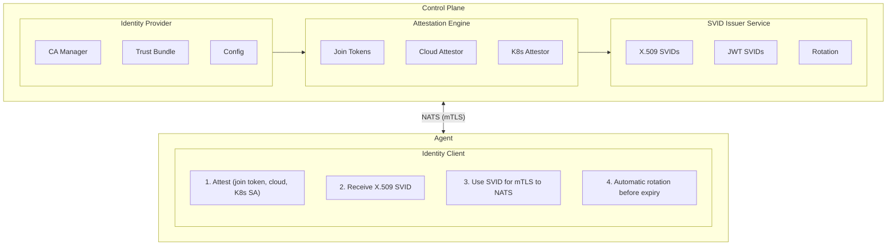
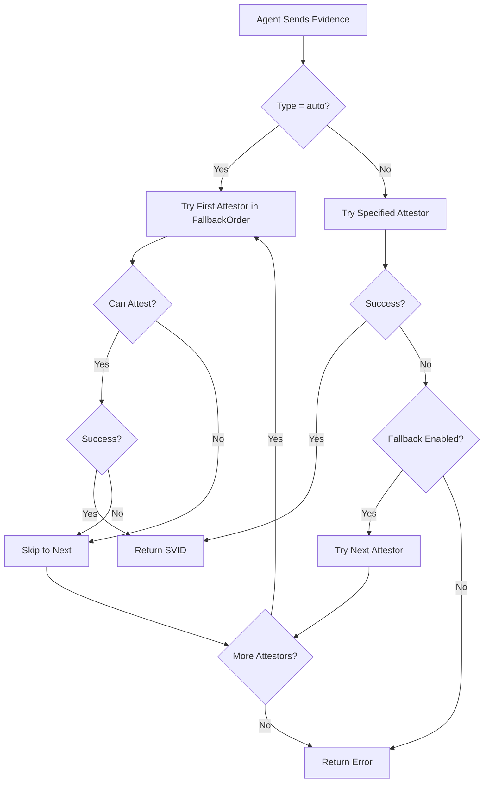
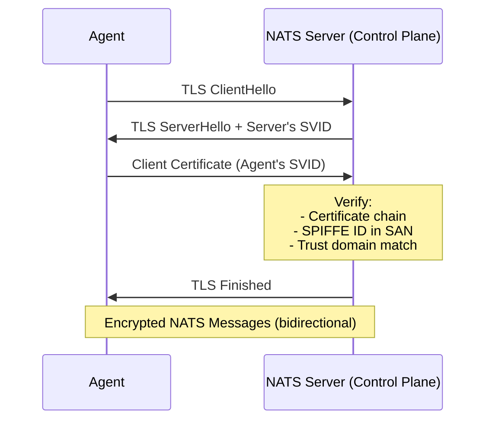
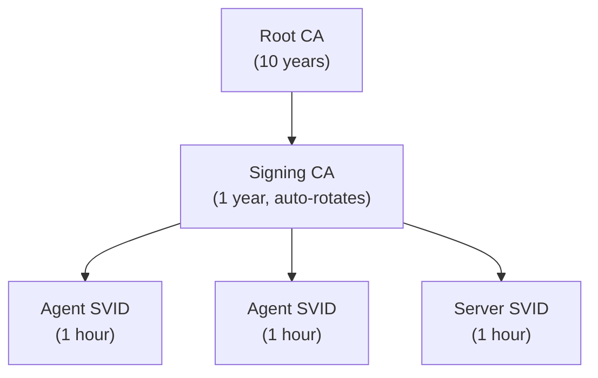
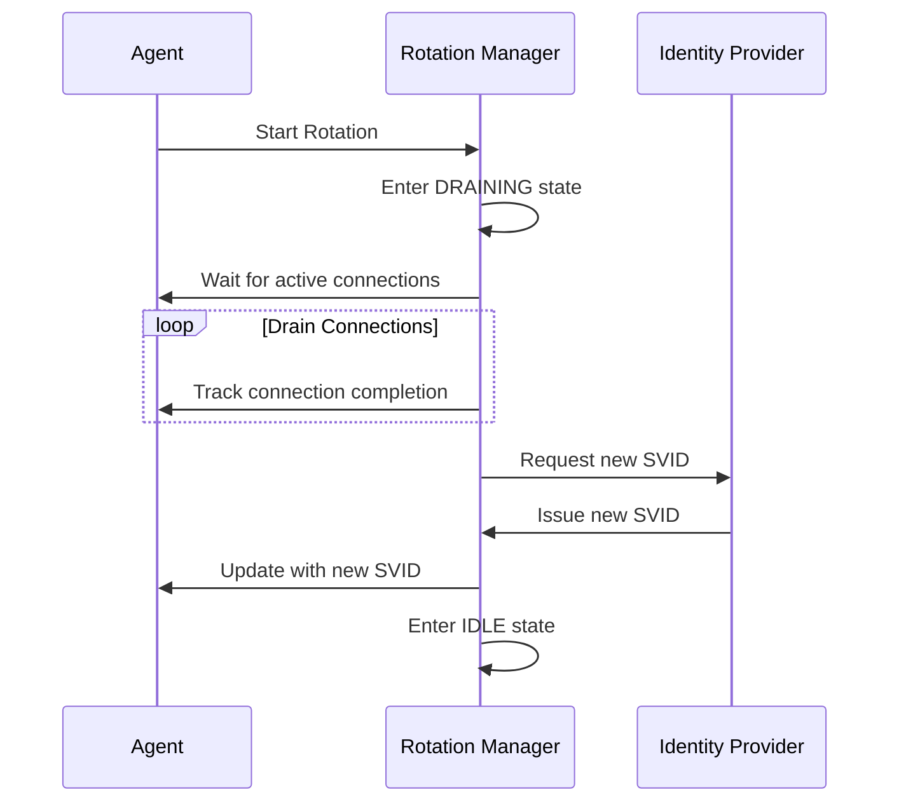
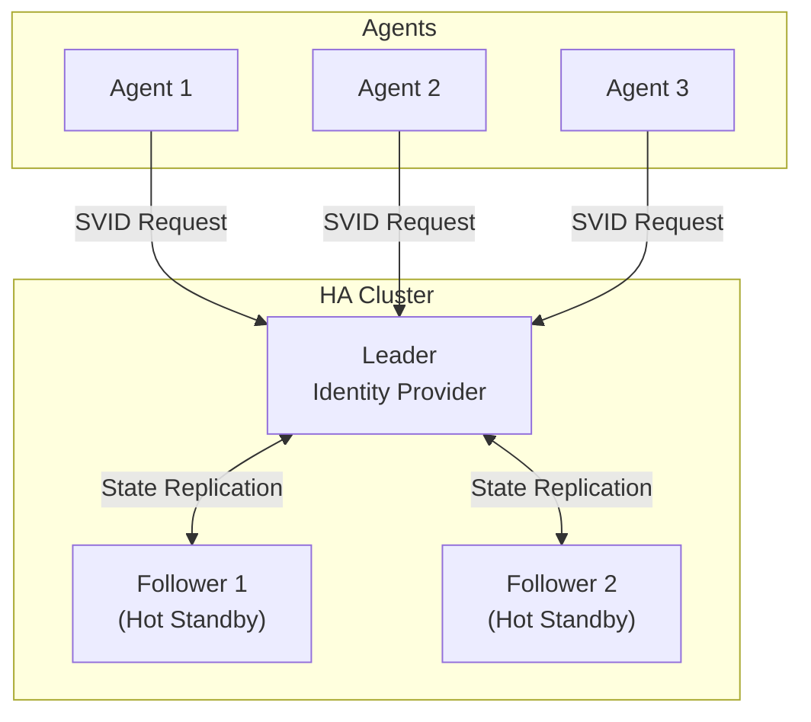
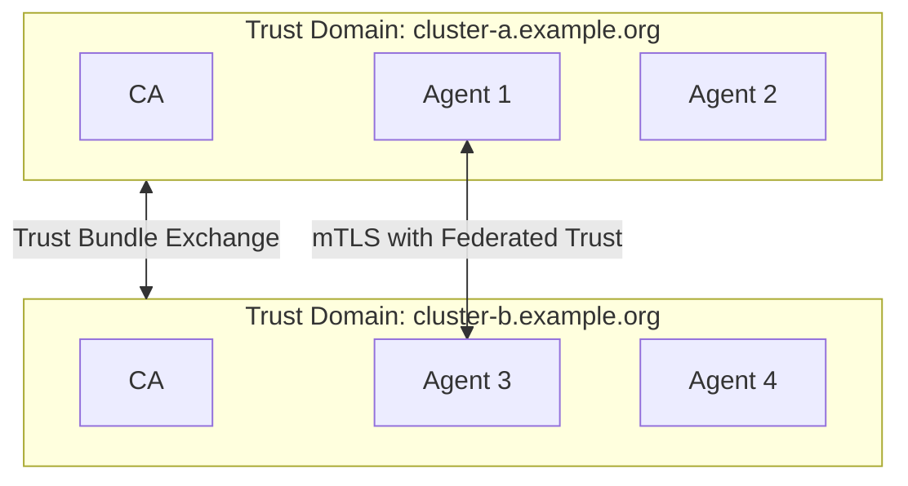
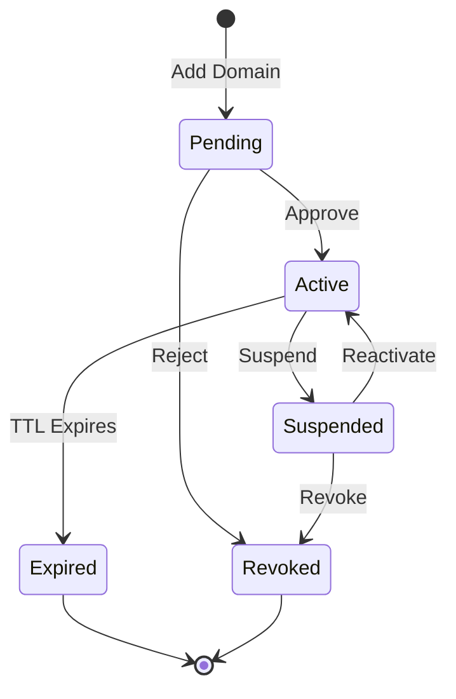

Keystone Core provides built-in SPIFFE (Secure Production Identity Framework For Everyone) identity management. This enables cryptographic identity for all agents and servers without requiring external identity infrastructure.

## Overview

### What is SPIFFE?

SPIFFE is an open standard for securely identifying workloads in dynamic and heterogeneous environments. Key concepts:

- **SPIFFE ID**: A URI that uniquely identifies a workload: `spiffe://trust-domain/path`
- **SVID (SPIFFE Verifiable Identity Document)**: A cryptographic document that proves identity
- **Trust Domain**: A security boundary (like `example.com` or `kscore.local`)
- **Trust Bundle**: Collection of CA certificates for verifying identities

### Why SPIFFE?

1. **Zero Trust**: Every connection is authenticated and authorized
2. **Automatic Rotation**: Certificates rotate without restarts
3. **Platform Agnostic**: Works across Kubernetes, VMs, bare metal, edge
4. **No Secrets Distribution**: Agents prove identity through attestation

### Keystone Core Identity Architecture



## Embedded Identity Provider

The embedded identity provider runs within the control plane and requires zero external dependencies. It's enabled by default.

### Configuration

```yaml
# keystone-core.yaml
identity:
  enabled: true
  trust_domain: "kscore.local"

  # SVID configuration
  svid:
    default_ttl: 1h
    max_ttl: 24h
    rotation_threshold: 0.5  # Rotate at 50% lifetime

  # CA configuration
  ca:
    key_type: "ecdsa-p256"    # ecdsa-p256, ecdsa-p384, rsa-2048, rsa-4096
    root_ttl: 87600h          # 10 years
    signing_ttl: 8760h        # 1 year
    data_dir: "/var/lib/kscore/identity"

  # Attestation configuration
  attestation:
    default_attestor: "join_token"
    allowed_attestors:
      - join_token
      - aws_iid
      - gcp_iit
      - azure_imds
      - k8s_sat
    join_token_ttl: 5m
```

### Trust Domains

The trust domain is the security boundary for your Keystone Core deployment:

| Use Case | Trust Domain | Example |
|----------|-------------|---------|
| Development | `kscore.local` | `spiffe://kscore.local/agent/dev-1` |
| Production | `yourcompany.com` | `spiffe://yourcompany.com/agent/prod-web-1` |
| Multi-cluster | `cluster.yourcompany.com` | `spiffe://us-east.yourcompany.com/agent/...` |

### SPIFFE IDs in Keystone Core

Keystone Core uses these SPIFFE ID patterns:

| Entity | SPIFFE ID Pattern | Example |
|--------|-------------------|---------|
| Agent | `spiffe://{domain}/agent/{agent-id}` | `spiffe://kscore.local/agent/web-server-1` |
| Server | `spiffe://{domain}/server/{server-id}` | `spiffe://kscore.local/server/control-plane-1` |
| Service | `spiffe://{domain}/service/{name}` | `spiffe://kscore.local/service/api` |

## Agent Auto-Registration

Agents must prove their identity before receiving an SVID. This is called **attestation**. Keystone Core supports multiple attestation methods.

### Method 1: Join Tokens (Recommended for Initial Setup)

Join tokens are one-time-use secrets that prove an agent is authorized to join the cluster.

#### Step 1: Create a Join Token (Control Plane)

```bash
# Create a token for a specific agent
kscorectl identity token create \
  --agent-id "web-server-1" \
  --ttl 5m

# Output:
# Join Token: abc123def456ghi789jkl012mno345pqr678
# Expires: 2024-01-15T10:05:00Z
# Agent ID: web-server-1
#
# Configure agent with:
#   attestation:
#     type: join_token
#     token: abc123def456ghi789jkl012mno345pqr678
```

#### Step 2: Configure the Agent

```yaml
# agent.yaml
server:
  address: "control-plane.example.com:4222"

identity:
  attestation:
    type: join_token
    token: "<your-join-token>"
```

#### Step 3: Start the Agent

```bash
kscore-agent --config /etc/kscore/agent.yaml
```

The agent will:
1. Connect to the control plane
2. Present the join token for attestation
3. Receive its SPIFFE ID (`spiffe://kscore.local/agent/web-server-1`)
4. Receive an X.509 SVID certificate
5. Use the SVID for all subsequent mTLS connections

#### Step 4: Verify Registration

```bash
# Check agent identity
kscorectl agent show web-server-1

# Output:
# Agent: web-server-1
# SPIFFE ID: spiffe://kscore.local/agent/web-server-1
# Status: Connected
# SVID Expires: 2024-01-15T11:00:00Z
# Attestation: join_token
```

### Method 2: AWS Instance Identity Document (IID)

For agents running on AWS EC2, use the instance identity document for automatic attestation.

#### Control Plane Configuration

```yaml
identity:
  attestation:
    allowed_attestors:
      - aws_iid
    aws:
      allowed_accounts:
        - "123456789012"
      allowed_regions:
        - "us-east-1"
        - "us-west-2"
```

#### Agent Configuration

```yaml
identity:
  attestation:
    type: aws_iid
    # No credentials needed - uses IMDS automatically
```

The agent automatically:
1. Retrieves identity document from EC2 metadata service
2. Presents the signed document to the control plane
3. Receives SPIFFE ID based on instance ID: `spiffe://kscore.local/agent/i-0abc123def456`

### Method 3: GCP Instance Identity Token (IIT)

For agents running on Google Cloud Platform compute instances.

#### Control Plane Configuration

```yaml
identity:
  attestation:
    allowed_attestors:
      - gcp_iit
    gcp:
      allowed_projects:
        - "my-project-123"
      allowed_zones:
        - "us-central1-a"
        - "us-central1-b"
```

#### Agent Configuration

```yaml
identity:
  attestation:
    type: gcp_iit
    # No credentials needed - uses metadata service
```

### Method 4: Azure Instance Metadata Service (IMDS)

For agents running on Azure virtual machines.

#### Control Plane Configuration

```yaml
identity:
  attestation:
    allowed_attestors:
      - azure_imds
    azure:
      allowed_subscriptions:
        - "12345678-1234-1234-1234-123456789012"
      allowed_resource_groups:
        - "my-resource-group"
```

#### Agent Configuration

```yaml
identity:
  attestation:
    type: azure_imds
```

### Method 5: Kubernetes Service Account Token (SAT)

For agents running as Kubernetes pods.

#### Control Plane Configuration

```yaml
identity:
  attestation:
    allowed_attestors:
      - k8s_sat
    kubernetes:
      api_server: "https://kubernetes.default.svc"
      allowed_namespaces:
        - "kscore-agents"
        - "production"
      allowed_service_accounts:
        - "kscore-agent"
```

#### Agent Deployment (Kubernetes)

```yaml
apiVersion: apps/v1
kind: DaemonSet
metadata:
  name: kscore-agent
  namespace: kscore-agents
spec:
  selector:
    matchLabels:
      app: kscore-agent
  template:
    metadata:
      labels:
        app: kscore-agent
    spec:
      serviceAccountName: kscore-agent
      containers:
        - name: agent
          image: ghcr.io/shawnbutts/keystone-core/kscore-agent:latest
          env:
            - name: KSCORE_ATTESTATION_TYPE
              value: "k8s_sat"
          volumeMounts:
            - name: token
              mountPath: /var/run/secrets/tokens
      volumes:
        - name: token
          projected:
            sources:
              - serviceAccountToken:
                  path: token
                  expirationSeconds: 3600
                  audience: kscore
```

### Automatic Attestation Fallback

Keystone Core supports automatic fallback between attestation methods when the primary method fails. This is useful in hybrid environments where agents may run on different platforms.

#### Enable Fallback

```yaml
identity:
  attestation:
    # Enable automatic fallback when primary attestor fails
    enable_fallback: true

    # Specify the order to try attestors (optional)
    # If not specified, uses allowed_attestors order
    fallback_order:
      - k8s_sat      # Try Kubernetes first
      - aws_iid      # Then AWS
      - gcp_iit      # Then GCP
      - azure_imds   # Then Azure
      - join_token   # Finally join token

    allowed_attestors:
      - k8s_sat
      - aws_iid
      - gcp_iit
      - azure_imds
      - join_token
```

#### Auto-Detection Mode

Agents can use automatic attestation type detection:

```yaml
# Agent configuration
identity:
  attestation:
    type: auto  # Automatically detect the best attestation method
```

When `type: auto` is specified, the agent sends evidence to the control plane, which tries each enabled attestor in `fallback_order` until one succeeds. This is useful for:

- **Portable agent images**: Same image works on AWS, GCP, Azure, or Kubernetes
- **Gradual migration**: Move from join tokens to cloud attestation without config changes
- **Resilient bootstrap**: If cloud metadata is temporarily unavailable, fall back to join tokens

#### How Fallback Works



#### Viewing Attempted Attestors

When fallback is used, the attestation result includes which attestors were tried:

```bash
# Check agent attestation details
kscorectl agent show web-server-1 --verbose

# Output includes:
# Attestation:
#   Method: aws_iid
#   Attempted: [k8s_sat, aws_iid]  # k8s_sat tried first but failed
```

## SVID Lifecycle

### Issuance

After successful attestation, agents receive an X.509 SVID:

```
Certificate:
    Subject: CN = web-server-1
    Issuer: CN = Keystone Core Signing CA
    Validity:
        Not Before: Jan 15 10:00:00 2024 UTC
        Not After:  Jan 15 11:00:00 2024 UTC
    Subject Alternative Name:
        URI: spiffe://kscore.local/agent/web-server-1
```

### Automatic Rotation

SVIDs are rotated automatically before expiry:

1. **Rotation Threshold**: Default is 50% of lifetime
2. **Rotation Window**: For 1-hour SVIDs, rotation happens at ~30 minutes
3. **Seamless**: New SVID is obtained before old one expires
4. **Callbacks**: Applications are notified of rotation events

```go
// Example: Watch for SVID rotation
client.WatchX509SVID(ctx, func(oldSVID, newSVID *identity.X509SVID) {
    log.Printf("SVID rotated: %s", newSVID.SPIFFEID.String())
    log.Printf("New expiry: %s", newSVID.ExpiresAt)
})
```

### Manual Renewal

Force SVID renewal if needed:

```bash
# On the agent
kscore-agent identity renew

# Via control plane
kscorectl agent renew-svid web-server-1
```

## NATS mTLS Integration

All NATS connections use SVIDs for mutual TLS authentication.

### How It Works



### Subject Authorization

SPIFFE IDs control what NATS subjects entities can access:

```yaml
# Default agent permissions
# SPIFFE ID: spiffe://kscore.local/agent/*
publish:
  - "kscore.agent.*.heartbeat"
  - "kscore.agent.*.response"
  - "kscore.agent.*.events"
subscribe:
  - "kscore.agent.*.command"
  - "kscore.agent.*.state"
  - "kscore.broadcast.*"

# Default server permissions
# SPIFFE ID: spiffe://kscore.local/server/*
publish:
  - ">"  # All subjects
subscribe:
  - ">"  # All subjects
```

### Custom Authorization Rules

Add custom authorization rules:

```yaml
identity:
  nats:
    authorization:
      rules:
        - spiffe_id_pattern: "spiffe://kscore.local/agent/monitoring-*"
          allow_publish:
            - "kscore.metrics.>"
            - "kscore.logs.>"
          allow_subscribe:
            - "kscore.alerts.>"

        - spiffe_id_pattern: "spiffe://kscore.local/service/api"
          allow_publish:
            - "kscore.api.>"
          deny_publish:
            - "kscore.internal.>"
```

## Certificate Authority

### CA Hierarchy

Keystone Core uses a two-tier CA hierarchy:



### CA Storage

CA certificates and keys are stored securely:

```
/var/lib/kscore/identity/
├── root-ca.crt           # Root CA certificate (public)
├── root-ca.key           # Root CA private key (600 permissions)
├── signing-ca.crt        # Signing CA certificate (public)
├── signing-ca.key        # Signing CA private key (600 permissions)
└── trust-bundle.pem      # Combined trust bundle
```

### CA Rotation

The signing CA rotates automatically:

1. **Grace Period**: New CA is created before old one expires
2. **Overlap**: Both CAs are valid during transition
3. **Seamless**: Agents continue working during rotation

### Backup and Recovery

Back up CA data regularly:

```bash
# Backup
tar -czvf kscore-ca-backup.tar.gz /var/lib/kscore/identity/

# Restore
tar -xzvf kscore-ca-backup.tar.gz -C /
```

## Production Hardening

Keystone Core provides enterprise-grade security and reliability features for production deployments.

### Encrypted Key Storage

Private keys are encrypted at rest using AES-256-GCM:

```yaml
identity:
  ca:
    key_protection:
      method: "encrypted"  # plaintext, encrypted, hsm
      encryption_key_env_var: "KSCORE_CA_KEK"
      # Or load from file:
      # encryption_key_file: "/etc/kscore/kek.key"
```

Generate a Key Encryption Key (KEK):

```bash
# Generate 256-bit KEK
openssl rand -base64 32 > /etc/kscore/kek.key
chmod 600 /etc/kscore/kek.key

# Or set as environment variable
export KSCORE_CA_KEK=$(openssl rand -base64 32)
```

### HSM Integration

For maximum security, store CA keys in a Hardware Security Module:

```yaml
identity:
  ca:
    key_protection:
      method: "hsm"
      hsm:
        module_path: "/usr/lib/softhsm/libsofthsm2.so"
        slot_id: 0
        pin: "${KSCORE_HSM_PIN}"
        token_label: "kscore-ca"
        key_label: "signing-key"
```

### CA Rotation

The signing CA rotates automatically with configurable thresholds:

```yaml
identity:
  ca:
    rotation:
      rotation_threshold: 0.7      # Rotate at 70% of lifetime
      overlap_duration: 24h        # Old and new CA overlap
      dual_signing_enabled: true   # Sign with both during rotation
      auto_rotate: true            # Enable automatic rotation
```

During CA rotation:
1. New CA is generated before the old CA expires
2. Both CAs are valid during the overlap period
3. SVIDs can be verified by either CA
4. Old CA is retired after overlap period

### Disaster Recovery

Create and restore encrypted CA backups:

```bash
# Create a backup
kscorectl identity ca backup \
  --output /backup/ca-backup.json \
  --encrypt

# List backups
kscorectl identity ca backups list

# Restore from backup
kscorectl identity ca restore \
  --backup /backup/ca-backup.json
```

Backups include:
- Root CA certificate and encrypted private key
- Signing CA certificate and encrypted private key
- Trust bundle
- Rotation state (if in progress)
- SHA-256 checksum for integrity verification

### SVID Rotation Resilience

SVID rotation includes robust retry and failover mechanisms:

```yaml
identity:
  svid:
    rotation:
      check_interval: 30s          # How often to check for rotation
      rotation_threshold: 0.5       # Rotate at 50% of lifetime
      retry_strategy: exponential   # exponential, linear, constant
      max_retries: 10
      initial_retry_delay: 1s
      max_retry_delay: 5m
      retry_multiplier: 2.0
      jitter_fraction: 0.1          # Add 10% jitter
      grace_period: 5m              # Continue using old SVID during rotation
      connection_drain_timeout: 30s
```

Retry strategies:
- **Exponential**: Delay doubles after each attempt (recommended)
- **Linear**: Delay increases by a fixed amount
- **Constant**: Fixed delay between attempts

### Connection Continuity

During SVID rotation, existing connections are gracefully drained:



Monitor rotation metrics:

```bash
# View rotation metrics
kscorectl identity metrics

# Output:
# Current State: idle
# Total Rotations: 42
# Successful Rotations: 41
# Failed Rotations: 1
# Retry Count: 3
# Last Rotation: 2024-01-15T10:30:00Z
# Last Success: 2024-01-15T10:30:00Z
```

### High Availability

For production deployments, run multiple control plane servers with coordinated identity management:

```yaml
identity:
  ha:
    enabled: true
    node_id: "server-1"
    peers:
      - "server-2.example.com:4222"
      - "server-3.example.com:4222"
    leader_election:
      election_timeout: 10s
      heartbeat_interval: 1s
      lease_duration: 15s
    replication:
      mode: semi-sync  # sync, async, semi-sync
      min_replicas: 1
```

HA architecture:



Replication modes:
- **Sync**: Wait for all replicas (strongest consistency, highest latency)
- **Async**: Don't wait for replicas (lowest latency, eventual consistency)
- **Semi-sync**: Wait for at least N replicas (balance of consistency and performance)

### Trust Bundle Synchronization

Trust bundles are automatically synchronized across HA cluster members:

```yaml
identity:
  ha:
    trust_bundle_sync:
      sync_interval: 30s
      consistency_check_interval: 5m
```

### Performance Optimization

#### SVID Caching

SVIDs are cached with LRU eviction for performance:

```yaml
identity:
  cache:
    max_size: 10000           # Maximum cached SVIDs
    ttl: 1h                   # Cache entry TTL
    cleanup_interval: 1m      # How often to clean expired entries
    pre_rotation_buffer: 1m   # Evict entries close to expiry
```

Cache metrics:

```bash
kscorectl identity cache stats

# Output:
# Cache Size: 1234
# Hits: 98765
# Misses: 1234
# Hit Rate: 98.76%
# Evictions: 100
```

#### Batch SVID Issuance

Issue SVIDs in batches for efficiency:

```yaml
identity:
  batch:
    max_batch_size: 100
    batch_timeout: 50ms
    max_pending_requests: 1000
```

#### Connection Pooling

Optimize connections to identity provider:

```yaml
identity:
  pool:
    max_connections: 100
    min_connections: 10
    max_idle_time: 5m
    connection_timeout: 30s
    health_check_interval: 30s
```

## Troubleshooting

### Agent Cannot Attest

**Symptoms:**
- Agent fails to start with "attestation failed"
- Logs show "invalid join token" or "token expired"

**Solutions:**

1. **Check token validity:**
   ```bash
   kscorectl identity token list
   ```

2. **Verify token hasn't been used:**
   ```bash
   kscorectl identity token show <token-id>
   ```

3. **Create new token:**
   ```bash
   kscorectl identity token create --agent-id <agent-id>
   ```

### SVID Rotation Fails

**Symptoms:**
- Agent logs show "failed to renew SVID"
- Connection drops after SVID expiry

**Solutions:**

1. **Check network connectivity:**
   ```bash
   # On agent
   nc -zv control-plane.example.com 4222
   ```

2. **Check identity provider status:**
   ```bash
   kscorectl identity status
   ```

3. **Verify CA is valid:**
   ```bash
   kscorectl identity ca info
   ```

### TLS Handshake Failures

**Symptoms:**
- "tls: bad certificate" errors
- "x509: certificate signed by unknown authority"

**Solutions:**

1. **Verify trust bundle is current:**
   ```bash
   kscorectl identity bundle show
   ```

2. **Check SPIFFE ID matches expected pattern:**
   ```bash
   openssl x509 -in svid.crt -text | grep URI
   ```

3. **Verify trust domain matches:**
   ```yaml
   # Control plane and agent must match
   identity:
     trust_domain: "kscore.local"
   ```

### Debug Mode

Enable identity debug logging:

```yaml
identity:
  log_level: debug
```

View identity events:

```bash
kscorectl identity events --follow
```

## External Identity Providers

While the embedded identity provider works for most deployments, Keystone Core also integrates with external identity infrastructure.

### SPIRE Workload API

Integrate with an existing SPIRE deployment:

```yaml
identity:
  provider: spire
  spire:
    socket_path: "/run/spire/sockets/agent.sock"
    # Or connect via TCP
    # address: "spire-agent.spire.svc.cluster.local:8081"
    timeout: 30s
    retry:
      max_attempts: 5
      initial_delay: 1s
      max_delay: 30s
```

The SPIRE integration:
- Connects to the SPIRE Workload API
- Fetches X.509 SVIDs and JWT SVIDs
- Watches for SVID rotation
- Retrieves trust bundles automatically

### Service Mesh Integration

#### Istio

When running with Istio, agents can use the Istio sidecar's identity:

```yaml
identity:
  provider: istio
  istio:
    cert_path: "/etc/certs/cert-chain.pem"
    key_path: "/etc/certs/key.pem"
    root_cert_path: "/etc/certs/root-cert.pem"
```

#### Consul Connect

For Consul Connect service mesh:

```yaml
identity:
  provider: consul
  consul:
    # Use Consul HTTP API
    address: "http://localhost:8500"
    token: "${CONSUL_HTTP_TOKEN}"
    # Or use file-based certificates
    cert_path: "/etc/consul/certs/cert.pem"
    key_path: "/etc/consul/certs/key.pem"
    ca_path: "/etc/consul/certs/ca.pem"
```

#### Linkerd

For Linkerd service mesh:

```yaml
identity:
  provider: linkerd
  linkerd:
    cert_path: "/var/run/linkerd/identity/certificate"
    key_path: "/var/run/linkerd/identity/key"
    trust_anchors_path: "/var/run/linkerd/identity/trust-anchors"
```

## Trust Federation

Trust federation enables secure communication between different trust domains (e.g., between clusters or organizations).

### Architecture



### Federation Configuration

Configure trust federation on the control plane:

```yaml
identity:
  trust_domain: "cluster-a.example.org"

  federation:
    enabled: true
    # Federated trust domains
    domains:
      - name: "cluster-b.example.org"
        type: bidirectional  # bidirectional, unidirectional
        bundle_endpoint: "https://cluster-b.example.org/.well-known/spiffe-bundle"
        bundle_endpoint_profile: https_web  # https_web, https_spiffe
        refresh_interval: 5m
        policy:
          allowed_paths:
            - "/service/**"
            - "/agent/**"
          denied_paths:
            - "/admin/**"
          allowed_services:
            - api
            - web
```

### Federation Types

| Type | Description | Use Case |
|------|-------------|----------|
| **Bidirectional** | Both domains trust each other | Same organization, different clusters |
| **Unidirectional** | Only one domain trusts the other | Third-party service access |
| **Transitive** | Trust can be inherited through chains | Complex multi-cluster topologies |

### Federation Policies

Control which identities from federated domains are trusted:

```yaml
federation:
  domains:
    - name: "partner.example.org"
      policy:
        # Allow specific paths
        allowed_paths:
          - "/service/api"
          - "/service/web"

        # Deny sensitive paths
        denied_paths:
          - "/admin/**"
          - "/internal/**"

        # Allow specific services
        allowed_services:
          - api
          - web

        # Require specific attributes
        require_attributes:
          environment: production

        # Maximum SVID TTL accepted
        max_ttl: 1h

        # Require mTLS
        require_mtls: true
```

### Federation State Machine



### Interactive Federation Wizard

For guided federation setup, use the interactive wizard:

```bash
# Launch the interactive wizard
kscore-federation wizard
```

The wizard guides you through:

1. **Trust Domain**: Enter the partner trust domain name
2. **Endpoint Discovery**: Auto-discover or manually specify the bundle endpoint
3. **Federation Type**: Choose bidirectional or unidirectional trust
4. **Policy Template**: Select from pre-built policy templates:
   - **Services Only** (recommended): Allow `/service/**`, deny `/admin/**` and `/internal/**`
   - **Allow All**: Trust all identities from the partner domain
   - **Agents Only**: Only allow `/agent/**` paths
   - **Kubernetes**: Allow Kubernetes service account paths (`/ns/*/sa/*`)
   - **Custom**: Define your own allowed/denied paths
5. **Settings**: Configure refresh interval and mTLS requirements
6. **Policy Testing**: Test SPIFFE IDs against your policy before activation
7. **Review**: Confirm the configuration and create the federation

For non-interactive (scripted) setup:

```bash
kscore-federation wizard \
  --non-interactive \
  --domain partner.example.org \
  --endpoint https://partner.example.org/.well-known/spiffe-bundle \
  --type bidirectional \
  --policy services-only \
  --refresh 5m \
  --mtls \
  --auto-activate
```

### Managing Federation

```bash
# List federated domains
kscore-federation list

# Add a federated domain
kscore-federation add cluster-b.example.org \
  --bundle-endpoint https://cluster-b.example.org/.well-known/spiffe-bundle \
  --type bidirectional

# Suspend federation (stops accepting SVIDs)
kscore-federation suspend cluster-b.example.org

# Reactivate federation
kscore-federation activate cluster-b.example.org

# Remove federation
kscore-federation remove cluster-b.example.org

# Refresh trust bundle manually
kscore-federation refresh cluster-b.example.org
```

### SPIFFE Bundle Endpoint

Keystone Core exposes a SPIFFE Bundle Endpoint for federation:

```bash
# Your trust bundle is available at:
https://your-domain.example.org/.well-known/spiffe-bundle

# Example response (SPIFFE Bundle format):
{
  "keys": [
    {
      "kty": "EC",
      "use": "x509-svid",
      "x5c": ["MIIB..."]
    }
  ],
  "spiffe_refresh_hint": 300,
  "spiffe_sequence_number": 42
}
```

## Security Best Practices

1. **Use Short-Lived SVIDs**: Default 1-hour TTL limits exposure
2. **Restrict Attestors**: Only enable attestors you use
3. **Secure CA Storage**: Use encrypted storage, restrict permissions
4. **Monitor Attestation**: Alert on unusual attestation patterns
5. **Rotate Join Tokens**: Never reuse join tokens
6. **Trust Domain Planning**: Use meaningful, unique trust domains
7. **Backup CAs**: Regular, encrypted CA backups
8. **Federation Policies**: Use restrictive policies for federated domains
9. **Monitor Federation**: Alert on federation state changes

## Next Steps

- [Operations: Security Guide](/docs/operations/security/) - Authentication, TLS, and identity operations
- [Reference: Configuration](/docs/reference/configuration/) - Identity and security configuration reference
- [Reference: CLI - kscore-identity](/docs/reference/cli/#kscore-identity-identity-management) - Identity management commands
- [Concepts: NATS Mesh](/docs/concepts/nats-mesh) - How identity integrates with NATS
