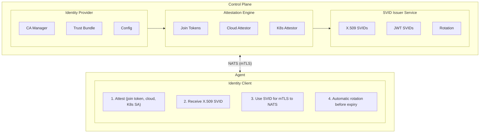
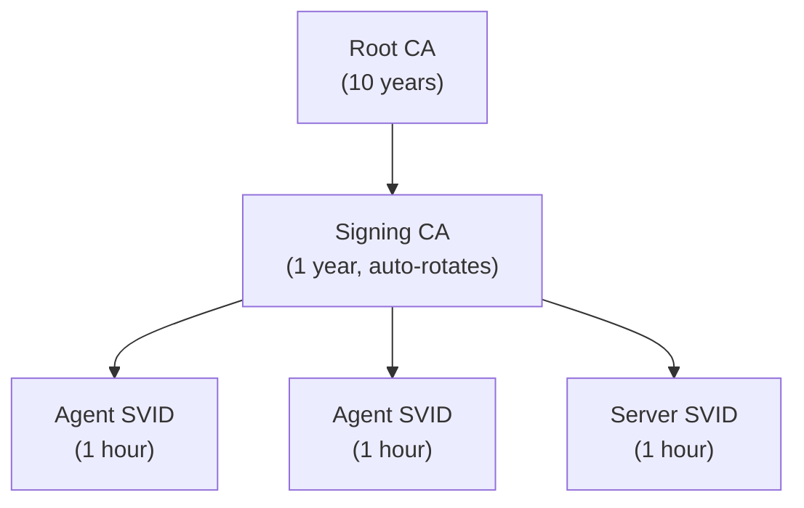

Keystone Core provides built-in SPIFFE (Secure Production Identity Framework For Everyone) identity management. This enables cryptographic identity for all agents and servers without requiring external identity infrastructure.

## Overview

### What is SPIFFE?

SPIFFE is an open standard for securely identifying workloads in dynamic and heterogeneous environments. Key concepts:

- **SPIFFE ID**: A URI that uniquely identifies a workload: `spiffe://trust-domain/path`
- **SVID (SPIFFE Verifiable Identity Document)**: A cryptographic document that proves identity
- **Trust Domain**: A security boundary (like `example.com` or `kscore.local`)
- **Trust Bundle**: Collection of CA certificates for verifying identities

### Why SPIFFE?

1. **Zero Trust**: Every connection is authenticated and authorized
2. **Automatic Rotation**: Certificates rotate without restarts
3. **Platform Agnostic**: Works across Kubernetes, VMs, bare metal, edge
4. **No Secrets Distribution**: Agents prove identity through attestation

### Keystone Core Identity Architecture



## Embedded Identity Provider

The embedded identity provider runs within the control plane and requires zero external dependencies. It's enabled by default.

### Configuration

```yaml
# keystone-core.yaml
identity:
  enabled: true
  trust_domain: "kscore.local"

  # SVID configuration
  svid:
    default_ttl: 1h
    max_ttl: 24h
    rotation_threshold: 0.5  # Rotate at 50% lifetime

  # CA configuration
  ca:
    key_type: "ecdsa-p256"    # ecdsa-p256, ecdsa-p384, rsa-2048, rsa-4096
    root_ttl: 87600h          # 10 years
    signing_ttl: 8760h        # 1 year
    data_dir: "/var/lib/kscore/identity"

  # Attestation configuration
  attestation:
    default_attestor: "join_token"
    allowed_attestors:
      - join_token
      - aws_iid
      - gcp_iit
      - azure_imds
      - k8s_sat
    join_token_ttl: 5m
```

### Trust Domains

The trust domain is the security boundary for your Keystone Core deployment:

| Use Case | Trust Domain | Example |
|----------|-------------|---------|
| Development | `kscore.local` | `spiffe://kscore.local/agent/dev-1` |
| Production | `yourcompany.com` | `spiffe://yourcompany.com/agent/prod-web-1` |
| Multi-cluster | `cluster.yourcompany.com` | `spiffe://us-east.yourcompany.com/agent/...` |

### SPIFFE IDs in Keystone Core

Keystone Core uses these SPIFFE ID patterns:

| Entity | SPIFFE ID Pattern | Example |
|--------|-------------------|---------|
| Agent | `spiffe://{domain}/agent/{agent-id}` | `spiffe://kscore.local/agent/web-server-1` |
| Server | `spiffe://{domain}/server/{server-id}` | `spiffe://kscore.local/server/control-plane-1` |
| Service | `spiffe://{domain}/service/{name}` | `spiffe://kscore.local/service/api` |

## Agent Auto-Registration

Agents must prove their identity before receiving an SVID. This is called **attestation**. Keystone Core supports multiple attestation methods.

### Method 1: Join Tokens (Recommended for Initial Setup)

Join tokens are one-time-use secrets that prove an agent is authorized to join the cluster.

#### Step 1: Create a Join Token (Control Plane)

```bash
# Create a token for a specific agent
kscorectl identity token create \
  --agent-id "web-server-1" \
  --ttl 5m

# Output:
# Join Token: abc123def456ghi789jkl012mno345pqr678
# Expires: 2024-01-15T10:05:00Z
# Agent ID: web-server-1
#
# Configure agent with:
#   attestation:
#     type: join_token
#     token: abc123def456ghi789jkl012mno345pqr678
```

#### Step 2: Configure the Agent

```yaml
# agent.yaml
server:
  address: "control-plane.example.com:4222"

identity:
  attestation:
    type: join_token
    token: "abc123def456ghi789jkl012mno345pqr678"
```

#### Step 3: Start the Agent

```bash
kscore-agent --config /etc/kscore/agent.yaml
```

The agent will:
1. Connect to the control plane
2. Present the join token for attestation
3. Receive its SPIFFE ID (`spiffe://kscore.local/agent/web-server-1`)
4. Receive an X.509 SVID certificate
5. Use the SVID for all subsequent mTLS connections

#### Step 4: Verify Registration

```bash
# Check agent identity
kscorectl agent show web-server-1

# Output:
# Agent: web-server-1
# SPIFFE ID: spiffe://kscore.local/agent/web-server-1
# Status: Connected
# SVID Expires: 2024-01-15T11:00:00Z
# Attestation: join_token
```

### Method 2: AWS Instance Identity Document (IID)

For agents running on AWS EC2, use the instance identity document for automatic attestation.

#### Control Plane Configuration

```yaml
identity:
  attestation:
    allowed_attestors:
      - aws_iid
    aws:
      allowed_accounts:
        - "123456789012"
      allowed_regions:
        - "us-east-1"
        - "us-west-2"
```

#### Agent Configuration

```yaml
identity:
  attestation:
    type: aws_iid
    # No credentials needed - uses IMDS automatically
```

The agent automatically:
1. Retrieves identity document from EC2 metadata service
2. Presents the signed document to the control plane
3. Receives SPIFFE ID based on instance ID: `spiffe://kscore.local/agent/i-0abc123def456`

### Method 3: GCP Instance Identity Token (IIT)

For agents running on Google Cloud Platform compute instances.

#### Control Plane Configuration

```yaml
identity:
  attestation:
    allowed_attestors:
      - gcp_iit
    gcp:
      allowed_projects:
        - "my-project-123"
      allowed_zones:
        - "us-central1-a"
        - "us-central1-b"
```

#### Agent Configuration

```yaml
identity:
  attestation:
    type: gcp_iit
    # No credentials needed - uses metadata service
```

### Method 4: Azure Instance Metadata Service (IMDS)

For agents running on Azure virtual machines.

#### Control Plane Configuration

```yaml
identity:
  attestation:
    allowed_attestors:
      - azure_imds
    azure:
      allowed_subscriptions:
        - "12345678-1234-1234-1234-123456789012"
      allowed_resource_groups:
        - "my-resource-group"
```

#### Agent Configuration

```yaml
identity:
  attestation:
    type: azure_imds
```

### Method 5: Kubernetes Service Account Token (SAT)

For agents running as Kubernetes pods.

#### Control Plane Configuration

```yaml
identity:
  attestation:
    allowed_attestors:
      - k8s_sat
    kubernetes:
      api_server: "https://kubernetes.default.svc"
      allowed_namespaces:
        - "kscore-agents"
        - "production"
      allowed_service_accounts:
        - "kscore-agent"
```

#### Agent Deployment (Kubernetes)

```yaml
apiVersion: apps/v1
kind: DaemonSet
metadata:
  name: kscore-agent
  namespace: kscore-agents
spec:
  selector:
    matchLabels:
      app: kscore-agent
  template:
    metadata:
      labels:
        app: kscore-agent
    spec:
      serviceAccountName: kscore-agent
      containers:
        - name: agent
          image: ghcr.io/shawnbutts/keystone-core/kscore-agent:latest
          env:
            - name: KSCORE_ATTESTATION_TYPE
              value: "k8s_sat"
          volumeMounts:
            - name: token
              mountPath: /var/run/secrets/tokens
      volumes:
        - name: token
          projected:
            sources:
              - serviceAccountToken:
                  path: token
                  expirationSeconds: 3600
                  audience: kscore
```

## SVID Lifecycle

### Issuance

After successful attestation, agents receive an X.509 SVID:

```
Certificate:
    Subject: CN = web-server-1
    Issuer: CN = Keystone Core Signing CA
    Validity:
        Not Before: Jan 15 10:00:00 2024 UTC
        Not After:  Jan 15 11:00:00 2024 UTC
    Subject Alternative Name:
        URI: spiffe://kscore.local/agent/web-server-1
```

### Automatic Rotation

SVIDs are rotated automatically before expiry:

1. **Rotation Threshold**: Default is 50% of lifetime
2. **Rotation Window**: For 1-hour SVIDs, rotation happens at ~30 minutes
3. **Seamless**: New SVID is obtained before old one expires
4. **Callbacks**: Applications are notified of rotation events

```go
// Example: Watch for SVID rotation
client.WatchX509SVID(ctx, func(oldSVID, newSVID *identity.X509SVID) {
    log.Printf("SVID rotated: %s", newSVID.SPIFFEID.String())
    log.Printf("New expiry: %s", newSVID.ExpiresAt)
})
```

### Manual Renewal

Force SVID renewal if needed:

```bash
# On the agent
kscore-agent identity renew

# Via control plane
kscorectl agent renew-svid web-server-1
```

## NATS mTLS Integration

All NATS connections use SVIDs for mutual TLS authentication.

### How It Works

```mermaid
sequenceDiagram
    participant Agent
    participant Server as NATS Server (Control Plane)

    Agent->>Server: TLS ClientHello
    Server->>Agent: TLS ServerHello + Server's SVID
    Agent->>Server: Client Certificate (Agent's SVID)

    Note over Server: Verify:<br/>- Certificate chain<br/>- SPIFFE ID in SAN<br/>- Trust domain match

    Server->>Agent: TLS Finished
    Agent<-->Server: Encrypted NATS Messages
```

### Subject Authorization

SPIFFE IDs control what NATS subjects entities can access:

```yaml
# Default agent permissions
# SPIFFE ID: spiffe://kscore.local/agent/*
publish:
  - "kscore.agent.*.heartbeat"
  - "kscore.agent.*.response"
  - "kscore.agent.*.events"
subscribe:
  - "kscore.agent.*.command"
  - "kscore.agent.*.state"
  - "kscore.broadcast.*"

# Default server permissions
# SPIFFE ID: spiffe://kscore.local/server/*
publish:
  - ">"  # All subjects
subscribe:
  - ">"  # All subjects
```

### Custom Authorization Rules

Add custom authorization rules:

```yaml
identity:
  nats:
    authorization:
      rules:
        - spiffe_id_pattern: "spiffe://kscore.local/agent/monitoring-*"
          allow_publish:
            - "kscore.metrics.>"
            - "kscore.logs.>"
          allow_subscribe:
            - "kscore.alerts.>"

        - spiffe_id_pattern: "spiffe://kscore.local/service/api"
          allow_publish:
            - "kscore.api.>"
          deny_publish:
            - "kscore.internal.>"
```

## Certificate Authority

### CA Hierarchy

Keystone Core uses a two-tier CA hierarchy:



### CA Storage

CA certificates and keys are stored securely:

```
/var/lib/kscore/identity/
├── root-ca.crt           # Root CA certificate (public)
├── root-ca.key           # Root CA private key (600 permissions)
├── signing-ca.crt        # Signing CA certificate (public)
├── signing-ca.key        # Signing CA private key (600 permissions)
└── trust-bundle.pem      # Combined trust bundle
```

### CA Rotation

The signing CA rotates automatically:

1. **Grace Period**: New CA is created before old one expires
2. **Overlap**: Both CAs are valid during transition
3. **Seamless**: Agents continue working during rotation

### Backup and Recovery

Back up CA data regularly:

```bash
# Backup
tar -czvf kscore-ca-backup.tar.gz /var/lib/kscore/identity/

# Restore
tar -xzvf kscore-ca-backup.tar.gz -C /
```

## Troubleshooting

### Agent Cannot Attest

**Symptoms:**
- Agent fails to start with "attestation failed"
- Logs show "invalid join token" or "token expired"

**Solutions:**

1. **Check token validity:**
   ```bash
   kscorectl identity token list
   ```

2. **Verify token hasn't been used:**
   ```bash
   kscorectl identity token show <token-id>
   ```

3. **Create new token:**
   ```bash
   kscorectl identity token create --agent-id <agent-id>
   ```

### SVID Rotation Fails

**Symptoms:**
- Agent logs show "failed to renew SVID"
- Connection drops after SVID expiry

**Solutions:**

1. **Check network connectivity:**
   ```bash
   # On agent
   nc -zv control-plane.example.com 4222
   ```

2. **Check identity provider status:**
   ```bash
   kscorectl identity status
   ```

3. **Verify CA is valid:**
   ```bash
   kscorectl identity ca info
   ```

### TLS Handshake Failures

**Symptoms:**
- "tls: bad certificate" errors
- "x509: certificate signed by unknown authority"

**Solutions:**

1. **Verify trust bundle is current:**
   ```bash
   kscorectl identity bundle show
   ```

2. **Check SPIFFE ID matches expected pattern:**
   ```bash
   openssl x509 -in svid.crt -text | grep URI
   ```

3. **Verify trust domain matches:**
   ```yaml
   # Control plane and agent must match
   identity:
     trust_domain: "kscore.local"
   ```

### Debug Mode

Enable identity debug logging:

```yaml
identity:
  log_level: debug
```

View identity events:

```bash
kscorectl identity events --follow
```

## Security Best Practices

1. **Use Short-Lived SVIDs**: Default 1-hour TTL limits exposure
2. **Restrict Attestors**: Only enable attestors you use
3. **Secure CA Storage**: Use encrypted storage, restrict permissions
4. **Monitor Attestation**: Alert on unusual attestation patterns
5. **Rotate Join Tokens**: Never reuse join tokens
6. **Trust Domain Planning**: Use meaningful, unique trust domains
7. **Backup CAs**: Regular, encrypted CA backups

## Next Steps

- [Operations: Identity Management](/docs/operations/identity-management) - Day-to-day identity operations
- [Reference: Identity Configuration](/docs/reference/identity) - Complete configuration reference
- [Concepts: NATS Mesh](/docs/concepts/nats-mesh) - How identity integrates with NATS
