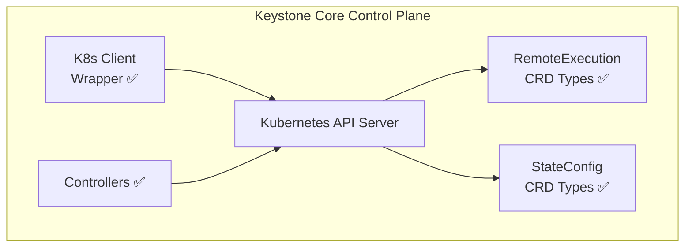

## Overview

Keystone Core provides Kubernetes integration for unified management of containerized workloads alongside traditional infrastructure. The integration includes a comprehensive client wrapper for interacting with Kubernetes clusters, Custom Resource Definitions (CRDs) for Kubernetes-native resource representations, and operator controllers with informer-based watching, reconciliation, drift detection, and leader election.

## Architecture



## Key Components

### Kubernetes Client Wrapper

The client wrapper (`internal/k8s/client.go`) provides a unified interface for Kubernetes operations. Note that this is an internal API; for external integrations, use the REST or gRPC endpoints.

- **Multi-cluster support**: Connect to multiple Kubernetes clusters simultaneously
- **Context switching**: Seamlessly switch between cluster contexts
- **Resource management**: Create, get, list, update, and delete Kubernetes resources
- **Pod execution**: Execute commands directly in pods

```go
// Create a new Kubernetes client
client, err := k8s.NewClient(k8s.ClusterConfig{
    Kubeconfig: "/path/to/kubeconfig",
    Context:    "my-cluster",
})

// Execute a command in a pod
result, err := client.ExecInPod(k8s.PodExecOptions{
    Namespace: "my-namespace",
    PodName:   "my-pod",
    Container: "my-container",
    Command:   []string{"ls", "-la"},
})
```

### Custom Resource Definitions

Keystone Core defines two primary CRDs for Kubernetes-native operations:

#### RemoteExecution CRD

Enables distributed command execution across Kubernetes clusters:

```yaml
apiVersion: keystonecore.io/v1
kind: RemoteExecution
metadata:
  name: update-config
  namespace: default
spec:
  target:
    namespace: production
    labelSelector: "app=web-server"
  command:
    - kubectl
    - rollout
    - restart
    - deployment/web-app
  timeout: 5m0s
  mode: pod
status:
  phase: Succeeded
  startTime: "2024-01-15T10:29:00Z"
  completionTime: "2024-01-15T10:30:00Z"
  podsExecuted: 1
  podsSucceeded: 1
  podsFailed: 0
  message: "Successfully executed on 1 pods"
  results:
    - podName: web-server-abc123
      namespace: default
      exitCode: 0
      output: "deployment.apps/web-app restarted"
      duration: 3s
```

#### StateConfig CRD

Declarative state management for Kubernetes resources:

```yaml
apiVersion: keystonecore.io/v1
kind: StateConfig
metadata:
  name: nginx-config
  namespace: default
spec:
  target:
    namespace: default
    labelSelector: "app=nginx"
  states:
    - name: web-namespace
      module: k8s_namespace
      parameters:
        name: web-apps
        labels:
          team: platform
    - name: nginx-deployment
      module: k8s_deployment
      parameters:
        name: nginx
        namespace: web-apps
        replicas: 3
        image: nginx:1.25
      requisites:
        require:
          - web-namespace
status:
  phase: Applied
  lastApplied: "2024-01-15T10:00:00Z"
  podsApplied: 1
  podsSucceeded: 1
  podsFailed: 0
  driftDetected: false
```

### Controllers

The operator controllers reconcile CRD states using dynamic informers, work queues, and status subresource updates:

**RemoteExecutionController**:

- Informer-based watching of RemoteExecution CRDs via dynamic shared informers
- Work queue with rate-limiting for reconciliation
- Reconcile fetches CRD via dynamic client, dispatches execution, updates status
- Skips terminal phases (Succeeded, Failed)
- `RemoteExecutor` interface for testable execution abstraction

**StateConfigController**:

- Informer-based watching of StateConfig CRDs via dynamic shared informers
- Reconcile sets phase to Applying, calls `StateExecutor`, updates to Applied/Failed
- Periodic drift detection via `StateDriftChecker` on Applied resources
- Cycle-free conversion from K8s CRD types to internal state types

**Leader Election**:

- K8s Lease-based leader election for HA multi-replica deployments
- Configurable via `operator.leaderElection` and `operator.leaderElectionID`
- Controllers only start on the leader instance; graceful handoff on loss

## Execution Modes

### Pod Execution

Execute commands inside running pods:

```yaml
execution:
  mode: pod
  pod:
    name: my-app-pod
    namespace: default
    container: app
  command: ["./health-check.sh"]
```

### Job Execution

Create Kubernetes Jobs for one-off tasks:

```yaml
execution:
  mode: job
  job:
    name: backup-job
    namespace: default
    image: backup-tools:latest
    command: ["backup.sh", "--full"]
    ttlSecondsAfterFinished: 3600
```

### Node Execution

Execute commands on Kubernetes nodes via DaemonSet:

```yaml
execution:
  mode: node
  node:
    selector:
      node-role.kubernetes.io/worker: ""
  command: ["sysctl", "-a"]
```

## Targeting

### Label Selectors

Target workloads by labels:

```yaml
target:
  labelSelector:
    matchLabels:
      app: my-app
      environment: production
    matchExpressions:
      - key: tier
        operator: In
        values: ["frontend", "backend"]
```

### Field Selectors

Target by resource fields:

```yaml
target:
  fieldSelector:
    status.phase: Running
    spec.nodeName: worker-01
```

### Namespace Filtering

Scope operations to specific namespaces:

```yaml
target:
  namespaces:
    - production
    - staging
  excludeNamespaces:
    - kube-system
```

## State Modules

Keystone Core includes Kubernetes-specific state modules:

### k8s_namespace

Manage Kubernetes namespaces:

```yaml
- module: k8s_namespace
  id: /namespaces/my-app
  state: present
  parameters:
    name: my-app
    labels:
      team: platform
    annotations:
      description: "Application namespace"
```

### k8s_deployment

Manage Deployments:

```yaml
- module: k8s_deployment
  id: /deployments/nginx
  state: present
  parameters:
    name: nginx
    namespace: web
    replicas: 3
    image: nginx:1.25
    ports:
      - containerPort: 80
    resources:
      requests:
        cpu: 100m
        memory: 128Mi
      limits:
        cpu: 500m
        memory: 512Mi
```

## Configuration

### Control Plane Configuration

```yaml
kubernetes:
  # Default kubeconfig path
  kubeconfig: ~/.kube/config

  # Default context (empty = current context)
  context: ""

  # Multi-cluster configuration
  clusters:
    - name: production
      kubeconfig: /etc/keystone/kubeconfig-prod
      context: prod-cluster
    - name: staging
      kubeconfig: /etc/keystone/kubeconfig-staging
      context: staging-cluster

  # CRD installation
  installCRDs: true

  # Controller settings (planned — controllers are scaffolded but not yet functional)
  controllers:
    remoteExecution:
      enabled: true
      concurrency: 10
    stateConfig:
      enabled: true
      syncPeriod: 5m
```

### Agent Configuration (Kubernetes Mode)

When running as a DaemonSet:

```yaml
agent:
  mode: kubernetes
  kubernetes:
    # Node name (auto-detected if empty)
    nodeName: ""

    # Namespace for agent resources
    namespace: keystone-system

    # Service account
    serviceAccount: keystone-agent

    # Pod execution settings
    podExec:
      timeout: 60s
      tty: false
```

## Deployment

### Helm Chart

Deploy Keystone Core to Kubernetes using Helm:

```bash
# Add the Keystone Core Helm repository
helm repo add keystone https://charts.keystone-core.io
helm repo update

# Install the control plane
helm install keystone-server keystone/kscore-server \
  --namespace keystone-system \
  --create-namespace \
  --set kubernetes.installCRDs=true

# Install agents as DaemonSet
helm install keystone-agent keystone/kscore-agent \
  --namespace keystone-system \
  --set agent.mode=kubernetes
```

### Kustomize

```yaml
# kustomization.yaml
apiVersion: kustomize.config.k8s.io/v1beta1
kind: Kustomization

resources:
  - https://github.com/shawnbutts/keystone-core/deploy/kubernetes/base

namespace: keystone-system

patches:
  - patch: |-
      - op: replace
        path: /spec/replicas
        value: 3
    target:
      kind: Deployment
      name: keystone-server
```

## Best Practices

### Resource Limits

Always set resource limits for Keystone Core components:

```yaml
resources:
  requests:
    cpu: 100m
    memory: 256Mi
  limits:
    cpu: 1000m
    memory: 1Gi
```

### RBAC

Use minimal RBAC permissions:

```yaml
apiVersion: rbac.authorization.k8s.io/v1
kind: ClusterRole
metadata:
  name: keystone-agent
rules:
  - apiGroups: [""]
    resources: ["pods", "pods/exec"]
    verbs: ["get", "list", "create"]
  - apiGroups: ["keystone.io"]
    resources: ["remoteexecutions", "stateconfigs"]
    verbs: ["get", "list", "watch", "update", "patch"]
```

### Multi-Cluster Management

When managing multiple clusters:

1. Use separate kubeconfig files per cluster
2. Configure cluster-specific contexts
3. Use cluster labels for targeting
4. Implement network policies for cross-cluster communication

### Drift Detection

The `StateConfigController` periodically checks Applied resources for drift using the `StateDriftChecker` interface. When drift is detected, the resource status is updated with `driftDetected: true` and the resource is re-enqueued for reconciliation.

Drift detection runs as part of `periodicReconcile` at the configured `reconcileInterval`. Future improvements may support severity-based configuration:

```yaml
driftDetection:
  enabled: true
  interval: 5m
  severity:
    critical:
      - deployments
      - configmaps
    high:
      - services
    medium:
      - namespaces
```

## Troubleshooting

### CRD Not Found

If CRDs are not installed:

```bash
# Check if CRDs exist
kubectl get crd remoteexecutions.keystone.io stateconfigs.keystone.io

# Install CRDs manually
kubectl apply -f https://github.com/shawnbutts/keystone-core/deploy/kubernetes/crds/
```

### Controller Not Reconciling

If the operator is enabled but controllers are not reconciling, check:

```bash
kubectl logs -n keystone-system deployment/keystone-server -c controller
```

### Pod Execution Failures

Verify RBAC permissions:

```bash
kubectl auth can-i create pods/exec --as=system:serviceaccount:keystone-system:keystone-agent
```

### Multi-Cluster Connection Issues

Test cluster connectivity:

```bash
# Test with kubectl
KUBECONFIG=/etc/keystone/kubeconfig-prod kubectl cluster-info

# Check Keystone Core cluster status
kscorectl cluster status
```

## See Also

- [Agents](/docs/concepts/agents/) - Agent architecture and deployment
- [State Management](/docs/concepts/state-management/) - Declarative configuration
- [Remote Execution](/docs/concepts/remote-execution/) - Command execution system
- [Multi-Environment Support](/docs/scenarios/multi-environment/) - Cross-platform operations
