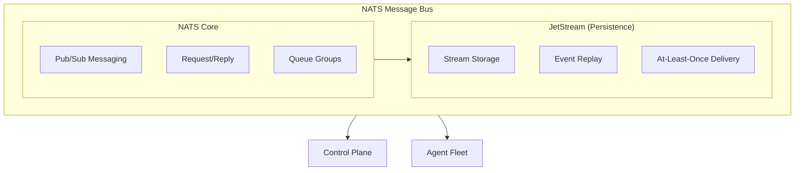
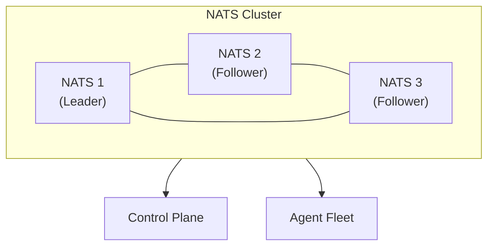

## Overview

Keystone Core uses [NATS](https://nats.io/) as its message bus, providing the communication backbone between the control plane and agent fleet. NATS offers:

- **High Performance**: Millions of messages per second
- **Low Latency**: Sub-millisecond message delivery
- **Reliability**: At-least-once delivery with JetStream
- **Scalability**: Linear scaling to thousands of nodes
- **Simplicity**: Simple operations, no Kafka/ZooKeeper complexity

## Why NATS?

We chose NATS over alternatives (Kafka, RabbitMQ, Redis) because:

**vs Kafka**:
- Simpler operations (embedded mode, no ZooKeeper)
- Lower latency (<1ms vs ~10ms)
- Built-in request-reply patterns
- Lightweight footprint

**vs RabbitMQ**:
- Higher throughput (10x faster)
- Better clustering support
- Simpler protocol (text-based, not AMQP)

**vs Redis Pub/Sub**:
- Persistence (JetStream)
- At-least-once delivery
- Better scaling for large deployments

## Architecture



## Deployment Modes

Keystone Core supports three NATS deployment modes:

### 1. Embedded Mode (Development/Small Deployments)

NATS runs in-process with the control plane binary.

**Best for**:
- Development and testing
- Small deployments (<100 nodes)
- Home labs and edge locations
- Quick prototyping

**Configuration**:
```yaml
nats:
  mode: embedded
  listen: "0.0.0.0:4222"
  jetstream:
    enabled: true
    store_dir: /var/lib/kscore/nats
    max_memory: "1GB"
    max_file: "10GB"
```

**Characteristics**:
- Zero dependencies
- Single binary deployment
- Automatic lifecycle management
- Perfect for getting started

**Limitations**:
- No high availability
- Limited to control plane resources
- Not recommended for >100 nodes

### 2. External Cluster Mode (Production)

Dedicated NATS cluster (3+ nodes) for high availability.

**Best for**:
- Production deployments
- Large scale (100+ nodes)
- High availability requirements
- Multi-region deployments

**Configuration**:
```yaml
nats:
  mode: external
  urls:
    - nats://nats1.example.com:4222
    - nats://nats2.example.com:4222
    - nats://nats3.example.com:4222
  credentials: /etc/kscore/nats.creds
  tls:
    enabled: true
    ca_file: /etc/kscore/ca.crt
```

**NATS Cluster Setup**:


**Characteristics**:
- High availability (automatic failover)
- Horizontal scalability
- Dedicated resources
- Production-ready

### 3. Hybrid/Leaf Mode (Advanced)

Control plane connects to external cluster, agents run embedded NATS as leaf nodes.

**Best for**:
- Edge deployments
- Multi-region with central cluster
- Bandwidth-constrained locations
- Air-gapped environments with periodic sync

**Configuration**:

Control plane:
```yaml
nats:
  mode: external
  urls:
    - nats://central-nats-cluster:4222
```

Edge agents:
```yaml
nats:
  mode: leaf
  listen: "127.0.0.1:4222"
  leaf:
    remotes:
      - url: "nats://central-nats-cluster:7422"
        credentials: /etc/kscore/leaf.creds
```

**Characteristics**:
- Best of both worlds
- Local buffering at edge
- Automatic sync when connected
- Graceful degradation when disconnected

## NATS Subjects (Topics)

Keystone Core uses a structured subject namespace:

### Agent Communication

```
titan.agent.{agent_id}.command     - Commands to specific agent
titan.agent.{agent_id}.state       - State configs to specific agent
titan.agent.{agent_id}.event       - Events from specific agent
titan.agent.*.heartbeat            - Heartbeats from all agents
titan.agent.register               - Agent registration
```

### Control Plane

```
titan.command.dispatch             - Command dispatch requests
titan.command.result               - Command execution results
titan.state.apply                  - State application requests
titan.state.result                 - State application results
titan.event                        - System-wide events
```

### GitOps

```
titan.gitops.webhook.argocd        - ArgoCD webhooks
titan.gitops.webhook.flux          - Flux webhooks
titan.gitops.webhook.github        - GitHub webhooks
titan.gitops.webhook.gitlab        - GitLab webhooks
```

### Policy

```
titan.policy.evaluate              - Policy evaluation requests
titan.policy.result                - Policy evaluation results
titan.policy.violation             - Policy violations
```

## JetStream (Event Persistence)

JetStream provides persistence for events:

### Streams

Keystone Core creates these JetStream streams:

**Events Stream**:
```
Name: TITAN_EVENTS
Subjects: titan.event, titan.agent.*.event
Retention: WorkQueue (delete after ack)
Storage: File
Max Age: 30 days
```

**Audit Stream**:
```
Name: TITAN_AUDIT
Subjects: titan.command.result, titan.state.result, titan.policy.*
Retention: Limits (keep based on size/age)
Storage: File
Max Age: 90 days
```

**Webhooks Stream**:
```
Name: TITAN_GITOPS
Subjects: titan.gitops.webhook.*
Retention: WorkQueue
Storage: File
Max Age: 7 days
```

### Why JetStream for Events but NOT for State?

**JetStream is used for**:
- Event streaming and replay
- Webhook buffering
- Audit trail

**SQLite/PostgreSQL is used for**:
- Operational state (agent metadata, job status)
- Configuration (policies, reactors)
- Complex queries with indexes
- Transactional updates
- Relational data

**Rationale**:
- JetStream excels at streaming, not querying
- State requires SQL joins, indexes, transactions
- Hybrid approach gives best of both worlds

## Performance

### Throughput

Measured on single NATS server (4 cores, 8GB RAM):

- **Publish**: 10 million msgs/sec
- **Subscribe**: 8 million msgs/sec
- **JetStream Publish**: 1 million msgs/sec
- **JetStream Subscribe**: 500k msgs/sec

Real-world Keystone Core workload (clustered NATS):
- **Heartbeats**: 100k agents × 2 msgs/min = 3,333 msgs/sec
- **Commands**: 10k commands/sec (bursts to 50k)
- **Events**: 50k events/sec
- **Total**: ~65k msgs/sec sustained

### Latency

- **Pub to Sub**: <1ms (same datacenter)
- **Request/Reply**: <2ms round-trip
- **JetStream Ack**: <5ms
- **Cross-region**: +network RTT

### Resource Usage

**Embedded NATS** (per control plane instance):
- Memory: 100-500MB (depending on JetStream storage)
- CPU: 0.1-0.5 cores
- Disk I/O: 10-100 MB/s (JetStream writes)

**External NATS Cluster** (per node):
- Memory: 2-4GB
- CPU: 1-2 cores
- Disk I/O: 100-500 MB/s

## Security

### Authentication

**NATS Credentials (JWT)**:
```bash
# Generate credentials
nsc add user -a kscore agent1
# Produces agent1.creds file with:
# - User JWT (identity)
# - NKEY (signing key)
```

Agent config:
```yaml
nats:
  credentials: /etc/kscore/agent1.creds
```

**Token Authentication**:
```yaml
nats:
  token: "secret-token-here"
```

**Username/Password** (not recommended):
```yaml
nats:
  username: "agent1"
  password: "password"
```

### Authorization

NATS supports fine-grained authorization:

```
# Control plane can:
- Publish to titan.command.*
- Subscribe to titan.agent.*
- Subscribe to titan.event

# Agents can:
- Subscribe to titan.agent.{self}.command
- Subscribe to titan.agent.{self}.state
- Publish to titan.command.result
- Publish to titan.event
```

### Encryption

**TLS Configuration**:

NATS server:
```conf
tls {
  cert_file: "/etc/nats/server.crt"
  key_file: "/etc/nats/server.key"
  ca_file: "/etc/nats/ca.crt"
  verify: true
}
```

Keystone Core client:
```yaml
nats:
  tls:
    enabled: true
    ca_file: /etc/kscore/ca.crt
    cert_file: /etc/kscore/client.crt
    key_file: /etc/kscore/client.key
    verify_server: true
```

## High Availability

### Cluster Setup

Minimum 3 nodes for quorum:

```
nats-server \
  --cluster nats://0.0.0.0:6222 \
  --routes nats://nats1:6222,nats://nats2:6222,nats://nats3:6222
```

Full config:
```conf
# Server
port: 4222
server_name: nats1

# Clustering
cluster {
  name: kscore
  port: 6222
  routes: [
    nats://nats1:6222
    nats://nats2:6222
    nats://nats3:6222
  ]
}

# JetStream
jetstream {
  store_dir: /var/lib/nats
  max_memory_store: 8GB
  max_file_store: 100GB
}
```

### Failure Scenarios

**Single Node Failure**:
- Cluster continues operating
- Clients automatically reconnect to surviving nodes
- JetStream streams remain available

**Network Partition**:
- Majority partition continues
- Minority partition is unavailable
- Automatic re-sync on partition heal

**Complete Cluster Failure**:
- Control plane and agents buffer messages
- Automatic reconnection when cluster recovers
- No message loss (JetStream persistence)

## Monitoring

### NATS Metrics

Exposed at `/varz`, `/connz`, `/routez`:

```bash
curl http://nats-server:8222/varz
```

Key metrics:
```json
{
  "connections": 1234,
  "in_msgs": 1000000,
  "out_msgs": 1000000,
  "in_bytes": 1073741824,
  "out_bytes": 1073741824,
  "slow_consumers": 0
}
```

### JetStream Metrics

```bash
curl http://nats-server:8222/jsz
```

Per-stream metrics:
```json
{
  "streams": [
    {
      "name": "TITAN_EVENTS",
      "messages": 1000000,
      "bytes": 10737418240,
      "num_subjects": 100
    }
  ]
}
```

### Prometheus Exporter

Use [nats-surveyor](https://github.com/nats-io/nats-surveyor) or [prometheus-nats-exporter](https://github.com/nats-io/prometheus-nats-exporter):

```bash
docker run -d \
  --name nats-exporter \
  -p 7777:7777 \
  natsio/prometheus-nats-exporter:latest \
  -varz http://nats-server:8222
```

Metrics:
```
nats_varz_connections
nats_varz_in_msgs
nats_varz_out_msgs
nats_varz_slow_consumers
nats_jetstream_stream_messages
nats_jetstream_stream_bytes
```

## Best Practices

### Sizing

**Small** (<100 agents):
- Embedded mode
- 1GB JetStream storage

**Medium** (100-1,000 agents):
- 3-node external cluster
- 10GB JetStream storage per node

**Large** (1,000+ agents):
- 5-node external cluster
- 100GB JetStream storage per node
- Dedicated NATS infrastructure

### Tuning

**Connection Limits**:
```conf
max_connections: 10000
max_control_line: 4096
max_payload: 1048576  # 1MB
```

**JetStream**:
```conf
jetstream {
  max_memory_store: 8GB
  max_file_store: 100GB
  sync_interval: "2m"
}
```

**Performance**:
```conf
# Disable slow consumer detection if using JetStream
max_pending_size: 0
```

### Operations

1. **Monitor Slow Consumers**: Alert on slow_consumers > 0
2. **Disk Space**: Alert at 80% JetStream disk usage
3. **Connection Count**: Monitor for connection leaks
4. **Cluster Health**: All nodes should be connected
5. **Backup JetStream**: Regular backups of stream data

## Troubleshooting

### Agents Not Connecting

**Problem**: Agents can't connect to NATS

Check:
```bash
# Test NATS connectivity
nats --server=nats://control-plane:4222 pub test "hello"

# Check NATS logs
journalctl -u nats-server -f

# Verify port is open
nc -zv control-plane 4222
```

### Slow Consumers

**Problem**: `slow_consumers` metric increasing

Causes:
- Agent can't keep up with message rate
- Network congestion
- Agent resource constraints

Fix:
- Increase agent resources
- Use queue groups for load distribution
- Enable flow control

### JetStream Disk Full

**Problem**: JetStream out of disk space

Fix:
```bash
# Check stream usage
nats stream ls

# Delete old messages
nats stream purge TITAN_EVENTS

# Adjust retention
nats stream edit TITAN_EVENTS --max-age=7d
```

### Cluster Split-Brain

**Problem**: NATS cluster partitioned

Detection:
```bash
# Check cluster status on each node
nats --server=nats://nats1:4222 server list
```

Fix:
- Resolve network partition
- Restart minority partition nodes
- Cluster will automatically re-sync

## Migration Paths

### Embedded → External Cluster

1. **Deploy NATS Cluster**: 3+ nodes
2. **Configure Replication**: Set up JetStream replication
3. **Update Control Plane**: Change to external mode
4. **Restart Control Plane**: Rolling restart
5. **Update Agents**: Point to cluster (they auto-reconnect)
6. **Verify**: Check all agents connected
7. **Decommission Embedded**: Stop old control plane

### SQLite → PostgreSQL (State Storage)

Note: This migrates state storage, not NATS. See [State Storage](state-storage/) for details.

## Next Steps

- Learn about [State Storage](state-storage/) for operational data
- Understand [Remote Execution](remote-execution/) message flows
- Explore [Events](events/) that flow through NATS
- See [Control Plane](control-plane/) for NATS integration details
