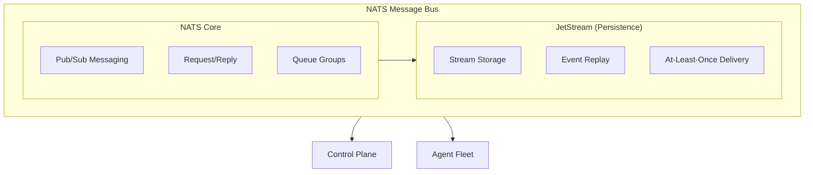
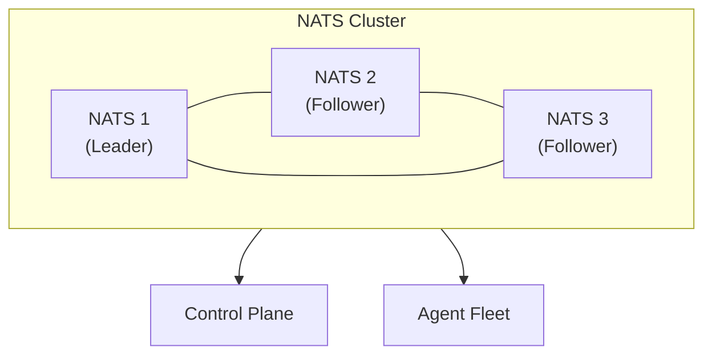
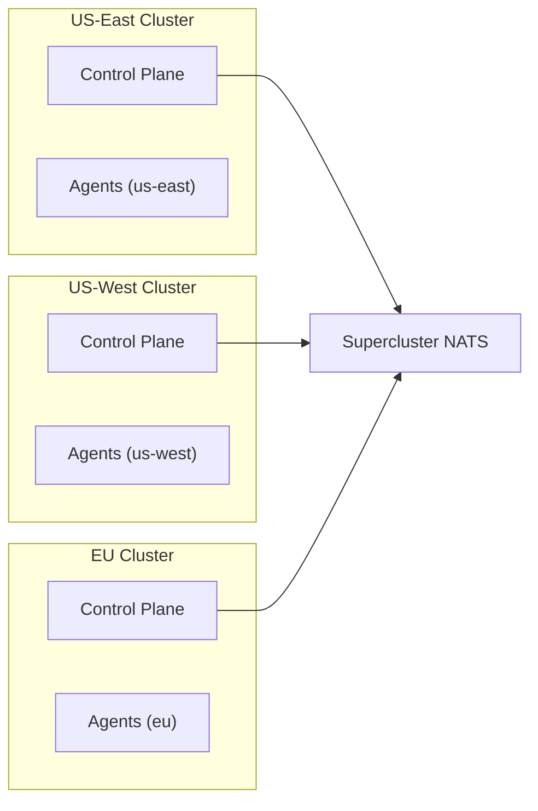
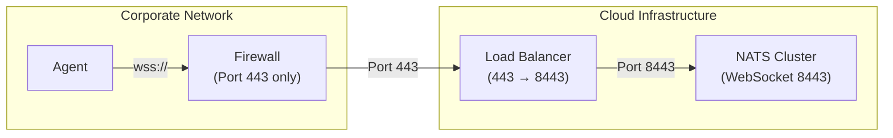
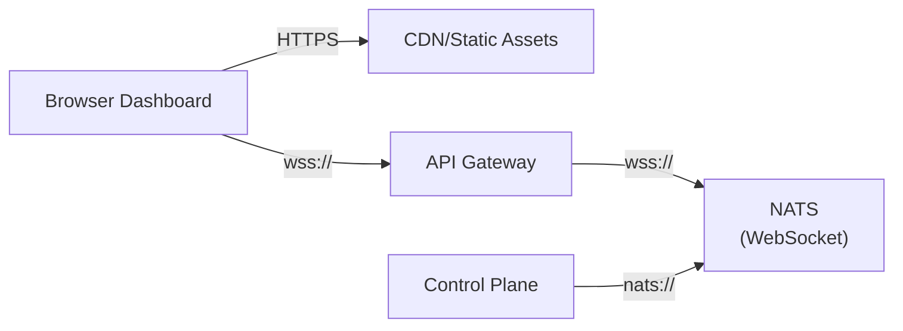

## Overview

Keystone Core uses [NATS](https://nats.io/) as its message bus, providing the communication backbone between the control plane and agent fleet. NATS offers:

- **High Performance**: Millions of messages per second
- **Low Latency**: Sub-millisecond message delivery
- **Reliability**: At-least-once delivery with JetStream
- **Scalability**: Linear scaling to thousands of nodes
- **Simplicity**: Simple operations, no Kafka/ZooKeeper complexity

## Why NATS?

We chose NATS over alternatives (Kafka, RabbitMQ, Redis) because:

**vs Kafka**:
- Simpler operations (embedded mode, no ZooKeeper)
- Lower latency (<1ms vs ~10ms)
- Built-in request-reply patterns
- Lightweight footprint

**vs RabbitMQ**:
- Higher throughput (10x faster)
- Better clustering support
- Simpler protocol (text-based, not AMQP)

**vs Redis Pub/Sub**:
- Persistence (JetStream)
- At-least-once delivery
- Better scaling for large deployments

## Architecture



## Deployment Modes

Keystone Core supports three NATS deployment modes:

### 1. Embedded Mode (Development/Small Deployments)

NATS runs in-process with the control plane binary.

**Best for**:
- Development and testing
- Small deployments (<100 nodes)
- Home labs and edge locations
- Quick prototyping

**Configuration**:
```yaml
nats:
  mode: embedded
  listen: "0.0.0.0:4222"
  jetstream:
    enabled: true
    store_dir: /var/lib/kscore/nats
    max_memory: "1GB"
    max_file: "10GB"
```

**Characteristics**:
- Zero dependencies
- Single binary deployment
- Automatic lifecycle management
- Perfect for getting started

**Limitations**:
- No high availability
- Limited to control plane resources
- Not recommended for >100 nodes

### 2. External Cluster Mode (Production)

Dedicated NATS cluster (3+ nodes) for high availability.

**Best for**:
- Production deployments
- Large scale (100+ nodes)
- High availability requirements
- Multi-region deployments

**Configuration**:
```yaml
nats:
  mode: external
  urls:
    - nats://nats1.example.com:4222
    - nats://nats2.example.com:4222
    - nats://nats3.example.com:4222
  credentials: /etc/kscore/nats.creds
  tls:
    enabled: true
    ca_file: /etc/kscore/ca.crt
```

**NATS Cluster Setup**:


**Characteristics**:
- High availability (automatic failover)
- Horizontal scalability
- Dedicated resources
- Suitable for larger deployments

### 3. Hybrid/Leaf Mode (Advanced)

Control plane connects to external cluster, agents run embedded NATS as leaf nodes.

**Best for**:
- Edge deployments
- Multi-region with central cluster
- Bandwidth-constrained locations
- Air-gapped environments with periodic sync

**Configuration**:

Control plane:
```yaml
nats:
  mode: external
  urls:
    - nats://central-nats-cluster:4222
```

Edge agents:
```yaml
nats:
  mode: leaf
  listen: "127.0.0.1:4222"
  leaf:
    remotes:
      - url: "nats://central-nats-cluster:7422"
        credentials: /etc/kscore/leaf.creds
```

**Characteristics**:
- Best of both worlds
- Local buffering at edge
- Automatic sync when connected
- Graceful degradation when disconnected

## NATS Endpoint Discovery

When running in external cluster mode, Keystone Core supports multiple methods for discovering NATS server endpoints dynamically. This is useful in environments where NATS endpoints may change (e.g., Kubernetes, auto-scaling groups).

### Discovery Methods

#### 1. Static URLs

The simplest approach - list NATS servers explicitly:

```yaml
nats:
  mode: external
  urls:
    - nats://nats1.example.com:4222
    - nats://nats2.example.com:4222
    - nats://nats3.example.com:4222
```

#### 2. DNS Discovery

Discover NATS servers via DNS SRV or A records:

```yaml
nats:
  discovery:
    method: dns
    dns:
      name: _nats._tcp.nats.example.com  # SRV record
      # or for A records:
      # name: nats.example.com
      port: 4222  # Default port if not in SRV
      refresh_interval: 30s
```

DNS returns multiple A records or SRV records, and the client connects to all discovered endpoints.

#### 3. Kubernetes Discovery

Discover NATS endpoints from Kubernetes Services or StatefulSets:

```yaml
nats:
  discovery:
    method: kubernetes
    kubernetes:
      service_name: nats
      namespace: nats-system  # Optional, defaults to current namespace
      port_name: client       # Optional, port name to use
      label_selector: "app=nats"  # Optional, filter by labels
      refresh_interval: 30s
```

The Kubernetes discoverer uses the EndpointSlices API (preferred) or Endpoints API as fallback. It automatically detects when running inside a cluster and uses the in-cluster config, or uses your kubeconfig when running locally.

#### 4. Consul Discovery

Discover NATS servers registered in Consul:

```yaml
nats:
  discovery:
    method: consul
    consul:
      address: consul.example.com:8500
      service_name: nats
      datacenter: dc1          # Optional
      token: consul-acl-token  # Optional, for ACL-enabled Consul
      tls:
        enabled: true
        ca_file: /etc/certs/consul-ca.crt
      refresh_interval: 30s
```

The Consul discoverer queries the health API to find healthy NATS service instances.

#### 5. etcd Discovery

Discover NATS servers from etcd key-value store:

```yaml
nats:
  discovery:
    method: etcd
    etcd:
      endpoints:
        - etcd1.example.com:2379
        - etcd2.example.com:2379
      prefix: /services/nats/  # Key prefix to watch
      tls:
        enabled: true
        ca_file: /etc/certs/etcd-ca.crt
        cert_file: /etc/certs/etcd-client.crt
        key_file: /etc/certs/etcd-client.key
      refresh_interval: 30s
```

etcd entries can be stored in two formats:
- **JSON**: `{"host": "nats1.example.com", "port": 4222}`
- **Simple**: `nats1.example.com:4222`

### Discovery Features

All discovery methods support:

- **Automatic Refresh**: Endpoints are periodically re-discovered
- **Watch Mode**: Real-time updates when endpoints change
- **Health Filtering**: Only healthy endpoints are returned
- **Metadata**: Additional endpoint metadata (datacenter, tags, weight)
- **Priority/Weight**: For load balancing decisions
- **TLS Support**: Secure connections to discovery backends

### Failover Behavior

When using discovery:

1. Initial discovery on startup
2. Connect to all discovered endpoints
3. Periodic refresh discovers new endpoints
4. Failed endpoints are automatically removed
5. New endpoints are added without restart

## NATS Subjects (Topics)

Keystone Core uses a structured, cluster-prefixed subject namespace:

```
kscore.{cluster}.{category}.{entity}.{operation}
```

The `{cluster}` prefix enables multi-cluster deployments (superclusters) where messages are routed to the correct cluster.

### Agent Communication

```
kscore.{cluster}.agent.register           - Agent registration
kscore.{cluster}.agent.heartbeat          - Agent heartbeats
kscore.{cluster}.agent.{id}.command       - Commands to specific agent
kscore.{cluster}.agent.{id}.response      - Responses from specific agent
kscore.{cluster}.agent.{id}.state         - State operations
kscore.{cluster}.agent.{id}.events        - Agent events
```

### Bootstrap (Secure Registration)

New agents start with minimal permissions and use bootstrap subjects:

```
kscore.{cluster}.bootstrap.{id}.register  - Bootstrap registration request
kscore.{cluster}.bootstrap.{id}.response  - Bootstrap registration response
```

Bootstrap credentials can only access these subjects until permanent credentials are issued.

### Server Communication

```
kscore.{cluster}.server.announce          - Server announcements
kscore.{cluster}.server.{id}.control      - Server control channel
kscore.{cluster}.discovery                - Peer discovery
```

### Command Execution

```
kscore.{cluster}.command.dispatch         - Command dispatch requests
kscore.{cluster}.command.result           - Command execution results
kscore.{cluster}.command.{id}.*           - Per-command channels
```

### State Management

```
kscore.{cluster}.state.apply              - State application requests
kscore.{cluster}.state.result             - State application results
```

### Events

```
kscore.{cluster}.event                    - System-wide events
kscore.{cluster}.event.{type}             - Events by type
```

### GitOps

```
kscore.{cluster}.gitops.webhook.argocd    - ArgoCD webhooks
kscore.{cluster}.gitops.webhook.flux      - Flux webhooks
kscore.{cluster}.gitops.webhook.github    - GitHub webhooks
kscore.{cluster}.gitops.webhook.gitlab    - GitLab webhooks
```

### Policy

```
kscore.{cluster}.policy.evaluate          - Policy evaluation requests
kscore.{cluster}.policy.result            - Policy evaluation results
kscore.{cluster}.policy.violation         - Policy violations
```

### Message Envelope

All messages include a standard envelope with routing metadata:

```json
{
  "message_id": "uuid",
  "correlation_id": "uuid",
  "cluster": "production",
  "priority": "normal",
  "ttl": 300,
  "timestamp": "2025-01-15T10:30:00Z",
  "trace": {
    "trace_id": "abc123",
    "span_id": "def456"
  },
  "payload": { ... }
}
```

**Envelope Fields**:
- `message_id`: Unique message identifier for deduplication
- `correlation_id`: Links related messages (request/response)
- `cluster`: Target cluster for supercluster routing
- `priority`: Message priority (low, normal, high, critical)
- `ttl`: Time-to-live in seconds
- `trace`: Distributed tracing context

### Subject Namespace Deep Dive

This section provides detailed examples of the subject namespace, including wildcards, multi-cluster scenarios, and common use cases.

#### Namespace Hierarchy

The full subject namespace follows this structure:

```
kscore                           # Root prefix (all Keystone messages)
  └── {cluster}                  # Cluster identifier (e.g., "prod", "staging")
        └── {category}           # Message category (agent, command, event, etc.)
              └── {entity}       # Specific entity (agent ID, command ID)
                    └── {action} # Operation being performed
```

**Examples with full paths:**

```
# Agent "web-01" in "production" cluster sends heartbeat
kscore.production.agent.heartbeat

# Command sent to agent "db-primary" in "staging"
kscore.staging.agent.db-primary.command

# State drift event in "edge-site-1"
kscore.edge-site-1.event.state.drift

# Policy violation in "prod-us-west"
kscore.prod-us-west.policy.violation
```

#### Wildcard Subscriptions

NATS supports two wildcard characters for flexible subscriptions:

| Wildcard | Meaning | Example |
|----------|---------|---------|
| `*` | Single token | `kscore.prod.agent.*.command` matches any agent |
| `>` | Multiple tokens | `kscore.prod.event.>` matches all events |

**Common wildcard patterns:**

```bash
# Control plane subscribes to all agent heartbeats
kscore.production.agent.heartbeat

# Control plane subscribes to all command results
kscore.production.command.result

# Monitor all events from any source
kscore.production.event.>

# Subscribe to specific agent's all channels
kscore.production.agent.web-01.>

# Subscribe to all policy violations across clusters
kscore.*.policy.violation
```

**Permission examples using wildcards:**

```
# Agent "web-01" permissions:
publish: kscore.production.agent.web-01.>      # Own channels only
subscribe: kscore.production.agent.web-01.>    # Own commands only

# Control plane permissions:
publish: kscore.production.>                    # All production
subscribe: kscore.>                             # All clusters (supercluster)
```

#### Multi-Cluster (Supercluster) Routing

In supercluster deployments, the cluster prefix enables message routing:



**Supercluster subject examples:**

```bash
# Command to agent in specific cluster
kscore.us-east.agent.web-01.command
kscore.us-west.agent.db-01.command
kscore.eu.agent.app-01.command

# Broadcast to all clusters (from global control plane)
kscore.*.server.announce

# Aggregate events from all clusters
kscore.*.event.>
```

**Cluster naming conventions:**

| Pattern | Example | Use Case |
|---------|---------|----------|
| Region-based | `us-east`, `us-west`, `eu-central` | Multi-region |
| Environment | `prod`, `staging`, `dev` | Environment isolation |
| Combined | `prod-us-east`, `staging-eu` | Full qualification |
| Tenant | `tenant-acme`, `tenant-corp` | Multi-tenant |

#### Use Case Examples

**Example 1: Execute command on specific agent**

```bash
# Send command
Subject: kscore.production.agent.web-01.command
Payload: {"type": "exec", "command": "systemctl status nginx"}

# Receive result
Subject: kscore.production.command.result
Payload: {"agent": "web-01", "exit_code": 0, "stdout": "..."}
```

**Example 2: Broadcast state to role**

```bash
# State apply to all web servers (via control plane routing)
Subject: kscore.production.state.apply
Payload: {"target": "role=webserver", "state": "nginx.yaml"}

# Each agent receives on their channel
Subject: kscore.production.agent.web-01.state
Subject: kscore.production.agent.web-02.state
Subject: kscore.production.agent.web-03.state
```

**Example 3: Event-driven automation**

```bash
# Agent emits event
Subject: kscore.production.event
Payload: {
  "type": "state.drift",
  "agent": "web-01",
  "severity": "high",
  "resource": "nginx_config"
}

# Reactor subscribes to drift events
Subscribe: kscore.production.event.state.drift

# Reactor triggers remediation
Subject: kscore.production.state.apply
Payload: {"target": "agent_id=web-01", "state": "nginx.yaml"}
```

**Example 4: GitOps webhook processing**

```bash
# GitHub webhook received
Subject: kscore.production.gitops.webhook.github
Payload: {"event": "push", "repo": "config-repo", "ref": "main"}

# GitOps processor triggers sync
Subject: kscore.production.gitops.sync
Payload: {"repo": "config-repo", "revision": "abc123"}
```

**Example 5: Policy evaluation**

```bash
# Request policy check before command execution
Subject: kscore.production.policy.evaluate
Payload: {
  "agent": "web-01",
  "action": "exec",
  "command": "rm -rf /",
  "user": "operator@example.com"
}

# Policy engine responds
Subject: kscore.production.policy.result
Payload: {
  "allowed": false,
  "policy": "dangerous-commands",
  "reason": "Destructive command blocked"
}

# Policy violation event emitted
Subject: kscore.production.policy.violation
Payload: {
  "policy": "dangerous-commands",
  "agent": "web-01",
  "user": "operator@example.com",
  "action": "exec"
}
```

#### Subject Naming Best Practices

1. **Use lowercase**: `kscore.production` not `kscore.Production`
2. **Use hyphens for multi-word**: `us-west` not `us_west` or `uswest`
3. **Keep tokens short**: `cmd` vs `command` (for high-volume subjects)
4. **Be consistent**: Same naming pattern across all clusters
5. **Avoid special characters**: Only use alphanumeric, hyphen, period

**Recommended cluster naming:**

```yaml
# Good - consistent, lowercase, hyphenated
cluster: production
cluster: staging
cluster: dev
cluster: us-east-prod
cluster: eu-central-staging

# Avoid - inconsistent or problematic
cluster: Production    # Uppercase
cluster: us_east       # Underscore
cluster: prod.east     # Extra period creates confusion
```

#### Subject Monitoring

Monitor subject activity with NATS tools:

```bash
# Watch all subjects in cluster
nats sub "kscore.production.>"

# Monitor specific agent
nats sub "kscore.production.agent.web-01.>"

# Count messages by subject pattern
nats sub --count "kscore.production.event.>"

# Benchmark subject throughput
nats bench --pub "kscore.test.bench" --msgs 100000
```

**Prometheus metrics by subject:**

```promql
# Messages per subject pattern
rate(nats_core_msgs_sent_total{subject=~"kscore.production.agent.*"}[5m])

# Most active subjects
topk(10, rate(nats_core_msgs_received_total[5m]))
```

## JetStream (Event Persistence)

JetStream provides persistence for events:

### Streams

Keystone Core creates these JetStream streams:

**Events Stream**:
```
Name: KSCORE_EVENTS
Subjects: kscore.event, kscore.agent.*.event
Retention: WorkQueue (delete after ack)
Storage: File
Max Age: 30 days
```

**Audit Stream**:
```
Name: KSCORE_AUDIT
Subjects: kscore.command.result, kscore.state.result, kscore.policy.*
Retention: Limits (keep based on size/age)
Storage: File
Max Age: 90 days
```

**Webhooks Stream**:
```
Name: KSCORE_GITOPS
Subjects: kscore.gitops.webhook.*
Retention: WorkQueue
Storage: File
Max Age: 7 days
```

### Why JetStream for Events but NOT for State?

**JetStream is used for**:
- Event streaming and replay
- Webhook buffering
- Audit trail

**SQLite/PostgreSQL is used for**:
- Operational state (agent metadata, job status)
- Configuration (policies, reactors)
- Complex queries with indexes
- Transactional updates
- Relational data

**Rationale**:
- JetStream excels at streaming, not querying
- State requires SQL joins, indexes, transactions
- Hybrid approach gives best of both worlds

## Performance

### Throughput

Measured on single NATS server (4 cores, 8GB RAM):

- **Publish**: 10 million msgs/sec
- **Subscribe**: 8 million msgs/sec
- **JetStream Publish**: 1 million msgs/sec
- **JetStream Subscribe**: 500k msgs/sec

Real-world Keystone Core workload (clustered NATS):
- **Heartbeats**: 100k agents × 2 msgs/min = 3,333 msgs/sec
- **Commands**: 10k commands/sec (bursts to 50k)
- **Events**: 50k events/sec
- **Total**: ~65k msgs/sec sustained

### Latency

- **Pub to Sub**: <1ms (same datacenter)
- **Request/Reply**: <2ms round-trip
- **JetStream Ack**: <5ms
- **Cross-region**: +network RTT

### Resource Usage

**Embedded NATS** (per control plane instance):
- Memory: 100-500MB (depending on JetStream storage)
- CPU: 0.1-0.5 cores
- Disk I/O: 10-100 MB/s (JetStream writes)

**External NATS Cluster** (per node):
- Memory: 2-4GB
- CPU: 1-2 cores
- Disk I/O: 100-500 MB/s

## Performance Tuning Guide

This section provides detailed guidance for tuning NATS performance in Keystone Core deployments, including benchmarks, configuration parameters, and optimization strategies.

### Baseline Performance Benchmarks

Reference benchmarks for different deployment configurations:

#### Single Node (Embedded)

| Metric | 2 Core/4GB | 4 Core/8GB | 8 Core/16GB |
|--------|------------|------------|-------------|
| Publish throughput | 500K msg/s | 1.5M msg/s | 3M msg/s |
| Subscribe throughput | 400K msg/s | 1.2M msg/s | 2.5M msg/s |
| JetStream publish | 100K msg/s | 300K msg/s | 600K msg/s |
| JetStream subscribe | 80K msg/s | 250K msg/s | 500K msg/s |
| P50 latency | <0.5ms | <0.3ms | <0.2ms |
| P99 latency | <2ms | <1ms | <0.5ms |

#### Clustered (3 Nodes)

| Metric | 3x4 Core/8GB | 3x8 Core/16GB | 3x16 Core/32GB |
|--------|--------------|---------------|----------------|
| Publish throughput | 2M msg/s | 5M msg/s | 10M msg/s |
| Subscribe throughput | 1.5M msg/s | 4M msg/s | 8M msg/s |
| JetStream publish (R1) | 800K msg/s | 2M msg/s | 4M msg/s |
| JetStream publish (R3) | 300K msg/s | 800K msg/s | 1.5M msg/s |
| P50 latency | <1ms | <0.5ms | <0.3ms |
| P99 latency | <5ms | <2ms | <1ms |

*R1 = single replica, R3 = three replicas (quorum writes)*

### Running Performance Benchmarks

Use the NATS bench tool to measure your specific environment:

```bash
# Install NATS CLI
go install github.com/nats-io/natscli/nats@latest

# Basic publish benchmark
nats bench test --pub 1 --msgs 1000000 --size 128

# Publish with multiple publishers
nats bench test --pub 10 --msgs 10000000 --size 256

# Request/reply benchmark
nats bench test --pub 1 --sub 1 --msgs 100000 --request

# JetStream benchmark
nats bench js-test --js --pub 1 --msgs 500000 --size 512 --storage file

# JetStream with replicas
nats bench js-test --js --pub 1 --msgs 500000 --replicas 3
```

**Keystone Core specific benchmark:**
```bash
# Simulate agent heartbeat workload
kscorectl bench heartbeats --agents 10000 --duration 5m

# Simulate command workload
kscorectl bench commands --concurrent 100 --duration 5m

# Simulate event workload
kscorectl bench events --rate 10000 --duration 5m

# Full workload simulation
kscorectl bench mixed --agents 5000 --commands-per-sec 1000 --events-per-sec 5000
```

### Server Configuration Tuning

#### Connection and Buffer Settings

```conf
# nats-server.conf

# Maximum client connections
max_connections: 100000

# Maximum control line size (for auth headers)
max_control_line: 4096

# Maximum payload size
max_payload: 1048576  # 1MB

# Write deadline for slow consumers
write_deadline: "10s"

# Connection buffer sizes
client_advertise: "nats://public-ip:4222"

# Pending message limits per connection
max_pending: 67108864  # 64MB
```

#### Memory and CPU Optimization

```conf
# nats-server.conf

# Disable slow consumer detection for high-throughput
# (Use with JetStream which has its own flow control)
no_slow_consumer_check: true

# Route pool size (for clustering)
routes_pool_size: 8

# Cluster route connection buffer
route_max_control_line: 4096

# Leaf node connection pool
leafnode_pool_size: 4
```

#### JetStream Storage Tuning

```conf
# nats-server.conf

jetstream {
  store_dir: /var/lib/nats/jetstream

  # Memory store limits
  max_memory_store: 8GB

  # File store limits
  max_file_store: 500GB

  # Sync interval (lower = more durable, higher = faster)
  # Default: 2m
  sync_interval: "1m"

  # Number of outstanding async store operations
  store_max_batch: 4096

  # Compression for file storage (gzip, s2, none)
  # s2 is faster, gzip compresses more
  compress_ok: true
  compression: s2
}
```

### Client Configuration Tuning

#### Keystone Core Agent Settings

```yaml
# agent.yaml
nats:
  # Connection settings
  connect_timeout: 10s
  reconnect_wait: 1s
  max_reconnects: -1  # Unlimited

  # Buffer settings
  pending_bytes_limit: 67108864  # 64MB
  pending_messages_limit: 65536

  # Flush settings
  flush_timeout: 10s

  # Ping settings (keep-alive)
  ping_interval: 2m
  max_pings_out: 2

  # Subscriber settings
  sub_pending_bytes_limit: 67108864
  sub_pending_msgs_limit: 65536
```

#### Control Plane Settings

```yaml
# server.yaml
nats:
  # Publisher settings
  publish:
    # Batch multiple messages before flush
    batch_size: 100
    batch_timeout: 10ms

    # Async publish with callback
    async: true
    async_max_pending: 10000

  # JetStream settings
  jetstream:
    # Publish acknowledgment timeout
    ack_wait: 30s

    # Maximum message re-deliveries
    max_deliver: 3

    # Durable consumer settings
    consumer:
      ack_policy: explicit
      deliver_policy: new
      max_ack_pending: 10000
```

### Workload-Specific Tuning

#### High Agent Count (>10,000 agents)

```yaml
# For heartbeat-heavy workloads
nats:
  # Increase connection limits
  max_connections: 50000

  # Larger pending buffers
  pending_bytes_limit: 134217728  # 128MB

  # Faster reconnect for agents
  reconnect_wait: 500ms

# Agent heartbeat optimization
agent:
  heartbeat_interval: 60s  # Reduce frequency for large deployments
  heartbeat_jitter: 10s    # Spread heartbeats
```

#### High Command Throughput (>10,000 cmd/s)

```yaml
# For command-heavy workloads
nats:
  # Async publishing
  publish:
    async: true
    async_max_pending: 50000
    batch_size: 500
    batch_timeout: 5ms

  # JetStream for command durability
  jetstream:
    consumer:
      max_ack_pending: 50000
      ack_wait: 10s

# Command routing optimization
execution:
  # Parallel command dispatch
  max_concurrent_dispatch: 1000

  # Result aggregation
  result_batch_size: 100
  result_batch_timeout: 100ms
```

#### High Event Volume (>100,000 events/s)

```yaml
# For event-heavy workloads
nats:
  # Large pending limits
  pending_bytes_limit: 268435456  # 256MB

  jetstream:
    # Fast sync for events
    sync_interval: 30s

    # Compression for storage efficiency
    compression: s2

# Event processing optimization
events:
  # Batch event publishing
  batch_size: 1000
  batch_timeout: 50ms

  # Event routing
  router:
    workers: 16
    queue_size: 100000
```

### Storage Performance Tuning

#### SSD Optimization

```conf
# For NVMe/SSD storage
jetstream {
  # Increase sync interval (SSD is already fast)
  sync_interval: "2m"

  # Larger batch operations
  store_max_batch: 8192

  # Enable compression (CPU typically faster than I/O savings on SSD)
  compress_ok: true
  compression: s2
}
```

#### HDD Optimization

```conf
# For spinning disk storage
jetstream {
  # More frequent sync (HDD needs help with durability)
  sync_interval: "30s"

  # Smaller batches to reduce seek time
  store_max_batch: 1024

  # Aggressive compression (I/O bound, not CPU)
  compress_ok: true
  compression: gzip
}
```

#### Separate WAL Directory

```conf
# Separate WAL for better I/O patterns
jetstream {
  store_dir: /var/lib/nats/data      # Data on RAID/SSD
  wal_dir: /var/lib/nats/wal         # WAL on separate fast disk
}
```

### Network Tuning

#### Linux Kernel Parameters

```bash
# /etc/sysctl.conf

# Increase network buffer sizes
net.core.rmem_max = 134217728
net.core.wmem_max = 134217728
net.core.rmem_default = 67108864
net.core.wmem_default = 67108864
net.ipv4.tcp_rmem = 4096 87380 134217728
net.ipv4.tcp_wmem = 4096 87380 134217728

# Increase connection backlog
net.core.somaxconn = 65535
net.ipv4.tcp_max_syn_backlog = 65535

# Enable TCP fastopen
net.ipv4.tcp_fastopen = 3

# Increase file descriptor limits
fs.file-max = 2097152

# Reduce TIME_WAIT connections
net.ipv4.tcp_fin_timeout = 15
net.ipv4.tcp_tw_reuse = 1
```

Apply changes:
```bash
sysctl -p
```

#### File Descriptor Limits

```bash
# /etc/security/limits.conf
nats    soft    nofile    1048576
nats    hard    nofile    1048576

# Or for systemd service
# /etc/systemd/system/nats.service.d/limits.conf
[Service]
LimitNOFILE=1048576
```

### Cluster-Specific Tuning

#### Route Configuration

```conf
# Cluster routing optimization
cluster {
  port: 6222

  # Route connection pool
  pool_size: 8

  # Increase route buffer
  max_control_line: 4096

  # Route connection timeout
  connect_retries: 120

  # Authorization (if needed)
  # authorization {
  #   timeout: 2s
  # }
}
```

#### JetStream Replication

```yaml
# Stream configuration for different durability needs
streams:
  # High durability (critical data)
  critical_events:
    replicas: 3
    storage: file

  # Balanced (most use cases)
  standard_events:
    replicas: 3
    storage: file

  # Performance-focused (ephemeral)
  ephemeral_events:
    replicas: 1
    storage: memory
```

### Monitoring Performance

#### Key Metrics to Track

```promql
# Message throughput
rate(nats_varz_in_msgs[1m])
rate(nats_varz_out_msgs[1m])

# Bytes throughput
rate(nats_varz_in_bytes[1m])
rate(nats_varz_out_bytes[1m])

# Connection count
nats_varz_connections

# Slow consumers (should be 0)
nats_varz_slow_consumers

# JetStream consumer pending
nats_consumer_num_pending

# JetStream stream message lag
nats_stream_state_messages - nats_consumer_delivered_messages

# Latency (if using NATS surveyor)
nats_survey_rtt_seconds
```

#### Performance Alert Rules

```yaml
groups:
  - name: nats_performance
    rules:
      - alert: NATSSlowConsumers
        expr: nats_varz_slow_consumers > 0
        for: 1m
        labels:
          severity: warning
        annotations:
          summary: "NATS has slow consumers"

      - alert: NATSHighLatency
        expr: histogram_quantile(0.99, rate(nats_survey_rtt_seconds_bucket[5m])) > 0.1
        for: 5m
        labels:
          severity: warning
        annotations:
          summary: "NATS P99 latency > 100ms"

      - alert: NATSJetStreamLag
        expr: nats_consumer_num_pending > 10000
        for: 5m
        labels:
          severity: warning
        annotations:
          summary: "JetStream consumer has high message lag"

      - alert: NATSConnectionsHigh
        expr: nats_varz_connections > 50000
        for: 5m
        labels:
          severity: warning
        annotations:
          summary: "NATS connection count > 50,000"
```

### Troubleshooting Performance Issues

#### High Latency

**Symptoms:** P99 latency > 10ms

**Diagnosis:**
```bash
# Check for slow consumers
nats server check connection --server nats://localhost:4222

# Check route latency (clustered)
nats server check route

# Profile with nats-top
nats-top -s nats://localhost:4222
```

**Solutions:**
- Increase client pending limits
- Add more NATS nodes
- Reduce message size
- Enable compression

#### Slow Consumers

**Symptoms:** `slow_consumers` metric > 0

**Diagnosis:**
```bash
# Identify slow connections
nats server connections --sort pending

# Check specific connection
nats server connz --cid <connection_id>
```

**Solutions:**
- Increase `max_pending` on clients
- Use JetStream with flow control
- Scale out slow consumers
- Increase consumer resources

#### JetStream Lag

**Symptoms:** Consumer `num_pending` growing

**Diagnosis:**
```bash
# Check stream status
nats stream info KSCORE_EVENTS

# Check consumer status
nats consumer info KSCORE_EVENTS <consumer_name>

# View pending messages
nats consumer pending KSCORE_EVENTS <consumer_name>
```

**Solutions:**
- Increase consumer parallelism
- Increase `max_ack_pending`
- Scale out consumer instances
- Optimize consumer processing time

#### Memory Pressure

**Symptoms:** NATS server using excessive memory

**Diagnosis:**
```bash
# Check server memory
nats server varz | jq '.mem'

# Check JetStream memory
nats server jsz | jq '.memory'
```

**Solutions:**
- Reduce `max_memory_store`
- Use file-based storage for streams
- Reduce pending limits
- Increase stream retention limits

## Security

### Authentication

**NATS Credentials (JWT)**:
```bash
# Generate credentials
nsc add user -a kscore agent1
# Produces agent1.creds file with:
# - User JWT (identity)
# - NKEY (signing key)
```

Agent config:
```yaml
nats:
  credentials: /etc/kscore/agent1.creds
```

**Token Authentication**:
```yaml
nats:
  token: "secret-token-here"
```

**Username/Password** (not recommended):
```yaml
nats:
  username: "agent1"
  password: "password"
```

### Authorization

NATS supports fine-grained authorization:

```
# Control plane can:
- Publish to kscore.command.*
- Subscribe to kscore.agent.*
- Subscribe to kscore.event

# Agents can:
- Subscribe to kscore.agent.{self}.command
- Subscribe to kscore.agent.{self}.state
- Publish to kscore.command.result
- Publish to kscore.event
```

### Encryption

**TLS Configuration**:

NATS server:
```conf
tls {
  cert_file: "/etc/nats/server.crt"
  key_file: "/etc/nats/server.key"
  ca_file: "/etc/nats/ca.crt"
  verify: true
}
```

Keystone Core client:
```yaml
nats:
  tls:
    enabled: true
    ca_file: /etc/kscore/ca.crt
    cert_file: /etc/kscore/client.crt
    key_file: /etc/kscore/client.key
    verify_server: true
```

### WebSocket Transport

NATS supports WebSocket connections for agents behind restrictive firewalls or in browser-based scenarios. WebSocket transport requires additional security considerations.

#### When to Use WebSocket

| Scenario | Use WebSocket | Use TCP |
|----------|---------------|---------|
| Standard agent | No | Yes |
| Behind corporate firewall (port 443 only) | Yes | No |
| Browser-based dashboard | Yes | No |
| IoT/Edge with HTTP proxies | Yes | No |
| High-performance, low-latency | No | Yes |
| Maximizing throughput | No | Yes |

#### NATS Server WebSocket Configuration

Enable WebSocket listener on NATS server:

```conf
# nats-server.conf
websocket {
  # WebSocket port (typically 443 or 8443 for TLS)
  port: 8443

  # TLS is REQUIRED for production WebSocket deployments
  tls {
    cert_file: "/etc/nats/server.crt"
    key_file: "/etc/nats/server.key"
    ca_file: "/etc/nats/ca.crt"
  }

  # Compression (recommended for bandwidth-constrained networks)
  compression: true

  # Connection handshake timeout
  handshake_timeout: "5s"

  # Same-host policy for CORS (browser clients)
  same_origin: false

  # Allowed origins for CORS (use specific origins in production)
  allowed_origins: [
    "https://dashboard.example.com",
    "https://admin.example.com"
  ]

  # JWT authentication timeout
  jwt_cookie: "nats_jwt"
  no_auth_user: ""  # Disable anonymous access
}
```

#### Agent WebSocket Configuration

Configure agent to connect via WebSocket:

```yaml
# agent.yaml
nats:
  # WebSocket URLs (wss:// for TLS, ws:// for plaintext)
  urls:
    - wss://nats.example.com:8443

  # TLS settings apply to WebSocket connections too
  tls:
    enabled: true
    ca_file: /etc/kscore/ca.crt
    cert_file: /etc/kscore/agent.crt
    key_file: /etc/kscore/agent.key

  # WebSocket-specific settings
  websocket:
    # Enable WebSocket transport
    enabled: true

    # Compression for bandwidth savings
    compression: true

    # Custom headers for proxy authentication
    headers:
      X-Forwarded-For: "{{ .facts.ip }}"

    # Proxy settings for corporate environments
    proxy:
      url: http://proxy.corp.example.com:8080
      username: agent-user
      password_file: /etc/kscore/proxy-password
```

#### WebSocket Security Considerations

##### 1. Always Use TLS (WSS)

WebSocket traffic **must** use TLS in production:

```yaml
# CORRECT - Use wss:// (WebSocket Secure)
nats:
  urls:
    - wss://nats.example.com:8443

# WRONG - Never use ws:// in production
nats:
  urls:
    - ws://nats.example.com:8080  # INSECURE!
```

**Why TLS is critical for WebSocket:**
- WebSocket upgrades from HTTP - plaintext is interceptable
- Many proxies/firewalls inspect HTTP traffic
- Authentication tokens visible without encryption
- Man-in-the-middle attacks trivial on plaintext WebSocket

##### 2. CORS Configuration

For browser-based clients, configure CORS carefully:

```conf
websocket {
  # DO NOT use wildcard in production
  allowed_origins: ["*"]  # INSECURE!

  # DO use specific origins
  allowed_origins: [
    "https://dashboard.example.com"
  ]

  # Or use same-origin policy
  same_origin: true
}
```

**CORS attack vectors:**
- Wildcard allows any malicious site to connect
- Attackers can steal authentication tokens
- Cross-site scripting (XSS) can exploit open CORS

##### 3. Authentication Over WebSocket

WebSocket supports all NATS authentication methods, but some have additional considerations:

**JWT Authentication (Recommended):**
```yaml
nats:
  urls:
    - wss://nats.example.com:8443
  credentials: /etc/kscore/agent.creds
```

**Token in Header (Alternative):**
```yaml
nats:
  websocket:
    headers:
      Authorization: "Bearer ${NATS_TOKEN}"
```

**NEVER send credentials in URL:**
```yaml
# WRONG - Token visible in logs, history
nats:
  urls:
    - wss://nats.example.com:8443?token=secret

# CORRECT - Use credential file
nats:
  credentials: /etc/kscore/agent.creds
```

##### 4. Rate Limiting and DDoS Protection

WebSocket endpoints are more exposed than TCP:

```conf
websocket {
  # Limit connections per IP
  max_connections_per_ip: 10

  # Handshake timeout prevents slowloris attacks
  handshake_timeout: "5s"
}

# Also configure at reverse proxy level
# nginx example:
# limit_conn_zone $binary_remote_addr zone=ws_conn:10m;
# limit_conn ws_conn 10;
```

##### 5. Proxy and Load Balancer Considerations

WebSocket requires proper proxy configuration:

**nginx reverse proxy:**
```nginx
upstream nats_websocket {
    server nats1.internal:8443;
    server nats2.internal:8443;
    server nats3.internal:8443;
}

server {
    listen 443 ssl;
    server_name nats.example.com;

    ssl_certificate /etc/ssl/nats.crt;
    ssl_certificate_key /etc/ssl/nats.key;

    location / {
        proxy_pass https://nats_websocket;
        proxy_http_version 1.1;

        # Required for WebSocket upgrade
        proxy_set_header Upgrade $http_upgrade;
        proxy_set_header Connection "upgrade";

        # Security headers
        proxy_set_header Host $host;
        proxy_set_header X-Real-IP $remote_addr;
        proxy_set_header X-Forwarded-For $proxy_add_x_forwarded_for;
        proxy_set_header X-Forwarded-Proto $scheme;

        # Timeouts for long-lived connections
        proxy_read_timeout 86400s;
        proxy_send_timeout 86400s;

        # Disable buffering for real-time
        proxy_buffering off;
    }
}
```

**AWS ALB:**
```yaml
# ALB must be configured for WebSocket
# - Target type: IP (not Lambda)
# - Protocol: HTTPS
# - Stickiness: Enabled (same backend for connection lifetime)
# - Idle timeout: 3600+ seconds (WebSocket connections are long-lived)
```

##### 6. Monitoring WebSocket Connections

Monitor WebSocket-specific metrics:

```promql
# WebSocket connection count
nats_websocket_connections_total

# WebSocket handshake failures (may indicate attacks)
rate(nats_websocket_handshake_failures_total[5m])

# Bytes through WebSocket (compare to TCP for efficiency)
rate(nats_websocket_bytes_received_total[5m])
```

**Alert on anomalies:**
```yaml
- alert: WebSocketHandshakeFailuresHigh
  expr: rate(nats_websocket_handshake_failures_total[5m]) > 10
  for: 5m
  labels:
    severity: warning
  annotations:
    summary: High WebSocket handshake failure rate
    description: May indicate attack or misconfiguration

- alert: WebSocketConnectionSpike
  expr: delta(nats_websocket_connections_total[5m]) > 100
  for: 2m
  labels:
    severity: warning
  annotations:
    summary: Unusual WebSocket connection spike
```

#### WebSocket Deployment Patterns

##### Pattern 1: Edge Agents Behind Firewalls

For agents in corporate networks with only port 443 outbound:



**Configuration:**
```yaml
# Agent behind corporate firewall
nats:
  urls:
    - wss://nats.example.com:443  # Standard HTTPS port
  websocket:
    enabled: true
    proxy:
      url: http://corporate-proxy:8080  # If proxy required
```

##### Pattern 2: Browser Dashboard

For real-time web dashboards:



**Browser client example:**
```javascript
// Browser NATS client
import { connect } from 'nats.ws';

const nc = await connect({
  servers: ['wss://nats.example.com:8443'],
  user: 'dashboard-user',
  token: await getJWTFromAPI(),  // Get JWT from auth API
});

// Subscribe to real-time events
const sub = nc.subscribe('kscore.production.event.>');
for await (const msg of sub) {
  updateDashboard(msg.data);
}
```

##### Pattern 3: Hybrid TCP/WebSocket

Mixed environment with some agents on TCP, some on WebSocket:

```conf
# nats-server.conf - dual transport
port: 4222           # TCP for internal agents
websocket {
  port: 8443         # WebSocket for edge/browser
  tls { ... }
}
```

```yaml
# Internal agent (TCP)
nats:
  urls:
    - nats://nats.internal:4222

# Edge agent (WebSocket)
nats:
  urls:
    - wss://nats.example.com:8443
  websocket:
    enabled: true
```

#### WebSocket Performance Considerations

WebSocket adds overhead compared to raw TCP:

| Aspect | TCP | WebSocket | Difference |
|--------|-----|-----------|------------|
| Connection setup | ~1 RTT | ~2-3 RTT | +100-200ms |
| Per-message overhead | 2 bytes | 2-14 bytes | +10-600% |
| Compression | Application | Built-in | Better for WS |
| Max throughput | Higher | Lower | ~20-30% reduction |
| Latency (p50) | ~1ms | ~2-3ms | +1-2ms |

**When performance matters:**
- Use TCP for internal agents
- Reserve WebSocket for constrained environments
- Enable compression for bandwidth-limited connections
- Monitor latency percentiles

```yaml
# High-performance internal agent
nats:
  urls:
    - nats://nats.internal:4222
  # No websocket block - use TCP

# Bandwidth-constrained edge agent
nats:
  urls:
    - wss://nats.example.com:8443
  websocket:
    enabled: true
    compression: true  # Save bandwidth at CPU cost
```

## High Availability

### Cluster Setup

Minimum 3 nodes for quorum:

```
nats-server \
  --cluster nats://0.0.0.0:6222 \
  --routes nats://nats1:6222,nats://nats2:6222,nats://nats3:6222
```

Full config:
```conf
# Server
port: 4222
server_name: nats1

# Clustering
cluster {
  name: kscore
  port: 6222
  routes: [
    nats://nats1:6222
    nats://nats2:6222
    nats://nats3:6222
  ]
}

# JetStream
jetstream {
  store_dir: /var/lib/nats
  max_memory_store: 8GB
  max_file_store: 100GB
}
```

### Failure Scenarios

**Single Node Failure**:
- Cluster continues operating
- Clients automatically reconnect to surviving nodes
- JetStream streams remain available

**Network Partition**:
- Majority partition continues
- Minority partition is unavailable
- Automatic re-sync on partition heal

**Complete Cluster Failure**:
- Control plane and agents buffer messages
- Automatic reconnection when cluster recovers
- No message loss (JetStream persistence)

## Monitoring

### NATS Metrics

Exposed at `/varz`, `/connz`, `/routez`:

```bash
curl http://nats-server:8222/varz
```

Key metrics:
```json
{
  "connections": 1234,
  "in_msgs": 1000000,
  "out_msgs": 1000000,
  "in_bytes": 1073741824,
  "out_bytes": 1073741824,
  "slow_consumers": 0
}
```

### JetStream Metrics

```bash
curl http://nats-server:8222/jsz
```

Per-stream metrics:
```json
{
  "streams": [
    {
      "name": "KSCORE_EVENTS",
      "messages": 1000000,
      "bytes": 10737418240,
      "num_subjects": 100
    }
  ]
}
```

### Prometheus Exporter

Use [nats-surveyor](https://github.com/nats-io/nats-surveyor) or [prometheus-nats-exporter](https://github.com/nats-io/prometheus-nats-exporter):

```bash
docker run -d \
  --name nats-exporter \
  -p 7777:7777 \
  natsio/prometheus-nats-exporter:latest \
  -varz http://nats-server:8222
```

Metrics:
```
nats_varz_connections
nats_varz_in_msgs
nats_varz_out_msgs
nats_varz_slow_consumers
nats_jetstream_stream_messages
nats_jetstream_stream_bytes
```

## Best Practices

### Sizing

**Small** (<100 agents):
- Embedded mode
- 1GB JetStream storage

**Medium** (100-1,000 agents):
- 3-node external cluster
- 10GB JetStream storage per node

**Large** (1,000+ agents):
- 5-node external cluster
- 100GB JetStream storage per node
- Dedicated NATS infrastructure

### Embedded NATS Memory Sizing

When running NATS in embedded mode, careful memory sizing is critical. NATS uses memory for connection buffers, message routing, and JetStream caching.

#### Memory Components

| Component | Memory Usage | Scaling Factor |
|-----------|--------------|----------------|
| Connection buffers | ~64KB per connection | Number of agents |
| Subscription state | ~1KB per subscription | Subscriptions × agents |
| Message routing | ~10MB base | Message throughput |
| JetStream memory store | Configurable | Retention policy |
| JetStream file cache | 10-20% of file store | Disk I/O patterns |

#### Sizing Formula

Estimate embedded NATS memory requirements:

```
Memory (MB) = Base (100)
            + (Agents × 0.1)           # Connection overhead
            + (Messages/sec × 0.01)    # Routing overhead
            + JetStream_Memory_Store   # If using memory storage
            + (JetStream_File_Store × 0.15)  # File cache
```

**Example Calculations:**

| Scenario | Agents | Msg/sec | JS Memory | JS File | Total Memory |
|----------|--------|---------|-----------|---------|--------------|
| Small | 50 | 100 | 256MB | 1GB | ~450MB |
| Medium | 200 | 500 | 512MB | 5GB | ~1.4GB |
| Large (embedded limit) | 500 | 1000 | 1GB | 10GB | ~3GB |

#### Edge Cases and Limitations

**1. Memory Pressure Under Load**

During traffic spikes, NATS may need 2-3x normal memory:

```yaml
nats:
  mode: embedded
  jetstream:
    max_memory: "2GB"        # Normal allocation
    # Reserve headroom for spikes (set at OS level)
    # Container/VM should have 4GB+ available
```

**Symptoms of memory pressure:**
- Slow consumer warnings
- Increased latency
- Connection drops during peaks

**Mitigation:**
```yaml
# Enable flow control to prevent memory exhaustion
nats:
  flow_control:
    enabled: true
    max_pending: 1000        # Max pending messages per subscription
```

**2. Large Message Handling**

Large messages (>100KB) consume disproportionate memory:

```yaml
nats:
  max_payload: "1MB"         # Maximum message size
  jetstream:
    max_memory: "2GB"        # Increase for large message workloads
```

**Memory per large message:**
- 100KB message × 100 pending = 10MB
- 1MB message × 100 pending = 100MB

**Best practice:** Use file distribution for large payloads, not NATS messages.

**3. High Subscription Count**

Each unique subscription pattern consumes memory:

```
Subscription memory = Patterns × Agents × ~1KB
```

**Example:** 50 patterns × 200 agents = 10,000 subscriptions = ~10MB

**Pathological case:** Wildcard subscriptions (`>`) on high-cardinality subjects multiply quickly.

**4. JetStream Consumer State**

Active consumers maintain state that grows with message lag:

```yaml
nats:
  jetstream:
    # Limit pending acks to control memory
    max_ack_pending: 1000    # Per consumer
```

**Memory per consumer with lag:**
- 1,000 pending acks × 1KB = ~1MB per consumer
- 10 consumers × 10,000 pending = 100MB

**5. Slow Consumer Accumulation**

When consumers can't keep up, messages accumulate:

```yaml
nats:
  # Protect against slow consumers
  max_pending_size: "64MB"   # Max pending per connection
  write_deadline: "10s"      # Disconnect slow consumers
```

**Warning signs:**
- `slow_consumers` metric increasing
- Memory growth correlating with specific agents

**6. Connection Storm Recovery**

After control plane restart, all agents reconnect simultaneously:

```
Spike memory = Agents × 0.5MB  # Reconnection overhead
```

**For 500 agents:** Expect ~250MB spike during recovery.

**Mitigation:**
```yaml
# Stagger agent reconnections
agent:
  nats:
    reconnect:
      jitter: "30s"          # Random delay up to 30s
```

**7. JetStream Compaction**

File-based streams require periodic compaction, which temporarily doubles memory:

```yaml
nats:
  jetstream:
    # Schedule compaction during low-traffic periods
    sync_interval: "2m"
```

**Reserve 2x JetStream file cache during compaction windows.**

#### Recommended Configurations

**Minimal (Dev/Test):**
```yaml
nats:
  mode: embedded
  jetstream:
    enabled: true
    store_dir: /var/lib/kscore/nats
    max_memory: "256MB"
    max_file: "1GB"
```
*Suitable for: <50 agents, development, CI/CD*

**Standard (Small Production):**
```yaml
nats:
  mode: embedded
  jetstream:
    enabled: true
    store_dir: /var/lib/kscore/nats
    max_memory: "1GB"
    max_file: "10GB"
  max_payload: "1MB"
  max_connections: 500
```
*Suitable for: 50-200 agents, small production*

**Maximum Embedded (Large Single-Node):**
```yaml
nats:
  mode: embedded
  jetstream:
    enabled: true
    store_dir: /var/lib/kscore/nats
    max_memory: "4GB"
    max_file: "50GB"
  max_payload: "1MB"
  max_connections: 1000
  flow_control:
    enabled: true
    max_pending: 5000
```
*Suitable for: 200-500 agents, resource-constrained environments*

**Note:** For >500 agents, strongly consider external NATS cluster.

#### Monitoring Memory Usage

```promql
# Total NATS memory
process_resident_memory_bytes{job="kscore-server"}

# JetStream specific
nats_jetstream_server_total_memory
nats_jetstream_server_total_storage

# Per-stream memory
nats_jetstream_stream_state_bytes{stream="KSCORE_EVENTS"}
```

**Alert thresholds:**
```yaml
# Alert at 80% of configured max_memory
- alert: NATSMemoryHigh
  expr: nats_jetstream_server_total_memory / nats_jetstream_server_max_memory > 0.8
  for: 5m
  labels:
    severity: warning
```

#### When to Migrate to External Cluster

Consider external NATS cluster when:
- Agent count exceeds 500
- Memory requirements exceed 4GB
- High availability is required
- Multi-region deployment needed
- Traffic patterns show frequent spikes >3x normal

### Tuning

**Connection Limits**:
```conf
max_connections: 10000
max_control_line: 4096
max_payload: 1048576  # 1MB
```

**JetStream**:
```conf
jetstream {
  max_memory_store: 8GB
  max_file_store: 100GB
  sync_interval: "2m"
}
```

**Performance**:
```conf
# Disable slow consumer detection if using JetStream
max_pending_size: 0
```

### Operations

1. **Monitor Slow Consumers**: Alert on slow_consumers > 0
2. **Disk Space**: Alert at 80% JetStream disk usage
3. **Connection Count**: Monitor for connection leaks
4. **Cluster Health**: All nodes should be connected
5. **Backup JetStream**: Regular backups of stream data

## Troubleshooting

### Agents Not Connecting

**Problem**: Agents can't connect to NATS

Check:
```bash
# Test NATS connectivity
nats --server=nats://control-plane:4222 pub test "hello"

# Check NATS logs
journalctl -u nats-server -f

# Verify port is open
nc -zv control-plane 4222
```

### Slow Consumers

**Problem**: `slow_consumers` metric increasing

Causes:
- Agent can't keep up with message rate
- Network congestion
- Agent resource constraints

Fix:
- Increase agent resources
- Use queue groups for load distribution
- Enable flow control

### JetStream Disk Full

**Problem**: JetStream out of disk space

Fix:
```bash
# Check stream usage
nats stream ls

# Delete old messages
nats stream purge KSCORE_EVENTS

# Adjust retention
nats stream edit KSCORE_EVENTS --max-age=7d
```

### Cluster Split-Brain

**Problem**: NATS cluster partitioned

Detection:
```bash
# Check cluster status on each node
nats --server=nats://nats1:4222 server list
```

Fix:
- Resolve network partition
- Restart minority partition nodes
- Cluster will automatically re-sync

## Migration Paths

### Embedded → External Cluster

1. **Deploy NATS Cluster**: 3+ nodes
2. **Configure Replication**: Set up JetStream replication
3. **Update Control Plane**: Change to external mode
4. **Restart Control Plane**: Rolling restart
5. **Update Agents**: Point to cluster (they auto-reconnect)
6. **Verify**: Check all agents connected
7. **Decommission Embedded**: Stop old control plane

### SQLite → PostgreSQL (State Storage)

Note: This migrates state storage, not NATS. See [State Storage](state-storage/) for details.

## Next Steps

- Learn about [State Storage](state-storage/) for operational data
- Understand [Remote Execution](remote-execution/) message flows
- Explore [Events](events/) that flow through NATS
- See [Control Plane](control-plane/) for NATS integration details
