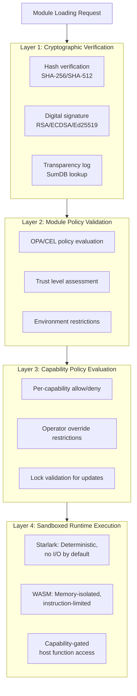
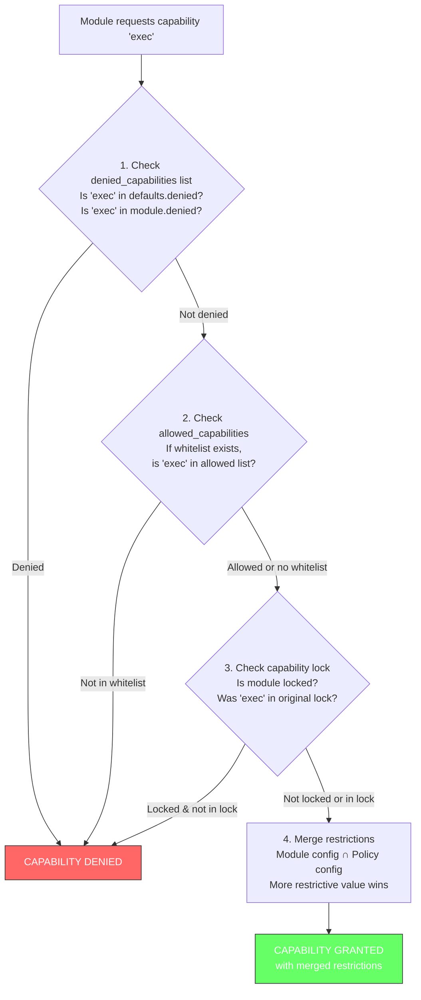

## Overview

Keystone Core's module system enables secure extensibility through versioned, dependency-managed packages. Modules can extend state management, event handling, verification steps, and policy enforcement without compromising system security.

**Security Philosophy:**
- **No Ambient Authority**: Modules cannot access any resource without explicit capability grants
- **Sandboxed Execution**: All module code runs in isolated runtime environments
- **Operator Override**: Operators can restrict capabilities beyond what modules declare
- **Immutable Locks**: Once locked, module capabilities cannot escalate across updates

## Security Model

The module security model implements defense in depth with multiple enforcement layers:



## Capability-Based Access Control

### What Are Capabilities?

Capabilities are explicit, scoped permissions that grant modules access to specific system resources. Unlike traditional permission systems, capabilities:

1. **Cannot be forged**: Modules receive capabilities from the host, not self-declared
2. **Are scoped**: Each capability has restrictions (paths, domains, commands, etc.)
3. **Are auditable**: All capability invocations are logged
4. **Are revocable**: Operators can deny capabilities at any time

### Available Capabilities

| Capability | Description | Scope Controls |
|------------|-------------|----------------|
| `fs.read` | Read files from filesystem | `allowed_paths`, `denied_paths`, `max_file_size` |
| `fs.write` | Write files to filesystem | `allowed_paths`, `denied_paths`, `max_file_size` |
| `http.get` | HTTP GET requests | `allowed_domains`, `denied_domains`, `rate_limit`, `timeout` |
| `http.post` | HTTP POST requests | `allowed_domains`, `max_request_size`, `rate_limit`, `timeout` |
| `exec` | Execute shell commands | `allowed_commands`, `denied_commands`, `exec_timeout` |
| `secrets.read` | Read secrets | `allowed_secret_paths`, `denied_secret_paths` |
| `secrets.write` | Write secrets | `allowed_secret_paths`, `denied_secret_paths` |
| `log` | Structured logging | `max_log_rate` |
| `time` | Access current time | (breaks determinism - rarely granted) |
| `kv` | Key-value storage | `namespace`, `max_key_size`, `max_value_size` |

### Module Manifest Declaration

Modules declare required capabilities in `module.yaml`:

```yaml
name: my-org/web-deployer
version: 1.2.0
type: starlark
entrypoint: states/main.star

# Simple list format
capabilities:
  - fs.read
  - http.get
  - log

# Or detailed format with restrictions
capabilities:
  fs.read:
    allowed_paths:
      - /app/**
      - /etc/nginx/**
    denied_paths:
      - /etc/shadow
      - /etc/passwd
    max_file_size: 10485760  # 10MB

  http.get:
    allowed_domains:
      - api.example.com
      - "*.internal.example.com"
    rate_limit: 100  # requests per minute
    timeout: 30s

  exec:
    allowed_commands:
      - /usr/bin/nginx
      - /usr/bin/systemctl
    denied_commands:
      - /bin/bash
      - /bin/sh
    exec_timeout: 60s

limits:
  timeout: 5m
  memory: 64MB
```

## Sandboxed Execution Environments

### Starlark Runtime

Starlark is a Python-like language designed for configuration. It is **deterministic by design**:

**Security Properties:**
- No file I/O, network access, or system calls by default
- No `import` statement (prevents arbitrary module loading)
- Execution terminates after configurable step limit
- Same inputs always produce same outputs

**Enforcement Mechanisms:**
- **Step Limit**: Execution aborts after N instructions (default: 1,000,000)
- **Timeout**: Hard wall-clock limit on execution time
- **No Ambient Authority**: Only capabilities explicitly registered are accessible

```python
# Example Starlark module - can only use granted capabilities
def check_nginx(ctx):
    # This only works if fs.read capability was granted for /etc/nginx
    config = fs_read("/etc/nginx/nginx.conf")

    # This only works if http.get capability was granted for api.example.com
    status = http_get("https://api.example.com/health")

    # This only works if exec capability was granted for nginx
    result = exec("nginx -t")

    return {
        "config_valid": result.exit_code == 0,
        "api_healthy": status.status_code == 200
    }
```

### WASM Runtime (WebAssembly)

WASM provides a memory-safe, sandboxed execution environment for high-performance modules:

**Security Properties:**
- **Memory Isolation**: WASM linear memory is completely isolated from host
- **No System Access**: WASM cannot make syscalls without host-provided imports
- **Fuel Metering**: Execution limited by instruction count (fuel)
- **Bounds Checking**: All memory access is bounds-checked

**Enforcement Mechanisms:**
- **Memory Limit**: Maximum linear memory allocation (default: 64MB)
- **Fuel Limit**: Maximum instruction count (default: 10,000,000)
- **Host Function Gating**: Only whitelisted functions are importable
- **WASI Sandboxing**: File system access requires explicit preopens (none by default)

```rust
// Example Rust WASM module - capabilities accessed via host functions
use kscore_sdk::{fs, http, exec, log};

#[no_mangle]
pub extern "C" fn module_main() -> i32 {
    // These calls go through capability-gated host functions
    let config = fs::read_string("/etc/nginx/nginx.conf").unwrap();
    let status = http::get("https://api.example.com/health").unwrap();
    let result = exec::run("nginx -t").unwrap();

    log::info(&format!("Nginx config valid: {}", result.exit_code == 0));

    0 // Success
}
```

## Capability Policy System

Operators can override module-declared capabilities using a capability policy file.

### Policy Structure

```yaml
# /etc/kscore/capability-policy.yaml
schema_version: 1

# Default policy applied to all modules
defaults:
  trust: none  # none | limited | full

  # Capabilities denied for all modules by default
  denied_capabilities:
    - exec
    - secrets.write

  # Fine-grained restrictions applied to all modules
  capabilities:
    fs.write:
      denied_paths:
        - /etc/**
        - /root/**
        - /usr/**
        - /bin/**
        - /sbin/**
        - /boot/**
        - /sys/**
        - /proc/**
        - /dev/**

    http.post:
      rate_limit: 100  # Default rate limit

# Per-module policy overrides
modules:
  # Trust internal modules completely
  internal/trusted-deployer:
    trust: full

  # Allow exec only for specific module
  ops/maintenance-toolkit:
    trust: limited
    allowed_capabilities:
      - exec
      - fs.read
      - fs.write
    capabilities:
      exec:
        allowed_commands:
          - /usr/bin/apt
          - /usr/bin/systemctl

  # Restrict third-party modules heavily
  community/external-reporter:
    trust: none
    denied_capabilities:
      - exec
      - fs.write
      - secrets.*  # Wildcard: denies secrets.read and secrets.write
    capabilities:
      http.get:
        allowed_domains:
          - api.reporting-service.com  # Only this domain allowed
        rate_limit: 10  # Heavily rate limited
```

### Trust Levels

| Level | Behavior |
|-------|----------|
| `none` | All default restrictions apply. Most restrictive. |
| `limited` | Default restrictions apply, but can be overridden per-module. |
| `full` | Module's declared capabilities trusted without additional restrictions. |

### Policy Evaluation Flow



### Restriction Merging

When both module manifest and operator policy specify restrictions, the **more restrictive** value is used:

| Restriction Type | Merge Strategy |
|------------------|----------------|
| `allowed_paths`, `allowed_domains`, `allowed_commands` | **Intersection** (must be in both lists) |
| `denied_paths`, `denied_domains`, `denied_commands` | **Union** (denied by either) |
| `max_file_size`, `max_response_size`, `rate_limit` | **Minimum** (smaller value wins) |
| `timeout`, `exec_timeout` | **Minimum** (shorter timeout wins) |

**Example:**
```yaml
# Module declares:
fs.read:
  allowed_paths: ["/app/**", "/etc/**"]
  max_file_size: 10485760  # 10MB

# Policy restricts:
fs.read:
  allowed_paths: ["/app/**", "/var/log/**"]
  max_file_size: 5242880  # 5MB

# Result:
fs.read:
  allowed_paths: ["/app/**"]  # Intersection
  max_file_size: 5242880      # Minimum
```

## Capability Locking

Capability locks prevent module updates from escalating permissions. This protects against supply chain attacks where a malicious update adds dangerous capabilities.

### Creating a Lock

```bash
# Lock a module's current capabilities
kscorectl module lock my-org/web-deployer

# Lock with reason (for audit trail)
kscorectl module lock my-org/web-deployer \
  --reason "Production deployment - capabilities frozen"

# View lock details
kscorectl module lock show my-org/web-deployer
```

**Lock File (stored in `/var/lib/kscore/capability-locks.json`):**
```json
{
  "my-org/web-deployer": {
    "module_name": "my-org/web-deployer",
    "version": "1.2.0",
    "capabilities": ["fs.read", "http.get", "log"],
    "capability_configs": {
      "fs.read": {
        "allowed_paths": ["/app/**", "/etc/nginx/**"]
      }
    },
    "locked_at": "2024-01-15T10:30:00Z",
    "locked_by": "admin@example.com",
    "reason": "Production deployment - capabilities frozen",
    "hash": "sha256:abc123..."
  }
}
```

### Lock Enforcement

When a locked module is updated:

1. **New capabilities blocked**: If the update adds capabilities not in the lock, loading fails
2. **Removed capabilities allowed**: Updates can remove capabilities (reducing attack surface)
3. **Restriction changes evaluated**: More restrictive changes allowed, less restrictive blocked

**Example:**
```
Locked capabilities: [fs.read, http.get, log]
Update capabilities: [fs.read, http.get, log, exec]  ← BLOCKED (exec is new)

Locked capabilities: [fs.read, http.get, log]
Update capabilities: [fs.read, log]  ← ALLOWED (http.get removed)
```

### Unlocking

```bash
# Unlock a module (requires admin role)
kscorectl module unlock my-org/web-deployer \
  --reason "Upgrading to v2.0 with new capabilities"

# The unlock is audited
```

## Security Guarantees

### What the Module System Guarantees

1. **Isolation**: Module code cannot access host memory, files, or network without capabilities
2. **Termination**: Modules cannot run indefinitely (timeout and step/fuel limits)
3. **Capability Scoping**: Capabilities are scoped to specific paths/domains/commands
4. **Operator Override**: Operators can always restrict capabilities further
5. **Auditability**: All capability grants and invocations are logged
6. **Immutable Locks**: Once locked, capability escalation is impossible without unlock

### What the Module System Does NOT Guarantee

1. **Correctness**: A module with `exec` capability can run malicious commands within its allowlist
2. **Resource Exhaustion**: A module can consume memory/CPU up to its limits
3. **Data Exfiltration**: A module with `http.post` can send data to allowed domains
4. **Side Effects**: A module with `fs.write` can corrupt files in allowed paths

**Mitigation**: Use the principle of least privilege. Grant only necessary capabilities with tight scoping.

## Attack Surface Analysis

### Supply Chain Attacks

**Threat**: Malicious module update adds dangerous capabilities.

**Mitigations**:
- Cryptographic verification (signatures, SumDB)
- Capability locking prevents escalation
- Operator policy can deny dangerous capabilities for all modules

### Privilege Escalation

**Threat**: Module exploits runtime vulnerability to escape sandbox.

**Mitigations**:
- Starlark has no native code execution
- WASM is memory-safe by design
- Host functions are the only interface to the system
- Each capability implementation validates inputs

### Denial of Service

**Threat**: Module consumes excessive resources.

**Mitigations**:
- Execution timeout (wall-clock)
- Step/fuel limits (instruction count)
- Memory limits (WASM linear memory)
- Rate limiting (HTTP, logging)

### Data Exfiltration

**Threat**: Module sends sensitive data to external servers.

**Mitigations**:
- `http.get`/`http.post` scoped to allowed domains
- `fs.read` scoped to allowed paths
- Network policies can further restrict egress

### Command Injection

**Threat**: Module executes arbitrary commands via `exec` capability.

**Mitigations**:
- `exec` denied by default in policy
- `allowed_commands` whitelist
- `denied_commands` blocklist
- Command string validation (no shell metacharacters)

## Audit and Compliance

### Capability Audit Log

All capability invocations are logged:

```json
{
  "timestamp": "2024-01-15T10:30:45Z",
  "event_type": "capability.invoke",
  "module": "my-org/web-deployer",
  "module_version": "1.2.0",
  "capability": "fs.read",
  "operation": "read_file",
  "parameters": {
    "path": "/etc/nginx/nginx.conf"
  },
  "result": "success",
  "duration_ms": 5,
  "correlation_id": "abc-123"
}
```

### Policy Evaluation Log

Policy decisions are logged:

```json
{
  "timestamp": "2024-01-15T10:30:00Z",
  "event_type": "capability.policy.evaluation",
  "module": "my-org/web-deployer",
  "capability": "exec",
  "decision": "denied",
  "reason": "capability \"exec\" is explicitly denied by policy",
  "policy_source": "defaults",
  "from_lock": false
}
```

### Compliance Reporting

```bash
# List all modules and their capabilities
kscorectl module list --show-capabilities

# Show capability policy compliance
kscorectl module policy audit

# Export capability grants for compliance review
kscorectl module capabilities export --format csv > capabilities-report.csv
```

## Best Practices

### For Module Authors

1. **Request minimal capabilities**: Only request what you need
2. **Scope tightly**: Use specific paths/domains, not wildcards
3. **Document capability usage**: Explain why each capability is needed
4. **Handle capability denial gracefully**: Check for capability availability

### For Operators

1. **Use capability policy**: Don't rely solely on module manifests
2. **Deny dangerous capabilities by default**: Especially `exec`
3. **Lock production modules**: Prevent capability escalation
4. **Review capability requests**: Audit new modules before deployment
5. **Monitor capability usage**: Alert on unexpected invocations

### Security Hardening Checklist

- [ ] Capability policy file deployed (`/etc/kscore/capability-policy.yaml`)
- [ ] Default policy denies `exec`, `secrets.write`
- [ ] All third-party modules have explicit policy entries
- [ ] Production modules are capability-locked
- [ ] Capability audit logging enabled
- [ ] Rate limits configured for HTTP capabilities
- [ ] File paths restricted to application directories
- [ ] Allowed domains whitelist for HTTP capabilities

## Configuration Reference

### Capability Policy File

**Location**: `/etc/kscore/capability-policy.yaml`

```yaml
schema_version: 1

defaults:
  trust: none | limited | full
  lock: false
  allowed_capabilities: []      # Whitelist (if set)
  denied_capabilities: []       # Blacklist (always applied)
  capabilities:                 # Per-capability restrictions
    <capability_name>:
      mode: allow | deny | restrict
      # Capability-specific fields...

modules:
  <module_name>:
    trust: none | limited | full
    lock: false
    allowed_capabilities: []
    denied_capabilities: []
    capabilities:
      <capability_name>:
        # Same as defaults.capabilities
```

### Capability Lock File

**Location**: `/var/lib/kscore/capability-locks.json`

```json
{
  "<module_name>": {
    "module_name": "string",
    "version": "string",
    "capabilities": ["string"],
    "capability_configs": {},
    "locked_at": "RFC3339 timestamp",
    "locked_by": "string",
    "reason": "string",
    "hash": "string"
  }
}
```

## See Also

- [Security Guide](/docs/operations/security/) - General security hardening
- [Policy Concepts](/docs/concepts/policy/) - OPA/CEL policy enforcement
- [State Management](/docs/concepts/state-management/) - State module development
- [CLI Reference](/docs/reference/cli/) - Module management commands
