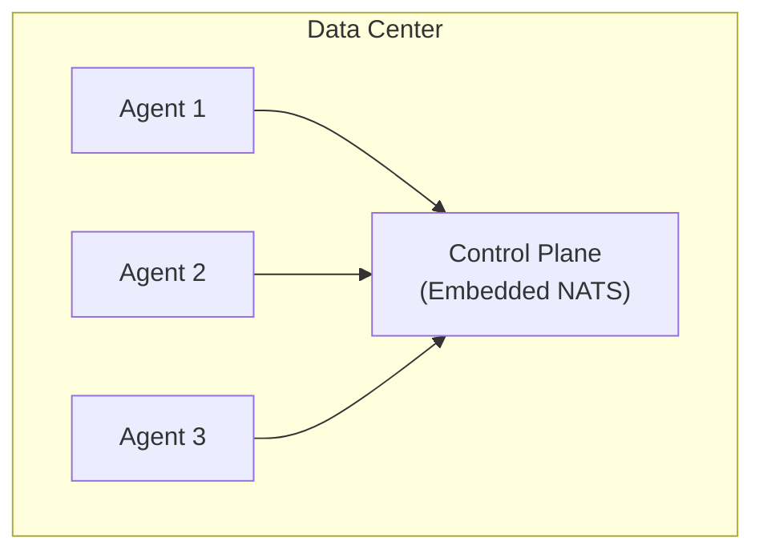
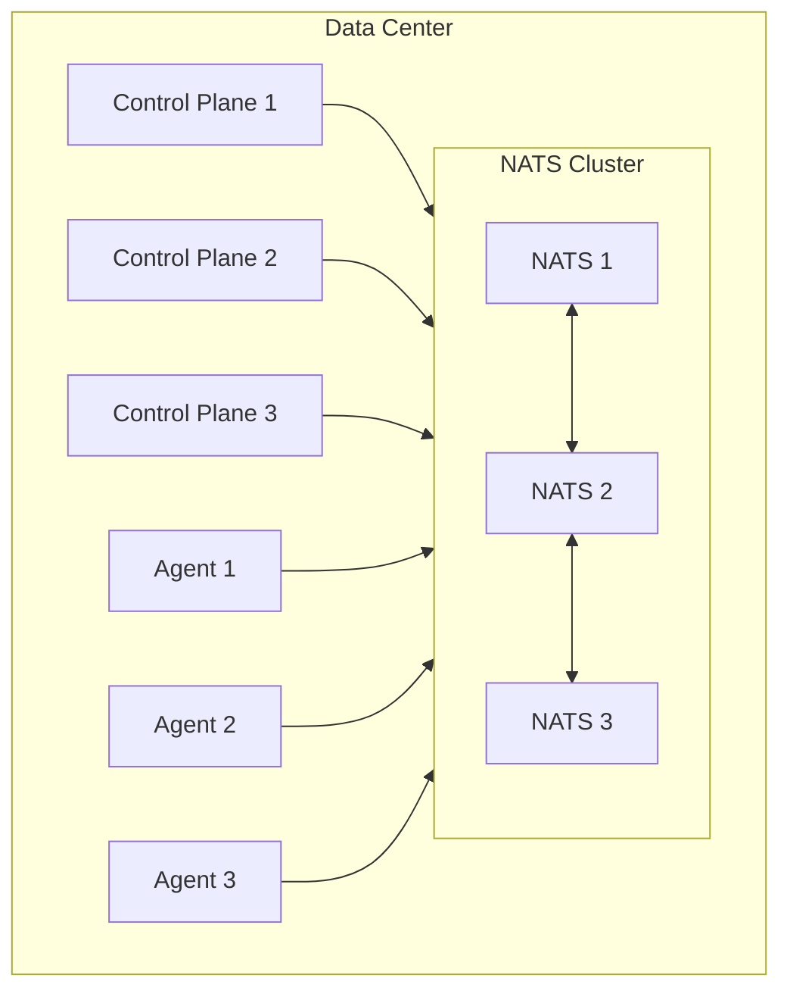
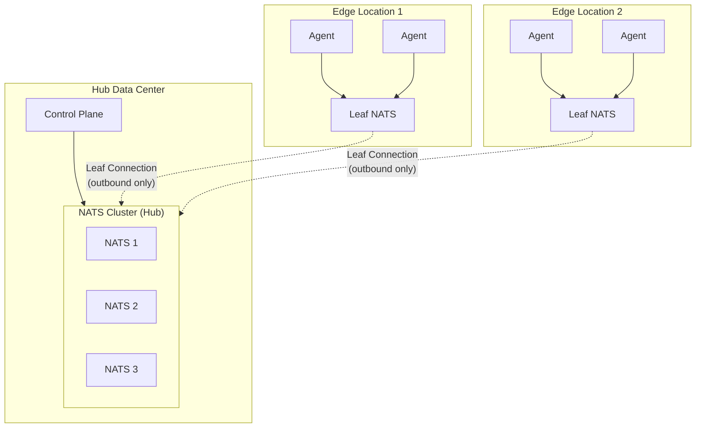
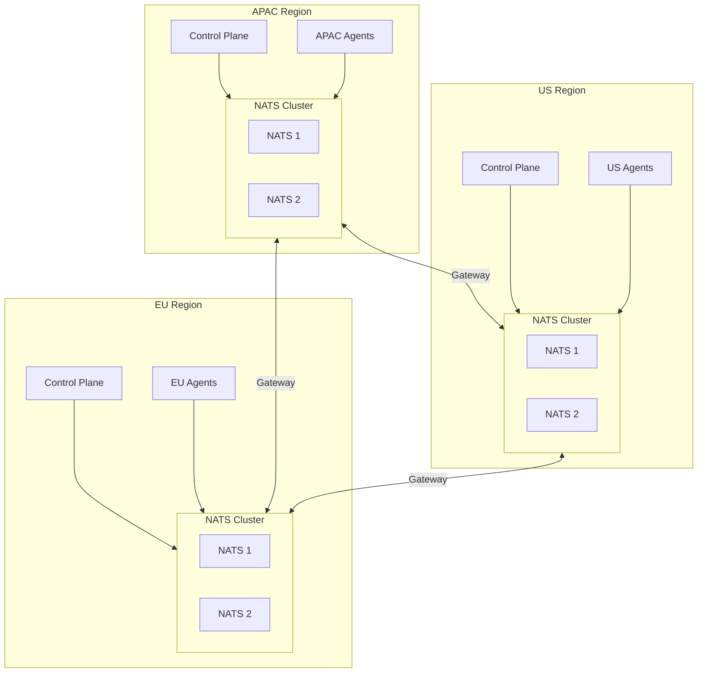
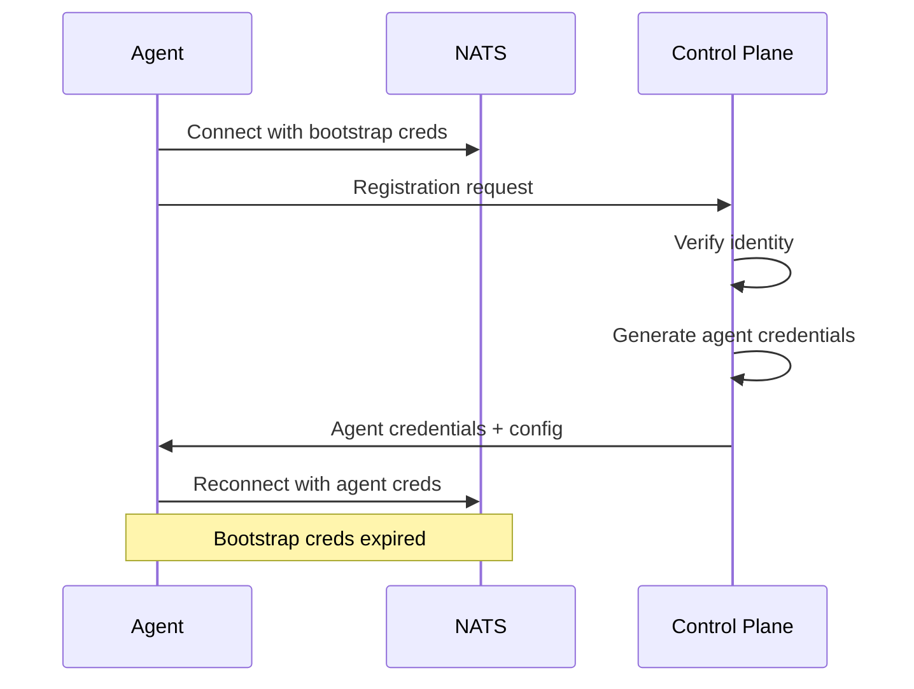

## Overview

Keystone Core's NATS Mesh provides a flexible communication layer that enables agents to connect to the control plane across any network topology. The mesh architecture supports:

- **Multi-endpoint failover** for high availability
- **Leaf nodes** for edge deployments behind NAT
- **Superclusters** for multi-region deployments
- **WebSocket transport** for firewall traversal
- **Auto-discovery** for zero-configuration deployments

## Subject Namespace

All NATS communication uses a structured subject namespace:

```
kscore.{cluster}.{category}.{entity}.{operation}
```

### Subject Categories

| Category | Description | Example |
|----------|-------------|---------|
| `agent` | Agent-related operations | `kscore.prod.agent.a1b2c3.heartbeat` |
| `server` | Server coordination | `kscore.prod.server.leader.election` |
| `bootstrap` | Agent registration | `kscore.prod.bootstrap.register` |
| `discovery` | Service discovery | `kscore.prod.discovery.agents` |
| `command` | Command execution | `kscore.prod.command.execute` |
| `state` | State management | `kscore.prod.state.apply` |
| `event` | Event streaming | `kscore.prod.event.>` |

### Subject Permissions

```yaml
# Bootstrap credentials (minimal permissions)
bootstrap:
  publish:
    - kscore.*.bootstrap.register
  subscribe:
    - kscore.*.bootstrap.response.>

# Agent credentials (after registration)
agent:
  publish:
    - kscore.*.agent.{agent_id}.>
  subscribe:
    - kscore.*.command.{agent_id}.>
    - kscore.*.state.{agent_id}.>

# Server credentials (full access)
server:
  publish:
    - kscore.>
  subscribe:
    - kscore.>
```

## Connection Strategies

Keystone Core supports multiple connection strategies for different network environments:

### Direct TCP

Standard NATS connection over TCP. Use when:

- Agents have direct network access to NATS
- No NAT or firewalls between agent and server
- Lowest latency required

```yaml
agent:
  nats:
    urls:
      - nats://nats.example.com:4222
```

### TLS Encrypted

Encrypted connections with certificate verification. Use when:

- Traffic traverses untrusted networks
- Compliance requires encryption in transit
- mTLS authentication needed

```yaml
agent:
  nats:
    urls:
      - tls://nats.example.com:4222
    tls:
      cert: /etc/keystone-core/agent.crt
      key: /etc/keystone-core/agent.key
      ca: /etc/keystone-core/ca.crt
```

### WebSocket

NATS over WebSocket for HTTP-friendly environments. Use when:

- Firewalls only allow HTTP/HTTPS traffic
- Behind corporate proxies
- Browser-based agents

```yaml
agent:
  nats:
    urls:
      - wss://nats.example.com:443/nats
    websocket:
      compression: true
      proxy:
        url: http://proxy.corp.com:8080
```

### Leaf Node

Embedded NATS connecting as a leaf to the hub. Use when:

- Agents behind NAT (outbound-only connections)
- Edge locations with unreliable connectivity
- Local message buffering needed

```yaml
agent:
  nats:
    mode: leaf
    hub:
      urls:
        - nats-leaf://hub.example.com:7422
    embedded:
      listen: 127.0.0.1:4222
```

## Topology Diagrams

### Simple Deployment



### Production HA Cluster



### Edge Deployment (Leaf Nodes)



### Multi-Region (Supercluster)



## Multi-Endpoint Support

Agents can configure multiple NATS endpoints for high availability:

```yaml
agent:
  nats:
    endpoints:
      - url: nats://nats-1.example.com:4222
        priority: 1
        strategy: direct
      - url: nats://nats-2.example.com:4222
        priority: 2
        strategy: direct
      - url: wss://nats-ws.example.com:443/nats
        priority: 3
        strategy: websocket
```

### Failover Behavior

1. Agent connects to highest priority (lowest number) endpoint
2. On connection failure, circuit breaker opens
3. Agent fails over to next priority endpoint
4. Background health checks monitor all endpoints
5. When primary recovers, agent fails back (if configured)

### Health-Based Routing

```yaml
agent:
  nats:
    routing:
      strategy: least_latency  # priority, round_robin, weighted, random
      health_check_interval: 10s
      failback: true
      failback_delay: 30s
```

## Leaf Node Architecture

Leaf nodes enable edge deployments where agents cannot receive inbound connections:

### How It Works

1. **Edge agent starts embedded NATS** in leaf mode
2. **Leaf initiates outbound connection** to hub cluster
3. **Hub accepts leaf connection** on dedicated port (7422)
4. **Messages route transparently** between leaf and hub
5. **Local buffering** during connectivity loss

### Leaf Configuration

```yaml
# Edge agent configuration
agent:
  nats:
    mode: leaf
    hub:
      urls:
        - nats-leaf://hub.example.com:7422
      credentials: /etc/keystone-core/leaf.creds
    embedded:
      store_dir: /var/lib/keystone-core/nats
    buffer:
      enabled: true
      max_size: 100MB
      max_messages: 100000
      persistence: true
```

### Hub Configuration

```yaml
# Control plane hub configuration
server:
  nats:
    mode: external
    urls:
      - nats://nats-cluster:4222
    leaf:
      listen: 0.0.0.0:7422
      tls:
        cert: /etc/keystone-core/leaf-server.crt
        key: /etc/keystone-core/leaf-server.key
        ca: /etc/keystone-core/ca.crt
```

### Buffering During Disconnection

When a leaf node loses connectivity to the hub:

1. Messages queue in local buffer (memory or disk)
2. Buffer respects size and message count limits
3. Oldest messages evicted when limits reached
4. On reconnection, buffer flushes to hub
5. Deduplication prevents duplicate processing

## Supercluster (Gateway) Architecture

Superclusters connect multiple NATS clusters across regions:

### Gateway Configuration

```yaml
server:
  nats:
    cluster: us-west
    gateway:
      name: us-west
      listen: 0.0.0.0:7222
      remotes:
        - name: us-east
          urls:
            - nats://gateway.us-east.example.com:7222
        - name: eu-west
          urls:
            - nats://gateway.eu-west.example.com:7222
```

### Cross-Cluster Routing

Messages route to the appropriate cluster based on subject:

```yaml
server:
  nats:
    routing:
      prefer_local: true  # Route to local agents first
      cross_cluster_timeout: 5s  # Extended timeout for remote clusters
      subject_mapping:
        # Route specific subjects to specific clusters
        "kscore.eu.>": eu-west
        "kscore.apac.>": apac
```

### Failover Between Clusters

When a cluster becomes unavailable:

1. Gateway connection fails health checks
2. Traffic reroutes to remaining clusters
3. Agents in failed cluster buffer messages locally
4. On recovery, gateway reconnects and resumes routing

## WebSocket Transport

WebSocket support enables NATS communication through HTTP-only networks:

### Client Configuration

```yaml
agent:
  nats:
    urls:
      - wss://nats.example.com:443/nats
    websocket:
      compression: true
      handshake_timeout: 10s
      headers:
        X-Custom-Header: value
```

### Server Configuration

```yaml
server:
  nats:
    websocket:
      listen: 0.0.0.0:443
      path: /nats
      tls:
        cert: /etc/keystone-core/server.crt
        key: /etc/keystone-core/server.key
      compression: true
      cors:
        allowed_origins:
          - https://console.example.com
```

### Proxy Support

WebSocket connections can traverse HTTP proxies, including corporate proxies requiring authentication:

```yaml
agent:
  nats:
    websocket:
      proxy:
        url: http://proxy.corp.com:8080
        auth:
          type: basic  # none, basic, digest, ntlm
          username: user
          password: pass
        no_proxy:
          - "*.internal.com"
          - "10.0.0.0/8"
```

**Proxy Authentication Types**:

| Type | Description | Use Case |
|------|-------------|----------|
| `none` | No authentication | Open proxies |
| `basic` | HTTP Basic Auth | Simple username/password |
| `digest` | HTTP Digest Auth | Slightly more secure than basic |
| `ntlm` | NTLM authentication | Corporate Windows environments |

**NTLM Authentication** is commonly required in enterprise Windows environments. It uses a challenge-response mechanism:

```yaml
agent:
  nats:
    websocket:
      proxy:
        url: http://proxy.corp.com:8080
        auth:
          type: ntlm
          username: DOMAIN\user  # or user@domain.com
          password: secret
```

NTLM supports both `DOMAIN\user` and `user@domain.com` formats. The domain is extracted automatically from the username.

## Discovery & Auto-Configuration

Keystone Core can automatically discover NATS endpoints:

### DNS-Based Discovery

```yaml
agent:
  nats:
    discovery:
      dns:
        service: _nats._tcp.example.com
        refresh_interval: 60s
```

Looks up SRV records for endpoint discovery:

```
_nats._tcp.example.com. 300 IN SRV 10 50 4222 nats-1.example.com.
_nats._tcp.example.com. 300 IN SRV 10 50 4222 nats-2.example.com.
_nats._tcp.example.com. 300 IN SRV 20 50 4222 nats-3.example.com.
```

### Kubernetes Discovery

```yaml
agent:
  nats:
    discovery:
      kubernetes:
        service: nats
        namespace: nats-system
        port_name: client
```

### Consul Discovery

```yaml
agent:
  nats:
    discovery:
      consul:
        address: consul.example.com:8500
        service: nats
        tags:
          - production
```

### Auto-Configuration

Keystone Core can detect the network environment and select the optimal strategy:

```yaml
agent:
  nats:
    auto_configure: true
    discovery:
      - dns
      - kubernetes
      - consul
```

The auto-configurator:

1. Detects network type (direct, NAT, symmetric NAT, firewall)
2. Tests connectivity to discovered endpoints
3. Selects optimal connection strategy
4. Configures failover endpoints

## Reliability Features

### Circuit Breaker

Prevents cascade failures when endpoints are unhealthy:

```yaml
agent:
  nats:
    circuit_breaker:
      failure_threshold: 5       # Failures before opening
      success_threshold: 3       # Successes to close
      timeout: 30s               # Time in open state
      half_open_requests: 1      # Requests allowed in half-open
```

States:

- **Closed**: Normal operation, requests flow through
- **Open**: All requests fail immediately
- **Half-Open**: Limited requests allowed to test recovery

### Delivery Guarantees

```yaml
agent:
  nats:
    delivery:
      mode: at_least_once  # at_most_once, at_least_once, exactly_once
      timeout: 30s
      max_retries: 3
      backoff:
        initial: 100ms
        multiplier: 2
        max: 10s
```

| Mode | Guarantee | Use Case |
|------|-----------|----------|
| `at_most_once` | Fire and forget | Metrics, non-critical events |
| `at_least_once` | Retry until ack | Commands, state changes |
| `exactly_once` | JetStream dedup | Financial transactions |

### Graceful Degradation

When connectivity is limited, operations are prioritized:

```yaml
agent:
  nats:
    degradation:
      enabled: true
      modes:
        normal:
          allow: [critical, high, normal, low, background]
        degraded:
          allow: [critical, high, normal]
          rate_limit: 100/s
        limited:
          allow: [critical, high]
          rate_limit: 10/s
        offline:
          allow: [critical]
          buffer: true
```

## Security Model

### Bootstrap Registration

New agents use time-limited bootstrap credentials:



### Credential Types

| Type | TTL | Use Case |
|------|-----|----------|
| Bootstrap | 5 min | Initial registration |
| Agent | 24 hours | Normal operations |
| Server | 24 hours | Control plane |

### TLS Configuration

```yaml
server:
  nats:
    tls:
      cert: /etc/keystone-core/server.crt
      key: /etc/keystone-core/server.key
      ca: /etc/keystone-core/ca.crt
      verify: true              # Require client certificates
      cipher_suites:
        - TLS_ECDHE_RSA_WITH_AES_256_GCM_SHA384
        - TLS_ECDHE_RSA_WITH_AES_128_GCM_SHA256
      min_version: "1.3"
```

## Metrics

The NATS mesh exposes comprehensive Prometheus metrics:

### Connection Metrics

| Metric | Type | Description |
|--------|------|-------------|
| `kscore_nats_connections_total` | Counter | Total connection attempts |
| `kscore_nats_connection_errors_total` | Counter | Connection failures |
| `kscore_nats_reconnections_total` | Counter | Reconnection count |
| `kscore_nats_connection_latency_seconds` | Histogram | Connection latency |

### Message Metrics

| Metric | Type | Description |
|--------|------|-------------|
| `kscore_nats_messages_total` | Counter | Messages sent/received |
| `kscore_nats_message_bytes_total` | Counter | Message bytes |
| `kscore_nats_delivery_acked_total` | Counter | Acknowledged deliveries |
| `kscore_nats_delivery_failed_total` | Counter | Failed deliveries |

### Topology Metrics

| Metric | Type | Description |
|--------|------|-------------|
| `kscore_nats_leaf_nodes_total` | Gauge | Connected leaf nodes |
| `kscore_nats_gateway_connections_total` | Gauge | Gateway connections |
| `kscore_nats_gateway_latency_seconds` | Histogram | Cross-cluster latency |

## Troubleshooting

### Connection Issues

```bash
# Check NATS connectivity using nats CLI
nats server ping nats://nats.example.com:4222

# Check agent status (includes NATS connection info)
kscorectl agents show <agent-id>

# Test TCP connectivity
nc -zv nats.example.com 4222

# Check agent logs for connection issues
journalctl -u kscore-agent | grep -i "nats\|connect"
```

### Debugging

```bash
# Enable debug logging
sudo systemctl stop kscore-agent
KSCORE_LOG_LEVEL=debug kscore-agent &

# Monitor NATS subjects
nats sub "kscore.>" --count 10

# View NATS server connections and stats
nats server report connections
nats server report jetstream
```

### Common Issues

| Symptom | Cause | Solution |
|---------|-------|----------|
| Connection timeout | Firewall blocking port | Use WebSocket transport |
| Frequent reconnects | Network instability | Increase timeouts, enable buffering |
| High latency | Wrong region | Configure geo-routing |
| Auth failures | Expired credentials | Check credential TTL |

## See Also

- [Message Bus]() - Basic NATS architecture
- [Agents]() - Agent configuration
- [Control Plane]() - Server configuration
- [Observability]() - Monitoring setup
