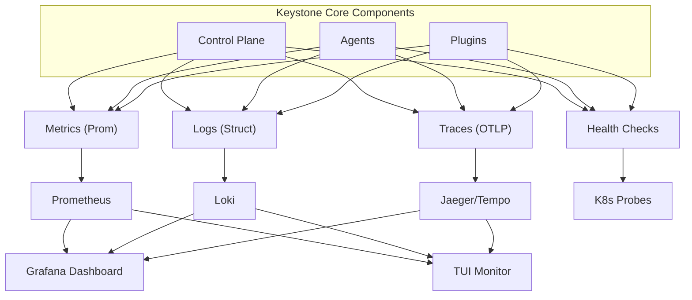

## Overview

Keystone Core provides comprehensive observability through metrics, logging, and tracing. Monitor system health, track performance, debug issues, and gain insights into your infrastructure operations.

**Three Pillars**:
- **Metrics**: Prometheus-compatible metrics for quantitative measurement
- **Logging**: Structured logs with correlation IDs for debugging
- **Tracing**: Distributed tracing with OpenTelemetry for request flow

**Additional Tools**:
- **Grafana Dashboards**: Pre-built dashboards for visualization
- **TUI Monitor**: Terminal-based real-time monitoring
- **Health Checks**: Kubernetes-compatible health endpoints
- **Performance Profiling**: pprof endpoints for profiling

## Architecture



## Metrics

Keystone Core exposes 70+ Prometheus-compatible metrics:

### Control Plane Metrics

**API Metrics**:
```
# HTTP requests
kscore_api_requests_total{method,path,status}
kscore_api_request_duration_seconds{method,path,quantile}

# Active connections
kscore_api_active_connections
```

**Agent Metrics**:
```
# Agent status
kscore_agents_connected_total{datacenter,environment,role}
kscore_agents_disconnected_total{reason}

# Heartbeats
kscore_agent_heartbeat_received_total
kscore_agent_heartbeat_missed_total
```

**Command Execution**:
```
# Commands
kscore_commands_executed_total{status,datacenter}
kscore_command_duration_seconds{quantile}

# Batch jobs
kscore_batch_jobs_total{status}
kscore_batch_size{quantile}
```

**State Management**:
```
# State applications
kscore_state_applications_total{status}
kscore_state_application_duration_seconds{quantile}

# Resources
kscore_state_resources_total{module}
kscore_state_changes_total{module}

# Drift
kscore_state_drift_detected_total{severity}
```

**Event System**:
```
# Events
kscore_events_published_total{type}
kscore_events_processed_total{type}
kscore_events_failed_total{type}

# Event processing
kscore_event_processing_duration_seconds{quantile}
kscore_event_lag_seconds
```

**Policy Enforcement**:
```
# Evaluations
kscore_policy_evaluations_total{policy,result}
kscore_policy_evaluation_duration_seconds{policy,quantile}

# Violations
kscore_policy_violations_total{policy,severity}
kscore_policy_compliance_score{policy_set,environment}

# Remediations
kscore_policy_remediations_total{policy,status}
```

**GitOps Integration**:
```
# Webhooks
kscore_gitops_webhooks_received_total{source}

# Verifications
kscore_gitops_verifications_total{status}
kscore_gitops_verification_duration_seconds{quantile}

# Rollbacks
kscore_gitops_rollbacks_total{type,status}
```

### Agent Metrics

**Resource Usage**:
```
# CPU
kscore_agent_cpu_usage_percent{agent_id}

# Memory
kscore_agent_memory_usage_bytes{agent_id}
kscore_agent_memory_total_bytes{agent_id}

# Disk
kscore_agent_disk_usage_bytes{agent_id,mount}
kscore_agent_disk_total_bytes{agent_id,mount}
```

**Operations**:
```
# Commands executed
kscore_agent_commands_executed_total{agent_id,status}

# States applied
kscore_agent_states_applied_total{agent_id,status}

# Events emitted
kscore_agent_events_emitted_total{agent_id,type}
```

**Connection**:
```
# Heartbeat
kscore_agent_heartbeat_sent_total{agent_id}

# Reconnections
kscore_agent_reconnections_total{agent_id}

# Connection status
kscore_agent_connected{agent_id,status}
```

### Metrics Endpoint

```bash
# Scrape metrics
curl http://control-plane:8080/metrics

# Example output
# HELP kscore_agents_connected_total Total connected agents
# TYPE kscore_agents_connected_total gauge
kscore_agents_connected_total{datacenter="us-east-1",environment="production",role="web"} 50
kscore_agents_connected_total{datacenter="us-west-2",environment="staging",role="db"} 10

# HELP kscore_api_request_duration_seconds API request duration
# TYPE kscore_api_request_duration_seconds summary
kscore_api_request_duration_seconds{method="POST",path="/api/v1/exec",quantile="0.5"} 0.025
kscore_api_request_duration_seconds{method="POST",path="/api/v1/exec",quantile="0.95"} 0.150
kscore_api_request_duration_seconds{method="POST",path="/api/v1/exec",quantile="0.99"} 0.500
```

### Prometheus Configuration

```yaml
# prometheus.yml
global:
  scrape_interval: 15s
  evaluation_interval: 15s

scrape_configs:
  - job_name: 'kscore-control-plane'
    static_configs:
      - targets: ['control-plane-1:8080', 'control-plane-2:8080']

  - job_name: 'kscore-agents'
    # Auto-discover agents
    consul_sd_configs:
      - server: 'consul:8500'
        services: ['kscore-agent']
```

## Logging

Keystone Core uses structured logging with correlation IDs:

### Log Levels

- **Debug**: Detailed debugging information
- **Info**: General informational messages
- **Warn**: Warning messages (non-critical issues)
- **Error**: Error messages (requires attention)

### Log Formats

**JSON** (default, machine-readable):
```json
{
  "timestamp": "2024-01-15T10:30:45.123Z",
  "level": "info",
  "logger": "command-dispatcher",
  "message": "Command executed successfully",
  "correlation_id": "job-abc123",
  "fields": {
    "job_id": "abc123",
    "agent_id": "web-01",
    "command": "systemctl restart nginx",
    "duration_ms": 1234,
    "exit_code": 0
  }
}
```

**Logfmt** (key=value format):
```
timestamp=2024-01-15T10:30:45.123Z level=info logger=command-dispatcher message="Command executed successfully" correlation_id=job-abc123 job_id=abc123 agent_id=web-01 command="systemctl restart nginx" duration_ms=1234 exit_code=0
```

**Text** (human-readable, colored):
```
2024-01-15 10:30:45.123 [INFO] command-dispatcher: Command executed successfully
  correlation_id: job-abc123
  job_id: abc123
  agent_id: web-01
  command: systemctl restart nginx
  duration_ms: 1234
  exit_code: 0
```

### Correlation IDs

Track requests across components:

```json
{
  "correlation_id": "job-abc123",
  "message": "Command started"
}

{
  "correlation_id": "job-abc123",
  "message": "Command dispatched to agent"
}

{
  "correlation_id": "job-abc123",
  "message": "Command executed successfully"
}
```

**Query logs by correlation ID**:
```bash
kscorectl logs --correlation-id job-abc123
```

### Log Configuration

```yaml
logging:
  level: info              # debug, info, warn, error
  format: json             # json, logfmt, text
  output: stdout           # stdout, file
  file: /var/log/kscore/server.log
  max_size: 100MB
  max_backups: 3
  max_age: 30              # days
  compress: true
```

### NATS Log Transport

Send logs to a centralized collector via NATS:

```yaml
logging:
  nats:
    enabled: true
    url: "nats://localhost:4222"
    subject: "kscore.logs"
    subject_per_level: true    # Use kscore.logs.{level}
    subject_per_service: false # Use kscore.logs.{service}
    buffer_size: 10000         # Async buffer size
    flush_interval: 1s         # Flush interval

    # Authentication
    token: ""
    user: ""
    password: ""
    nkey_file: ""
    cred_file: ""
```

**Message Format** (JSON):
```json
{
  "timestamp": "2024-01-15T10:30:45.123Z",
  "level": "info",
  "logger": "command-dispatcher",
  "message": "Command executed successfully",
  "correlation_id": "job-abc123",
  "service": "kscore-server",
  "caller": "dispatcher.go:123",
  "fields": {
    "job_id": "abc123",
    "agent_id": "web-01"
  }
}
```

**Subject Routing**:
- Default: `kscore.logs`
- Per-level: `kscore.logs.info`, `kscore.logs.error`
- Per-service: `kscore.logs.kscore-server`

**Subscribe to logs**:
```bash
# All logs
nats sub "kscore.logs.>"

# Error logs only
nats sub "kscore.logs.error"

# Logs from specific service
nats sub "kscore.logs.kscore-server"
```

### Stdout-First Logging

Keystone Core defaults to stdout logging for container/systemd integration:

```yaml
logging:
  output: stdout     # stdout (default), stderr, file
  format: json       # json (default), logfmt, text
  level: info        # debug, info, warn, error

  # Include caller info
  caller: true       # Include file:line in logs

  # Environment variables override config
  # KSCORE_LOG_LEVEL, KSCORE_LOG_FORMAT, KSCORE_LOG_OUTPUT
```

**Container Integration** (Docker/Kubernetes):
```bash
# View logs via container runtime
docker logs kscore-server
kubectl logs deployment/kscore-server

# Structured logs work with:
# - Docker json-file driver
# - Kubernetes logging agents (Fluentd, Fluent Bit)
# - CloudWatch Container Insights
# - Google Cloud Logging
```

**systemd/journald Integration**:
```bash
# View logs via journalctl
journalctl -u kscore-server -f

# Filter by level (in JSON format)
journalctl -u kscore-server -o json | jq 'select(.level == "error")'
```

### Syslog Integration

Send logs to syslog for traditional infrastructure:

```yaml
logging:
  syslog:
    enabled: true
    transport: unix    # unix, udp, tcp, tcp+tls
    address: "/dev/log"  # or host:port for network
    facility: local0

    # RFC 5424 (modern, default)
    format: rfc5424
    app_name: kscore-server

    # RFC 3164 (BSD syslog)
    # format: bsd

    # TLS for tcp+tls transport
    tls:
      cert_file: /etc/kscore/certs/client.crt
      key_file: /etc/kscore/certs/client.key
      ca_file: /etc/kscore/certs/ca.crt
```

**RFC 5424 Format**:
```
<134>1 2024-01-15T10:30:45.123Z hostname kscore-server 1234 - [kscore@49152 level="info" correlation_id="abc123"] Command executed
```

**BSD Format** (RFC 3164):
```
<134>Jan 15 10:30:45 hostname kscore-server[1234]: Command executed
```

**rsyslog Configuration**:
```
# /etc/rsyslog.d/kscore.conf
local0.* /var/log/kscore.log
```

### Loki Integration

Send logs to Grafana Loki:

```yaml
logging:
  loki:
    enabled: true
    url: "http://loki:3100/loki/api/v1/push"
    labels:
      service: kscore-server
      environment: production
```

### Querying Logs

**LogQL** (Loki query language):
```
# All logs from control plane
{service="kscore-server"}

# Error logs from command dispatcher
{service="kscore-server",logger="command-dispatcher"} |= "level=error"

# Logs for specific job
{service="kscore-server"} |= "correlation_id=job-abc123"

# Failed commands in last hour
{service="kscore-server",logger="command-dispatcher"} |= "exit_code!=0" | json
```

## Tracing

Distributed tracing with OpenTelemetry:

### Trace Context

Every request gets a trace context:

```
TraceID: 1234567890abcdef
SpanID: abc123def456
ParentSpanID: def456abc123
```

### Span Hierarchy

```
Trace: Execute Command (trace_id: 1234567890abcdef)
├─ Span: Dispatch Command (span_id: abc123)
│  ├─ Span: Resolve Targets (span_id: def456)
│  │  └─ Span: Query Agents (span_id: ghi789)
│  └─ Span: Publish to NATS (span_id: jkl012)
├─ Span: Agent Execute (span_id: mno345)
│  ├─ Span: Validate Command (span_id: pqr678)
│  └─ Span: Run Shell Command (span_id: stu901)
└─ Span: Collect Results (span_id: vwx234)
```

### Span Attributes

```json
{
  "span_name": "Execute Command",
  "span_id": "abc123",
  "trace_id": "1234567890abcdef",
  "parent_span_id": null,
  "start_time": "2024-01-15T10:30:45.000Z",
  "end_time": "2024-01-15T10:30:46.234Z",
  "duration_ms": 1234,
  "attributes": {
    "command": "systemctl restart nginx",
    "agent_id": "web-01",
    "datacenter": "us-east-1",
    "exit_code": 0
  }
}
```

### OpenTelemetry Configuration

```yaml
tracing:
  enabled: true
  exporter: otlp           # otlp, jaeger, zipkin
  endpoint: "http://jaeger:4318"

  # Sampling
  sampling:
    strategy: ratio        # always, never, ratio
    ratio: 0.1             # Sample 10% of traces

  # Resource attributes
  resource:
    service.name: kscore-server
    service.version: 1.0.0
    deployment.environment: production
```

### Jaeger UI

View traces in Jaeger:

```bash
# Open Jaeger UI
http://jaeger-ui:16686

# Search for traces
Service: kscore-server
Operation: Execute Command
Tags: agent_id=web-01
Min Duration: 1s
Max Duration: 10s
```

### Programmatic Querying

Keystone Core provides Go clients for querying Loki and Jaeger programmatically:

**Loki Client**:
```go
import "github.com/shawnbutts/keystone-core/pkg/query"

// Simple client
client := query.NewLokiQuerier("http://loki:3100")

// With full configuration
client := query.NewLokiQuerierWithConfig(&query.LokiConfig{
    Address:  "http://loki:3100",
    Username: "admin",          // Optional: basic auth
    Password: "secret",
    TenantID: "my-org",         // Optional: multi-tenant
    Timeout:  30 * time.Second,
})

// Query logs
result, err := client.Query(ctx, &query.LogsQuery{
    Query: `{service="kscore-server"} |= "error"`,
    Range: query.TimeRange{
        Start: time.Now().Add(-1 * time.Hour),
        End:   time.Now(),
    },
    Limit:     100,
    Direction: "backward",  // Most recent first
})

// Get available labels
labels, err := client.Labels(ctx, start, end)

// Get values for a label
values, err := client.LabelValues(ctx, "service", start, end)
```

**Jaeger Client**:
```go
import "github.com/shawnbutts/keystone-core/pkg/query"

// Simple client
client := query.NewJaegerQuerier("http://jaeger-query:16686")

// With full configuration
client := query.NewJaegerQuerierWithConfig(&query.JaegerConfig{
    Address:  "http://jaeger-query:16686",
    Username: "admin",          // Optional: basic auth
    Password: "secret",
    Timeout:  30 * time.Second,
})

// Query traces
result, err := client.Query(ctx, &query.TracesQuery{
    Service:   "kscore-server",
    Operation: "Execute Command",
    Tags: map[string]string{
        "agent_id": "web-01",
    },
    Range: &query.TimeRange{
        Start: time.Now().Add(-1 * time.Hour),
        End:   time.Now(),
    },
    MinDuration: 100 * time.Millisecond,
    Limit:       20,
})

// Get a specific trace
trace, err := client.GetTrace(ctx, "abc123def456")

// Get available services
services, err := client.GetServices(ctx)

// Get operations for a service
operations, err := client.GetOperations(ctx, "kscore-server")
```

**Query Results**:

```go
// Loki results
for _, entry := range result.Entries {
    fmt.Printf("[%s] %s\n", entry.Timestamp, entry.Line)
    for k, v := range entry.Labels {
        fmt.Printf("  %s=%s\n", k, v)
    }
}

// Jaeger results
for _, trace := range result.Traces {
    fmt.Printf("Trace: %s (%d spans)\n", trace.TraceID, len(trace.Spans))
    for _, span := range trace.Spans {
        fmt.Printf("  %s: %s (%v)\n", span.SpanID, span.OperationName, span.Duration)
    }
}
```

## Grafana Dashboards

Keystone Core provides 6 pre-built Grafana dashboards:

### 1. Keystone Core Overview

**System-wide metrics**:
- Total agents (connected, offline, degraded)
- Command execution rate
- State application rate
- Policy violations
- Event rate
- Recent events timeline

**Variables**:
- Environment (production, staging, dev)
- Datacenter (us-east-1, us-west-2, etc.)

### 2. Control Plane Health

**Metrics**:
- Control plane status and uptime
- CPU and memory usage
- API request rate and latency (p95, p99)
- NATS message throughput
- Database query latency
- Error rates by component

**Alerts**:
- High CPU usage (>80%)
- High memory usage (>90%)
- High API latency (p95 >1s)
- High error rate (>5%)

### 3. Agent Fleet

**Metrics**:
- Fleet health status (healthy, degraded, offline)
- Agent distribution by datacenter and role
- Command execution success rate per agent
- Agent resource utilization (CPU, memory, disk)
- Agent version distribution

**Variables**:
- Datacenter
- Role
- Agent ID

### 4. State Management

**Metrics**:
- State applications (success, failure)
- Drift detection events by severity
- State changes by module
- Application duration percentiles
- Resources under management

**Variables**:
- Environment
- Module (file, package, service, etc.)

### 5. Policy Compliance

**Metrics**:
- Overall compliance score (gauge)
- Violations by severity (critical, high, medium, low)
- Remediation success rate
- Top violated policies
- Compliance trends (7-day average)

**Variables**:
- Policy framework (OPA, CEL)
- Environment

### 6. GitOps Operations

**Metrics**:
- Deployment verification metrics
- Verification success rate
- Rollback frequency and reasons
- Deployment duration percentiles
- Failed verifications by application

**Variables**:
- Application
- Environment

### Dashboard Access

```bash
# Import dashboards
http://grafana:3000

# Dashboards location
Dashboards → Keystone Core → [Dashboard Name]
```

## TUI Monitor

Terminal-based real-time monitoring (`kscore-monitor`):

### Views

**1. Dashboard** (default view):
- System overview
- Agent counts
- Recent events
- Job statistics

**2. Agents**:
- Interactive table with agents
- Status, metadata, heartbeat
- Filter by datacenter/environment/role

**3. Events**:
- Real-time event stream
- Filter by type, severity
- Search events
- Pause/resume stream

**4. State Drift**:
- Configuration drift monitoring
- Drift by severity
- Affected resources

**5. Policy Violations**:
- Policy compliance tracking
- Violations by policy
- Remediation status

**6. Jobs**:
- Command execution history
- Job status
- Output logs

**7. Logs**:
- Real-time log streaming via NATS
- Color-coded by level (debug, info, warn, error)
- Pause/resume with `p` or `space`
- Clear logs with `c`
- Live/Paused status indicator

**8. Metrics**:
- Real-time metrics via NATS
- Grouped by service
- Color-coded by type (counter, gauge, histogram)
- Clear metrics with `c`

### NATS Telemetry Integration

The TUI monitor connects to NATS for real-time telemetry streaming:

```bash
# Start monitor with NATS URL
kscorectl monitor --nats-url nats://localhost:4222

# Or configure in config file
monitor:
  nats_url: "nats://localhost:4222"
  log_subject: "kscore.logs.>"
  metric_subject: "kscore.metrics.>"
  trace_subject: "kscore.traces.>"
  audit_subject: "kscore.audit.>"
```

**Subscribed subjects**:
- `kscore.logs.>` - Log messages
- `kscore.metrics.>` - Metric updates
- `kscore.traces.>` - Trace spans
- `kscore.audit.>` - Audit entries

### Navigation

```
Keys:
  1-8     Switch views
  ↑/↓     Scroll
  /       Search
  f       Filter
  r       Refresh
  p       Pause/Resume
  q       Quit
```

### Running the Monitor

```bash
# Start monitor
kscorectl monitor

# Connect to specific control plane
kscorectl monitor --server control-plane.example.com:8080

# Start with specific view
kscorectl monitor --view events
```

## Health Checks

Kubernetes-compatible health endpoints:

### Liveness Probe

**Endpoint**: `GET /health/live`

**Response**:
```json
{
  "status": "healthy",
  "timestamp": "2024-01-15T10:30:45Z"
}
```

**Status Codes**:
- `200 OK`: Process is alive
- `503 Service Unavailable`: Process is not responding

### Readiness Probe

**Endpoint**: `GET /health/ready`

**Response**:
```json
{
  "status": "ready",
  "timestamp": "2024-01-15T10:30:45Z",
  "checks": {
    "nats": "healthy",
    "database": "healthy",
    "agents": "healthy"
  }
}
```

**Status Codes**:
- `200 OK`: Ready to receive traffic
- `503 Service Unavailable`: Not ready (dependencies unavailable)

### Detailed Status

**Endpoint**: `GET /health/status`

**Response**:
```json
{
  "status": "healthy",
  "timestamp": "2024-01-15T10:30:45Z",
  "uptime": "72h30m15s",
  "version": "1.0.0",
  "components": {
    "api_server": {
      "status": "healthy",
      "uptime": "72h30m15s"
    },
    "nats": {
      "status": "healthy",
      "connections": 150,
      "messages_per_sec": 1234
    },
    "database": {
      "status": "healthy",
      "connections": 10,
      "query_latency_ms": 5
    },
    "agent_pool": {
      "status": "healthy",
      "connected_agents": 150,
      "disconnected_agents": 2
    }
  }
}
```

### Kubernetes Probes

```yaml
# Deployment manifest
apiVersion: apps/v1
kind: Deployment
metadata:
  name: kscore-server
spec:
  template:
    spec:
      containers:
      - name: server
        image: kscore/server:latest
        livenessProbe:
          httpGet:
            path: /health/live
            port: 8080
          initialDelaySeconds: 10
          periodSeconds: 10

        readinessProbe:
          httpGet:
            path: /health/ready
            port: 8080
          initialDelaySeconds: 5
          periodSeconds: 5
```

## NATS Telemetry Transport

Keystone Core supports NATS as a unified transport for all telemetry data (logs, metrics, traces, audit). This enables centralized collection without requiring separate backends for each telemetry type.

### NATS Metrics Transport

Send metrics to a centralized collector via NATS:

```yaml
metrics:
  nats:
    enabled: true
    url: "nats://localhost:4222"
    subject: "kscore.metrics"
    service_name: "kscore-server"
    batch_size: 100        # Metrics per batch
    flush_interval: 10s    # Batch flush interval

    # Authentication
    token: ""
    user: ""
    password: ""
    nkey_file: ""
    cred_file: ""
```

**Message Format** (JSON batch):
```json
{
  "timestamp": "2024-01-15T10:30:45.123Z",
  "service": "kscore-server",
  "host": "server-01",
  "metrics": [
    {
      "name": "api_requests_total",
      "type": "counter",
      "value": 12345,
      "labels": {"method": "POST", "path": "/api/exec"}
    },
    {
      "name": "api_request_duration_seconds",
      "type": "histogram",
      "value": 0.025,
      "labels": {"method": "POST"}
    }
  ]
}
```

**Subscribe to metrics**:
```bash
# All metrics
nats sub "kscore.metrics.>"

# Metrics from specific service
nats sub "kscore.metrics.kscore-server"
```

### NATS Trace Transport

Send trace spans to a centralized collector via NATS:

```yaml
tracing:
  nats:
    enabled: true
    url: "nats://localhost:4222"
    subject: "kscore.traces"
    service_name: "kscore-server"
    batch_size: 100        # Spans per batch
    flush_interval: 5s     # Batch flush interval
    buffer_size: 10000     # Span buffer size
```

**Span Format** (JSON):
```json
{
  "trace_id": "1234567890abcdef",
  "span_id": "abc123def456",
  "parent_span_id": "def456abc123",
  "name": "Execute Command",
  "kind": "server",
  "start_time": "2024-01-15T10:30:45.000Z",
  "end_time": "2024-01-15T10:30:46.234Z",
  "duration_ns": 1234000000,
  "status": "ok",
  "attributes": {
    "agent_id": "web-01",
    "command": "systemctl restart nginx"
  },
  "events": [
    {"name": "command.started", "timestamp": "..."}
  ]
}
```

**Batch Format**:
```json
{
  "timestamp": "2024-01-15T10:30:45Z",
  "service": "kscore-server",
  "host": "server-01",
  "spans": [/* array of spans */]
}
```

## Audit Logging

Keystone Core provides comprehensive audit logging for security and compliance:

### Audit Entry Format

```json
{
  "timestamp": "2024-01-15T10:30:45.123Z",
  "user": "admin",
  "uid": 1000,
  "tty": "pts/0",
  "pid": 12345,
  "tool": "kscore-exec",
  "command": "run",
  "args": ["--target", "role:web", "systemctl restart nginx"],
  "target": "role:web",
  "action": "command_executed",
  "result": "success",
  "exit_code": 0,
  "duration_ms": 1234,
  "correlation_id": "job-abc123",
  "extra": {
    "agents_matched": 50,
    "agents_succeeded": 50
  }
}
```

### Audit Actions

- `command_executed`: Remote command execution
- `state_applied`: State file application
- `state_checked`: State drift check
- `policy_evaluated`: Policy evaluation
- `agent_connected`: Agent registration
- `agent_disconnected`: Agent disconnection
- `config_changed`: Configuration modification
- `secret_accessed`: Secret retrieval
- `job_created`: Batch job creation
- `job_completed`: Batch job completion
- `webhook_received`: GitOps webhook received
- `rollback_triggered`: Rollback initiated
- `promotion_requested`: Environment promotion
- `plugin_loaded`: Module loaded

### Audit Configuration

```yaml
audit:
  level: all             # all, errors, none
  output: auto           # auto, syslog, journald, stderr, file, nats

  # Syslog backend (Linux default)
  syslog:
    facility: auth       # auth, local0-7

  # Journald backend (systemd)
  journald:
    identifier: kscore-audit

  # File backend
  file:
    path: /var/log/kscore/audit.log
    max_size: 100MB
    max_backups: 10

  # NATS backend
  nats:
    url: "nats://localhost:4222"
    subject: "kscore.audit"
    buffer_size: 10000
```

### NATS Audit Transport

Send audit logs to a centralized collector via NATS:

```yaml
audit:
  nats:
    enabled: true
    url: "nats://localhost:4222"
    subject: "kscore.audit"
    subject_per_tool: true   # Use kscore.audit.{tool}
    buffer_size: 10000
    flush_interval: 1s
```

**Subject Routing**:
- Default: `kscore.audit`
- Per-tool: `kscore.audit.kscore-exec`
- Per-action: `kscore.audit.{tool}.{action}`

**Subscribe to audit logs**:
```bash
# All audit logs
nats sub "kscore.audit.>"

# Audit logs from kscore-exec
nats sub "kscore.audit.kscore-exec.>"

# Failed operations
nats sub "kscore.audit.>" | jq 'select(.result == "failure")'
```

### CLI Audit Integration

Audit logging is integrated into all CLI tools:

```bash
# kscore-exec logs command executions
kscorectl exec run --target "role:web" -- systemctl restart nginx
# → Audit: command_executed, result=success, agents=50

# kscore-state logs state applications
kscorectl state apply webserver.yaml
# → Audit: state_applied, result=success, changes=3

# kscore-state logs drift checks
kscorectl state drift webserver.yaml
# → Audit: state_checked, result=success, drift=2
```

**Override audit settings**:
```bash
# Disable audit logging
kscorectl exec --audit-level none run "role:web" -- echo test

# Log to stderr
kscorectl exec --audit-output stderr run "role:web" -- echo test
```

### Sensitive Data Redaction

Audit logs automatically redact sensitive data:

```bash
# Input
kscorectl exec run "role:db" -- mysql -p secret123 -e 'SELECT *'

# Audit entry (redacted)
{
  "args": ["mysql", "-p", "[REDACTED]", "-e", "SELECT *"],
  ...
}
```

**Redacted patterns**:
- Passwords (`-p`, `--password`)
- Tokens (`--token`, `-t`)
- Secrets (`--secret`)
- Keys (`--key`, `--api-key`)
- Credentials (`--creds`, `--credentials`)

## Performance Profiling

pprof endpoints for profiling:

### Available Profiles

```bash
# CPU profile
curl http://control-plane:8080/debug/pprof/profile?seconds=30 > cpu.prof

# Heap profile
curl http://control-plane:8080/debug/pprof/heap > heap.prof

# Goroutine profile
curl http://control-plane:8080/debug/pprof/goroutine > goroutine.prof

# Mutex profile
curl http://control-plane:8080/debug/pprof/mutex > mutex.prof

# Block profile
curl http://control-plane:8080/debug/pprof/block > block.prof

# Trace
curl http://control-plane:8080/debug/pprof/trace?seconds=5 > trace.out
```

### Analyzing Profiles

```bash
# CPU profile
go tool pprof -http=:8081 cpu.prof

# Heap profile
go tool pprof -http=:8081 heap.prof

# Compare profiles
go tool pprof -http=:8081 -base heap1.prof heap2.prof

# Trace
go tool trace trace.out
```

## Best Practices

### Metrics

1. **Consistent Labels**: Use consistent label names across metrics
2. **Cardinality**: Avoid high-cardinality labels (user IDs, request IDs)
3. **Naming**: Follow Prometheus naming conventions
4. **Aggregation**: Use histograms/summaries for latency metrics

### Logging

1. **Structured Logs**: Always use structured logging (JSON/logfmt)
2. **Correlation IDs**: Include correlation IDs in all logs
3. **Log Levels**: Use appropriate log levels (don't log everything as info)
4. **Sensitive Data**: Never log secrets, passwords, tokens

### Tracing

1. **Sampling**: Use sampling in production to reduce overhead
2. **Span Attributes**: Add relevant attributes to spans
3. **Errors**: Mark spans as error when operations fail
4. **Context Propagation**: Always propagate trace context

### Dashboards

1. **Focus**: Each dashboard should have a specific purpose
2. **Variables**: Use variables for filtering (environment, datacenter)
3. **Alerts**: Link dashboards to relevant alerts
4. **Documentation**: Add panel descriptions

## Troubleshooting

### High Metrics Cardinality

**Problem**: Prometheus running out of memory

**Cause**: Too many unique label combinations

Fix:
```yaml
# Remove high-cardinality labels
# BEFORE (bad):
kscore_requests_total{user_id="12345",request_id="abc"}

# AFTER (good):
kscore_requests_total{endpoint="/api/exec"}
```

### Missing Logs

**Problem**: Logs not appearing in Loki

Check:
```bash
# Check log output
kscorectl logs --tail 100

# Check Loki connectivity
curl http://loki:3100/ready

# Check Loki ingestion
curl http://loki:3100/metrics | grep loki_ingester
```

### Incomplete Traces

**Problem**: Traces missing spans

Check:
```bash
# Verify trace context propagation
kscorectl logs | grep trace_id

# Check sampling rate
curl http://control-plane:8080/health/status | jq '.tracing'

# Increase sampling temporarily
# tracing.sampling.ratio: 1.0
```

## Next Steps

- Set up [Prometheus](https://prometheus.io/) for metrics
- Deploy [Grafana](https://grafana.com/) with Keystone Core dashboards
- Configure [Loki](https://grafana.com/oss/loki/) for log aggregation
- Set up [Jaeger](https://www.jaegertracing.io/) or [Tempo](https://grafana.com/oss/tempo/) for tracing
- Review alert rules in `deploy/grafana/alerts/`
