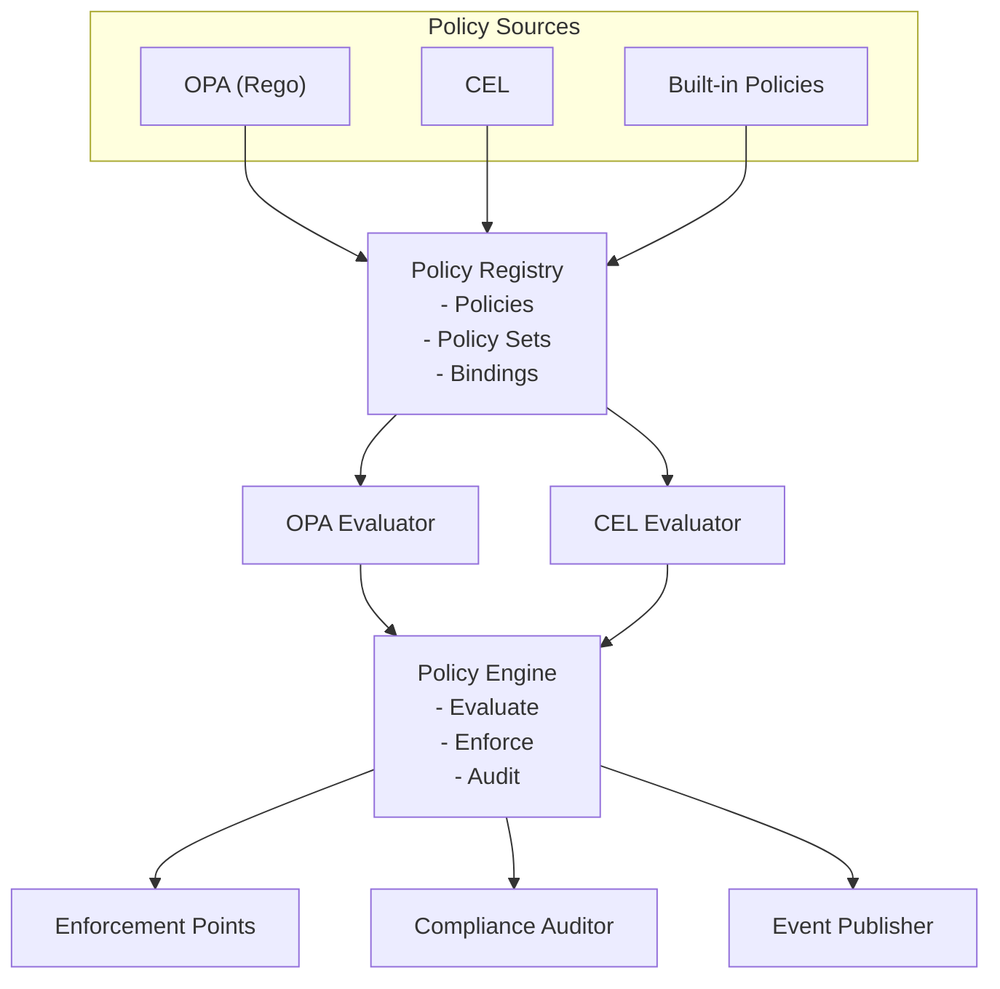

## Overview

Keystone Core's policy enforcement system enables you to define, enforce, and audit compliance policies across your infrastructure. Policies are written as code (using OPA Rego or CEL), evaluated automatically at key enforcement points, and violations are tracked for compliance reporting.

**Key Capabilities**:

- **Policy-as-Code**: Define policies in OPA (Rego) or CEL
- **Continuous Compliance**: Evaluate policies at runtime, not just deployment
- **Multiple Enforcement Modes**: Block, warn, audit
- **Enforcement Points**: Pre/post execution, state changes, drift detection, events
- **Compliance Reporting**: Track violations, compliance scores, audit trails
- **Automated Remediation**: React to policy violations automatically

## Architecture



## Policy Types

Keystone Core supports three policy types:

### 1. OPA (Open Policy Agent) - Rego

**Best for**: Complex policies with rich data structures

**Example** - SSH hardening policy:

```rego
package kscore.security.ssh

# SSH port must not be default (22)
deny[msg] {
    input.resource.type == "file"
    input.resource.path == "/etc/ssh/sshd_config"
    contains(input.resource.contents, "Port 22")
    msg := "SSH must not use default port 22"
}

# Root login must be disabled
deny[msg] {
    input.resource.type == "file"
    input.resource.path == "/etc/ssh/sshd_config"
    contains(input.resource.contents, "PermitRootLogin yes")
    msg := "SSH root login must be disabled"
}

# Password authentication must be disabled
deny[msg] {
    input.resource.type == "file"
    input.resource.path == "/etc/ssh/sshd_config"
    not contains(input.resource.contents, "PasswordAuthentication no")
    msg := "SSH password authentication must be disabled"
}
```

### 2. CEL (Common Expression Language)

**Best for**: Simple policies with boolean expressions

**Example** - Resource ownership policy:

```cel
// Resources must have an owner tag
resource.tags.contains("owner")

// Prod resources must not be shared
resource.environment == "production" && !resource.public

// Critical resources require approval
resource.critical && context.approved
```

### 3. Built-in Policies

**Best for**: Common patterns without writing code

Keystone Core provides 14 built-in policies that cover common security, compliance, and operational requirements without requiring OPA or CEL knowledge:

| Policy | Description |
|--------|-------------|
| `require-labels` | Require specific labels on resources |
| `require-owner` | Require owner/team annotations |
| `allowed-environments` | Restrict to specific environments |
| `allowed-actions` | Restrict to specific actions |
| `deny-privileged` | Block privileged execution |
| `allowed-users` | Restrict to specific users |
| `denied-users` | Block specific users |
| `time-window` | Restrict operations to time windows |
| `no-root-execution` | Block running as root |
| `require-approval` | Require approval for actions |
| `max-concurrent` | Limit concurrent operations |
| `resource-quota` | Enforce resource quotas |
| `pattern-deny` | Block resources matching patterns |
| `pattern-allow` | Only allow resources matching patterns |

#### Built-in Policy Configuration

Built-in policies use JSON configuration:

```yaml
id: "production-labels"
name: "Production Resource Labels"
type: builtin
category: compliance
severity: medium
enforcement: enforce
code: |
  {
    "name": "require-labels",
    "config": {
      "labels": ["env", "team", "cost-center"],
      "require_values": true
    }
  }
```

#### require-labels

Require specific labels on resources:

```json
{
  "name": "require-labels",
  "config": {
    "labels": ["env", "team", "owner"],
    "label_patterns": ["^app\\..*"],
    "require_values": true
  }
}
```

| Parameter | Type | Description |
|-----------|------|-------------|
| `labels` | []string | Required label keys |
| `label_patterns` | []string | Regex patterns for label keys |
| `require_values` | bool | If true, labels must have non-empty values |

#### require-owner

Require owner/team annotations:

```json
{
  "name": "require-owner",
  "config": {
    "owner_label": "owner",
    "team_label": "team",
    "valid_owners": ["alice@example.com", "bob@example.com"],
    "valid_teams": ["platform", "security", "sre"]
  }
}
```

| Parameter | Type | Description |
|-----------|------|-------------|
| `owner_label` | string | Label key for owner |
| `team_label` | string | Label key for team |
| `valid_owners` | []string | Optional list of valid owners |
| `valid_teams` | []string | Optional list of valid teams |

#### allowed-environments

Restrict operations to specific environments:

```json
{
  "name": "allowed-environments",
  "config": {
    "environments": ["dev", "staging", "production"],
    "environment_key": "environment"
  }
}
```

| Parameter | Type | Description |
|-----------|------|-------------|
| `environments` | []string | Allowed environment values |
| `environment_key` | string | Context key for environment (default: "environment") |

#### allowed-actions

Restrict to specific actions:

```json
{
  "name": "allowed-actions",
  "config": {
    "actions": ["read", "list", "get"],
    "action_patterns": ["^get.*", "^list.*"]
  }
}
```

| Parameter | Type | Description |
|-----------|------|-------------|
| `actions` | []string | Exact action names allowed |
| `action_patterns` | []string | Regex patterns for allowed actions |

#### deny-privileged

Block privileged execution:

```json
{
  "name": "deny-privileged",
  "config": {}
}
```

Blocks operations when:

- `context.privileged` is `true`
- `context.run_as_user` is `"root"` or `"0"`

#### allowed-users and denied-users

Control user access:

```json
{
  "name": "allowed-users",
  "config": {
    "users": ["alice", "bob", "ops-team"],
    "user_patterns": ["^admin-.*"],
    "groups": ["admins", "operators"]
  }
}
```

```json
{
  "name": "denied-users",
  "config": {
    "users": ["malicious", "banned"],
    "user_patterns": ["^bot-.*", "^test-.*"]
  }
}
```

| Parameter | Type | Description |
|-----------|------|-------------|
| `users` | []string | Exact usernames |
| `user_patterns` | []string | Regex patterns for usernames |
| `groups` | []string | Group names (from `context.user_groups`) |

#### time-window

Restrict operations to time windows:

```json
{
  "name": "time-window",
  "config": {
    "allowed_days": [1, 2, 3, 4, 5],
    "allowed_hours_start": 9,
    "allowed_hours_end": 17,
    "timezone": "America/New_York",
    "blocked_dates": ["2024-12-25", "2024-01-01"]
  }
}
```

| Parameter | Type | Description |
|-----------|------|-------------|
| `allowed_days` | []int | Days when allowed (0=Sunday, 6=Saturday) |
| `allowed_hours_start` | int | Start hour (0-23) |
| `allowed_hours_end` | int | End hour (0-23) |
| `timezone` | string | Timezone (default: UTC) |
| `blocked_dates` | []string | Specific dates to block (YYYY-MM-DD) |

#### no-root-execution

Block running as root with exceptions:

```json
{
  "name": "no-root-execution",
  "config": {
    "allowed_users": ["admin", "ops-lead"],
    "allowed_actions": ["system-maintenance", "emergency-fix"]
  }
}
```

| Parameter | Type | Description |
|-----------|------|-------------|
| `allowed_users` | []string | Users allowed to run as root |
| `allowed_actions` | []string | Actions allowed as root |

#### require-approval

Require approval for sensitive actions:

```json
{
  "name": "require-approval",
  "config": {
    "actions": ["delete", "terminate", "destroy"],
    "approvers": ["admin@example.com", "security@example.com"],
    "min_approvals": 2
  }
}
```

| Parameter | Type | Description |
|-----------|------|-------------|
| `actions` | []string | Actions requiring approval |
| `approvers` | []string | Users who can approve |
| `min_approvals` | int | Minimum approvals required |

Approval status is checked via `context.approved` boolean.

#### max-concurrent

Limit concurrent operations:

```json
{
  "name": "max-concurrent",
  "config": {
    "max_concurrent": 10,
    "scope": "global"
  }
}
```

| Parameter | Type | Description |
|-----------|------|-------------|
| `max_concurrent` | int | Maximum concurrent operations |
| `scope` | string | Count scope: "global", "user", "resource" |

Current count is provided via `context.concurrent_count`.

#### resource-quota

Enforce resource quotas:

```json
{
  "name": "resource-quota",
  "config": {
    "max_resources": 1000,
    "max_per_user": 50,
    "max_per_team": 200
  }
}
```

| Parameter | Type | Description |
|-----------|------|-------------|
| `max_resources` | int | Maximum total resources |
| `max_per_user` | int | Maximum resources per user |
| `max_per_team` | int | Maximum resources per team |

Counts are provided via `context.total_resources`, `context.user_resources`.

#### pattern-deny and pattern-allow

Control resources by name patterns:

```json
{
  "name": "pattern-deny",
  "config": {
    "patterns": ["^test-.*", "^dev-.*", ".*-deprecated$"],
    "field": "name"
  }
}
```

```json
{
  "name": "pattern-allow",
  "config": {
    "patterns": ["^prod-.*", "^staging-.*"],
    "field": "metadata.name"
  }
}
```

| Parameter | Type | Description |
|-----------|------|-------------|
| `patterns` | []string | Regex patterns to match |
| `field` | string | Resource field to match (default: "name", supports dot notation) |

#### Built-in Policy Examples

**Business Hours Only**:

```yaml
id: "business-hours-only"
name: "Business Hours Deployment Window"
type: builtin
category: operational
severity: medium
enforcement: enforce
code: |
  {
    "name": "time-window",
    "config": {
      "allowed_days": [1, 2, 3, 4, 5],
      "allowed_hours_start": 9,
      "allowed_hours_end": 17,
      "timezone": "America/New_York",
      "blocked_dates": ["2024-12-25", "2024-01-01"]
    }
  }
```

**No Production Deletion Without Approval**:

```yaml
id: "prod-delete-approval"
name: "Production Delete Requires Approval"
type: builtin
category: security
severity: critical
enforcement: enforce
code: |
  {
    "name": "require-approval",
    "config": {
      "actions": ["delete", "destroy", "terminate"],
      "min_approvals": 1
    }
  }
targets:
  - environment: production
```

**Block Test Resources in Production**:

```yaml
id: "no-test-in-prod"
name: "Block Test Resources in Production"
type: builtin
category: compliance
severity: high
enforcement: enforce
code: |
  {
    "name": "pattern-deny",
    "config": {
      "patterns": ["^test-.*", "^dev-.*", ".*-temp$"]
    }
  }
targets:
  - environment: production
```

## Policy Definition

### Policy Structure

```yaml
# Example: ssh-hardening.yaml
id: "ssh-hardening"
name: "SSH Security Hardening"
description: "Enforce SSH security best practices"

# Policy type
type: opa              # opa, cel, builtin

# Category
category: security     # security, compliance, operational, cost, custom

# Severity
severity: high         # low, medium, high, critical

# Enforcement mode
enforcement: enforce   # enforce, audit, warn

# Policy code
code: |
  package kscore.security.ssh

  deny[msg] {
      input.resource.type == "file"
      input.resource.path == "/etc/ssh/sshd_config"
      contains(input.resource.contents, "Port 22")
      msg := "SSH must not use default port 22"
  }

# Enforcement points
enforce_at:
  - pre_execution
  - on_change
  - on_drift

# Target resources
targets:
  - resource_type: file
    path: "/etc/ssh/sshd_config"
  - resource_type: service
    name: sshd
```

### Policy Sets

Group related policies:

```yaml
# Example: security-baseline.yaml
policy_set:
  id: "security-baseline"
  name: "Security Baseline"
  description: "Minimum security requirements for all systems"

  policies:
    - ssh-hardening
    - firewall-rules
    - user-permissions
    - package-updates

  # Apply to
  targets:
    - environment: production
    - datacenter: "*"
    - role: "*"
```

### Policy Bindings

Attach policies to resources:

```yaml
# Example: production-bindings.yaml
bindings:
  - policy_set: security-baseline
    target:
      environment: production
    actions:
      - state_apply
      - command_execute

  - policy: cost-optimization
    target:
      datacenter: us-east-1
      role: web
    actions:
      - state_apply
```

## Enforcement Modes

### Enforce

**Behavior**: Block operations that violate policy

```yaml
enforcement: enforce
```

**Result**: Policy violations prevent the operation from executing.

**Example**:

```bash
$ kscorectl state apply web-server.yaml

Policy Violation: ssh-hardening
  - SSH must not use default port 22
  - SSH root login must be disabled

ERROR: Policy enforcement failed. Operation blocked.
```

### Audit

**Behavior**: Allow operations but log violations

```yaml
enforcement: audit
```

**Result**: Policy violations are logged and tracked, but operations proceed.

**Example**:

```bash
$ kscorectl state apply web-server.yaml

Policy Violation: ssh-hardening (audit mode)
  - SSH must not use default port 22

WARNING: Policy violations detected (audit mode). See audit log for details.

State applied successfully.
```

### Warn

**Behavior**: Warn but allow operations

```yaml
enforcement: warn
```

**Result**: Policy violations display warnings but don't prevent execution.

**Example**:

```bash
$ kscorectl state apply web-server.yaml

Policy Warning: best-practices
  - Consider using systemd for service management

State applied successfully.
```

## Enforcement Points

Policies are evaluated at key points in the Keystone Core lifecycle:

### 1. Pre-Execution

Evaluate before command or state execution:

```yaml
enforce_at:
  - pre_execution
```

**Use case**: Block disallowed commands before execution

**Example**:

```rego
package kscore.execution

# Block rm -rf on production
deny[msg] {
    input.action == "command_execute"
    input.environment == "production"
    contains(input.command, "rm -rf")
    msg := "Dangerous command blocked on production"
}
```

### 2. Post-Execution

Evaluate after command or state execution:

```yaml
enforce_at:
  - post_execution
```

**Use case**: Verify expected outcomes

**Example**:

```rego
package kscore.execution

# Verify nginx service is running
deny[msg] {
    input.action == "state_apply"
    input.module == "service"
    input.name == "nginx"
    input.result.state != "running"
    msg := "Nginx service must be running"
}
```

### 3. On Change

Evaluate when resource state changes:

```yaml
enforce_at:
  - on_change
```

**Use case**: Validate configuration changes

**Example**:

```rego
package kscore.config

# Firewall must allow required ports
deny[msg] {
    input.resource.type == "file"
    input.resource.path == "/etc/iptables/rules.v4"
    not contains(input.resource.contents, "dport 443")
    msg := "Firewall must allow HTTPS (443)"
}
```

### 4. On Drift

Evaluate when configuration drift is detected:

```yaml
enforce_at:
  - on_drift
```

**Use case**: Auto-remediate critical drift

**Example**:

```rego
package kscore.drift

# Critical drift requires immediate remediation
deny[msg] {
    input.drift.severity == "critical"
    input.drift.resource == "ssh_config"
    msg := "Critical SSH configuration drift detected"
}
```

### 5. On Event

Evaluate on specific events:

```yaml
enforce_at:
  - on_event

event_filter: "type == 'agent.connect'"
```

**Use case**: Validate new agents meet compliance requirements

**Example**:

```rego
package kscore.agent

# New agents must meet security requirements
deny[msg] {
    input.event.type == "agent.connect"
    input.event.data.os == "linux"
    not input.event.data.selinux_enabled
    msg := "Linux agents must have SELinux enabled"
}
```

## Enforcement Actions

When policies are violated, Keystone Core can take automated actions:

### Block

Prevent the operation:

```yaml
action: block
```

### Warn

Display warning but allow:

```yaml
action: warn
```

### Audit

Log violation:

```yaml
action: audit
```

### Remediate

Automatically fix violation:

```yaml
action: remediate
remediation:
  type: state_apply
  state_file: "ssh-hardening.yaml"
```

## Policy Evaluation Context

Policies receive rich context:

### Resource Context

```json
{
  "resource": {
    "type": "file",
    "path": "/etc/ssh/sshd_config",
    "owner": "root",
    "mode": "0644",
    "contents": "..."
  }
}
```

### Action Context

```json
{
  "action": "command_execute",
  "command": "systemctl restart nginx",
  "user": "ops-user",
  "target": {
    "agent_id": "web-01",
    "datacenter": "us-east-1",
    "environment": "production",
    "role": "web"
  }
}
```

### Agent Context

```json
{
  "agent": {
    "id": "web-01",
    "datacenter": "us-east-1",
    "environment": "production",
    "role": "web",
    "os": "linux",
    "labels": {"service": "nginx", "tier": "frontend"}
  }
}
```

### Environment Context

```json
{
  "context": {
    "environment": "production",
    "datacenter": "us-east-1",
    "time": "2024-01-15T10:30:00Z",
    "user": "ops-user"
  }
}
```

## Compliance Reporting

Track policy compliance over time:

### Compliance Score

```bash
$ kscorectl policy compliance --environment production

Overall Compliance: 87.5%

Policy Set: security-baseline
  Compliance: 92.3%
  Policies: 12 total, 11 compliant, 1 violating

Policy Set: operational-standards
  Compliance: 85.0%
  Policies: 20 total, 17 compliant, 3 violating

Top Violations:
  1. ssh-hardening (15 agents)
  2. firewall-rules (8 agents)
  3. package-updates (5 agents)
```

### Violation Report

```bash
$ kscorectl policy violations --policy ssh-hardening

Policy: ssh-hardening
Severity: high
Violations: 15

Agents:
  - web-01 (us-east-1, production)
    - SSH must not use default port 22
    - First detected: 2024-01-10T08:00:00Z
    - Last detected: 2024-01-15T10:30:00Z

  - web-02 (us-east-1, production)
    - SSH root login must be disabled
    - First detected: 2024-01-12T14:00:00Z
    - Last detected: 2024-01-15T10:30:00Z

Remediation: Run state apply with ssh-hardening.yaml
```

### Audit Trail

```bash
$ kscorectl policy audit --since 24h

Policy Evaluations (last 24 hours):
  Total: 1,234
  Allowed: 1,150 (93.2%)
  Denied: 84 (6.8%)

By Policy:
  - ssh-hardening: 250 evaluations, 235 allowed, 15 denied
  - firewall-rules: 180 evaluations, 172 allowed, 8 denied
  - package-updates: 150 evaluations, 145 allowed, 5 denied

By Environment:
  - production: 800 evaluations, 725 allowed, 75 denied
  - staging: 300 evaluations, 290 allowed, 10 denied
  - dev: 134 evaluations, 135 allowed, 0 denied
```

## Reactor Integration

Use reactors to automate policy enforcement:

### Auto-Remediate Violations

```yaml
auto_remediate_policy_violations:
  filter: "type == 'policy.violation' and data.severity >= 'high'"
  actions:
    - type: state_apply
      state_file: "{{ event.data.remediation_state }}"
      target: "agent_id == {{ event.source }}"
  conditions:
    throttle: "10m"
```

### Escalate Critical Violations

```yaml
escalate_critical_violations:
  filter: "type == 'policy.violation' and data.severity == 'critical'"
  actions:
    - type: webhook
      url: "https://pagerduty.example.com/events"
      body: |
        {
          "summary": "Critical policy violation: {{ event.data.policy_name }}",
          "source": "{{ event.source }}",
          "severity": "critical"
        }
```

### Report Compliance

```yaml
daily_compliance_report:
  schedule: "0 8 * * *"  # 8 AM daily
  actions:
    - type: command
      command: "kscorectl policy compliance --format json > /tmp/compliance-$(date +%Y%m%d).json"
    - type: webhook
      url: "https://slack.example.com/hooks/compliance"
      body: |
        {
          "text": "Daily compliance report generated"
        }
```

## Policy Examples

### Required Tags Policy

```rego
package kscore.compliance.tags

required_tags := ["owner", "environment", "cost-center"]

deny[msg] {
    input.resource.type == "file"
    tag := required_tags[_]
    not input.resource.tags[tag]
    msg := sprintf("Missing required tag: %v", [tag])
}
```

### Approved Package Versions

```rego
package kscore.compliance.packages

approved_versions := {
    "nginx": ["1.24.*", "1.25.*"],
    "postgresql": ["14.*", "15.*"]
}

deny[msg] {
    input.resource.type == "package"
    package_name := input.resource.name
    version := input.resource.version
    approved := approved_versions[package_name]
    not version_matches(version, approved)
    msg := sprintf("Package %v version %v not approved", [package_name, version])
}

version_matches(version, patterns) {
    pattern := patterns[_]
    glob.match(pattern, [], version)
}
```

### File Permission Policy

```rego
package kscore.security.permissions

# Sensitive files must not be world-readable
deny[msg] {
    input.resource.type == "file"
    is_sensitive(input.resource.path)
    is_world_readable(input.resource.mode)
    msg := sprintf("Sensitive file %v must not be world-readable", [input.resource.path])
}

is_sensitive(path) {
    sensitive_paths := ["/etc/ssh", "/etc/ssl", "/root"]
    startswith(path, sensitive_paths[_])
}

is_world_readable(mode) {
    # Check if mode has world-read bit (004)
    bits.and(mode, 4) == 4
}
```

### Environment-Specific Restrictions

```cel
// Production restrictions
resource.environment == "production" && (
  // No direct SSH access
  !(resource.type == "command" && resource.command.contains("ssh")) &&

  // No package removals
  !(resource.type == "package" && resource.state == "removed") &&

  // Services must be enabled
  (resource.type != "service" || resource.enabled == true)
)
```

### Cost Optimization

```cel
// Require cost-effective instance types in non-prod
resource.environment != "production" &&
resource.type == "compute" &&
resource.instance_type.matches("t3.*|t2.*")
```

## Best Practices

### Policy Design

1. **Start Simple**: Begin with audit mode, move to enforce gradually
2. **Specific Targets**: Target specific resources, not everything
3. **Clear Messages**: Write descriptive violation messages
4. **Test Thoroughly**: Test policies in dev before production
5. **Version Control**: Keep policies in Git

### Policy Organization

1. **Group by Category**: Security, compliance, operational, cost
2. **Use Policy Sets**: Group related policies
3. **Consistent Naming**: Use clear, descriptive policy IDs
4. **Document Policies**: Add descriptions and examples

### Enforcement

1. **Gradual Rollout**: Start with audit, then warn, then enforce
2. **Environment-Specific**: Use different enforcement for dev/prod
3. **Exemptions**: Allow exemptions with approval workflow
4. **Automated Remediation**: Use reactors for auto-remediation

### Compliance

1. **Regular Reports**: Generate compliance reports daily/weekly
2. **Track Trends**: Monitor compliance scores over time
3. **Address Violations**: Prioritize high-severity violations
4. **Audit Everything**: Keep comprehensive audit logs

## Monitoring

### Metrics

```
# Evaluations
kscore_policy_evaluations_total{policy,result}
kscore_policy_evaluation_duration_seconds{policy,quantile}

# Violations
kscore_policy_violations_total{policy,severity}
kscore_policy_violations_by_agent{agent,policy}

# Compliance
kscore_policy_compliance_score{policy_set,environment}
kscore_policy_compliant_agents{environment}

# Remediations
kscore_policy_remediations_total{policy,status}
```

### Events

- `policy.evaluation` - Policy evaluated
- `policy.pass` - Policy passed
- `policy.violation` - Policy violated
- `policy.remediation` - Remediation triggered

## Policy Library

Keystone Core provides a library of pre-built policies for common compliance frameworks. These policies can be used as-is or customized for your specific requirements.

### CIS Benchmark Policies

The following policies implement controls from the CIS Benchmarks for Linux systems.

#### CIS Level 1 - Core Security

```yaml
# cis-level1-core.yaml
policies:
  # 1.1.1 - Disable mounting of cramfs filesystems
  - id: cis-1.1.1-cramfs
    name: "CIS 1.1.1 - Disable cramfs"
    type: opa
    category: security
    severity: medium
    enforcement: enforce
    code: |
      package kscore.cis.filesystem

      deny[msg] {
        input.resource.type == "command"
        input.resource.command == ["modprobe", "cramfs"]
        msg := "CIS 1.1.1: cramfs filesystem mounting is prohibited"
      }

  # 1.4.1 - Ensure GRUB has password protection
  - id: cis-1.4.1-grub-password
    name: "CIS 1.4.1 - GRUB Password"
    type: opa
    category: security
    severity: high
    enforcement: warn
    code: |
      package kscore.cis.bootloader

      deny[msg] {
        input.resource.type == "file"
        input.resource.path == "/boot/grub2/grub.cfg"
        not contains(input.resource.contents, "password_pbkdf2")
        msg := "CIS 1.4.1: GRUB bootloader must have password protection"
      }

  # 3.2.1 - Ensure source routed packets are not accepted
  - id: cis-3.2.1-source-routing
    name: "CIS 3.2.1 - Disable Source Routing"
    type: opa
    category: network
    severity: high
    enforcement: enforce
    code: |
      package kscore.cis.network

      deny[msg] {
        input.resource.type == "file"
        input.resource.path == "/etc/sysctl.conf"
        not contains(input.resource.contents, "net.ipv4.conf.all.accept_source_route = 0")
        msg := "CIS 3.2.1: IPv4 source routing must be disabled"
      }

  # 4.1.1 - Ensure auditd is installed
  - id: cis-4.1.1-auditd
    name: "CIS 4.1.1 - auditd Installation"
    type: opa
    category: logging
    severity: medium
    enforcement: enforce
    code: |
      package kscore.cis.audit

      violation[msg] {
        input.context.type == "package_install"
        input.facts.packages.audit == "not_installed"
        msg := "CIS 4.1.1: auditd package must be installed"
      }

  # 5.2.1 - Ensure permissions on /etc/ssh/sshd_config
  - id: cis-5.2.1-sshd-permissions
    name: "CIS 5.2.1 - SSH Config Permissions"
    type: opa
    category: security
    severity: medium
    enforcement: enforce
    code: |
      package kscore.cis.ssh

      deny[msg] {
        input.resource.type == "file"
        input.resource.path == "/etc/ssh/sshd_config"
        to_number(input.resource.mode) > 600
        msg := sprintf("CIS 5.2.1: sshd_config must have permissions 600 or stricter, got %s", [input.resource.mode])
      }

  # 5.2.11 - Ensure SSH PermitRootLogin is disabled
  - id: cis-5.2.11-no-root-login
    name: "CIS 5.2.11 - Disable SSH Root Login"
    type: opa
    category: security
    severity: high
    enforcement: enforce
    code: |
      package kscore.cis.ssh

      deny[msg] {
        input.resource.type == "file"
        input.resource.path == "/etc/ssh/sshd_config"
        contains(lower(input.resource.contents), "permitrootlogin yes")
        msg := "CIS 5.2.11: SSH root login must be disabled"
      }
```

#### CIS Level 2 - Extended Security

```yaml
# cis-level2-extended.yaml
policies:
  # 1.6.1 - Ensure SELinux is enforcing
  - id: cis-1.6.1-selinux-enforcing
    name: "CIS 1.6.1 - SELinux Enforcing"
    type: opa
    category: security
    severity: high
    enforcement: warn
    code: |
      package kscore.cis.selinux

      deny[msg] {
        input.resource.type == "file"
        input.resource.path == "/etc/selinux/config"
        not contains(input.resource.contents, "SELINUX=enforcing")
        msg := "CIS 1.6.1: SELinux must be in enforcing mode"
      }

  # 3.5.1 - Ensure DCCP is disabled
  - id: cis-3.5.1-dccp-disabled
    name: "CIS 3.5.1 - Disable DCCP"
    type: opa
    category: network
    severity: medium
    enforcement: enforce
    code: |
      package kscore.cis.network.protocols

      deny[msg] {
        input.resource.type == "file"
        input.resource.path == "/etc/modprobe.d/dccp.conf"
        not contains(input.resource.contents, "install dccp /bin/true")
        msg := "CIS 3.5.1: DCCP protocol must be disabled"
      }

  # 4.2.1.4 - Ensure rsyslog default file permissions
  - id: cis-4.2.1.4-rsyslog-permissions
    name: "CIS 4.2.1.4 - rsyslog File Permissions"
    type: opa
    category: logging
    severity: medium
    enforcement: enforce
    code: |
      package kscore.cis.logging

      deny[msg] {
        input.resource.type == "file"
        input.resource.path == "/etc/rsyslog.conf"
        not contains(input.resource.contents, "$FileCreateMode 0640")
        msg := "CIS 4.2.1.4: rsyslog must create files with mode 0640"
      }

  # 5.4.1.1 - Ensure password expiration is 365 days or less
  - id: cis-5.4.1.1-password-expiration
    name: "CIS 5.4.1.1 - Password Expiration"
    type: opa
    category: identity
    severity: medium
    enforcement: warn
    code: |
      package kscore.cis.password

      deny[msg] {
        input.resource.type == "file"
        input.resource.path == "/etc/login.defs"
        line := split(input.resource.contents, "\n")[_]
        startswith(trim_space(line), "PASS_MAX_DAYS")
        parts := split(trim_space(line), " ")
        to_number(parts[1]) > 365
        msg := sprintf("CIS 5.4.1.1: Password max age must be 365 days or less, got %s", [parts[1]])
      }
```

### SOC 2 Control Policies

The following policies help demonstrate compliance with SOC 2 Trust Service Criteria.

#### CC6 - Logical and Physical Access Controls

```yaml
# soc2-cc6-access-controls.yaml
policies:
  # CC6.1 - Logical access security software
  - id: soc2-cc6.1-access-controls
    name: "SOC 2 CC6.1 - Access Control Implementation"
    type: opa
    category: access-control
    severity: high
    enforcement: enforce
    code: |
      package kscore.soc2.cc6

      # Ensure commands require authentication
      deny[msg] {
        input.context.type == "command_execution"
        not input.context.authenticated
        msg := "SOC 2 CC6.1: All commands must be authenticated"
      }

      # Ensure privileged operations are authorized
      deny[msg] {
        input.context.type == "command_execution"
        input.context.privileged
        not input.context.authorized_for_privileged
        msg := "SOC 2 CC6.1: Privileged operations require explicit authorization"
      }

  # CC6.2 - Registration and authorization
  - id: soc2-cc6.2-registration
    name: "SOC 2 CC6.2 - Agent Registration Controls"
    type: opa
    category: identity
    severity: high
    enforcement: enforce
    code: |
      package kscore.soc2.cc6

      # Agents must be registered with valid certificates
      deny[msg] {
        input.context.type == "agent_connect"
        not input.agent.certificate_valid
        msg := "SOC 2 CC6.2: Agents must present valid certificates"
      }

      # Agents must have approved identity
      deny[msg] {
        input.context.type == "agent_connect"
        not input.agent.identity_approved
        msg := "SOC 2 CC6.2: Agent identity must be pre-approved"
      }

  # CC6.3 - Authentication mechanisms
  - id: soc2-cc6.3-authentication
    name: "SOC 2 CC6.3 - Strong Authentication"
    type: opa
    category: authentication
    severity: high
    enforcement: enforce
    code: |
      package kscore.soc2.cc6

      # Require MFA for sensitive operations
      deny[msg] {
        input.context.type == "user_action"
        input.context.sensitivity == "high"
        not input.context.mfa_verified
        msg := "SOC 2 CC6.3: High sensitivity operations require MFA"
      }

  # CC6.6 - Restriction on software installation
  - id: soc2-cc6.6-software-controls
    name: "SOC 2 CC6.6 - Software Installation Controls"
    type: opa
    category: change-management
    severity: medium
    enforcement: enforce
    code: |
      package kscore.soc2.cc6

      # Only approved packages can be installed
      deny[msg] {
        input.context.type == "package_install"
        not input.package.source in approved_repositories
        msg := sprintf("SOC 2 CC6.6: Package %s not from approved repository", [input.package.name])
      }

      approved_repositories = {"official", "internal", "verified-third-party"}

  # CC6.7 - Restricting data access
  - id: soc2-cc6.7-data-access
    name: "SOC 2 CC6.7 - Data Access Restrictions"
    type: opa
    category: data-protection
    severity: high
    enforcement: enforce
    code: |
      package kscore.soc2.cc6

      # Sensitive files require explicit access
      deny[msg] {
        input.context.type == "file_access"
        is_sensitive_path(input.resource.path)
        not input.context.has_sensitive_data_access
        msg := sprintf("SOC 2 CC6.7: Access to %s requires sensitive data authorization", [input.resource.path])
      }

      is_sensitive_path(path) {
        startswith(path, "/etc/ssl/")
      }
      is_sensitive_path(path) {
        startswith(path, "/etc/pki/")
      }
      is_sensitive_path(path) {
        contains(path, "password")
      }
      is_sensitive_path(path) {
        contains(path, "secret")
      }
```

#### CC7 - System Operations

```yaml
# soc2-cc7-system-operations.yaml
policies:
  # CC7.1 - Security incidents
  - id: soc2-cc7.1-incident-detection
    name: "SOC 2 CC7.1 - Security Event Logging"
    type: opa
    category: monitoring
    severity: high
    enforcement: enforce
    code: |
      package kscore.soc2.cc7

      # All security events must be logged
      deny[msg] {
        input.context.type == "security_event"
        not input.event.logged
        msg := "SOC 2 CC7.1: Security events must be logged to audit trail"
      }

  # CC7.2 - System monitoring
  - id: soc2-cc7.2-monitoring
    name: "SOC 2 CC7.2 - System Monitoring"
    type: opa
    category: monitoring
    severity: medium
    enforcement: warn
    code: |
      package kscore.soc2.cc7

      # Agents must have monitoring enabled
      violation[msg] {
        input.context.type == "agent_config_check"
        not input.agent.config.telemetry.enabled
        msg := "SOC 2 CC7.2: Agent telemetry must be enabled for monitoring"
      }

  # CC7.4 - Incident response
  - id: soc2-cc7.4-incident-response
    name: "SOC 2 CC7.4 - Incident Response"
    type: opa
    category: incident-management
    severity: high
    enforcement: enforce
    code: |
      package kscore.soc2.cc7

      # Critical alerts must trigger notification
      deny[msg] {
        input.context.type == "alert"
        input.alert.severity == "critical"
        not input.alert.notification_sent
        msg := "SOC 2 CC7.4: Critical alerts must trigger incident response notification"
      }
```

#### CC8 - Change Management

```yaml
# soc2-cc8-change-management.yaml
policies:
  # CC8.1 - Change authorization
  - id: soc2-cc8.1-change-authorization
    name: "SOC 2 CC8.1 - Change Authorization"
    type: opa
    category: change-management
    severity: high
    enforcement: enforce
    code: |
      package kscore.soc2.cc8

      # Production changes require approval
      deny[msg] {
        input.context.type == "state_apply"
        input.context.environment == "production"
        not input.context.change_approved
        msg := "SOC 2 CC8.1: Production changes require change approval"
      }

      # Changes must have associated ticket
      deny[msg] {
        input.context.type == "state_apply"
        input.context.environment == "production"
        not input.context.change_ticket
        msg := "SOC 2 CC8.1: Production changes must reference a change ticket"
      }

  # CC8.2 - Change testing
  - id: soc2-cc8.2-change-testing
    name: "SOC 2 CC8.2 - Change Testing"
    type: opa
    category: change-management
    severity: medium
    enforcement: warn
    code: |
      package kscore.soc2.cc8

      # Changes should be tested in non-prod first
      warn[msg] {
        input.context.type == "state_apply"
        input.context.environment == "production"
        not input.context.tested_in_staging
        msg := "SOC 2 CC8.2: Changes should be tested in staging before production"
      }
```

### HIPAA Security Rule Policies

For healthcare organizations handling PHI (Protected Health Information).

```yaml
# hipaa-security.yaml
policies:
  # 164.312(a)(1) - Access Control
  - id: hipaa-164.312a1-access-control
    name: "HIPAA Access Control"
    type: opa
    category: access-control
    severity: critical
    enforcement: enforce
    code: |
      package kscore.hipaa.access

      # Unique user identification required
      deny[msg] {
        input.context.type == "user_action"
        not input.user.unique_identifier
        msg := "HIPAA 164.312(a)(1): User must have unique identification"
      }

      # Automatic logoff for inactive sessions
      deny[msg] {
        input.context.type == "session_activity"
        input.session.idle_minutes > 15
        not input.session.terminated
        msg := "HIPAA 164.312(a)(1): Sessions must auto-terminate after 15 minutes of inactivity"
      }

  # 164.312(a)(2)(iv) - Encryption and Decryption
  - id: hipaa-164.312a2iv-encryption
    name: "HIPAA Encryption Requirements"
    type: opa
    category: data-protection
    severity: critical
    enforcement: enforce
    code: |
      package kscore.hipaa.encryption

      # PHI data must be encrypted at rest
      deny[msg] {
        input.context.type == "file_write"
        is_phi_location(input.resource.path)
        not input.resource.encrypted
        msg := "HIPAA 164.312(a)(2)(iv): PHI must be encrypted at rest"
      }

      is_phi_location(path) {
        contains(path, "/phi/")
      }
      is_phi_location(path) {
        contains(path, "/patient-data/")
      }
      is_phi_location(path) {
        contains(path, "/medical-records/")
      }

  # 164.312(b) - Audit Controls
  - id: hipaa-164.312b-audit
    name: "HIPAA Audit Controls"
    type: opa
    category: logging
    severity: critical
    enforcement: enforce
    code: |
      package kscore.hipaa.audit

      # All PHI access must be audited
      deny[msg] {
        input.context.type == "data_access"
        input.context.data_classification == "PHI"
        not input.context.audit_logged
        msg := "HIPAA 164.312(b): PHI access must be audit logged"
      }

  # 164.312(c)(1) - Integrity
  - id: hipaa-164.312c1-integrity
    name: "HIPAA Data Integrity"
    type: opa
    category: data-protection
    severity: high
    enforcement: enforce
    code: |
      package kscore.hipaa.integrity

      # PHI modifications must be authenticated
      deny[msg] {
        input.context.type == "data_modify"
        input.context.data_classification == "PHI"
        not input.context.authentication_verified
        msg := "HIPAA 164.312(c)(1): PHI modifications require authenticated access"
      }

  # 164.312(d) - Person or Entity Authentication
  - id: hipaa-164.312d-authentication
    name: "HIPAA Authentication"
    type: opa
    category: authentication
    severity: critical
    enforcement: enforce
    code: |
      package kscore.hipaa.auth

      # Strong authentication for PHI systems
      deny[msg] {
        input.context.type == "system_access"
        input.system.handles_phi
        input.authentication.method == "password_only"
        msg := "HIPAA 164.312(d): PHI systems require multi-factor authentication"
      }

  # 164.312(e)(1) - Transmission Security
  - id: hipaa-164.312e1-transmission
    name: "HIPAA Transmission Security"
    type: opa
    category: network
    severity: critical
    enforcement: enforce
    code: |
      package kscore.hipaa.transmission

      # PHI transmission must use encryption
      deny[msg] {
        input.context.type == "network_transfer"
        input.context.contains_phi
        not input.context.tls_enabled
        msg := "HIPAA 164.312(e)(1): PHI transmission must use TLS encryption"
      }

      # Minimum TLS version
      deny[msg] {
        input.context.type == "network_transfer"
        input.context.contains_phi
        input.context.tls_version < "1.2"
        msg := "HIPAA 164.312(e)(1): PHI transmission requires TLS 1.2 or higher"
      }
```

### PCI DSS Policies

For organizations handling payment card data.

```yaml
# pci-dss.yaml
policies:
  # Requirement 2 - Default Passwords
  - id: pci-req2-no-defaults
    name: "PCI DSS Req 2 - No Default Passwords"
    type: opa
    category: security
    severity: critical
    enforcement: enforce
    code: |
      package kscore.pci.passwords

      deny[msg] {
        input.context.type == "credential_check"
        input.credential.is_default
        msg := "PCI DSS Req 2: Default passwords must be changed"
      }

  # Requirement 3 - Protect Stored Data
  - id: pci-req3-data-protection
    name: "PCI DSS Req 3 - Protect Cardholder Data"
    type: opa
    category: data-protection
    severity: critical
    enforcement: enforce
    code: |
      package kscore.pci.data

      # PAN must be encrypted or masked
      deny[msg] {
        input.context.type == "file_write"
        contains_pan(input.resource.contents)
        not input.resource.encrypted
        msg := "PCI DSS Req 3: Cardholder data must be encrypted"
      }

      contains_pan(content) {
        regex.match(`\b(?:\d{4}[- ]?){3}\d{4}\b`, content)
      }

  # Requirement 7 - Restrict Access
  - id: pci-req7-need-to-know
    name: "PCI DSS Req 7 - Need-to-Know Access"
    type: opa
    category: access-control
    severity: high
    enforcement: enforce
    code: |
      package kscore.pci.access

      # Access must be based on business need
      deny[msg] {
        input.context.type == "data_access"
        input.context.data_classification == "cardholder_data"
        not input.user.has_business_need
        msg := "PCI DSS Req 7: Access to cardholder data requires business justification"
      }

  # Requirement 10 - Track and Monitor Access
  - id: pci-req10-audit-logging
    name: "PCI DSS Req 10 - Audit Logging"
    type: opa
    category: logging
    severity: high
    enforcement: enforce
    code: |
      package kscore.pci.audit

      # All access to cardholder data must be logged
      deny[msg] {
        input.context.type == "data_access"
        input.context.data_classification == "cardholder_data"
        not input.context.audit_logged
        msg := "PCI DSS Req 10: All access to cardholder data must be logged"
      }
```

### Using the Policy Library

#### Install Policies

```bash
# Download and create CIS Level 1 policies
curl -sSL -o /tmp/level1-linux.yaml https://policies.keystone-core.io/cis/level1-linux.yaml
kscorectl policy create /tmp/level1-linux.yaml

# Download and create SOC 2 policies
curl -sSL -o /tmp/soc2-full.yaml https://policies.keystone-core.io/soc2/full.yaml
kscorectl policy create /tmp/soc2-full.yaml

# Create from local file
kscorectl policy create ./policies/hipaa-security.yaml
```

#### Create Policy Set

```yaml
# compliance-policy-set.yaml
id: enterprise-compliance
name: Enterprise Compliance Policy Set
description: Combined CIS, SOC 2, and HIPAA policies

policies:
  - cis-level1-*
  - soc2-cc6-*
  - soc2-cc7-*
  - soc2-cc8-*
  - hipaa-*

enforcement:
  default: warn
  overrides:
    - pattern: "*critical*"
      mode: enforce
    - pattern: "hipaa-*"
      mode: enforce
```

#### Bind to Environments

```yaml
# policy-binding.yaml
bindings:
  - policy_set: enterprise-compliance
    scope:
      environments:
        - production
        - staging
    enforcement: enforce

  - policy_set: enterprise-compliance
    scope:
      environments:
        - development
    enforcement: warn
```

#### Generate Compliance Reports

```bash
# Generate compliance report for last 90 days
kscorectl policy report --days 90

# Generate report as JSON (for integration with GRC tools)
kscorectl policy report --days 30 --output json > compliance-report.json

# View current compliance dashboard
kscorectl policy compliance

# View policy violations
kscorectl policy violations
```

## Troubleshooting

### Policy Not Evaluating

**Problem**: Policy not being evaluated

Check:

```bash
# Verify policy is registered
kscorectl policy list

# Test policy evaluation
kscorectl policy test policies/ssh-hardening.yaml --test-data test-input.json
```

### Policy Always Failing

**Problem**: Policy rejects all resources

Debug:

```bash
# Test with sample input
kscorectl policy test policies/ssh-hardening.yaml --test-data sample.json --verbose

# Check policy code syntax
kscorectl policy validate policies/ssh-hardening.yaml

# Review policy logic
kscorectl policy show policies/ssh-hardening.yaml ssh-hardening
```

### Compliance Score Incorrect

**Problem**: Compliance score doesn't match reality

Fix:

```bash
# Refresh compliance data
kscorectl policy compliance

# Check audit data
kscorectl policy audit --since 24h

# Verify agent count
kscorectl agents list -o json | jq length
```

## Next Steps

- Learn about [Reactors](../reactors/) for automating policy responses
- Understand [Events](../events/) emitted during policy evaluation
- Explore [State Management](../state-management/) with policy enforcement
- See [GitOps Integration](../gitops/) for deployment policies
- Review [Observability](../observability/) for policy metrics
