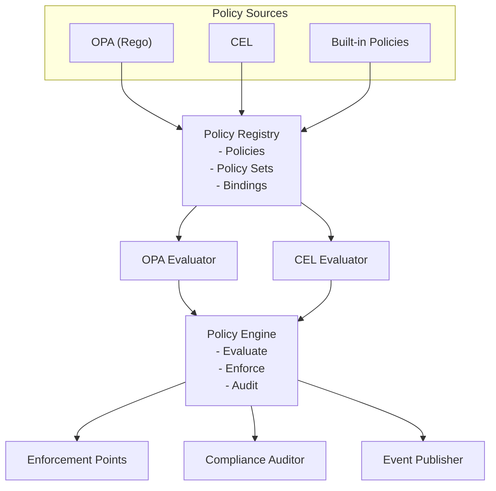

## Overview

Keystone Core's policy enforcement system enables you to define, enforce, and audit compliance policies across your infrastructure. Policies are written as code (using OPA Rego or CEL), evaluated automatically at key enforcement points, and violations are tracked for compliance reporting.

**Key Capabilities**:
- **Policy-as-Code**: Define policies in OPA (Rego) or CEL
- **Continuous Compliance**: Evaluate policies at runtime, not just deployment
- **Multiple Enforcement Modes**: Block, warn, audit
- **Enforcement Points**: Pre/post execution, state changes, drift detection, events
- **Compliance Reporting**: Track violations, compliance scores, audit trails
- **Automated Remediation**: React to policy violations automatically

## Architecture



## Policy Types

Keystone Core supports three policy types:

### 1. OPA (Open Policy Agent) - Rego

**Best for**: Complex policies with rich data structures

**Example** - SSH hardening policy:
```rego
package kscore.security.ssh

# SSH port must not be default (22)
deny[msg] {
    input.resource.type == "file"
    input.resource.path == "/etc/ssh/sshd_config"
    contains(input.resource.contents, "Port 22")
    msg := "SSH must not use default port 22"
}

# Root login must be disabled
deny[msg] {
    input.resource.type == "file"
    input.resource.path == "/etc/ssh/sshd_config"
    contains(input.resource.contents, "PermitRootLogin yes")
    msg := "SSH root login must be disabled"
}

# Password authentication must be disabled
deny[msg] {
    input.resource.type == "file"
    input.resource.path == "/etc/ssh/sshd_config"
    not contains(input.resource.contents, "PasswordAuthentication no")
    msg := "SSH password authentication must be disabled"
}
```

### 2. CEL (Common Expression Language)

**Best for**: Simple policies with boolean expressions

**Example** - Resource ownership policy:
```cel
// Resources must have an owner tag
resource.tags.contains("owner")

// Prod resources must not be shared
resource.environment == "production" && !resource.public

// Critical resources require approval
resource.critical && context.approved
```

### 3. Built-in Policies

**Best for**: Common patterns without writing code

Keystone Core provides 14 built-in policies that cover common security, compliance, and operational requirements without requiring OPA or CEL knowledge:

| Policy | Description |
|--------|-------------|
| `require-labels` | Require specific labels on resources |
| `require-owner` | Require owner/team annotations |
| `allowed-environments` | Restrict to specific environments |
| `allowed-actions` | Restrict to specific actions |
| `deny-privileged` | Block privileged execution |
| `allowed-users` | Restrict to specific users |
| `denied-users` | Block specific users |
| `time-window` | Restrict operations to time windows |
| `no-root-execution` | Block running as root |
| `require-approval` | Require approval for actions |
| `max-concurrent` | Limit concurrent operations |
| `resource-quota` | Enforce resource quotas |
| `pattern-deny` | Block resources matching patterns |
| `pattern-allow` | Only allow resources matching patterns |

#### Built-in Policy Configuration

Built-in policies use JSON configuration:

```yaml
id: "production-labels"
name: "Production Resource Labels"
type: builtin
category: compliance
severity: medium
enforcement: enforce
code: |
  {
    "name": "require-labels",
    "config": {
      "labels": ["env", "team", "cost-center"],
      "require_values": true
    }
  }
```

#### require-labels

Require specific labels on resources:

```json
{
  "name": "require-labels",
  "config": {
    "labels": ["env", "team", "owner"],
    "label_patterns": ["^app\\..*"],
    "require_values": true
  }
}
```

| Parameter | Type | Description |
|-----------|------|-------------|
| `labels` | []string | Required label keys |
| `label_patterns` | []string | Regex patterns for label keys |
| `require_values` | bool | If true, labels must have non-empty values |

#### require-owner

Require owner/team annotations:

```json
{
  "name": "require-owner",
  "config": {
    "owner_label": "owner",
    "team_label": "team",
    "valid_owners": ["alice@example.com", "bob@example.com"],
    "valid_teams": ["platform", "security", "sre"]
  }
}
```

| Parameter | Type | Description |
|-----------|------|-------------|
| `owner_label` | string | Label key for owner |
| `team_label` | string | Label key for team |
| `valid_owners` | []string | Optional list of valid owners |
| `valid_teams` | []string | Optional list of valid teams |

#### allowed-environments

Restrict operations to specific environments:

```json
{
  "name": "allowed-environments",
  "config": {
    "environments": ["dev", "staging", "production"],
    "environment_key": "environment"
  }
}
```

| Parameter | Type | Description |
|-----------|------|-------------|
| `environments` | []string | Allowed environment values |
| `environment_key` | string | Context key for environment (default: "environment") |

#### allowed-actions

Restrict to specific actions:

```json
{
  "name": "allowed-actions",
  "config": {
    "actions": ["read", "list", "get"],
    "action_patterns": ["^get.*", "^list.*"]
  }
}
```

| Parameter | Type | Description |
|-----------|------|-------------|
| `actions` | []string | Exact action names allowed |
| `action_patterns` | []string | Regex patterns for allowed actions |

#### deny-privileged

Block privileged execution:

```json
{
  "name": "deny-privileged",
  "config": {}
}
```

Blocks operations when:
- `context.privileged` is `true`
- `context.run_as_user` is `"root"` or `"0"`

#### allowed-users and denied-users

Control user access:

```json
{
  "name": "allowed-users",
  "config": {
    "users": ["alice", "bob", "ops-team"],
    "user_patterns": ["^admin-.*"],
    "groups": ["admins", "operators"]
  }
}
```

```json
{
  "name": "denied-users",
  "config": {
    "users": ["malicious", "banned"],
    "user_patterns": ["^bot-.*", "^test-.*"]
  }
}
```

| Parameter | Type | Description |
|-----------|------|-------------|
| `users` | []string | Exact usernames |
| `user_patterns` | []string | Regex patterns for usernames |
| `groups` | []string | Group names (from `context.user_groups`) |

#### time-window

Restrict operations to time windows:

```json
{
  "name": "time-window",
  "config": {
    "allowed_days": [1, 2, 3, 4, 5],
    "allowed_hours_start": 9,
    "allowed_hours_end": 17,
    "timezone": "America/New_York",
    "blocked_dates": ["2024-12-25", "2024-01-01"]
  }
}
```

| Parameter | Type | Description |
|-----------|------|-------------|
| `allowed_days` | []int | Days when allowed (0=Sunday, 6=Saturday) |
| `allowed_hours_start` | int | Start hour (0-23) |
| `allowed_hours_end` | int | End hour (0-23) |
| `timezone` | string | Timezone (default: UTC) |
| `blocked_dates` | []string | Specific dates to block (YYYY-MM-DD) |

#### no-root-execution

Block running as root with exceptions:

```json
{
  "name": "no-root-execution",
  "config": {
    "allowed_users": ["admin", "ops-lead"],
    "allowed_actions": ["system-maintenance", "emergency-fix"]
  }
}
```

| Parameter | Type | Description |
|-----------|------|-------------|
| `allowed_users` | []string | Users allowed to run as root |
| `allowed_actions` | []string | Actions allowed as root |

#### require-approval

Require approval for sensitive actions:

```json
{
  "name": "require-approval",
  "config": {
    "actions": ["delete", "terminate", "destroy"],
    "approvers": ["admin@example.com", "security@example.com"],
    "min_approvals": 2
  }
}
```

| Parameter | Type | Description |
|-----------|------|-------------|
| `actions` | []string | Actions requiring approval |
| `approvers` | []string | Users who can approve |
| `min_approvals` | int | Minimum approvals required |

Approval status is checked via `context.approved` boolean.

#### max-concurrent

Limit concurrent operations:

```json
{
  "name": "max-concurrent",
  "config": {
    "max_concurrent": 10,
    "scope": "global"
  }
}
```

| Parameter | Type | Description |
|-----------|------|-------------|
| `max_concurrent` | int | Maximum concurrent operations |
| `scope` | string | Count scope: "global", "user", "resource" |

Current count is provided via `context.concurrent_count`.

#### resource-quota

Enforce resource quotas:

```json
{
  "name": "resource-quota",
  "config": {
    "max_resources": 1000,
    "max_per_user": 50,
    "max_per_team": 200
  }
}
```

| Parameter | Type | Description |
|-----------|------|-------------|
| `max_resources` | int | Maximum total resources |
| `max_per_user` | int | Maximum resources per user |
| `max_per_team` | int | Maximum resources per team |

Counts are provided via `context.total_resources`, `context.user_resources`.

#### pattern-deny and pattern-allow

Control resources by name patterns:

```json
{
  "name": "pattern-deny",
  "config": {
    "patterns": ["^test-.*", "^dev-.*", ".*-deprecated$"],
    "field": "name"
  }
}
```

```json
{
  "name": "pattern-allow",
  "config": {
    "patterns": ["^prod-.*", "^staging-.*"],
    "field": "metadata.name"
  }
}
```

| Parameter | Type | Description |
|-----------|------|-------------|
| `patterns` | []string | Regex patterns to match |
| `field` | string | Resource field to match (default: "name", supports dot notation) |

#### Built-in Policy Examples

**Business Hours Only**:
```yaml
id: "business-hours-only"
name: "Business Hours Deployment Window"
type: builtin
category: operational
severity: medium
enforcement: enforce
code: |
  {
    "name": "time-window",
    "config": {
      "allowed_days": [1, 2, 3, 4, 5],
      "allowed_hours_start": 9,
      "allowed_hours_end": 17,
      "timezone": "America/New_York",
      "blocked_dates": ["2024-12-25", "2024-01-01"]
    }
  }
```

**No Production Deletion Without Approval**:
```yaml
id: "prod-delete-approval"
name: "Production Delete Requires Approval"
type: builtin
category: security
severity: critical
enforcement: enforce
code: |
  {
    "name": "require-approval",
    "config": {
      "actions": ["delete", "destroy", "terminate"],
      "min_approvals": 1
    }
  }
targets:
  - environment: production
```

**Block Test Resources in Production**:
```yaml
id: "no-test-in-prod"
name: "Block Test Resources in Production"
type: builtin
category: compliance
severity: high
enforcement: enforce
code: |
  {
    "name": "pattern-deny",
    "config": {
      "patterns": ["^test-.*", "^dev-.*", ".*-temp$"]
    }
  }
targets:
  - environment: production
```

## Policy Definition

### Policy Structure

```yaml
# Example: ssh-hardening.yaml
id: "ssh-hardening"
name: "SSH Security Hardening"
description: "Enforce SSH security best practices"

# Policy type
type: opa              # opa, cel, builtin

# Category
category: security     # security, compliance, operational, cost, custom

# Severity
severity: high         # low, medium, high, critical

# Enforcement mode
enforcement: enforce   # enforce, audit, warn

# Policy code
code: |
  package kscore.security.ssh

  deny[msg] {
      input.resource.type == "file"
      input.resource.path == "/etc/ssh/sshd_config"
      contains(input.resource.contents, "Port 22")
      msg := "SSH must not use default port 22"
  }

# Enforcement points
enforce_at:
  - pre_execution
  - on_change
  - on_drift

# Target resources
targets:
  - resource_type: file
    path: "/etc/ssh/sshd_config"
  - resource_type: service
    name: sshd
```

### Policy Sets

Group related policies:

```yaml
# Example: security-baseline.yaml
policy_set:
  id: "security-baseline"
  name: "Security Baseline"
  description: "Minimum security requirements for all systems"

  policies:
    - ssh-hardening
    - firewall-rules
    - user-permissions
    - package-updates

  # Apply to
  targets:
    - environment: production
    - datacenter: "*"
    - role: "*"
```

### Policy Bindings

Attach policies to resources:

```yaml
# Example: production-bindings.yaml
bindings:
  - policy_set: security-baseline
    target:
      environment: production
    actions:
      - state_apply
      - command_execute

  - policy: cost-optimization
    target:
      datacenter: us-east-1
      role: web
    actions:
      - state_apply
```

## Enforcement Modes

### Enforce

**Behavior**: Block operations that violate policy

```yaml
enforcement: enforce
```

**Result**: Policy violations prevent the operation from executing.

**Example**:
```bash
$ kscorectl state apply web-server.yaml

Policy Violation: ssh-hardening
  - SSH must not use default port 22
  - SSH root login must be disabled

ERROR: Policy enforcement failed. Operation blocked.
```

### Audit

**Behavior**: Allow operations but log violations

```yaml
enforcement: audit
```

**Result**: Policy violations are logged and tracked, but operations proceed.

**Example**:
```bash
$ kscorectl state apply web-server.yaml

Policy Violation: ssh-hardening (audit mode)
  - SSH must not use default port 22

WARNING: Policy violations detected (audit mode). See audit log for details.

State applied successfully.
```

### Warn

**Behavior**: Warn but allow operations

```yaml
enforcement: warn
```

**Result**: Policy violations display warnings but don't prevent execution.

**Example**:
```bash
$ kscorectl state apply web-server.yaml

Policy Warning: best-practices
  - Consider using systemd for service management

State applied successfully.
```

## Enforcement Points

Policies are evaluated at key points in the Keystone Core lifecycle:

### 1. Pre-Execution

Evaluate before command or state execution:

```yaml
enforce_at:
  - pre_execution
```

**Use case**: Block disallowed commands before execution

**Example**:
```rego
package kscore.execution

# Block rm -rf on production
deny[msg] {
    input.action == "command_execute"
    input.environment == "production"
    contains(input.command, "rm -rf")
    msg := "Dangerous command blocked on production"
}
```

### 2. Post-Execution

Evaluate after command or state execution:

```yaml
enforce_at:
  - post_execution
```

**Use case**: Verify expected outcomes

**Example**:
```rego
package kscore.execution

# Verify nginx service is running
deny[msg] {
    input.action == "state_apply"
    input.module == "service"
    input.name == "nginx"
    input.result.state != "running"
    msg := "Nginx service must be running"
}
```

### 3. On Change

Evaluate when resource state changes:

```yaml
enforce_at:
  - on_change
```

**Use case**: Validate configuration changes

**Example**:
```rego
package kscore.config

# Firewall must allow required ports
deny[msg] {
    input.resource.type == "file"
    input.resource.path == "/etc/iptables/rules.v4"
    not contains(input.resource.contents, "dport 443")
    msg := "Firewall must allow HTTPS (443)"
}
```

### 4. On Drift

Evaluate when configuration drift is detected:

```yaml
enforce_at:
  - on_drift
```

**Use case**: Auto-remediate critical drift

**Example**:
```rego
package kscore.drift

# Critical drift requires immediate remediation
deny[msg] {
    input.drift.severity == "critical"
    input.drift.resource == "ssh_config"
    msg := "Critical SSH configuration drift detected"
}
```

### 5. On Event

Evaluate on specific events:

```yaml
enforce_at:
  - on_event

event_filter: "type == 'agent.connect'"
```

**Use case**: Validate new agents meet compliance requirements

**Example**:
```rego
package kscore.agent

# New agents must meet security requirements
deny[msg] {
    input.event.type == "agent.connect"
    input.event.data.os == "linux"
    not input.event.data.selinux_enabled
    msg := "Linux agents must have SELinux enabled"
}
```

## Enforcement Actions

When policies are violated, Keystone Core can take automated actions:

### Block

Prevent the operation:

```yaml
action: block
```

### Warn

Display warning but allow:

```yaml
action: warn
```

### Audit

Log violation:

```yaml
action: audit
```

### Remediate

Automatically fix violation:

```yaml
action: remediate
remediation:
  type: state_apply
  state_file: "ssh-hardening.yaml"
```

## Policy Evaluation Context

Policies receive rich context:

### Resource Context

```json
{
  "resource": {
    "type": "file",
    "path": "/etc/ssh/sshd_config",
    "owner": "root",
    "mode": "0644",
    "contents": "..."
  }
}
```

### Action Context

```json
{
  "action": "command_execute",
  "command": "systemctl restart nginx",
  "user": "ops-user",
  "target": {
    "agent_id": "web-01",
    "datacenter": "us-east-1",
    "environment": "production",
    "role": "web"
  }
}
```

### Agent Context

```json
{
  "agent": {
    "id": "web-01",
    "datacenter": "us-east-1",
    "environment": "production",
    "role": "web",
    "os": "linux",
    "tags": ["nginx", "frontend"]
  }
}
```

### Environment Context

```json
{
  "context": {
    "environment": "production",
    "datacenter": "us-east-1",
    "time": "2024-01-15T10:30:00Z",
    "user": "ops-user"
  }
}
```

## Compliance Reporting

Track policy compliance over time:

### Compliance Score

```bash
$ kscorectl policy compliance --environment production

Overall Compliance: 87.5%

Policy Set: security-baseline
  Compliance: 92.3%
  Policies: 12 total, 11 compliant, 1 violating

Policy Set: operational-standards
  Compliance: 85.0%
  Policies: 20 total, 17 compliant, 3 violating

Top Violations:
  1. ssh-hardening (15 agents)
  2. firewall-rules (8 agents)
  3. package-updates (5 agents)
```

### Violation Report

```bash
$ kscorectl policy violations --policy ssh-hardening

Policy: ssh-hardening
Severity: high
Violations: 15

Agents:
  - web-01 (us-east-1, production)
    - SSH must not use default port 22
    - First detected: 2024-01-10T08:00:00Z
    - Last detected: 2024-01-15T10:30:00Z

  - web-02 (us-east-1, production)
    - SSH root login must be disabled
    - First detected: 2024-01-12T14:00:00Z
    - Last detected: 2024-01-15T10:30:00Z

Remediation: Run state apply with ssh-hardening.yaml
```

### Audit Trail

```bash
$ kscorectl policy audit --since 24h

Policy Evaluations (last 24 hours):
  Total: 1,234
  Allowed: 1,150 (93.2%)
  Denied: 84 (6.8%)

By Policy:
  - ssh-hardening: 250 evaluations, 235 allowed, 15 denied
  - firewall-rules: 180 evaluations, 172 allowed, 8 denied
  - package-updates: 150 evaluations, 145 allowed, 5 denied

By Environment:
  - production: 800 evaluations, 725 allowed, 75 denied
  - staging: 300 evaluations, 290 allowed, 10 denied
  - dev: 134 evaluations, 135 allowed, 0 denied
```

## Reactor Integration

Use reactors to automate policy enforcement:

### Auto-Remediate Violations

```yaml
auto_remediate_policy_violations:
  filter: "type == 'policy.violation' and data.severity >= 'high'"
  actions:
    - type: state_apply
      state_file: "{{ event.data.remediation_state }}"
      target: "agent_id == {{ event.source }}"
  conditions:
    throttle: "10m"
```

### Escalate Critical Violations

```yaml
escalate_critical_violations:
  filter: "type == 'policy.violation' and data.severity == 'critical'"
  actions:
    - type: webhook
      url: "https://pagerduty.example.com/events"
      body: |
        {
          "summary": "Critical policy violation: {{ event.data.policy_name }}",
          "source": "{{ event.source }}",
          "severity": "critical"
        }
```

### Report Compliance

```yaml
daily_compliance_report:
  schedule: "0 8 * * *"  # 8 AM daily
  actions:
    - type: command
      command: "kscorectl policy compliance --format json > /tmp/compliance-$(date +%Y%m%d).json"
    - type: webhook
      url: "https://slack.example.com/hooks/compliance"
      body: |
        {
          "text": "Daily compliance report generated"
        }
```

## Policy Examples

### Required Tags Policy

```rego
package kscore.compliance.tags

required_tags := ["owner", "environment", "cost-center"]

deny[msg] {
    input.resource.type == "file"
    tag := required_tags[_]
    not input.resource.tags[tag]
    msg := sprintf("Missing required tag: %v", [tag])
}
```

### Approved Package Versions

```rego
package kscore.compliance.packages

approved_versions := {
    "nginx": ["1.24.*", "1.25.*"],
    "postgresql": ["14.*", "15.*"]
}

deny[msg] {
    input.resource.type == "package"
    package_name := input.resource.name
    version := input.resource.version
    approved := approved_versions[package_name]
    not version_matches(version, approved)
    msg := sprintf("Package %v version %v not approved", [package_name, version])
}

version_matches(version, patterns) {
    pattern := patterns[_]
    glob.match(pattern, [], version)
}
```

### File Permission Policy

```rego
package kscore.security.permissions

# Sensitive files must not be world-readable
deny[msg] {
    input.resource.type == "file"
    is_sensitive(input.resource.path)
    is_world_readable(input.resource.mode)
    msg := sprintf("Sensitive file %v must not be world-readable", [input.resource.path])
}

is_sensitive(path) {
    sensitive_paths := ["/etc/ssh", "/etc/ssl", "/root"]
    startswith(path, sensitive_paths[_])
}

is_world_readable(mode) {
    # Check if mode has world-read bit (004)
    bits.and(mode, 4) == 4
}
```

### Environment-Specific Restrictions

```cel
// Production restrictions
resource.environment == "production" && (
  // No direct SSH access
  !(resource.type == "command" && resource.command.contains("ssh")) &&

  // No package removals
  !(resource.type == "package" && resource.state == "removed") &&

  // Services must be enabled
  (resource.type != "service" || resource.enabled == true)
)
```

### Cost Optimization

```cel
// Require cost-effective instance types in non-prod
resource.environment != "production" &&
resource.type == "compute" &&
resource.instance_type.matches("t3.*|t2.*")
```

## Best Practices

### Policy Design

1. **Start Simple**: Begin with audit mode, move to enforce gradually
2. **Specific Targets**: Target specific resources, not everything
3. **Clear Messages**: Write descriptive violation messages
4. **Test Thoroughly**: Test policies in dev before production
5. **Version Control**: Keep policies in Git

### Policy Organization

1. **Group by Category**: Security, compliance, operational, cost
2. **Use Policy Sets**: Group related policies
3. **Consistent Naming**: Use clear, descriptive policy IDs
4. **Document Policies**: Add descriptions and examples

### Enforcement

1. **Gradual Rollout**: Start with audit, then warn, then enforce
2. **Environment-Specific**: Use different enforcement for dev/prod
3. **Exemptions**: Allow exemptions with approval workflow
4. **Automated Remediation**: Use reactors for auto-remediation

### Compliance

1. **Regular Reports**: Generate compliance reports daily/weekly
2. **Track Trends**: Monitor compliance scores over time
3. **Address Violations**: Prioritize high-severity violations
4. **Audit Everything**: Keep comprehensive audit logs

## Monitoring

### Metrics

```
# Evaluations
kscore_policy_evaluations_total{policy,result}
kscore_policy_evaluation_duration_seconds{policy,quantile}

# Violations
kscore_policy_violations_total{policy,severity}
kscore_policy_violations_by_agent{agent,policy}

# Compliance
kscore_policy_compliance_score{policy_set,environment}
kscore_policy_compliant_agents{environment}

# Remediations
kscore_policy_remediations_total{policy,status}
```

### Events

- `policy.evaluation` - Policy evaluated
- `policy.pass` - Policy passed
- `policy.violation` - Policy violated
- `policy.remediation` - Remediation triggered

## Troubleshooting

### Policy Not Evaluating

**Problem**: Policy not being evaluated

Check:
```bash
# Verify policy is registered
kscorectl policy list

# Check policy bindings
kscorectl policy bindings --policy ssh-hardening

# Test policy evaluation
kscorectl policy test ssh-hardening --input test-input.json
```

### Policy Always Failing

**Problem**: Policy rejects all resources

Debug:
```bash
# Test with sample input
kscorectl policy test ssh-hardening --input sample.json --verbose

# Check policy code syntax
kscorectl policy validate ssh-hardening

# Review policy logic
kscorectl policy show ssh-hardening
```

### Compliance Score Incorrect

**Problem**: Compliance score doesn't match reality

Fix:
```bash
# Re-evaluate all policies
kscorectl policy evaluate --all --force

# Check audit data
kscorectl policy audit --since 24h

# Verify agent count
kscorectl agent list | wc -l
```

## Next Steps

- Learn about [Reactors](../reactors/) for automating policy responses
- Understand [Events](../events/) emitted during policy evaluation
- Explore [State Management](../state-management/) with policy enforcement
- See [GitOps Integration](../gitops/) for deployment policies
- Review [Observability](../observability/) for policy metrics
