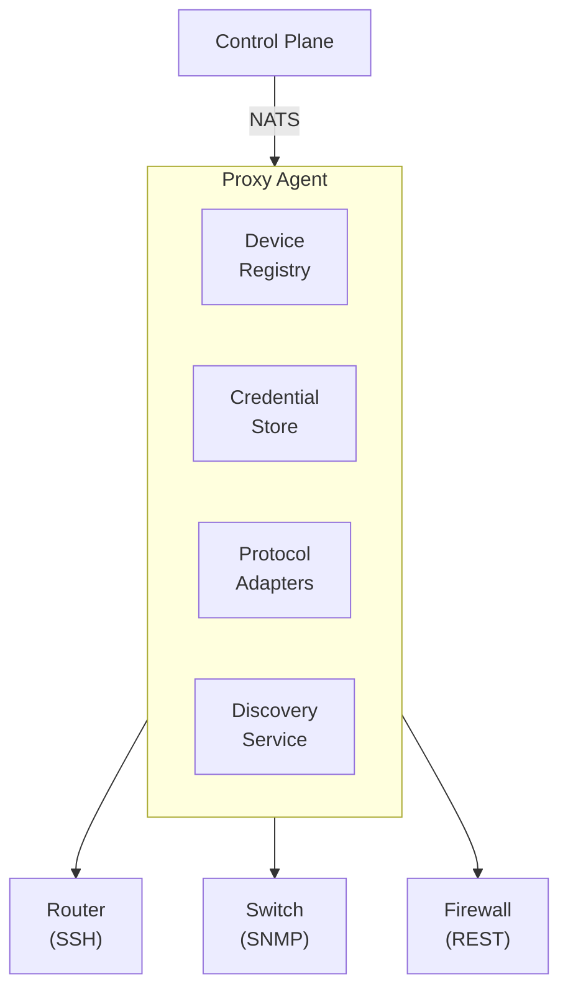

## Overview

Keystone Core proxy agents enable management of devices that cannot run the native agent software. This includes network hardware, legacy systems, IoT devices, and appliances that only expose management interfaces via SSH, SNMP, REST APIs, or WinRM.

**Key Capabilities**:
- **Protocol Adapters**: SSH, SNMP v2c/v3, REST/HTTP, WinRM
- **Network Device Support**: Cisco IOS/NX-OS, Juniper JUNOS, Arista EOS, VyOS, pfSense, OPNsense
- **Transparent Targeting**: Proxied devices appear as virtual agents in targeting expressions
- **Secure Credentials**: Encrypted storage with Vault, Kubernetes secrets, or file backends
- **Auto-Discovery**: Network scanning with vendor detection and approval workflows
- **State Modules**: Declarative configuration management for proxied devices

## Architecture



### How It Works

1. **Proxy Agent** runs on a host with network access to unmanaged devices
2. **Device Registry** maintains the list of proxied devices and their metadata
3. **Credential Store** securely manages authentication credentials
4. **Protocol Adapters** translate Keystone Core commands to device-specific protocols
5. **Proxied Devices** appear as virtual agents in the control plane

## Device Types

Proxy agents support various device types:

| Device Type | Description | Common Protocols |
|-------------|-------------|------------------|
| `linux` | Linux systems accessible via SSH | SSH |
| `windows` | Windows systems accessible via WinRM | WinRM |
| `network` | Generic network devices | SSH, SNMP |
| `router` | Routers (Cisco, Juniper, VyOS) | SSH, SNMP |
| `switch` | Switches (Cisco, Arista, HP) | SSH, SNMP |
| `firewall` | Firewalls (pfSense, Fortinet, Palo Alto) | SSH, REST |
| `apm` | Application Performance Monitors | REST |
| `iot` | IoT devices | REST, SNMP |
| `custom` | Custom device types | Any |

## Protocol Adapters

### SSH Adapter

For devices managed via SSH (most network equipment, Linux servers):

```yaml
# Device configuration
device:
  id: core-router-01
  type: router
  vendor: Cisco
  protocol: ssh
  address: 192.168.1.1
  port: 22
  credential_ref: cisco-ssh-creds
```

**Features**:
- Password and key-based authentication
- SSH agent forwarding
- Interactive and exec modes
- Banner grabbing for device identification
- Connection pooling

### SNMP Adapter

For devices exposing SNMP management interfaces:

```yaml
# SNMPv2c device
device:
  id: switch-01
  type: switch
  protocol: snmp
  address: 192.168.1.10
  port: 161
  credential_ref: snmp-community

# SNMPv3 device
device:
  id: switch-02
  type: switch
  protocol: snmp
  address: 192.168.1.11
  port: 161
  credential_ref: snmpv3-creds
```

**SNMPv3 Security Levels**:
- `noAuthNoPriv`: No authentication, no encryption
- `authNoPriv`: Authentication only (MD5, SHA, SHA-256, SHA-512)
- `authPriv`: Authentication and encryption (DES, AES-128, AES-192, AES-256)

### REST/HTTP Adapter

For devices with REST APIs (modern firewalls, cloud appliances):

```yaml
device:
  id: pfsense-fw
  type: firewall
  vendor: pfSense
  protocol: rest
  address: 192.168.1.254
  port: 443
  credential_ref: pfsense-api-key
```

**Authentication Methods**:
- Basic authentication
- Bearer tokens (JWT, API keys)
- API key headers
- OAuth2 client credentials

### WinRM Adapter

For Windows systems not running the native agent:

```yaml
device:
  id: legacy-server
  type: windows
  protocol: winrm
  address: 192.168.1.100
  port: 5985  # HTTP
  # port: 5986  # HTTPS
  credential_ref: winrm-creds
```

**Features**:
- NTLM and Kerberos authentication
- PowerShell and CMD execution
- TLS encryption (port 5986)

## Debugging and Protocol Tracing

Proxy agents include a protocol-level debug logger for troubleshooting device interactions. Debug output can be captured at different verbosity levels and rendered as text, JSON, or raw hex.

**Debug Levels**:
- `off`: No debug output
- `basic`: Connection lifecycle events and errors
- `verbose`: Commands and responses
- `trace`: Full protocol data including raw byte dumps

**Supported Protocol Labels**:
`ssh`, `snmp`, `rest`, `winrm`, `telnet`, `api`

**Event Types**:
`connect`, `disconnect`, `authenticate`, `send`, `receive`, `command`, `response`, `error`, `warning`, `handshake`, `keepalive`, `timeout`

**Notes**:
- `trace` includes hex dumps for request/response payloads.
- Output can be structured as JSON for ingestion into log pipelines.
- Sensitive fields can be redacted before logging.

## Credential Management

### Credential Types

| Type | Description | Use Case |
|------|-------------|----------|
| `ssh_password` | SSH username/password | Linux, network devices |
| `ssh_key` | SSH private key | Linux, network devices |
| `snmpv2c` | SNMPv2c community string | Legacy SNMP devices |
| `snmpv3` | SNMPv3 authentication | Secure SNMP devices |
| `winrm` | Windows credentials | Windows systems |
| `rest_basic` | HTTP Basic Auth | REST APIs |
| `rest_bearer` | Bearer token | REST APIs with JWT |
| `rest_apikey` | API key header | REST APIs |
| `rest_oauth2` | OAuth2 client credentials | Cloud APIs |

### Credential Storage Backends

**File-Based (Encrypted)**:
```yaml
credential_store:
  type: file
  path: /etc/kscore/credentials
  encryption_key_file: /etc/kscore/key
```

**HashiCorp Vault**:
```yaml
credential_store:
  type: vault
  address: https://vault.example.com:8200
  auth_method: token
  secret_path: secret/kscore/credentials
```

**Kubernetes Secrets**:
```yaml
credential_store:
  type: kubernetes
  namespace: kscore
  secret_prefix: device-creds-
```

### Creating Credentials

```bash
# SSH password credential
kscorectl proxy credential create cisco-ssh \
  --type ssh_password \
  --username admin \
  --password-file /path/to/password

# SSH key credential
kscorectl proxy credential create linux-key \
  --type ssh_key \
  --username root \
  --key-file ~/.ssh/id_ed25519

# SNMPv3 credential
kscorectl proxy credential create snmp-secure \
  --type snmpv3 \
  --username snmpuser \
  --auth-protocol sha256 \
  --auth-password secret123 \
  --priv-protocol aes256 \
  --priv-password encrypt456 \
  --security-level authPriv
```

## Discovery

### Network Discovery

The discovery service automatically finds devices on your network:

```yaml
discovery:
  scan_interval: 1h
  scan_timeout: 30s
  max_concurrent: 50
  auto_approve: false

  networks:
    - 192.168.1.0/24
    - 10.0.0.0/16

  exclude_networks:
    - 192.168.1.128/25

  exclude_hosts:
    - 192.168.1.1  # Gateway

  snmp_community: public
  ssh_port: 22
  snmp_port: 161
```

### Discovery Scanners

| Scanner | Protocol | Detection Method |
|---------|----------|------------------|
| ICMP | TCP Connect | Port reachability (22, 80, 443, 161) |
| SSH | SSH | Banner grabbing, vendor detection |
| SNMP | SNMP | sysDescr, sysName parsing |
| HTTP | HTTP/HTTPS | Server header, response parsing |
| WinRM | WinRM | Port 5985/5986 availability |

### Vendor Detection

Discovered devices are automatically matched to vendor profiles:

```
Cisco IOS:     "Cisco IOS Software" in sysDescr or "cisco" in SSH banner
Cisco NX-OS:   "NX-OS" in sysDescr or "Nexus" in model
Juniper JUNOS: "JUNOS" in sysDescr or "juniper" in SSH banner
Arista EOS:    "Arista" in sysDescr
pfSense:       "pfsense" in SSH banner or sysDescr
OPNsense:      "opnsense" in SSH banner or sysDescr
VyOS:          "vyos" or "vyatta" in SSH banner or sysDescr
```

### Approval Workflow

Discovered devices require approval before management:

```bash
# List pending devices
kscorectl proxy discovery list --status pending

# Approve a device
kscorectl proxy discovery approve device-id-123

# Approve by profile
kscorectl proxy discovery approve --profile cisco_ios

# Reject a device
kscorectl proxy discovery reject device-id-456

# Configure auto-approve for trusted profiles
kscorectl proxy discovery auto-approve --profile cisco_ios,juniper_junos
```

### Discovery Events

The discovery service emits events for integration with reactors:

| Event | Description |
|-------|-------------|
| `device.discovered` | New device found |
| `device.approved` | Device approved for management |
| `device.rejected` | Device rejected |
| `scan.started` | Discovery scan started |
| `scan.completed` | Discovery scan finished |

## State Modules

### SSH-Based Modules

For devices accessible via SSH:

```yaml
# Manage files via SSH
- id: deploy-config
  module: ssh_file
  params:
    path: /etc/myapp/config.yaml
    content: |
      setting: value
    mode: "0644"

# Execute commands
- id: restart-service
  module: ssh_cmd
  params:
    command: systemctl restart myapp

# Manage services
- id: enable-nginx
  module: ssh_service
  params:
    name: nginx
    state: running
    enabled: true

# Manage packages
- id: install-curl
  module: ssh_package
  params:
    name: curl
    state: installed
```

### SNMP Modules

For SNMP-managed devices:

```yaml
# Set SNMP value
- id: set-location
  module: snmp_value
  params:
    oid: 1.3.6.1.2.1.1.6.0  # sysLocation
    value: "Datacenter A, Rack 5"
    type: string

# Read SNMP table
- id: get-interfaces
  module: snmp_table
  params:
    oid: 1.3.6.1.2.1.2.2  # ifTable
    columns:
      - 1   # ifIndex
      - 2   # ifDescr
      - 8   # ifOperStatus
```

### Network Device Modules

Vendor-specific configuration modules:

**Cisco IOS**:
```yaml
- id: configure-interface
  module: ios_config
  params:
    commands:
      - interface GigabitEthernet0/1
      - description Uplink to Core
      - ip address 10.0.1.1 255.255.255.0
      - no shutdown
    save: true
```

**Juniper JUNOS**:
```yaml
- id: configure-interface
  module: junos_config
  params:
    commands:
      - set interfaces ge-0/0/0 description "Uplink to Core"
      - set interfaces ge-0/0/0 unit 0 family inet address 10.0.1.1/24
    commit: true
```

**Arista EOS**:
```yaml
- id: configure-vlan
  module: eos_config
  params:
    commands:
      - vlan 100
      - name Production
    save: true
```

**pfSense**:
```yaml
- id: add-firewall-rule
  module: pfsense_config
  params:
    section: filter
    rule:
      type: pass
      interface: wan
      protocol: tcp
      destination_port: 443
      description: Allow HTTPS
```

### WinRM Modules

For Windows systems via WinRM:

```yaml
# Manage files
- id: deploy-config
  module: winrm_file
  params:
    path: C:\Program Files\MyApp\config.json
    content: '{"setting": "value"}'

# Manage services
- id: start-service
  module: winrm_service
  params:
    name: MyAppService
    state: running
    start_mode: automatic

# Manage registry
- id: set-registry
  module: winrm_registry
  params:
    path: HKLM:\SOFTWARE\MyApp
    name: Setting
    value: enabled
    type: string

# Manage packages
- id: install-package
  module: winrm_package
  params:
    name: MyApp
    state: installed
    source: \\fileserver\packages\myapp.msi
```

## Vendor Adapters

### Supported Vendors

| Vendor | Type | Protocol | Adapter |
|--------|------|----------|---------|
| Cisco IOS | Router/Switch | SSH | `cisco_ios` |
| Cisco NX-OS | Switch | SSH | `cisco_nxos` |
| Juniper JUNOS | Router/Switch | SSH | `juniper_junos` |
| Arista EOS | Switch | SSH + eAPI | `arista_eos` |
| pfSense | Firewall | REST API | `pfsense` |
| OPNsense | Firewall | REST API | `opnsense` |
| VyOS/EdgeOS | Router | SSH | `vyos` |

### Vendor Adapter Interface

All vendor adapters provide:

```go
// Common vendor adapter methods
GetConfig(section string) (string, error)  // Get running config
SetConfig(commands []string) error          // Apply config commands
GetFacts() (*DeviceFacts, error)           // Get device metadata
SaveConfig() error                         // Save to startup config
```

### Device Facts

Vendor adapters collect device facts:

```json
{
  "hostname": "core-router-01",
  "vendor": "Cisco",
  "model": "ISR4451-X",
  "os_type": "IOS-XE",
  "os_version": "17.3.4a",
  "serial_number": "FDO12345ABC",
  "uptime": "45d 12h 30m",
  "interfaces": [
    {
      "name": "GigabitEthernet0/0/0",
      "mac_address": "00:1b:2c:3d:4e:5f",
      "ip_addresses": ["10.0.1.1/24"],
      "admin_status": "up",
      "oper_status": "up"
    }
  ],
  "memory_total": 4294967296,
  "memory_free": 2147483648,
  "cpu_usage": 15.5
}
```

## Targeting Proxied Devices

Proxied devices appear in targeting expressions like regular agents:

```bash
# Target by device ID
kscorectl exec run --target "device:core-router-01" "show version"

# Target by device type
kscorectl exec run --target "type:router" "show ip route"

# Target by vendor
kscorectl exec run --target "vendor:Cisco" "show running-config"

# Combined targeting
kscorectl exec run --target "type:switch and vendor:Arista" "show interfaces status"
```

## Drift Detection

Monitor configuration drift on proxied devices:

```yaml
drift:
  enabled: true
  check_interval: 1h
  baseline_store: /var/lib/kscore/baselines

  # Severity classification
  severity:
    critical:
      - running_config
      - startup_config
    high:
      - interface_status
      - routing_table
    medium:
      - snmp_config
      - ntp_config
    low:
      - logging_config
```

Events emitted when drift is detected:

```json
{
  "type": "state.drift",
  "device_id": "core-router-01",
  "severity": "high",
  "changes": [
    {
      "field": "interface.GigabitEthernet0/1.description",
      "expected": "Uplink to Core",
      "actual": "TEMP - Testing"
    }
  ]
}
```

## Observability

### Metrics

The proxy agent exposes Prometheus metrics:

| Metric | Type | Description |
|--------|------|-------------|
| `kscore_proxy_devices_total` | Gauge | Total proxied devices |
| `kscore_proxy_devices_healthy` | Gauge | Healthy devices |
| `kscore_proxy_devices_offline` | Gauge | Offline devices |
| `kscore_proxy_connections_total` | Counter | Total connections made |
| `kscore_proxy_connection_errors_total` | Counter | Connection errors |
| `kscore_proxy_command_latency_seconds` | Histogram | Command execution latency |
| `kscore_proxy_discovery_scans_total` | Counter | Discovery scans performed |
| `kscore_proxy_discovery_devices_found` | Gauge | Devices found in last scan |

### Health Monitoring

Health checks run periodically for all proxied devices:

```yaml
health:
  check_interval: 30s
  timeout: 10s
  consecutive_failures: 3  # Mark unhealthy after 3 failures

  # Device-specific thresholds
  thresholds:
    min_healthy_percent: 80
    degraded_percent: 60
```

### Grafana Dashboard

A pre-built dashboard is available at `deploy/grafana/dashboards/proxy-agents.json`:

- Device overview by status, vendor, and type
- Connection success rate and latency
- Command execution throughput
- Discovery statistics
- Drift detection events

## Configuration

### Proxy Agent Configuration

```yaml
# /etc/kscore/proxy-agent.yaml
proxy:
  # Control plane connection
  nats:
    urls:
      - nats://control-plane:4222

  # Device registry
  registry:
    type: file  # or postgres
    path: /var/lib/kscore/devices.json

  # Credential store
  credentials:
    type: vault
    address: https://vault.example.com:8200

  # Discovery service
  discovery:
    enabled: true
    scan_interval: 1h
    networks:
      - 192.168.0.0/16

  # Health monitoring
  health:
    check_interval: 30s

  # Observability
  metrics:
    enabled: true
    listen: :9090
```

### Device Profile

Define reusable device profiles:

```yaml
# Device profile for Cisco IOS routers
profiles:
  cisco_ios_router:
    type: router
    vendor: Cisco
    protocol: ssh
    port: 22
    vendor_adapter: cisco_ios

    # SSH settings
    ssh:
      timeout: 30s
      host_key_callback: insecure  # or file path

    # Vendor adapter settings
    vendor:
      enable_prompt: "#"
      config_prompt: "(config"
      disable_paging: true
      privilege_level: 15
```

## Best Practices

### Security

1. **Use SNMPv3** over SNMPv2c for SNMP-managed devices
2. **Encrypt credentials** using Vault or Kubernetes secrets in production
3. **Limit network access** - run proxy agents in management VLANs
4. **Rotate credentials** regularly using credential store features
5. **Use SSH keys** instead of passwords where possible

### Performance

1. **Set appropriate timeouts** for slow network devices
2. **Use connection pooling** for frequently accessed devices
3. **Limit concurrent connections** to avoid overwhelming devices
4. **Enable caching** for read-heavy operations (device facts)

### Reliability

1. **Deploy multiple proxy agents** for high availability
2. **Use discovery auto-approve** only for trusted network segments
3. **Monitor connection health** and set up alerts
4. **Keep baseline configurations** for drift detection
5. **Test state modules** in dry-run mode first

## Troubleshooting

### Device Not Reachable

```bash
# Check network connectivity
kscorectl proxy device ping device-id

# Check device status
kscorectl proxy device status device-id

# Test protocol adapter
kscorectl proxy device test device-id --verbose
```

### Authentication Failures

```bash
# Verify credential
kscorectl proxy credential verify cisco-ssh-creds

# Test connection with credential
kscorectl proxy device connect device-id --credential cisco-ssh-creds
```

### Discovery Issues

```bash
# Run manual discovery scan
kscorectl proxy discovery scan --network 192.168.1.0/24 --verbose

# Check discovery logs
kscorectl proxy discovery logs --tail 100

# List excluded hosts
kscorectl proxy discovery config show
```

### State Application Failures

```bash
# Run in dry-run mode
kscorectl proxy state apply --device device-id --dry-run

# Check state execution logs
kscorectl proxy state logs --device device-id --run-id run-123

# Verify device configuration
kscorectl proxy device config show device-id
```

## Next Steps

- Learn about [Agents](agents/) for native agent deployment
- Explore [State Management](state-management/) for declarative configuration
- See [Events](events/) for event-driven automation with proxied devices
- Review [Observability](observability/) for monitoring proxied devices
