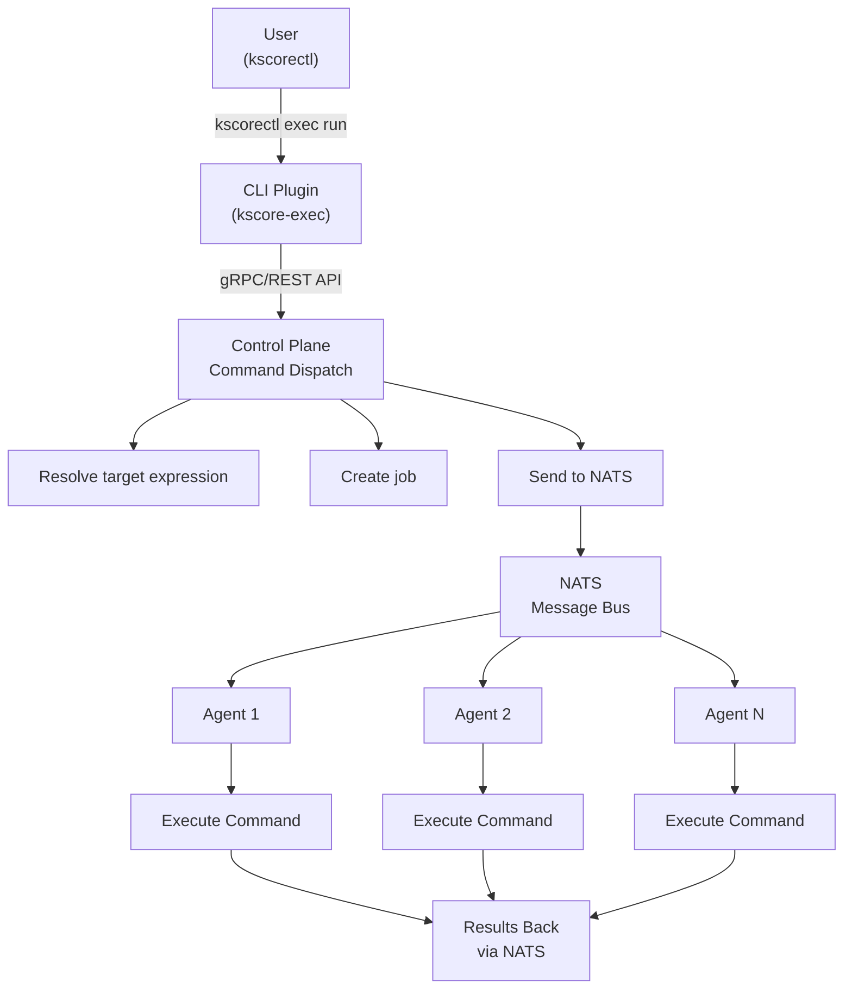
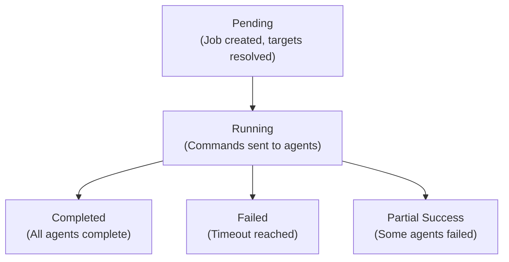

## Overview

Keystone Core's remote execution system enables you to run commands across your entire infrastructure with flexible targeting, batch processing, and real-time output streaming.

**Key Features**:

- **Flexible Targeting**: Glob patterns, expressions, compound filters
- **Batch Execution**: Control concurrency and parallelism
- **Cross-Platform**: Linux (bash), Windows (PowerShell/cmd), macOS
- **Real-Time Output**: Stream stdout/stderr as commands execute
- **Job Tracking**: Monitor execution status and results
- **Plugin Architecture**: Extensible CLI via Git-style plugins

## Command Execution Flow



## Targeting System

### Glob Patterns

Match agents by ID patterns:

```bash
# Single agent
kscorectl exec run "uptime" --target "web-01"

# All web servers
kscorectl exec run "systemctl status nginx" --target "web-*"

# All production database servers
kscorectl exec run "pg_dump mydb" --target "db-prod-*"

# Multiple patterns (OR logic)
kscorectl exec run "df -h" --target "web-*,api-*,cache-*"
```

### Expression-Based Targeting

Use expressions for complex targeting:

```bash
# All web servers in us-east-1 (direct label access)
kscorectl exec run "hostname" \
  --target "role:web and datacenter:us-east-1"

# Same as above using explicit labels. prefix
kscorectl exec run "hostname" \
  --target "labels.role:web and labels.datacenter:us-east-1"

# Production web or API servers
kscorectl exec run "free -h" \
  --target "environment:prod and (role:web or role:api)"

# Linux servers with >16GB RAM
kscorectl exec run "cat /proc/meminfo" \
  --target "os:linux and facts.memory_total > 17179869184"

# All agents except production
kscorectl exec run "apt-get update" \
  --target "environment != 'prod'"

# IPv6 network agents
kscorectl exec run "ip -6 addr" \
  --target "labels.network:ipv6"
```

### Available Fields

**Built-in Agent Fields**:

- `id` - Unique agent identifier
- `hostname` - Agent hostname
- `os` - Operating system (linux, windows, darwin)
- `arch` - Architecture (amd64, arm64)
- `platform_version` - OS/kernel version
- `agent_version` - Keystone Core agent version
- `status` - Agent status (agent_status_online, agent_status_offline)
- `ip` - IP addresses (comma-separated, supports glob matching)

**Custom Labels** (from agent configuration):

Labels can be accessed using **two equivalent syntaxes**:

- **Direct**: `role:web`, `datacenter:us-east-1`
- **Prefixed**: `labels.role:web`, `labels.datacenter:us-east-1`

Both syntaxes work identically. The prefixed form (`labels.`) is useful when you want to be explicit that you're matching a custom label rather than a built-in field.

Common custom labels:

- `role` / `labels.role` - Server role (web, api, db, cache)
- `datacenter` / `labels.datacenter` - Physical location
- `environment` / `labels.environment` - Environment (dev, staging, prod)
- `team` / `labels.team` - Owning team
- `network` / `labels.network` - Network type (ipv4, ipv6, dual-stack)

**Facts** (runtime metadata):

- `facts.cpu_count` - CPU cores
- `facts.memory_total` - Total RAM in bytes
- `facts.hostname` - Hostname
- `facts.ip` - Primary IP address

### Compound Expressions

Combine multiple conditions with logical operators:

```bash
# AND
--target "role:web and datacenter:us-east-1 and environment:prod"

# OR
--target "role:web or role:api"

# NOT
--target "not environment:prod"

# Parentheses for grouping
--target "(role:web or role:api) and datacenter:us-east-1"

# Complex
--target "environment:prod and (role:web or (role:api and tags contains 'public'))"
```

## Execution Modes

### Synchronous Execution

Wait for all agents to complete (default):

```bash
kscorectl exec run "hostname" --target "role:web"
```

Output:

```
Executing on 3 agent(s)...

Agent: web-01
Status: success
Exit Code: 0
Output:
web-01.example.com

Agent: web-02
Status: success
Exit Code: 0
Output:
web-02.example.com

Agent: web-03
Status: success
Exit Code: 0
Output:
web-03.example.com

Summary: 3 succeeded, 0 failed
Duration: 1.2s
```

### Job Tracking

Assign a job ID to make results easy to find later:

```bash
kscorectl exec run "apt-get update" --target "os:linux" --job-id job-123

# Check status
kscorectl exec status job-123
```

### Batch Execution

Control concurrency to avoid overwhelming infrastructure:

```bash
# Execute on max 10 agents at a time
kscorectl exec run "systemctl restart app" \
  --target "role:web" \
  --concurrency 10
```

Execution pattern:

```
Batch 1: [web-01, web-02, ..., web-10] ← Execute
   ↓ (wait for completion)
Batch 2: [web-11, web-12, ..., web-20] ← Execute
   ↓ (wait 30s)
Batch 3: [web-21, web-22, ..., web-30] ← Execute
...
```

## Cross-Platform Support

### Linux (bash/sh)

Default shell is bash:

```bash
kscorectl exec run "ps aux | grep nginx" --target "os:linux"
```

Specify shell explicitly:

```bash
kscorectl exec run "echo \$SHELL" --target "os:linux" -- bash -lc 'echo $SHELL'
```

### Windows (PowerShell/cmd)

PowerShell (default on Windows):

```bash
kscorectl exec run "Get-Process | Where-Object {$_.CPU -gt 10}" \
  --target "os:windows"
```

Command Prompt:

```bash
kscorectl exec run "dir C:\\" --target "os:windows" -- cmd /c dir C:\
```

### macOS (bash/zsh)

macOS agents (zsh is default on macOS 10.15+):

```bash
kscorectl exec run "sw_vers" --target "os:darwin"
```

## Job Management

### Job Lifecycle



### Job Tracking

```bash
# List recent jobs
kscorectl exec list

# Get job details
kscorectl exec status <job-id>
```

### Job Results

Each job result includes:

```go
type JobResult struct {
    AgentID    string        // Which agent
    Status     string        // success, failed, timeout
    ExitCode   int           // Command exit code
    Stdout     string        // Standard output
    Stderr     string        // Standard error
    StartTime  time.Time     // When execution started
    Duration   time.Duration // How long it took
    Error      string        // Error message (if failed)
}
```

## Timeout Handling

### Command Timeouts

Set maximum execution time:

```bash
# 30 second timeout
kscorectl exec run "long-running-command" \
  --target "role:web" \
  --command-timeout 30

# 5 minute timeout
kscorectl exec run "database-backup" \
  --target "role:db" \
  --command-timeout 300
```

Behavior on timeout:

- Agent kills process after timeout
- Returns exit code 124 (timeout)
- Stderr contains "Command timed out after Xs"

If any agent hasn't completed after 10 minutes:

- Job is marked as failed
- Incomplete agents marked as timed out
- Completed agents' results are preserved

## Output Streaming

### Real-Time Output

Stream command output as it executes:

```bash
kscorectl exec run "tail -f /var/log/app.log" \
  --target "web-01" \
  --stream
```

Output appears in real-time:

```
[web-01] 2024-01-15 10:23:45 INFO Starting application
[web-01] 2024-01-15 10:23:46 INFO Connecting to database
[web-01] 2024-01-15 10:23:47 INFO Server listening on :8080
...
```

### Progress Controls

Control progress and per-agent output:

```bash
# Show progress only
kscorectl exec run "systemctl restart app" --target "role:web" --show-results=false
```

## Error Handling

### Partial Failures

When some agents fail, continue with others (default):

```bash
kscorectl exec run "systemctl restart nginx" --target "role:web"
```

Output:

```
Agent: web-01
Status: success
Exit Code: 0

Agent: web-02
Status: failed
Exit Code: 1
Stderr: Failed to restart nginx.service: Unit not found

Agent: web-03
Status: success
Exit Code: 0

Summary: 2 succeeded, 1 failed
```

Exit code: Non-zero if any failures

### Fail-Fast Mode

Stop on first failure:

```bash
kscorectl exec run "migrate-database" \
  --target "role:db" \
  --continue-on-failure=false
```

First failure stops execution on remaining agents.

### Retry Logic

Retry failed commands:

```bash
kscorectl exec run "flaky-command" \
  --target "role:web" \
  --retries 3 \
  --retry-delay 5s
```

Retry behavior:

1. First attempt fails → wait 5s
2. Second attempt fails → wait 5s
3. Third attempt fails → wait 5s
4. Fourth attempt fails → give up

## Plugin Architecture

Keystone Core uses a Git-style plugin system for CLI extensibility.

### Plugin Discovery

The `kscorectl` binary searches for `kscore-*` executables in `$PATH`:

```
kscorectl exec run "cmd"
   ↓
Searches for: kscore-exec
   ↓
Executes: kscore-exec run "cmd"
```

### Built-in Plugins

**kscore-exec** - Remote execution:

- `kscorectl exec run` - Execute command
- `kscorectl exec status` - Check job status
- `kscorectl exec list` - List recent jobs

**kscore-state** - State management:

- `kscorectl state apply` - Apply state
- `kscorectl state check` - Check state (dry-run)
- `kscorectl state drift` - Detect drift

**kscore-module** - Module management:

- `kscorectl module install` - Install module
- `kscorectl module list` - List modules
- `kscorectl module update` - Update modules

### Custom Plugins

Create custom plugins by naming them `kscore-<name>`:

```bash
#!/bin/bash
# kscore-hello

echo "Hello from custom plugin!"
echo "Args: $@"
```

Make executable and add to PATH:

```bash
chmod +x kscore-hello
mv kscore-hello /usr/local/bin/
```

Use as:

```bash
kscorectl hello world
# Output: Hello from custom plugin!
#         Args: world
```

## Security

### Command Sandboxing

Agents can sandbox command execution:

```yaml
# Agent config
security:
  sandbox: true
  allowed_commands:
    - /usr/bin/systemctl
    - /usr/bin/apt-get
    - /bin/ps
  blocked_commands:
    - rm
    - dd
```

### User Switching (RunAs)

Execute commands as a specific user on the target system. This is useful for running commands with appropriate privileges without giving the agent root access to everything.

**CLI Usage:**

```bash
# Run as specific user
kscorectl exec run "whoami" --target "role:web" --user "www-data"

# Run package installation as root
kscorectl exec run "apt-get install -y nginx" --target "role:web" --user "root"

# Run application commands as service user
kscorectl exec run "/opt/app/bin/migrate" --target "role:api" --user "appuser"
```

**Platform Support:**

| Platform | Mechanism | Requirements |
|----------|-----------|--------------|
| Linux | setuid/setgid | Agent runs as root |
| macOS | setuid/setgid | Agent runs as root |
| BSD | setuid/setgid | Agent runs as root |
| Windows | Not supported | Use Windows services or scheduled tasks |

**How It Works (Unix):**

1. Agent looks up the target user by name or UID
2. Retrieves UID, GID, and supplementary groups
3. Sets `HOME` and `USER` environment variables
4. Executes command with user's credentials via `syscall.Credential`

**Configuration:**

```yaml
# Agent config - allow user switching
security:
  allow_user_switching: true
  allowed_users:
    - root
    - www-data
    - appuser
    - postgres
```

**Error Handling:**

```bash
# User doesn't exist
kscorectl exec run "cmd" --target "web-01" --user "nonexistent"
# Error: user "nonexistent" not found

# Agent not running as root
kscorectl exec run "cmd" --target "web-01" --user "www-data"
# Error: switching to user "www-data" requires root privileges

# Windows (not supported)
kscorectl exec run "cmd" --target "windows-01" --user "Administrator"
# Error: user switching on Windows requires password-based authentication
```

**Best Practices:**

1. **Principle of Least Privilege**: Run commands as the minimum required user
2. **Avoid Root When Possible**: Use service users for application commands
3. **Allowlist Users**: Configure `allowed_users` to restrict which users can be switched to
4. **Audit User Switching**: Monitor audit logs for user switching events

**Example: Database Backup**

```bash
# Run backup as postgres user (has access to data directory)
kscorectl exec run "pg_dump mydb > /backup/mydb.sql" \
  --target "role:db" \
  --user "postgres" \
  --command-timeout 1800
```

**Example: Web Server Restart**

```bash
# Restart nginx as root
kscorectl exec run "systemctl restart nginx" \
  --target "role:web" \
  --user "root"
```

**Example: Application Deployment**

```bash
# Deploy as application user
kscorectl exec run "/opt/app/bin/deploy.sh" \
  --target "role:api" \
  --user "appuser" \
  --env "DEPLOY_VERSION=1.2.3"
```

### Execution Permissions

Commands run with agent's permissions by default.

Run as specific user:

```yaml
security:
  run_as_user: "appuser"
```

### Sudo/Elevation

Require explicit sudo in command:

```bash
# Explicit sudo required
kscorectl exec run "sudo systemctl restart nginx" --target "role:web"

# No implicit elevation
kscorectl exec run "systemctl restart nginx" --target "role:web"
# → Fails with permission denied (unless agent runs as root)

# Alternative: Use --user flag (requires agent running as root)
kscorectl exec run "systemctl restart nginx" --target "role:web" --user "root"
```

## Performance

### Throughput

Maximum command execution rates:

- **Single control plane**: 10,000 commands/sec
- **Clustered**: 100,000+ commands/sec
- **Agents**: Each agent handles 100 concurrent commands

### Latency

Typical latencies (p95):

- **Command dispatch**: <50ms (control plane → agent)
- **Execution start**: <100ms (agent receives → starts)
- **Result return**: <20ms (agent → control plane)

Total: ~170ms overhead (plus actual command execution time)

### Scaling

**Small deployment** (100 agents):

- 1 control plane
- 10,000 commands/sec capacity
- Typical: 100-1,000 commands/sec

**Large deployment** (10,000 agents):

- 3+ control plane instances (HA)
- 100,000+ commands/sec capacity
- Batch execution recommended

## Best Practices

### Targeting

1. **Be Specific**: Use narrow targets to avoid accidents

   ```bash
   # Good
   --target "role:web and datacenter:us-east-1 and environment:staging"

   # Risky
   --target "role:web"  # Hits ALL web servers in ALL environments
   ```

2. **Test First**: Target a single agent first

   ```bash
   # Test on one agent
   kscorectl exec run "risky-command" --target "web-01"

   # Then expand
   kscorectl exec run "risky-command" --target "role:web and environment:staging"
   ```

3. **Use Tags**: Tag critical servers for exclusion

   ```bash
   --target "role:web and not tags contains 'critical'"
   ```

### Batch Execution

1. **Start Small**: Use limited concurrency for risky operations

   ```bash
   --concurrency 5  # For service restarts
   --concurrency 20 # For package updates
   ```

2. **Monitor**: Watch for issues in early batches before continuing

### Commands

1. **Idempotent**: Commands should be safe to run multiple times

   ```bash
   # Good (idempotent)
   systemctl restart nginx

   # Risky (not idempotent)
   echo "config" >> /etc/app.conf  # Appends every time
   ```

2. **Timeouts**: Always set reasonable timeouts

   ```bash
   --command-timeout 300  # For long-running commands
   ```

3. **Error Handling**: Check exit codes in scripts

   ```bash
   kscorectl exec run "set -e; cmd1; cmd2; cmd3" --target "..."
   ```

### Output

1. **Capture Output**: Save output for audit/debugging

   ```bash
   kscorectl exec run "command" --target "..." > output.log 2>&1
   ```

2. **Filter Output**: Use standard shell tools for filtering

   ```bash
   kscorectl exec run "command" --target "..." | grep "expected"
   ```

## Examples

### Rolling Restart

Restart services with zero downtime:

```bash
kscorectl exec run "systemctl restart nginx" \
  --target "role:web and environment:prod" \
  --concurrency 1
```

### Package Updates

Update packages across fleet:

```bash
# Ubuntu/Debian
kscorectl exec run "apt-get update && apt-get upgrade -y" \
  --target "os:linux and environment:staging" \
  --concurrency 10 \
  --command-timeout 600

# RHEL/CentOS
kscorectl exec run "yum update -y" \
  --target "os:linux and environment:staging" \
  --concurrency 10 \
  --command-timeout 600
```

### Health Checks

Check service health across infrastructure:

```bash
kscorectl exec run "systemctl is-active nginx" \
  --target "role:web"
```

### Log Collection

Collect logs from all servers:

```bash
kscorectl exec run "tail -100 /var/log/app.log" \
  --target "role:web and environment:prod" \
  > logs.txt
```

### Resource Usage

Check resource usage:

```bash
# CPU
kscorectl exec run "top -bn1 | head -20" --target "role:web"

# Memory
kscorectl exec run "free -h" --target "role:web"

# Disk
kscorectl exec run "df -h" --target "role:web"
```

## Output Retention and Archival

Command output is stored for troubleshooting, auditing, and compliance. Configure retention policies to balance storage costs with operational needs.

### Storage Locations

Command output is stored in two locations:

| Location | Content | Default Retention | Purpose |
|----------|---------|-------------------|---------|
| Database | Metadata, exit codes, truncated output | 30 days | Quick queries, UI display |
| Object Storage | Full stdout/stderr | 90 days | Full output retrieval, archival |

### Retention Configuration

Configure retention in the control plane:

```yaml
# server.yaml
execution:
  output:
    # Database retention (metadata and truncated output)
    retention:
      default: 30d           # Default retention period
      max: 365d              # Maximum allowed retention
      min: 1d                # Minimum retention

    # Per-output size limits
    truncation:
      stdout_max: 1MB        # Max stdout stored in DB
      stderr_max: 256KB      # Max stderr stored in DB
      combined_max: 2MB      # Total output limit

    # Object storage for full output
    storage:
      enabled: true
      backend: s3            # s3, gcs, azure, local
      bucket: kscore-output
      prefix: command-output/
      retention: 90d

    # Cleanup schedule
    cleanup:
      schedule: "0 2 * * *"  # Daily at 2 AM
      batch_size: 10000      # Records per cleanup batch
```

### Per-Job Retention

Override retention for specific jobs:

```bash
# Keep output for 1 year (compliance requirement)
kscorectl exec run "audit-command" \
  --target "role:db" \
  --retention 365d

# Keep output for only 1 day (sensitive data)
kscorectl exec run "show-secrets" \
  --target "web-01" \
  --retention 1d

# Don't store output at all
kscorectl exec run "interactive-debug" \
  --target "web-01" \
  --retention 0
```

### Output Truncation

Large command output is truncated in the database, with full output available in object storage:

```yaml
# Default truncation settings
truncation:
  stdout_max: 1MB          # First 1MB in database
  stderr_max: 256KB        # First 256KB in database
  tail_size: 64KB          # Also keep last 64KB
```

When output exceeds limits:

1. Database stores first N bytes + last M bytes
2. Full output stored in object storage
3. Metadata includes `truncated: true` flag
4. Link provided to full output

### Archival Options

#### Archive to Object Storage

Move old output to cold storage:

```yaml
execution:
  output:
    archival:
      enabled: true
      after: 30d             # Archive after 30 days
      backend: s3
      bucket: kscore-archive
      storage_class: GLACIER # Use cold storage tier
      retention: 7y          # Keep archives for 7 years
```

**Supported Storage Classes:**

| Provider | Hot | Warm | Cold | Archive |
|----------|-----|------|------|---------|
| AWS S3 | STANDARD | STANDARD_IA | GLACIER_IR | GLACIER_DEEP |
| GCS | STANDARD | NEARLINE | COLDLINE | ARCHIVE |
| Azure | Hot | Cool | Cold | Archive |

### Retrieval

#### Get Job Output

```bash
# Get job output
kscorectl exec output job-123

# Get output for specific agent
kscorectl exec output job-123 --agent web-01

# Show only last 50 lines
kscorectl exec output job-123 --tail 50

# Follow output in real-time (for running jobs)
kscorectl exec output job-123 --follow

# Output as JSON
kscorectl exec output job-123 -o json
```

### Cleanup Policies

Output retention and cleanup are managed through control plane configuration:

```yaml
execution:
  output:
    cleanup:
      enabled: true
      schedule: "0 2 * * *"    # Run daily at 2 AM
      batch_size: 10000        # Process 10k records per run
      dry_run: false           # Set true to test
      notify_on_error: true    # Alert on cleanup failures
```

> **Note**: Output archival, export, and manual cleanup commands (`exec archive`, `exec export`, `exec cleanup`) are planned but not yet implemented. Configure retention policies in the control plane configuration.

### Storage Sizing Guidelines

Estimate storage requirements:

| Metric | Typical Value | Notes |
|--------|---------------|-------|
| Avg output size | 10-50 KB | Varies by command type |
| Commands/day | 1,000-10,000 | Depends on automation level |
| Metadata overhead | 1 KB/command | Fixed per command |

**Storage Calculation:**

```
Daily storage = Commands/day × (Avg output + Metadata)
Monthly storage = Daily storage × 30 × (1 + archive_factor)
```

**Example (medium deployment):**

- 5,000 commands/day × 30 KB average = 150 MB/day
- 30 days retention = 4.5 GB
- With 90-day archive = 13.5 GB total

### Monitoring

```promql
# Output storage usage
kscore_execution_output_bytes_total

# Cleanup metrics
kscore_execution_cleanup_deleted_total
kscore_execution_cleanup_errors_total
kscore_execution_cleanup_duration_seconds

# Archive metrics
kscore_execution_archive_bytes_total
kscore_execution_archive_objects_total
```

**Alert Examples:**

```yaml
# Alert when storage usage high
- alert: ExecutionOutputStorageHigh
  expr: kscore_execution_output_bytes_total > 100e9  # 100GB
  for: 1h
  labels:
    severity: warning

# Alert when cleanup failing
- alert: ExecutionCleanupFailing
  expr: increase(kscore_execution_cleanup_errors_total[1d]) > 0
  for: 1h
  labels:
    severity: warning
```

### Security Considerations

1. **Sensitive Data**: Output may contain secrets - configure short retention or disable storage:

   ```bash
   kscorectl exec run "show-password" --retention 0
   ```

2. **Access Control**: Restrict who can retrieve output:

   ```yaml
   rbac:
     roles:
       - name: operator
         permissions:
           - execution.run
           - execution.output.recent   # Last 24h only
       - name: admin
         permissions:
           - execution.output.all      # All output
           - execution.output.archive  # Archived output
   ```

3. **Encryption**: Enable encryption at rest:

   ```yaml
   execution:
     output:
       storage:
         encryption:
           enabled: true
           kms_key: alias/kscore-output
   ```

4. **Audit Logging**: Track output access:

   ```yaml
   audit:
     log_output_access: true
   ```

## Troubleshooting

### Command Not Executing

**Problem**: Command doesn't run on any agents

Check:

- Target expression matches agents: `kscorectl agent list`
- Agents are online: `kscorectl agent list --status online`
- Network connectivity: agents can reach control plane

Debug:

```bash
# List agents matching target
kscorectl agent list --filter "role:web"

# Try simple command first
kscorectl exec run "hostname" --target "role:web"
```

### Timeout Issues

**Problem**: Commands timing out

Check:

- Command actually completes in timeout window
- Network latency not delaying results

Fix:

```bash
# Increase timeout
--command-timeout 600

# Test command locally first
ssh agent-01 "command"
```

### Permission Denied

**Problem**: "Permission denied" errors

Check:

- Agent user has required permissions
- Sudo configured if needed
- Command in allowed_commands list

Fix:

```bash
# Use explicit sudo
kscorectl exec run "sudo command" --target "..."

# Or configure agent to run as privileged user
```

### Partial Failures

**Problem**: Some agents succeed, others fail

Debug:

```bash
# Get job status
kscorectl exec status <job-id>

# Check specific failed agent
kscorectl exec run "command" --target "failed-agent-id"
```

## Next Steps

- Learn about [State Management](/docs/concepts/state-management/) for declarative configuration
- Understand [Events](/docs/concepts/events/) emitted during command execution
- Explore [Control Plane](/docs/concepts/control-plane/) command dispatcher details
- See [Agents](/docs/concepts/agents/) for command execution internals
