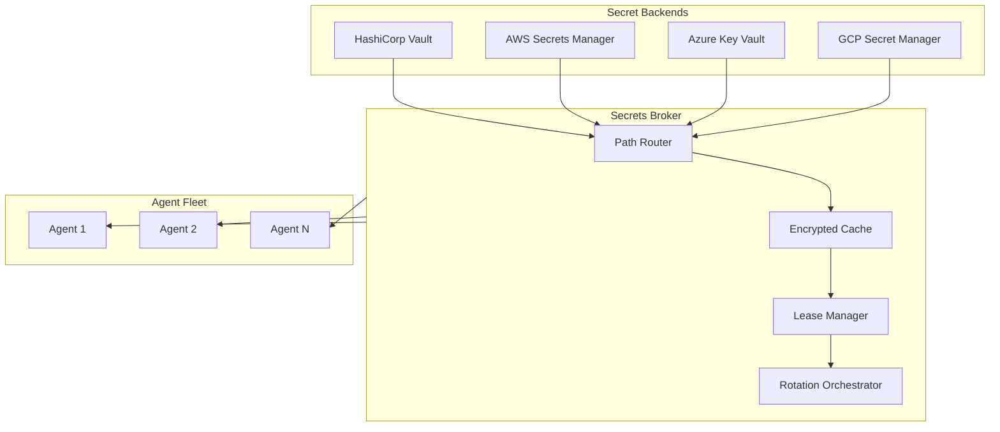
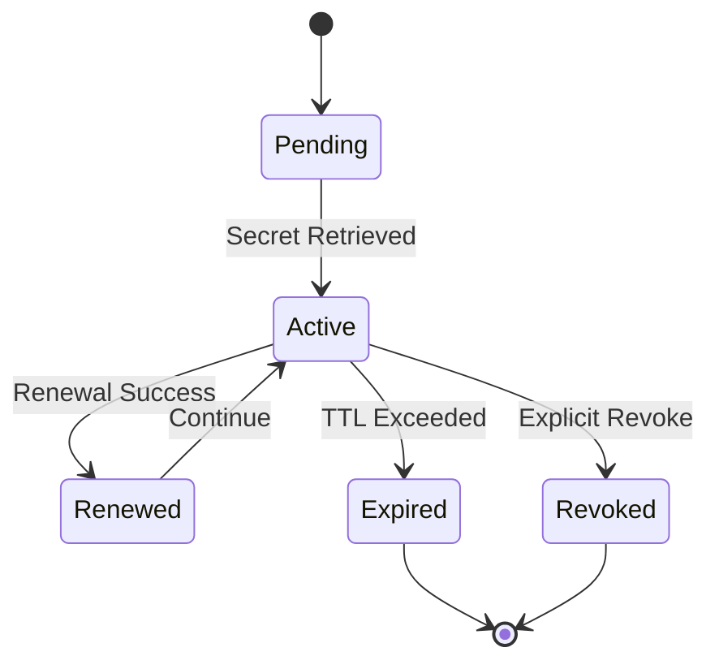
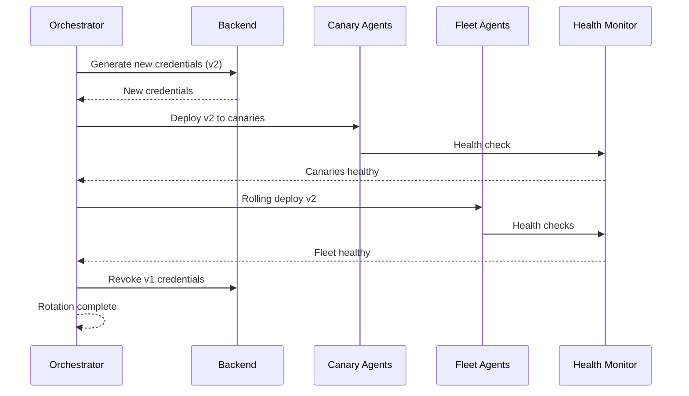

## Overview

Keystone Core provides deep integration with enterprise secret management systems, enabling secure handling of credentials, API keys, certificates, and other sensitive data across your infrastructure. The secrets management system acts as a broker that retrieves secrets on-demand from authoritative sources, manages their lifecycle, and delivers them securely to agents and workloads.

**Key Principle**: Secrets are never stored at rest in Keystone Core. Instead, Keystone Core retrieves secrets dynamically, caches them securely in memory with encryption, and delivers them to applications with proper lifecycle management.

## Architecture



## Core Concepts

### Secret Backends

Secret backends are the authoritative sources for secrets. Keystone Core supports multiple backend types:

| Backend | Description | Use Cases |
|---------|-------------|-----------|
| HashiCorp Vault | Full-featured secret management with dynamic secrets | Enterprise deployments, dynamic credentials |
| AWS Secrets Manager | AWS-native secret storage with rotation | AWS workloads, RDS credentials |
| Azure Key Vault | Azure-native secret and key management | Azure workloads, managed identities |
| GCP Secret Manager | GCP-native secret storage | GCP workloads, workload identity |

### Path-Based Routing

Secrets are accessed via paths that route to the appropriate backend:

```yaml
secrets:
  routing:
    # Vault handles database credentials
    "database/*": vault

    # AWS handles production API keys
    "api/production/*": aws

    # Azure handles Azure-specific secrets
    "azure/*": azure

    # GCP handles GCP workloads
    "gcp/*": gcp
```

### Secret Types

#### Static Secrets

Traditional key-value secrets that don't change automatically:

```yaml
# Reading a static secret
path: "kv/data/myapp/config"
data:
  username: "app_user"
  password: "s3cr3t"
```

#### Dynamic Secrets

Credentials generated on-demand with automatic expiration:

```yaml
# Database credentials generated per-request
path: "database/creds/readonly"
data:
  username: "v-token-readonly-abc123"
  password: "generated-password-xyz"
lease_id: "database/creds/readonly/abc123"
lease_duration: 3600
renewable: true
```

#### Transit Secrets

Encryption-as-a-service without exposing keys:

```yaml
# Encrypt data using transit engine
operation: encrypt
key: "my-encryption-key"
plaintext: "sensitive data"
result:
  ciphertext: "vault:v1:abc123..."
```

## Lease Management

Dynamic secrets have associated leases that track their lifecycle:

### Lease States



### Lease Properties

| Property | Description |
|----------|-------------|
| Lease ID | Unique identifier for tracking |
| TTL | Time-to-live before expiration |
| Renewable | Whether the lease can be extended |
| Max TTL | Maximum lifetime even with renewals |
| Increment | Requested TTL extension on renewal |

### Renewal Strategies

Configure how leases are renewed:

```yaml
secrets:
  lease_management:
    # Renew at 50% of TTL (recommended)
    strategy: eager

    # Or renew at 90% of TTL (fewer API calls)
    # strategy: lazy

    # Or renew only when accessed
    # strategy: on_demand

    # Grace period for renewal failures
    grace_period: 5m
```

## Secret Rotation

Keystone Core orchestrates secret rotation across your infrastructure without downtime.

### Rotation Strategies

#### Blue-Green Rotation

Generate new credentials, switch atomically, revoke old:

```yaml
rotation:
  strategy: blue_green
  verification:
    type: health_check
    endpoint: /health
    timeout: 30s
```

#### Rolling Rotation

Update consumers incrementally:

```yaml
rotation:
  strategy: rolling
  batch_size: 10
  batch_delay: 30s
  max_failures: 2
```

#### Canary Rotation

Test with subset before full rollout:

```yaml
rotation:
  strategy: canary
  canary_percentage: 5
  observation_window: 5m
  success_threshold: 99
```

### Rotation Workflow



### Scheduling Rotations

Use cron expressions for automatic rotation:

```yaml
rotation:
  schedule:
    # Rotate weekly on Sunday at 2 AM
    cron: "0 2 * * 0"

    # Or use predefined schedules
    # preset: weekly
```

## Transit Encryption

Encryption-as-a-service enables applications to encrypt data without managing keys.

### Operations

| Operation | Description |
|-----------|-------------|
| `encrypt` | Encrypt plaintext with named key |
| `decrypt` | Decrypt ciphertext |
| `rewrap` | Re-encrypt with new key version |
| `sign` | Create digital signature |
| `verify` | Verify signature |
| `hmac` | Generate HMAC |

### Key Types

| Type | Algorithm | Use Case |
|------|-----------|----------|
| `aes256-gcm96` | AES-256-GCM | General encryption |
| `rsa-2048` | RSA-2048 | Signing, wrapping |
| `rsa-4096` | RSA-4096 | High-security signing |
| `ecdsa-p256` | ECDSA P-256 | Fast signing |
| `ed25519` | Ed25519 | Modern signing |

### Convergent Encryption

Same plaintext + context = same ciphertext (enables searching):

```yaml
transit:
  encrypt:
    key: "searchable-key"
    plaintext: "user@example.com"
    context: "email-index"
    # Same input always produces same output
```

### Batch Operations

Efficient bulk encryption:

```yaml
transit:
  batch_encrypt:
    key: "bulk-key"
    items:
      - plaintext: "data1"
      - plaintext: "data2"
      - plaintext: "data3"
    # Processed in parallel
```

## Agent Integration

### Secret Injection Methods

#### Environment Variables

```yaml
workload:
  secrets:
    - path: "database/creds/app"
      env:
        DB_USER: "{{ .username }}"
        DB_PASS: "{{ .password }}"
```

#### File Injection

```yaml
workload:
  secrets:
    - path: "pki/issue/web"
      files:
        - template: "{{ .certificate }}"
          destination: /etc/ssl/cert.pem
          mode: 0644
        - template: "{{ .private_key }}"
          destination: /etc/ssl/key.pem
          mode: 0600
```

#### Signal on Update

```yaml
workload:
  secrets:
    - path: "config/app"
      on_change:
        signal: SIGHUP
        # Or restart the process
        # command: "systemctl restart myapp"
```

### Kubernetes Integration

#### Sidecar Injection

```yaml
apiVersion: v1
kind: Pod
metadata:
  annotations:
    keystone.io/inject-secrets: "true"
    keystone.io/secrets: |
      - path: database/creds/app
        env: true
```

#### CSI Driver

```yaml
apiVersion: v1
kind: Pod
spec:
  volumes:
    - name: secrets
      csi:
        driver: secrets.csi.keystone.io
        volumeAttributes:
          secretPath: "kv/data/app/config"
```

## Caching

### Cache Layers


### Cache Configuration

```yaml
secrets:
  cache:
    # L1 in-memory cache
    l1:
      enabled: true
      max_entries: 10000
      ttl: 5m

    # L2 encrypted cache
    l2:
      enabled: true
      encryption: aes-256-gcm
      kms_key: "cache-encryption-key"
```

### Cache Invalidation

Caches are automatically invalidated on:
- Lease expiration
- Secret rotation
- Explicit revocation
- Backend health failure

## Security

### Authentication

Each backend supports multiple authentication methods:

#### Vault Authentication

```yaml
backends:
  vault:
    auth:
      # Token authentication
      method: token
      token: "{{ env.VAULT_TOKEN }}"

      # Or AppRole
      # method: approle
      # role_id: "..."
      # secret_id: "{{ env.VAULT_SECRET_ID }}"

      # Or Kubernetes
      # method: kubernetes
      # role: "keystone-secrets"
```

#### Cloud Authentication

```yaml
backends:
  aws:
    auth:
      # IAM role (recommended)
      method: iam_role

      # Or assume role
      # method: assume_role
      # role_arn: "arn:aws:iam::123456789:role/secrets-reader"
```

### Audit Logging

All secret operations are logged:

```json
{
  "timestamp": "2024-01-15T10:30:00Z",
  "operation": "read",
  "path": "database/creds/app",
  "principal": "agent/web-server-1",
  "source_ip": "10.0.1.50",
  "lease_id": "abc123",
  "success": true,
  "duration_ms": 45
}
```

### Anomaly Detection

Automatic detection of suspicious patterns:

| Anomaly Type | Description | Severity |
|--------------|-------------|----------|
| Excessive Access | Unusual access frequency | Medium |
| Burst Access | Many requests in short time | High |
| Enumeration | Accessing many different secrets | High |
| Off-Hours Access | Access outside normal hours | Low |
| Unusual Source | Access from unexpected location | Medium |

## Compliance

### Framework Support

Built-in compliance reporting for:

- **SOC 2** - Trust service criteria
- **PCI-DSS** - Payment card security
- **HIPAA** - Healthcare data protection
- **GDPR** - Data protection regulation
- **FedRAMP** - Government cloud security
- **NIST 800-53** - Security controls

### Compliance Reports

Generate compliance reports:

```bash
kscorectl secrets compliance report \
  --framework soc2 \
  --period 30d \
  --output report.json
```

Report includes:
- Key inventory and rotation status
- Access audit summary
- Compliance check results
- Risk assessment

## Configuration Reference

### Full Configuration Example

```yaml
secrets:
  # Backend configurations
  backends:
    vault:
      address: "https://vault.example.com:8200"
      namespace: "production"
      auth:
        method: kubernetes
        role: "keystone"
      tls:
        ca_cert: "/etc/ssl/vault-ca.pem"

    aws:
      region: "us-west-2"
      auth:
        method: iam_role

    azure:
      vault_url: "https://myvault.vault.azure.net"
      auth:
        method: managed_identity

    gcp:
      project: "my-project"
      auth:
        method: workload_identity

  # Path routing
  routing:
    "database/*": vault
    "api/*": aws
    "azure/*": azure
    "gcp/*": gcp

  # Lease management
  lease_management:
    strategy: eager
    grace_period: 5m
    max_concurrent_renewals: 100

  # Rotation settings
  rotation:
    default_strategy: rolling
    health_check_timeout: 30s
    max_retries: 3

  # Cache settings
  cache:
    l1:
      enabled: true
      max_entries: 10000
      ttl: 5m
    l2:
      enabled: true
      encryption: aes-256-gcm

  # Security settings
  security:
    audit:
      enabled: true
      retention: 90d
    anomaly_detection:
      enabled: true
      alert_threshold: medium
```

## Best Practices

### Do's

1. **Use dynamic secrets** - Prefer short-lived, auto-rotating credentials
2. **Enable audit logging** - Track all secret access for security and compliance
3. **Use path-based routing** - Organize secrets by environment and purpose
4. **Configure health checks** - Verify secrets work before completing rotation
5. **Set appropriate TTLs** - Balance security (short) vs. performance (long)
6. **Use encryption contexts** - Add context to transit encryption for added security

### Don'ts

1. **Don't log secrets** - Use log masking to prevent accidental exposure
2. **Don't hardcode credentials** - Always use environment injection or files
3. **Don't skip verification** - Always verify rotated credentials work
4. **Don't use static secrets for production** - Prefer dynamic credentials
5. **Don't disable caching entirely** - Use encrypted caching for performance

## Troubleshooting

See the [Secrets Troubleshooting Guide](/docs/operations/secrets-troubleshooting/) for common issues and solutions.

## Next Steps

- [Backend Setup Guides](/docs/operations/secrets-backends/) - Configure specific backends
- [Rotation Strategies](/docs/operations/secrets-rotation/) - Detailed rotation configuration
- [Security Guide](/docs/operations/secrets-security/) - Security best practices
- [API Reference](/docs/reference/secrets-api/) - Complete API documentation
