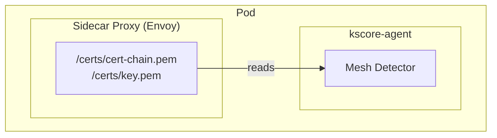

## Overview

Keystone Core automatically detects when agents run inside service mesh environments (Istio, Linkerd, Consul Connect, etc.) and integrates with mesh features for enhanced identity, security, and observability.

**Supported Service Meshes:**

- Istio
- Linkerd
- Consul Connect
- Kuma
- Open Service Mesh (OSM)

## Automatic Detection

When the agent starts in a Kubernetes environment with a service mesh sidecar, it automatically:

1. **Detects mesh type** from sidecar containers and environment variables
2. **Extracts SPIFFE identity** from mesh certificates
3. **Collects proxy configuration** (ports, endpoints)
4. **Reports mesh metadata** to the control plane



## Mesh Metadata

The agent collects comprehensive mesh metadata:

```yaml
mesh:
  type: istio
  version: "1.20.0"

  proxy:
    type: envoy
    version: "1.28.0"
    admin_port: 15000
    metrics_port: 15090
    health_port: 15021

  service:
    name: my-service
    namespace: production
    version: v2

  identity:
    trust_domain: cluster.local
    spiffe_id: spiffe://cluster.local/ns/production/sa/my-service

  tls:
    enabled: true
    mode: STRICT
    cert_provider: istiod
```

### Mesh Types

| Mesh Type | Detection Method | Identity Source |
|-----------|-----------------|-----------------|
| Istio | `istio-proxy` sidecar, `ISTIO_META_*` env vars | Citadel/istiod certificates |
| Linkerd | `linkerd-proxy` sidecar, `LINKERD_*` env vars | Identity controller certs |
| Consul | `consul-connect-inject-init`, Consul env vars | Consul Connect certificates |
| Kuma | `kuma-dp` sidecar, `KUMA_*` env vars | Kuma CP certificates |
| OSM | `osm-proxy` sidecar | OSM certificates |

## SPIFFE Identity Integration

When running in a service mesh, the agent can use the mesh's SPIFFE identity instead of Keystone Core's embedded identity provider:

```yaml
# agent.yaml
identity:
  provider: mesh     # Use service mesh identity
  # provider: embedded  # Use Keystone Core's identity
```

This enables:

- **Zero-configuration identity**: Agent inherits mesh identity
- **Unified trust**: Same trust domain as mesh workloads
- **Automatic rotation**: Mesh handles certificate lifecycle

### Identity Federation

The control plane can federate trust between its identity domain and service mesh domains:

```yaml
# server.yaml
identity:
  federation:
    - trust_domain: cluster.local
      type: mesh
      mesh_type: istio
      # Trust workloads from this mesh's trust domain
```

## Targeting by Mesh Attributes

Use mesh metadata in targeting expressions:

```bash
# Target all Istio workloads
kscorectl exec run "mesh.type == 'istio'" -- istioctl version

# Target specific service
kscorectl exec run "mesh.service.name == 'payment-service'" -- curl localhost:8080/health

# Target by mesh namespace
kscorectl exec run "mesh.service.namespace == 'production'" -- env

# Target by SPIFFE identity
kscorectl exec run "mesh.identity.spiffe_id contains 'sa/frontend'" -- uptime
```

## Proxy Metrics Integration

The agent can scrape sidecar proxy metrics and forward them to the telemetry gateway:

```yaml
# agent.yaml
telemetry:
  scrape_mesh_proxy: true
  proxy_metrics_port: 15090  # Istio default
  proxy_metrics_path: /stats/prometheus
```

Collected metrics include:

- Request latency (upstream/downstream)
- Request volume and error rates
- Connection statistics
- Circuit breaker state

## mTLS Configuration

Access mesh mTLS configuration for workload operations:

```go
// Create a mesh detector with default configuration
detector := servicemesh.NewDetector(servicemesh.DefaultConfig())

// Detect mesh and get metadata
metadata, err := detector.Detect()
if err == nil && metadata.TLSConfig != nil && metadata.TLSConfig.Enabled {
    // Use mesh certificates for secure connections
    // Certificates are available at:
    // - metadata.TLSConfig.CertChainFile
    // - metadata.TLSConfig.PrivateKeyFile
    // - metadata.TLSConfig.CAFile
}
```

## Health Checks

The agent exposes mesh-aware health endpoints:

```bash
# Agent health includes mesh sidecar status
curl http://localhost:9100/health

# Response:
{
  "status": "healthy",
  "mesh": {
    "type": "istio",
    "proxy_ready": true,
    "proxy_version": "1.28.0",
    "identity_valid": true
  }
}
```

## Configuration Reference

### Agent Configuration

```yaml
# agent.yaml
mesh:
  # Enable mesh detection (default: true)
  detection_enabled: true

  # Mesh type override (auto-detect if empty)
  type: ""

  # Certificate paths (usually auto-detected)
  cert_chain: ""
  key: ""
  ca: ""

  # Use mesh identity for agent authentication
  use_mesh_identity: false

  # Scrape proxy metrics
  scrape_metrics: false
  metrics_port: 15090
  metrics_interval: 30s
```

### Environment Variables

| Variable | Description | Default |
|----------|-------------|---------|
| `KSCORE_MESH_DETECTION` | Enable/disable mesh detection | `true` |
| `KSCORE_MESH_TYPE` | Override detected mesh type | auto |
| `KSCORE_MESH_USE_IDENTITY` | Use mesh identity | `false` |

## Istio-Specific Features

### Authorization Policies

Create Istio AuthorizationPolicies for Keystone Core:

```yaml
apiVersion: security.istio.io/v1
kind: AuthorizationPolicy
metadata:
  name: kscore-agent-policy
  namespace: production
spec:
  selector:
    matchLabels:
      app: my-service
  rules:
  - from:
    - source:
        principals: ["cluster.local/ns/kscore/sa/kscore-server"]
    to:
    - operation:
        ports: ["9100"]  # Agent port
```

### Sidecar Configuration

Optimize sidecar for Keystone Core traffic:

```yaml
apiVersion: networking.istio.io/v1
kind: Sidecar
metadata:
  name: kscore-agent-sidecar
spec:
  egress:
  - hosts:
    - "kscore/*"  # Keystone Core namespace
    - "istio-system/*"
```

## Linkerd-Specific Features

### Service Profiles

Create Linkerd service profiles for Keystone Core:

```yaml
apiVersion: linkerd.io/v1alpha2
kind: ServiceProfile
metadata:
  name: kscore-server.kscore.svc.cluster.local
spec:
  routes:
  - name: grpc
    condition:
      pathRegex: /.*
    responseClasses:
    - condition:
        status:
          min: 500
          max: 599
      isFailure: true
```

## Consul-Specific Features

### Service Intentions

Configure Consul Connect intentions:

```hcl
Kind = "service-intentions"
Name = "kscore-server"
Sources = [
  {
    Name   = "kscore-agent"
    Action = "allow"
  }
]
```

## Troubleshooting

### Mesh Not Detected

1. Check sidecar is running:

   ```bash
   kubectl get pod <pod> -o jsonpath='{.spec.containers[*].name}'
   ```

2. Check environment variables:

   ```bash
   kubectl exec <pod> -c kscore-agent -- env | grep -i istio
   ```

3. Enable debug logging:

   ```bash
   KSCORE_LOG_LEVEL=debug kscore-agent
   ```

### Certificate Issues

1. Check certificate paths:

   ```bash
   kubectl exec <pod> -c kscore-agent -- ls -la /etc/certs/
   ```

2. Verify certificate validity:

   ```bash
   kubectl exec <pod> -c kscore-agent -- openssl x509 -in /etc/certs/cert-chain.pem -text -noout
   ```

### Identity Not Working

1. Verify SPIFFE ID:

   ```bash
   kscorectl agents show <agent-id> -o json | jq '.metadata.mesh.identity'
   ```

2. Check trust federation:

   ```bash
   kscorectl identity federation list
   ```

## See Also

- [Identity Management](/docs/concepts/identity/)
- [Agents](/docs/concepts/agents/)
- [Multi-Environment Support](/docs/concepts/agents/#kubernetes)
