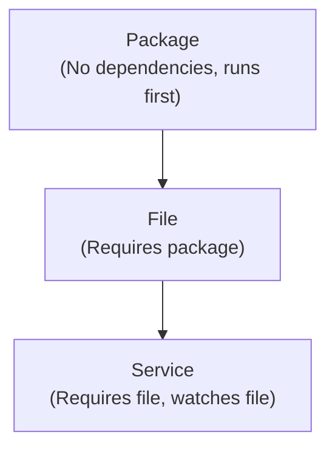
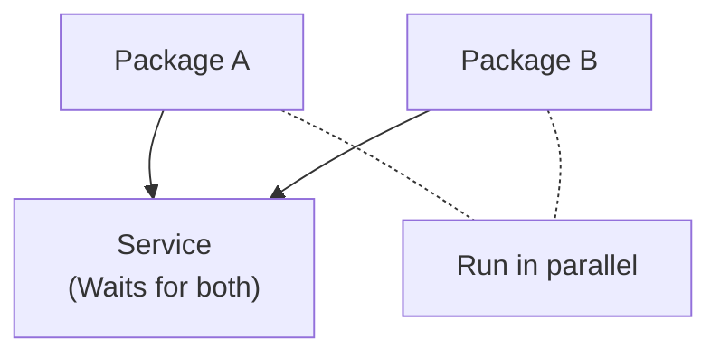
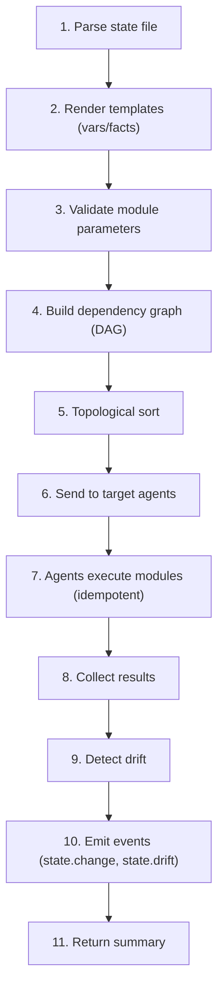

> **Implementation Note**: The `kscorectl state` CLI supports:
> `apply`, `check`, `drift`, `test`, `diff`, `show`, `history`, `rollback`

## Overview

Keystone Core's state management system enables you to describe your infrastructure's desired state declaratively. The system ensures your infrastructure matches that state through idempotent operations.

**Key Principles**:
- **Declarative**: Describe what you want, not how to achieve it
- **Idempotent**: Safe to run repeatedly with same result
- **Dependency-Aware**: Automatic ordering based on requisites
- **Drift-Detecting**: Identifies configuration drift automatically
- **Template-Driven**: Dynamic configuration with vars and facts

## State Files

State files are YAML documents that declare desired resource states:

```yaml
# Example: web-server.yaml
nginx_package:
  module: package
  state: installed
  name: nginx

nginx_config:
  module: file
  state: present
  path: /etc/nginx/nginx.conf
  source: salt://nginx/nginx.conf
  mode: "0644"
  require:
    - nginx_package

nginx_service:
  module: service
  state: running
  name: nginx
  enabled: true
  watch:
    - nginx_config
```

### State Declaration Structure

Each state declaration has:

**State ID** (e.g., `nginx_package`):
- Unique identifier
- Used for requisite references
- Meaningful name for readability

**Module**: Which state module to use (file, package, service, etc.)

**State**: Desired state (installed, present, running, etc.)

**Parameters**: Module-specific configuration

**Requisites**: Dependencies and relationships

## State Modules

Keystone Core includes 95 built-in modules across 20+ categories. This section highlights the core modules; see the full [Module Reference](/docs/reference/modules/) for the complete list.

### 1. File Module

Manages files and directories:

**States**:
- `present`: Ensure file exists with specified content
- `absent`: Ensure file does not exist
- `directory`: Ensure directory exists
- `symlink`: Ensure symlink exists

**Example**:
```yaml
app_config:
  module: file
  state: present
  path: /etc/app/config.yaml
  contents: |
    database:
      host: {{ vars.db_host }}
      port: 5432
  mode: "0600"
  owner: app
  group: app
```

**Parameters**:
- `path`: File path (required)
- `contents`: File contents (for `present`)
- `source`: Source file (alternative to `contents`)
- `mode`: Permission mode (e.g., "0644")
- `owner`: File owner
- `group`: File group

### 2. Package Module

Manages software packages:

**States**:
- `installed`: Ensure package is installed
- `removed`: Ensure package is not installed
- `latest`: Ensure latest version is installed
- `purged`: Remove package and config files

**Example**:
```yaml
docker:
  module: package
  state: installed
  name: docker-ce
  version: "20.10.*"
```

**Cross-Platform Support**:
- Linux: apt, yum, dnf, zypper, pacman, apk
- macOS: homebrew
- Windows: chocolatey, winget

**Parameters**:
- `name`: Package name (required)
- `version`: Specific version (optional)
- `repo`: Custom repository (optional)

### 3. Service Module

Manages system services:

**States**:
- `running`: Ensure service is running
- `stopped`: Ensure service is stopped
- `enabled`: Enable service on boot
- `disabled`: Disable service on boot

**Example**:
```yaml
postgresql:
  module: service
  state: running
  name: postgresql
  enabled: true
  reload: true  # Reload instead of restart on changes
```

**Cross-Platform Support**:
- Linux: systemd, upstart, sysvinit, openrc
- macOS: launchd
- Windows: Windows Service Manager

**Parameters**:
- `name`: Service name (required)
- `enabled`: Enable on boot (boolean)
- `reload`: Reload instead of restart (boolean)

### 4. User Module

Manages user accounts:

**States**:
- `present`: Ensure user exists
- `absent`: Ensure user does not exist

**Example**:
```yaml
appuser:
  module: user
  state: present
  name: myapp
  uid: 1001
  gid: 1001
  home: /home/myapp
  shell: /bin/bash
  groups:
    - docker
    - sudo
```

**Parameters**:
- `name`: Username (required)
- `uid`: User ID
- `gid`: Primary group ID
- `home`: Home directory
- `shell`: Login shell
- `groups`: Additional groups

### 5. Group Module

Manages groups:

**States**:
- `present`: Ensure group exists
- `absent`: Ensure group does not exist

**Example**:
```yaml
developers:
  module: group
  state: present
  name: developers
  gid: 2000
```

**Parameters**:
- `name`: Group name (required)
- `gid`: Group ID

### 6. Command Module

Executes commands:

**States**:
- `run`: Run command unconditionally
- `wait`: Run only when watched resource changes

**Example**:
```yaml
reload_app:
  module: cmd
  state: wait
  command: "systemctl reload myapp"
  watch:
    - app_config

database_migration:
  module: cmd
  state: run
  command: "/usr/local/bin/migrate up"
  unless: "test -f /var/lib/app/migrated"
```

**Parameters**:
- `command`: Command to run (required)
- `cwd`: Working directory
- `env`: Environment variables
- `timeout`: Execution timeout
- `unless`: Skip if this command succeeds
- `only_if`: Run only if this command succeeds

### 7. Docker Image Module

Manages Docker container images:

**States**:
- `present`: Ensure image is pulled
- `absent`: Ensure image is removed

**Example**:
```yaml
app_image:
  module: docker_image
  state: present
  name: myregistry.azurecr.io/myapp
  tag: v1.2.3
  registry_auth: cloud-auto
```

**Parameters**:
- `name`: Image name (required)
- `tag`: Image tag (default: `latest`)
- `registry_auth`: Authentication method for private registries (optional)

**Registry Authentication Methods**:
- `""` (empty): No authentication (public registries)
- `docker-config`: Use local Docker config (`~/.docker/config.json`)
- `cloud-auto`: Auto-detect cloud provider (AWS ECR, GCP GCR, Azure ACR)
- `k8s:namespace/secret`: Use Kubernetes imagePullSecret

See [Container Registry Authentication](/docs/concepts/container-registry-auth/) for details.

### 8. Docker Container Module

Manages Docker containers:

**States**:
- `present`: Ensure container exists and is running
- `absent`: Ensure container does not exist

**Example**:
```yaml
web_container:
  module: docker_container
  state: present
  name: web
  image: nginx:latest
  ports:
    - "80:80"
  volumes:
    - "/data:/usr/share/nginx/html:ro"
  require:
    - nginx_image
```

**Parameters**:
- `name`: Container name (required)
- `image`: Image to use (required for `present`)
- `ports`: Port mappings
- `volumes`: Volume mounts
- `env`: Environment variables
- `restart`: Restart policy

### 9. Podman Image Module

Manages Podman container images (same interface as Docker):

**Example**:
```yaml
app_image:
  module: podman_image
  state: present
  name: gcr.io/myproject/myapp
  tag: latest
  registry_auth: cloud-auto
```

### 10. Podman Container Module

Manages Podman containers (same interface as Docker):

**Example**:
```yaml
app_container:
  module: podman_container
  state: present
  name: myapp
  image: myapp:latest
  ports:
    - "8080:8080"
```

### 11. DNS Records Module

Manages DNS records across multiple providers (Cloudflare, Route53, Google Cloud DNS, Azure DNS, and more):

**States**:
- `present`: Ensure specified records exist (additive)
- `synced`: Ensure zone matches exactly (removes extra records)
- `absent`: Ensure specified records do not exist

**Example**:
```yaml
web_records:
  module: dns_records
  state: present
  provider: cloudflare
  zone: example.com
  credentials:
    secret_ref: secret://dns/cloudflare
  records:
    - type: A
      name: www
      value: 203.0.113.10
      ttl: 300
    - type: CNAME
      name: api
      value: api.internal.example.com.
      ttl: 600
```

**Supported Record Types**: A, AAAA, CNAME, TXT, MX, SRV, CAA, NS, ALIAS, PTR

**Parameters**:
- `provider`: DNS provider name (required)
- `zone`: DNS zone/domain (required)
- `credentials`: Provider credentials (secret_ref or inline)
- `records`: List of DNS records to manage

See [DNS Records Module Reference](/docs/reference/modules/dns/) for provider-specific configuration and full documentation.

## Requisites (Dependencies)

Requisites define relationships between state declarations:

### require

Execute after another state succeeds:

```yaml
nginx_config:
  module: file
  state: present
  path: /etc/nginx/nginx.conf
  require:
    - nginx_package  # Must run after nginx_package succeeds
```

### require_in

Inverse of `require` - make another state depend on this one:

```yaml
nginx_package:
  module: package
  state: installed
  name: nginx
  require_in:
    - nginx_service  # nginx_service will require nginx_package
```

### watch

Execute after another state changes:

```yaml
nginx_service:
  module: service
  state: running
  name: nginx
  watch:
    - nginx_config  # Restart when nginx_config changes
```

### watch_in

Inverse of `watch`:

```yaml
nginx_config:
  module: file
  state: present
  path: /etc/nginx/nginx.conf
  watch_in:
    - nginx_service  # Notify nginx_service when this changes
```

### prereq

Must succeed before another state runs (for ordering):

```yaml
database_schema:
  module: cmd
  state: run
  command: "psql < schema.sql"
  prereq:
    - database_data  # database_data will run after this
```

### onchanges

Run only when watched state changes:

```yaml
clear_cache:
  module: cmd
  state: run
  command: "rm -rf /var/cache/app/*"
  onchanges:
    - app_code  # Only run when app_code changes
```

## Dependency Resolution

Keystone Core builds a dependency graph and topologically sorts state declarations:

### Execution Order



### Parallel Execution

States without dependencies can run in parallel:



### Circular Dependencies

Detected and rejected:

```yaml
state_a:
  require:
    - state_b

state_b:
  require:
    - state_a  # ERROR: Circular dependency detected
```

## Templating

State files support Go template syntax for dynamic configuration:

### Variables

Define variables in separate files or inline:

**vars.yaml**:
```yaml
app_name: myapp
db_host: postgres.example.com
db_port: 5432
replicas: 3
```

**State file with variables**:
```yaml
app_config:
  module: file
  state: present
  path: /etc/{{ .vars.app_name }}/config.yaml
  contents: |
    database:
      host: {{ .vars.db_host }}
      port: {{ .vars.db_port }}
    replicas: {{ .vars.replicas }}
```

**Apply with variables**:
```bash
kscorectl state apply web-server.yaml --vars vars.yaml
```

### Facts

Facts are system-discovered metadata:

**Available facts**:
- `{{ .facts.os }}` - Operating system (linux, windows, darwin)
- `{{ .facts.arch }}` - Architecture (amd64, arm64)
- `{{ .facts.hostname }}` - Hostname
- `{{ .facts.ip }}` - Primary IP address
- `{{ .facts.cpu_count }}` - CPU count
- `{{ .facts.memory_total }}` - Total memory

**Example**:
```yaml
app_config:
  module: file
  state: present
  path: /etc/app/config.yaml
  contents: |
    hostname: {{ .facts.hostname }}
    cpu_workers: {{ .facts.cpu_count }}
    {{- if eq .facts.os "linux" }}
    platform: linux
    {{- else if eq .facts.os "darwin" }}
    platform: mac
    {{- end }}
```

### Template Functions

Built-in functions:

```yaml
example:
  module: file
  state: present
  path: /tmp/example.txt
  contents: |
    # String functions
    uppercase: {{ upper "hello" }}
    lowercase: {{ lower "HELLO" }}
    title: {{ title "hello world" }}

    # List functions
    joined: {{ join .vars.list "," }}

    # Conditionals
    {{- if .vars.enabled }}
    feature: enabled
    {{- else }}
    feature: disabled
    {{- end }}

    # Default values
    setting: {{ default "default-value" .vars.setting }}
```

## Drift Detection

Keystone Core automatically detects when actual state differs from desired state:

### How It Works

1. **Check Current State**: Query actual resource state
2. **Compare**: Diff against desired state
3. **Calculate Severity**: Assign drift severity level
4. **Report**: Generate drift report
5. **Emit Event**: Publish `state.drift` event

### Severity Levels

- **None**: No drift detected
- **Low**: Minor differences (comments, whitespace)
- **Medium**: Significant but non-critical (permissions)
- **High**: Critical configuration (service stopped)
- **Critical**: Security issues (wrong owner, world-writable)

### Example Drift Report

```
Drift detected on agent: web-01

nginx_config:
  ✗ drift detected (MEDIUM severity)
  - mode: expected "0644", got "0755"
  - owner: expected "root", got "nginx"

nginx_service:
  ✗ drift detected (HIGH severity)
  - state: expected "running", got "stopped"

Summary:
  Total: 10 states
  Compliant: 8
  Drift: 2 (1 medium, 1 high)
```

### Drift Remediation

**Manual**:
```bash
# Check for drift
kscorectl state check web-server.yaml

# Fix drift
kscorectl state apply web-server.yaml
```

**Automatic** (via reactors):
```yaml
auto_remediate_drift:
  filter: "type == 'state.drift' and severity >= 'high'"
  actions:
    - type: state_apply
      state_file: "{{ event.data.state_file }}"
      target: "agent_id == {{ event.source }}"
```

## State Application Workflow



## Idempotency

All state modules are idempotent - safe to run repeatedly:

**File module**:
- Check if file exists with correct content
- Only write if changed
- Only change permissions if needed

**Package module**:
- Check if package already installed
- Check version matches
- Only install/upgrade if needed

**Service module**:
- Check if service already in desired state
- Only start/stop/reload if needed

**Example**:
```yaml
nginx_package:
  module: package
  state: installed
  name: nginx
```

First run:
```
nginx_package: ✓ installed (changed)
```

Second run (nginx already installed):
```
nginx_package: ✓ installed (unchanged)
```

## Best Practices

### Organization

1. **Separate Concerns**: One state file per service/component
2. **Use Includes**: Compose complex states from smaller files
3. **Version Control**: Keep state files in Git
4. **Environment-Specific**: Use vars for environment differences

```
states/
├── base/
│   ├── users.yaml
│   └── packages.yaml
├── web/
│   ├── nginx.yaml
│   └── app.yaml
└── db/
    └── postgres.yaml

vars/
├── dev.yaml
├── staging.yaml
└── prod.yaml
```

### Naming

1. **Descriptive IDs**: `nginx_config` not `config1`
2. **Consistent Naming**: Follow a naming convention
3. **Group Related**: Prefix with component name

### Dependencies

1. **Explicit Dependencies**: Always declare requisites
2. **Avoid Circular**: Design to prevent circular deps
3. **Use `watch` for Triggers**: Restart services on config changes

### Templates

1. **Validate Variables**: Check var existence with `default`
2. **Comment Templates**: Document template logic
3. **Test Rendering**: Test with all var combinations

### Testing

1. **Dry Run**: Test with `kscorectl state check` first
2. **Dev Environment**: Test on dev before prod
3. **Version Control**: Commit and review state changes
4. **Rollback Plan**: Keep previous versions for rollback

## Troubleshooting

### State Won't Apply

**Problem**: State application fails

Debug:
```bash
# Detailed output
kscorectl state apply web.yaml

# Dry run
kscorectl state check web.yaml
```

Common issues:
- Syntax errors in YAML
- Invalid module parameters
- Unresolved requisites
- Permission issues on agents

### Circular Dependency

**Problem**: "Circular dependency detected"

Fix:
- Review requisite chains
- Remove unnecessary dependencies
- Use `watch` instead of `require` if applicable
- Reorganize state declarations

### Template Rendering Fails

**Problem**: "Template rendering error"

Debug:
```bash
# Use check mode to validate templates without applying
kscorectl state check web.yaml --vars dev.yaml

# View the parsed state file
kscorectl state show web.yaml
```

Common issues:
- Missing variables
- Incorrect function syntax
- Undefined facts

### Drift Not Detected

**Problem**: Known drift not showing in reports

Check:
- Drift severity threshold
- Module's drift detection logic
- Agent connectivity

## Performance

### Optimization

1. **Batch Operations**: Apply to multiple agents in parallel
2. **Reduce Modules**: Combine related operations
3. **Cache Results**: Use agent-side caching
4. **Limit Concurrency**: Don't overwhelm agents

### Benchmarks

State application performance (single agent):

- Simple file: ~10ms
- Package install: ~500ms-5s (depends on package)
- Service restart: ~100-500ms
- Full state run (10 modules): ~2-5s

Scaling (100 agents, 10 modules each):
- Sequential: ~500s
- Parallel (batch=10): ~50s
- Parallel (batch=50): ~10s

### Large State File Performance

When working with large state files (100+ resources), understanding performance characteristics helps avoid bottlenecks and optimize execution.

#### Resource Count Impact

| Resources | Parse Time | DAG Build | Validation | Total Overhead |
|-----------|------------|-----------|------------|----------------|
| 10 | <10ms | <5ms | <5ms | ~20ms |
| 100 | ~50ms | ~20ms | ~30ms | ~100ms |
| 500 | ~200ms | ~100ms | ~150ms | ~450ms |
| 1000 | ~500ms | ~300ms | ~400ms | ~1.2s |
| 5000 | ~3s | ~2s | ~2.5s | ~7.5s |

**Key observations**:
- Parsing scales linearly with file size
- DAG building scales O(n log n) with requisite complexity
- Validation scales linearly but can be parallelized

#### Memory Consumption

Large state files consume memory during processing:

| Resources | Control Plane | Agent Memory | Peak During Apply |
|-----------|--------------|--------------|-------------------|
| 100 | ~10MB | ~5MB | ~20MB |
| 500 | ~40MB | ~15MB | ~80MB |
| 1000 | ~80MB | ~30MB | ~160MB |
| 5000 | ~400MB | ~150MB | ~800MB |

**Memory optimization tips**:
- Split large state files into logical groups
- Use `include` to compose smaller files
- Apply to agent groups rather than all at once
- Monitor control plane memory during large applies

#### Dependency Graph Complexity

Complex requisite chains impact performance more than resource count:

```yaml
# Linear chain - O(n) traversal
resource_1:
  require: []
resource_2:
  require: [resource_1]
resource_3:
  require: [resource_2]
# ... continues

# Tree structure - O(log n) depth
base_package:
  require: []
service_a:
  require: [base_package]
service_b:
  require: [base_package]
config_a:
  require: [service_a]
config_b:
  require: [service_b]
```

**DAG complexity benchmarks** (1000 resources):

| Topology | DAG Build Time | Max Parallelism |
|----------|---------------|-----------------|
| Flat (no deps) | ~100ms | 1000 concurrent |
| Linear chain | ~400ms | 1 (sequential) |
| Tree (depth 5) | ~150ms | ~200 concurrent |
| Dense graph | ~800ms | ~50 concurrent |

#### File I/O Considerations

When state files manage many files, I/O becomes the bottleneck:

```yaml
# 1000 file resources - I/O bound
config_files:
  module: file
  state: present
  # Loop creates 1000 file states
```

**I/O performance by storage type**:

| Storage | Files/Second | 1000 Files |
|---------|--------------|------------|
| SSD (NVMe) | ~5000 | ~0.2s |
| SSD (SATA) | ~2000 | ~0.5s |
| HDD | ~200 | ~5s |
| Network (NFS) | ~100-500 | ~2-10s |
| Network (SMB) | ~50-200 | ~5-20s |

**Optimization strategies**:
- Group related files in same directory
- Use templated multi-file operations
- Prefer atomic directory operations
- Consider file distribution module for large file sets

#### Template Rendering Performance

Complex templates in large state files add overhead:

| Template Complexity | Overhead per Resource |
|--------------------|-----------------------|
| Simple variables | <1ms |
| Conditional logic | ~2ms |
| Loops (small) | ~5ms |
| Loops (large, 100+) | ~50ms |
| Nested templates | ~10ms |
| External lookups | ~100ms+ (network) |

**Template optimization tips**:
```yaml
# SLOW: Complex template per resource
{{ range .vars.configs }}
{{ .name }}_config:
  module: file
  contents: |
    {{ range .items }}
    {{ template "complex_item" . }}
    {{ end }}
{{ end }}

# FASTER: Pre-compute in vars file
# vars.yaml
configs:
  app1:
    rendered_content: "pre-computed content..."

# state.yaml
{{ range $name, $config := .vars.configs }}
{{ $name }}_config:
  module: file
  contents: {{ $config.rendered_content }}
{{ end }}
```

#### Scaling Recommendations

**For 100-500 resources**:
- Single state file acceptable
- Enable parallel execution
- Default settings work well

```yaml
# Apply with parallelism
kscorectl state apply large-state.yaml --parallel 20
```

**For 500-1000 resources**:
- Consider splitting by component or layer
- Use `include` for composition
- Increase agent-side timeouts

```yaml
# Structure for large deployments
states/
├── base.yaml         # Core packages, users (50 resources)
├── network.yaml      # Network config (100 resources)
├── services.yaml     # Services (200 resources)
├── apps.yaml         # Applications (300 resources)
└── monitoring.yaml   # Monitoring (50 resources)

# Main composition file
include:
  - base.yaml
  - network.yaml
  - services.yaml
  - apps.yaml
  - monitoring.yaml
```

**For 1000+ resources**:
- Split into multiple state applications
- Stage rollouts by agent group
- Use blueprints for complex deployments
- Consider async application with status polling

```bash
# Staged rollout for large deployments
kscorectl state apply infra-base.yaml --target "role=base"
kscorectl state apply infra-services.yaml --target "role=services"
kscorectl state apply app-layer.yaml --target "role=app"
```

**For 5000+ resources**:
- Redesign using modular architecture
- Implement hierarchical state application
- Use event-driven orchestration
- Consider purpose-built blueprints

#### Monitoring Large State Applications

Track these metrics for large state operations:

| Metric | Warning Threshold | Critical Threshold |
|--------|------------------|-------------------|
| Apply duration | >5 minutes | >15 minutes |
| Memory usage | >500MB | >1GB |
| Failed resources | >1% | >5% |
| Retry rate | >5% | >10% |
| Agent timeouts | >1% | >5% |

**Prometheus queries for monitoring**:
```promql
# Apply duration histogram
histogram_quantile(0.95, rate(state_apply_duration_seconds_bucket[5m]))

# Resource failure rate
rate(state_resource_failures_total[5m]) / rate(state_resource_total[5m])

# Memory during apply
max_over_time(process_resident_memory_bytes{job="control-plane"}[5m])
```

#### Troubleshooting Large State Applications

**Problem: State apply times out**
```bash
# Increase timeout for large applies
kscorectl state apply large.yaml --timeout 30m

# Or in config
execution:
  state_apply_timeout: 30m
```

**Problem: Agent runs out of memory**
```yaml
# agent.yaml - Increase memory limits
resources:
  memory_limit: 512Mi  # Increase from default 256Mi
```

**Problem: DAG build is slow**
```bash
# Check state file for complexity
kscorectl state show large.yaml

# Review for unnecessary dependencies and complexity
# Consider splitting large state files into smaller modules
```

**Problem: Many resources failing in parallel**
```yaml
# Reduce parallelism to avoid resource contention
execution:
  max_parallel_resources: 10  # Reduce from default 50
```

## Performance Tuning Guide

This section provides actionable tuning recommendations to optimize state application performance across your deployment.

### Control Plane Tuning

#### Server Configuration

```yaml
# /etc/keystone-core/server.yaml

# State processing settings
state:
  # Number of concurrent state renders
  render_workers: 8             # Default: 4, increase for many agents

  # DAG builder parallelism
  dag_workers: 4                # Default: 2

  # Validation parallelism
  validation_workers: 8         # Default: 4

  # Maximum state file size (prevents memory issues)
  max_state_size: 10MB          # Default: 5MB

  # Cache compiled templates
  template_cache:
    enabled: true
    max_entries: 1000           # Number of cached templates
    ttl: 1h                     # Cache TTL

  # Response timeout for large applies
  apply_timeout: 30m            # Default: 10m
```

#### Memory Tuning

```yaml
# For deployments with 1000+ agents
resources:
  # Go runtime settings
  gomaxprocs: 0                 # 0 = use all CPUs
  memory_limit: 4GB             # Limit Go heap

  # State processing buffers
  state_buffer_size: 100MB      # Per-apply buffer
  result_buffer_size: 50MB      # Result aggregation buffer
```

#### Database Connection Tuning

State application generates significant database activity:

```yaml
# PostgreSQL tuning for large deployments
database:
  pool:
    max_connections: 100        # Default: 25
    max_idle: 25                # Default: 5
    connection_lifetime: 5m     # Recycle connections

  # Statement caching
  prepared_statements: true
  statement_cache_size: 500

# SQLite tuning
sqlite:
  journal_mode: wal             # Write-ahead logging
  synchronous: normal           # Balance durability/speed
  cache_size: -64000            # 64MB cache
  mmap_size: 268435456          # 256MB memory-mapped I/O
```

### Agent Tuning

#### Agent Resource Limits

```yaml
# /etc/keystone-core/agent.yaml

# Resource limits for state execution
execution:
  # Concurrent module executions
  max_parallel: 10              # Default: 5

  # Per-module timeout
  module_timeout: 5m            # Default: 2m

  # Retry settings
  retry_count: 3
  retry_backoff: exponential
  retry_initial_delay: 1s
  retry_max_delay: 30s

# Memory limits
resources:
  memory_limit: 512MB           # Increase for large states
  temp_dir: /var/tmp/keystone-core     # Fast local storage

# File module optimization
file_module:
  buffer_size: 64KB             # I/O buffer
  checksum_workers: 4           # Parallel checksumming
```

#### Agent-Side Caching

```yaml
# Enable fact caching to avoid repeated discovery
facts:
  cache_enabled: true
  cache_ttl: 5m
  refresh_on_apply: false       # Don't refresh during apply

# Enable file checksum caching
file_cache:
  enabled: true
  max_entries: 10000
  ttl: 10m
```

### Network Tuning

#### NATS Connection Optimization

```yaml
# Optimize NATS for state distribution
nats:
  # Connection pooling
  pool_size: 10                 # Connections per server

  # Buffer sizes for large states
  pending_bytes_limit: 64MB     # Default: 16MB
  pending_msgs_limit: 100000    # Default: 65536

  # Reconnection during large applies
  reconnect_wait: 500ms
  max_reconnect: 60
  reconnect_buffer_size: 32MB

  # Compression for large state payloads
  compression: true
  compression_level: 6          # 1-9, balance speed/ratio
```

#### Batching Configuration

```yaml
# Control state distribution batching
batching:
  # Agent batching
  agents_per_batch: 100         # Default: 50
  batch_interval: 100ms         # Time between batches

  # Result collection
  result_batch_size: 500
  result_batch_timeout: 5s

  # Parallel batch execution
  concurrent_batches: 10        # Default: 5
```

### Execution Strategies

#### Sequential vs Parallel Execution

```yaml
# execution.yaml - Control execution strategy
strategy:
  # Global parallelism
  type: parallel                # parallel, sequential, adaptive
  max_parallel_agents: 100      # Concurrent agent executions
  max_parallel_resources: 50    # Resources per agent

  # Adaptive settings (adjusts based on failure rate)
  adaptive:
    initial_parallelism: 50
    min_parallelism: 10
    max_parallelism: 200
    failure_threshold: 5%       # Reduce parallelism above this
    recovery_rate: 10           # Increase per successful batch
```

#### Staged Rollouts

For large deployments, use staged rollouts to control impact:

```bash
# Stage 1: Canary (5% of agents)
kscorectl state apply app.yaml \
  --target "role=app AND canary=true" \
  --parallel 10

# Stage 2: Early majority (25% of agents)
kscorectl state apply app.yaml \
  --target "role=app AND tier=early" \
  --parallel 50

# Stage 3: Remaining agents
kscorectl state apply app.yaml \
  --target "role=app" \
  --parallel 100
```

### Module-Specific Tuning

#### File Module Optimization

```yaml
# Optimize file operations
file_module:
  # Use rsync-style delta sync for large files
  delta_sync:
    enabled: true
    min_file_size: 1MB          # Only for files larger than this
    block_size: 64KB

  # Parallel directory operations
  parallel_directory_ops: true
  dir_workers: 8

  # Temporary file handling
  atomic_writes: true           # Use temp file + rename
  temp_prefix: ".keystone-core-"

  # Skip unchanged files quickly
  quick_check:
    enabled: true
    use_mtime: true
    use_size: true
```

#### Package Module Optimization

```yaml
# Optimize package operations
package_module:
  # Cache package metadata
  metadata_cache:
    enabled: true
    ttl: 1h

  # Parallel package operations (where supported)
  parallel_installs: 5

  # Download optimization
  download_timeout: 10m
  retry_downloads: 3

  # Use local package cache
  local_cache:
    enabled: true
    path: /var/cache/keystone-core/packages
    max_size: 10GB
```

#### Service Module Optimization

```yaml
# Optimize service operations
service_module:
  # Status check caching
  status_cache_ttl: 5s

  # Parallel service operations
  parallel_ops: 10

  # Startup timeouts
  start_timeout: 2m
  stop_timeout: 1m

  # Reload preference (faster than restart)
  prefer_reload: true
```

### Template Performance

#### Template Optimization Patterns

```yaml
# SLOW: Repeated function calls in loop
{{ range .vars.hosts }}
  server {{ . }}:{{ default 8080 $.vars.port }};
{{ end }}

# FASTER: Compute once, reuse
{{ $port := default 8080 .vars.port }}
{{ range .vars.hosts }}
  server {{ . }}:{{ $port }};
{{ end }}

# SLOW: String concatenation in loop
{{ $result := "" }}
{{ range .vars.items }}
  {{ $result = printf "%s%s," $result . }}
{{ end }}

# FASTER: Use join function
{{ join .vars.items "," }}
```

### Caching Strategies

#### Control Plane Caching

```yaml
# Enable aggressive caching for read-heavy workloads
caching:
  # State file cache
  state_cache:
    enabled: true
    max_size: 100MB
    ttl: 5m

  # Rendered state cache (keyed by state + vars hash)
  render_cache:
    enabled: true
    max_entries: 500
    ttl: 10m

  # Agent state cache (current state snapshots)
  agent_state_cache:
    enabled: true
    max_agents: 10000
    ttl: 1m

  # Drift calculation cache
  drift_cache:
    enabled: true
    ttl: 30s
```

#### Distributed Caching

For multi-server deployments:

```yaml
# Use Redis for distributed caching
distributed_cache:
  type: redis
  url: "redis://redis-cluster:6379"
  prefix: "kscore:state:"
  ttl: 5m

  # Cache layers
  state_files: true
  rendered_states: true
  agent_snapshots: true
```

### Monitoring Performance

#### Key Metrics to Track

```promql
# State application throughput
rate(state_apply_total[5m])

# Application duration by percentile
histogram_quantile(0.99, rate(state_apply_duration_seconds_bucket[5m]))

# Resource execution rate
rate(state_resource_executions_total[5m])

# Cache hit rates
state_cache_hits_total / (state_cache_hits_total + state_cache_misses_total)

# Template render time
histogram_quantile(0.95, rate(state_template_render_seconds_bucket[5m]))

# DAG build time
histogram_quantile(0.95, rate(state_dag_build_seconds_bucket[5m]))

# Agent-side execution time
histogram_quantile(0.95, rate(agent_module_execution_seconds_bucket[5m]))
```

#### Performance Alerts

```yaml
groups:
  - name: state-performance
    rules:
      - alert: StateApplySlowP95
        expr: |
          histogram_quantile(0.95, rate(state_apply_duration_seconds_bucket[5m])) > 300
        for: 10m
        labels:
          severity: warning
        annotations:
          summary: State apply P95 latency exceeds 5 minutes

      - alert: StateTemplateRenderSlow
        expr: |
          histogram_quantile(0.95, rate(state_template_render_seconds_bucket[5m])) > 5
        for: 5m
        labels:
          severity: warning
        annotations:
          summary: Template rendering taking longer than 5 seconds

      - alert: StateCacheHitRateLow
        expr: |
          state_cache_hits_total / (state_cache_hits_total + state_cache_misses_total) < 0.5
        for: 15m
        labels:
          severity: info
        annotations:
          summary: State cache hit rate below 50%

      - alert: AgentModuleExecutionSlow
        expr: |
          histogram_quantile(0.95, rate(agent_module_execution_seconds_bucket[5m])) > 60
        for: 5m
        labels:
          severity: warning
        annotations:
          summary: Agent module execution P95 exceeds 1 minute
```

### Tuning Workflow

1. **Measure Current Performance**
   ```bash
   kscorectl state apply app.yaml --timing --verbose
   ```

2. **Identify Bottlenecks**
   - Check metrics dashboards
   - Review timing breakdown
   - Profile with `--profile` flag

3. **Apply Targeted Tuning**
   - Start with highest-impact changes
   - Change one setting at a time
   - Verify improvement with benchmarks

4. **Monitor in Production**
   - Set up performance alerts
   - Track trends over time
   - Re-tune as deployment scales

### Quick Reference: Tuning by Symptom

| Symptom | Likely Cause | Tuning Action |
|---------|-------------|---------------|
| Slow state parsing | Large files, complex YAML | Split files, simplify structure |
| Slow template render | Complex templates | Optimize templates, enable cache |
| Slow DAG build | Complex dependencies | Simplify requisites, flatten graph |
| Slow agent execution | Resource contention | Reduce parallelism per agent |
| Network timeouts | Large payloads | Enable compression, increase buffers |
| Memory pressure | Too many concurrent | Reduce parallelism, batch smaller |
| High failure rate | Overloaded agents | Staged rollout, reduce batch size |
| Inconsistent timing | Network variance | Increase timeouts, add retries |

## Next Steps

- Learn about [Remote Execution](/docs/concepts/remote-execution/) for command-based operations
- Understand [Events](/docs/concepts/events/) emitted during state changes
- Explore [Reactors](/docs/concepts/reactors/) for automated drift remediation
- See [Policy Enforcement](/docs/concepts/policy/) for compliance checks on state
