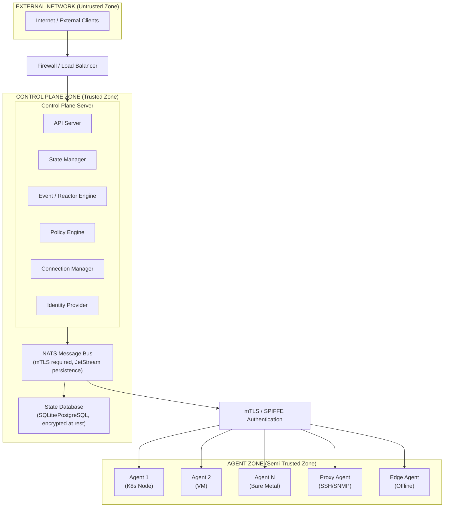

## Overview

This document describes the security threat model for Keystone Core, identifying trust boundaries, data flows, potential threats, and implemented mitigations. It follows the STRIDE methodology (Spoofing, Tampering, Repudiation, Information Disclosure, Denial of Service, Elevation of Privilege) and maps findings to the MITRE ATT&CK framework.

**Document Version**: 1.0
**Last Updated**: 2025-01
**Review Frequency**: Quarterly or after significant architecture changes

### Purpose

This threat model serves to:
- Identify and document security risks in Keystone Core deployments
- Guide security architecture decisions
- Inform security testing and validation efforts
- Support compliance with security frameworks (NIST 800-53, SOC 2, PCI-DSS)
- Enable risk-based prioritization of security investments

### Scope

**In Scope**:
- Keystone Core control plane components
- Agent software and communication protocols
- NATS message bus integration
- Database storage (SQLite/PostgreSQL)
- Module system and plugin execution
- API endpoints (gRPC, REST, webhooks)
- Identity and access management
- Integration points (GitOps, observability, secrets management)

**Out of Scope**:
- Managed system security (OS hardening of target nodes)
- Network infrastructure security (firewalls, load balancers)
- Physical security of data centers
- Third-party identity provider security
- User workstation security

---

## Asset Inventory

### Critical Assets

| Asset ID | Asset Name | Description | Sensitivity | Availability Requirement |
|----------|------------|-------------|-------------|--------------------------|
| A1 | Control Plane Credentials | API keys, JWT secrets, mTLS certificates | Critical | High |
| A2 | Agent Private Keys | Agent mTLS certificates and SPIFFE SVIDs | Critical | High |
| A3 | State Database | SQLite/PostgreSQL containing all system state | High | High |
| A4 | Secrets Store | Integration credentials for Vault, cloud providers | Critical | High |
| A5 | Audit Logs | Security event logs and compliance records | High | Medium |
| A6 | Module Registry | Signed modules and verification keys | High | Medium |
| A7 | NATS Credentials | Message bus authentication credentials | Critical | High |
| A8 | Join Tokens | Agent enrollment tokens | High | Low (one-time use) |

### Data Classification

| Classification | Examples | Protection Requirements |
|----------------|----------|------------------------|
| **Critical** | Credentials, private keys, secrets | Encrypted at rest and in transit, access logging, HSM storage where possible |
| **High** | Configuration data, state files, audit logs | Encrypted in transit, access control, integrity verification |
| **Medium** | Agent metadata, performance metrics | Access control, retention policies |
| **Low** | Public documentation, help text | Integrity verification only |

### Component Inventory

| Component | Technology | Exposure | Update Frequency |
|-----------|------------|----------|------------------|
| API Server | Go, gRPC/REST | External | Monthly security patches |
| State Manager | Go, SQLite/PostgreSQL | Internal | Monthly |
| NATS Message Bus | NATS 2.x, JetStream | Internal | Monthly |
| Module Runtime | Starlark, WASM | Internal (sandboxed) | As needed |
| Agent | Go, native binaries | Distributed | Monthly |
| Identity Provider | SPIFFE/SPIRE | Internal | Monthly |

---

## Threat Actors

| Actor | Description | Motivation | Capability |
|-------|-------------|------------|------------|
| **External Attacker** | Remote attacker without initial access | Data theft, disruption, ransomware | Network access, exploitation tools |
| **Compromised Agent** | Attacker who has compromised a managed node | Lateral movement, data exfiltration | Agent credentials, local system access |
| **Malicious Insider** | Employee or contractor with legitimate access | Data theft, sabotage | Valid credentials, internal knowledge |
| **Supply Chain Attacker** | Attacker who compromises dependencies | Backdoor installation, data theft | Build system access, package manipulation |

## Architecture Overview



## Trust Boundaries

### TB1: External Network → Control Plane API

**Boundary**: Network perimeter protecting the control plane API.

**Data Crossing**: API requests (gRPC/REST), webhooks (GitOps, GitHub/GitLab).

**Security Controls**:
- TLS 1.3 for all connections
- API key or JWT authentication required
- Rate limiting and request throttling
- Input validation on all endpoints
- Webhook signature verification (HMAC-SHA256)

### TB2: Control Plane → NATS Message Bus

**Boundary**: Internal communication channel between control plane components.

**Data Crossing**: Commands, events, state updates, heartbeats.

**Security Controls**:
- mTLS with client certificate validation
- NATS authorization rules (publish/subscribe permissions)
- JetStream persistence with authenticated access
- Message integrity via TLS

### TB3: Control Plane → Agent

**Boundary**: Communication between control plane and managed agents.

**Data Crossing**: Commands, execution results, state applications, heartbeats.

**Security Controls**:
- mTLS with per-agent certificates (Manual mode) or SVIDs (SPIFFE mode)
- Agent identity attestation (join token, cloud metadata, K8s SAT)
- Command authorization via policy engine
- Agent targeting validation

### TB4: Control Plane → Database

**Boundary**: Access to persistent state storage.

**Data Crossing**: Agent state, job history, configuration data, audit logs.

**Security Controls**:
- TLS for PostgreSQL connections
- Database authentication (username/password or certificate)
- Encryption at rest (database-level or filesystem)
- Backup encryption with age/KMS

### TB5: Agent → Managed System

**Boundary**: Agent executing commands on the local system.

**Data Crossing**: File operations, process execution, system configuration.

**Security Controls**:
- Least-privilege agent user (non-root when possible)
- Command allowlists for restricted operations
- State module validation
- Audit logging of all operations

### TB6: Proxy Agent → Unmanaged Devices

**Boundary**: Proxy agent communicating with devices that cannot run native agents.

**Data Crossing**: SSH commands, SNMP queries, REST API calls, WinRM commands.

**Security Controls**:
- Credential encryption at rest (AES-256-GCM)
- Credential rotation policies
- Protocol-specific security (SSH keys, SNMPv3 auth)
- Device authentication validation

## Data Flows

### DF1: Agent Registration

```
Agent → [mTLS] → NATS → Control Plane → Database
```

**Data**: Agent ID, metadata (OS, hostname, labels), attestation evidence.

**Sensitivity**: Medium - Contains infrastructure metadata.

**Protection**: mTLS encryption, attestation validation, stored hashed.

### DF2: Command Execution

```
User → [TLS+Auth] → API → Control Plane → [mTLS] → NATS → Agent
```

**Data**: Command text, arguments, environment variables, working directory.

**Sensitivity**: High - May contain credentials or sensitive data.

**Protection**: TLS encryption, authorization checks, audit logging, secrets redacted in logs.

### DF3: State Application

```
Control Plane → [mTLS] → NATS → Agent → Local System
```

**Data**: State declarations, file contents, user/group configurations.

**Sensitivity**: High - Contains system configuration details.

**Protection**: TLS encryption, state validation, idempotent operations.

### DF4: Heartbeat

```
Agent → [mTLS] → NATS → Control Plane → Database
```

**Data**: Agent status, resource metrics (CPU, memory, disk).

**Sensitivity**: Low - Operational metrics only.

**Protection**: mTLS encryption, rate limiting.

### DF5: Webhook Ingress

```
External Service → [TLS+HMAC] → API → Control Plane → Event Bus
```

**Data**: Deployment events, git push notifications, CI/CD status.

**Sensitivity**: Medium - Contains deployment metadata.

**Protection**: HMAC signature verification, input validation, rate limiting.

### DF6: Secrets Retrieval

```
Agent → [mTLS] → NATS → Control Plane → [mTLS] → Vault/KMS
```

**Data**: Secret values, credentials, certificates.

**Sensitivity**: Critical - Secrets must never be logged or persisted unencrypted.

**Protection**: TLS encryption, short-lived caching, audit logging, automatic redaction.

## STRIDE Analysis

### Spoofing

| Threat | Component | Mitigation |
|--------|-----------|------------|
| S1: Attacker impersonates agent | Agent registration | Join token attestation, SPIFFE SVIDs with workload attestation, cloud metadata validation |
| S2: Attacker impersonates control plane | NATS communication | mTLS with CA validation, certificate pinning |
| S3: Attacker forges API requests | API server | JWT/API key authentication, request signing |
| S4: Attacker spoofs webhook source | Webhook receiver | HMAC signature verification, source IP allowlisting |

### Tampering

| Threat | Component | Mitigation |
|--------|-----------|------------|
| T1: Modified commands in transit | NATS messaging | TLS encryption, message integrity |
| T2: Tampered state files | State management | Checksum verification, source validation |
| T3: Modified database records | Database | TLS connections, audit logging, backup verification |
| T4: Tampered module code | Module system | Cosign signatures, SumDB transparency log, hash verification |

### Repudiation

| Threat | Component | Mitigation |
|--------|-----------|------------|
| R1: User denies executing command | Command execution | Audit logging with user identity, immutable logs |
| R2: Agent denies receiving command | NATS messaging | JetStream acknowledgment, correlation IDs |
| R3: Administrator denies policy change | Policy engine | Policy audit log with timestamps and user |

### Information Disclosure

| Threat | Component | Mitigation |
|--------|-----------|------------|
| I1: Credential exposure in logs | Logging system | Automatic secret redaction, audit-safe log formats |
| I2: Agent metadata leakage | API responses | Role-based access control, minimal data exposure |
| I3: Database breach | State storage | Encryption at rest, backup encryption |
| I4: Network sniffing | All communications | TLS 1.3 for all connections |
| I5: Join token exposure | Token store | Salted hash storage, tokens never persisted in plaintext |

### Denial of Service

| Threat | Component | Mitigation |
|--------|-----------|------------|
| D1: API flood | API server | Rate limiting, request throttling, circuit breakers |
| D2: Agent heartbeat flood | Connection manager | Per-agent rate limiting, heartbeat intervals |
| D3: Event storm | Event system | Event throttling, debouncing, queue limits |
| D4: Database exhaustion | State storage | Connection pooling, query timeouts, retention policies |
| D5: NATS resource exhaustion | Message bus | JetStream limits, slow consumer detection |

### Elevation of Privilege

| Threat | Component | Mitigation |
|--------|-----------|------------|
| E1: Agent gains control plane access | Authorization | Separate agent/server credentials, RBAC enforcement |
| E2: Read-only user executes commands | API authorization | Policy-based access control, action validation |
| E3: Module escapes sandbox | Module runtime | Capability-based access, WASM/Starlark sandboxing |
| E4: Compromised agent pivots | Agent isolation | Least-privilege execution, network segmentation |

## Security Controls Summary

### Authentication

| Component | Method | Rotation |
|-----------|--------|----------|
| API clients | API key or JWT | Manual or automatic via IdP |
| Agents (Manual mode) | mTLS certificates | Manual rotation |
| Agents (SPIFFE mode) | SVID certificates | Automatic (hourly) |
| Database | Username/password or certificate | Configurable |
| NATS | mTLS certificates | Manual or SPIFFE-managed |

### Authorization

| Resource | Access Control | Default |
|----------|----------------|---------|
| Agent registration | Join token or attestation | Deny all |
| Command execution | OPA/CEL policies | Allow authenticated |
| State application | Target matching | Allow if authorized |
| API endpoints | RBAC roles | Read-only by default |
| Module loading | Trust policies | Deny unsigned |

### Encryption

| Data State | Protection | Algorithm |
|------------|------------|-----------|
| In transit (API) | TLS 1.3 | AES-256-GCM, ChaCha20-Poly1305 |
| In transit (NATS) | TLS 1.3 | AES-256-GCM, ChaCha20-Poly1305 |
| At rest (database) | Transparent encryption | AES-256 |
| At rest (backups) | Age encryption | X25519, ChaCha20-Poly1305 |
| Secrets | Vault/KMS | Provider-specific |

### Auditing

| Event Type | Logged Data | Retention |
|------------|-------------|-----------|
| Authentication | User, method, result, IP | 90 days |
| Command execution | User, command, target, result | 1 year |
| State changes | Resource, before/after, user | 1 year |
| Policy evaluations | Policy, input, result | 90 days |
| Agent lifecycle | Agent ID, event type, metadata | 1 year |

## Deployment Recommendations

### Development/Testing

- Use Manual TLS mode with generated certificates
- InMemoryTokenStore acceptable (data loss on restart)
- Single control plane instance
- SQLite for state storage

### Production (Single-Site)

- Use SPIFFE mode with embedded provider
- SQLiteTokenStore for token persistence
- Multiple control plane instances with etcd
- PostgreSQL for state storage
- TLS for all connections
- Backup encryption enabled

### Production (Multi-Site)

- Use SPIFFE mode with SPIRE integration
- Trust federation between sites
- NATS superclusters with gateways
- PostgreSQL with replication
- Geographic routing for traffic
- Cross-site backup replication

## Incident Response

### Compromised Agent

1. Immediately revoke agent credentials
2. Quarantine affected node (network isolation)
3. Review audit logs for lateral movement
4. Re-attest agent after remediation
5. Rotate any secrets the agent had access to

### Compromised Control Plane

1. Isolate affected control plane instance
2. Revoke all API keys and tokens
3. Rotate database credentials
4. Review all recent commands and state changes
5. Restore from verified backup if necessary
6. Re-issue all agent certificates

### Compromised Database

1. Isolate database instance
2. Assess data exposure
3. Restore from encrypted backup
4. Rotate all credentials stored in database
5. Review and re-apply state configurations

### Supply Chain Attack

1. Identify affected modules/versions
2. Block affected module hashes in SumDB
3. Revoke signing keys if compromised
4. Audit all systems that loaded affected modules
5. Force module re-verification on all agents

## Compliance Mapping

| Framework | Relevant Controls |
|-----------|-------------------|
| **SOC 2** | Access control, encryption, audit logging, change management |
| **PCI-DSS** | Network segmentation, encryption, access control, logging |
| **HIPAA** | Encryption, access control, audit trails, integrity controls |
| **GDPR** | Data encryption, access logging, right to erasure |
| **CIS Benchmarks** | Hardening guides for Linux, Windows, Kubernetes |

---

## Attack Surface Analysis

### External Attack Surface

Components exposed to external networks and untrusted parties.

#### API Endpoints

| Endpoint | Protocol | Authentication | Exposure Level | Attack Vectors |
|----------|----------|----------------|----------------|----------------|
| `/api/v1/*` | gRPC/REST | JWT, API Key, mTLS | Public/Internal | Injection, auth bypass, DoS |
| `/webhooks/*` | HTTPS | HMAC, Bearer Token | Public | Spoofing, replay, payload injection |
| `/metrics` | HTTP | None (internal only) | Internal | Information disclosure |
| `/healthz` | HTTP | None | Internal | Information disclosure |
| `/ws/*` | WebSocket | JWT, mTLS | Public/Internal | Session hijacking, DoS |

#### Network Services

| Service | Port | Protocol | Exposure | Security Controls |
|---------|------|----------|----------|-------------------|
| Control Plane API | 8080/8443 | HTTP/HTTPS | External | TLS, authentication, rate limiting |
| NATS Client | 4222 | NATS/TLS | Internal | mTLS, authorization |
| NATS Cluster | 6222 | NATS/TLS | Internal | mTLS, cluster verification |
| NATS Gateway | 7222 | NATS/TLS | Cross-site | mTLS, gateway accounts |
| NATS WebSocket | 443 | WSS | External | TLS, authentication |
| PostgreSQL | 5432 | PostgreSQL/TLS | Internal | TLS, authentication |
| etcd | 2379/2380 | gRPC/TLS | Internal | mTLS, peer verification |

### Internal Attack Surface

Components exposed within the trusted network.

#### Inter-Process Communication

| Communication Path | Protocol | Security | Risks |
|--------------------|----------|----------|-------|
| Control Plane ↔ NATS | mTLS | Client certificates | Compromised credentials |
| Control Plane ↔ Database | TLS/local socket | Connection encryption | SQL injection |
| Agent ↔ Local System | OS APIs | Process isolation | Privilege escalation |
| Module ↔ Runtime | WASM/Starlark | Sandboxing | Sandbox escape |

#### File System Attack Surface

| Path | Purpose | Permissions | Risks |
|------|---------|-------------|-------|
| `/etc/keystone-core/` | Configuration | 600 (root:kscore) | Credential exposure |
| `/var/lib/keystone-core/` | State data | 700 (kscore:kscore) | Data tampering |
| `/var/log/keystone-core/` | Log files | 640 (kscore:adm) | Information disclosure |
| `/etc/keystone-core/certs/` | TLS certificates | 400 (kscore:kscore) | Key compromise |

### Agent Attack Surface

Attack surface on managed nodes running Keystone Core agents.

| Component | Exposure | Attack Vectors | Mitigations |
|-----------|----------|----------------|-------------|
| Agent process | Local system | Local privilege escalation | Non-root user, capabilities |
| Agent socket | Unix socket | Local access | Socket permissions |
| Command execution | Target system | Command injection | Input validation, allowlists |
| State application | File system | Path traversal, symlink attacks | Path canonicalization |
| Module loading | Module runtime | Malicious modules | Signature verification |

---

## Attack Scenarios

### Scenario 1: External API Compromise

**Attacker Goal**: Gain unauthorized access to control plane functionality.

**Attack Tree**:
```
[Compromise API Access]
├── [Obtain Valid Credentials]
│   ├── Phishing attack on administrator
│   ├── Credential stuffing from leaked databases
│   ├── Brute force API keys (mitigated by rate limiting)
│   └── Compromise CI/CD pipeline with stored credentials
├── [Bypass Authentication]
│   ├── JWT algorithm confusion attack (mitigated by algorithm restriction)
│   ├── Exploit authentication middleware vulnerability
│   └── Session fixation/hijacking
└── [Exploit Vulnerability]
    ├── Injection (SQL, command, template)
    ├── Deserialization vulnerabilities
    └── API logic flaws
```

**Mitigations**:
- Strong authentication (mTLS preferred, MFA for sensitive operations)
- Rate limiting on authentication endpoints (5 failures = 15-minute lockout)
- Input validation on all API parameters
- Regular security scanning and penetration testing
- API key rotation policies

**Detection**:
- Monitor failed authentication attempts
- Alert on unusual API access patterns
- Track API key usage anomalies

### Scenario 2: Compromised Agent Lateral Movement

**Attacker Goal**: Use compromised agent to access other systems or escalate privileges.

**Attack Tree**:
```
[Compromise Agent]
├── [Initial Access]
│   ├── Exploit vulnerability on managed node
│   ├── Stolen SSH credentials to managed node
│   └── Supply chain attack on agent binary
├── [Credential Theft]
│   ├── Extract agent certificate/key
│   ├── Extract SPIFFE SVID
│   └── Dump in-memory secrets
├── [Lateral Movement]
│   ├── Impersonate agent to control plane
│   ├── Execute commands on other agents
│   └── Access secrets intended for other agents
└── [Privilege Escalation]
    ├── Escape agent sandbox
    ├── Exploit state module vulnerability
    └── Abuse agent's system access
```

**Mitigations**:
- Per-agent SVID certificates with workload attestation
- Agent targeting validation (agents can only receive their own commands)
- Least-privilege agent execution (non-root, minimal capabilities)
- Network segmentation (agents cannot directly communicate)
- Secret scoping (agents only receive secrets they need)

**Detection**:
- Monitor for unusual command execution patterns
- Alert on agent behavior anomalies
- Track certificate usage from unexpected locations

### Scenario 3: Module Supply Chain Attack

**Attacker Goal**: Inject malicious code through the module system.

**Attack Tree**:
```
[Compromise Module System]
├── [Malicious Module Injection]
│   ├── Compromise module author account
│   ├── Typosquatting (similar module names)
│   ├── Dependency confusion attack
│   └── Compromise module registry infrastructure
├── [Module Signing Bypass]
│   ├── Steal signing keys
│   ├── Exploit signature verification bugs
│   └── Exploit trust policy misconfiguration
└── [Runtime Exploitation]
    ├── Exploit sandbox escape vulnerability
    ├── Abuse granted capabilities
    └── Exploit resource limit bypasses
```

**Mitigations**:
- Cosign signatures with key transparency
- SumDB inclusion proofs
- Capability-based access control (no ambient authority)
- Module hash pinning and locking
- Trust policies with explicit module allowlists
- Sandboxed execution (WASM/Starlark)

**Detection**:
- Monitor module installation events
- Alert on unsigned or unverified modules
- Track capability usage anomalies

### Scenario 4: Insider Threat

**Attacker Goal**: Abuse legitimate access for unauthorized purposes.

**Attack Tree**:
```
[Malicious Insider]
├── [Data Exfiltration]
│   ├── Export sensitive configuration data
│   ├── Copy credential stores
│   └── Access audit logs for reconnaissance
├── [Sabotage]
│   ├── Deploy destructive state configurations
│   ├── Delete critical data or configurations
│   └── Disable security controls
└── [Privilege Escalation]
    ├── Create backdoor accounts
    ├── Modify RBAC policies
    └── Disable audit logging
```

**Mitigations**:
- Separation of duties (require multiple approvals for destructive operations)
- Comprehensive audit logging with tamper-evident storage
- RBAC with least-privilege defaults
- Just-in-time access for elevated privileges
- Background checks and access reviews

**Detection**:
- Anomaly detection on user behavior
- Alert on policy modifications
- Monitor for bulk data exports
- Track access to sensitive resources

### Scenario 5: Denial of Service

**Attacker Goal**: Disrupt Keystone Core operations.

**Attack Tree**:
```
[Denial of Service]
├── [Network Layer]
│   ├── Volumetric DDoS on API endpoints
│   ├── TCP SYN flood
│   └── TLS renegotiation attack
├── [Application Layer]
│   ├── Resource exhaustion (memory, connections)
│   ├── Algorithmic complexity attacks
│   ├── JetStream queue flooding
│   └── Event storm from reactors
├── [Data Layer]
│   ├── Database connection exhaustion
│   ├── Transaction lock contention
│   └── Storage exhaustion
└── [Cascading Failures]
    ├── Control plane overload
    ├── NATS cluster instability
    └── Etcd leader election disruption
```

**Mitigations**:
- Rate limiting at API, webhook, and authentication layers
- Connection pooling with limits
- JetStream consumer limits and flow control
- Event throttling and debouncing
- Circuit breakers for downstream services
- Resource quotas and timeouts
- Horizontal scaling with load balancing

**Detection**:
- Monitor request rates and response times
- Alert on resource utilization thresholds
- Track queue depths and consumer lag

---

## MITRE ATT&CK Mapping

### Relevant ATT&CK Techniques

| Technique ID | Name | Keystone Core Relevance | Mitigations |
|--------------|------|-------------------------|-------------|
| T1078 | Valid Accounts | API key compromise, credential theft | MFA, credential rotation, access reviews |
| T1098 | Account Manipulation | RBAC policy modification | Audit logging, separation of duties |
| T1133 | External Remote Services | API exposure | Authentication, rate limiting, network segmentation |
| T1190 | Exploit Public-Facing Application | API vulnerabilities | Input validation, security scanning, WAF |
| T1195 | Supply Chain Compromise | Malicious modules | Signature verification, trust policies |
| T1199 | Trusted Relationship | Agent compromise lateral movement | Agent isolation, targeting validation |
| T1485 | Data Destruction | Destructive state applications | Backup verification, approval workflows |
| T1486 | Data Encrypted for Impact | Ransomware targeting state | Backup encryption, access control |
| T1498 | Network Denial of Service | API/NATS flooding | Rate limiting, DDoS protection |
| T1499 | Endpoint Denial of Service | Resource exhaustion | Resource limits, circuit breakers |
| T1552 | Unsecured Credentials | Credential exposure | Encryption, secrets management |
| T1556 | Modify Authentication Process | Auth bypass attempts | Auth hardening, monitoring |
| T1562 | Impair Defenses | Disable audit logging | Tamper-evident logs, separation of duties |
| T1565 | Data Manipulation | State configuration tampering | Integrity verification, audit trails |

### ATT&CK Navigator Layer

A custom ATT&CK Navigator layer for Keystone Core security assessments is available in the security tools repository. This layer highlights techniques relevant to infrastructure automation platforms.

---

## Risk Assessment Matrix

### Risk Scoring Methodology

**Likelihood Factors**:
- L1 (Low): Requires significant resources, skill, and luck
- L2 (Medium): Possible with moderate effort and skill
- L3 (High): Easy to exploit with common tools/techniques

**Impact Factors**:
- I1 (Low): Limited scope, easily recoverable
- I2 (Medium): Significant disruption, recoverable with effort
- I3 (High): Critical impact, difficult to recover

**Risk Score = Likelihood × Impact**

### Risk Register

| Risk ID | Description | Threat Actor | Likelihood | Impact | Risk Score | Status |
|---------|-------------|--------------|------------|--------|------------|--------|
| R001 | API credential compromise | External Attacker | L2 | I3 | 6 (Medium-High) | Mitigated |
| R002 | Agent SVID theft | Compromised Agent | L2 | I2 | 4 (Medium) | Mitigated |
| R003 | Module supply chain attack | Supply Chain | L1 | I3 | 3 (Medium) | Mitigated |
| R004 | SQL injection in API | External Attacker | L1 | I3 | 3 (Medium) | Mitigated |
| R005 | Insider data exfiltration | Malicious Insider | L2 | I2 | 4 (Medium) | Mitigated |
| R006 | DDoS on control plane | External Attacker | L3 | I2 | 6 (Medium-High) | Mitigated |
| R007 | Webhook spoofing | External Attacker | L2 | I2 | 4 (Medium) | Mitigated |
| R008 | Database breach | External Attacker | L1 | I3 | 3 (Medium) | Mitigated |
| R009 | Agent sandbox escape | Compromised Agent | L1 | I3 | 3 (Medium) | Mitigated |
| R010 | NATS message tampering | Network Attacker | L1 | I2 | 2 (Low) | Mitigated |

### Risk Acceptance Criteria

| Risk Level | Score | Acceptance Authority | Review Frequency |
|------------|-------|----------------------|------------------|
| Critical | 9 | CISO + Executive | Immediate |
| High | 6-8 | Security Team Lead | Monthly |
| Medium | 3-5 | Security Engineer | Quarterly |
| Low | 1-2 | Development Team | Annually |

---

## Defense-in-Depth Layers

### Layer 1: Perimeter Security

**Controls**:
- Network firewalls restricting access to control plane
- Load balancers with DDoS protection
- Web Application Firewall (WAF) for API endpoints
- IP allowlisting for administrative access
- VPN or private network for internal communications

**Monitoring**:
- Network traffic analysis
- Intrusion detection systems (IDS)
- Blocked connection logging

### Layer 2: Authentication & Authorization

**Controls**:
- Multi-factor authentication for administrative access
- mTLS for service-to-service communication
- SPIFFE/SPIRE for workload identity
- RBAC with least-privilege defaults
- Just-in-time access for elevated privileges
- API key rotation and expiration

**Monitoring**:
- Failed authentication tracking
- Privilege escalation detection
- Access pattern anomaly detection

### Layer 3: Application Security

**Controls**:
- Input validation on all API endpoints
- Parameterized queries for database access
- Output encoding to prevent injection
- Content Security Policy for web interfaces
- Secure session management
- Error handling without information leakage

**Monitoring**:
- Application error rates
- Input validation failures
- Security event correlation

### Layer 4: Data Security

**Controls**:
- TLS 1.3 for all network communications
- Encryption at rest for databases
- Secrets management with Vault/KMS
- Backup encryption with key management
- Data classification and handling procedures
- Secure deletion policies

**Monitoring**:
- Certificate expiration tracking
- Encryption status verification
- Key rotation compliance

### Layer 5: Runtime Security

**Controls**:
- Sandboxed module execution (WASM/Starlark)
- Capability-based access control
- Resource limits (CPU, memory, network)
- Process isolation and namespacing
- Read-only root filesystems where possible
- Non-root execution

**Monitoring**:
- Resource utilization tracking
- Sandbox violation attempts
- Process anomaly detection

### Layer 6: Audit & Compliance

**Controls**:
- Comprehensive audit logging
- Tamper-evident log storage
- Policy evaluation logging
- Change management tracking
- Compliance reporting

**Monitoring**:
- Log integrity verification
- Compliance drift detection
- Security control effectiveness metrics

---

## Cryptographic Security

### Cryptographic Standards

| Usage | Algorithm | Key Size | Rotation | Standards Compliance |
|-------|-----------|----------|----------|----------------------|
| TLS | TLS 1.3 | - | Certificate renewal | NIST SP 800-52 |
| Symmetric encryption | AES-256-GCM | 256 bits | Annually | FIPS 140-2 |
| Asymmetric encryption | RSA-4096 or ECDSA P-384 | 4096/384 bits | Annually | NIST SP 800-57 |
| HMAC signatures | HMAC-SHA256 | 256 bits | Quarterly | FIPS 198-1 |
| Password hashing | Argon2id | - | On change | OWASP guidelines |
| Random generation | crypto/rand | - | N/A | NIST SP 800-90A |

### Certificate Management

**Certificate Hierarchy**:
```
Root CA (offline, 10-year validity)
├── Intermediate CA (online, 3-year validity)
│   ├── Server certificates (1-year validity)
│   ├── Agent certificates (1-year validity, or SPIFFE SVIDs)
│   └── Client certificates (1-year validity)
└── Backup CA (offline, 10-year validity)
```

**Key Protection**:
| Key Type | Storage | Access Control | Backup |
|----------|---------|----------------|--------|
| Root CA private key | HSM (offline) | Dual custody | Hardware backup, secure vault |
| Intermediate CA key | HSM or encrypted file | Limited admin access | Encrypted, offsite |
| Server keys | Encrypted file | Service account | Configuration backup |
| Agent keys | TPM or encrypted file | Agent process only | Re-enrollment |

**Certificate Revocation**:
- CRL (Certificate Revocation List) published hourly
- OCSP responder for real-time checks
- Short-lived SVIDs (1-hour validity) minimize revocation need

### Key Rotation Schedule

| Key Type | Rotation Frequency | Automated | Process |
|----------|-------------------|-----------|---------|
| SPIFFE SVIDs | Hourly | Yes | Automatic rotation by SPIRE |
| Agent certificates | Annually | Partial | Re-enrollment workflow |
| Server certificates | Annually | Partial | Certificate renewal process |
| API keys | Quarterly | No | Manual rotation with overlap |
| JWT signing keys | Annually | No | Key rollover with grace period |
| Encryption keys | Annually | No | Re-encryption process |

---

## Third-Party Component Security

### Dependency Analysis

| Component | Version Policy | Vulnerability Scanning | Update Frequency |
|-----------|----------------|------------------------|------------------|
| Go runtime | Latest stable | govulncheck | Monthly |
| NATS | Latest stable (2.x) | Dependabot | Monthly |
| PostgreSQL | Supported versions | CVE monitoring | Monthly |
| SQLite | Latest stable | CVE monitoring | Quarterly |
| SPIRE | Latest stable | Security advisories | Monthly |
| etcd | Latest stable (3.x) | Security advisories | Monthly |

### Supply Chain Security

**Build Pipeline Security**:
- Reproducible builds with locked dependencies
- SLSA Level 3 compliance target
- Build provenance attestation
- Container image signing (Cosign)
- SBOM generation (SPDX/CycloneDX)

**Dependency Management**:
- `go.sum` verification for all dependencies
- Automatic vulnerability scanning (govulncheck, gosec)
- Dependency review for security-sensitive changes
- Removal of unused dependencies

**Distribution Security**:
- Signed releases (GPG/Cosign)
- Checksum verification files
- Official distribution channels only
- Container image provenance

### Third-Party Integration Security

| Integration | Authentication | Data Sensitivity | Security Controls |
|-------------|----------------|------------------|-------------------|
| HashiCorp Vault | AppRole/K8s auth | Critical (secrets) | mTLS, audit logging |
| GitHub/GitLab | OAuth/PAT | Medium (code, config) | Webhook signatures, PAT rotation |
| Prometheus | None (internal) | Low (metrics) | Network isolation |
| Elasticsearch | API key | Medium (logs) | TLS, access control |
| ArgoCD | Webhook HMAC | Medium (deployments) | Signature verification |

---

## Security Testing Requirements

### Automated Security Testing

| Test Type | Tool | Frequency | Blocking |
|-----------|------|-----------|----------|
| Static analysis (SAST) | gosec | Every commit | Yes |
| Dependency scanning | govulncheck | Every commit | Yes |
| Container scanning | Trivy | Every image build | Yes |
| Secret detection | gitleaks | Every commit | Yes |
| License compliance | go-licenses | Weekly | No |

### Manual Security Testing

| Test Type | Frequency | Scope | Performed By |
|-----------|-----------|-------|--------------|
| Architecture review | Major releases | System design | Security team |
| Code review (security) | High-risk changes | Security-sensitive code | Security engineer |
| Penetration testing | Annually | Full system | Third-party |
| Red team exercise | Annually | End-to-end attack | External team |

### Security Test Cases

**Authentication Testing**:
- [ ] Invalid credentials return generic error
- [ ] Rate limiting activates after threshold
- [ ] Session timeout enforced
- [ ] MFA required for administrative actions
- [ ] Token expiration enforced

**Authorization Testing**:
- [ ] RBAC enforced for all endpoints
- [ ] Vertical privilege escalation prevented
- [ ] Horizontal privilege escalation prevented
- [ ] Agent targeting validation works
- [ ] Policy evaluation logged

**Input Validation Testing**:
- [ ] SQL injection prevented
- [ ] Command injection prevented
- [ ] Path traversal prevented
- [ ] XML/JSON injection prevented
- [ ] Large payload handling

**Cryptographic Testing**:
- [ ] TLS 1.3 enforced
- [ ] Weak ciphers rejected
- [ ] Certificate validation enforced
- [ ] Key rotation procedures work
- [ ] Secrets not logged

---

## Secure Development Lifecycle

### Security in Development Phases

**Design Phase**:
- Threat modeling for new features
- Security architecture review
- Privacy impact assessment (if applicable)
- Compliance requirements identification

**Implementation Phase**:
- Secure coding guidelines adherence
- Code review with security focus
- Automated security scanning
- Unit tests for security controls

**Testing Phase**:
- Security test case execution
- Penetration testing for high-risk changes
- Performance testing (DoS resilience)
- Chaos engineering tests

**Deployment Phase**:
- Infrastructure as code security review
- Configuration security validation
- Secrets management verification
- Monitoring and alerting setup

**Operations Phase**:
- Security monitoring
- Vulnerability management
- Incident response readiness
- Security metrics tracking

### Security Champions

Each development team should have a designated security champion responsible for:
- Reviewing security-sensitive code changes
- Participating in threat modeling sessions
- Staying current on security best practices
- Escalating security concerns to the security team

### Vulnerability Disclosure

**Reporting**:
- Security vulnerabilities should be reported to security@keystone-core.io
- Use PGP encryption for sensitive reports (key available on website)
- Expected response time: 48 hours for initial acknowledgment

**Handling**:
- Triage and severity assessment within 24 hours
- Critical vulnerabilities: patch within 72 hours
- High vulnerabilities: patch within 30 days
- Medium/Low: patch in next regular release

**Disclosure**:
- Coordinate disclosure with reporter
- CVE assignment for significant vulnerabilities
- Security advisory publication
- Credit to reporter (if desired)

---

## Security Metrics

### Key Security Indicators

| Metric | Target | Measurement | Alert Threshold |
|--------|--------|-------------|-----------------|
| Mean time to patch (critical) | < 72 hours | Time from disclosure to patch | > 24 hours |
| Vulnerability backlog | < 5 high/critical | Open vulnerability count | > 3 high/critical |
| Authentication failure rate | < 1% | Failed auths / total auths | > 5% |
| mTLS coverage | 100% | Encrypted connections / total | < 100% |
| Audit log coverage | 100% | Logged operations / total | < 95% |
| Security training completion | 100% | Trained staff / total staff | < 90% |

### Security Dashboards

**Operations Dashboard**:
- Real-time authentication events
- Active security incidents
- Vulnerability status
- Compliance posture

**Executive Dashboard**:
- Risk score trending
- Security incidents (30-day)
- Compliance status
- Security investment ROI

---

## References

- [STRIDE Threat Modeling](https://docs.microsoft.com/en-us/azure/security/develop/threat-modeling-tool-threats)
- [SPIFFE/SPIRE](https://spiffe.io/)
- [OWASP Threat Modeling](https://owasp.org/www-community/Threat_Modeling)
- [NIST Cybersecurity Framework](https://www.nist.gov/cyberframework)
- [NIST SP 800-53](https://csrc.nist.gov/publications/detail/sp/800-53/rev-5/final) - Security and Privacy Controls
- [MITRE ATT&CK](https://attack.mitre.org/) - Adversarial Tactics, Techniques, and Common Knowledge
- [CWE/SANS Top 25](https://cwe.mitre.org/top25/) - Most Dangerous Software Weaknesses
- [OWASP ASVS](https://owasp.org/www-project-application-security-verification-standard/) - Application Security Verification Standard

---

## Document History

| Version | Date | Author | Changes |
|---------|------|--------|---------|
| 1.0 | 2025-01 | Security Team | Initial comprehensive threat model |

## Appendix A: Security Configuration Checklist

### Control Plane Security

- [ ] TLS 1.3 enabled for API
- [ ] mTLS enabled for NATS connections
- [ ] Authentication configured (JWT/API key/mTLS)
- [ ] RBAC policies defined
- [ ] Rate limiting enabled
- [ ] Audit logging enabled
- [ ] Database encryption at rest enabled
- [ ] Backup encryption configured

### Agent Security

- [ ] SPIFFE mode enabled (or mTLS with rotation plan)
- [ ] Non-root execution configured
- [ ] Capabilities restricted to minimum required
- [ ] Network segmentation in place
- [ ] Module trust policy defined

### Operational Security

- [ ] Security monitoring dashboards configured
- [ ] Alert rules for security events configured
- [ ] Incident response plan documented
- [ ] Key rotation schedule defined
- [ ] Vulnerability management process in place
- [ ] Security training completed for all staff
