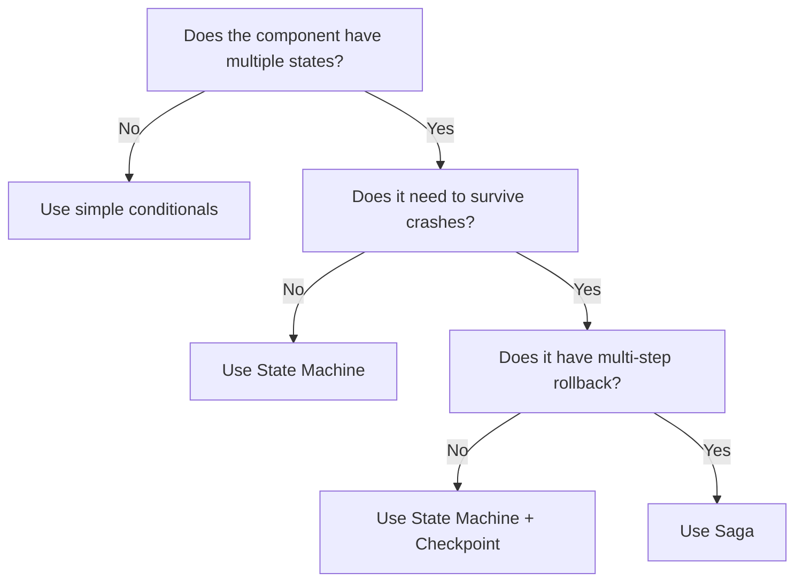
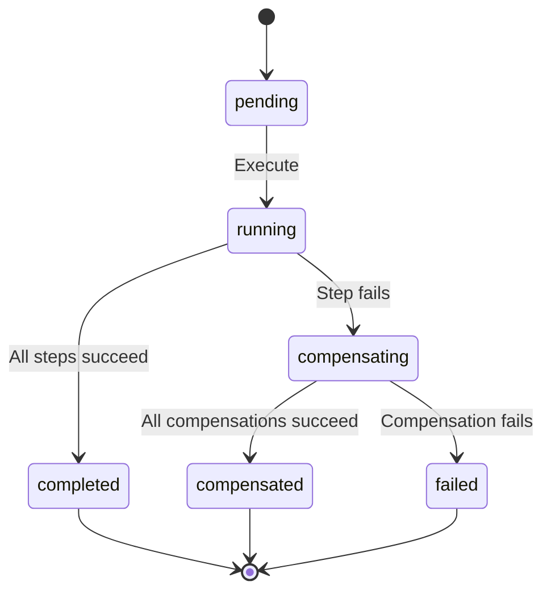

## Overview

Keystone Core uses several orchestration patterns to manage stateful workflows. This guide helps you choose the right pattern for your component and provides migration guidance for existing state machines.

For basic state machine usage, see [State Machine Patterns](../state-machines/).

## Decision Matrix

Use this flowchart to select the right pattern:



### Pattern Comparison

| Pattern | Durability | Complexity | Best For | Not For |
|---------|-----------|-----------|---------|---------|
| State Machine | None (in-memory) | Low | <10 states, no crash recovery needed | Long-running operations |
| State Machine + Checkpoint | Crash-recoverable | Low-Medium | Any machine needing restart survival | Multi-step rollback |
| Saga | Full (step-level log) | Medium | Multi-step with compensation (upgrade, deploy, migration) | Simple linear workflows |
| Statecharts | None (in-memory) | High | Deep nesting, parallel regions | Current codebase (not justified yet) |
| Event Sourcing | Full (event log) | High | Full replay capability | Simple workflows |
| Actor Model | Message-based | High | Not recommended — NATS provides this | Current architecture |
| Workflow Engine | Full (external) | Very High | Not recommended — external dependency | Zero-dep principle |

## Saga Pattern

**Package**: `pkg/saga`

Use sagas when a workflow has multiple steps that each need compensating transactions (rollback). A saga runs steps forward; if any step fails, previously completed steps are compensated in reverse order.

### When to Use

- Multi-step operations where partial completion is harmful (upgrades, deployments)
- Operations that modify external resources (files, services, databases)
- Workflows where each step has a natural "undo" action

### When NOT to Use

- Simple state transitions without side effects
- Operations where rollback isn't meaningful
- Single-step operations

### Step Model

Each saga step has:

- **Action**: The forward operation (`func(ctx, data) error`)
- **Compensate**: The rollback operation, optional (`func(ctx, data) error`)

Steps share data via `map[string]any`, allowing earlier steps to pass information (like backup paths) to later steps and their compensations.

### Status Lifecycle



### Persistence

Configure a `Log` implementation to persist execution state after each step transition. This enables:

- **Crash recovery**: Resume from the last completed step via `Resume()`
- **Audit trail**: Query past executions by name
- **Debugging**: Inspect step-level status and errors

Two backends are provided:

- `NewMemoryLog()` — for testing and short-lived processes
- `NewSQLiteLog(path)` — for production use with WAL mode

### Code Example

```go
coord := saga.New("upgrade",
    saga.WithLog(saga.NewSQLiteLog("/var/lib/kscore/saga.db")),
)

coord.AddStep(saga.Step{
    Name: "backup",
    Action: func(ctx context.Context, data map[string]any) error {
        path, err := createBackup(ctx)
        if err != nil {
            return err
        }
        data["backup_path"] = path
        return nil
    },
    Compensate: func(ctx context.Context, data map[string]any) error {
        return removeBackup(data["backup_path"].(string))
    },
})

coord.AddStep(saga.Step{
    Name: "upgrade_nodes",
    Action: func(ctx context.Context, data map[string]any) error {
        return upgradeAllNodes(ctx, data["backup_path"].(string))
    },
    Compensate: func(ctx context.Context, data map[string]any) error {
        return restoreFromBackup(ctx, data["backup_path"].(string))
    },
})

exec, err := coord.Execute(ctx, "upgrade-001", nil)
```

### Error Semantics

- If an action fails, compensation runs on all previously **completed** steps in reverse order
- If a compensation also fails, the saga enters `StatusFailed` with both errors joined
- The original action error is always returned to the caller
- Context cancellation stops forward execution immediately

## Checkpoint Pattern

**Package**: `pkg/statemachine/checkpoint`

Use checkpoints when an existing state machine needs to survive process restarts. The checkpoint adapter hooks into `OnTransition` to persist the current state after each transition.

### When to Use

- State machines managing long-running processes (bootstrap, upgrade, promotion)
- Any machine where losing state on crash would require manual recovery
- Components with 5+ states and complex recovery paths

### When NOT to Use

- State machines that complete in milliseconds (circuit breakers, connection managers)
- Machines where restarting from the initial state is acceptable
- Cases requiring step-level rollback (use sagas instead)

### Adapter Model

The adapter:

1. Wraps a `Builder` to add an `OnTransition` callback
2. Persists the destination state after each transition (best-effort — errors are logged, not propagated)
3. On restart, `Restore()` returns the last checkpointed state

### Restore Pattern

```go
adapter := checkpoint.New[State, Event](store, "bootstrap-abc", "bootstrap")
restored, ok := adapter.Restore(ctx)

initial := PhaseInitializing
if ok {
    initial = restored
}

builder := statemachine.New[State, Event](initial).
    AddTransition(PhaseInitializing, EventValidate, PhaseValidating).
    // ... more transitions ...
adapter.Wrap(builder)
machine := builder.MustBuild()
```

### Store Backends

- `NewMemoryStore()` — for testing
- `NewSQLiteStore(path)` — for production, single-row-per-machine with `ON CONFLICT DO UPDATE`

### Type Constraint

The adapter uses `~string` type constraints:

```go
type Adapter[S ~string, E ~string] struct { ... }
```

This works with all 15 existing state machines in the codebase, which all use `string`-typed states and events. The constraint enables `string(state)` serialization without requiring changes to `Machine`.

## Migration Guidance

### Priority Candidates for Checkpoint

These machines are the most complex and would benefit most from crash recovery:

| Component | States | Transitions | Package |
|-----------|--------|-------------|---------|
| Bootstrap | 12 | 20+ | `internal/airgap/bootstrap/` |
| Upgrade | 11 | 18 | `internal/airgap/upgrade/` |
| GitOps Promotion | 10 | 18 | `internal/gitops/` |

### Priority Candidates for Saga

These workflows have multi-step operations with natural compensation points:

| Workflow | Steps | Compensation |
|----------|-------|-------------|
| Upgrade | validate → backup → upgrade → verify | Restore from backup |
| Bootstrap | collect → package → sign → install | Remove installed files |
| File Mirror Sync | snapshot → transfer → verify → activate | Revert to previous snapshot |

### Step-by-Step Migration: Adding Checkpoint

1. **Identify the state machine** and its initial state
2. **Choose a store** (SQLiteStore for production components)
3. **Create the adapter** with a unique machine ID (e.g., `"bootstrap-" + nodeID`)
4. **Add restore logic** before building the machine
5. **Call `adapter.Wrap(builder)`** before `Build()`/`MustBuild()`
6. **Test**: verify checkpoint is saved after transitions, verify restore works

### Step-by-Step Migration: Converting to Saga

1. **Map the workflow steps** — identify discrete actions and their rollbacks
2. **Define data flow** — what data passes between steps via `data map[string]any`
3. **Create the coordinator** with `saga.New(name, saga.WithLog(...))`
4. **Add steps** with Action and Compensate functions
5. **Replace the state machine** with `coord.Execute()`
6. **Test**: verify happy path, failure-with-compensation, and resume

## Not Recommended (and Why)

### Actor Model

NATS already provides message-based communication with subject routing, queue groups, and JetStream persistence. Adding an actor runtime would duplicate these capabilities with additional complexity. NATS subjects map directly to actor addresses; JetStream provides mailbox durability.

### CRDTs

CRDTs solve distributed convergence for eventually-consistent data. Keystone Core's state machines require strict ordering and deterministic transitions — CRDTs would weaken these guarantees without benefit. For distributed metadata that needs conflict-free merges, NATS KV with last-write-wins already suffices.

### Workflow Engine (Temporal/Cadence)

External workflow engines add significant operational overhead (separate service, database, workers). This conflicts with Keystone Core's zero-dependency design principle. The saga pattern provides the needed durability and compensation without external dependencies.

### Reactive Streams

NATS JetStream already handles backpressure via consumer acknowledgment and flow control. Adding a reactive streams layer would introduce complexity without meaningful benefit for the current event processing patterns.

### Statecharts (Harel)

Statecharts add hierarchical states, parallel regions, and history pseudo-states. None of the 15 current state machines exhibit patterns (deep nesting, parallel execution) that would benefit. The added runtime complexity and testing burden isn't justified. Revisit if a component clearly needs parallel state regions.

## Further Reading

- [State Machine Patterns](../state-machines/) — basic usage, guards, callbacks, testing
- [`pkg/saga` source](https://github.com/shawnbutts/keystone-core/tree/main/pkg/saga)
- [`pkg/statemachine/checkpoint` source](https://github.com/shawnbutts/keystone-core/tree/main/pkg/statemachine/checkpoint)
