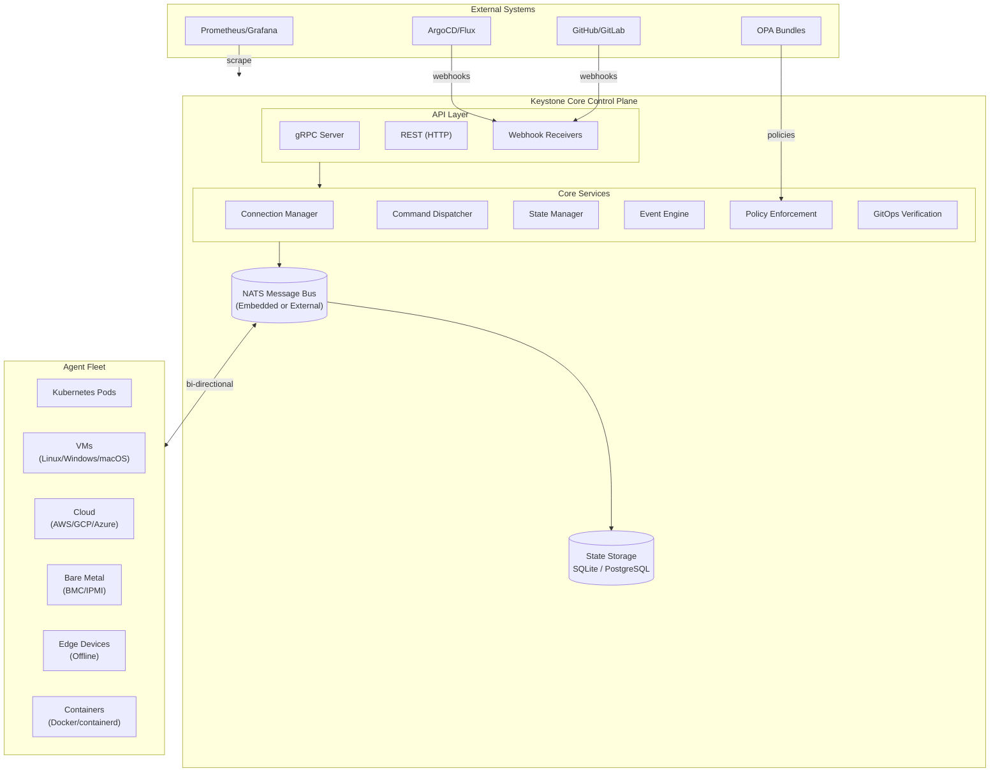
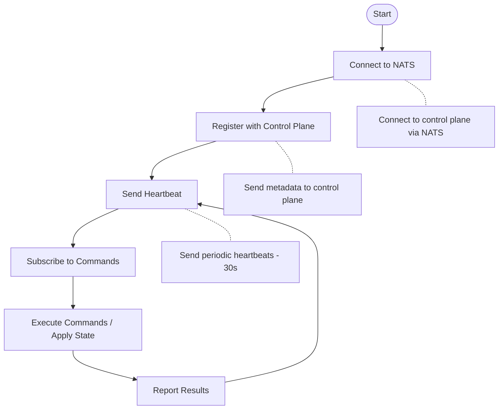
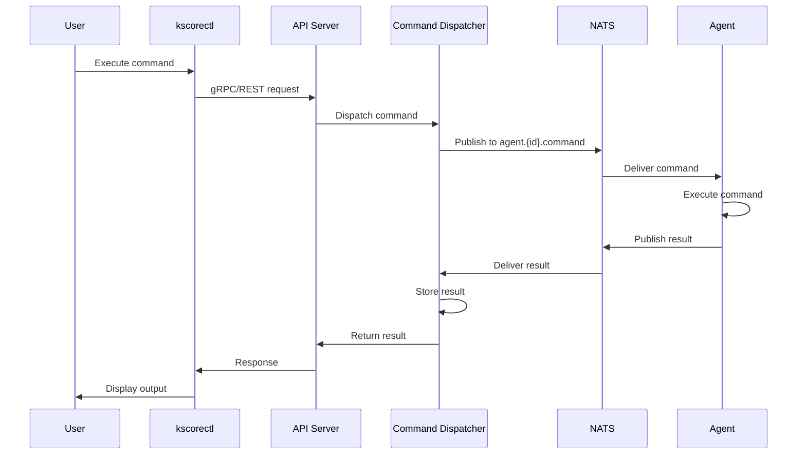
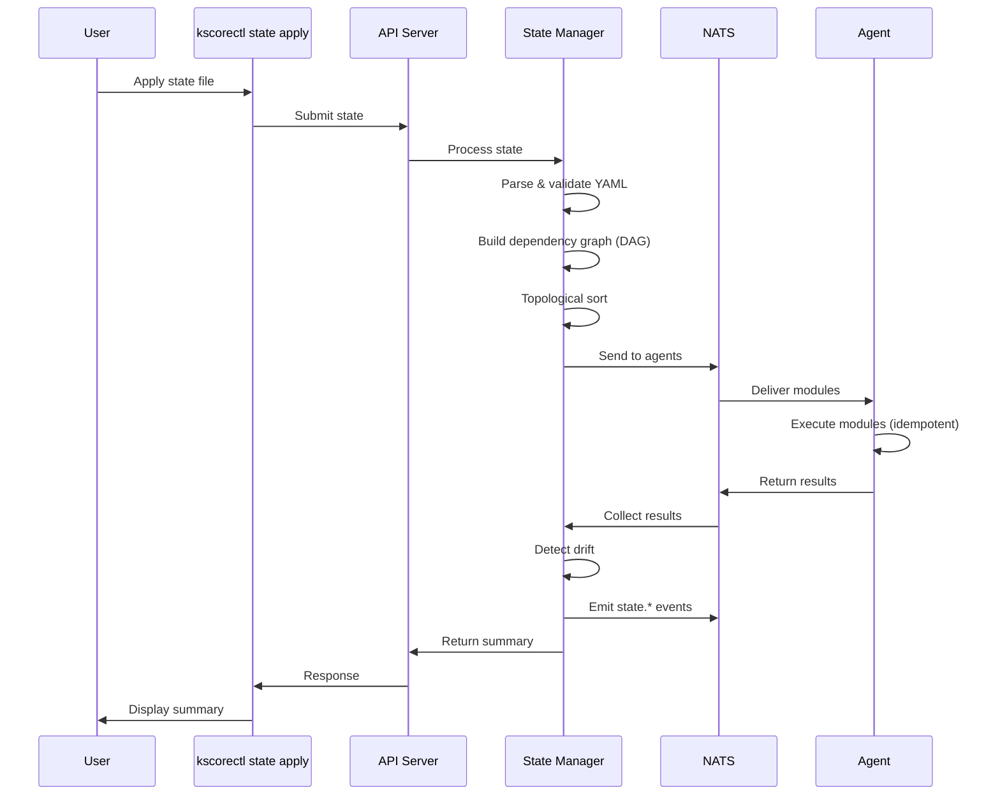
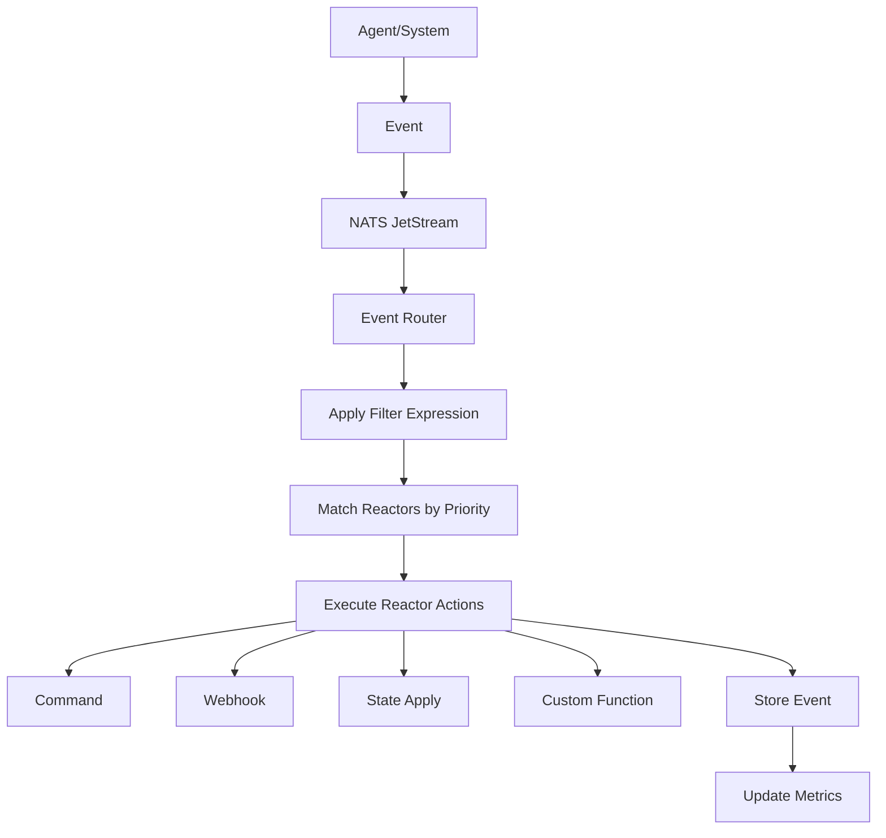
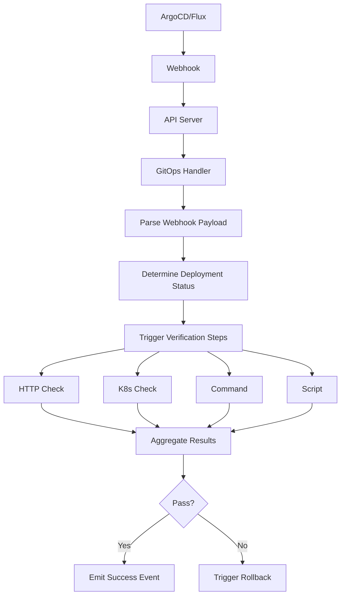
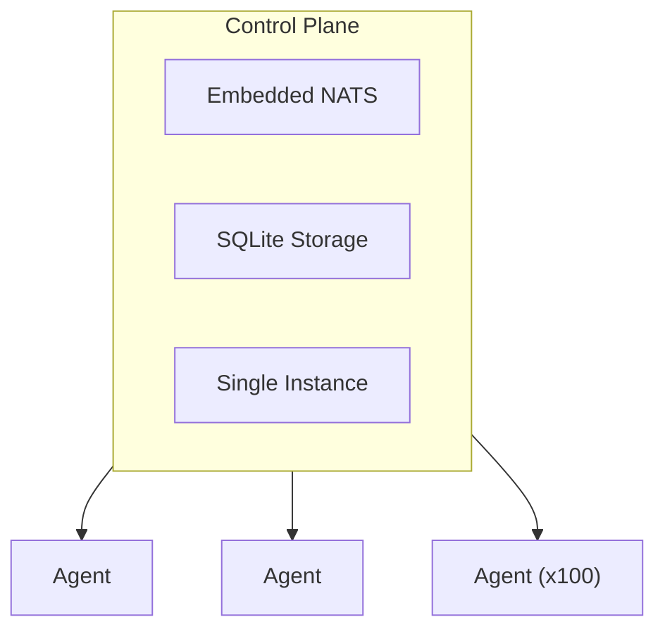
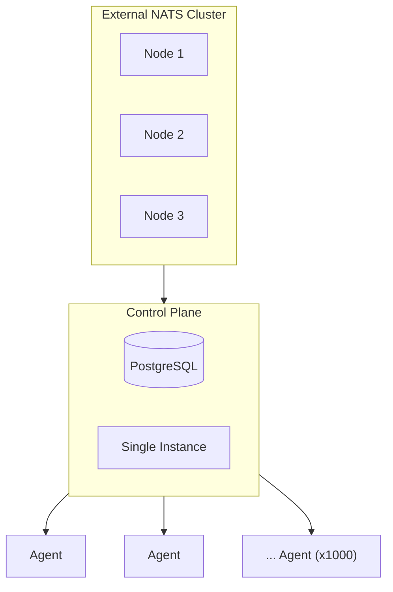
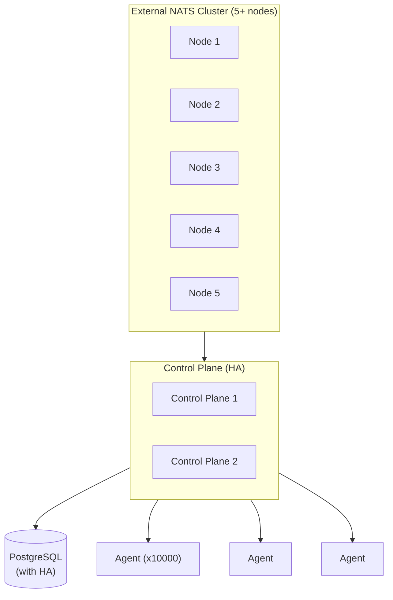

## High-Level Architecture

Keystone Core follows a **control plane + agent** architecture, similar to Kubernetes but designed for infrastructure operations rather than container orchestration.

## Core Components

### 1. Control Plane

The control plane orchestrates all operations. It consists of:

#### API Server
- **gRPC** for high-performance agent communication
- **REST** for user/tool interaction
- **Webhooks** for GitOps tool integration

**Responsibilities**:
- Authenticate and authorize requests
- Route commands to agents
- Serve metrics and health checks
- Handle webhook events

#### Connection Manager
Tracks all connected agents and their metadata.

**Key Functions**:
- Agent registration
- Heartbeat monitoring
- Connection state tracking
- Metadata storage

**Data Tracked**:
- Agent ID, datacenter, environment, role
- OS, architecture, kernel version
- Last heartbeat timestamp
- Custom tags

#### Command Dispatcher
Routes command execution requests to targeted agents.

**Features**:
- Expression-based targeting (`role:web and datacenter:us-east-1`)
- Batch execution with concurrency control
- Job tracking and result collection
- Timeout and retry handling

#### State Manager
Executes declarative state configurations.

**Capabilities**:
- Parse and validate state files (YAML)
- Resolve dependencies (requisites)
- Execute state modules (file, package, service, user, group, cmd)
- Detect configuration drift
- Generate state change events

#### Event Engine
Processes and routes infrastructure events.

**Components**:
- **Publisher**: Publishes events to NATS JetStream
- **Subscriber**: Receives events from JetStream
- **Router**: Routes events to reactors based on filters
- **Reactor Engine**: Executes automated responses
- **Storage**: Persists events to database (SQLite/PostgreSQL)

**Event Types**: 15 types across agent, job, state, system, and user categories

#### Policy Enforcement
Enforces policies using OPA (Rego) or CEL.

**Enforcement Points**:
- Pre-execution (before commands/state runs)
- Post-execution (after operations complete)
- On change (when state changes)
- On drift (when drift detected)
- On event (event-triggered)

**Actions**:
- Block (prevent operation)
- Warn (allow but log)
- Audit (log only)
- Remediate (auto-fix)

#### GitOps Integration
Integrates with GitOps tools for deployment lifecycle.

**Webhook Receivers**:
- ArgoCD (application sync/health events)
- Flux (Kustomization/HelmRelease events)
- GitHub (deployment/workflow events)
- GitLab (deployment/pipeline events)

**Verification Framework**:
- HTTP health checks
- Kubernetes resource checks
- Command execution checks
- Custom script checks

**Rollback Automation**:
- ArgoCD rollback executor
- Flux rollback executor
- Git rollback executor
- Approval workflows

### 2. Message Bus (NATS)

NATS provides the communication backbone.

#### Deployment Modes

**Embedded Mode** (development, small deployments):
- NATS runs in-process with control plane
- Zero external dependencies
- Suitable for <100 nodes
- Data stored in-memory (events in JetStream)

**External Cluster Mode** (production):
- Dedicated NATS cluster (3+ nodes)
- High availability
- Suitable for 100+ nodes
- Persistent JetStream storage

**Hybrid Mode** (advanced):
- Control plane connects to external NATS cluster
- Agents run embedded NATS as leaf nodes
- Best of both worlds

#### JetStream

Used for event persistence:
- Durable event storage
- Event replay
- Stream-based consumption
- At-least-once delivery

**Not used for state storage** (SQLite/PostgreSQL preferred for query patterns).

### 3. State Storage

Persistent storage for operational state.

#### SQLite (Embedded)
**Best for**:
- Development and testing
- Small deployments (<100 nodes)
- Home labs and edge locations
- Single-node setups

**Advantages**:
- Zero dependencies
- Simple deployment
- Excellent for getting started

**Limitations**:
- Single-node only
- Limited concurrency
- Not suitable for HA

#### PostgreSQL (Production)
**Best for**:
- Production deployments
- Large scale (100+ nodes)
- High availability requirements
- Multiple control plane nodes (clustering)

**Advantages**:
- ACID transactions
- High concurrency
- HA with replication
- Advanced indexing and querying

**Migration Path**: Automated tooling to migrate from SQLite → PostgreSQL

### 4. Agents

Lightweight Go binaries running on managed nodes.

#### Agent Lifecycle

#### Agent Capabilities
- Command execution (shell, PowerShell, cmd)
- State module execution
- Metadata collection (OS, hardware, cloud provider)
- Event emission
- Local caching (for offline/edge mode)

#### Cross-Platform Support
- **Linux**: All major distributions
- **Windows**: PowerShell and cmd support
- **macOS**: Full support
- **ARM**: ARM64 and ARMv7 support

## Data Flow

### 1. Command Execution Flow

### 2. State Application Flow

### 3. Event-Driven Automation Flow

### 4. GitOps Verification Flow

## Scaling Architecture

### Small Deployment (<100 nodes)

### Medium Deployment (100-1000 nodes)

### Large Deployment (1000+ nodes)

## Security Model

### Transport Security
- **TLS**: All NATS connections can use TLS
- **Mutual TLS**: Agent authentication via client certs
- **API TLS**: HTTPS for REST API

### Authentication
- **NATS Credentials**: JWT-based authentication
- **API Tokens**: Bearer tokens for API access
- **Webhook Signatures**: HMAC verification

### Authorization
- **RBAC**: Role-based access control
- **Policy Enforcement**: OPA/CEL policies gate operations
- **Audit Logging**: All operations logged

### Plugin Security
- **Sandboxing**: Starlark and WASM sandboxed execution
- **Capability-based**: Explicit permission grants only
- **Cryptographic Verification**: Cosign signatures + SumDB
- **Trust Policies**: Control which modules can load

## Design Decisions

### Why NATS Instead of Kafka?
- Simpler operations (embedded mode)
- Lower latency (<1ms vs ~10ms)
- Built-in request-reply patterns
- Lightweight footprint

### Why SQLite AND PostgreSQL?
- **SQLite**: Zero dependencies for getting started
- **PostgreSQL**: Production scale and HA
- **Migration path**: Grow from prototype to production

### Why Separate Event Storage?
- JetStream is great for streaming events
- Relational DB better for complex queries
- Indexes and joins needed for analytics
- Retention policies easier in SQL

### Why Go?
- Cross-platform compilation
- Excellent concurrency (goroutines)
- Small binary size
- Strong ecosystem (gRPC, NATS clients)

## Next Steps

Now that you understand the architecture:

- **[Concepts](../../concepts/)** - Deep dive into each subsystem
- **[Operations](../../operations/)** - Production deployment and operations guides
- **[Reference](../../reference/)** - Complete API/CLI documentation

Or explore specific architectural topics:
- [NATS Integration](../../concepts/message-bus/)
- [State Storage Design](../../concepts/state-storage/)
- [Event System Architecture](../../concepts/events/)
- [Plugin System Design](../../concepts/plugin-system/)
