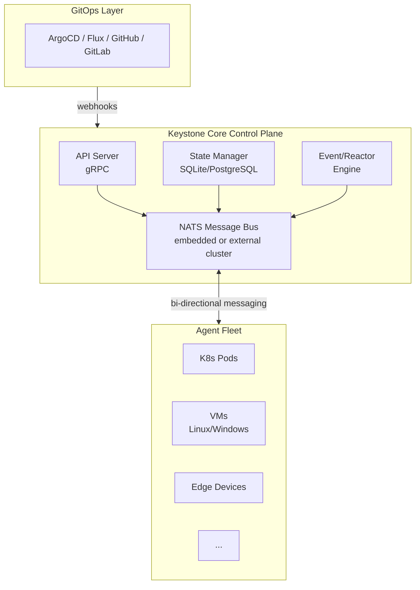

## What is Keystone Core?

Keystone Core is a **runtime infrastructure control plane** designed for cloud-native environments. It operates at the layer between GitOps/IaC deployment tools and your live infrastructure, ensuring systems remain configured correctly, compliant with policies, and responsive to events.

### The Gap Keystone Core Fills

Modern infrastructure has a deployment gap:

1. **GitOps tools** (ArgoCD, Flux) deploy applications declaratively
2. **Your infrastructure** runs in production with dynamic changes
3. **The gap**: Configuration drift, policy violations, failed deployments, manual operations

Keystone Core fills this gap by providing:
- Continuous configuration management
- Real-time event-driven automation
- Policy enforcement and compliance
- Deployment verification and rollback
- Cross-environment operations

## Core Capabilities

### 1. Declarative State Management
Define infrastructure configuration as code using state files. Keystone Core ensures the desired state matches reality.

```yaml
# Example: Ensure nginx is installed and running
nginx_package:
  module: package
  state: installed
  name: nginx

nginx_service:
  module: service
  state: running
  name: nginx
  enabled: true
  require:
    - nginx_package
```

**Features**:
- Idempotent operations (safe to run repeatedly)
- Dependency resolution (requisites)
- Drift detection (alerts when config changes)
- Template rendering with variables and facts

### 2. Remote Execution
Execute commands across your infrastructure with flexible targeting.

```bash
# Execute on all web servers in us-east-1
kscorectl exec run "systemctl restart nginx" \
  --target "role:web and datacenter:us-east-1"

# Batch execution across 1000 nodes
kscorectl exec run "apt-get update" --target "os:ubuntu" --concurrency 100
```

**Features**:
- Glob and expression-based targeting
- Parallel batch execution
- Cross-platform support (Linux, Windows, macOS)
- Git-style plugin architecture

### 3. Event-Driven Automation
React to infrastructure events automatically with reactors.

```yaml
# Example: Auto-remediate failed services
- name: restart_failed_services
  filter: "type == 'agent.service.failed'"
  actions:
    - type: command
      command: "systemctl restart {{ event.data.service }}"
      target: "agent_id == {{ event.source }}"
```

**Features**:
- 15 event types (agent, job, state, system, user-defined)
- Powerful filtering with expressions
- Multiple action types (command, webhook, state application)
- Event storage and replay

### 4. GitOps Integration
Deep integration with ArgoCD and Flux for deployment lifecycle management.

**Capabilities**:
- Webhook receivers (ArgoCD, Flux, GitHub, GitLab)
- Deployment verification framework
- Automated rollback on failure
- Promotion pipelines (dev → staging → prod)
- Git sync for configuration

### 5. Policy Enforcement
Continuous compliance using OPA (Rego) or CEL policies.

```rego
# Example OPA policy: Require encryption
package kscore.security

deny[msg] {
  input.resource.type == "disk"
  not input.resource.encrypted
  msg = "All disks must be encrypted"
}
```

**Features**:
- Policy-as-code (OPA Rego, CEL expressions)
- Enforcement points (pre/post execution, on drift, on events)
- Audit logging
- Compliance reporting

### 6. Multi-Environment Support
Unified interface for heterogeneous infrastructure.

**Supported Environments**:
- **Kubernetes**: Native CRDs, operator mode
- **VMs**: Cross-platform agents (Linux, Windows, macOS)
- **Cloud**: AWS, GCP, Azure detection
- **Edge**: Offline mode, local buffering
- **Bare Metal**: Hardware detection, BMC/IPMI integration
- **Containers**: Docker, containerd detection
- **Service Mesh**: Istio, Linkerd, Consul integration

### 7. Plugin System
Extend Keystone Core with custom modules.

**Languages**:
- **Starlark**: Python-like, deterministic, fast iteration
- **WASM**: High performance (Rust, Go, C++)

**SDKs provided** for all languages with example modules.

### 8. Full Observability
Built-in monitoring and troubleshooting tools.

- **Prometheus metrics**: 70+ metrics exported
- **Structured logging**: JSON, logfmt, text formats
- **Distributed tracing**: OpenTelemetry integration
- **Real-time TUI monitor**: Terminal-based dashboard
- **Grafana dashboards**: 10 pre-built dashboards

## Architecture Overview



### Key Components

- **Control Plane**: API server, state manager, event engine
- **NATS**: Message bus (embedded mode or external cluster)
- **Agents**: Lightweight Go binaries on managed nodes
- **Storage**: SQLite (dev/small) or PostgreSQL (production)

## Use Cases

### 1. GitOps + Runtime Operations
You use ArgoCD to deploy applications. Keystone Core:
- Verifies deployments succeeded (health checks, smoke tests)
- Automatically rolls back failed deployments
- Enforces security policies on deployed workloads
- Detects and remediates configuration drift

### 2. Hybrid Infrastructure Management
You have Kubernetes clusters, legacy VMs, and edge devices. Keystone Core:
- Provides unified interface across all environments
- Applies consistent policies everywhere
- Executes commands across heterogeneous infrastructure
- Collects metrics and logs uniformly

### 3. Compliance Automation
You need continuous compliance (SOC 2, PCI, HIPAA). Keystone Core:
- Enforces policies in real-time (prevent violations)
- Audits all operations (who, what, when)
- Generates compliance reports
- Remediates violations automatically

### 4. Event-Driven Operations
Your infrastructure generates events. Keystone Core:
- Reacts to failures automatically (restart services, scale up)
- Integrates with external systems (PagerDuty, Slack)
- Correlates events for root cause analysis
- Stores events for replay and debugging

## Comparison with Other Tools

| Feature | Keystone Core | Salt | Ansible | ArgoCD/Flux |
|---------|------------|------|---------|-------------|
| Declarative State | ✅ | ✅ | ✅ | ✅ |
| Remote Execution | ✅ | ✅ | ✅ | ❌ |
| Event System | ✅ | ✅ | ❌ | ❌ |
| GitOps Integration | ✅ | ❌ | ❌ | ✅ |
| Policy Enforcement | ✅ (OPA/CEL) | ❌ | ❌ | ❌ |
| Multi-Cloud | ✅ | ⚠️ | ⚠️ | ❌ |
| Plugin System | ✅ (Starlark/WASM) | ⚠️ (Python) | ⚠️ (Python) | ❌ |
| Cloud-Native | ✅ | ❌ | ❌ | ✅ |
| Deployment Verification | ✅ | ❌ | ❌ | ⚠️ |

**Keystone Core's unique position**: Combines Salt's operational capabilities with cloud-native GitOps workflows.

## Next Steps

Ready to try Keystone Core?

1. **[Install Keystone Core](../installation/)** - Get it running on your machine
2. **[Quick Start](../quick-start/)** - Deploy your first agent in 5 minutes
3. **[Architecture](../architecture/)** - Understand the system design

Or explore specific capabilities:
- [State Management Concepts](../../concepts/state-management/)
- [Event System Overview](../../concepts/events/)
- [GitOps Integration Guide](../../concepts/gitops/)
