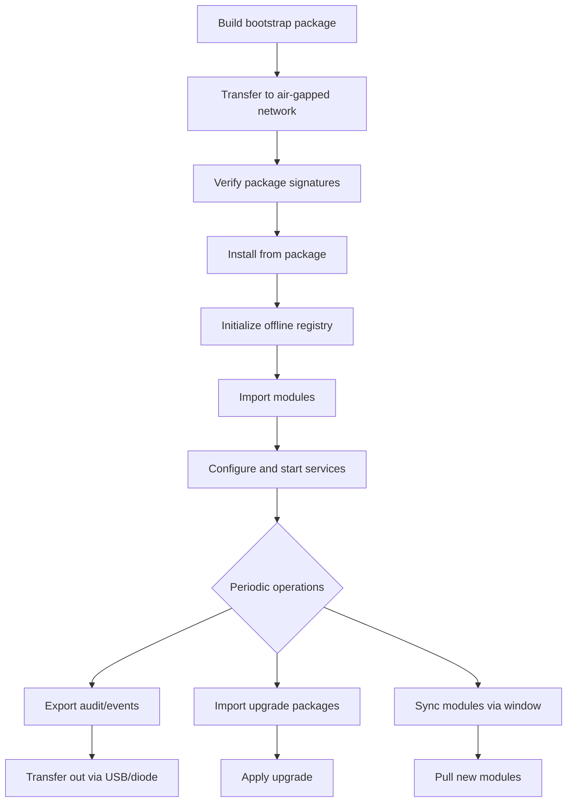

## Overview

Keystone Core supports fully air-gapped deployments where nodes have no internet access. This guide covers the complete lifecycle: initial installation via bootstrap packages, ongoing module management via offline registries, version upgrades via upgrade packages, and operational data transfer via export/import or data diode.

```
┌─────────────────────┐                    ┌─────────────────────┐
│  Connected Network  │  sneakernet/USB/   │  Air-Gapped Network │
│                     │  data diode        │                     │
│  kscore-bootstrap   │ ──── packages ──→  │  kscore-bootstrap   │
│  kscore-registry    │ ──── modules  ──→  │  kscore-registry    │
│  kscore-upgrade     │ ──── upgrades ──→  │  kscore-upgrade     │
│  kscore-transfer    │ ←── audit/events ─ │  kscore-transfer    │
└─────────────────────┘                    └─────────────────────┘
```

## Bootstrap Packages

Bootstrap packages contain everything needed for an initial Keystone Core installation: binaries, modules, blueprints, policies, configuration templates, and an install script.

### Creating a Bootstrap Package

On a connected machine with access to the Keystone Core build artifacts:

```bash
# Create a package for linux/amd64
kscorectl bootstrap package create \
  --version 0.1.0 \
  --platform linux/amd64 \
  --output bootstrap-0.1.0-linux-amd64.tar.gz

# Include specific modules and blueprints
kscorectl bootstrap package create \
  --version 0.1.0 \
  --platform linux/amd64 \
  --modules-dir ./modules \
  --blueprints-dir ./blueprints \
  --policies-dir ./policies \
  --sign --key-file signing-key.pem \
  --output bootstrap-0.1.0-linux-amd64.tar.gz
```

### Verifying a Package

Before transferring to the air-gapped network, verify package integrity:

```bash
# Verify signatures and checksums
kscorectl bootstrap package verify \
  bootstrap-0.1.0-linux-amd64.tar.gz \
  --trusted-key signing-key.pub
```

### Inspecting a Package

View the package manifest without extracting:

```bash
kscorectl bootstrap package inspect bootstrap-0.1.0-linux-amd64.tar.gz
```

This displays the version, platform, included components, modules, and content checksums.

### Installing from a Package

On the air-gapped target machine:

```bash
# Install binaries and content
kscorectl bootstrap package install bootstrap-0.1.0-linux-amd64.tar.gz

# Install with custom paths
kscorectl bootstrap package install bootstrap-0.1.0-linux-amd64.tar.gz \
  --bin-dir /usr/local/bin \
  --config-dir /etc/keystone-core \
  --data-dir /var/lib/keystone-core
```

The installer extracts binaries, applies configuration templates, and populates the local module registry.

## Offline Module Registry

The offline registry provides a local, filesystem-backed module registry for air-gapped environments.

### Initializing a Registry

```bash
# Create a new offline registry
kscorectl registry offline init --dir /opt/kscore-registry
```

### Populating the Registry

Import modules from a bootstrap package or an exported mirror directory:

```bash
# Import from a bootstrap package
kscorectl registry offline import \
  --dir /opt/kscore-registry \
  bootstrap-0.1.0-linux-amd64.tar.gz

# Import from a mirror directory
kscorectl registry offline import \
  --dir /opt/kscore-registry \
  ./module-mirror/
```

Export modules from an online registry for transfer:

```bash
# On a connected machine: export modules for offline use
kscorectl module mirror export \
  --registry https://registry.example.com \
  --output ./module-mirror/
```

### Searching and Listing

```bash
# List all modules in the offline registry
kscorectl registry offline list --dir /opt/kscore-registry

# Search for modules
kscorectl registry offline search --dir /opt/kscore-registry dns
```

### Signature Verification

```bash
# Add a trusted signing key
kscorectl registry offline trust add \
  --dir /opt/kscore-registry \
  --name "release-signer" \
  --key-file /etc/keystone-core/trust/release.pub

# Verify all module signatures
kscorectl registry offline verify \
  --dir /opt/kscore-registry \
  --trust-dir /etc/keystone-core/trust

# List trusted keys
kscorectl registry offline trust list --dir /opt/kscore-registry
```

### Maintenance

```bash
# Garbage collect old module versions
kscorectl registry offline gc \
  --dir /opt/kscore-registry \
  --keep-versions 3 \
  --max-age 90d

# Regenerate the registry index
kscorectl registry offline reindex --dir /opt/kscore-registry
```

## Upgrade Packages

Upgrade packages contain everything needed to move from one version to another: new binaries, modules, database migrations, pre/post-upgrade scripts, and configuration change documentation.

### Creating an Upgrade Package

On a connected build machine:

```bash
kscorectl upgrade package create \
  --from-version 0.1.0 \
  --to-version 0.2.0 \
  --platform linux/amd64 \
  --sign --key-file signing-key.pem \
  --output upgrade-0.1.0-to-0.2.0-linux-amd64.tar.gz
```

### Verifying and Inspecting

```bash
# Verify signatures, checksums, and compatibility
kscorectl upgrade package verify \
  upgrade-0.1.0-to-0.2.0-linux-amd64.tar.gz \
  --trusted-key signing-key.pub

# Inspect manifest, migrations, and breaking changes
kscorectl upgrade package inspect \
  upgrade-0.1.0-to-0.2.0-linux-amd64.tar.gz
```

The verifier checks signature validity, file checksums, and version compatibility with the currently installed version.

### Applying an Upgrade

```bash
# Apply the upgrade (extract → verify → backup → replace → verify)
kscorectl upgrade package apply \
  upgrade-0.1.0-to-0.2.0-linux-amd64.tar.gz

# Rollback if something goes wrong
kscorectl upgrade package rollback
```

The upgrade installer follows this sequence:

1. **Extract** the upgrade package to a temporary directory
2. **Verify** signatures and checksums
3. **Backup** current binaries and configuration
4. **Replace** binaries and apply migrations
5. **Verify** the new installation is functional

If any step fails, the installer stops and the rollback command restores from the backup created in step 3.

## Data Export and Import

Transfer operational data (audit logs, events, state history) across air-gap boundaries for compliance, analytics, or centralized monitoring.

### Exporting Data

```bash
# Export audit logs from the last 7 days
kscorectl transfer export \
  --type audit \
  --since 168h \
  --sign --key-file signing-key.pem \
  --output audit-export-2026-02-23.tar.gz

# Export all data types
kscorectl transfer export \
  --type full \
  --since 168h \
  --encrypt --recipient ops-team@example.com \
  --output full-export-2026-02-23.tar.gz
```

Export types: `audit`, `events`, `state`, `inventory`, `full`.

Packages are signed and optionally encrypted with age.

### Verifying an Export

```bash
kscorectl transfer verify \
  audit-export-2026-02-23.tar.gz \
  --trusted-key signing-key.pub
```

### Importing Data

On the receiving side:

```bash
# Import all datasets from the package
kscorectl transfer import \
  audit-export-2026-02-23.tar.gz

# Import only specific datasets
kscorectl transfer import \
  full-export-2026-02-23.tar.gz \
  --datasets audit,events
```

Encrypted packages are decrypted automatically if the recipient's private key is available.

## Sync Windows

For environments with intermittent connectivity (e.g., scheduled maintenance windows), sync windows automate data transfer during allowed periods.

```bash
# Add a sync window
kscorectl transfer sync add \
  --name "nightly-sync" \
  --cron "0 2 * * *" \
  --duration 2h \
  --bandwidth-limit 10MB/s \
  --operations pull_modules,push_audit_logs

# List configured sync windows
kscorectl transfer sync list

# Show status of a sync window
kscorectl transfer sync status --name "nightly-sync"

# Manually trigger a sync window
kscorectl transfer sync trigger --name "nightly-sync"
```

Sync windows support:

- **Cron scheduling** with timezone support
- **Bandwidth limiting** to avoid saturating the connection
- **Priority ordering** of operations within a window
- **State machine lifecycle** (idle → scheduled → running → completed/failed)
- **Resumable progress** if a window is interrupted

See [Configuration Reference](../../reference/configuration/#sync-windows) for the full YAML format.

## Data Diode

For classified environments using hardware-enforced one-way data diodes (UDP only, no TCP handshake):

```bash
# Sender side (connected network → diode → air-gapped network)
kscorectl transfer diode send \
  --address 10.0.0.1:9999 \
  --fec \
  --rate-limit 1MB/s \
  audit-export-2026-02-23.tar.gz

# Receiver side (air-gapped network, listening)
kscorectl transfer diode receive \
  --address 0.0.0.0:9999 \
  --output /var/lib/keystone-core/incoming/
```

Features:

- **Binary wire protocol** with header, data, parity, and end packet types
- **Forward error correction** (XOR parity FEC) recovers lost packets without retransmission
- **Rate limiting** to match the diode's throughput capacity
- **SHA-256 checksums** for end-to-end integrity verification

See [Configuration Reference](../../reference/configuration/#data-diode) for all settings.

## Compliance Validation

Validate that an air-gapped installation has no external dependencies that would break disconnected operation:

```bash
kscorectl bootstrap airgap-validate \
  --binary-dir /usr/local/bin \
  --config-dir /etc/keystone-core \
  --module-dir /opt/kscore-registry
```

The validator scans four categories:

| Category | What It Checks |
|----------|---------------|
| **Binary** | Binaries exist and have valid checksums |
| **Configuration** | No external URLs in config files (registries, endpoints) |
| **Module** | All module dependencies are available in the offline registry |
| **Network** | No active connections to external hosts |

Each finding has a severity (`pass`, `warn`, `fail`) and a remediation suggestion. The overall report is `compliant: true` only if there are zero `fail` findings.

```bash
# Output report as JSON for automation
kscorectl bootstrap airgap-validate \
  --binary-dir /usr/local/bin \
  --config-dir /etc/keystone-core \
  --output report.json --format json
```

## Deployment Workflow

A typical air-gapped deployment follows this sequence:



### Initial Setup Checklist

1. On a connected machine, create a bootstrap package with all required binaries, modules, and policies
2. Transfer the package to the air-gapped network (USB, optical media, or data diode)
3. Verify the package signature on the target machine
4. Install from the package
5. Initialize the offline module registry and import modules
6. Run `airgap-validate` to confirm no external dependencies
7. Configure `server.yaml` and `agent.yaml` (use the included config templates)
8. Start `kscore-server` and `kscore-agent` services

### Ongoing Operations

- **Module updates**: Create mirror exports on the connected side, transfer, import into offline registry
- **Version upgrades**: Build upgrade packages, transfer, verify, apply
- **Compliance data**: Export audit logs and events, transfer out for central analysis
- **Compliance checks**: Run `airgap-validate` periodically to catch configuration drift

## See Also

- [Configuration Reference](../../reference/configuration/#air-gap-configuration) - Sync window and diode settings
- [CLI Reference](../../reference/cli/) - Full command documentation for bootstrap, transfer, upgrade, and registry
- [Deployment Guide](../deployment/) - General deployment patterns
