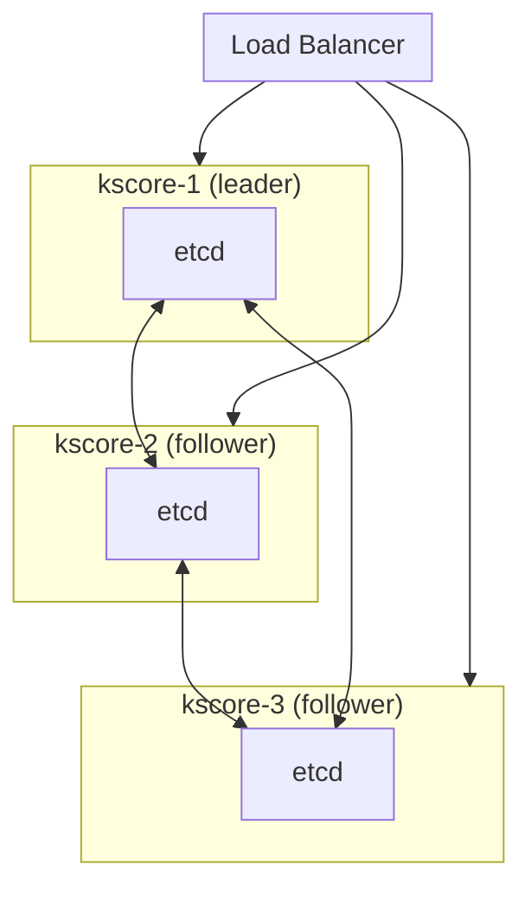
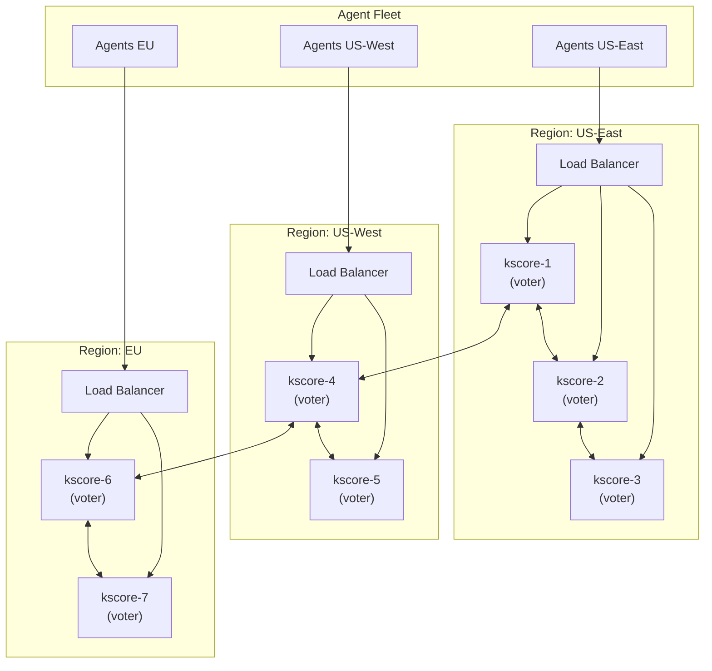
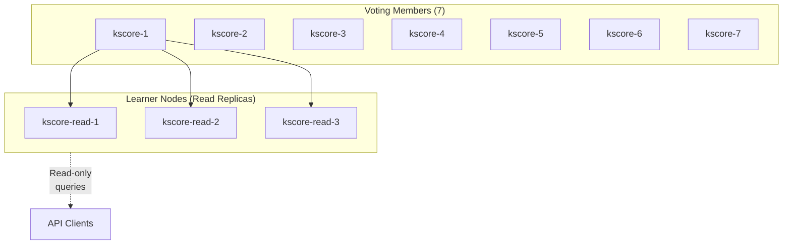

## Overview

This guide covers day-to-day operations for Keystone Core HA clusters, including cluster health monitoring, member management, failover procedures, and recovery operations.

**Prerequisites:**

- Keystone Core cluster deployed with etcd
- Understanding of [Clustering concepts](/docs/concepts/control-plane/#high-availability)
- Access to `kscore-cluster` CLI

## Cluster Architecture

A production Keystone Core cluster consists of:



**Quorum Requirements:**

- 3 nodes: Tolerates 1 failure
- 5 nodes: Tolerates 2 failures
- 7 nodes: Tolerates 3 failures

## Cluster Status

### Check Cluster Health

```bash
# Overall cluster status
kscorectl cluster status

# Output:
# Cluster Status: healthy
# Quorum: 3/3 members healthy
# Leader: kscore-1
#
# Members:
#   kscore-1 (leader)  - healthy - 192.168.1.10:2380
#   kscore-2           - healthy - 192.168.1.11:2380
#   kscore-3           - healthy - 192.168.1.12:2380
```

### List Cluster Members

```bash
# List all members
kscorectl cluster members

# Detailed member info
kscorectl cluster members --output yaml
```

### Check Current Leader

```bash
kscorectl cluster leader

# Output:
# Current Leader: kscore-1
# Leader Since: 2026-01-10T08:30:15Z
# Term: 42
```

### Health Check Details

```bash
# Detailed health check
kscorectl cluster health

# Output:
# Cluster Health Check
# ====================
# etcd: healthy
# NATS: healthy
# API: healthy
# State DB: healthy
#
# Member Health:
#   kscore-1: all checks passed
#   kscore-2: all checks passed
#   kscore-3: all checks passed
```

## Member Management

### Add a New Member

When scaling up the cluster:

```bash
# 1. Prepare the new node with kscore-server installed

# 2. Add member to cluster (run on existing member)
kscorectl cluster add https://192.168.1.13:2380

# 3. Start kscore-server on new node with join config
kscore-server --config /etc/keystone-core/server.yaml --join
```

### Remove a Member

```bash
# Remove unhealthy or decommissioned member
kscorectl cluster remove <member-id>

# Force remove (use with caution)
kscorectl cluster remove <member-id> --force
```

### Trigger Rebalance

After adding/removing members, rebalance agents:

```bash
# Redistribute agents across members
kscorectl cluster rebalance

# Output:
# Rebalancing agents across 4 members...
# Moved 125 agents from kscore-1 to kscore-4
# Moved 118 agents from kscore-2 to kscore-4
# Moved 122 agents from kscore-3 to kscore-4
# Rebalance complete: 500 agents distributed evenly
```

## Failover Procedures

### Automatic Failover

Keystone Core automatically handles leader failover:

1. **Detection**: Followers detect leader failure via heartbeat timeout
2. **Election**: New leader elected via Raft consensus
3. **Promotion**: New leader assumes control
4. **Notification**: Agents notified of new leader

Failover typically completes in 5-15 seconds.

### Manual Failover

For planned maintenance:

```bash
# Step down current leader (triggers election)
kscorectl cluster transfer-leader <target-member-id>

# Verify new leader
kscorectl cluster leader
```

### Monitoring Failovers

```bash
# Check current leader
kscorectl cluster leader

# View leader election history via etcd
ETCDCTL_API=3 etcdctl endpoint status --cluster

# Monitor leader changes via metrics
curl -s http://localhost:9090/api/v1/query?query=kscore_cluster_leader_changes_total | jq
```

## Recovery Procedures

### Single Member Failure

If one member fails:

1. **Assess**: Check if member can recover

   ```bash
   kscorectl cluster status
   ```

2. **If recoverable**: Restart the member

   ```bash
   systemctl restart kscore-server
   ```

3. **If unrecoverable**: Remove and replace

   ```bash
   kscorectl cluster remove <member-id>
   kscorectl cluster add <address>
   ```

### Quorum Loss Recovery

If quorum is lost (majority of members down):

**WARNING**: This procedure may result in data loss.

```bash
# 1. Stop all remaining members
systemctl stop kscore-server

# 2. On the member with most recent data, force new cluster
kscore-server --force-new-cluster

# 3. Verify single-node cluster is healthy
kscorectl cluster status

# 4. Add new members to restore HA
kscorectl cluster add <new-member-address>
```

### Data Recovery from Backup

```bash
# 1. Stop all cluster members
# 2. Restore etcd data on each member
etcdctl snapshot restore /backup/etcd-snapshot.db \
  --name kscore-1 \
  --initial-cluster kscore-1=https://192.168.1.10:2380,...

# 3. Start cluster
systemctl start kscore-server
```

## Performance Tuning

### etcd Tuning

For large clusters (>1000 agents):

```yaml
# server.yaml
cluster:
  etcd:
    # Increase snapshot count for fewer snapshots
    snapshot_count: 10000

    # Increase election timeout for slower networks
    election_timeout: 5000

    # Increase heartbeat interval
    heartbeat_interval: 500

    # Quota for etcd storage (default: 2GB)
    quota_backend_bytes: 8589934592
```

### Work Distribution Tuning

```yaml
cluster:
  # How often to rebalance (default: 5m)
  rebalance_interval: 10m

  # Minimum imbalance to trigger rebalance (percentage)
  rebalance_threshold: 15

  # Maximum agents per member
  max_agents_per_member: 2000
```

## Scaling Guidelines for Large Clusters

This section provides detailed guidance for operating clusters with more than 5 nodes, addressing the unique challenges that arise at larger scales.

### When to Scale Beyond 5 Nodes

Consider scaling beyond 5 nodes when:

| Indicator | Threshold | Action |
|-----------|-----------|--------|
| Agent count | >5,000 | Consider 7-node cluster |
| Agent count | >10,000 | Consider 7+ nodes with read replicas |
| Commands/second | >1,000 sustained | Scale out control plane |
| etcd write latency | P95 >50ms | Add nodes or optimize storage |
| Failover recovery | >30 seconds | Improve geographic distribution |

### Cluster Size Recommendations

| Agents | Cluster Size | Notes |
|--------|--------------|-------|
| <1,000 | 3 nodes | Standard HA configuration |
| 1,000-5,000 | 5 nodes | Tolerates 2 failures |
| 5,000-15,000 | 7 nodes | Tolerates 3 failures, consider regions |
| 15,000-50,000 | 7 nodes + read replicas | Separate read workloads |
| >50,000 | Multiple clusters (federation) | Federated architecture |

**Important**: etcd quorum-based systems perform best with odd-numbered cluster sizes. Never use 4 or 6 nodes.

### Large Cluster Architecture (7+ Nodes)



### etcd Configuration for Large Clusters

Larger clusters require careful etcd tuning:

```yaml
# server.yaml for 7+ node clusters
cluster:
  etcd:
    # Increase heartbeat for multi-region latency
    # Rule: heartbeat < election_timeout / 3
    heartbeat_interval: 1000  # 1 second

    # Election timeout must be >> heartbeat
    # Account for worst-case cross-region RTT
    election_timeout: 10000   # 10 seconds

    # Snapshot configuration
    # Higher count = fewer snapshots = better performance
    # But slower recovery from snapshots
    snapshot_count: 50000

    # Storage quota (increase for large agent counts)
    # ~1KB per agent metadata
    quota_backend_bytes: 8589934592  # 8GB

    # Request timeout for slow networks
    request_timeout: 30000  # 30 seconds

    # Maximum request bytes
    max_request_bytes: 10485760  # 10MB

    # Auto-compaction (required for large clusters)
    auto_compaction_mode: periodic
    auto_compaction_retention: "12h"
```

### Network Latency Considerations

Large clusters often span multiple regions. Account for network latency:

| Region Topology | Typical RTT | Heartbeat | Election Timeout |
|-----------------|-------------|-----------|------------------|
| Single datacenter | <1ms | 100ms | 1000ms |
| Multi-AZ (same region) | 1-5ms | 250ms | 2500ms |
| Cross-region (continental) | 20-50ms | 500ms | 5000ms |
| Cross-region (intercontinental) | 100-200ms | 1000ms | 10000ms |

**Configuration formula:**

```
heartbeat_interval = 5× max_RTT
election_timeout = 10× heartbeat_interval
```

**Example for cross-region (50ms RTT):**

```yaml
cluster:
  etcd:
    heartbeat_interval: 500   # 5 × 50ms = 250ms (rounded up to 500ms)
    election_timeout: 5000    # 10 × 500ms = 5000ms
```

### Storage Requirements

Scale storage with cluster size:

| Agents | etcd Data | WAL Size | Snapshot Size | Total Disk |
|--------|-----------|----------|---------------|------------|
| 1,000 | ~500MB | ~2GB | ~500MB | 10GB |
| 5,000 | ~2GB | ~8GB | ~2GB | 50GB |
| 10,000 | ~5GB | ~15GB | ~5GB | 100GB |
| 20,000 | ~10GB | ~30GB | ~10GB | 200GB |

**Storage recommendations:**

- Use SSDs (NVMe preferred) for etcd data directory
- Separate WAL directory for write-heavy workloads
- RAID 10 for production deployments
- Regular compaction and defragmentation

```yaml
# Separate WAL for better I/O performance
cluster:
  etcd:
    data_dir: /var/lib/etcd/data     # SSD
    wal_dir: /var/lib/etcd/wal       # Separate SSD
```

### CPU and Memory Requirements

Resource requirements scale with cluster size and workload:

| Agents | Members | CPU/Member | Memory/Member |
|--------|---------|------------|---------------|
| 1,000 | 3 | 2 cores | 4GB |
| 5,000 | 5 | 4 cores | 8GB |
| 10,000 | 7 | 8 cores | 16GB |
| 20,000 | 7 | 16 cores | 32GB |

**Additional considerations:**

- Add 50% CPU headroom for traffic spikes
- Add 100% memory headroom for etcd page cache
- Consider dedicated nodes for etcd vs control plane

### Agent Distribution Strategies

For large clusters, optimize agent-to-member assignment:

**Geographic Affinity:**

```yaml
# Route agents to nearest control plane members
cluster:
  agent_affinity:
    enabled: true
    strategy: geographic
    regions:
      us-east:
        members: [kscore-1, kscore-2, kscore-3]
        preferred: true
      us-west:
        members: [kscore-4, kscore-5]
      eu:
        members: [kscore-6, kscore-7]
```

**Load-Based Distribution:**

```yaml
cluster:
  agent_affinity:
    enabled: true
    strategy: least_loaded
    # Consider both agent count and command throughput
    metrics:
      - agent_count: weight=0.4
      - commands_per_second: weight=0.6
```

### Rebalancing Large Clusters

Agent rebalancing in large clusters requires care:

```yaml
cluster:
  rebalance:
    # Larger interval for stability
    interval: 30m

    # Higher threshold to avoid unnecessary moves
    threshold: 20  # percent imbalance

    # Rate limit agent moves
    max_moves_per_cycle: 100

    # Grace period after member joins
    new_member_warmup: 10m

    # Avoid rebalancing during peak hours
    blackout_windows:
      - start: "09:00"
        end: "17:00"
        timezone: "America/New_York"
```

**Manual rebalancing:**

```bash
# Preview rebalance plan
kscorectl cluster rebalance --dry-run

# Execute rebalance (rate limiting is controlled via config)
kscorectl cluster rebalance --reason "adding new member"
```

### Leader Election in Large Clusters

Large clusters have higher leader election overhead:

**Pre-vote optimization:**

```yaml
cluster:
  etcd:
    # Enable pre-vote to reduce disruptive elections
    pre_vote: true

    # Stricter failure detection
    strict_reconfig_check: true
```

**Election priority (optional):**

```yaml
# Prefer specific nodes as leader (e.g., same region as most agents)
cluster:
  leader_priority:
    kscore-1: 100  # Highest priority
    kscore-2: 90
    kscore-3: 90
    kscore-4: 50   # Different region, lower priority
    kscore-5: 50
```

### Read Replicas (Learner Nodes)

For read-heavy workloads, add non-voting learner nodes:



**Adding learner nodes:**

```bash
# Add a new member
kscorectl cluster add https://192.168.1.20:2380

# Note: Learner (non-voting) mode is configured in the server
# configuration, not via CLI flags
```

**Routing reads to learners:**

```yaml
cluster:
  read_routing:
    enabled: true
    learner_preference: 0.8  # 80% reads to learners
    read_preference: nearest  # or: leader, follower, learner
```

### Monitoring Large Clusters

Additional metrics for 5+ node clusters:

```promql
# Cluster convergence time (time for all members to agree)
histogram_quantile(0.99, rate(kscore_cluster_proposal_latency_seconds_bucket[5m]))

# Per-region agent distribution
kscore_agents_total by (region, member)

# Cross-region traffic
rate(kscore_cluster_peer_bytes_sent_total[5m]) by (source_region, dest_region)

# Learner lag (if using read replicas)
kscore_cluster_learner_lag_entries
```

**Alert thresholds for large clusters:**

```yaml
groups:
  - name: large_cluster_alerts
    rules:
      - alert: ClusterConvergenceSlow
        expr: histogram_quantile(0.99, rate(kscore_cluster_proposal_latency_seconds_bucket[5m])) > 2
        for: 5m
        labels:
          severity: warning
        annotations:
          summary: "Cluster convergence taking >2s at P99"

      - alert: LearnerLagHigh
        expr: kscore_cluster_learner_lag_entries > 1000
        for: 5m
        labels:
          severity: warning
        annotations:
          summary: "Read replica {{ $labels.member }} is lagging"

      - alert: CrossRegionLatencyHigh
        expr: kscore_cluster_peer_rtt_seconds > 0.5
        for: 5m
        labels:
          severity: warning
        annotations:
          summary: "High latency between {{ $labels.source }} and {{ $labels.dest }}"
```

### Cluster Health Monitoring Alerts

Comprehensive alert rules for monitoring cluster health:

```yaml
groups:
  - name: kscore-cluster-health
    interval: 30s
    rules:
      # Quorum and availability
      - alert: ClusterNoQuorum
        expr: kscore_cluster_has_quorum == 0
        for: 1m
        labels:
          severity: critical
        annotations:
          summary: "Cluster has lost quorum"
          description: "Cluster cannot accept writes. Immediate action required."
          runbook_url: "https://docs.example.com/runbooks/cluster-no-quorum"

      - alert: ClusterQuorumAtRisk
        expr: kscore_cluster_healthy_members < (kscore_cluster_total_members / 2) + 1
        for: 5m
        labels:
          severity: warning
        annotations:
          summary: "Cluster quorum at risk"
          description: "Only {{ $value }} healthy members. Quorum requires {{ printf \"%.0f\" (kscore_cluster_total_members / 2 + 1) }}"

      # Member health
      - alert: ClusterMemberDown
        expr: kscore_cluster_member_status{status="healthy"} == 0
        for: 2m
        labels:
          severity: warning
        annotations:
          summary: "Cluster member {{ $labels.member }} is down"
          description: "Member has been unhealthy for over 2 minutes"

      - alert: ClusterMemberUnreachable
        expr: time() - kscore_cluster_member_last_heartbeat_timestamp > 60
        for: 1m
        labels:
          severity: warning
        annotations:
          summary: "Cluster member {{ $labels.member }} unreachable"
          description: "No heartbeat received for {{ $value | humanizeDuration }}"

      - alert: ClusterMemberHighLatency
        expr: kscore_cluster_member_rtt_seconds > 0.5
        for: 5m
        labels:
          severity: warning
        annotations:
          summary: "High latency to cluster member {{ $labels.member }}"
          description: "RTT is {{ $value | humanizeDuration }}"

      # Leadership
      - alert: ClusterNoLeader
        expr: kscore_cluster_has_leader == 0
        for: 30s
        labels:
          severity: critical
        annotations:
          summary: "Cluster has no leader"
          description: "Leader election in progress or failed. Cluster cannot accept writes."

      - alert: ClusterFrequentLeaderElections
        expr: increase(kscore_cluster_leader_elections_total[1h]) > 3
        for: 5m
        labels:
          severity: warning
        annotations:
          summary: "Frequent leader elections detected"
          description: "{{ $value }} leader elections in last hour (expected: ≤1)"

      - alert: ClusterLeaderElectionSlow
        expr: histogram_quantile(0.99, rate(kscore_cluster_leader_election_duration_seconds_bucket[5m])) > 10
        for: 5m
        labels:
          severity: warning
        annotations:
          summary: "Leader election taking too long"
          description: "P99 election time is {{ $value | humanizeDuration }}"

      # etcd health
      - alert: EtcdMemberDown
        expr: up{job="etcd"} == 0
        for: 1m
        labels:
          severity: critical
        annotations:
          summary: "etcd member {{ $labels.instance }} is down"
          description: "etcd member has been unreachable for over 1 minute"

      - alert: EtcdClusterNoLeader
        expr: etcd_server_has_leader == 0
        for: 30s
        labels:
          severity: critical
        annotations:
          summary: "etcd cluster has no leader"
          description: "etcd cluster cannot process writes"

      - alert: EtcdHighFsyncLatency
        expr: histogram_quantile(0.99, rate(etcd_disk_wal_fsync_duration_seconds_bucket[5m])) > 0.5
        for: 5m
        labels:
          severity: warning
        annotations:
          summary: "etcd high disk fsync latency on {{ $labels.instance }}"
          description: "P99 fsync latency is {{ $value | humanizeDuration }}"

      - alert: EtcdHighCommitLatency
        expr: histogram_quantile(0.99, rate(etcd_disk_backend_commit_duration_seconds_bucket[5m])) > 0.25
        for: 5m
        labels:
          severity: warning
        annotations:
          summary: "etcd high commit latency on {{ $labels.instance }}"
          description: "P99 commit latency is {{ $value | humanizeDuration }}"

      - alert: EtcdDatabaseSizeHigh
        expr: etcd_mvcc_db_total_size_in_bytes > 6442450944  # 6GB
        for: 5m
        labels:
          severity: warning
        annotations:
          summary: "etcd database size high on {{ $labels.instance }}"
          description: "Database size is {{ $value | humanize1024 }}"

      - alert: EtcdDatabaseSizeCritical
        expr: etcd_mvcc_db_total_size_in_bytes > 7516192768  # 7GB (close to 8GB limit)
        for: 5m
        labels:
          severity: critical
        annotations:
          summary: "etcd database approaching size limit on {{ $labels.instance }}"
          description: "Database size is {{ $value | humanize1024 }}. Compaction required."

      # Agent distribution and load
      - alert: ClusterAgentImbalance
        expr: |
          (max by (cluster) (kscore_cluster_member_agent_count) -
           min by (cluster) (kscore_cluster_member_agent_count)) /
          avg by (cluster) (kscore_cluster_member_agent_count) > 0.3
        for: 15m
        labels:
          severity: warning
        annotations:
          summary: "Agent load imbalanced across cluster members"
          description: "Agent distribution variance is {{ $value | humanizePercentage }}. Consider rebalancing."

      - alert: ClusterMemberOverloaded
        expr: kscore_cluster_member_agent_count > kscore_cluster_recommended_agents_per_member * 1.5
        for: 10m
        labels:
          severity: warning
        annotations:
          summary: "Cluster member {{ $labels.member }} is overloaded"
          description: "Member has {{ $value }} agents (recommended max: {{ kscore_cluster_recommended_agents_per_member }})"

      # Replication and consistency
      - alert: ClusterReplicationLag
        expr: kscore_cluster_replication_lag_entries > 100
        for: 5m
        labels:
          severity: warning
        annotations:
          summary: "Cluster replication lag on {{ $labels.member }}"
          description: "Member is {{ $value }} entries behind leader"

      - alert: ClusterDataInconsistency
        expr: kscore_cluster_consistency_check_failures_total > 0
        for: 1m
        labels:
          severity: critical
        annotations:
          summary: "Data inconsistency detected in cluster"
          description: "Consistency check failed. Manual investigation required."

      # Network partitions
      - alert: ClusterNetworkPartitionSuspected
        expr: |
          count by (cluster) (kscore_cluster_member_status{status="healthy"}) <
          count by (cluster) (kscore_cluster_member_status) and
          kscore_cluster_has_quorum == 1
        for: 5m
        labels:
          severity: warning
        annotations:
          summary: "Possible network partition in cluster"
          description: "Some members unreachable but cluster has quorum. Check network connectivity."

      - alert: ClusterSplitBrainRisk
        expr: |
          count by (cluster) (kscore_cluster_member_status{status="healthy"}) ==
          ceil(count by (cluster) (kscore_cluster_member_status) / 2)
        for: 2m
        labels:
          severity: critical
        annotations:
          summary: "Split-brain risk in cluster"
          description: "Exactly half of members reachable. Immediate network investigation required."

      # Resource utilization
      - alert: ClusterCPUSaturation
        expr: avg by (cluster) (rate(process_cpu_seconds_total{job="kscore-server"}[5m])) * 100 > 80
        for: 10m
        labels:
          severity: warning
        annotations:
          summary: "Cluster CPU utilization high"
          description: "Average CPU across cluster is {{ $value | printf \"%.1f\" }}%"

      - alert: ClusterMemorySaturation
        expr: avg by (cluster) (process_resident_memory_bytes{job="kscore-server"} / node_memory_MemTotal_bytes) > 0.85
        for: 10m
        labels:
          severity: warning
        annotations:
          summary: "Cluster memory utilization high"
          description: "Average memory across cluster is {{ $value | humanizePercentage }}"

  - name: kscore-cluster-operations
    interval: 60s
    rules:
      # Backup and recovery
      - alert: ClusterBackupStale
        expr: time() - kscore_cluster_last_backup_timestamp > 86400  # 24 hours
        for: 1h
        labels:
          severity: warning
        annotations:
          summary: "Cluster backup is stale"
          description: "Last backup was {{ $value | humanizeDuration }} ago"

      - alert: ClusterBackupFailed
        expr: increase(kscore_cluster_backup_failures_total[1h]) > 0
        for: 5m
        labels:
          severity: warning
        annotations:
          summary: "Cluster backup failed"
          description: "Backup failure detected. Check backup logs."

      # Maintenance windows
      - alert: ClusterMaintenanceOverdue
        expr: time() - kscore_cluster_last_maintenance_timestamp > 604800  # 7 days
        for: 1h
        labels:
          severity: info
        annotations:
          summary: "Cluster maintenance overdue"
          description: "Consider scheduling maintenance window for compaction/cleanup"

      # Version consistency
      - alert: ClusterVersionMismatch
        expr: count(count by (version) (kscore_build_info{job="kscore-server"})) > 1
        for: 30m
        labels:
          severity: warning
        annotations:
          summary: "Mixed versions in cluster"
          description: "Multiple Keystone versions running. Complete rolling upgrade."
```

**Alertmanager Routing for Cluster Alerts:**

```yaml
# alertmanager.yml
route:
  receiver: default
  routes:
    # Critical cluster alerts go to PagerDuty
    - match:
        alertname: ClusterNoQuorum
      receiver: pagerduty-critical
      continue: true
    - match:
        alertname: ClusterNoLeader
      receiver: pagerduty-critical
      continue: true
    - match:
        alertname: ClusterSplitBrainRisk
      receiver: pagerduty-critical
      continue: true
    - match:
        alertname: ClusterDataInconsistency
      receiver: pagerduty-critical
      continue: true

    # Warning cluster alerts go to Slack
    - match_re:
        alertname: Cluster.*
        severity: warning
      receiver: slack-cluster
      group_by: [alertname, cluster]
      group_interval: 5m

receivers:
  - name: pagerduty-critical
    pagerduty_configs:
      - service_key: $PAGERDUTY_CRITICAL_KEY
        severity: critical

  - name: slack-cluster
    slack_configs:
      - api_url: $SLACK_WEBHOOK
        channel: '#cluster-alerts'
        title: '{{ .GroupLabels.alertname }}'
        text: '{{ range .Alerts }}{{ .Annotations.description }}{{ end }}'
```

### Upgrade Procedures for Large Clusters

Rolling upgrades require more care with larger clusters:

```bash
#!/bin/bash
# Large cluster rolling upgrade script

CLUSTER_SIZE=$(kscorectl cluster members | wc -l)
BATCH_SIZE=$((CLUSTER_SIZE / 3))  # Upgrade 1/3 at a time

# Get members by role (filter with jq)
LEADER=$(kscorectl cluster leader --output json | jq -r '.name')
LEARNERS=$(kscorectl cluster members --output json | jq -r '.[] | select(.role=="learner") | .name')
FOLLOWERS=$(kscorectl cluster members --output json | jq -r '.[] | select(.role=="follower") | .name')

# 1. Upgrade learners first (no impact on writes)
for learner in $LEARNERS; do
  echo "Upgrading learner: $learner"
  ssh $learner "systemctl stop kscore-server && yum update -y kscore-server && systemctl start kscore-server"
  sleep 30
  kscorectl cluster health
done

# 2. Upgrade followers in batches
echo "$FOLLOWERS" | xargs -n $BATCH_SIZE | while read batch; do
  for follower in $batch; do
    echo "Upgrading follower: $follower"
    ssh $follower "systemctl stop kscore-server && yum update -y kscore-server && systemctl start kscore-server"
  done
  sleep 60
  kscorectl cluster health
done

# 3. Stepdown and upgrade leader last
echo "Stepping down leader: $LEADER"
kscorectl cluster transfer-leader <target-member-id>
sleep 15
ssh $LEADER "systemctl stop kscore-server && yum update -y kscore-server && systemctl start kscore-server"
sleep 30

# 4. Verify
kscorectl cluster status
kscorectl cluster health
```

### Disaster Recovery for Large Clusters

Large clusters need region-aware backup strategies:

```yaml
# Backup configuration for multi-region clusters
backup:
  schedule: "0 */6 * * *"  # Every 6 hours

  # Take backup from each region
  regional_backups:
    enabled: true
    regions: [us-east, us-west, eu]

  # Store backups in region-local storage
  destinations:
    us-east:
      type: s3
      bucket: kscore-backups-us-east
      region: us-east-1
    us-west:
      type: s3
      bucket: kscore-backups-us-west
      region: us-west-2
    eu:
      type: s3
      bucket: kscore-backups-eu
      region: eu-west-1

  # Cross-region replication for disaster recovery
  cross_region_replication:
    enabled: true
    target_regions: 2  # Backup replicated to 2 other regions
```

### Scaling Down Large Clusters

When reducing cluster size:

```bash
# 1. Check current distribution
kscorectl cluster members --output yaml

# 2. Migrate agents off nodes being removed
kscorectl cluster drain kscore-7
kscorectl cluster drain kscore-6

# 3. Wait for drain to complete
watch 'kscorectl cluster members --output yaml | grep -E "kscore-[67]"'

# 4. Remove drained members
kscorectl cluster remove kscore-7
kscorectl cluster remove kscore-6

# 5. Verify new cluster size
kscorectl cluster status
```

## Monitoring

### Key Metrics

| Metric | Alert Threshold | Description |
|--------|-----------------|-------------|
| `kscore_cluster_members_healthy` | < expected | Healthy member count |
| `kscore_cluster_has_quorum` | == 0 | Quorum lost |
| `kscore_cluster_leader_changes_total` | Rate > 5/hour | Frequent elections |
| `kscore_cluster_etcd_operation_duration_seconds` | P95 > 100ms | Slow etcd ops |

### Grafana Dashboard

Import the Cluster Health dashboard from `deploy/grafana/dashboards/cluster-health.json`:

- Cluster overview: quorum, members, leader status
- Member health timeline
- Leader election frequency
- etcd operation latency

### Alert Rules

Critical alerts to configure:

```yaml
# Prometheus alert rules
- alert: KscoreClusterNoQuorum
  expr: kscore_cluster_has_quorum == 0
  for: 1m
  labels:
    severity: critical
  annotations:
    summary: "Keystone Core cluster lost quorum"

- alert: KscoreClusterMemberUnhealthy
  expr: kscore_cluster_member_status != 1
  for: 2m
  labels:
    severity: warning
  annotations:
    summary: "Cluster member {{ $labels.member }} is unhealthy"
```

## Maintenance Operations

### Rolling Restart

For upgrades or configuration changes:

```bash
# 1. Restart followers first, one at a time
for member in kscore-2 kscore-3; do
  ssh $member "systemctl restart kscore-server"
  sleep 30
  kscorectl cluster health
done

# 2. Failover from leader
kscorectl cluster transfer-leader <target-member-id>

# 3. Restart old leader
ssh kscore-1 "systemctl restart kscore-server"

# 4. Verify cluster health
kscorectl cluster status
```

### etcd Compaction

Periodically compact etcd history:

```bash
# Get current revision
ETCDCTL_API=3 etcdctl endpoint status

# Compact history (keep last 1000 revisions)
ETCDCTL_API=3 etcdctl compact <revision-1000>

# Defragment to reclaim space
ETCDCTL_API=3 etcdctl defrag
```

### Backup Cluster State

```bash
# Backup etcd
etcdctl snapshot save /backup/etcd-$(date +%Y%m%d).db

# Backup Keystone Core config
tar -czf /backup/kscore-config-$(date +%Y%m%d).tar.gz /etc/keystone-core/
```

### Zero-Downtime etcd Upgrade

This procedure upgrades etcd across a Keystone Core cluster without service interruption. Follow this guide when upgrading etcd versions (e.g., 3.5.x to 3.5.y or 3.5.x to 3.6.x).

#### Prerequisites

1. **Cluster is healthy**: All members running and connected
2. **Recent backup**: Fresh etcd snapshot from each member
3. **Version compatibility**: Target version is compatible (check etcd release notes)
4. **Maintenance window**: Alert stakeholders even though downtime is not expected

```bash
# Verify cluster health
kscorectl cluster status
kscorectl cluster health

# Check current etcd version
etcdctl version
# etcdctl version: 3.5.9
# API version: 3.5

# Backup each member
for node in kscore-1 kscore-2 kscore-3; do
  ssh $node "etcdctl snapshot save /backup/etcd-pre-upgrade-$(date +%Y%m%d).db"
done
```

#### Version Compatibility Matrix

| Current Version | Target Version | Upgrade Path | Notes |
|-----------------|----------------|--------------|-------|
| 3.4.x | 3.5.x | Direct | Review breaking changes |
| 3.5.x | 3.5.y | Direct | Patch upgrade |
| 3.5.x | 3.6.x | Direct | Minor upgrade |
| 3.4.x | 3.6.x | 3.4→3.5→3.6 | Two-step required |

**Important**: Never skip minor versions. Always upgrade incrementally (3.4→3.5→3.6).

#### Upgrade Procedure

##### Step 1: Download New etcd Version

```bash
# Download on all nodes (do not install yet)
ETCD_VERSION="v3.5.12"

for node in kscore-1 kscore-2 kscore-3; do
  ssh $node "
    curl -L https://github.com/etcd-io/etcd/releases/download/${ETCD_VERSION}/etcd-${ETCD_VERSION}-linux-amd64.tar.gz -o /tmp/etcd.tar.gz
    tar xzf /tmp/etcd.tar.gz -C /tmp/
    ls -la /tmp/etcd-${ETCD_VERSION}-linux-amd64/
  "
done
```

##### Step 2: Verify Current Cluster State

```bash
# Record current state
kscorectl cluster members > /backup/members-pre-upgrade.txt
kscorectl cluster leader > /backup/leader-pre-upgrade.txt

# Check for any issues
etcdctl endpoint health --cluster
etcdctl endpoint status --cluster
```

##### Step 3: Upgrade Followers First

Upgrade non-leader members one at a time:

```bash
#!/bin/bash
# upgrade-follower.sh <member-name>

MEMBER=$1
ETCD_VERSION="v3.5.12"

echo "=== Upgrading follower: $MEMBER ==="

# 1. Check this is not the leader
LEADER=$(kscorectl cluster leader --output json | jq -r '.name')
if [ "$MEMBER" == "$LEADER" ]; then
  echo "ERROR: $MEMBER is the leader. Upgrade followers first."
  exit 1
fi

# 2. Stop Keystone Core (which includes embedded etcd)
ssh $MEMBER "systemctl stop kscore-server"

# 3. Wait for member to be marked as unhealthy
echo "Waiting for cluster to detect member down..."
sleep 10
kscorectl cluster status

# 4. Replace etcd binaries
ssh $MEMBER "
  cp /tmp/etcd-${ETCD_VERSION}-linux-amd64/etcd /usr/local/bin/etcd
  cp /tmp/etcd-${ETCD_VERSION}-linux-amd64/etcdctl /usr/local/bin/etcdctl
  etcdctl version
"

# 5. Start Keystone Core
ssh $MEMBER "systemctl start kscore-server"

# 6. Wait for member to rejoin
echo "Waiting for member to rejoin cluster..."
for i in {1..30}; do
  STATUS=$(kscorectl cluster members --output json | jq -r ".[] | select(.name==\"$MEMBER\") | .status")
  if [ "$STATUS" == "healthy" ]; then
    echo "Member $MEMBER is healthy"
    break
  fi
  sleep 5
done

# 7. Verify cluster health
kscorectl cluster health
```

Run for each follower:

```bash
# Identify followers
LEADER=$(kscorectl cluster leader --output json | jq -r '.name')
FOLLOWERS=$(kscorectl cluster members --output json | jq -r ".[] | select(.name!=\"$LEADER\") | .name")

# Upgrade followers one at a time
for follower in $FOLLOWERS; do
  ./upgrade-follower.sh $follower
  echo "Waiting 60s before next upgrade..."
  sleep 60
  kscorectl cluster health
done
```

##### Step 4: Verify Follower Upgrades

```bash
# Check version on all followers
for follower in $FOLLOWERS; do
  echo "=== $follower ==="
  ssh $follower "etcdctl version"
done

# Verify cluster health
kscorectl cluster health
kscorectl cluster status
```

##### Step 5: Upgrade Leader

```bash
#!/bin/bash
# upgrade-leader.sh

ETCD_VERSION="v3.5.12"

# 1. Get current leader
LEADER=$(kscorectl cluster leader --output json | jq -r '.name')
echo "=== Upgrading leader: $LEADER ==="

# 2. Step down leader to trigger election
echo "Stepping down leader..."
kscorectl cluster transfer-leader <target-member-id>

# 3. Wait for new leader election
sleep 15
NEW_LEADER=$(kscorectl cluster leader --output json | jq -r '.name')
echo "New leader: $NEW_LEADER"

# 4. Old leader is now a follower - upgrade it
echo "Upgrading old leader (now follower): $LEADER"

ssh $LEADER "systemctl stop kscore-server"
sleep 10

ssh $LEADER "
  cp /tmp/etcd-${ETCD_VERSION}-linux-amd64/etcd /usr/local/bin/etcd
  cp /tmp/etcd-${ETCD_VERSION}-linux-amd64/etcdctl /usr/local/bin/etcdctl
"

ssh $LEADER "systemctl start kscore-server"

# 5. Wait for old leader to rejoin
echo "Waiting for $LEADER to rejoin..."
for i in {1..30}; do
  STATUS=$(kscorectl cluster members --output json | jq -r ".[] | select(.name==\"$LEADER\") | .status")
  if [ "$STATUS" == "healthy" ]; then
    echo "Member $LEADER is healthy"
    break
  fi
  sleep 5
done

# 6. Verify final cluster state
kscorectl cluster health
kscorectl cluster status
```

##### Step 6: Post-Upgrade Verification

```bash
# Verify all members running new version
for node in kscore-1 kscore-2 kscore-3; do
  echo "=== $node ==="
  ssh $node "etcdctl version"
done

# Verify cluster health
kscorectl cluster health

# Verify agent connectivity
kscorectl agents list --status connected | wc -l

# Run a test command
kscorectl exec run --target '*' --limit 3 'hostname'

# Compare member list
diff /backup/members-pre-upgrade.txt <(kscorectl cluster members)
```

#### Handling Upgrade Failures

##### Failure During Follower Upgrade

If a follower fails to rejoin after upgrade:

```bash
# Check etcd logs
ssh $FAILED_MEMBER "journalctl -u kscore-server | grep etcd | tail -50"

# If data corruption suspected, remove and re-add member
kscorectl cluster remove $FAILED_MEMBER --force

# Re-add as new member
ssh $FAILED_MEMBER "rm -rf /var/lib/etcd/*"
kscorectl cluster add https://${FAILED_MEMBER_IP}:2380
ssh $FAILED_MEMBER "systemctl start kscore-server"
```

##### Failure During Leader Upgrade

If leader upgrade fails:

```bash
# The cluster should have elected a new leader
kscorectl cluster leader

# If cluster has quorum, treat old leader as failed follower
# Follow "Failure During Follower Upgrade" steps
```

##### Complete Rollback

If upgrade must be rolled back:

```bash
# Stop all members
for node in kscore-1 kscore-2 kscore-3; do
  ssh $node "systemctl stop kscore-server"
done

# Restore old etcd binary on all nodes
OLD_VERSION="v3.5.9"
for node in kscore-1 kscore-2 kscore-3; do
  ssh $node "
    cp /backup/etcd-${OLD_VERSION}/etcd /usr/local/bin/etcd
    cp /backup/etcd-${OLD_VERSION}/etcdctl /usr/local/bin/etcdctl
  "
done

# If data is corrupted, restore from backup
RESTORE_NODE="kscore-1"
ssh $RESTORE_NODE "
  rm -rf /var/lib/etcd/*
  etcdctl snapshot restore /backup/etcd-pre-upgrade-*.db \
    --name kscore-1 \
    --initial-cluster kscore-1=https://192.168.1.10:2380,kscore-2=https://192.168.1.11:2380,kscore-3=https://192.168.1.12:2380 \
    --initial-advertise-peer-urls https://192.168.1.10:2380 \
    --data-dir /var/lib/etcd
"

# Start cluster
for node in kscore-1 kscore-2 kscore-3; do
  ssh $node "systemctl start kscore-server"
  sleep 30
done

kscorectl cluster health
```

#### Major Version Upgrade (e.g., 3.5 to 3.6)

Major version upgrades require additional steps:

```bash
# 1. Review release notes for breaking changes
# https://github.com/etcd-io/etcd/releases

# 2. Test upgrade in non-production environment first

# 3. Check for deprecated features in use
etcdctl check perf

# 4. Enable any new required configuration
# Add to server.yaml before upgrade:
# cluster:
#   etcd:
#     experimental_enable_xxx: true  # If needed

# 5. Follow standard upgrade procedure above

# 6. After upgrade, update configuration to use new features
# cluster:
#   etcd:
#     new_feature: enabled
```

#### Upgrade Monitoring

During upgrade, monitor these metrics:

```promql
# Leader changes (expect 1 during leader upgrade)
increase(kscore_cluster_leader_changes_total[1h])

# Member health
kscore_cluster_member_status

# etcd proposal latency
histogram_quantile(0.99, rate(kscore_cluster_proposal_latency_seconds_bucket[5m]))

# Agent disconnections (should be minimal)
rate(kscore_agent_disconnections_total[5m])
```

Alert thresholds during upgrade:

```yaml
# Suppress normal alerts during maintenance window
# But alert on critical issues

- alert: UpgradeClusterUnhealthy
  expr: kscore_cluster_members_healthy < 2  # Quorum lost
  for: 1m
  labels:
    severity: critical
  annotations:
    summary: "Cluster lost quorum during upgrade"

- alert: UpgradeAgentMassDisconnect
  expr: rate(kscore_agent_disconnections_total[5m]) > 100
  for: 2m
  labels:
    severity: warning
  annotations:
    summary: "High agent disconnection rate during upgrade"
```

#### Automated Upgrade Script

Complete automated upgrade script:

```bash
#!/bin/bash
# etcd-upgrade.sh - Zero-downtime etcd upgrade
set -e

ETCD_VERSION="${1:-v3.5.12}"
WAIT_BETWEEN_UPGRADES="${2:-60}"

echo "=== etcd Zero-Downtime Upgrade ==="
echo "Target version: $ETCD_VERSION"
echo ""

# Pre-flight checks
echo "Step 1: Pre-flight checks..."
kscorectl cluster health || { echo "Cluster not healthy"; exit 1; }

# Backup
echo "Step 2: Creating backups..."
BACKUP_DIR="/backup/etcd-upgrade-$(date +%Y%m%d-%H%M%S)"
mkdir -p $BACKUP_DIR
kscorectl cluster members > $BACKUP_DIR/members.txt
for node in $(kscorectl cluster members --output json | jq -r '.[].name'); do
  ssh $node "etcdctl snapshot save /tmp/etcd-backup.db"
  scp $node:/tmp/etcd-backup.db $BACKUP_DIR/${node}-snapshot.db
done

# Download new version
echo "Step 3: Downloading etcd $ETCD_VERSION..."
for node in $(kscorectl cluster members --output json | jq -r '.[].name'); do
  ssh $node "
    curl -sL https://github.com/etcd-io/etcd/releases/download/${ETCD_VERSION}/etcd-${ETCD_VERSION}-linux-amd64.tar.gz | tar xz -C /tmp/
  " &
done
wait

# Upgrade followers
echo "Step 4: Upgrading followers..."
LEADER=$(kscorectl cluster leader --output json | jq -r '.name')
for follower in $(kscorectl cluster members --output json | jq -r ".[] | select(.name!=\"$LEADER\") | .name"); do
  echo "  Upgrading $follower..."
  ssh $follower "systemctl stop kscore-server"
  sleep 10
  ssh $follower "cp /tmp/etcd-${ETCD_VERSION}-linux-amd64/etcd* /usr/local/bin/"
  ssh $follower "systemctl start kscore-server"

  # Wait for rejoin
  for i in {1..30}; do
    STATUS=$(kscorectl cluster members --output json | jq -r ".[] | select(.name==\"$follower\") | .status")
    [ "$STATUS" == "healthy" ] && break
    sleep 5
  done

  sleep $WAIT_BETWEEN_UPGRADES
done

# Upgrade leader
echo "Step 5: Upgrading leader ($LEADER)..."
kscorectl cluster transfer-leader <target-member-id>
sleep 15
ssh $LEADER "systemctl stop kscore-server"
sleep 10
ssh $LEADER "cp /tmp/etcd-${ETCD_VERSION}-linux-amd64/etcd* /usr/local/bin/"
ssh $LEADER "systemctl start kscore-server"

# Wait for old leader to rejoin
for i in {1..30}; do
  STATUS=$(kscorectl cluster members --output json | jq -r ".[] | select(.name==\"$LEADER\") | .status")
  [ "$STATUS" == "healthy" ] && break
  sleep 5
done

# Verification
echo "Step 6: Post-upgrade verification..."
kscorectl cluster health
echo ""
echo "=== Upgrade Complete ==="
for node in $(kscorectl cluster members --output json | jq -r '.[].name'); do
  echo "$node: $(ssh $node 'etcdctl version | head -1')"
done
```

Usage:

```bash
./etcd-upgrade.sh v3.5.12 60
```

## Troubleshooting

### Member Won't Join

1. Check network connectivity:

   ```bash
   nc -zv <peer-ip> 2380
   ```

2. Verify TLS certificates match cluster CA

3. Check etcd logs:

   ```bash
   journalctl -u kscore-server -f | grep etcd
   ```

### Frequent Leader Elections

1. Check network latency between members
2. Increase election timeout
3. Check for resource contention (CPU, disk I/O)

### Split Brain Prevention

Keystone Core uses Raft consensus to prevent split-brain:

- Requires majority for writes
- Minority partition becomes read-only
- Automatic healing when partition resolves

## Failover Drills

Regular failover drills validate your cluster's ability to recover from failures. Running drills builds confidence in your HA configuration and helps identify issues before they cause outages.

### Why Run Failover Drills

- **Validate recovery procedures** before you need them in an emergency
- **Identify configuration issues** that may prevent successful failover
- **Train operations staff** on recovery procedures
- **Verify monitoring and alerting** detects failures correctly
- **Measure recovery time** to set realistic RTO expectations

### HA Configuration Recommendations

Before running drills, verify your HA configuration meets best practices:

```bash
# Check HA recommendations
kscorectl cluster health

# Output:
# HA Configuration Check
# ======================
# ✓ Cluster has odd number of members (3) - optimal for quorum
# ✓ Election timeout (15s) is >= 3x heartbeat interval (5s)
# ✓ TLS enabled for cluster communication
# ✓ Peer certificate authentication enabled
#
# Recommendations:
#   (none)
```

**Critical HA recommendations:**

- Use **odd cluster sizes** (3, 5, 7) for clear quorum decisions
- Minimum **3 nodes** for any fault tolerance
- **Election timeout ≥ 3× heartbeat interval** to prevent election storms
- **TLS and peer certificate authentication** for multi-node clusters

### Running a Controlled Failover Drill

**Schedule the drill** during a maintenance window with the team prepared.

#### Step 1: Verify Pre-Drill Health

```bash
# Confirm cluster is fully healthy
kscorectl cluster status
kscorectl cluster health

# Record current state
kscorectl cluster leader
kscorectl cluster members --output yaml > /tmp/pre-drill-members.yaml
```

#### Step 2: Simulate Leader Failure

**Option A: Graceful stepdown (safest)**

```bash
# Step down current leader, triggering election
kscorectl cluster transfer-leader <target-member-id>

# Wait for new leader election
sleep 10
kscorectl cluster leader
```

**Option B: Process kill (tests detection)**

```bash
# On leader node
kill -9 $(pgrep kscore-server)

# On another node, watch for failover
watch -n1 'kscorectl cluster status'
```

**Option C: Network partition (tests split-brain prevention)**

```bash
# On leader node, block cluster traffic
iptables -A INPUT -p tcp --dport 2380 -j DROP
iptables -A OUTPUT -p tcp --dport 2380 -j DROP

# Monitor from other nodes
kscorectl cluster status

# After drill, restore network
iptables -D INPUT -p tcp --dport 2380 -j DROP
iptables -D OUTPUT -p tcp --dport 2380 -j DROP
```

#### Step 3: Monitor During Drill

During failover, observe:

```bash
# Watch cluster status (updates every second)
watch -n1 'kscorectl cluster status'

# Monitor metrics
curl -s localhost:9090/metrics | grep kscore_cluster

# Check logs on all nodes
journalctl -u kscore-server -f
```

**Key metrics to watch:**

- `kscore_cluster_leader_changes_total` - should increment by 1
- `kscore_cluster_has_quorum` - should remain 1
- `kscore_cluster_leader_election_duration_seconds` - measure recovery time

#### Step 4: Verify Recovery

```bash
# Confirm new leader elected
kscorectl cluster leader

# Verify all operations work
kscorectl cluster status
kscorectl exec run --target '*' 'hostname'

# Restart failed member
systemctl start kscore-server

# Confirm member rejoins
kscorectl cluster members
```

#### Step 5: Document Results

Record the drill results:

- **Failover time**: How long until new leader was elected?
- **Service impact**: Did any agent operations fail?
- **Alerting**: Did monitoring detect the failure?
- **Recovery**: Did the failed member rejoin cleanly?

### Success Criteria

A successful failover drill should show:

| Metric | Target | Critical |
|--------|--------|----------|
| Leader election time | < 15 seconds | < 30 seconds |
| Quorum maintained | Always | Always |
| Agent reconnection | < 30 seconds | < 60 seconds |
| No data loss | Yes | Yes |
| Alerts fired | Yes | Yes |

### Recommended Drill Schedule

| Environment | Frequency | Type |
|-------------|-----------|------|
| Development | Weekly | Graceful stepdown |
| Staging | Bi-weekly | Process kill |
| Production | Monthly | Graceful stepdown |
| Production | Quarterly | Network partition |

### Common Issues During Drills

**Election takes too long:**

- Check network latency between nodes
- Verify election timeout is at least 3× heartbeat interval
- Check for resource contention

**Quorum lost during drill:**

- Verify you have enough members (need majority)
- Check if multiple members failed simultaneously
- Review network configuration

**Member won't rejoin:**

- Check for data directory corruption
- Verify TLS certificates are valid
- Review etcd logs for errors

## See Also

- [Clustering Concepts](/docs/concepts/control-plane/#high-availability)
- [Maintenance Guide]()
- [Monitoring Guide]()
- [Security Guide]()
