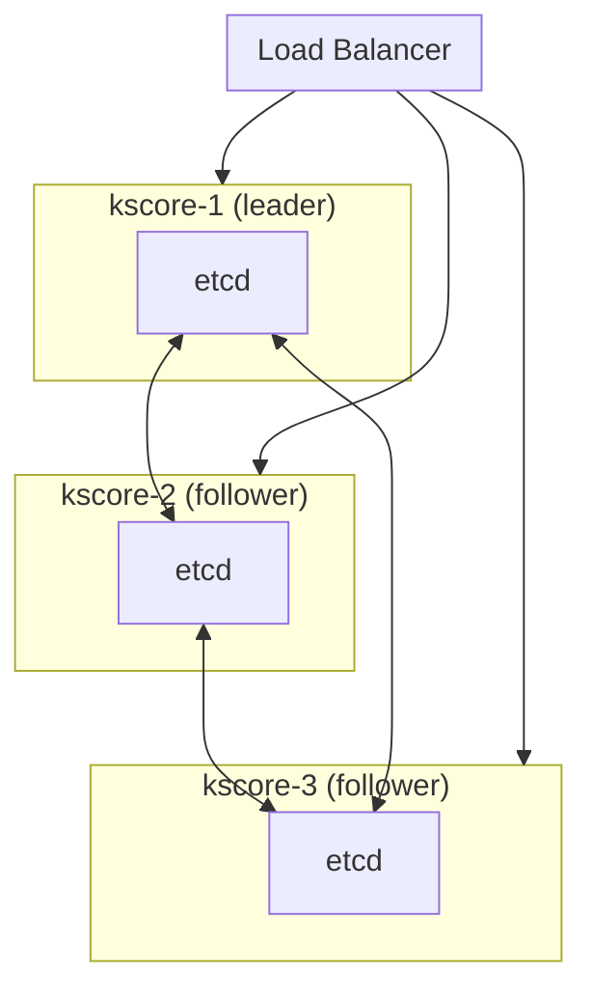

## Overview

This guide covers day-to-day operations for Keystone Core HA clusters, including cluster health monitoring, member management, failover procedures, and recovery operations.

**Prerequisites:**
- Keystone Core cluster deployed with etcd
- Understanding of [Clustering concepts](/docs/concepts/control-plane/#high-availability)
- Access to `kscore-cluster` CLI

## Cluster Architecture

A production Keystone Core cluster consists of:



**Quorum Requirements:**
- 3 nodes: Tolerates 1 failure
- 5 nodes: Tolerates 2 failures
- 7 nodes: Tolerates 3 failures

## Cluster Status

### Check Cluster Health

```bash
# Overall cluster status
kscorectl cluster status

# Output:
# Cluster Status: healthy
# Quorum: 3/3 members healthy
# Leader: kscore-1
#
# Members:
#   kscore-1 (leader)  - healthy - 192.168.1.10:2380
#   kscore-2           - healthy - 192.168.1.11:2380
#   kscore-3           - healthy - 192.168.1.12:2380
```

### List Cluster Members

```bash
# List all members
kscorectl cluster members

# Detailed member info
kscorectl cluster members --output yaml
```

### Check Current Leader

```bash
kscorectl cluster leader

# Output:
# Current Leader: kscore-1
# Leader Since: 2026-01-10T08:30:15Z
# Term: 42
```

### Health Check Details

```bash
# Detailed health check
kscorectl cluster health

# Output:
# Cluster Health Check
# ====================
# etcd: healthy
# NATS: healthy
# API: healthy
# State DB: healthy
#
# Member Health:
#   kscore-1: all checks passed
#   kscore-2: all checks passed
#   kscore-3: all checks passed
```

## Member Management

### Add a New Member

When scaling up the cluster:

```bash
# 1. Prepare the new node with kscore-server installed

# 2. Add member to cluster (run on existing member)
kscorectl cluster add-member \
  --name kscore-4 \
  --peer-urls https://192.168.1.13:2380

# 3. Start kscore-server on new node with join config
kscore-server --config /etc/kscore/server.yaml --join
```

### Remove a Member

```bash
# Remove unhealthy or decommissioned member
kscorectl cluster remove <member-id>

# Force remove (use with caution)
kscorectl cluster remove <member-id> --force
```

### Trigger Rebalance

After adding/removing members, rebalance agents:

```bash
# Redistribute agents across members
kscorectl cluster rebalance

# Output:
# Rebalancing agents across 4 members...
# Moved 125 agents from kscore-1 to kscore-4
# Moved 118 agents from kscore-2 to kscore-4
# Moved 122 agents from kscore-3 to kscore-4
# Rebalance complete: 500 agents distributed evenly
```

## Failover Procedures

### Automatic Failover

Keystone Core automatically handles leader failover:

1. **Detection**: Followers detect leader failure via heartbeat timeout
2. **Election**: New leader elected via Raft consensus
3. **Promotion**: New leader assumes control
4. **Notification**: Agents notified of new leader

Failover typically completes in 5-15 seconds.

### Manual Failover

For planned maintenance:

```bash
# Step down current leader (triggers election)
kscorectl cluster stepdown

# Verify new leader
kscorectl cluster leader
```

### Monitoring Failovers

```bash
# View leader history
kscorectl cluster leader --history

# Output:
# Leader History:
#   2026-01-10T08:30:15Z  kscore-1  (current)
#   2026-01-09T22:15:30Z  kscore-2  (stepped down)
#   2026-01-09T14:00:00Z  kscore-1  (failover from kscore-3)
```

## Recovery Procedures

### Single Member Failure

If one member fails:

1. **Assess**: Check if member can recover
   ```bash
   kscorectl cluster status
   ```

2. **If recoverable**: Restart the member
   ```bash
   systemctl restart kscore-server
   ```

3. **If unrecoverable**: Remove and replace
   ```bash
   kscorectl cluster remove <member-id>
   kscorectl cluster add-member --name new-member --peer-urls <urls>
   ```

### Quorum Loss Recovery

If quorum is lost (majority of members down):

**WARNING**: This procedure may result in data loss.

```bash
# 1. Stop all remaining members
systemctl stop kscore-server

# 2. On the member with most recent data, force new cluster
kscore-server --force-new-cluster

# 3. Verify single-node cluster is healthy
kscorectl cluster status

# 4. Add new members to restore HA
kscorectl cluster add-member --name kscore-2 --peer-urls ...
```

### Data Recovery from Backup

```bash
# 1. Stop all cluster members
# 2. Restore etcd data on each member
etcdctl snapshot restore /backup/etcd-snapshot.db \
  --name kscore-1 \
  --initial-cluster kscore-1=https://192.168.1.10:2380,...

# 3. Start cluster
systemctl start kscore-server
```

## Performance Tuning

### etcd Tuning

For large clusters (>1000 agents):

```yaml
# server.yaml
cluster:
  etcd:
    # Increase snapshot count for fewer snapshots
    snapshot_count: 10000

    # Increase election timeout for slower networks
    election_timeout: 5000

    # Increase heartbeat interval
    heartbeat_interval: 500

    # Quota for etcd storage (default: 2GB)
    quota_backend_bytes: 8589934592
```

### Work Distribution Tuning

```yaml
cluster:
  # How often to rebalance (default: 5m)
  rebalance_interval: 10m

  # Minimum imbalance to trigger rebalance (percentage)
  rebalance_threshold: 15

  # Maximum agents per member
  max_agents_per_member: 2000
```

## Monitoring

### Key Metrics

| Metric | Alert Threshold | Description |
|--------|-----------------|-------------|
| `kscore_cluster_members_healthy` | < expected | Healthy member count |
| `kscore_cluster_has_quorum` | == 0 | Quorum lost |
| `kscore_cluster_leader_changes_total` | Rate > 5/hour | Frequent elections |
| `kscore_cluster_etcd_operation_duration_seconds` | P95 > 100ms | Slow etcd ops |

### Grafana Dashboard

Import the Cluster Health dashboard from `deploy/grafana/dashboards/cluster-health.json`:

- Cluster overview: quorum, members, leader status
- Member health timeline
- Leader election frequency
- etcd operation latency

### Alert Rules

Critical alerts to configure:

```yaml
# Prometheus alert rules
- alert: KscoreClusterNoQuorum
  expr: kscore_cluster_has_quorum == 0
  for: 1m
  labels:
    severity: critical
  annotations:
    summary: "Keystone Core cluster lost quorum"

- alert: KscoreClusterMemberUnhealthy
  expr: kscore_cluster_member_status != 1
  for: 2m
  labels:
    severity: warning
  annotations:
    summary: "Cluster member {{ $labels.member }} is unhealthy"
```

## Maintenance Operations

### Rolling Restart

For upgrades or configuration changes:

```bash
# 1. Restart followers first, one at a time
for member in kscore-2 kscore-3; do
  ssh $member "systemctl restart kscore-server"
  sleep 30
  kscorectl cluster health
done

# 2. Failover from leader
kscorectl cluster stepdown

# 3. Restart old leader
ssh kscore-1 "systemctl restart kscore-server"

# 4. Verify cluster health
kscorectl cluster status
```

### etcd Compaction

Periodically compact etcd history:

```bash
# Get current revision
ETCDCTL_API=3 etcdctl endpoint status

# Compact history (keep last 1000 revisions)
ETCDCTL_API=3 etcdctl compact <revision-1000>

# Defragment to reclaim space
ETCDCTL_API=3 etcdctl defrag
```

### Backup Cluster State

```bash
# Backup etcd
etcdctl snapshot save /backup/etcd-$(date +%Y%m%d).db

# Backup Keystone Core config
tar -czf /backup/kscore-config-$(date +%Y%m%d).tar.gz /etc/kscore/
```

## Troubleshooting

### Member Won't Join

1. Check network connectivity:
   ```bash
   nc -zv <peer-ip> 2380
   ```

2. Verify TLS certificates match cluster CA

3. Check etcd logs:
   ```bash
   journalctl -u kscore-server -f | grep etcd
   ```

### Frequent Leader Elections

1. Check network latency between members
2. Increase election timeout
3. Check for resource contention (CPU, disk I/O)

### Split Brain Prevention

Keystone Core uses Raft consensus to prevent split-brain:

- Requires majority for writes
- Minority partition becomes read-only
- Automatic healing when partition resolves

## See Also

- [Clustering Concepts](/docs/concepts/control-plane/#high-availability)
- [Maintenance Guide]()
- [Monitoring Guide]()
- [Security Guide]()
