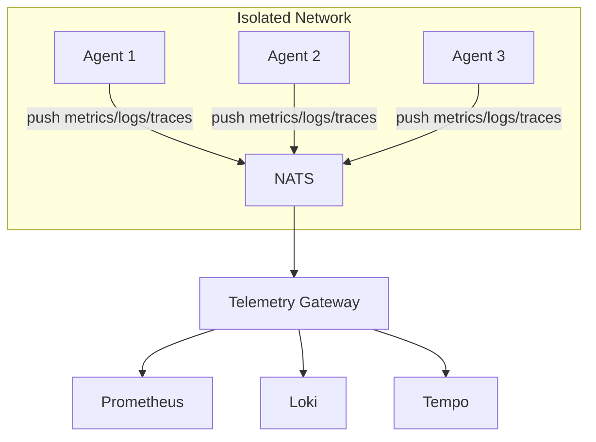

The Telemetry Gateway aggregates observability data from agents over NATS and exposes it to standard observability backends like Prometheus, Loki, and Tempo/Jaeger.

## Overview

The gateway solves a common challenge in distributed systems: agents running in isolated networks (behind NAT, firewalls, or air-gapped environments) cannot be directly scraped by Prometheus or push to centralized logging systems.



## Quick Start

### Using Docker Compose

```bash
cd deploy/gateway
docker-compose up -d
```

This starts:
- **NATS**: Message transport on port 4222
- **Telemetry Gateway**: Aggregation on port 8080
- **Prometheus**: Metrics storage on port 9090
- **Loki**: Log aggregation on port 3100
- **Tempo**: Trace storage on port 3200
- **Grafana**: Visualization on port 3000

Access Grafana at http://localhost:3000 (admin/admin).

### Standalone Binary

```bash
# Build the gateway
go build -o kscore-telemetry-gateway ./cmd/kscore-telemetry-gateway

# Run with config file
./kscore-telemetry-gateway --config config.yaml

# Or use environment variables
NATS_URL=nats://localhost:4222 ./kscore-telemetry-gateway
```

## Configuration

The gateway is configured via YAML:

```yaml
# NATS connection
nats:
  url: "nats://localhost:4222"
  ca_cert: "/path/to/ca.crt"  # Optional TLS

# HTTP server
server:
  listen: ":8080"
  read_timeout: 30s
  write_timeout: 30s

# Metrics gateway
metrics:
  enabled: true
  max_age: 60s
  max_series: 100000

# Logs gateway
logs:
  enabled: true
  max_entries: 100000
  max_age: 1h
  min_level: "debug"

# Traces gateway
traces:
  enabled: true
  max_traces: 10000
  sampling_rate: 1.0
  sample_errors: true
```

## Endpoints

### Metrics

| Endpoint | Description |
|----------|-------------|
| `GET /metrics` | Prometheus metrics endpoint |
| `GET /federate` | Prometheus federation endpoint |
| `GET /health` | Health check |
| `GET /ready` | Readiness check |

### Configuration Options

#### Metrics

```yaml
metrics:
  # Maximum staleness before metrics are dropped
  max_age: 60s

  # Maximum metric series to store
  max_series: 100000

  # Drop high-cardinality metrics
  drop_high_cardinality: false
  high_cardinality_threshold: 1000

  # Remote write to Prometheus
  remote_write:
    - url: "http://prometheus:9090/api/v1/write"
      batch_size: 1000
      flush_interval: 15s
```

#### Logs

```yaml
logs:
  # Minimum log level to accept
  min_level: "debug"  # debug, info, warn, error

  # Filter by source
  include_sources: ["app", "system"]
  exclude_sources: ["debug"]

  # Push to Loki
  loki:
    url: "http://loki:3100/loki/api/v1/push"
    tenant_id: "default"
```

#### Traces

```yaml
traces:
  # Sampling configuration
  sampling_rate: 0.1  # Keep 10% of traces
  sample_errors: true  # Always keep error traces
  slow_threshold: 1s  # Always keep slow traces

  # Export to OTLP endpoint
  otlp:
    url: "http://tempo:4318/v1/traces"
    use_gzip: true
```

## Agent Configuration

Agents publish telemetry to NATS subjects:

```yaml
# Agent telemetry configuration
telemetry:
  # Metrics collection
  metrics:
    enabled: true
    interval: 15s
    subject: "kscore.telemetry.metrics.{agent_id}"

  # Log forwarding
  logs:
    enabled: true
    level: "info"
    subject: "kscore.telemetry.logs.{agent_id}"

  # Trace reporting
  traces:
    enabled: true
    sampling_rate: 0.1
    subject: "kscore.telemetry.traces.{agent_id}"
```

## High Availability

For HA deployments, run multiple gateway instances:

```yaml
ha:
  enabled: true
  instance_id: "gateway-1"  # Unique per instance
  shard_count: 3  # Number of shards
  cleanup_interval: 1m
```

Each gateway will process a subset of agents based on consistent hashing.

## Monitoring

### Gateway Metrics

The gateway exports its own metrics at `/metrics`:

| Metric | Description |
|--------|-------------|
| `kscore_gateway_agents_total` | Number of connected agents |
| `kscore_gateway_metrics_series_total` | Total metric series |
| `kscore_gateway_metrics_received_total` | Metrics messages received |
| `kscore_gateway_logs_entries_total` | Log entries stored |
| `kscore_gateway_logs_dropped_total` | Log entries dropped |
| `kscore_gateway_traces_total` | Traces stored |
| `kscore_gateway_spans_received_total` | Spans received |

### Grafana Dashboard

A pre-built Grafana dashboard is included at `deploy/gateway/grafana/provisioning/dashboards/gateway-dashboard.json`.

## Troubleshooting

### No metrics appearing

1. Check NATS connectivity:
   ```bash
   nats sub "kscore.telemetry.metrics.>"
   ```

2. Verify agent is publishing:
   ```bash
   curl http://agent:8080/metrics
   ```

3. Check gateway logs for errors

### High cardinality warnings

If you see cardinality warnings, consider:

1. Enable cardinality control:
   ```yaml
   metrics:
     drop_high_cardinality: true
     high_cardinality_threshold: 1000
   ```

2. Review agent metric labels for high-cardinality values (request IDs, timestamps)

### Logs not forwarding to Loki

1. Check Loki is accessible from gateway
2. Verify tenant ID if using multi-tenant Loki
3. Check for authentication errors in gateway logs
