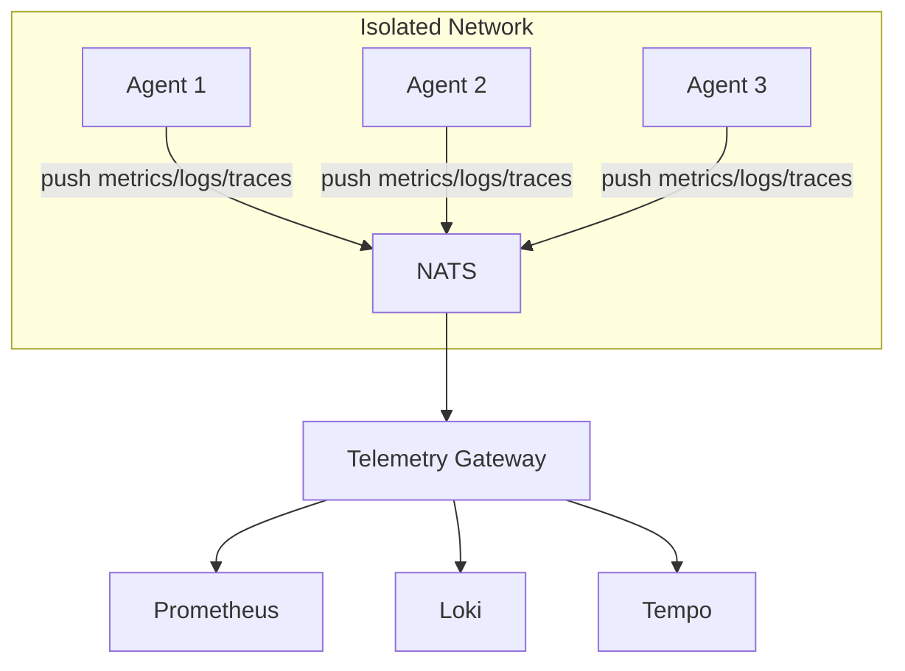

The Telemetry Gateway aggregates observability data from agents over NATS and exposes it to standard observability backends like Prometheus, Loki, and Tempo/Jaeger.

## Overview

The gateway solves a common challenge in distributed systems: agents running in isolated networks (behind NAT, firewalls, or air-gapped environments) cannot be directly scraped by Prometheus or push to centralized logging systems.



## Quick Start

### Using Docker Compose

```bash
cd deploy/gateway
docker-compose up -d
```

This starts:
- **NATS**: Message transport on port 4222
- **Telemetry Gateway**: Aggregation on port 8080
- **Prometheus**: Metrics storage on port 9090
- **Loki**: Log aggregation on port 3100
- **Tempo**: Trace storage on port 3200
- **Grafana**: Visualization on port 3000

Access Grafana at http://localhost:3000 (admin/admin).

### Standalone Binary

```bash
# Build the gateway
go build -o kscore-telemetry-gateway ./cmd/kscore-telemetry-gateway

# Run with config file
./kscore-telemetry-gateway --config config.yaml

# Or use environment variables
NATS_URL=nats://localhost:4222 ./kscore-telemetry-gateway
```

## Configuration

The gateway is configured via YAML:

```yaml
# NATS connection
nats:
  url: "nats://localhost:4222"
  ca_cert: "/path/to/ca.crt"  # Optional TLS

# HTTP server
server:
  listen: ":8080"
  read_timeout: 30s
  write_timeout: 30s

# Metrics gateway
metrics:
  enabled: true
  max_age: 60s
  max_series: 100000

# Logs gateway
logs:
  enabled: true
  max_entries: 100000
  max_age: 1h
  min_level: "debug"

# Traces gateway
traces:
  enabled: true
  max_traces: 10000
  sampling_rate: 1.0
  sample_errors: true
```

## Endpoints

### Metrics

| Endpoint | Description |
|----------|-------------|
| `GET /metrics` | Prometheus metrics endpoint |
| `GET /federate` | Prometheus federation endpoint |
| `GET /health` | Health check |
| `GET /ready` | Readiness check |

### Configuration Options

#### Metrics

```yaml
metrics:
  # Maximum staleness before metrics are dropped
  max_age: 60s

  # Maximum metric series to store
  max_series: 100000

  # Drop high-cardinality metrics
  drop_high_cardinality: false
  high_cardinality_threshold: 1000

  # Remote write to Prometheus
  remote_write:
    - url: "http://prometheus:9090/api/v1/write"
      batch_size: 1000
      flush_interval: 15s
```

#### Logs

```yaml
logs:
  # Minimum log level to accept
  min_level: "debug"  # debug, info, warn, error

  # Filter by source
  include_sources: ["app", "system"]
  exclude_sources: ["debug"]

  # Push to Loki
  loki:
    url: "http://loki:3100/loki/api/v1/push"
    tenant_id: "default"
```

#### Traces

```yaml
traces:
  # Sampling configuration
  sampling_rate: 0.1  # Keep 10% of traces
  sample_errors: true  # Always keep error traces
  slow_threshold: 1s  # Always keep slow traces

  # Export to OTLP endpoint
  otlp:
    url: "http://tempo:4318/v1/traces"
    use_gzip: true
```

## Retention Policy Sizing

Proper retention sizing ensures the gateway can handle your deployment's telemetry volume without excessive resource consumption or data loss.

### Storage Model

The gateway uses a hybrid storage model:

| Data Type | Primary Storage | Buffer | Long-Term Storage |
|-----------|-----------------|--------|-------------------|
| Metrics | In-memory | NATS JetStream | Prometheus/Thanos |
| Logs | In-memory + disk | NATS JetStream | Loki/S3 |
| Traces | In-memory | NATS JetStream | Tempo/Jaeger |

### Metrics Retention Sizing

#### Memory Requirements

```
Memory (MB) = (metric_series × 2KB) + (agents × 50KB overhead)
```

| Deployment Size | Agents | Typical Series | Memory Required |
|-----------------|--------|----------------|-----------------|
| Small | ≤100 | 50,000 | 256MB |
| Medium | 100-1,000 | 200,000 | 512MB |
| Large | 1,000-10,000 | 1,000,000 | 2GB |
| Enterprise | 10,000+ | 5,000,000+ | 10GB+ |

#### Cardinality Planning

Estimate your cardinality:

```
Total Series = Agents × Metrics_Per_Agent × Label_Combinations
```

Example for 1,000 agents:
- System metrics: 50 metrics × 1 (no additional labels) = 50,000 series
- Application metrics: 100 metrics × 5 (service labels) = 500,000 series
- Total: ~550,000 series

#### Recommended Configuration

```yaml
metrics:
  # Small deployment (≤100 agents)
  max_series: 100000
  max_age: 120s        # 2 scrape intervals for safety

  # Medium deployment (100-1,000 agents)
  max_series: 500000
  max_age: 90s

  # Large deployment (1,000-10,000 agents)
  max_series: 2000000
  max_age: 60s
  drop_high_cardinality: true
  high_cardinality_threshold: 5000

  # Enterprise (10,000+ agents)
  max_series: 10000000
  max_age: 45s
  drop_high_cardinality: true
  high_cardinality_threshold: 2000
  # Consider sharding across multiple gateways
```

### Logs Retention Sizing

#### Storage Calculation

```
Storage (MB/hour) = Agents × Log_Rate × Avg_Log_Size × 3600
```

| Log Rate | 100 Agents | 1,000 Agents | 10,000 Agents |
|----------|------------|--------------|---------------|
| 1 log/sec/agent | 36 MB/hr | 360 MB/hr | 3.6 GB/hr |
| 10 logs/sec/agent | 360 MB/hr | 3.6 GB/hr | 36 GB/hr |
| 100 logs/sec/agent | 3.6 GB/hr | 36 GB/hr | 360 GB/hr |

*Assumes average log entry size of 100 bytes*

#### Memory vs Disk Configuration

```yaml
logs:
  # In-memory only (fastest, limited capacity)
  storage: memory
  max_entries: 1000000       # ~100MB
  max_age: 1h

  # Hybrid (memory buffer + disk overflow)
  storage: hybrid
  memory_entries: 100000     # ~10MB hot buffer
  disk_path: /var/lib/kscore/logs
  disk_max_size: 10GB
  max_age: 24h

  # Disk-primary (higher capacity, slightly higher latency)
  storage: disk
  disk_path: /var/lib/kscore/logs
  disk_max_size: 100GB
  max_age: 168h              # 7 days
  compression: zstd
```

#### Recommended Settings by Scale

```yaml
# Small deployment (≤100 agents)
logs:
  storage: memory
  max_entries: 500000
  max_age: 2h
  min_level: info

# Medium deployment (100-1,000 agents)
logs:
  storage: hybrid
  memory_entries: 200000
  disk_path: /var/lib/kscore/logs
  disk_max_size: 20GB
  max_age: 6h
  min_level: info
  compression: zstd

# Large deployment (1,000-10,000 agents)
logs:
  storage: disk
  disk_path: /var/lib/kscore/logs
  disk_max_size: 100GB
  max_age: 4h
  min_level: warn            # Filter to reduce volume
  compression: zstd
  loki:
    url: "http://loki:3100/loki/api/v1/push"
    batch_size: 10000
    flush_interval: 5s

# Enterprise (10,000+ agents)
logs:
  storage: disk
  disk_path: /var/lib/kscore/logs
  disk_max_size: 500GB
  max_age: 2h
  min_level: warn
  compression: zstd
  sampling:
    enabled: true
    rate: 0.1                # Sample 10% of debug/info
    always_include: ["error", "fatal"]
```

### Traces Retention Sizing

#### Storage Requirements

```
Memory (MB) = Active_Traces × Avg_Spans_Per_Trace × 500B
```

| Deployment | Trace Rate | Active Traces | Memory |
|------------|------------|---------------|--------|
| Small | 100/min | 1,000 | 50MB |
| Medium | 1,000/min | 10,000 | 500MB |
| Large | 10,000/min | 50,000 | 2.5GB |
| Enterprise | 100,000/min | 200,000 | 10GB |

#### Sampling Strategies

```yaml
traces:
  # Development (keep everything)
  sampling_rate: 1.0
  max_traces: 100000

  # Small production
  sampling_rate: 0.5
  sample_errors: true
  slow_threshold: 500ms
  max_traces: 50000

  # Medium production
  sampling_rate: 0.1
  sample_errors: true
  slow_threshold: 1s
  max_traces: 100000

  # Large production (aggressive sampling)
  sampling_rate: 0.01
  sample_errors: true
  slow_threshold: 2s
  max_traces: 200000

  # Adaptive sampling (recommended for variable workloads)
  adaptive_sampling:
    enabled: true
    min_rate: 0.001
    max_rate: 0.5
    target_traces_per_minute: 10000
```

### NATS JetStream Buffer Sizing

The gateway uses JetStream for durability. Size your streams appropriately:

```yaml
# Stream configuration for telemetry
streams:
  metrics:
    max_bytes: 1GB
    max_age: 5m
    replicas: 3

  logs:
    max_bytes: 10GB
    max_age: 30m
    replicas: 3
    storage: file           # Use file storage for logs

  traces:
    max_bytes: 2GB
    max_age: 10m
    replicas: 3
```

#### JetStream Sizing Table

| Data Type | Agents | Recommended Buffer | Max Age |
|-----------|--------|-------------------|---------|
| Metrics | ≤1,000 | 500MB | 5m |
| Metrics | 1,000-10,000 | 2GB | 3m |
| Metrics | 10,000+ | 5GB | 2m |
| Logs | ≤1,000 | 2GB | 30m |
| Logs | 1,000-10,000 | 10GB | 15m |
| Logs | 10,000+ | 50GB | 10m |
| Traces | ≤1,000 | 500MB | 10m |
| Traces | 1,000-10,000 | 2GB | 5m |
| Traces | 10,000+ | 10GB | 3m |

### Long-Term Storage Integration

#### Prometheus Remote Write

```yaml
metrics:
  remote_write:
    - url: "http://thanos-receive:19291/api/v1/receive"
      queue_config:
        capacity: 10000
        max_shards: 50
        max_samples_per_send: 5000
      metadata_config:
        send: true
        send_interval: 1m
```

#### Loki Integration

```yaml
logs:
  loki:
    url: "http://loki:3100/loki/api/v1/push"
    tenant_id: "kscore"
    batch_wait: 1s
    batch_size: 102400
    timeout: 10s
    retries: 3
    # Use external labels for multi-cluster
    external_labels:
      cluster: "production"
      region: "us-east-1"
```

#### Tempo/Jaeger Integration

```yaml
traces:
  otlp:
    url: "http://tempo:4318/v1/traces"
    headers:
      X-Scope-OrgID: "kscore"
    compression: gzip
    timeout: 30s
    retry:
      enabled: true
      max_retries: 5
      initial_interval: 500ms
```

### Capacity Planning Calculator

Use this formula for total gateway resource requirements:

```
Total Memory =
  (Metric_Series × 2KB) +
  (Log_Buffer_Entries × 200B) +
  (Active_Traces × Spans × 500B) +
  (Agents × 100KB overhead) +
  512MB base

Total Disk =
  (Log_Retention_Hours × Log_Rate_MB_Hour) +
  (JetStream_Buffer_Total) +
  10GB operating overhead
```

#### Example Calculation (1,000 agents)

```
Metrics: 500,000 series × 2KB = 1GB
Logs: 200,000 entries × 200B = 40MB
Traces: 50,000 traces × 10 spans × 500B = 250MB
Agent overhead: 1,000 × 100KB = 100MB
Base: 512MB

Total Memory: ~2GB

Logs on disk: 6h × 360MB/hr = 2.2GB
JetStream: 2GB + 10GB + 2GB = 14GB
Operating: 10GB

Total Disk: ~26GB
```

### Monitoring Retention Health

Add these alerts to monitor retention:

```yaml
groups:
  - name: gateway-retention
    rules:
      - alert: GatewayMetricsNearCapacity
        expr: kscore_gateway_metrics_series_total / kscore_gateway_metrics_max_series > 0.8
        for: 5m
        labels:
          severity: warning
        annotations:
          summary: Gateway metrics near capacity limit

      - alert: GatewayLogsDropping
        expr: rate(kscore_gateway_logs_dropped_total[5m]) > 100
        for: 2m
        labels:
          severity: warning
        annotations:
          summary: Gateway dropping logs due to capacity

      - alert: GatewayDiskSpaceLow
        expr: kscore_gateway_disk_available_bytes / kscore_gateway_disk_total_bytes < 0.2
        for: 10m
        labels:
          severity: warning
        annotations:
          summary: Gateway disk space below 20%

      - alert: GatewayJetStreamLag
        expr: kscore_gateway_jetstream_pending_messages > 100000
        for: 5m
        labels:
          severity: warning
        annotations:
          summary: JetStream consumer falling behind
```

## Agent Configuration

Agents publish telemetry to NATS subjects:

```yaml
# Agent telemetry configuration
telemetry:
  # Metrics collection
  metrics:
    enabled: true
    interval: 15s
    subject: "kscore.telemetry.metrics.{agent_id}"

  # Log forwarding
  logs:
    enabled: true
    level: "info"
    subject: "kscore.telemetry.logs.{agent_id}"

  # Trace reporting
  traces:
    enabled: true
    sampling_rate: 0.1
    subject: "kscore.telemetry.traces.{agent_id}"
```

## High Availability

For HA deployments, run multiple gateway instances:

```yaml
ha:
  enabled: true
  instance_id: "gateway-1"  # Unique per instance
  shard_count: 3  # Number of shards
  cleanup_interval: 1m
```

Each gateway will process a subset of agents based on consistent hashing.

## Monitoring

### Gateway Metrics

The gateway exports its own metrics at `/metrics`:

| Metric | Description |
|--------|-------------|
| `kscore_gateway_agents_total` | Number of connected agents |
| `kscore_gateway_metrics_series_total` | Total metric series |
| `kscore_gateway_metrics_received_total` | Metrics messages received |
| `kscore_gateway_logs_entries_total` | Log entries stored |
| `kscore_gateway_logs_dropped_total` | Log entries dropped |
| `kscore_gateway_traces_total` | Traces stored |
| `kscore_gateway_spans_received_total` | Spans received |

### Grafana Dashboard

A pre-built Grafana dashboard is included at `deploy/gateway/grafana/provisioning/dashboards/gateway-dashboard.json`.

## Troubleshooting

### No metrics appearing

1. Check NATS connectivity:
   ```bash
   nats sub "kscore.telemetry.metrics.>"
   ```

2. Verify agent is publishing:
   ```bash
   curl http://agent:8080/metrics
   ```

3. Check gateway logs for errors

### High cardinality warnings

If you see cardinality warnings, consider:

1. Enable cardinality control:
   ```yaml
   metrics:
     drop_high_cardinality: true
     high_cardinality_threshold: 1000
   ```

2. Review agent metric labels for high-cardinality values (request IDs, timestamps)

### Logs not forwarding to Loki

1. Check Loki is accessible from gateway
2. Verify tenant ID if using multi-tenant Loki
3. Check for authentication errors in gateway logs
