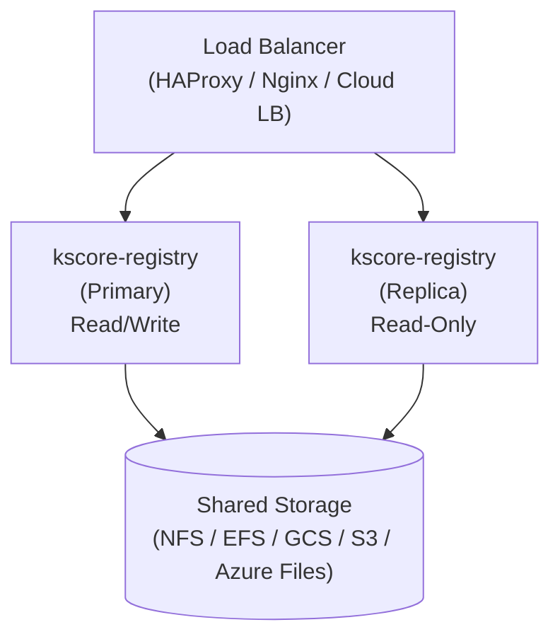
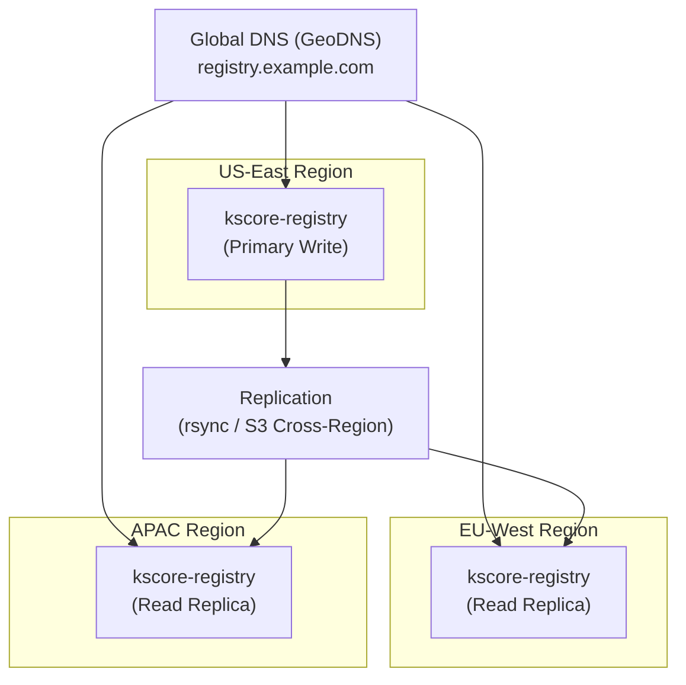

## Overview

The Keystone Core Module Registry (`kscore-registry`) provides module distribution for your organization. This guide covers production deployment patterns from single-node to highly available multi-region setups.

## Architecture



## Deployment Options

### Single-Node Deployment

Suitable for development, testing, and small organizations (<100 users).

**Docker**:

```bash
docker run -d \
  --name kscore-registry \
  -p 8090:8090 \
  -v /var/lib/keystone-core/modules:/data \
  -e KSCORE_REGISTRY_API_KEY="${REGISTRY_API_KEY}" \
  keystonecore/kscore-registry:latest
```

**Binary**:

```bash
kscore-registry \
  --data /var/lib/keystone-core/modules \
  --listen :8090 \
  --api-key "${REGISTRY_API_KEY}"
```

**systemd Service**:

```ini
# /etc/systemd/system/kscore-registry.service
[Unit]
Description=Keystone Core Module Registry
After=network.target

[Service]
Type=simple
User=kscore
Group=kscore
ExecStart=/usr/local/bin/kscore-registry \
  --data /var/lib/keystone-core/modules \
  --listen :8090
Environment=KSCORE_REGISTRY_API_KEY=your-secret-key
Restart=always
RestartSec=5

[Install]
WantedBy=multi-user.target
```

### High Availability Deployment

For production environments requiring redundancy and zero-downtime updates.

#### Architecture Components

1. **Load Balancer**: Distributes traffic across registry instances
2. **Primary Registry**: Handles read and write operations
3. **Replica Registries**: Read-only mirrors for high availability
4. **Shared Storage**: Network filesystem accessible by all instances

#### Docker Compose (Development HA)

```yaml
# docker-compose.yml
version: '3.8'

services:
  lb:
    image: haproxy:2.8
    ports:
      - "8090:8090"
    volumes:
      - ./haproxy.cfg:/usr/local/etc/haproxy/haproxy.cfg:ro
    depends_on:
      - registry-primary
      - registry-replica-1
      - registry-replica-2

  registry-primary:
    image: keystonecore/kscore-registry:latest
    environment:
      - KSCORE_REGISTRY_API_KEY=${REGISTRY_API_KEY}
    volumes:
      - registry-data:/data
    healthcheck:
      test: ["CMD", "curl", "-f", "http://localhost:8090/health"]
      interval: 10s
      timeout: 5s
      retries: 3

  registry-replica-1:
    image: keystonecore/kscore-registry:latest
    command: ["--readonly"]
    volumes:
      - registry-data:/data:ro
    healthcheck:
      test: ["CMD", "curl", "-f", "http://localhost:8090/health"]
      interval: 10s
      timeout: 5s
      retries: 3

  registry-replica-2:
    image: keystonecore/kscore-registry:latest
    command: ["--readonly"]
    volumes:
      - registry-data:/data:ro
    healthcheck:
      test: ["CMD", "curl", "-f", "http://localhost:8090/health"]
      interval: 10s
      timeout: 5s
      retries: 3

volumes:
  registry-data:
```

**HAProxy Configuration**:

```
# haproxy.cfg
global
    daemon
    maxconn 4096

defaults
    mode http
    timeout connect 5s
    timeout client 30s
    timeout server 30s
    option httpchk GET /health

frontend registry_frontend
    bind *:8090
    default_backend registry_backend

backend registry_backend
    balance roundrobin
    option httpchk GET /health

    # Primary handles writes, all handle reads
    acl is_write method POST DELETE

    # Write requests go only to primary
    use-server primary if is_write

    # Read requests distributed across all
    server primary registry-primary:8090 check
    server replica1 registry-replica-1:8090 check backup
    server replica2 registry-replica-2:8090 check backup
```

### Kubernetes Deployment

For cloud-native production environments.

#### StatefulSet (Primary)

```yaml
# registry-primary.yaml
apiVersion: apps/v1
kind: StatefulSet
metadata:
  name: kscore-registry-primary
  namespace: kscore-system
spec:
  serviceName: kscore-registry-primary
  replicas: 1
  selector:
    matchLabels:
      app: kscore-registry
      role: primary
  template:
    metadata:
      labels:
        app: kscore-registry
        role: primary
    spec:
      containers:
      - name: registry
        image: keystonecore/kscore-registry:latest
        ports:
        - containerPort: 8090
          name: http
        env:
        - name: KSCORE_REGISTRY_API_KEY
          valueFrom:
            secretKeyRef:
              name: kscore-registry-secrets
              key: api-key
        args:
        - --data=/data
        - --listen=:8090
        volumeMounts:
        - name: data
          mountPath: /data
        livenessProbe:
          httpGet:
            path: /health
            port: http
          initialDelaySeconds: 5
          periodSeconds: 10
        readinessProbe:
          httpGet:
            path: /health
            port: http
          initialDelaySeconds: 5
          periodSeconds: 5
        resources:
          requests:
            cpu: 100m
            memory: 128Mi
          limits:
            cpu: 500m
            memory: 512Mi
  volumeClaimTemplates:
  - metadata:
      name: data
    spec:
      accessModes: ["ReadWriteOnce"]
      storageClassName: fast-ssd
      resources:
        requests:
          storage: 50Gi
```

#### Deployment (Read Replicas)

```yaml
# registry-replicas.yaml
apiVersion: apps/v1
kind: Deployment
metadata:
  name: kscore-registry-replicas
  namespace: kscore-system
spec:
  replicas: 3
  selector:
    matchLabels:
      app: kscore-registry
      role: replica
  template:
    metadata:
      labels:
        app: kscore-registry
        role: replica
    spec:
      containers:
      - name: registry
        image: keystonecore/kscore-registry:latest
        ports:
        - containerPort: 8090
          name: http
        args:
        - --data=/data
        - --listen=:8090
        - --readonly
        volumeMounts:
        - name: data
          mountPath: /data
          readOnly: true
        livenessProbe:
          httpGet:
            path: /health
            port: http
          initialDelaySeconds: 5
          periodSeconds: 10
        readinessProbe:
          httpGet:
            path: /health
            port: http
          initialDelaySeconds: 5
          periodSeconds: 5
        resources:
          requests:
            cpu: 50m
            memory: 64Mi
          limits:
            cpu: 200m
            memory: 256Mi
      volumes:
      - name: data
        persistentVolumeClaim:
          claimName: kscore-registry-data
          readOnly: true
```

#### Services

```yaml
# registry-services.yaml
apiVersion: v1
kind: Service
metadata:
  name: kscore-registry
  namespace: kscore-system
spec:
  type: ClusterIP
  ports:
  - port: 8090
    targetPort: http
    name: http
  selector:
    app: kscore-registry
---
apiVersion: v1
kind: Service
metadata:
  name: kscore-registry-primary
  namespace: kscore-system
spec:
  type: ClusterIP
  ports:
  - port: 8090
    targetPort: http
    name: http
  selector:
    app: kscore-registry
    role: primary
```

#### Ingress

```yaml
# registry-ingress.yaml
apiVersion: networking.k8s.io/v1
kind: Ingress
metadata:
  name: kscore-registry
  namespace: kscore-system
  annotations:
    nginx.ingress.kubernetes.io/proxy-body-size: "100m"
    cert-manager.io/cluster-issuer: letsencrypt-prod
spec:
  ingressClassName: nginx
  tls:
  - hosts:
    - registry.example.com
    secretName: kscore-registry-tls
  rules:
  - host: registry.example.com
    http:
      paths:
      - path: /
        pathType: Prefix
        backend:
          service:
            name: kscore-registry
            port:
              number: 8090
```

### Multi-Region Deployment

For global organizations requiring low-latency access across regions.



#### Replication Script

```bash
#!/bin/bash
# sync-registry.sh - Run on primary, syncs to replicas

REGIONS=(
  "us-east-1:s3://kscore-registry-us-east-1"
  "eu-west-1:s3://kscore-registry-eu-west-1"
  "ap-southeast-1:s3://kscore-registry-ap-southeast-1"
)

SOURCE_DIR="/var/lib/keystone-core/modules"

for region_bucket in "${REGIONS[@]}"; do
  region="${region_bucket%%:*}"
  bucket="${region_bucket#*:}"

  echo "Syncing to ${region}..."
  aws s3 sync "${SOURCE_DIR}" "${bucket}" \
    --region "${region}" \
    --delete \
    --exclude ".tmp/*"
done
```

#### AWS S3 Cross-Region Replication

```hcl
# terraform/s3-replication.tf
resource "aws_s3_bucket" "registry_primary" {
  bucket = "kscore-registry-us-east-1"

  versioning {
    enabled = true
  }
}

resource "aws_s3_bucket_replication_configuration" "registry" {
  bucket = aws_s3_bucket.registry_primary.id
  role   = aws_iam_role.replication.arn

  rule {
    id     = "replicate-to-eu"
    status = "Enabled"

    destination {
      bucket        = aws_s3_bucket.registry_eu.arn
      storage_class = "STANDARD"
    }
  }

  rule {
    id     = "replicate-to-apac"
    status = "Enabled"

    destination {
      bucket        = aws_s3_bucket.registry_apac.arn
      storage_class = "STANDARD"
    }
  }
}
```

## Shared Storage Options

### NFS

Suitable for on-premises deployments:

```yaml
# Kubernetes PersistentVolume
apiVersion: v1
kind: PersistentVolume
metadata:
  name: kscore-registry-nfs
spec:
  capacity:
    storage: 100Gi
  accessModes:
    - ReadWriteMany
  nfs:
    server: nfs-server.example.com
    path: /exports/kscore-registry
```

### AWS EFS

```yaml
apiVersion: v1
kind: PersistentVolume
metadata:
  name: kscore-registry-efs
spec:
  capacity:
    storage: 100Gi
  accessModes:
    - ReadWriteMany
  csi:
    driver: efs.csi.aws.com
    volumeHandle: fs-12345678
```

### Google Cloud Filestore

```yaml
apiVersion: v1
kind: PersistentVolume
metadata:
  name: kscore-registry-filestore
spec:
  capacity:
    storage: 100Gi
  accessModes:
    - ReadWriteMany
  nfs:
    server: 10.0.0.2
    path: /kscore_registry
```

### Azure Files

```yaml
apiVersion: v1
kind: PersistentVolume
metadata:
  name: kscore-registry-azure
spec:
  capacity:
    storage: 100Gi
  accessModes:
    - ReadWriteMany
  azureFile:
    secretName: azure-storage-secret
    shareName: kscore-registry
    readOnly: false
```

## Security

### TLS Termination

Always use TLS in production. Configure at the load balancer or ingress:

**Nginx**:

```nginx
server {
    listen 443 ssl http2;
    server_name registry.example.com;

    ssl_certificate /etc/ssl/registry.crt;
    ssl_certificate_key /etc/ssl/registry.key;
    ssl_protocols TLSv1.2 TLSv1.3;
    ssl_ciphers ECDHE-ECDSA-AES128-GCM-SHA256:ECDHE-RSA-AES128-GCM-SHA256;

    location / {
        proxy_pass http://registry-backend;
        proxy_set_header Host $host;
        proxy_set_header X-Real-IP $remote_addr;
        proxy_set_header X-Forwarded-Proto $scheme;
    }
}
```

### API Key Rotation

Rotate API keys regularly without downtime:

1. Generate new API key
2. Update registry with both old and new keys (comma-separated)
3. Update all clients to use new key
4. Remove old key from registry

```bash
# Support multiple API keys (future enhancement)
export KSCORE_REGISTRY_API_KEY="new-key,old-key"
```

### Network Policies (Kubernetes)

```yaml
apiVersion: networking.k8s.io/v1
kind: NetworkPolicy
metadata:
  name: kscore-registry
  namespace: kscore-system
spec:
  podSelector:
    matchLabels:
      app: kscore-registry
  policyTypes:
  - Ingress
  - Egress
  ingress:
  - from:
    - namespaceSelector:
        matchLabels:
          name: kscore-system
    - namespaceSelector:
        matchLabels:
          kscore-registry-access: "true"
    ports:
    - protocol: TCP
      port: 8090
  egress:
  - to:
    - ipBlock:
        cidr: 10.0.0.0/8  # Internal network only
```

## Monitoring

### Prometheus Metrics

Add to your Prometheus scrape configuration:

```yaml
scrape_configs:
  - job_name: 'kscore-registry'
    static_configs:
      - targets: ['registry.example.com:8090']
    metrics_path: /metrics
```

### Health Check Alerts

```yaml
# alertmanager rules
groups:
- name: kscore-registry
  rules:
  - alert: RegistryDown
    expr: up{job="kscore-registry"} == 0
    for: 1m
    labels:
      severity: critical
    annotations:
      summary: "Module registry is down"
      description: "{{ $labels.instance }} has been unreachable for 1 minute."

  - alert: RegistryHighLatency
    expr: histogram_quantile(0.95, rate(http_request_duration_seconds_bucket{job="kscore-registry"}[5m])) > 1
    for: 5m
    labels:
      severity: warning
    annotations:
      summary: "Module registry high latency"
      description: "95th percentile latency is above 1 second."

  - alert: RegistryDiskSpaceLow
    expr: node_filesystem_avail_bytes{mountpoint="/data"} / node_filesystem_size_bytes{mountpoint="/data"} < 0.1
    for: 10m
    labels:
      severity: warning
    annotations:
      summary: "Registry disk space low"
      description: "Less than 10% disk space remaining."
```

### Grafana Dashboard

Key metrics to monitor:

| Metric | Description |
|--------|-------------|
| `http_requests_total` | Total requests by method and status |
| `http_request_duration_seconds` | Request latency histogram |
| `registry_modules_total` | Total modules stored |
| `registry_storage_bytes` | Storage usage |
| `registry_downloads_total` | Module downloads |
| `registry_uploads_total` | Module uploads |

## Backup and Recovery

### Backup Strategy

```bash
#!/bin/bash
# backup-registry.sh

BACKUP_DIR="/backups/kscore-registry"
DATA_DIR="/var/lib/keystone-core/modules"
DATE=$(date +%Y%m%d-%H%M%S)

# Create backup
tar -czf "${BACKUP_DIR}/registry-${DATE}.tar.gz" -C "${DATA_DIR}" .

# Upload to S3
aws s3 cp "${BACKUP_DIR}/registry-${DATE}.tar.gz" \
  s3://kscore-backups/registry/

# Retain last 30 days
find "${BACKUP_DIR}" -name "registry-*.tar.gz" -mtime +30 -delete
```

### Recovery

```bash
#!/bin/bash
# restore-registry.sh

BACKUP_FILE="$1"
DATA_DIR="/var/lib/keystone-core/modules"

# Stop registry
systemctl stop kscore-registry

# Restore
tar -xzf "${BACKUP_FILE}" -C "${DATA_DIR}"

# Fix permissions
chown -R kscore:kscore "${DATA_DIR}"

# Start registry
systemctl start kscore-registry
```

## Scaling Guidelines

| Users | Modules | Recommended Setup |
|-------|---------|-------------------|
| < 50 | < 100 | Single node |
| 50-200 | 100-500 | 1 primary + 2 replicas |
| 200-1000 | 500-2000 | 1 primary + 3-5 replicas with LB |
| > 1000 | > 2000 | Multi-region with CDN |

### Resource Sizing

| Component | CPU | Memory | Storage |
|-----------|-----|--------|---------|
| Primary | 500m-1 core | 512MB-1GB | 50-500GB SSD |
| Replica | 200m-500m | 256MB-512MB | Shared storage |
| Load Balancer | 100m | 128MB | - |

## Troubleshooting

### Common Issues

**Registry won't start**:

```bash
# Check data directory permissions
ls -la /var/lib/keystone-core/modules

# Fix permissions
chown -R kscore:kscore /var/lib/keystone-core/modules
chmod 755 /var/lib/keystone-core/modules
```

**Publish fails with 403**:

- Verify API key is set correctly
- Check if registry is in read-only mode

**Module download slow**:

- Check network between client and registry
- Consider deploying regional replicas
- Enable CDN caching for static assets

**Disk space issues**:

```bash
# Find large modules
du -sh /var/lib/keystone-core/modules/*/*/* | sort -rh | head -20

# Clean old versions (keep last 3)
find /var/lib/keystone-core/modules -type d -name "[0-9]*" | \
  while read dir; do
    parent=$(dirname "$dir")
    ls -1v "$parent" | head -n -3 | \
      xargs -I {} rm -rf "$parent/{}"
  done
```

## See Also

- [CLI Reference: kscore-registry](/docs/reference/cli/#kscore-registry-module-registry-server)
- [CLI Reference: kscore-module](/docs/reference/cli/#kscore-module-module-management)
- [Deployment Guide](/docs/operations/deployment/)
- [Security Guide](/docs/operations/security/)
