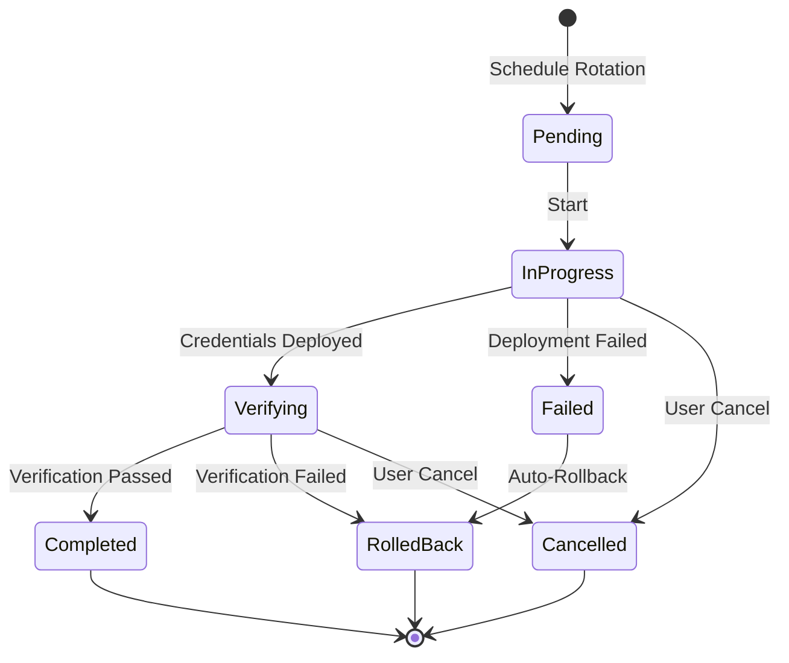
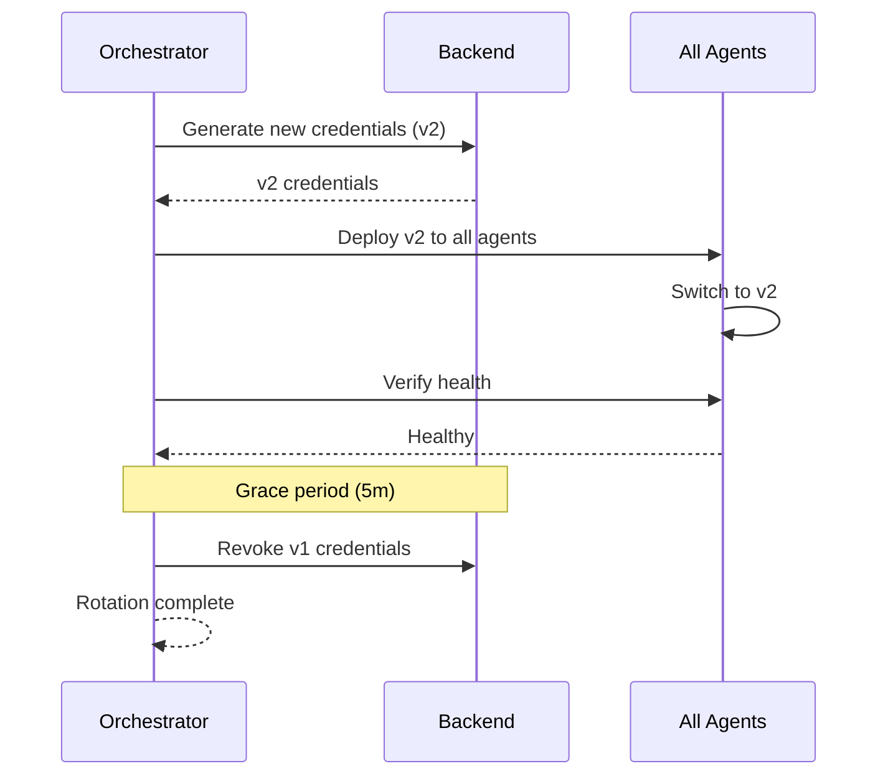
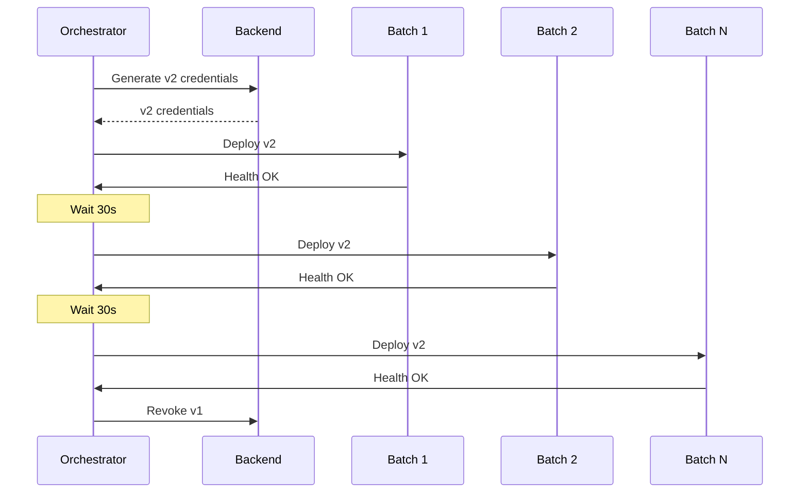
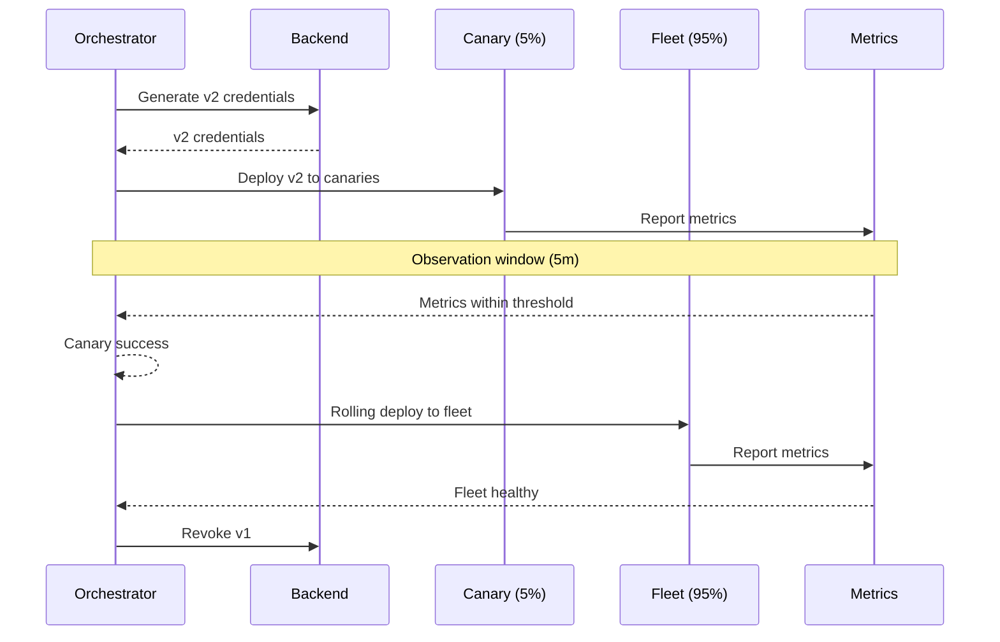

## Overview

Secret rotation is essential for maintaining security. Keystone Core provides automated rotation orchestration that coordinates credential updates across your infrastructure without downtime.

## Rotation Lifecycle



## Rotation Strategies

### Blue-Green Strategy

Generate new credentials, switch atomically, then revoke old credentials. Best for databases and APIs where atomic updates are possible.

```yaml
rotation:
  strategy: blue_green

  # Generate new credentials before switching
  pre_generate: true

  # Verification before completing
  verification:
    enabled: true
    type: health_check
    endpoint: "/health"
    expected_status: 200
    timeout: 30s
    retries: 3

  # Revoke old credentials after success
  revoke_old:
    enabled: true
    delay: 5m  # Grace period for in-flight requests
```

**Workflow:**



**Best For:**
- Database connections with connection pools
- API keys with immediate effect
- Environments where brief dual-credential state is acceptable

### Rolling Strategy

Update agents incrementally in batches. Minimizes risk by limiting blast radius of failures.

```yaml
rotation:
  strategy: rolling

  # Batch configuration
  batch_size: 10          # Agents per batch
  batch_delay: 30s        # Delay between batches
  batch_timeout: 5m       # Max time per batch

  # Failure handling
  max_failures: 2         # Failures before abort
  failure_action: pause   # pause, continue, or abort

  # Verification per batch
  verification:
    enabled: true
    type: health_check
    endpoint: "/health"
    timeout: 10s
```

**Workflow:**



**Configuration Options:**

```yaml
rotation:
  strategy: rolling

  # Target selection
  targeting:
    # Rotate specific agents
    agents:
      - "web-server-*"
      - "api-server-*"

    # Or by tags
    tags:
      environment: production
      tier: frontend

    # Or by percentage
    percentage: 100

  # Ordering
  order: random          # random, alphabetical, or custom
  # custom_order:
  #   - "canary-1"
  #   - "web-*"
  #   - "api-*"
```

**Best For:**
- Large fleets where atomic updates are risky
- Gradual rollouts with monitoring
- Environments requiring zero-downtime updates

### Canary Strategy

Deploy to a small subset first, observe, then proceed to full fleet. Provides early warning of problems.

```yaml
rotation:
  strategy: canary

  # Canary configuration
  canary:
    # Percentage of fleet for canary
    percentage: 5
    # Or explicit count
    # count: 3

    # Selection criteria for canaries
    selection:
      # Prefer designated canary agents
      tags:
        canary: "true"
      # Or random selection
      # method: random

  # Observation window
  observation:
    duration: 5m
    # Metrics to monitor
    metrics:
      - name: error_rate
        threshold: 0.01    # 1% max error rate
        comparison: less_than
      - name: latency_p99
        threshold: 500     # 500ms max p99 latency
        comparison: less_than

  # Success criteria
  success_threshold: 99   # 99% of canaries must be healthy

  # Proceed to full rollout after canary success
  proceed_to_fleet:
    strategy: rolling
    batch_size: 20
```

**Workflow:**



**Best For:**
- Critical production systems
- Secrets affecting user-facing services
- Environments with comprehensive monitoring

## Verification Methods

### Health Check

HTTP endpoint verification:

```yaml
verification:
  type: health_check
  endpoint: "/health"
  method: GET
  expected_status: 200
  expected_body: '{"status": "healthy"}'
  timeout: 10s
  retries: 3
  retry_delay: 5s

  # Custom headers
  headers:
    Authorization: "Bearer {{ .health_token }}"

  # TLS configuration
  tls:
    insecure_skip_verify: false
    ca_cert: "/etc/ssl/ca.pem"
```

### TCP Check

Simple TCP connectivity:

```yaml
verification:
  type: tcp
  host: "localhost"
  port: 5432
  timeout: 5s
```

### Command Execution

Run a command to verify:

```yaml
verification:
  type: exec
  command: "/usr/local/bin/verify-credentials.sh"
  args:
    - "--connection-string"
    - "{{ .connection_string }}"
  timeout: 30s
  expected_exit_code: 0
```

### Database Query

Execute a database query:

```yaml
verification:
  type: database
  driver: postgres
  query: "SELECT 1"
  timeout: 10s
```

### Custom Script

Run custom verification logic:

```yaml
verification:
  type: script
  script: |
    #!/bin/bash
    # Test database connection
    psql "$CONNECTION_STRING" -c "SELECT 1" || exit 1

    # Test API access
    curl -sf "$API_ENDPOINT/health" || exit 1

    exit 0
  timeout: 60s
```

## Scheduling Rotations

### Cron-Based Schedule

```yaml
rotation:
  schedule:
    # Standard cron expression
    cron: "0 2 * * 0"  # Every Sunday at 2 AM

    # With timezone
    timezone: "America/New_York"

    # Skip during maintenance windows
    skip_maintenance: true
```

### Predefined Schedules

```yaml
rotation:
  schedule:
    preset: weekly      # Daily, weekly, monthly, quarterly
    day: sunday         # For weekly
    hour: 2             # 2 AM
    minute: 0
```

### Event-Triggered Rotation

```yaml
rotation:
  triggers:
    # Rotate on security event
    - type: event
      event: "security.credential_compromised"
      immediate: true

    # Rotate when lease expires
    - type: lease_expiry
      before: 1h  # Rotate 1 hour before expiry

    # Rotate on drift detection
    - type: drift
      action: rotate
```

## Rollback Configuration

### Automatic Rollback

```yaml
rotation:
  rollback:
    # Enable automatic rollback on failure
    auto_rollback: true

    # Conditions triggering rollback
    conditions:
      - verification_failed
      - deployment_timeout
      - error_rate_exceeded

    # Rollback timeout
    timeout: 10m

    # Notify on rollback
    notify:
      - slack
      - pagerduty
```

### Manual Rollback

```bash
# List active rotations
kscorectl secrets rotation list

# Rollback specific rotation
kscorectl secrets rotation rollback rotation-abc123

# Force rollback (skip verification)
kscorectl secrets rotation rollback rotation-abc123 --force
```

## Notifications

### Slack Notifications

```yaml
rotation:
  notifications:
    slack:
      webhook_url: "https://hooks.slack.com/services/xxx/yyy/zzz"
      channel: "#ops-alerts"
      events:
        - started
        - completed
        - failed
        - rolled_back
      # Custom message template
      template: |
        *Secret Rotation {{ .status }}*
        Secret: {{ .secret_path }}
        Strategy: {{ .strategy }}
        {{ if .error }}Error: {{ .error }}{{ end }}
```

### PagerDuty Notifications

```yaml
rotation:
  notifications:
    pagerduty:
      routing_key: "{{ env.PAGERDUTY_KEY }}"
      severity_mapping:
        started: info
        completed: info
        failed: critical
        rolled_back: warning
```

### Webhook Notifications

```yaml
rotation:
  notifications:
    webhook:
      url: "https://api.example.com/rotation-events"
      method: POST
      headers:
        Authorization: "Bearer {{ env.WEBHOOK_TOKEN }}"
      # Payload template
      payload: |
        {
          "event": "{{ .event }}",
          "secret": "{{ .secret_path }}",
          "status": "{{ .status }}",
          "timestamp": "{{ .timestamp }}"
        }
```

## Best Practices

### General Guidelines

1. **Start with canary deployments** - Always test with a small subset first
2. **Use health checks** - Verify new credentials work before completing rotation
3. **Set appropriate timeouts** - Account for slow services and network latency
4. **Configure notifications** - Stay informed of rotation status
5. **Test rollback procedures** - Ensure rollback works before relying on it

### Database Credentials

```yaml
rotation:
  # Use blue-green for database credentials
  strategy: blue_green

  # Allow time for connection pool refresh
  revoke_old:
    delay: 10m

  # Verify database connectivity
  verification:
    type: database
    driver: postgres
    query: "SELECT 1"
    timeout: 30s
```

### API Keys

```yaml
rotation:
  # Rolling update for API keys
  strategy: rolling
  batch_size: 5
  batch_delay: 1m

  # Verify API access
  verification:
    type: health_check
    endpoint: "/api/v1/health"
    headers:
      X-API-Key: "{{ .api_key }}"
```

### Certificates

```yaml
rotation:
  # Canary for certificate rotation
  strategy: canary
  canary:
    percentage: 10
  observation:
    duration: 15m

  # Verify TLS handshake
  verification:
    type: tcp
    host: "localhost"
    port: 443
    tls: true
```

### High-Frequency Rotation

For secrets requiring frequent rotation:

```yaml
rotation:
  # Rotate every hour
  schedule:
    cron: "0 * * * *"

  # Use rolling to minimize impact
  strategy: rolling
  batch_size: 50
  batch_delay: 10s

  # Quick verification
  verification:
    type: health_check
    timeout: 5s
    retries: 1
```

## Monitoring Rotations

### Metrics

Keystone Core exposes rotation metrics:

| Metric | Description |
|--------|-------------|
| `keystone_rotation_total` | Total rotations by status |
| `keystone_rotation_duration_seconds` | Rotation duration histogram |
| `keystone_rotation_failures_total` | Failed rotations |
| `keystone_rotation_rollbacks_total` | Rollback count |
| `keystone_rotation_in_progress` | Currently active rotations |

### Alerts

```yaml
# Prometheus alert rules
groups:
  - name: secret-rotation
    rules:
      - alert: RotationFailed
        expr: increase(keystone_rotation_failures_total[1h]) > 0
        labels:
          severity: critical
        annotations:
          summary: "Secret rotation failed"

      - alert: RotationStuck
        expr: keystone_rotation_in_progress > 0 and keystone_rotation_duration_seconds > 1800
        labels:
          severity: warning
        annotations:
          summary: "Rotation taking longer than 30 minutes"
```

## CLI Reference

```bash
# Start rotation
kscorectl secrets rotation start \
  --path "database/creds/app" \
  --strategy rolling \
  --batch-size 10

# Check rotation status
kscorectl secrets rotation status rotation-abc123

# List all rotations
kscorectl secrets rotation list --status in_progress

# Cancel rotation
kscorectl secrets rotation cancel rotation-abc123

# View rotation history
kscorectl secrets rotation history --path "database/creds/app"

# Dry run (preview without executing)
kscorectl secrets rotation start \
  --path "database/creds/app" \
  --strategy canary \
  --dry-run
```

## Troubleshooting

### Rotation Stuck in Progress

```bash
# Check rotation details
kscorectl secrets rotation status rotation-abc123 --verbose

# View agent status
kscorectl secrets rotation agents rotation-abc123

# Force completion (use with caution)
kscorectl secrets rotation complete rotation-abc123 --force
```

### Verification Failures

```bash
# View verification logs
kscorectl secrets rotation logs rotation-abc123 --phase verification

# Test verification manually
kscorectl secrets rotation verify \
  --path "database/creds/app" \
  --agent agent-1
```

### Rollback Issues

```bash
# View rollback status
kscorectl secrets rotation rollback-status rotation-abc123

# Manual credential restoration
kscorectl secrets restore \
  --path "database/creds/app" \
  --version 1
```

## Next Steps

- [Security Guide](/docs/operations/secrets-security/) - Security best practices
- [Troubleshooting](/docs/operations/secrets-troubleshooting/) - Common issues
- [API Reference](/docs/reference/secrets-api/) - Complete API documentation
