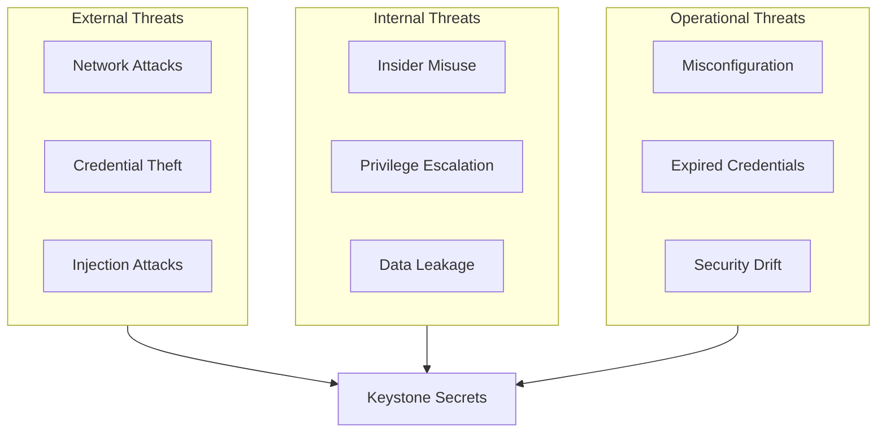

## Overview

This guide covers security considerations for operating Keystone Core's secrets management system. Following these guidelines helps protect sensitive data and maintain compliance with security standards.

## Threat Model

### Assets to Protect

| Asset | Description | Impact if Compromised |
|-------|-------------|----------------------|
| Secrets | Credentials, API keys, certificates | Unauthorized access to systems |
| Encryption Keys | Master keys, data encryption keys | Decryption of all protected data |
| Audit Logs | Access records, rotation history | Loss of accountability |
| Backend Credentials | Vault tokens, cloud credentials | Access to secret backends |
| Agent Identities | SPIFFE SVIDs, certificates | Impersonation of agents |

### Threat Categories



### Attack Vectors and Mitigations

| Attack Vector | Mitigation |
|---------------|------------|
| Network eavesdropping | TLS 1.3 for all connections |
| Credential brute force | Rate limiting, account lockout |
| Man-in-the-middle | Certificate pinning, mTLS |
| Memory extraction | Secure memory handling, encryption |
| Log analysis | Log masking, secure log storage |
| Timing attacks | Constant-time comparisons |
| Replay attacks | Nonce-based tokens, short TTLs |

## Secure Configuration

### TLS Configuration

Always use TLS for all connections:

```yaml
secrets:
  tls:
    # Minimum TLS version
    min_version: "1.3"

    # Certificate verification
    verify_certificates: true

    # Client certificate (mTLS)
    client_cert: "/etc/ssl/client.pem"
    client_key: "/etc/ssl/client-key.pem"

    # CA certificate
    ca_cert: "/etc/ssl/ca.pem"

    # Cipher suites (TLS 1.3 only by default)
    # cipher_suites:
    #   - TLS_AES_256_GCM_SHA384
    #   - TLS_CHACHA20_POLY1305_SHA256
```

### Authentication Security

#### Token Security

```yaml
secrets:
  auth:
    # Token settings
    token:
      # Short TTL for tokens
      ttl: 1h
      max_ttl: 24h

      # Require token renewal
      renewable: true

      # Bind to source IP
      bound_cidrs:
        - "10.0.0.0/8"
        - "172.16.0.0/12"

    # Rate limiting
    rate_limit:
      requests_per_second: 100
      burst: 200
```

#### Service Account Security

```yaml
secrets:
  service_accounts:
    # Rotate service account credentials
    rotation:
      enabled: true
      interval: 24h

    # Limit permissions
    minimum_permissions: true

    # Audit service account usage
    audit: true
```

### Network Security

```yaml
secrets:
  network:
    # Listen only on internal interfaces
    bind_address: "10.0.1.10"

    # Disable external access
    external_access: false

    # Use VPC endpoints for cloud backends
    use_private_endpoints: true

    # Firewall rules
    allowed_cidrs:
      - "10.0.0.0/8"
```

### Encryption at Rest

```yaml
secrets:
  encryption:
    # Encrypt cached secrets
    cache_encryption:
      enabled: true
      algorithm: "aes-256-gcm"

    # KMS-backed encryption
    kms:
      enabled: true
      provider: "aws_kms"
      key_id: "arn:aws:kms:us-west-2:123456789:key/abc-123"

    # Key rotation
    key_rotation:
      enabled: true
      interval: 90d
```

## Access Control

### Principle of Least Privilege

Grant minimum required permissions:

```yaml
# Policy example for read-only access
policies:
  app-secrets-reader:
    paths:
      "secrets/data/app/*":
        capabilities:
          - read
          - list
      # Deny write access
      "secrets/data/app/*":
        capabilities:
          - deny: [create, update, delete]
```

### Path-Based Access Control

```yaml
secrets:
  access_control:
    rules:
      # Production secrets require specific role
      - path: "production/*"
        required_roles:
          - production-admin
          - production-reader

      # Limit database credential access
      - path: "database/creds/*"
        required_roles:
          - database-admin
        audit_level: detailed

      # Allow service accounts limited access
      - path: "service/*/config"
        required_claims:
          service_type: "internal"
```

### Agent Authorization

```yaml
secrets:
  agent_authorization:
    # Require SPIFFE identity
    require_spiffe: true

    # Verify agent enrollment
    require_enrollment: true

    # Limit secrets by agent tags
    tag_based_access:
      enabled: true
      rules:
        - agent_tag: "environment=production"
          allowed_paths:
            - "production/*"
        - agent_tag: "tier=database"
          allowed_paths:
            - "database/*"
```

## Audit Logging

### Audit Configuration

```yaml
secrets:
  audit:
    enabled: true

    # Log all operations
    log_all: true

    # Detailed logging for sensitive paths
    detailed_paths:
      - "production/*"
      - "database/creds/*"

    # Log destinations
    destinations:
      # Local file
      - type: file
        path: "/var/log/keystone/secrets-audit.log"
        format: json
        rotation:
          max_size: 100MB
          max_age: 90d
          compress: true

      # Syslog
      - type: syslog
        address: "syslog.example.com:514"
        facility: auth
        format: cef

      # SIEM integration
      - type: webhook
        url: "https://siem.example.com/events"
        headers:
          Authorization: "Bearer {{ env.SIEM_TOKEN }}"
```

### Audit Log Fields

Each audit entry includes:

```json
{
  "timestamp": "2024-01-15T10:30:00.123Z",
  "event_id": "evt_abc123",
  "event_type": "secret.read",
  "principal": {
    "type": "agent",
    "id": "spiffe://example.com/agent/web-1",
    "ip": "10.0.1.50"
  },
  "resource": {
    "path": "database/creds/app",
    "backend": "vault"
  },
  "action": "read",
  "result": "success",
  "duration_ms": 45,
  "metadata": {
    "lease_id": "abc123",
    "ttl": 3600
  }
}
```

### Audit Retention

```yaml
secrets:
  audit:
    retention:
      # Keep audit logs for compliance
      duration: 365d

      # Archive to cold storage
      archive:
        enabled: true
        destination: "s3://audit-archive/secrets/"
        after: 90d

      # Immutable storage
      immutable: true
```

## Anomaly Detection

### Detection Rules

```yaml
secrets:
  anomaly_detection:
    enabled: true

    rules:
      # Excessive access
      - name: excessive_access
        threshold: 1000
        window: 1h
        severity: medium

      # Burst access
      - name: burst_access
        threshold: 100
        window: 1m
        severity: high

      # Secret enumeration
      - name: enumeration
        unique_secrets_threshold: 50
        window: 5m
        severity: high

      # Off-hours access
      - name: off_hours
        business_hours:
          start: "08:00"
          end: "18:00"
          timezone: "America/New_York"
          days: ["Mon", "Tue", "Wed", "Thu", "Fri"]
        severity: low

      # Unusual source
      - name: unusual_source
        baseline_window: 7d
        deviation_threshold: 3  # Standard deviations
        severity: medium
```

### Alert Configuration

```yaml
secrets:
  anomaly_detection:
    alerts:
      # Alert on high severity
      - severity: high
        destinations:
          - pagerduty
          - slack

      # Log medium severity
      - severity: medium
        destinations:
          - slack
          - audit_log

      # Monitor low severity
      - severity: low
        destinations:
          - audit_log
```

## Compliance

### Framework Configuration

```yaml
secrets:
  compliance:
    frameworks:
      - soc2
      - pci_dss
      - hipaa

    # Automatic compliance checks
    auto_check:
      enabled: true
      interval: 24h

    # Report generation
    reports:
      schedule: "0 0 1 * *"  # Monthly
      format: json
      destination: "s3://compliance-reports/"
```

### SOC 2 Requirements

| Control | Implementation |
|---------|----------------|
| CC6.1 | Encryption keys protected via KMS/HSM |
| CC6.6 | Automatic key rotation enabled |
| CC6.7 | All key changes audited |
| CC7.2 | Comprehensive audit logging |
| CC7.3 | Anomaly detection enabled |

### PCI-DSS Requirements

| Requirement | Implementation |
|-------------|----------------|
| 3.5.1 | Minimum privilege access control |
| 3.5.2 | KMS/HSM-backed encryption |
| 3.6.1 | Strong key generation |
| 3.6.4 | Automatic key rotation |
| 10.5 | Immutable audit logs |

### HIPAA Requirements

| Safeguard | Implementation |
|-----------|----------------|
| 164.312(a)(2)(iv) | Encryption for ePHI |
| 164.312(b) | Audit controls |
| 164.312(c)(1) | Integrity controls |
| 164.312(e)(2)(ii) | Transmission encryption |

## Security Hardening Checklist

### Initial Setup

- [ ] Enable TLS 1.3 for all connections
- [ ] Configure mTLS for agent communication
- [ ] Set up KMS/HSM-backed encryption
- [ ] Enable comprehensive audit logging
- [ ] Configure anomaly detection
- [ ] Set up alerting for security events

### Access Control

- [ ] Implement least privilege policies
- [ ] Enable SPIFFE authentication for agents
- [ ] Configure path-based access control
- [ ] Set up rate limiting
- [ ] Enable IP allowlisting

### Operational Security

- [ ] Enable automatic secret rotation
- [ ] Configure backup encryption
- [ ] Set up log forwarding to SIEM
- [ ] Enable compliance reporting
- [ ] Document incident response procedures

### Monitoring

- [ ] Set up security dashboards
- [ ] Configure alerting thresholds
- [ ] Enable audit log analysis
- [ ] Monitor for anomalies
- [ ] Review access patterns regularly

## Incident Response

### Secret Compromise Procedure

1. **Immediate Actions**

   ```bash
   # Revoke compromised secret
   kscorectl secrets revoke --path "compromised/secret" --immediate

   # Rotate all related secrets
   kscorectl secrets rotation start \
     --path "related/*" \
     --strategy blue_green \
     --immediate
   ```

2. **Investigation**

   ```bash
   # Get access history
   kscorectl secrets audit \
     --path "compromised/secret" \
     --since "7d" \
     --output detailed

   # Identify affected systems
   kscorectl secrets audit \
     --path "compromised/secret" \
     --group-by agent
   ```

3. **Remediation**

   ```bash
   # Update access policies
   kscorectl policy update \
     --path "compromised/*" \
     --add-requirement "mfa=true"

   # Enable enhanced monitoring
   kscorectl secrets anomaly-detection \
     --path "compromised/*" \
     --sensitivity high
   ```

### Key Compromise Procedure

> **Note**: Key rotation and re-encryption are handled by your secrets backend (e.g., Vault).
> Keystone Core's secrets CLI focuses on rotation orchestration for application credentials.

1. **Rotate master key** (using Vault)

   ```bash
   vault operator rekey -init
   vault operator rekey -key-shares=5 -key-threshold=3
   ```

2. **Trigger rotation of all managed secrets**

   ```bash
   kscorectl secrets rotate start --all
   ```

3. **Verify rotation completed**

   ```bash
   kscorectl secrets rotate list --status completed
   ```

## Security Testing

### Penetration Testing

> **Note**: Security testing should be performed using dedicated security tools.
> Keystone Core does not include a built-in pentest suite.

Recommended security testing approach:

```bash
# Use dedicated security scanning tools
# Example with trivy for configuration scanning
trivy config /etc/keystone-core/

# Use vault-benchmark for Vault security testing
vault-benchmark check --all
```

### Test Categories

| Category | Description |
|----------|-------------|
| Authentication | Credential validation, token handling |
| Authorization | Access control, privilege escalation |
| Cryptography | Key strength, nonce reuse, padding oracle |
| Information Disclosure | Error messages, key enumeration |
| Timing Attacks | Side-channel vulnerabilities |
| Injection | Command/SQL injection |

### Regular Security Reviews

Schedule regular security assessments:

```yaml
security:
  assessments:
    # Weekly automated scans
    automated:
      schedule: "0 0 * * 0"
      categories:
        - authentication
        - authorization
        - cryptography

    # Quarterly manual review
    manual:
      schedule: quarterly
      scope:
        - access_control_policies
        - audit_log_review
        - key_rotation_compliance
```

## Best Practices Summary

### Do's

1. **Use dynamic secrets** with short TTLs
2. **Enable audit logging** for all operations
3. **Configure anomaly detection** with appropriate thresholds
4. **Use KMS/HSM** for master key protection
5. **Implement mTLS** for all communication
6. **Rotate credentials** automatically
7. **Monitor access patterns** continuously
8. **Test security controls** regularly

### Don'ts

1. **Don't log secrets** in plaintext
2. **Don't use static credentials** in production
3. **Don't disable TLS verification** in production
4. **Don't grant excessive permissions**
5. **Don't ignore security alerts**
6. **Don't skip verification** during rotation
7. **Don't store secrets** in environment variables long-term

## Next Steps

- [Troubleshooting Guide](/docs/operations/secrets-troubleshooting/) - Common issues
- [Backend Setup](/docs/operations/secrets-backends/) - Backend configuration
- [Compliance Reports](/docs/reference/secrets-api/#compliance) - Generating reports
