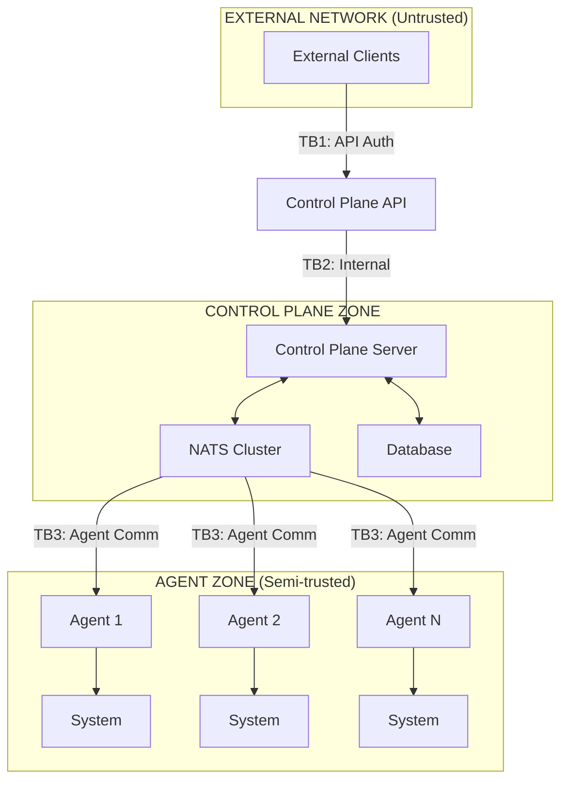
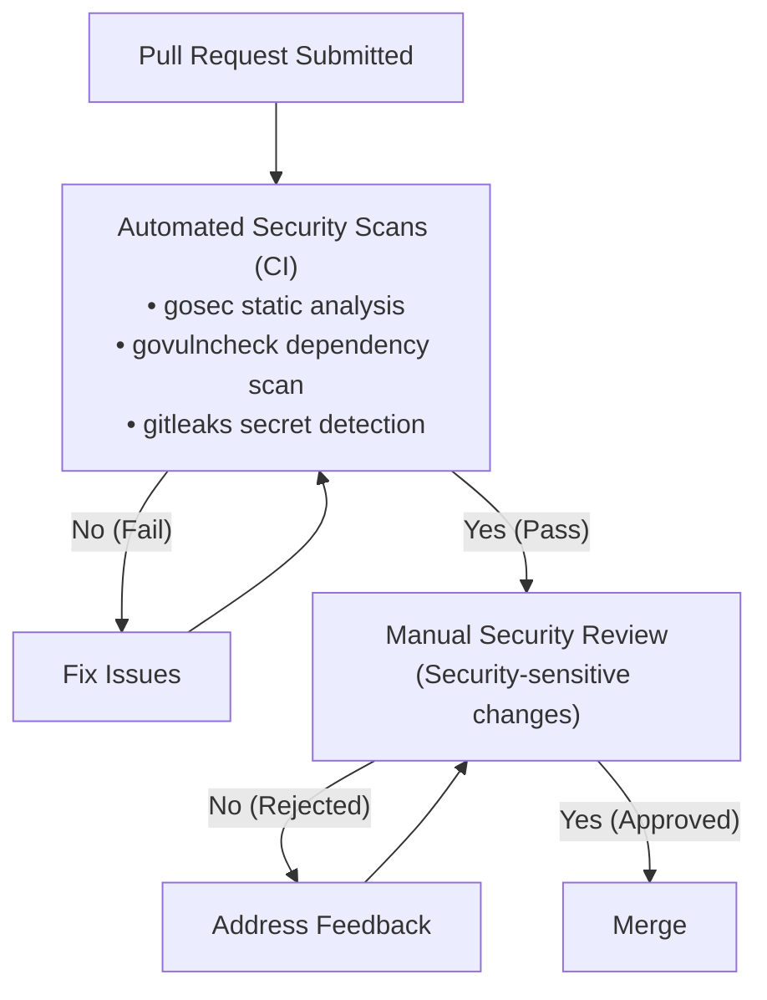
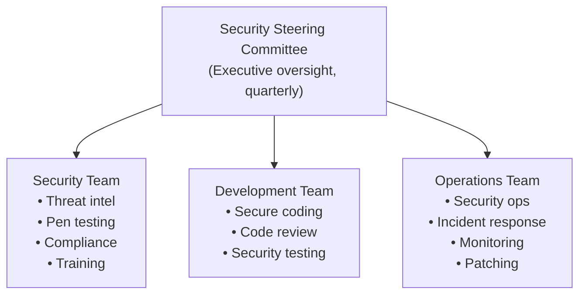

## Overview

This security training guide provides comprehensive education on secure development practices, operational security, and security awareness for everyone working with Keystone Core. Training is organized into role-based modules with hands-on exercises.

**Training Objectives**:
- Understand Keystone Core's security architecture and threat landscape
- Learn secure coding practices specific to infrastructure automation
- Master operational security procedures
- Respond effectively to security incidents
- Maintain compliance with security frameworks

---

## Training Curriculum

### Role-Based Training Paths

| Role | Required Modules | Certification | Renewal |
|------|------------------|---------------|---------|
| **Developer/Contributor** | Modules 1, 2, 3, 7 | Code Security | Annual |
| **Operator/Administrator** | Modules 1, 4, 5, 6, 7 | Operations Security | Annual |
| **Security Engineer** | All Modules | Security Specialist | Annual |
| **Manager/Lead** | Modules 1, 6, 7 | Security Awareness | Annual |

### Training Schedule

| Module | Duration | Format | Prerequisites |
|--------|----------|--------|---------------|
| Module 1: Security Fundamentals | 2 hours | Self-paced | None |
| Module 2: Secure Development | 4 hours | Interactive | Module 1 |
| Module 3: Code Review Security | 2 hours | Workshop | Module 2 |
| Module 4: Operational Security | 4 hours | Interactive | Module 1 |
| Module 5: Incident Response | 3 hours | Tabletop exercise | Module 4 |
| Module 6: Compliance & Governance | 2 hours | Self-paced | Module 1 |
| Module 7: Security Awareness | 1 hour | Self-paced | None |

---

## Module 1: Security Fundamentals

**Duration**: 2 hours
**Audience**: All roles
**Prerequisites**: None

### Learning Objectives

After completing this module, you will be able to:
- Explain Keystone Core's security architecture and trust boundaries
- Identify threat actors and their motivations
- Understand the STRIDE threat model
- Recognize common attack patterns in infrastructure automation

### 1.1 Keystone Core Security Architecture

**Trust Boundaries**:



**Trust Boundaries**:
- **TB1**: API Authentication (external to control plane)
- **TB2**: Internal Services (API to control plane components)
- **TB3**: Agent Communication (control plane to agents)
- **TB4**: System Access (agents to managed systems)

**Key Security Layers**:

1. **Authentication**: Who is making the request?
   - API keys, JWT tokens, mTLS certificates
   - SPIFFE SVIDs for workload identity

2. **Authorization**: What are they allowed to do?
   - Role-based access control (RBAC)
   - Policy-based enforcement (OPA/CEL)

3. **Encryption**: Is the data protected?
   - TLS 1.3 for all network communications
   - Encryption at rest for sensitive data

4. **Auditing**: What happened and when?
   - Comprehensive audit logging
   - Tamper-evident log storage

### 1.2 Threat Actors

| Actor | Motivation | Capability | Example Attacks |
|-------|------------|------------|-----------------|
| **External Attacker** | Financial gain, disruption | Remote access, exploits | API exploitation, credential theft |
| **Compromised Agent** | Lateral movement | Local system access | Privilege escalation, data theft |
| **Malicious Insider** | Revenge, financial | Valid credentials | Data exfiltration, sabotage |
| **Supply Chain Attacker** | Long-term access | Build system access | Malicious modules, backdoors |

### 1.3 STRIDE Threat Model

| Category | Description | Example in Keystone Core |
|----------|-------------|--------------------------|
| **S**poofing | Impersonating another entity | Forged agent identity |
| **T**ampering | Modifying data without authorization | Modified state configurations |
| **R**epudiation | Denying actions | Unlogged command execution |
| **I**nformation Disclosure | Exposing data to unauthorized parties | Credential leakage in logs |
| **D**enial of Service | Disrupting availability | API flooding |
| **E**levation of Privilege | Gaining unauthorized access | Module sandbox escape |

### Knowledge Check

1. What trust boundary protects the control plane from external networks?
2. Name two authentication methods supported by Keystone Core.
3. Which STRIDE category does credential leakage in logs fall under?

<details>
<summary>Answers</summary>

1. TB1: API Authentication with TLS, JWT/API keys, and rate limiting
2. Any two: API keys, JWT tokens, mTLS certificates, SPIFFE SVIDs
3. Information Disclosure (I)

</details>

---

## Module 2: Secure Development

**Duration**: 4 hours
**Audience**: Developers, Contributors
**Prerequisites**: Module 1

### Learning Objectives

After completing this module, you will be able to:
- Apply secure coding practices in Go
- Prevent common vulnerabilities (OWASP Top 10)
- Use security tools in the development workflow
- Write security-focused tests

### 2.1 Secure Coding in Go

**Input Validation**:

```go
// BAD: Trusting user input directly
func handleCommand(cmd string) error {
    return exec.Command("sh", "-c", cmd).Run() // Command injection!
}

// GOOD: Validating and sanitizing input
func handleCommand(cmd string, args []string) error {
    // Allowlist of permitted commands
    allowed := map[string]bool{
        "ls": true, "cat": true, "echo": true,
    }

    if !allowed[cmd] {
        return fmt.Errorf("command not allowed: %s", cmd)
    }

    // Use exec.Command with separate arguments (no shell expansion)
    return exec.Command(cmd, args...).Run()
}
```

**SQL Injection Prevention**:

```go
// BAD: String concatenation in queries
func getAgent(id string) (*Agent, error) {
    query := "SELECT * FROM agents WHERE id = '" + id + "'"
    return db.Query(query) // SQL injection!
}

// GOOD: Parameterized queries
func getAgent(id string) (*Agent, error) {
    query := "SELECT * FROM agents WHERE id = $1"
    return db.Query(query, id) // Safe!
}
```

**Secure Error Handling**:

```go
// BAD: Exposing internal details
func login(username, password string) error {
    user, err := db.GetUser(username)
    if err != nil {
        return fmt.Errorf("database error: %v", err) // Info disclosure!
    }
    if user == nil {
        return fmt.Errorf("user %s not found", username) // User enumeration!
    }
    if !checkPassword(user, password) {
        return fmt.Errorf("invalid password for %s", username) // Info disclosure!
    }
    return nil
}

// GOOD: Generic error messages
func login(username, password string) error {
    user, err := db.GetUser(username)
    if err != nil {
        log.Error("database error during login", "error", err)
        return ErrAuthenticationFailed // Generic error
    }
    if user == nil || !checkPassword(user, password) {
        return ErrAuthenticationFailed // Same error for both cases
    }
    return nil
}
```

**Secrets Handling**:

```go
// BAD: Secrets in logs
func connectVault(token string) error {
    log.Info("connecting to vault", "token", token) // Secret in logs!
    // ...
}

// GOOD: Redact secrets from logs
func connectVault(token string) error {
    log.Info("connecting to vault", "token", "[REDACTED]")
    // Use secure string type that prevents accidental logging
    secureToken := secrets.NewSecureString(token)
    defer secureToken.Clear() // Zero memory when done
    // ...
}
```

### 2.2 Common Vulnerability Prevention

**Path Traversal**:

```go
// BAD: User-controlled path
func readFile(userPath string) ([]byte, error) {
    return os.ReadFile(filepath.Join("/data", userPath)) // Path traversal!
}

// GOOD: Validate path stays within allowed directory
func readFile(userPath string) ([]byte, error) {
    // Clean the path
    cleanPath := filepath.Clean(userPath)

    // Ensure no directory traversal
    if strings.Contains(cleanPath, "..") {
        return nil, ErrInvalidPath
    }

    // Build full path and verify it's under allowed directory
    fullPath := filepath.Join("/data", cleanPath)
    if !strings.HasPrefix(fullPath, "/data/") {
        return nil, ErrInvalidPath
    }

    return os.ReadFile(fullPath)
}
```

**Symlink Attacks**:

```go
// BAD: Following symlinks without validation
func writeConfig(path string, data []byte) error {
    return os.WriteFile(path, data, 0644) // May follow symlink!
}

// GOOD: Check for symlinks and use safe patterns
func writeConfig(path string, data []byte) error {
    // Check if path is a symlink
    info, err := os.Lstat(path)
    if err == nil && info.Mode()&os.ModeSymlink != 0 {
        return ErrSymlinkNotAllowed
    }

    // Write atomically using temp file + rename
    tmpPath := path + ".tmp"
    if err := os.WriteFile(tmpPath, data, 0600); err != nil {
        return err
    }
    return os.Rename(tmpPath, path)
}
```

**Race Conditions (TOCTOU)**:

```go
// BAD: Time-of-check to time-of-use vulnerability
func safeDelete(path string) error {
    info, err := os.Stat(path)
    if err != nil {
        return err
    }
    if !info.IsDir() { // Check
        return os.Remove(path) // Use - file might have changed!
    }
    return ErrIsDirectory
}

// GOOD: Use atomic operations or proper locking
func safeDelete(path string) error {
    // Use O_NOFOLLOW and check type at open time
    f, err := os.OpenFile(path, os.O_RDONLY|syscall.O_NOFOLLOW, 0)
    if err != nil {
        return err
    }
    defer f.Close()

    info, err := f.Stat()
    if err != nil {
        return err
    }
    if info.IsDir() {
        return ErrIsDirectory
    }

    // Unlink using the file descriptor to avoid TOCTOU
    return unix.Unlinkat(int(f.Fd()), "", 0)
}
```

### 2.3 Security Testing

**Unit Tests for Security**:

```go
func TestLoginRateLimiting(t *testing.T) {
    auth := NewAuthenticator(WithMaxAttempts(5), WithLockoutDuration(15*time.Minute))

    // Attempt 5 failed logins
    for i := 0; i < 5; i++ {
        err := auth.Login("user", "wrong-password")
        assert.ErrorIs(t, err, ErrAuthenticationFailed)
    }

    // 6th attempt should be rate limited
    err := auth.Login("user", "wrong-password")
    assert.ErrorIs(t, err, ErrRateLimited)

    // Even correct password should be rejected during lockout
    err = auth.Login("user", "correct-password")
    assert.ErrorIs(t, err, ErrRateLimited)
}

func TestSQLInjectionPrevention(t *testing.T) {
    db := setupTestDB(t)

    // Attempt SQL injection
    maliciousID := "'; DROP TABLE agents; --"
    _, err := db.GetAgent(maliciousID)

    // Should return not found, not execute injection
    assert.ErrorIs(t, err, ErrAgentNotFound)

    // Verify table still exists
    _, err = db.ListAgents()
    assert.NoError(t, err)
}

func TestPathTraversal(t *testing.T) {
    handler := NewFileHandler("/data")

    tests := []struct {
        name    string
        path    string
        wantErr error
    }{
        {"normal path", "config.yaml", nil},
        {"nested path", "subdir/config.yaml", nil},
        {"parent traversal", "../etc/passwd", ErrInvalidPath},
        {"encoded traversal", "..%2f..%2fetc/passwd", ErrInvalidPath},
        {"absolute path", "/etc/passwd", ErrInvalidPath},
    }

    for _, tt := range tests {
        t.Run(tt.name, func(t *testing.T) {
            _, err := handler.ReadFile(tt.path)
            if tt.wantErr != nil {
                assert.ErrorIs(t, err, tt.wantErr)
            }
        })
    }
}
```

### 2.4 Security Tools

**Development Workflow Integration**:

```bash
# Pre-commit security checks
# .pre-commit-config.yaml
repos:
  - repo: local
    hooks:
      - id: gosec
        name: Security scan with gosec
        entry: gosec -exclude-generated ./...
        language: system
        pass_filenames: false

      - id: govulncheck
        name: Vulnerability check
        entry: govulncheck ./...
        language: system
        pass_filenames: false

      - id: gitleaks
        name: Secret detection
        entry: gitleaks detect --source . --verbose
        language: system
        pass_filenames: false
```

**Running Security Scans**:

```bash
# Static analysis
gosec ./...

# Dependency vulnerabilities
govulncheck ./...

# Secret detection
gitleaks detect --source .

# Full security scan
make security-check
```

### Exercise: Secure Code Review

Review the following code and identify security issues:

```go
func ExecuteUserCommand(w http.ResponseWriter, r *http.Request) {
    cmd := r.URL.Query().Get("cmd")
    args := r.URL.Query().Get("args")

    output, err := exec.Command("sh", "-c", cmd+" "+args).Output()
    if err != nil {
        http.Error(w, fmt.Sprintf("Error: %v", err), 500)
        return
    }

    log.Printf("Executed command: %s %s", cmd, args)
    w.Write(output)
}
```

<details>
<summary>Security Issues Found</summary>

1. **Command Injection**: User input directly passed to shell execution
2. **Information Disclosure**: Error details exposed to user
3. **Missing Authentication**: No check if user is authorized
4. **Missing Authorization**: No check if command is allowed
5. **Missing Input Validation**: No sanitization of cmd or args
6. **Logging Sensitive Data**: Commands logged without redaction

**Remediation**:
- Use exec.Command with separate arguments (no shell)
- Implement command allowlisting
- Add authentication and authorization
- Return generic error messages
- Validate and sanitize input
- Redact sensitive data in logs

</details>

---

## Module 3: Code Review Security

**Duration**: 2 hours
**Audience**: Developers, Contributors
**Prerequisites**: Module 2

### Learning Objectives

After completing this module, you will be able to:
- Conduct security-focused code reviews
- Identify security issues in pull requests
- Apply the security review checklist
- Provide constructive security feedback

### 3.1 Security Review Checklist

Use this checklist when reviewing pull requests:

**Authentication & Authorization**:
- [ ] Authentication required for sensitive endpoints?
- [ ] Authorization checks before accessing resources?
- [ ] No hardcoded credentials or secrets?
- [ ] Token validation and expiration handled?

**Input Handling**:
- [ ] All user input validated?
- [ ] Parameterized queries for database access?
- [ ] No command injection possibilities?
- [ ] Path traversal prevented?

**Error Handling**:
- [ ] No sensitive information in error messages?
- [ ] Proper error logging (not exposing secrets)?
- [ ] Graceful degradation for failures?

**Cryptography**:
- [ ] Strong algorithms used (AES-256, SHA-256+)?
- [ ] No custom crypto implementations?
- [ ] Secure random number generation?
- [ ] Proper key management?

**Data Protection**:
- [ ] Sensitive data encrypted in transit?
- [ ] Sensitive data encrypted at rest?
- [ ] No secrets in logs or debug output?
- [ ] Proper data retention/deletion?

### 3.2 Common Security Review Findings

**Finding: Insufficient Input Validation**

```go
// Review comment:
// SECURITY: Missing input validation. The agent ID should be validated
// against expected format before use. Malicious input could cause issues
// downstream.

func GetAgent(id string) (*Agent, error) {
    // Missing: id format validation
    return db.Query("SELECT * FROM agents WHERE id = $1", id)
}

// Suggested fix:
func GetAgent(id string) (*Agent, error) {
    if !isValidAgentID(id) {
        return nil, ErrInvalidAgentID
    }
    return db.Query("SELECT * FROM agents WHERE id = $1", id)
}
```

**Finding: Insecure Default**

```go
// Review comment:
// SECURITY: Default value of false means TLS is disabled by default.
// This is an insecure default. TLS should be enabled by default with
// an explicit opt-out for development environments.

type Config struct {
    TLSEnabled bool // Default: false - INSECURE
}

// Suggested fix:
type Config struct {
    TLSDisabled bool `default:"false"` // Explicit opt-out
}
```

**Finding: Missing Rate Limiting**

```go
// Review comment:
// SECURITY: This authentication endpoint has no rate limiting, making
// it vulnerable to brute force attacks. Consider adding rate limiting
// based on source IP or username.

func (h *Handler) Login(w http.ResponseWriter, r *http.Request) {
    // No rate limiting
    user := r.FormValue("username")
    pass := r.FormValue("password")
    // ...
}
```

### 3.3 Security Review Workflow



### Exercise: Review a Security-Sensitive PR

Review the following diff and provide security feedback:

```diff
+ func handleWebhook(w http.ResponseWriter, r *http.Request) {
+     body, _ := io.ReadAll(r.Body)
+
+     var event WebhookEvent
+     json.Unmarshal(body, &event)
+
+     log.Printf("Received webhook: %+v", event)
+
+     switch event.Type {
+     case "deployment":
+         triggerDeployment(event.Data["target"].(string))
+     case "rollback":
+         triggerRollback(event.Data["version"].(string))
+     }
+
+     w.WriteHeader(200)
+ }
```

<details>
<summary>Review Feedback</summary>

**Security Issues**:

1. **Missing Authentication**: No webhook signature verification
   ```go
   // Add HMAC signature verification
   signature := r.Header.Get("X-Hub-Signature-256")
   if !verifySignature(body, signature, webhookSecret) {
       http.Error(w, "Unauthorized", 401)
       return
   }
   ```

2. **Error Handling Ignored**: ReadAll and Unmarshal errors discarded
   ```go
   body, err := io.ReadAll(r.Body)
   if err != nil {
       http.Error(w, "Bad Request", 400)
       return
   }
   ```

3. **Type Assertion Without Check**: Potential panic on malformed data
   ```go
   target, ok := event.Data["target"].(string)
   if !ok {
       http.Error(w, "Invalid target", 400)
       return
   }
   ```

4. **Logging Sensitive Data**: Full event logged without redaction

5. **Missing Input Validation**: target and version not validated

6. **Missing Rate Limiting**: Vulnerable to webhook flooding

</details>

---

## Module 4: Operational Security

**Duration**: 4 hours
**Audience**: Operators, Administrators
**Prerequisites**: Module 1

### Learning Objectives

After completing this module, you will be able to:
- Deploy Keystone Core securely
- Configure authentication and authorization
- Implement defense-in-depth
- Monitor security events

### 4.1 Secure Deployment Checklist

**Before Deployment**:

- [ ] Review threat model for deployment environment
- [ ] Generate secure credentials (API keys, certificates)
- [ ] Configure TLS certificates (Let's Encrypt or internal CA)
- [ ] Set up secrets management (Vault, KMS)
- [ ] Configure network segmentation
- [ ] Plan backup and recovery procedures

**Control Plane Security**:

```yaml
# server.yaml - Production security configuration
api:
  listen: "0.0.0.0:8443"
  tls:
    enabled: true
    cert_file: /etc/keystone-core/certs/server.crt
    key_file: /etc/keystone-core/certs/server.key
    min_version: "TLS1.3"

  rate_limiting:
    enabled: true
    requests_per_minute: 100
    burst: 20

auth:
  type: mtls  # Strongest authentication
  mtls:
    require_client_cert: true
    cert_roles:
      "*.admin.example.com": admin
      "*.ops.example.com": operator
      "**": readonly

  rate_limiting:
    enabled: true
    max_failures: 5
    lockout_duration: 15m

audit:
  enabled: true
  log_file: /var/log/keystone-core/audit.log
  retention:
    max_age: "365d"
```

**Agent Security**:

```yaml
# agent.yaml - Secure agent configuration
identity:
  mode: spiffe  # Use SPIFFE for automatic certificate rotation
  spiffe:
    socket: /run/spire/sockets/agent.sock
    trust_domain: cluster.local

nats:
  url: "tls://nats.cluster.local:4222"
  tls:
    ca_file: /etc/keystone-core/certs/ca.crt
    verify_server: true

execution:
  user: kscore  # Non-root execution
  policy:
    mode: normal  # Block dangerous commands
```

### 4.2 Authentication Configuration

**mTLS Setup (Recommended for Production)**:

```bash
# 1. Create CA
openssl genrsa -out ca-key.pem 4096
openssl req -new -x509 -days 3650 -key ca-key.pem \
    -out ca.pem -subj "/CN=Keystone Core CA"

# 2. Create server certificate
openssl genrsa -out server-key.pem 4096
openssl req -new -key server-key.pem -out server.csr \
    -subj "/CN=control-plane.cluster.local"

cat > server-ext.cnf <<EOF
authorityKeyIdentifier=keyid,issuer
basicConstraints=CA:FALSE
keyUsage=digitalSignature
extendedKeyUsage=serverAuth
subjectAltName=@alt_names
[alt_names]
DNS.1=control-plane.cluster.local
DNS.2=localhost
IP.1=10.0.0.1
EOF

openssl x509 -req -days 365 -in server.csr -CA ca.pem \
    -CAkey ca-key.pem -CAcreateserial -out server-cert.pem \
    -extfile server-ext.cnf

# 3. Create admin client certificate
openssl genrsa -out admin-key.pem 4096
openssl req -new -key admin-key.pem -out admin.csr \
    -subj "/CN=admin.kscore.cluster.local"
openssl x509 -req -days 365 -in admin.csr -CA ca.pem \
    -CAkey ca-key.pem -out admin-cert.pem

# 4. Secure key permissions
chmod 400 *-key.pem
chmod 444 *.pem ca.pem
chown kscore:kscore *
```

**JWT Configuration (External IdP)**:

```yaml
# server.yaml
auth:
  type: jwt
  jwt:
    # Get public key from your IdP
    public_key_file: /etc/keystone-core/jwt-public.pem
    issuer: "https://your-idp.example.com/"
    audience: "kscore-api"
    role_claim: "https://keystone-core.io/role"
```

### 4.3 Defense-in-Depth Implementation

**Layer 1: Network Security**

```bash
# UFW firewall configuration
sudo ufw default deny incoming
sudo ufw default allow outgoing

# Control plane access
sudo ufw allow from 10.0.1.0/24 to any port 8443 proto tcp  # Admin network
sudo ufw allow from 10.0.10.0/16 to any port 4222 proto tcp # Agent network

# SSH (management only)
sudo ufw allow from 10.0.1.0/24 to any port 22 proto tcp

sudo ufw enable
```

**Layer 2: Application Security**

```yaml
# RBAC policy
roles:
  - name: deployment-operator
    description: "Can deploy but not modify infrastructure"
    permissions:
      - resource: "state/*"
        actions: ["apply", "check"]
      - resource: "job/*"
        actions: ["create", "read"]
      - resource: "agent/*"
        actions: ["read"]
```

**Layer 3: Runtime Security**

```ini
# /etc/systemd/system/kscore-server.service
[Service]
User=kscore
Group=kscore
NoNewPrivileges=true
PrivateTmp=true
ProtectSystem=strict
ProtectHome=true
ReadWritePaths=/var/lib/keystone-core /var/log/keystone-core
CapabilityBoundingSet=CAP_NET_BIND_SERVICE
```

### 4.4 Security Monitoring

**Key Metrics to Monitor**:

```yaml
# Prometheus alerting rules
groups:
  - name: security
    rules:
      - alert: HighAuthenticationFailureRate
        expr: rate(kscore_auth_failures_total[5m]) > 0.1
        for: 5m
        labels:
          severity: warning
        annotations:
          summary: "High authentication failure rate detected"

      - alert: UnauthorizedAPIAccess
        expr: increase(kscore_api_unauthorized_total[1h]) > 10
        for: 0m
        labels:
          severity: critical
        annotations:
          summary: "Multiple unauthorized API access attempts"

      - alert: CertificateExpiringSoon
        expr: kscore_certificate_expiry_days < 30
        for: 0m
        labels:
          severity: warning
        annotations:
          summary: "Certificate expiring in {{ $value }} days"
```

**Audit Log Review**:

```bash
# Review failed authentication attempts
jq 'select(.event_type == "authentication" and .result == "failed")' \
    /var/log/keystone-core/audit.log

# Review privilege escalation attempts
jq 'select(.event_type == "authorization" and .result == "denied")' \
    /var/log/keystone-core/audit.log

# Review sensitive operations
jq 'select(.action | test("delete|destroy|wipe"))' \
    /var/log/keystone-core/audit.log
```

### Exercise: Security Assessment

Perform a security assessment of a Keystone Core deployment:

1. **Network Security Review**
   ```bash
   # Check open ports
   sudo netstat -tlnp | grep -E "(kscore|nats)"

   # Verify TLS configuration
   openssl s_client -connect localhost:8443 -brief
   ```

2. **Authentication Review**
   ```bash
   # Check authentication configuration
   cat /etc/keystone-core/server.yaml | grep -A 10 "auth:"

   # Verify certificate expiration
   openssl x509 -in /etc/keystone-core/certs/server.crt -noout -dates
   ```

3. **Authorization Review**
   ```bash
   # Review RBAC configuration
   cat /etc/keystone-core/rbac.yaml

   # Review recent audit logs for authorization events
   kscore-audit log --since 24h | jq 'select(.type == "authorization")'
   ```

---

## Module 5: Incident Response

**Duration**: 3 hours
**Audience**: Operators, Security Engineers
**Prerequisites**: Module 4

### Learning Objectives

After completing this module, you will be able to:
- Identify and classify security incidents
- Execute incident response procedures
- Contain and eradicate threats
- Conduct post-incident reviews

### 5.1 Incident Classification

| Severity | Description | Response Time | Escalation |
|----------|-------------|---------------|------------|
| **Critical** | Active compromise, data breach, service outage | Immediate (15 min) | Security Team + Management |
| **High** | Attempted intrusion, significant vulnerability | 1 hour | Security Team |
| **Medium** | Suspicious activity, minor vulnerability | 4 hours | On-call Engineer |
| **Low** | Policy violation, failed attack attempt | 24 hours | Regular review |

### 5.2 Incident Response Phases

**Phase 1: Detection & Identification**

```bash
# Check for indicators of compromise
# Unusual login patterns - review audit logs for failed authentication
kscore-audit log --since 1h | \
    jq 'select(.type == "authentication" and .result == "failed")'

# Unexpected command execution
kscore-audit log --since 1h | \
    jq 'select(.type == "exec.run" and .user != "expected-user")'

# Unauthorized policy changes
kscore-audit log --since 24h | jq 'select(.type == "policy.update")'
```

**Phase 2: Containment**

```bash
# Immediate containment actions

# 1. Quarantine compromised agent
kscorectl agents quarantine AGENT_ID --reason "Security incident"

# 2. Revoke compromised API keys
kscorectl api-key list                 # Find keys to revoke
kscorectl api-key revoke KEY_ID        # Revoke each compromised key

# 3. Block suspicious IP
sudo ufw deny from SUSPICIOUS_IP

# 4. Disable compromised account
# User and session management is handled by your identity provider (Auth0, Okta, etc.)
```

**Phase 3: Eradication**

```bash
# 1. Rotate all potentially compromised credentials
# Revoke existing keys and create new ones
kscorectl api-key list                 # Identify keys for the user
kscorectl api-key revoke KEY_ID        # Revoke each compromised key
kscorectl api-key create --name "new-key" --role admin --expires-in 30d

# 2. Update vulnerable components
apt update && apt upgrade keystone-core

# 3. Remove persistence mechanisms
# Check for unauthorized cron jobs, services, SSH keys

# 4. Reset agent enrollment if needed
# Delete and re-register the agent with a new token
kscorectl agents delete AGENT_ID
kscorectl agents token create --name "re-enrollment" --ttl 1h
# Re-run agent bootstrap on the target system with new token
```

**Phase 4: Recovery**

```bash
# 1. Restore from known-good backup
kscore-backup verify BACKUP_ID         # Verify backup integrity first
kscore-backup restore BACKUP_ID        # Restore the backup

# 2. Verify system integrity
kscorectl health check

# 3. Re-enable services
kscorectl agents unquarantine AGENT_ID

# 4. Monitor for recurrence
# Set up log monitoring with your observability stack
# Review audit logs periodically:
kscore-audit log --since 1h | jq 'select(.severity == "warning" or .severity == "error")'
```

**Phase 5: Post-Incident Review**

Document the following:
- Timeline of events
- Attack vector and root cause
- Actions taken
- Lessons learned
- Recommendations for improvement

### 5.3 Incident Response Runbooks

**Runbook: Compromised API Key**

```yaml
incident_type: compromised_api_key
severity: high
response_time: 1 hour

steps:
  - name: Revoke compromised key
    command: kscorectl api-key revoke KEY_ID

  - name: Identify key usage
    command: |
      kscore-audit log --since COMPROMISE_TIME | \
        jq 'select(.api_key_id == "KEY_ID")'

  - name: Review affected resources
    command: |
      kscore-audit log | jq 'select(.api_key_id == "KEY_ID" and
        (.type == "state.apply" or .type == "exec.run"))'

  - name: Issue new key to legitimate user
    command: |
      kscorectl api-key create \
        --name "replacement-key" \
        --role ORIGINAL_ROLE

  - name: Notify affected users
    action: manual
    description: Contact key owner about compromise

post_incident:
  - Review key management practices
  - Consider implementing key rotation policy
  - Add detection for key misuse
```

**Runbook: Agent Compromise**

```yaml
incident_type: compromised_agent
severity: critical
response_time: 15 minutes

steps:
  - name: Quarantine agent
    command: kscorectl agents quarantine AGENT_ID

  - name: Capture forensic data (before quarantine takes effect)
    command: |
      kscorectl exec run AGENT_ID -- \
        tar -czf /tmp/forensics-$(date +%Y%m%d).tar.gz /var/log /etc/keystone-core

  - name: Delete agent to revoke credentials
    command: kscorectl agents delete AGENT_ID
    note: This revokes all agent credentials; re-enrollment required after remediation

  - name: Review lateral movement
    command: |
      kscore-audit log --since 7d | \
        jq 'select(.agent_id == "AGENT_ID" and
          (.type == "exec.run" or .type == "state.apply"))'

  - name: Check for persistence (via SSH to isolated system)
    command: |
      # SSH keys
      ssh admin@AGENT_HOST "cat /root/.ssh/authorized_keys"
      # Cron jobs
      ssh admin@AGENT_HOST "crontab -l"
      # Services
      ssh admin@AGENT_HOST "systemctl list-units --type=service"
```

### Exercise: Tabletop Exercise

**Scenario**: You receive an alert that multiple authentication failures have occurred from an unusual IP address, followed by a successful login using an operator account.

Walk through the incident response process:

1. What is the severity classification?
2. What immediate containment actions would you take?
3. What investigation steps would you perform?
4. How would you determine the scope of compromise?

<details>
<summary>Discussion Points</summary>

**Severity**: High to Critical (depending on what actions were taken post-login)

**Immediate Actions**:
- Revoke the compromised operator session
- Block the suspicious IP address
- Disable the compromised account temporarily
- Alert the security team

**Investigation**:
- Review all actions taken by the session
- Check for privilege escalation attempts
- Look for data exfiltration indicators
- Review authentication logs for the account

**Scope Assessment**:
- What resources did the account have access to?
- Were any commands executed?
- Were any state changes applied?
- Were credentials created or modified?

</details>

---

## Module 6: Compliance & Governance

**Duration**: 2 hours
**Audience**: Managers, Security Engineers
**Prerequisites**: Module 1

### Learning Objectives

After completing this module, you will be able to:
- Understand compliance requirements for infrastructure automation
- Implement security controls for common frameworks
- Conduct compliance audits
- Maintain security documentation

### 6.1 Compliance Framework Mapping

**SOC 2 Trust Services Criteria**:

| Criteria | Keystone Core Controls |
|----------|------------------------|
| CC6.1 (Access Control) | RBAC, mTLS, API keys |
| CC6.2 (Authentication) | JWT, certificates, MFA |
| CC6.3 (Authorization) | Policy engine, RBAC |
| CC6.6 (Encryption) | TLS 1.3, AES-256 at rest |
| CC7.1 (Change Management) | Audit logging, GitOps |
| CC7.2 (Incident Response) | Incident runbooks, alerting |

**PCI-DSS Requirements**:

| Requirement | Implementation |
|-------------|----------------|
| 1.x (Network Security) | Firewall rules, network segmentation |
| 2.x (Secure Configs) | Hardening guides, secure defaults |
| 3.x (Data Protection) | Encryption at rest and in transit |
| 7.x (Access Control) | RBAC, least privilege |
| 10.x (Logging) | Audit logging, log retention |
| 11.x (Testing) | Vulnerability scanning, pen testing |

### 6.2 Security Documentation

**Required Security Documents**:

| Document | Purpose | Review Frequency |
|----------|---------|------------------|
| Security Policy | Define security requirements | Annual |
| Threat Model | Document threats and mitigations | Quarterly |
| Incident Response Plan | Response procedures | Semi-annual |
| Access Control Matrix | Document permissions | Quarterly |
| Change Management Policy | Control changes | Annual |
| Backup and Recovery Plan | Data protection | Annual |

### 6.3 Security Governance Structure



**Security Roles and Responsibilities**:

| Role | Responsibilities |
|------|-----------------|
| **CISO/Security Lead** | Security strategy, risk acceptance, compliance |
| **Security Engineer** | Security architecture, tools, testing |
| **Security Champion** | Team security advocate, code review |
| **On-call Engineer** | Incident response, security alerts |

### 6.4 Audit Preparation

**Pre-Audit Checklist**:

- [ ] Security policies up to date
- [ ] Access control documentation current
- [ ] Audit logs retained per policy
- [ ] Vulnerability scan results available
- [ ] Incident response plan tested
- [ ] Training records complete
- [ ] Change management logs available
- [ ] Backup restoration tested

**Evidence Collection**:

```bash
# Generate compliance report
kscore-policy compliance --framework soc2 --output compliance-report.json

# Export audit logs for review period
kscore-audit export \
    --since 2024-01-01 \
    --until 2024-12-31 \
    --format csv \
    --output audit-logs-2024.csv

# Document access control configuration
cp /etc/keystone-core/rbac.yaml rbac-config.yaml

# Document current security configuration
cp /etc/keystone-core/server.yaml security-config.yaml
```

---

## Module 7: Security Awareness

**Duration**: 1 hour
**Audience**: All roles
**Prerequisites**: None

### Learning Objectives

After completing this module, you will be able to:
- Recognize social engineering attacks
- Protect credentials and sensitive data
- Report security concerns appropriately
- Maintain security best practices

### 7.1 Recognizing Threats

**Phishing Indicators**:
- Urgent or threatening language
- Requests for credentials or sensitive data
- Suspicious sender addresses
- Links that don't match expected URLs
- Unexpected attachments

**Social Engineering Tactics**:
- Authority: "I'm from IT security..."
- Urgency: "This must be done immediately..."
- Reciprocity: "I helped you before, now..."
- Scarcity: "Only you can fix this..."

### 7.2 Credential Protection

**Password Best Practices**:
- Use unique passwords for each service
- Use a password manager
- Enable MFA wherever available
- Never share credentials
- Report suspected compromise immediately

**API Key Security**:
```bash
# DO: Store API keys in environment variables
export KSCORE_API_KEY="sk_live_..."

# DON'T: Hardcode in scripts or commit to git
# BAD: api_key = "sk_live_..."  # Committed to repo!

# DO: Use secrets manager for automation
kscorectl config set api_key vault://secret/kscore/api-key
```

### 7.3 Reporting Security Issues

**When to Report**:
- Suspicious emails or messages
- Unexpected access requests
- Lost or stolen devices
- Potential credential compromise
- Unusual system behavior
- Security vulnerabilities

**How to Report**:
- Internal: security@company.com or security Slack channel
- Urgent: Call security hotline
- External vulnerabilities: security@keystone-core.io

### 7.4 Daily Security Practices

- [ ] Lock workstation when away
- [ ] Verify URLs before entering credentials
- [ ] Don't leave sensitive data on screen
- [ ] Use secure networks (avoid public WiFi for work)
- [ ] Keep software updated
- [ ] Back up important data
- [ ] Review access permissions periodically

### Security Awareness Quiz

1. You receive an email from "IT Support" asking you to verify your password by clicking a link. What should you do?

2. A colleague asks to borrow your API key "just for testing." What's the correct response?

3. You find a vulnerability in a third-party library used by Keystone Core. What's the proper reporting channel?

<details>
<summary>Answers</summary>

1. **Do not click the link.** IT will never ask for your password via email. Report the email to security and delete it.

2. **Never share credentials.** Help them obtain their own API key with appropriate permissions. Each person should have their own credentials.

3. **Report to security team first.** They will coordinate responsible disclosure with the library maintainers. Do not publicly disclose until patched.

</details>

---

## Certification & Renewal

### Certification Requirements

| Certification | Required Modules | Passing Score | Validity |
|---------------|------------------|---------------|----------|
| Code Security | 1, 2, 3, 7 | 80% | 1 year |
| Operations Security | 1, 4, 5, 6, 7 | 80% | 1 year |
| Security Specialist | All | 85% | 1 year |
| Security Awareness | 1, 7 | 70% | 1 year |

### Renewal Process

1. Complete refresher training (abbreviated modules)
2. Pass renewal assessment
3. Document any security incidents handled
4. Submit for certification renewal

### Training Records

Training completion is tracked in the security training portal. Managers can view team completion status and upcoming renewal dates.

---

## Additional Resources

### Internal Resources

- [Security Guide](/docs/operations/security/) - Operational security configuration
- [Threat Model](/docs/concepts/threat-model/) - Security threats and mitigations
- [Security Incident Runbook](https://github.com/shawnbutts/keystone-core/blob/main/docs/runbooks/security-incident.md) - Incident response procedures
- [RFC Process](https://github.com/shawnbutts/keystone-core/blob/main/docs/project/RFC.md) - Design and security decision documentation

### External Resources

- [OWASP Go Security Cheat Sheet](https://cheatsheetseries.owasp.org/cheatsheets/Go_Security_Cheat_Sheet.html)
- [CIS Benchmarks](https://www.cisecurity.org/cis-benchmarks)
- [NIST Cybersecurity Framework](https://www.nist.gov/cyberframework)
- [MITRE ATT&CK](https://attack.mitre.org/)

### Getting Help

- Security questions: #security Slack channel
- Incident reporting: security@company.com
- Training questions: training@company.com
