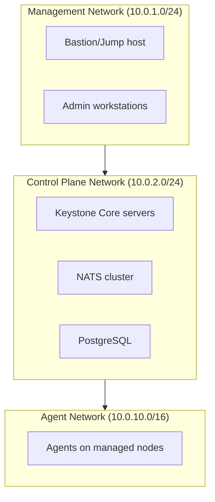

## Overview

Security is critical for production Keystone Core deployments. This guide covers authentication methods, TLS configuration, RBAC policies, security hardening, and audit logging.

**Security Layers:**
- **Authentication**: Token-based and certificate-based auth
- **Encryption**: TLS for all communications (NATS, API, database)
- **Authorization**: RBAC with policy-based access control
- **Audit**: Comprehensive audit logging for compliance
- **Hardening**: OS and application-level security

## Authentication

Keystone Core supports multiple authentication methods.

### API Key Authentication

**Generate API Key:**
```bash
# Create API key
kscorectl api-key create --name "monitoring-system" --role "read-only"

# Output:
# Key ID: ak_1234567890
# Secret: sk_abcdef1234567890 (save this - it won't be shown again)
```

**Use API Key:**
```bash
# With CLI
export KSCORE_API_KEY="sk_abcdef1234567890"
kscorectl agent list

# With HTTP API
curl -H "Authorization: Bearer sk_abcdef1234567890" \
  http://control-plane:8080/api/v1/agents
```

**Rotate API Keys:**
```bash
# List keys
kscorectl api-key list

# Revoke old key
kscorectl api-key revoke ak_1234567890

# Create new key
kscorectl api-key create --name "monitoring-system" --role "read-only"
```

### Token-Based Authentication (JWT)

Keystone Core supports JWT (JSON Web Token) authentication with multiple signing algorithms.

**Supported Algorithms:**
| Algorithm | Type | Key Size | Use Case |
|-----------|------|----------|----------|
| HS256/384/512 | HMAC | 256+ bits | Shared secret, simple deployments |
| RS256/384/512 | RSA | 2048+ bits | Public/private key, distributed systems |
| ES256/384/512 | ECDSA | P-256/384/521 | Compact tokens, mobile clients |

**HMAC Configuration (Symmetric Key):**
```yaml
# server.yaml
auth:
  type: jwt
  jwt:
    secret: "$JWT_SECRET"        # 256-bit minimum (32+ characters)
    issuer: "kscore"             # Token issuer (validated if set)
    audience: "kscore-api"       # Token audience (validated if set)
    role_claim: "role"           # Claim containing user role
```

**RSA/ECDSA Configuration (Asymmetric Key):**
```yaml
# server.yaml
auth:
  type: jwt
  jwt:
    public_key_file: /etc/kscore/jwt-public.pem  # RSA or ECDSA public key
    issuer: "https://auth.example.com"
    audience: "kscore-api"
    role_claim: "role"
```

**JWT Claims Structure:**
```json
{
  "sub": "user-123",           // Subject (user ID)
  "name": "Alice Admin",       // Display name (optional)
  "email": "alice@example.com",// Email (optional)
  "role": "admin",             // Role: admin, operator, readonly
  "iss": "kscore",             // Issuer
  "aud": "kscore-api",         // Audience
  "exp": 1705401600,           // Expiration time
  "iat": 1705315200,           // Issued at
  "jti": "unique-token-id"     // JWT ID (optional)
}
```

**Generate Token:**
```bash
# Create user token
kscorectl auth login --username admin --password $ADMIN_PASSWORD

# Token stored in ~/.kscore/token
```

**Token Refresh:**
```bash
# Tokens auto-refresh when within 1 hour of expiry
# Manual refresh:
kscorectl auth refresh
```

**Using JWT with External Identity Providers:**
```yaml
# Integration with Auth0, Okta, Keycloak, etc.
auth:
  type: jwt
  jwt:
    public_key_file: /etc/kscore/idp-public.pem  # From your IdP
    issuer: "https://your-tenant.auth0.com/"
    audience: "kscore-api"
    role_claim: "https://kscore.io/role"  # Custom claim namespace
```

### Certificate-Based Authentication (mTLS)

**Recommended for production** - Strongest authentication method with certificate-based identity.

Keystone Core's mTLS authenticator extracts identity from client certificates and maps certificate attributes to roles using flexible pattern matching.

**Identity Extraction (in priority order):**
1. Common Name (CN) from certificate subject
2. DNS Subject Alternative Names (SANs)
3. Email Subject Alternative Names
4. URI Subject Alternative Names (including SPIFFE IDs)

**Generate Certificates:**
```bash
# Create CA
openssl genrsa -out ca-key.pem 4096
openssl req -new -x509 -days 365 -key ca-key.pem -out ca.pem \
  -subj "/CN=Keystone Core CA"

# Create server certificate
openssl genrsa -out server-key.pem 4096
openssl req -new -key server-key.pem -out server.csr \
  -subj "/CN=kscore-server"
openssl x509 -req -days 365 -in server.csr -CA ca.pem -CAkey ca-key.pem \
  -CAcreateserial -out server-cert.pem

# Create admin client certificate
openssl genrsa -out admin-key.pem 4096
openssl req -new -key admin-key.pem -out admin.csr \
  -subj "/CN=admin.kscore.example.com"
openssl x509 -req -days 365 -in admin.csr -CA ca.pem -CAkey ca-key.pem \
  -CAcreateserial -out admin-cert.pem

# Create operator client certificate
openssl genrsa -out operator-key.pem 4096
openssl req -new -key operator-key.pem -out operator.csr \
  -subj "/CN=operator.ops.example.com"
openssl x509 -req -days 365 -in operator.csr -CA ca.pem -CAkey ca-key.pem \
  -CAcreateserial -out operator-cert.pem
```

**Server Configuration with Role Mapping:**
```yaml
# server.yaml
auth:
  type: mtls
  mtls:
    require_client_cert: true
    cert_roles:
      # Exact matches
      "admin.kscore.example.com": admin

      # Wildcard patterns (* matches one level, no dots)
      "*.admin.example.com": admin
      "*.ops.example.com": operator

      # Double wildcard (** matches anything including dots)
      "**.readonly.example.com": readonly

      # Email SANs
      "admin@example.com": admin
      "*@ops.example.com": operator

      # SPIFFE IDs (URI SANs)
      "spiffe://cluster.local/ns/admin/**": admin
      "spiffe://cluster.local/ns/ops/**": operator

      # Catch-all fallback (lowest priority)
      "**": readonly

api:
  tls:
    enabled: true
    cert_file: /etc/kscore/certs/server-cert.pem
    key_file: /etc/kscore/certs/server-key.pem
    ca_file: /etc/kscore/certs/ca.pem
    client_auth: require
```

**Pattern Matching Rules:**

| Pattern | Matches | Does Not Match |
|---------|---------|----------------|
| `*.example.com` | `api.example.com` | `api.sub.example.com` |
| `**.example.com` | `api.sub.example.com` | `other.com` |
| `svc-*.ops.example.com` | `svc-api.ops.example.com` | `api.ops.example.com` |
| `admin@*` | `admin@internal` | `admin@external.com` (has dot) |
| `admin@**` | `admin@external.com` | `user@external.com` |
| `spiffe://cluster.local/**` | Any SPIFFE ID in cluster | Other trust domains |

**Pattern Priority:**
Patterns are matched in specificity order (most specific first):
1. Exact matches (no wildcards)
2. Single wildcards (`*`)
3. Double wildcards (`**`)
4. Longer patterns before shorter

**Client Configuration:**
```yaml
# ~/.kscore/config.yaml
api:
  url: "https://control-plane:8080"
  tls:
    cert_file: ~/.kscore/certs/client-cert.pem
    key_file: ~/.kscore/certs/client-key.pem
    ca_file: ~/.kscore/certs/ca.pem
```

**Certificate Metadata:**
The authenticator extracts and logs certificate metadata for auditing:
- `cn`: Common Name
- `serial`: Certificate serial number
- `issuer`: Issuer CN
- `org`: Organization(s)
- `dns_names`: DNS SANs (comma-separated)
- `emails`: Email SANs (comma-separated)
- `not_before`, `not_after`: Validity period

**Multi-Method Authentication:**
Combine mTLS with other methods for defense in depth:
```yaml
auth:
  type: multi  # Try methods in order
  mtls:
    require_client_cert: false  # Optional client cert
    cert_roles:
      "*.admin.example.com": admin
  apikey:
    keys:
      - id: "backup-key"
        secret_hash: "$2a$..."
        role: operator
  jwt:
    secret: "$JWT_SECRET"
```

### NATS Authentication

**Credentials File (Recommended):**
```bash
# Create NATS credentials
nats-server --genkey --user keystonecore > /etc/nats/kscore.creds
```

**NATS Configuration:**
```conf
# nats-server.conf
accounts {
  KSCORE: {
    users: [
      {
        user: "kscore"
        password: "$2a$11$..." # bcrypt hash
      }
    ]
  }
}
```

**Agent Configuration:**
```yaml
# agent.yaml
nats:
  url: "nats://nats-server:4222"
  credentials:
    file: /etc/kscore/nats.creds
```

## TLS Configuration

Encrypt all communications in production.

### Control Plane TLS

**Server Configuration:**
```yaml
# server.yaml
api:
  listen: "0.0.0.0:8443"  # HTTPS port
  tls:
    enabled: true
    cert_file: /etc/kscore/certs/server.crt
    key_file: /etc/kscore/certs/server.key
    min_version: "TLS1.2"
    cipher_suites:
      - TLS_ECDHE_RSA_WITH_AES_256_GCM_SHA384
      - TLS_ECDHE_RSA_WITH_AES_128_GCM_SHA256
      - TLS_ECDHE_ECDSA_WITH_AES_256_GCM_SHA384
```

**Let's Encrypt Certificates:**
```bash
# Install certbot
sudo apt-get install certbot

# Get certificate
sudo certbot certonly --standalone -d kscore.example.com

# Certificates in /etc/letsencrypt/live/kscore.example.com/
# - fullchain.pem (cert + chain)
# - privkey.pem (private key)

# Auto-renewal
sudo crontab -e
0 0 * * * certbot renew --quiet --post-hook "systemctl reload kscore-server"
```

### NATS TLS

**NATS Server Configuration:**
```conf
# nats-server.conf
tls {
  cert_file: "/etc/nats/certs/server.crt"
  key_file: "/etc/nats/certs/server.key"
  ca_file: "/etc/nats/certs/ca.crt"
  verify: true
  timeout: 5
}
```

**Agent Configuration:**
```yaml
# agent.yaml
nats:
  url: "tls://nats-server:4222"
  tls:
    ca_file: /etc/kscore/certs/nats-ca.crt
    cert_file: /etc/kscore/certs/agent-cert.crt
    key_file: /etc/kscore/certs/agent-key.key
    verify_server: true
```

### PostgreSQL TLS

**PostgreSQL Configuration:**
```ini
# postgresql.conf
ssl = on
ssl_cert_file = '/etc/postgresql/certs/server.crt'
ssl_key_file = '/etc/postgresql/certs/server.key'
ssl_ca_file = '/etc/postgresql/certs/ca.crt'
ssl_min_protocol_version = 'TLSv1.2'
```

**pg_hba.conf:**
```
# Require SSL for all connections
hostssl    kscore      kscore      10.0.0.0/8              md5
```

**Client Configuration:**
```yaml
# server.yaml
storage:
  postgresql:
    host: "postgres-server"
    sslmode: "require"  # or "verify-ca" or "verify-full"
    sslcert: "/etc/kscore/certs/client.crt"
    sslkey: "/etc/kscore/certs/client.key"
    sslrootcert: "/etc/kscore/certs/ca.crt"
```

## RBAC (Role-Based Access Control)

Define fine-grained access control policies.

### Built-in Roles

**admin:**
- Full system access
- Create/modify policies
- Manage users and roles
- Execute any command

**operator:**
- Deploy applications
- Execute commands
- Apply state configurations
- View all resources

**read-only:**
- View agents and resources
- Query metrics and logs
- No write permissions

**agent:**
- Agent registration only
- Heartbeat and telemetry
- No user-facing permissions

### Custom Roles

**Define Custom Role:**
```yaml
# roles.yaml
- name: deployment-manager
  description: "Can deploy applications but not manage infrastructure"
  permissions:
    - resource: "state/*"
      actions: ["apply", "check"]
    - resource: "job/*"
      actions: ["create", "read", "cancel"]
    - resource: "agent/*"
      actions: ["read"]
    - resource: "event/*"
      actions: ["read"]
```

**Assign Role to User:**
```bash
kscorectl rbac assign --user alice --role deployment-manager
```

### Policy-Based Access Control

**OPA Policy Example:**
```rego
# rbac.rego
package kscore.rbac

import data.users
import data.roles

# Allow admins everything
allow {
    input.user.role == "admin"
}

# Allow operators to execute commands
allow {
    input.user.role == "operator"
    input.action == "exec.run"
}

# Restrict state apply to specific datacenters
allow {
    input.user.role == "deployment-manager"
    input.action == "state.apply"
    input.resource.datacenter == input.user.datacenter
}

# Deny destructive operations in production
deny {
    input.resource.environment == "production"
    input.action in ["agent.delete", "state.delete"]
    not input.user.role == "admin"
}
```

**Apply Policy:**
```bash
kscorectl policy create rbac --file rbac.rego --enforce
```

### Audit RBAC Changes

```bash
# List all roles
kscorectl rbac list-roles

# List role assignments
kscorectl rbac list-assignments

# View audit log
kscorectl policy audit --category rbac --since 24h
```

## Security Hardening

### Operating System Hardening

**Firewall Configuration:**
```bash
# Allow only necessary ports
sudo ufw default deny incoming
sudo ufw default allow outgoing

# Control plane
sudo ufw allow 8080/tcp  # API (or 8443 for HTTPS)

# NATS
sudo ufw allow from 10.0.0.0/8 to any port 4222 proto tcp

# PostgreSQL
sudo ufw allow from 10.0.0.0/8 to any port 5432 proto tcp

# SSH (restrict to management network)
sudo ufw allow from 10.0.1.0/24 to any port 22 proto tcp

sudo ufw enable
```

**Disable Unnecessary Services:**
```bash
# List running services
systemctl list-units --type=service --state=running

# Disable unneeded services
sudo systemctl disable bluetooth
sudo systemctl disable cups
```

**File System Permissions:**
```bash
# Restrict config files
sudo chmod 600 /etc/kscore/server.yaml
sudo chown kscore:kscore /etc/kscore/server.yaml

# Restrict private keys
sudo chmod 400 /etc/kscore/certs/*.key
sudo chown kscore:kscore /etc/kscore/certs/*.key

# Restrict database files
sudo chmod 700 /var/lib/kscore
sudo chown kscore:kscore /var/lib/kscore
```

**SELinux/AppArmor:**
```bash
# Enable SELinux
sudo setenforce 1

# Create custom SELinux policy for Keystone Core
# (beyond scope - consult SELinux documentation)
```

### Application Hardening

**Principle of Least Privilege:**
```bash
# Run as non-root user
sudo useradd --system --no-create-home --shell /usr/sbin/nologin kscore

# Systemd service restrictions
[Service]
User=kscore
Group=kscore
NoNewPrivileges=true
PrivateTmp=true
ProtectSystem=strict
ProtectHome=true
ReadWritePaths=/var/lib/kscore
```

**Rate Limiting:**
```yaml
# server.yaml
api:
  rate_limiting:
    enabled: true
    requests_per_minute: 100
    burst: 20
```

**Input Validation:**
- All API inputs validated
- YAML parsing with size limits
- Command injection prevention
- SQL injection prevention (parameterized queries)

**Secrets Management:**
```yaml
# Use external secrets manager
secrets:
  backend: vault
  vault:
    address: https://vault.example.com
    token_file: /etc/kscore/vault-token

# Never store secrets in config files
database:
  password: "{{ vault.secret('database/postgres/password') }}"
```

### Network Segmentation

**Recommended Network Layout:**



**Firewall Rules:**
- Management → Control Plane: SSH, API (8080/8443)
- Control Plane → Control Plane: NATS (4222, 6222), PostgreSQL (5432)
- Agents → Control Plane: NATS (4222) only
- Control Plane → Agents: Blocked (agents initiate connections)

## Audit Logging

Track all security-relevant events.

### Enable Audit Logging

**Configuration:**
```yaml
# server.yaml
audit:
  enabled: true
  log_file: /var/log/kscore/audit.log
  log_level: info
  events:
    - authentication
    - authorization
    - state.apply
    - policy.evaluation
    - user.create
    - user.delete
    - role.assign
```

### Audit Log Format

```json
{
  "timestamp": "2024-01-15T10:30:45Z",
  "event_type": "state.apply",
  "user": "alice",
  "source_ip": "10.0.1.50",
  "action": "apply",
  "resource": "web-server.yaml",
  "target": "role:web",
  "result": "success",
  "correlation_id": "abc-123"
}
```

### Query Audit Logs

**With jq:**
```bash
# All failed operations
cat /var/log/kscore/audit.log | jq 'select(.result == "failed")'

# All actions by user
cat /var/log/kscore/audit.log | jq 'select(.user == "alice")'

# State applications in last hour
cat /var/log/kscore/audit.log | \
  jq 'select(.event_type == "state.apply" and .timestamp > "2024-01-15T09:00:00Z")'
```

**With Elasticsearch:**
```json
{
  "query": {
    "bool": {
      "must": [
        { "match": { "event_type": "state.apply" }},
        { "range": { "timestamp": { "gte": "now-24h" }}}
      ]
    }
  }
}
```

### Audit Log Retention

```yaml
# server.yaml
audit:
  retention:
    max_age: "365d"  # Compliance requirement: 1 year
    max_size: "10GB"
```

**Off-site Archival:**
```bash
# Daily export to S3
aws s3 cp /var/log/kscore/audit.log \
  s3://compliance-logs/kscore/audit-$(date +%Y-%m-%d).log

# Compress and encrypt
gpg --encrypt --recipient compliance@example.com audit.log
aws s3 cp audit.log.gpg s3://compliance-logs/kscore/
```

## Compliance

### SOC 2 Compliance

**Access Control:**
- [x] Role-based access control implemented
- [x] Audit logging of all access
- [x] MFA for administrative access
- [x] Regular access reviews

**Data Security:**
- [x] Encryption in transit (TLS)
- [x] Encryption at rest (database)
- [x] Secrets management (Vault)
- [x] Data retention policies

**Change Management:**
- [x] All changes tracked in audit log
- [x] State configurations version controlled
- [x] Approval workflow for production changes

### HIPAA Compliance

**Required:**
- Encryption: TLS 1.2+ for all communications
- Access Controls: RBAC with audit logging
- Audit Trails: 6-year retention minimum
- Backup/Recovery: Daily backups, quarterly DR tests

**Configuration:**
```yaml
# server.yaml - HIPAA compliance settings
audit:
  enabled: true
  retention:
    max_age: "2190d"  # 6 years

api:
  tls:
    min_version: "TLS1.2"

storage:
  encryption:
    enabled: true
    algorithm: "AES-256-GCM"
```

### GDPR Compliance

**Data Subject Rights:**
```bash
# Right to access
kscorectl audit query --user alice --output json > alice-data.json

# Right to erasure ("right to be forgotten")
kscorectl user delete alice --purge-data

# Data portability
kscorectl export --user alice --format json
```

**Data Retention:**
```yaml
# server.yaml
data_retention:
  events: "30d"  # Minimize retention
  audit_logs: "365d"  # Compliance requirement
  metrics: "90d"
```

## Secret Management

### HashiCorp Vault Integration

**Configuration:**
```yaml
# server.yaml
secrets:
  backend: vault
  vault:
    address: "https://vault.example.com:8200"
    auth_method: "approle"
    role_id: "$VAULT_ROLE_ID"
    secret_id: "$VAULT_SECRET_ID"
    paths:
      database: "secret/data/kscore/database"
      nats: "secret/data/kscore/nats"
```

**Store Secrets:**
```bash
# Database password
vault kv put secret/kscore/database password="secure-db-password"

# NATS credentials
vault kv put secret/kscore/nats username="kscore" password="secure-nats-password"

# API keys
vault kv put secret/kscore/api-keys monitoring="sk_monitoring_key"
```

**Rotate Secrets:**
```bash
# Update secret in Vault
vault kv put secret/kscore/database password="new-secure-password"

# Keystone Core auto-reloads secrets every 5 minutes
# Or trigger immediate reload
kscorectl secrets reload
```

### Kubernetes Secrets

```yaml
apiVersion: v1
kind: Secret
metadata:
  name: kscore-secrets
  namespace: kscore
type: Opaque
data:
  postgres-password: <base64-encoded>
  nats-password: <base64-encoded>
  api-key: <base64-encoded>
```

```yaml
# Use in deployment
spec:
  containers:
  - name: kscore-server
    env:
    - name: KSCORE_POSTGRES_PASSWORD
      valueFrom:
        secretKeyRef:
          name: kscore-secrets
          key: postgres-password
```

## Module Security

Keystone Core's module system uses capability-based security to ensure modules cannot access system resources without explicit authorization.

### Capability-Based Access Control

Modules operate under a **no ambient authority** model:

- **No default permissions**: Modules cannot access files, network, or execute commands by default
- **Explicit capability grants**: Each capability must be declared in the module manifest
- **Operator override**: Operators can restrict capabilities beyond what modules declare
- **Capability locking**: Lock module capabilities to prevent escalation on updates

### Sandboxed Execution

Modules run in isolated execution environments:

| Runtime | Isolation Mechanism | Resource Limits |
|---------|---------------------|-----------------|
| Starlark | Deterministic execution, no I/O by default | Step limit, timeout |
| WASM | Memory isolation, no syscalls | Memory limit, fuel metering |

### Deploying Capability Policy

Create a capability policy to restrict module permissions:

```yaml
# /etc/kscore/capability-policy.yaml
schema_version: 1

defaults:
  trust: none
  denied_capabilities:
    - exec           # Deny command execution by default
    - secrets.write  # Deny secret modification

  capabilities:
    fs.write:
      denied_paths:
        - /etc/**
        - /root/**
        - /usr/**
        - /bin/**

modules:
  # Trust internal modules
  internal/approved-deployer:
    trust: full

  # Heavily restrict third-party modules
  community/external-reporter:
    trust: none
    denied_capabilities:
      - exec
      - fs.write
      - secrets.*
    capabilities:
      http.get:
        allowed_domains:
          - api.approved-service.com
        rate_limit: 10
```

### Locking Module Capabilities

Prevent capability escalation across module updates:

```bash
# Lock a module's capabilities
kscorectl module lock my-org/production-module \
  --reason "Production deployment - capabilities frozen"

# View lock status
kscorectl module lock show my-org/production-module

# Unlock (requires admin role)
kscorectl module unlock my-org/production-module
```

When a locked module is updated:
- New capabilities are **blocked**
- Removed capabilities are **allowed**
- More restrictive configurations are **allowed**

### Module Security Audit

```bash
# List all modules and their capabilities
kscorectl module list --show-capabilities

# Show capability policy evaluation for a module
kscorectl module capabilities show my-org/web-deployer

# Export capability grants for compliance review
kscorectl module capabilities export --format csv > capabilities-report.csv
```

### Module Security Checklist

- [ ] Capability policy deployed (`/etc/kscore/capability-policy.yaml`)
- [ ] `exec` capability denied by default
- [ ] Third-party modules have explicit policy entries
- [ ] Production modules are capability-locked
- [ ] Allowed paths/domains scoped to necessary resources
- [ ] Rate limits configured for HTTP capabilities

For complete module security documentation, see [Module System & Security](/docs/concepts/modules/).

## Security Checklist

### Pre-Production

- [ ] TLS enabled for all connections (API, NATS, database)
- [ ] Certificate-based authentication configured
- [ ] RBAC policies defined and tested
- [ ] Firewall rules restrict access to necessary ports only
- [ ] Secrets stored in external secrets manager (Vault)
- [ ] Audit logging enabled with off-site archival
- [ ] File permissions restricted (600 for configs, 400 for keys)
- [ ] Services run as non-root user
- [ ] SELinux/AppArmor policies applied
- [ ] Vulnerability scanning completed (container images, OS packages)
- [ ] Penetration testing performed
- [ ] Disaster recovery plan tested

### Ongoing Operations

- [ ] Regular security updates applied (monthly)
- [ ] Access reviews conducted (quarterly)
- [ ] Audit logs reviewed (weekly)
- [ ] Secrets rotated (quarterly)
- [ ] Backup verification (weekly)
- [ ] Vulnerability scans (monthly)
- [ ] Security training for team (annually)

### Incident Response

1. **Detect**: Monitor audit logs and alerts
2. **Contain**: Isolate affected systems
3. **Eradicate**: Remove threat and patch vulnerability
4. **Recover**: Restore from backups if needed
5. **Review**: Post-incident review and remediation

**Incident Response Plan:**
```bash
# 1. Isolate compromised node
kscorectl agent quarantine web-05

# 2. Collect forensic data
kscorectl exec run "tar -czf /tmp/forensics.tar.gz /var/log /etc" --target "web-05"

# 3. Revoke credentials
kscorectl api-key revoke-all --user compromised-user

# 4. Force password reset
kscorectl user reset-password --all

# 5. Review audit logs
kscorectl audit query --since "incident-start-time" --severity critical
```

## Security Tools

**Vulnerability Scanning:**
```bash
# Scan Docker images
trivy image kscore/server:latest

# Scan OS packages
lynis audit system

# Scan network services
nmap -sV control-plane
```

**Intrusion Detection:**
```bash
# Install OSSEC
sudo apt-get install ossec-hids

# Monitor logs for suspicious activity
tail -f /var/ossec/logs/alerts/alerts.log
```

**Secrets Detection:**
```bash
# Scan git repo for accidentally committed secrets
trufflehog filesystem /etc/kscore
```

## See Also

- [Deployment Guide](deployment/) - Secure deployment patterns
- [Monitoring Guide](monitoring/) - Security monitoring
- [Maintenance Guide](maintenance/) - Secure backup procedures
- [Troubleshooting Guide](troubleshooting/) - Security issue resolution
- [Policy Concepts](/docs/concepts/policy/) - Policy enforcement
