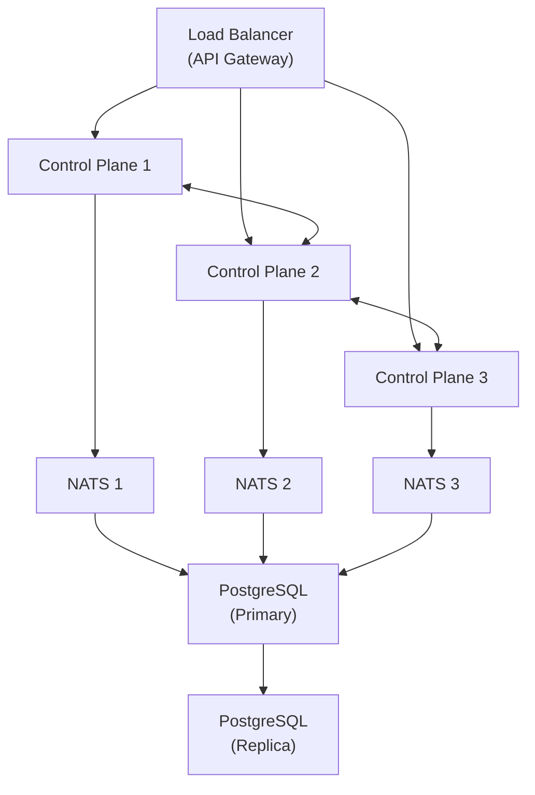
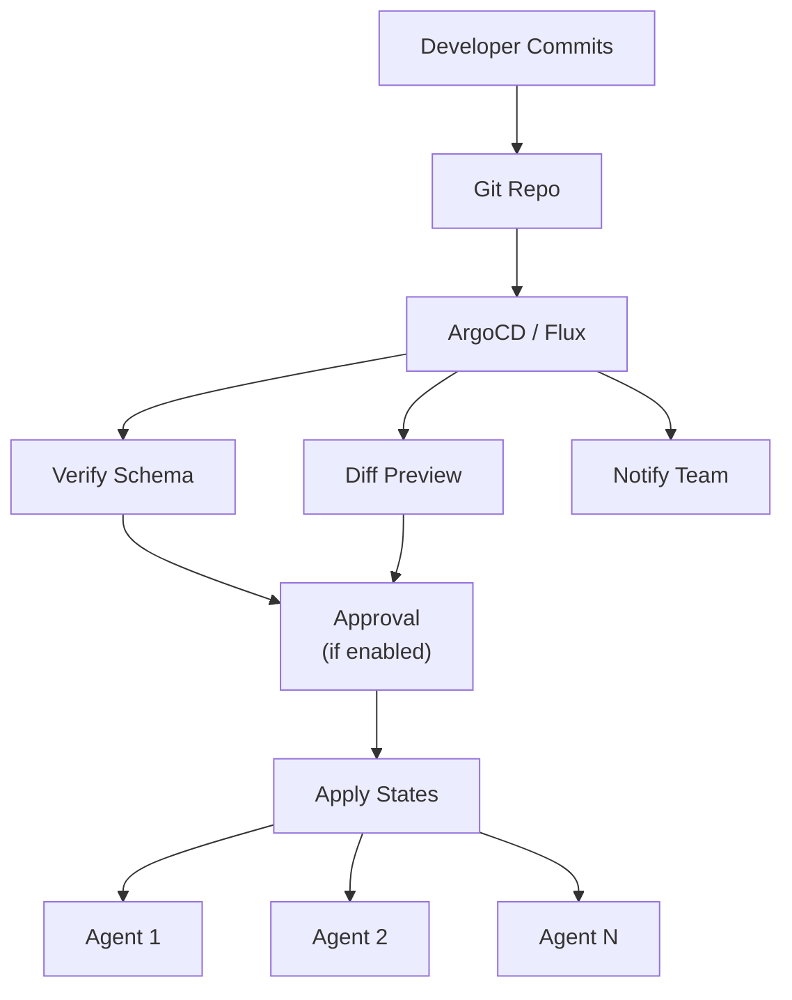

## Official Catalog

All official blueprints follow the `kscore/<name>` naming convention and are located under
`examples/blueprints/kscore/` for now. Each blueprint includes a manifest, states, README, and
optionally tests.

---

## Core Deployments

### kscore/demo

Single-node demo deployment with embedded NATS + SQLite for evaluation and development.

**Use Case:** Quick evaluation, development environments, CI/CD testing.

**Parameters:**

| Parameter | Type | Default | Description |
|-----------|------|---------|-------------|
| `admin_password` | string | (required) | Admin user password |
| `api_port` | integer | 8080 | API server port |
| `metrics_port` | integer | 9090 | Metrics endpoint port |
| `data_dir` | string | /var/lib/kscore | Data directory |
| `log_level` | string | info | Log level (debug, info, warn, error) |

**Features:**

| Feature | Default | Description |
|---------|---------|-------------|
| `sample_agents` | true | Deploy sample agent configurations |
| `sample_states` | true | Deploy sample state files |
| `web_ui` | false | Enable web UI (experimental) |

**Usage:**

```yaml
include:
  - blueprint: kscore/demo@1.0.0
    parameters:
      admin_password: !secret kscore/admin
      api_port: 8080
      log_level: debug
    features:
      sample_agents: true
      sample_states: true
```

**Quick Start:**

```bash
# Bootstrap demo environment
kscore-agent bootstrap \
  --apply-blueprint kscore/demo \
  --param admin_password=demo-password \
  --param log_level=debug
```

---

### kscore/production-cluster

HA control plane deployment with external PostgreSQL and NATS cluster.

**Use Case:** Production deployments with high availability requirements.

**Parameters:**

| Parameter | Type | Default | Description |
|-----------|------|---------|-------------|
| `cluster_name` | string | (required) | Cluster identifier |
| `node_count` | integer | 3 | Number of control plane nodes |
| `postgres_host` | string | (required) | PostgreSQL host |
| `postgres_port` | integer | 5432 | PostgreSQL port |
| `postgres_database` | string | kscore | Database name |
| `postgres_user` | string | kscore | Database user |
| `postgres_password` | string | (required) | Database password (sensitive) |
| `postgres_sslmode` | string | require | SSL mode (disable, require, verify-full) |
| `nats_urls` | array | (required) | NATS server URLs |
| `nats_creds_file` | string | | NATS credentials file path |
| `api_port` | integer | 8080 | API server port |
| `grpc_port` | integer | 9090 | gRPC port |
| `tls_mode` | string | auto | TLS mode (auto, manual, disabled) |
| `tls_cert` | string | | TLS certificate (for manual mode) |
| `tls_key` | string | | TLS private key (for manual mode) |
| `ca_cert` | string | | CA certificate for client verification |

**Features:**

| Feature | Default | Description |
|---------|---------|-------------|
| `etcd_clustering` | true | Enable etcd-based leader election |
| `auto_scaling` | false | Enable auto-scaling integration |
| `backup` | true | Enable automated backups |
| `monitoring` | true | Enable Prometheus metrics |

**Usage:**

```yaml
include:
  - blueprint: kscore/production-cluster@2.0.0
    parameters:
      cluster_name: prod-us-east
      node_count: 5
      postgres_host: postgres.internal
      postgres_database: kscore_prod
      postgres_user: kscore
      postgres_password: !secret databases/postgres/kscore
      postgres_sslmode: verify-full
      nats_urls:
        - nats://nats-1.internal:4222
        - nats://nats-2.internal:4222
        - nats://nats-3.internal:4222
      nats_creds_file: /etc/kscore/nats.creds
      tls_mode: auto
    features:
      etcd_clustering: true
      backup: true
      monitoring: true
```

**Architecture:**



---

### kscore/enterprise-platform

Multi-region enterprise deployment with federation, integrations, and advanced features.

**Use Case:** Large enterprises with multiple datacenters/regions.

**Parameters:**

| Parameter | Type | Default | Description |
|-----------|------|---------|-------------|
| `cluster_name` | string | (required) | Primary cluster name |
| `regions` | array | (required) | List of region configurations |
| `federation_enabled` | boolean | true | Enable cross-region federation |
| `global_postgres_host` | string | | Global PostgreSQL for metadata |
| `identity_provider` | string | spiffe | Identity provider (spiffe, oidc) |
| `oidc_issuer` | string | | OIDC issuer URL |
| `oidc_client_id` | string | | OIDC client ID |
| `oidc_client_secret` | string | | OIDC client secret (sensitive) |
| `gitops_enabled` | boolean | true | Enable GitOps integration |
| `gitops_repo` | string | | GitOps repository URL |
| `gitops_branch` | string | main | GitOps branch |

**Features:**

| Feature | Default | Description |
|---------|---------|-------------|
| `multi_region` | true | Multi-region deployment |
| `disaster_recovery` | true | DR configuration |
| `compliance_reporting` | false | Compliance report generation |
| `advanced_rbac` | true | Advanced RBAC policies |
| `audit_logging` | true | Comprehensive audit logging |

**Usage:**

```yaml
include:
  - blueprint: kscore/enterprise-platform@3.0.0
    parameters:
      cluster_name: global-platform
      regions:
        - name: us-east
          primary: true
          postgres_host: postgres-us-east.internal
          nats_urls:
            - nats://nats-us-east-1:4222
            - nats://nats-us-east-2:4222
        - name: us-west
          primary: false
          postgres_host: postgres-us-west.internal
          nats_urls:
            - nats://nats-us-west-1:4222
            - nats://nats-us-west-2:4222
        - name: eu-central
          primary: false
          postgres_host: postgres-eu-central.internal
          nats_urls:
            - nats://nats-eu-1:4222
      federation_enabled: true
      identity_provider: oidc
      oidc_issuer: https://auth.example.com
      oidc_client_id: kscore-platform
      oidc_client_secret: !secret auth/oidc/client_secret
      gitops_enabled: true
      gitops_repo: https://github.com/myorg/kscore-config
    features:
      disaster_recovery: true
      compliance_reporting: true
      advanced_rbac: true
```

---

## Infrastructure Blueprints

### kscore/nats-cluster

Standalone NATS cluster with JetStream for message streaming.

**Use Case:** Deploying NATS infrastructure separately from control plane.

**Parameters:**

| Parameter | Type | Default | Description |
|-----------|------|---------|-------------|
| `cluster_name` | string | kscore | NATS cluster name |
| `node_count` | integer | 3 | Number of NATS nodes |
| `listen_port` | integer | 4222 | Client listen port |
| `cluster_port` | integer | 6222 | Cluster communication port |
| `http_port` | integer | 8222 | HTTP monitoring port |
| `jetstream_enabled` | boolean | true | Enable JetStream |
| `jetstream_store_dir` | string | /var/lib/nats/jetstream | JetStream storage directory |
| `jetstream_max_memory` | string | 1GB | JetStream max memory |
| `jetstream_max_file` | string | 10GB | JetStream max file storage |
| `tls_enabled` | boolean | true | Enable TLS |
| `tls_cert` | string | | TLS certificate |
| `tls_key` | string | | TLS private key (sensitive) |
| `auth_enabled` | boolean | true | Enable authentication |
| `auth_users` | array | | List of user configurations |

**Features:**

| Feature | Default | Description |
|---------|---------|-------------|
| `jetstream` | true | JetStream message streaming |
| `leafnodes` | false | Leaf node support |
| `websocket` | false | WebSocket support |
| `mqtt` | false | MQTT protocol support |

**Usage:**

```yaml
include:
  - blueprint: kscore/nats-cluster@1.2.0
    parameters:
      cluster_name: kscore-messaging
      node_count: 3
      jetstream_enabled: true
      jetstream_max_memory: 2GB
      jetstream_max_file: 50GB
      tls_enabled: true
      tls_cert: !secret nats/tls/cert
      tls_key: !secret nats/tls/key
      auth_enabled: true
      auth_users:
        - username: kscore
          password: !secret nats/users/kscore
          permissions:
            publish: ["kscore.>"]
            subscribe: ["kscore.>", "_INBOX.>"]
        - username: agent
          password: !secret nats/users/agent
          permissions:
            publish: ["kscore.agent.>", "_INBOX.>"]
            subscribe: ["kscore.command.>", "_INBOX.>"]
    features:
      jetstream: true
      websocket: true
```

**JetStream Streams Created:**

| Stream | Description | Retention |
|--------|-------------|-----------|
| `KSCORE_COMMANDS` | Agent command queue | WorkQueue |
| `KSCORE_EVENTS` | Event stream | Limits (7 days) |
| `KSCORE_STATE` | State sync | Limits (24 hours) |
| `KSCORE_AUDIT` | Audit log | Limits (90 days) |

---

### kscore/postgres-ha

PostgreSQL HA cluster with streaming replication.

**Use Case:** Production database for Keystone Core control plane.

**Parameters:**

| Parameter | Type | Default | Description |
|-----------|------|---------|-------------|
| `cluster_name` | string | kscore-db | Cluster name |
| `postgres_version` | string | 15 | PostgreSQL major version |
| `primary_host` | string | (required) | Primary node hostname |
| `replica_hosts` | array | [] | Replica node hostnames |
| `database_name` | string | kscore | Database name |
| `database_user` | string | kscore | Database user |
| `database_password` | string | (required) | Database password (sensitive) |
| `replication_user` | string | replicator | Replication user |
| `replication_password` | string | (required) | Replication password (sensitive) |
| `max_connections` | integer | 200 | Maximum connections |
| `shared_buffers` | string | 256MB | Shared buffer size |
| `ssl_enabled` | boolean | true | Enable SSL |
| `ssl_cert` | string | | SSL certificate |
| `ssl_key` | string | | SSL private key (sensitive) |
| `backup_enabled` | boolean | true | Enable automated backups |
| `backup_schedule` | string | 0 2 * * * | Backup cron schedule |
| `backup_retention_days` | integer | 30 | Backup retention |
| `backup_destination` | string | | S3 bucket or path for backups |

**Features:**

| Feature | Default | Description |
|---------|---------|-------------|
| `streaming_replication` | true | Enable streaming replication |
| `synchronous_commit` | false | Synchronous replication |
| `connection_pooling` | true | PgBouncer connection pooling |
| `monitoring` | true | PostgreSQL exporter |
| `wal_archiving` | true | WAL archiving for PITR |

**Usage:**

```yaml
include:
  - blueprint: kscore/postgres-ha@2.0.0
    parameters:
      cluster_name: kscore-prod-db
      postgres_version: "15"
      primary_host: postgres-primary.internal
      replica_hosts:
        - postgres-replica-1.internal
        - postgres-replica-2.internal
      database_name: kscore
      database_user: kscore
      database_password: !secret databases/postgres/kscore
      replication_user: replicator
      replication_password: !secret databases/postgres/replicator
      max_connections: 500
      shared_buffers: 4GB
      ssl_enabled: true
      backup_enabled: true
      backup_schedule: "0 */6 * * *"
      backup_destination: s3://my-backups/postgres
    features:
      streaming_replication: true
      synchronous_commit: true
      connection_pooling: true
      monitoring: true
```

**Database Objects Created:**

- Database: `kscore` (or custom name)
- Roles: `kscore` (application), `replicator` (replication), `kscore_readonly` (read-only)
- Extensions: `pg_stat_statements`, `uuid-ossp`, `pgcrypto`

---

## Observability Blueprints

### kscore/monitoring-stack

Complete monitoring stack with Prometheus, Grafana, Alertmanager, and exporters.

**Use Case:** Full observability for Keystone Core and infrastructure.

**Parameters:**

| Parameter | Type | Default | Description |
|-----------|------|---------|-------------|
| `prometheus_retention` | string | 15d | Prometheus data retention |
| `prometheus_storage_size` | string | 50GB | Prometheus storage size |
| `grafana_admin_password` | string | (required) | Grafana admin password (sensitive) |
| `grafana_domain` | string | | Grafana domain (for external access) |
| `alertmanager_config` | object | | Alertmanager configuration |
| `slack_webhook_url` | string | | Slack webhook for alerts |
| `pagerduty_key` | string | | PagerDuty integration key |
| `email_smtp_host` | string | | SMTP host for email alerts |
| `scrape_interval` | string | 30s | Default scrape interval |
| `evaluation_interval` | string | 30s | Rule evaluation interval |

**Features:**

| Feature | Default | Description |
|---------|---------|-------------|
| `grafana` | true | Grafana dashboards |
| `alertmanager` | true | Alertmanager for alerts |
| `node_exporter` | true | Node metrics |
| `blackbox_exporter` | false | Endpoint probing |
| `pushgateway` | false | Push gateway for batch jobs |
| `loki` | false | Log aggregation |
| `tempo` | false | Distributed tracing |

**Usage:**

```yaml
include:
  - blueprint: kscore/monitoring-stack@2.0.0
    parameters:
      prometheus_retention: 30d
      prometheus_storage_size: 100GB
      grafana_admin_password: !secret monitoring/grafana/admin
      grafana_domain: grafana.example.com
      slack_webhook_url: !secret monitoring/slack/webhook
      scrape_interval: 15s
    features:
      grafana: true
      alertmanager: true
      node_exporter: true
      loki: true
```

**Pre-configured Dashboards:**

| Dashboard | Description |
|-----------|-------------|
| Keystone Core Overview | Control plane health and metrics |
| Agent Fleet | Agent status, connectivity, performance |
| State Management | State application metrics |
| NATS Cluster | NATS messaging metrics |
| PostgreSQL | Database performance |
| Node Resources | System resource utilization |

**Pre-configured Alert Rules:**

| Alert | Severity | Description |
|-------|----------|-------------|
| `KSCoreDown` | critical | Control plane unreachable |
| `AgentDisconnected` | warning | Agent disconnected > 5 minutes |
| `HighAPILatency` | warning | API P95 latency > 500ms |
| `DatabaseConnectionHigh` | warning | Database connections > 80% |
| `NATSBacklogHigh` | warning | NATS consumer backlog > 10000 |
| `DiskSpaceLow` | warning | Disk usage > 80% |
| `CertificateExpiring` | warning | Certificate expires < 14 days |

---

### kscore/metrics-only

Lightweight Prometheus-only setup for minimal monitoring.

**Use Case:** Resource-constrained environments or when Grafana is centralized.

**Parameters:**

| Parameter | Type | Default | Description |
|-----------|------|---------|-------------|
| `prometheus_port` | integer | 9090 | Prometheus port |
| `retention_time` | string | 7d | Data retention |
| `storage_size` | string | 10GB | Storage size |
| `remote_write_url` | string | | Remote write endpoint |
| `remote_write_username` | string | | Remote write username |
| `remote_write_password` | string | | Remote write password (sensitive) |
| `scrape_configs` | array | | Additional scrape configurations |

**Usage:**

```yaml
include:
  - blueprint: kscore/metrics-only@1.0.0
    parameters:
      retention_time: 3d
      storage_size: 5GB
      remote_write_url: https://prometheus.central.example.com/api/v1/write
      remote_write_username: edge-agent
      remote_write_password: !secret monitoring/remote_write
```

---

## Security & Identity Blueprints

### kscore/security-baseline

Host security hardening following CIS benchmarks.

**Use Case:** Hardening servers before deploying Keystone Core components.

**Parameters:**

| Parameter | Type | Default | Description |
|-----------|------|---------|-------------|
| `cis_level` | integer | 1 | CIS benchmark level (1 or 2) |
| `ssh_port` | integer | 22 | SSH port |
| `ssh_allow_password` | boolean | false | Allow SSH password auth |
| `ssh_allowed_users` | array | [] | Users allowed SSH access |
| `ssh_allowed_groups` | array | ["wheel", "sudo"] | Groups allowed SSH access |
| `firewall_default_policy` | string | deny | Default firewall policy |
| `allowed_tcp_ports` | array | [22] | Allowed TCP ports |
| `allowed_udp_ports` | array | [] | Allowed UDP ports |
| `audit_rules` | string | cis | Audit rule set (cis, stig, custom) |
| `password_max_age` | integer | 365 | Password max age (days) |
| `password_min_length` | integer | 14 | Minimum password length |

**Features:**

| Feature | Default | Description |
|---------|---------|-------------|
| `ssh_hardening` | true | SSH configuration hardening |
| `firewall` | true | Firewall configuration |
| `auditd` | true | Audit daemon configuration |
| `fail2ban` | true | Fail2ban for intrusion prevention |
| `auto_updates` | false | Automatic security updates |
| `aide` | false | AIDE file integrity monitoring |
| `apparmor` | true | AppArmor profiles (Debian/Ubuntu) |
| `selinux` | true | SELinux configuration (RHEL/CentOS) |

**Usage:**

```yaml
include:
  - blueprint: kscore/security-baseline@1.5.0
    parameters:
      cis_level: 2
      ssh_port: 2222
      ssh_allow_password: false
      ssh_allowed_users:
        - admin
        - deploy
      firewall_default_policy: deny
      allowed_tcp_ports:
        - 22
        - 80
        - 443
        - 8080
      password_max_age: 90
      password_min_length: 16
    features:
      ssh_hardening: true
      firewall: true
      auditd: true
      fail2ban: true
      auto_updates: true
      aide: true
```

**CIS Controls Applied (Level 1):**

| Section | Controls |
|---------|----------|
| 1.x | Filesystem Configuration |
| 2.x | Services |
| 3.x | Network Configuration |
| 4.x | Logging and Auditing |
| 5.x | Access, Authentication, Authorization |
| 6.x | System Maintenance |

---

### kscore/identity-federation

SPIFFE/SPIRE federation for multi-cluster trust.

**Use Case:** Establishing trust between multiple Keystone Core clusters.

**Parameters:**

| Parameter | Type | Default | Description |
|-----------|------|---------|-------------|
| `trust_domain` | string | (required) | Local SPIFFE trust domain |
| `federation_domains` | array | [] | Federated trust domains |
| `spire_server_port` | integer | 8081 | SPIRE server port |
| `spire_agent_socket` | string | /run/spire/sockets/agent.sock | SPIRE agent socket |
| `ca_ttl` | string | 24h | CA certificate TTL |
| `svid_ttl` | string | 1h | SVID TTL |
| `attestation_type` | string | k8s_psat | Attestation type |
| `oidc_discovery_enabled` | boolean | true | Enable OIDC discovery |

**Features:**

| Feature | Default | Description |
|---------|---------|-------------|
| `spire_server` | true | Deploy SPIRE server |
| `spire_agent` | true | Deploy SPIRE agent |
| `oidc_provider` | true | OIDC provider for workloads |
| `federation_bundle` | true | Federation bundle endpoints |

**Usage:**

```yaml
include:
  - blueprint: kscore/identity-federation@1.0.0
    parameters:
      trust_domain: cluster-a.example.com
      federation_domains:
        - trust_domain: cluster-b.example.com
          bundle_endpoint: https://cluster-b.example.com/.well-known/spiffe/bundle
        - trust_domain: cluster-c.example.com
          bundle_endpoint: https://cluster-c.example.com/.well-known/spiffe/bundle
      ca_ttl: 168h
      svid_ttl: 4h
      oidc_discovery_enabled: true
    features:
      spire_server: true
      spire_agent: true
      oidc_provider: true
```

---

## Integration Blueprints

### kscore/gitops-integration

GitOps workflow integration with ArgoCD or Flux.

**Use Case:** Managing Keystone Core configuration via Git.

**Parameters:**

| Parameter | Type | Default | Description |
|-----------|------|---------|-------------|
| `gitops_tool` | string | argocd | GitOps tool (argocd, flux) |
| `repo_url` | string | (required) | Git repository URL |
| `repo_branch` | string | main | Git branch |
| `repo_path` | string | / | Path within repository |
| `sync_interval` | string | 5m | Sync interval |
| `auto_sync` | boolean | true | Enable auto-sync |
| `prune` | boolean | true | Prune deleted resources |
| `self_heal` | boolean | true | Auto-heal drift |
| `webhook_enabled` | boolean | true | Enable webhook triggers |
| `webhook_secret` | string | | Webhook secret (sensitive) |
| `approval_required` | boolean | false | Require approval for changes |
| `approval_teams` | array | [] | Teams that can approve |

**Features:**

| Feature | Default | Description |
|---------|---------|-------------|
| `argocd` | true | ArgoCD integration |
| `flux` | false | Flux integration |
| `notifications` | true | Change notifications |
| `diff_preview` | true | Preview changes before apply |
| `rollback` | true | Automatic rollback on failure |

**Usage:**

```yaml
include:
  - blueprint: kscore/gitops-integration@1.2.0
    parameters:
      gitops_tool: argocd
      repo_url: https://github.com/myorg/kscore-config
      repo_branch: main
      repo_path: /environments/production
      sync_interval: 3m
      auto_sync: true
      self_heal: true
      webhook_enabled: true
      webhook_secret: !secret gitops/webhook
      approval_required: true
      approval_teams:
        - platform-team
        - sre-team
    features:
      notifications: true
      diff_preview: true
      rollback: true
```

**Workflow:**



---

### kscore/proxy-agents

Proxy agent deployment for managing unmanaged devices.

**Use Case:** Managing network devices, legacy systems, or air-gapped environments.

**Parameters:**

| Parameter | Type | Default | Description |
|-----------|------|---------|-------------|
| `proxy_agent_count` | integer | 1 | Number of proxy agents |
| `discovery_enabled` | boolean | true | Enable device discovery |
| `discovery_networks` | array | [] | Networks to scan |
| `discovery_interval` | string | 1h | Discovery scan interval |
| `credential_backend` | string | vault | Credential backend (vault, k8s, file) |
| `vault_address` | string | | Vault address |
| `vault_auth_method` | string | kubernetes | Vault auth method |
| `vault_secret_path` | string | secret/kscore/devices | Vault secret path |
| `health_check_interval` | string | 1m | Device health check interval |
| `default_ssh_port` | integer | 22 | Default SSH port |
| `default_snmp_version` | string | v3 | Default SNMP version |

**Features:**

| Feature | Default | Description |
|---------|---------|-------------|
| `ssh` | true | SSH protocol support |
| `snmp` | true | SNMP protocol support |
| `rest` | true | REST API protocol support |
| `netconf` | false | NETCONF protocol support |
| `winrm` | false | WinRM protocol support |
| `auto_discovery` | true | Automatic device discovery |

**Usage:**

```yaml
include:
  - blueprint: kscore/proxy-agents@1.0.0
    parameters:
      proxy_agent_count: 2
      discovery_enabled: true
      discovery_networks:
        - 192.168.1.0/24
        - 192.168.2.0/24
        - 10.0.0.0/16
      discovery_interval: 30m
      credential_backend: vault
      vault_address: https://vault.internal:8200
      vault_auth_method: kubernetes
      vault_secret_path: secret/data/network/devices
      health_check_interval: 2m
    features:
      ssh: true
      snmp: true
      rest: true
      netconf: true
```

---

### kscore/file-distribution

File distribution backend for large file management.

**Use Case:** Distributing configuration files, packages, and artifacts to agents.

**Parameters:**

| Parameter | Type | Default | Description |
|-----------|------|---------|-------------|
| `storage_backend` | string | s3 | Storage backend (s3, gcs, azure, local) |
| `s3_bucket` | string | | S3 bucket name |
| `s3_region` | string | | S3 region |
| `s3_endpoint` | string | | Custom S3 endpoint (MinIO, etc.) |
| `s3_access_key` | string | | S3 access key (sensitive) |
| `s3_secret_key` | string | | S3 secret key (sensitive) |
| `cache_enabled` | boolean | true | Enable local caching |
| `cache_size` | string | 10GB | Cache size |
| `cache_path` | string | /var/cache/kscore/files | Cache path |
| `checksum_algorithm` | string | sha256 | Checksum algorithm |
| `max_file_size` | string | 1GB | Maximum file size |
| `compression_enabled` | boolean | true | Enable compression |

**Features:**

| Feature | Default | Description |
|---------|---------|-------------|
| `deduplication` | true | Content deduplication |
| `encryption` | true | At-rest encryption |
| `versioning` | true | File versioning |
| `p2p_distribution` | false | Peer-to-peer distribution |
| `bandwidth_limiting` | false | Bandwidth throttling |

**Usage:**

```yaml
include:
  - blueprint: kscore/file-distribution@1.0.0
    parameters:
      storage_backend: s3
      s3_bucket: kscore-files-prod
      s3_region: us-east-1
      s3_access_key: !secret aws/s3/access_key
      s3_secret_key: !secret aws/s3/secret_key
      cache_enabled: true
      cache_size: 50GB
      compression_enabled: true
    features:
      deduplication: true
      encryption: true
      versioning: true
      p2p_distribution: true
```

---

## Platform Blueprints

### kscore/kubernetes-operator

Kubernetes operator for managing Keystone Core via CRDs.

**Use Case:** Cloud-native deployment and management of Keystone Core.

**Parameters:**

| Parameter | Type | Default | Description |
|-----------|------|---------|-------------|
| `namespace` | string | kscore-system | Operator namespace |
| `image_repository` | string | kscore/operator | Operator image repository |
| `image_tag` | string | latest | Operator image tag |
| `replicas` | integer | 2 | Operator replicas |
| `resources_limits_cpu` | string | 500m | CPU limit |
| `resources_limits_memory` | string | 256Mi | Memory limit |
| `watch_namespaces` | array | [] | Namespaces to watch (empty = all) |
| `leader_election` | boolean | true | Enable leader election |
| `metrics_port` | integer | 8080 | Metrics port |
| `webhook_port` | integer | 9443 | Webhook port |

**Features:**

| Feature | Default | Description |
|---------|---------|-------------|
| `crds` | true | Install CRDs |
| `webhooks` | true | Admission webhooks |
| `rbac` | true | RBAC configuration |
| `service_monitor` | true | Prometheus ServiceMonitor |
| `pod_disruption_budget` | true | PDB for HA |

**CRDs Installed:**

| CRD | Description |
|-----|-------------|
| `KSCoreCluster` | Keystone Core cluster configuration |
| `KSCoreAgent` | Agent configuration |
| `KSCoreState` | State definition |
| `KSCorePolicy` | Policy definition |
| `KSCoreSecret` | Secret reference |

**Usage:**

```yaml
include:
  - blueprint: kscore/kubernetes-operator@1.0.0
    parameters:
      namespace: kscore-system
      replicas: 3
      watch_namespaces:
        - production
        - staging
    features:
      crds: true
      webhooks: true
      service_monitor: true
```

**Example CRD Usage:**

```yaml
apiVersion: kscore.io/v1
kind: KSCoreCluster
metadata:
  name: production-cluster
  namespace: kscore-system
spec:
  controlPlane:
    replicas: 3
  database:
    type: postgres
    host: postgres.database.svc
    database: kscore
    secretRef:
      name: postgres-credentials
  nats:
    urls:
      - nats://nats.messaging.svc:4222
```

---

### kscore/edge-deployment

Lightweight edge node configuration for constrained environments.

**Use Case:** IoT gateways, retail locations, remote sites.

**Parameters:**

| Parameter | Type | Default | Description |
|-----------|------|---------|-------------|
| `control_plane_url` | string | (required) | Control plane URL |
| `agent_labels` | object | {} | Agent labels |
| `heartbeat_interval` | string | 60s | Heartbeat interval |
| `state_sync_interval` | string | 5m | State sync interval |
| `offline_mode` | boolean | true | Support offline operation |
| `offline_state_cache` | string | /var/lib/kscore/cache | Offline state cache path |
| `bandwidth_limit` | string | | Bandwidth limit (e.g., 1mbps) |
| `resource_limits_cpu` | string | 100m | CPU limit |
| `resource_limits_memory` | string | 128Mi | Memory limit |

**Features:**

| Feature | Default | Description |
|---------|---------|-------------|
| `store_and_forward` | true | Queue commands when offline |
| `local_caching` | true | Cache files locally |
| `compression` | true | Compress communications |
| `metrics` | false | Minimal metrics (save resources) |
| `auto_update` | true | Automatic agent updates |

**Usage:**

```yaml
include:
  - blueprint: kscore/edge-deployment@1.0.0
    parameters:
      control_plane_url: https://kscore.example.com:8080
      agent_labels:
        location: store-1234
        region: us-west
        type: retail
      heartbeat_interval: 120s
      state_sync_interval: 15m
      offline_mode: true
      bandwidth_limit: 512kbps
      resource_limits_cpu: 50m
      resource_limits_memory: 64Mi
    features:
      store_and_forward: true
      local_caching: true
      compression: true
      auto_update: true
```

---

## Community Blueprints

Community-contributed blueprints are available from third-party registries.

### Popular Community Blueprints

| Blueprint | Description | Registry |
|-----------|-------------|----------|
| `community/wordpress` | WordPress deployment with MySQL | community.kscore.io |
| `community/elasticsearch` | Elasticsearch cluster | community.kscore.io |
| `community/redis-cluster` | Redis cluster with Sentinel | community.kscore.io |
| `community/kafka` | Apache Kafka cluster | community.kscore.io |
| `community/vault` | HashiCorp Vault deployment | community.kscore.io |
| `community/consul` | HashiCorp Consul cluster | community.kscore.io |
| `community/traefik` | Traefik ingress controller | community.kscore.io |
| `community/cert-manager` | Certificate management | community.kscore.io |
| `community/minio` | MinIO object storage | community.kscore.io |
| `community/gitlab-runner` | GitLab CI runner | community.kscore.io |

### Using Community Blueprints

```bash
# Add community registry
kscorectl blueprint registry add community https://community.kscore.io

# Search community blueprints
kscorectl blueprint search wordpress --registry community

# Install community blueprint
kscorectl blueprint install community/wordpress@1.0.0

# Use in state file
```

```yaml
include:
  - blueprint: community/wordpress@1.0.0
    parameters:
      domain: blog.example.com
      db_password: !secret wordpress/db
```

---

## Usage Notes

- Use blueprint parameters instead of editing the blueprint states directly.
- Use features in each blueprint manifest to enable optional subcomponents.
- Supply secrets via `!secret` in a params file or your secret backend.
- Always specify version constraints to ensure reproducible deployments.
- Test blueprints in staging before production deployment.

## Registry Publishing

Blueprints are versioned with SemVer and will be published to the official registry once
Epic 28 publishing infrastructure is complete. For now, use `kscore-agent bootstrap --apply-blueprint`
with `--blueprints-dir` pointing at the local blueprint paths.

Registry metadata manifests (JSON) live under `examples/blueprints/kscore/registry/` and
include placeholders for checksums/signatures until publish time.

## See Also

- [Blueprint Reference](/docs/reference/blueprints/) - Blueprint manifest and CLI reference
- [Deployment Guide](/docs/operations/deployment/) - Deployment and bootstrapping with blueprints
- [State Management](/docs/concepts/state-management/) - State concepts
