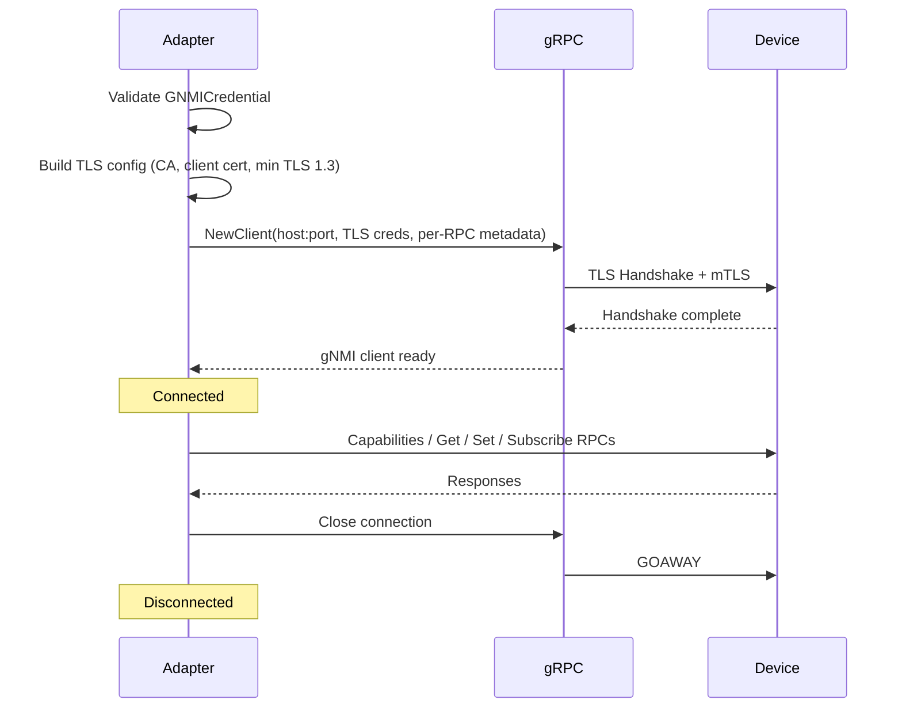

## Overview

The gNMI protocol adapter implements the [gRPC Network Management Interface](https://github.com/openconfig/reference/blob/master/rpc/gnmi/gnmi-specification.md) specification for managing modern network devices. gNMI provides a gRPC-based mechanism for retrieving and modifying configuration, streaming telemetry, and querying device capabilities using structured data models (primarily OpenConfig YANG).

**Key features**:
- Full gNMI RPC support: Capabilities, Get, Set, Subscribe
- Streaming telemetry via channel-based subscriptions (ONCE, STREAM, POLL modes)
- mTLS and per-RPC username/password authentication
- OpenConfig path parsing with key selectors and origin prefixes
- Multiple encoding support: JSON_IETF, JSON, PROTO, ASCII, BYTES
- gNOI (gRPC Network Operations Interface) stubs for future system operations

## Configuration

### Adapter Configuration

```yaml
proxy:
  devices:
    - id: spine-01
      address: 10.0.1.1
      protocol: gnmi
      port: 9339
      credential_ref: gnmi-mtls-creds
      profile_id: arista-eos
```

### Config Fields

| Field | Type | Default | Description |
|-------|------|---------|-------------|
| `port` | int | `9339` | gNMI gRPC port (IANA-assigned for gNMI) |
| `encoding` | string | `"json_ietf"` | Default encoding for Get/Subscribe requests |
| `timeout` | duration | `30s` | Per-RPC timeout for unary calls |
| `keepalive_interval` | duration | `0` | gRPC keepalive ping interval (0 = disabled) |
| `keepalive_timeout` | duration | `0` | gRPC keepalive timeout |

## Credentials

gNMI uses a dedicated `GNMICredential` type supporting two authentication methods:

### mTLS (Mutual TLS)

```yaml
credentials:
  gnmi-mtls-creds:
    type: gnmi
    ca_cert: "${CA_CERT_PEM}"
    client_cert: "${CLIENT_CERT_PEM}"
    client_key: "${CLIENT_KEY_PEM}"
```

### Username/Password (Per-RPC Metadata)

Many gNMI targets (Arista EOS, Cisco IOS-XR, Nokia SR OS) authenticate using username/password sent as gRPC metadata headers alongside TLS transport security:

```yaml
credentials:
  gnmi-password-creds:
    type: gnmi
    username: admin
    password: "${DEVICE_PASSWORD}"
    ca_cert: "${CA_CERT_PEM}"
```

### Combined mTLS + Username/Password

```yaml
credentials:
  gnmi-full-creds:
    type: gnmi
    username: admin
    password: "${DEVICE_PASSWORD}"
    ca_cert: "${CA_CERT_PEM}"
    client_cert: "${CLIENT_CERT_PEM}"
    client_key: "${CLIENT_KEY_PEM}"
```

### Credential Fields

| Field | Type | Required | Description |
|-------|------|----------|-------------|
| `username` | string | No | Username sent as gRPC metadata |
| `password` | string | No | Password sent as gRPC metadata |
| `ca_cert` | []byte | No | PEM-encoded CA certificate for server verification |
| `client_cert` | []byte | No | PEM-encoded client certificate for mTLS |
| `client_key` | []byte | No | PEM-encoded client private key for mTLS |
| `skip_verify` | bool | No | Skip server certificate verification (testing only) |

## Connection Lifecycle



## Operations

### Capabilities

Retrieves the device's gNMI version, supported models, and encodings:

```go
result, err := adapter.Capabilities(ctx)
// result.GNMIVersion    = "0.10.0"
// result.SupportedModels = [{Name: "openconfig-interfaces", ...}]
// result.SupportedEncodings = ["JSON_IETF", "PROTO"]
```

### Get

Retrieves operational or configuration data from specified paths:

```go
paths := []protocols.GNMIPath{
    {Elements: []string{"interfaces", "interface", "state", "counters"}},
}
opts := &protocols.GNMIGetOptions{
    Encoding: "json_ietf",
    DataType: "config",  // all, config, state, operational
}
result, err := adapter.Get(ctx, paths, opts)
```

### Set

Modifies configuration using update, replace, or delete operations:

```go
req := &protocols.GNMISetRequest{
    Update: []protocols.GNMIUpdate{
        {
            Path:  protocols.GNMIPath{Elements: []string{"system", "config", "hostname"}},
            Value: []byte(`"new-hostname"`),
        },
    },
    Delete: []protocols.GNMIPath{
        {Elements: []string{"interfaces", "interface[name=eth99]"}},
    },
}
result, err := adapter.Set(ctx, req)
```

### Subscribe

Creates a streaming subscription for real-time telemetry:

```go
sub, err := adapter.Subscribe(ctx, &protocols.GNMISubscribeRequest{
    Paths:          []protocols.GNMIPath{{Elements: []string{"interfaces", "interface", "state", "counters"}}},
    Mode:           "stream",       // once, stream, poll
    StreamMode:     "sample",       // target_defined, on_change, sample
    SampleInterval: 10_000_000_000, // 10 seconds in nanoseconds
    Encoding:       "json_ietf",
})
defer sub.Close()

for {
    select {
    case notif := <-sub.Notifications():
        // Process telemetry update
    case err := <-sub.Errors():
        // Handle error
    case <-sub.SyncComplete():
        // Initial sync done
    case <-sub.Done():
        return
    }
}
```

### Health Check

Checks gRPC connection state (Ready or Idle = healthy):

```go
result, err := adapter.HealthCheck(ctx)
// result.Healthy = true
// result.Details = "gRPC state: READY"
```

## Subscription Modes

| Mode | Behavior |
|------|----------|
| `once` | Sends current values for all paths, signals sync, then closes the stream |
| `stream` | Continuously delivers updates; stays open until cancelled |
| `poll` | Client-initiated polling (send poll request to receive current values) |

### Stream Sub-Modes

| Sub-Mode | Behavior |
|----------|----------|
| `target_defined` | Device decides when to send updates |
| `on_change` | Updates sent only when values change |
| `sample` | Updates sent at regular intervals (`sample_interval`) |

## Execute Command Interface

The `Execute()` method provides a text-based command interface for scripting:

| Command | Format | Example |
|---------|--------|---------|
| Capabilities | `capabilities` | `capabilities` |
| Get | `get <path> [encoding]` | `get /interfaces/interface json_ietf` |
| Set Update | `set update <path> <value>` | `set update /system/config/hostname "router-01"` |
| Set Replace | `set replace <path> <value>` | `set replace /system/config/hostname "router-01"` |
| Set Delete | `set delete <path>` | `set delete /interfaces/interface[name=eth99]` |
| Subscribe Once | `subscribe once <path>` | `subscribe once /system/config/hostname` |

Stream and poll modes via `Execute()` are not supported; use `Subscribe()` directly.

## Path Format

gNMI paths follow the OpenConfig path specification:

```
/origin:element1/element2[key1=val1][key2=val2]/element3
```

### Examples

| Path | Description |
|------|-------------|
| `/interfaces/interface` | All interfaces |
| `/interfaces/interface[name=eth0]` | Specific interface by key |
| `/interfaces/interface[name=eth0]/state/counters` | Interface counters |
| `/system/config/hostname` | System hostname |
| `openconfig:/network-instances/network-instance` | With origin prefix |

## Encoding Types

| Encoding | Constant | Description |
|----------|----------|-------------|
| JSON_IETF | `json_ietf` | RFC 7951 JSON encoding (default) |
| JSON | `json` | Standard JSON encoding |
| PROTO | `proto` | Protocol Buffers binary encoding |
| ASCII | `ascii` | ASCII text encoding |
| BYTES | `bytes` | Raw byte encoding |

## gNOI (gRPC Network Operations Interface)

The adapter includes stubs for gNOI system operations. These operations require the `openconfig/gnoi` dependency and return "not supported" until that dependency is added:

- **Reboot**: Request a device reboot with specified method and message
- **Ping**: Execute a network ping via the device
- **Traceroute**: Execute a traceroute via the device

## Examples

### Streaming Interface Counters

```yaml
proxy:
  devices:
    - id: spine-01
      type: switch
      vendor: Arista
      protocol: gnmi
      address: 10.0.1.1
      port: 6030
      credential_ref: gnmi-arista-creds
```

### Multi-Vendor Configuration

```yaml
proxy:
  devices:
    - id: cisco-xr-01
      type: router
      vendor: Cisco
      protocol: gnmi
      address: 10.0.2.1
      port: 57400
      credential_ref: gnmi-cisco-creds

    - id: juniper-mx-01
      type: router
      vendor: Juniper
      protocol: gnmi
      address: 10.0.3.1
      port: 32767
      credential_ref: gnmi-juniper-creds
```

### Common gNMI Ports by Vendor

| Vendor | Default Port | Notes |
|--------|-------------|-------|
| Arista EOS | 6030 | gNMI + gNOI |
| Cisco IOS-XR | 57400 | gNMI + gNOI |
| Juniper JUNOS | 32767 | OpenConfig over gRPC |
| Nokia SR OS | 57400 | gNMI with TLS required |
| SONiC | 8080 / 9339 | Varies by deployment |
| Generic | 9339 | IANA-assigned gNMI port |

## See Also

- [NETCONF Protocol Reference]() - XML-over-SSH protocol for YANG data
- [RESTCONF Protocol Reference]() - HTTP-based protocol for YANG data
- [Telnet Protocol Reference]() - Legacy CLI access for network devices
- [Proxy Agents]() - Managing unmanaged devices
