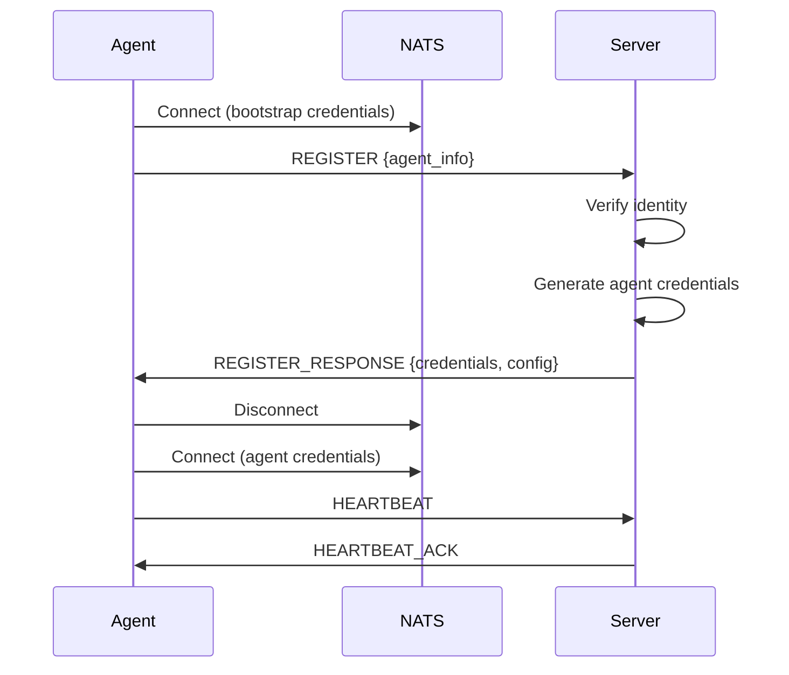

## Configuration Reference

The NATS configuration is shared between server and agent under the top-level `nats:` key in the Keystone Core config file.

### NATS Configuration

```yaml
nats:
  # Connection mode: embedded, external, or leaf
  mode: embedded

  # NATS server URL (external or leaf mode)
  # Supports nats://, tls://, and ws(s):// schemes
  # For multiple servers, use comma-separated URLs
  url: nats://nats.example.com:4222

  # Embedded NATS server settings (used when mode=embedded or leaf)
  embedded:
    # Listen address in "host:port" format (overrides host/port if set)
    listen: 0.0.0.0:4222
    # Host address (default: 127.0.0.1; use "::" for all IPv6 interfaces)
    host: 127.0.0.1
    # Port for embedded NATS server
    port: 4222
    # Enable JetStream for embedded mode
    enable_jetstream: true
    # Storage directory for embedded NATS data
    store_dir: /var/lib/keystone-core/nats
    # Maximum memory in bytes (0 = unlimited)
    max_memory: 1073741824
    # Maximum number of client connections (0 = unlimited)
    max_connections: 1000
    # Leaf node parent URLs (for leaf mode)
    leaf_node_urls:
      - nats-leaf://hub.example.com:7422
    # Address family preference: prefer_ipv4, prefer_ipv6, ipv4_only, ipv6_only
    address_family: prefer_ipv4

  # JetStream settings
  jetstream:
    # Enable JetStream
    enabled: true
    # Storage directory
    store_dir: /var/lib/keystone-core/jetstream
    # Maximum storage size in bytes (0 = unlimited)
    max_storage: 10737418240

  # Connection settings
  max_reconnects: -1        # -1 = unlimited reconnect attempts
  reconnect_wait: 2s        # Wait time between reconnect attempts

  # Authentication (use one, not both)
  token: ""                 # NATS authentication token
  credential: ""            # Path to NATS credentials file (.creds)
```

### Configuration by Mode

**Embedded mode** (`mode: embedded`): Starts an in-process NATS server. Configure `embedded.*` and `jetstream.*` settings. The `url` field is ignored.

**External mode** (`mode: external`): Connects to an existing NATS cluster. Set `url` to the cluster address. The `embedded.*` settings are ignored except for leaf-related fields.

**Leaf mode** (`mode: leaf`): Starts an embedded NATS server that connects as a leaf node to a hub. Set `embedded.leaf_node_urls` to the hub addresses.

## Subject Reference

### Subject Namespace

```
kscore.{cluster}.{category}.{entity}.{operation}
```

### Standard Subjects

| Subject Pattern | Description | Publisher | Subscriber |
|-----------------|-------------|-----------|------------|
| `kscore.{cluster}.bootstrap.register` | Agent registration | Agent | Server |
| `kscore.{cluster}.bootstrap.response.{agent}` | Registration response | Server | Agent |
| `kscore.{cluster}.agent.{id}.heartbeat` | Agent heartbeat | Agent | Server |
| `kscore.{cluster}.agent.{id}.status` | Agent status updates | Agent | Server |
| `kscore.{cluster}.command.{id}.execute` | Command execution | Server | Agent |
| `kscore.{cluster}.command.{id}.result` | Command results | Agent | Server |
| `kscore.{cluster}.state.{id}.apply` | State application | Server | Agent |
| `kscore.{cluster}.state.{id}.result` | State results | Agent | Server |
| `kscore.{cluster}.event.>` | Event streaming | Any | Any |
| `kscore.{cluster}.discovery.agents` | Agent discovery | Server | Server |
| `kscore.{cluster}.server.leader.election` | Leader election | Server | Server |

### Subject Wildcards

| Pattern | Description |
|---------|-------------|
| `*` | Matches single token |
| `>` | Matches one or more tokens |

Examples:

- `kscore.prod.agent.*.heartbeat` - All agent heartbeats
- `kscore.*.command.>` - All commands across all clusters
- `kscore.prod.event.state.>` - All state events in prod

## CLI Reference

### Agent NATS Commands

```bash
# Connection status
kscore-agent nats status
kscore-agent nats ping
kscore-agent nats ping --count 5 --timeout 10s

# Run full connectivity test suite
kscore-agent nats test
kscore-agent nats test --verbose
```

### Control Plane Diagnostic Commands

```bash
# NATS connection status
kscorectl nats status
kscorectl nats status --output json

# Event inspection
kscorectl events list --type TYPE --limit N
kscorectl events export --format json --limit 1000

# Audit timeline for incident investigation
kscorectl audit timeline --from "2024-01-01T00:00:00Z" --to "2024-01-02T00:00:00Z"

# Full diagnostic report
kscorectl diagnostics collect --output-dir /tmp/nats-diag
```

### NATS CLI Commands

```bash
# Cluster status
nats server report connections
nats server report jetstream
nats server report leafnodes
nats server report gateways

# Stream management
nats stream ls
nats stream info STREAM_NAME
nats stream purge STREAM_NAME

# Consumer management
nats consumer ls STREAM_NAME
nats consumer info STREAM_NAME CONSUMER_NAME
```

## Metrics Reference

### Connection Metrics

| Metric | Type | Labels | Description |
|--------|------|--------|-------------|
| `kscore_nats_connections_total` | Counter | endpoint, strategy, status | Total connection attempts |
| `kscore_nats_connection_errors_total` | Counter | endpoint, error | Connection errors |
| `kscore_nats_reconnections_total` | Counter | endpoint | Reconnection count |
| `kscore_nats_failovers_total` | Counter | from, to | Endpoint failovers |

### Message Metrics

| Metric | Type | Labels | Description |
|--------|------|--------|-------------|
| `kscore_nats_messages_total` | Counter | direction, subject_prefix | Messages sent/received |
| `kscore_nats_message_bytes_total` | Counter | direction | Message bytes |
| `kscore_nats_delivery_acked_total` | Counter | | Acknowledged deliveries |
| `kscore_nats_delivery_failed_total` | Counter | | Failed deliveries |
| `kscore_nats_delivery_pending` | Gauge | | Pending deliveries |
| `kscore_nats_duplicates_detected_total` | Counter | | Duplicate messages detected |

### Buffer Metrics

| Metric | Type | Labels | Description |
|--------|------|--------|-------------|
| `kscore_nats_buffer_size` | Gauge | type | Current buffer size |
| `kscore_nats_buffer_overflow_total` | Counter | | Buffer overflows |

### Topology Metrics

| Metric | Type | Labels | Description |
|--------|------|--------|-------------|
| `kscore_nats_leaf_nodes_total` | Gauge | hub | Connected leaf nodes |
| `kscore_nats_gateway_connections_total` | Gauge | local_cluster, remote_cluster | Gateway connections |

### Bootstrap Metrics

| Metric | Type | Labels | Description |
|--------|------|--------|-------------|
| `kscore_nats_bootstrap_requests_total` | Counter | status | Bootstrap requests (approved/rejected/expired) |
| `kscore_nats_bootstrap_duration_seconds` | Histogram | | Bootstrap duration |

### Coordination Metrics

| Metric | Type | Labels | Description |
|--------|------|--------|-------------|
| `kscore_nats_coordination_rpcs_total` | Counter | method, status | Coordination RPCs |
| `kscore_nats_coordination_latency_seconds` | Histogram | method | Coordination latency |

## Environment Variables

These environment variables are read by the agent bootstrap process and override config file values.

| Variable | Description | Default |
|----------|-------------|---------|
| `KSCORE_NATS_MODE` | Connection mode (`embedded`, `external`, `leaf`) | `embedded` |
| `KSCORE_NATS_URLS` | Comma-separated NATS URLs | `nats://localhost:4222` |
| `KSCORE_NATS_CREDS_FILE` | Path to NATS credentials file | |
| `KSCORE_NATS_USER` | NATS authentication username | |
| `KSCORE_NATS_PASSWORD` | NATS authentication password | |

## Common Errors

| Symptom | Description | Resolution |
|---------|-------------|------------|
| Connection refused | NATS server not reachable | Check NATS server is running and URL is correct |
| Authentication failed | Invalid token or credentials | Verify `token` or `credential` config |
| TLS handshake failed | Certificate mismatch | Check certificate paths and CA trust chain |
| Connection timeout | Network unreachable | Check network connectivity and firewall rules |
| No servers available | All configured servers down | Check NATS cluster health |
| Leaf node disconnected | Hub server unreachable | Check hub connectivity and `leaf_node_urls` |

## Protocol Specification

### Message Envelope

All NATS messages use a standard envelope:

```json
{
  "id": "msg-uuid-v4",
  "correlation_id": "request-uuid",
  "timestamp": "2024-01-15T10:30:00Z",
  "ttl": 30,
  "priority": 1,
  "cluster": "production",
  "trace": {
    "trace_id": "trace-uuid",
    "span_id": "span-uuid",
    "parent_span_id": "parent-span-uuid"
  },
  "payload": {
    // Message-specific data
  }
}
```

### Priority Levels

| Level | Value | Description |
|-------|-------|-------------|
| Critical | 0 | System-critical operations |
| High | 1 | Time-sensitive commands |
| Normal | 2 | Standard operations |
| Low | 3 | Background tasks |
| Background | 4 | Bulk operations |

### Bootstrap Protocol



### Heartbeat Protocol

```json
// Agent -> Server
{
  "type": "heartbeat",
  "agent_id": "agent-123",
  "timestamp": "2024-01-15T10:30:00Z",
  "status": "healthy",
  "metrics": {
    "cpu": 45.2,
    "memory": 1024000000,
    "load": [1.2, 0.8, 0.5]
  }
}

// Server -> Agent
{
  "type": "heartbeat_ack",
  "timestamp": "2024-01-15T10:30:00Z",
  "commands_pending": 0
}
```

### Command Protocol

```json
// Server -> Agent
{
  "type": "command",
  "id": "cmd-123",
  "command": "systemctl status nginx",
  "timeout": 30,
  "streaming": true
}

// Agent -> Server (streaming)
{
  "type": "command_output",
  "command_id": "cmd-123",
  "stream": "stdout",
  "data": "● nginx.service - A high performance web server..."
}

// Agent -> Server (final)
{
  "type": "command_result",
  "command_id": "cmd-123",
  "exit_code": 0,
  "duration_ms": 150
}
```

## Backpressure

Keystone Core provides publisher backpressure controls to protect NATS and JetStream under high-volume workloads. Backpressure can block, drop, buffer, or throttle publishes when pending messages exceed configured limits.

**Strategies**:

- `block`: Wait for capacity before publishing
- `drop`: Drop messages when queue is full
- `buffer`: Buffer in memory until capacity returns
- `throttle`: Limit publish rate (messages/sec)

**Backpressure Configuration Fields** (internal API; not yet exposed in config):

| Field | Type | Description |
|-------|------|-------------|
| `strategy` | string | backpressure strategy |
| `maxPending` | int64 | Max in-flight messages |
| `maxBytes` | int64 | Max in-flight bytes |
| `bufferSize` | int | Buffer length (for `buffer`) |
| `blockTimeout` | duration | Max wait when blocking |
| `throttleRate` | int64 | Messages/sec (for `throttle`) |
| `highWaterMark` | float | Pause threshold (0.0-1.0) |
| `lowWaterMark` | float | Resume threshold (0.0-1.0) |

**Operational Notes**:

- Pause/resume events fire when crossing watermarks.
- Dropped messages increment internal counters for monitoring.
- Blocking respects context cancellation and timeouts.

## Message Ordering

Ordering controls provide predictable delivery across subjects and partitions. Keystone Core supports multiple ordering modes depending on throughput and correctness needs.

**Ordering Modes**:

- `none`: No ordering guarantees (highest throughput)
- `per_subject`: Ordering within a single subject (single publisher)
- `per_partition`: Ordering within a partition key (recommended)
- `global`: Strict global order (lowest throughput)

**Common Partition Keys**:

- `agent-id` header (per-agent ordering)
- `correlation-id` header (request/response ordering)
- subject name (per-subject ordering)

**Ordering Configuration Fields** (internal API; not yet exposed in config):

| Field | Type | Description |
|-------|------|-------------|
| `mode` | string | Ordering mode |
| `partition_key` | string | Partition key selector |
| `stream` | string | JetStream stream name |
| `window_size` | int | Max outstanding publishes per partition |
| `ack_timeout` | duration | Publish ack timeout |
| `max_retries` | int | Retry attempts |
| `retry_delay` | duration | Delay between retries |

**Best Practices**:

- Use idempotent consumers; JetStream can redeliver.
- Keep `window_size` small for strict ordering.
- Monitor sequence gaps to detect out-of-order delivery.

## See Also

- [NATS Mesh Concepts]() - Architecture overview
- [NATS Mesh Deployment]() - Deployment guides
- [NATS Mesh Operations]() - Operations guides
