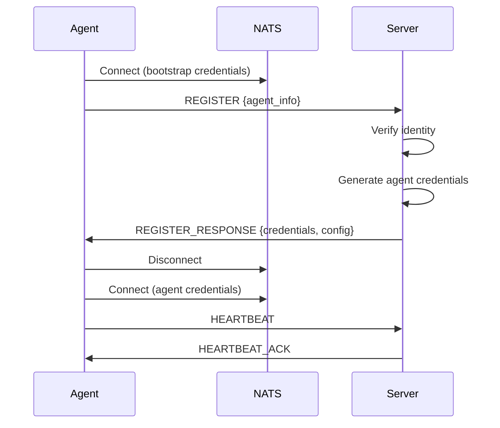

## Configuration Reference

### Server NATS Configuration

```yaml
server:
  nats:
    # Connection mode
    mode: embedded | external | leaf

    # NATS server URLs (external mode)
    urls:
      - nats://nats-1:4222
      - nats://nats-2:4222

    # Cluster identifier for subject routing
    cluster: production

    # Embedded NATS settings
    embedded:
      listen: 0.0.0.0:4222
      http_port: 8222
      store_dir: /var/lib/kscore/nats
      max_memory: 1GB
      max_file: 10GB

    # TLS configuration
    tls:
      enabled: true
      cert: /etc/kscore/server.crt
      key: /etc/kscore/server.key
      ca: /etc/kscore/ca.crt
      verify: true
      min_version: "1.3"

    # Leaf node hub configuration
    leaf:
      listen: 0.0.0.0:7422
      tls:
        cert: /etc/kscore/leaf.crt
        key: /etc/kscore/leaf.key
        ca: /etc/kscore/ca.crt

    # Gateway configuration (supercluster)
    gateway:
      enabled: true
      name: region-1
      listen: 0.0.0.0:7222
      remotes:
        - name: region-2
          urls:
            - nats://gateway.region-2.example.com:7222

    # WebSocket configuration
    websocket:
      listen: 0.0.0.0:443
      path: /nats
      tls:
        cert: /etc/kscore/websocket.crt
        key: /etc/kscore/websocket.key
      compression: true
      cors:
        allowed_origins:
          - https://console.example.com

    # Routing configuration
    routing:
      prefer_local: true
      cross_cluster_timeout: 5s
```

### Agent NATS Configuration

```yaml
agent:
  nats:
    # Connection mode
    mode: direct | leaf

    # Single URL (simple)
    urls:
      - nats://nats:4222

    # Multiple endpoints with failover
    endpoints:
      - url: nats://nats-1:4222
        priority: 1
        strategy: direct
        weight: 100
      - url: nats://nats-2:4222
        priority: 2
        strategy: direct
        weight: 100
      - url: wss://nats-ws:443/nats
        priority: 10
        strategy: websocket
        weight: 50

    # TLS configuration
    tls:
      enabled: true
      cert: /etc/kscore/agent.crt
      key: /etc/kscore/agent.key
      ca: /etc/kscore/ca.crt
      skip_verify: false

    # Connection settings
    ping_interval: 30s
    max_pings_out: 3
    max_reconnects: -1
    reconnect_wait: 2s
    reconnect_jitter: 1s
    reconnect_buf_size: 8MB
    flush_timeout: 10s

    # Routing settings
    routing:
      strategy: priority | round_robin | least_latency | weighted | random
      health_check_interval: 10s
      failback: true
      failback_delay: 30s

    # Leaf node settings
    hub:
      urls:
        - nats-leaf://hub.example.com:7422
      credentials: /etc/kscore/leaf.creds
      tls:
        ca: /etc/kscore/ca.crt
        cert: /etc/kscore/leaf.crt
        key: /etc/kscore/leaf.key

    embedded:
      listen: 127.0.0.1:4222
      store_dir: /var/lib/kscore/nats

    # Buffer settings
    buffer:
      enabled: true
      max_size: 100MB
      max_messages: 100000
      max_age: 24h
      persistence: true
      persist_dir: /var/lib/kscore/buffer
      overflow: drop_oldest | drop_newest | block

    # WebSocket settings
    websocket:
      compression: true
      handshake_timeout: 10s
      headers:
        X-Custom-Header: value
      proxy:
        url: http://proxy:8080
        auth:
          type: none | basic | digest | ntlm
          username: user
          password: pass
        no_proxy:
          - "*.internal.com"
          - "10.0.0.0/8"

    # Discovery settings
    discovery:
      dns:
        service: _nats._tcp.example.com
        refresh_interval: 60s
      kubernetes:
        service: nats
        namespace: nats-system
        port_name: client
      consul:
        address: consul:8500
        service: nats
        tags: [production]

    # Circuit breaker settings
    circuit_breaker:
      failure_threshold: 5
      success_threshold: 3
      timeout: 30s
      half_open_requests: 1

    # Delivery settings
    delivery:
      mode: at_most_once | at_least_once | exactly_once
      timeout: 30s
      max_retries: 3
      backoff:
        initial: 100ms
        multiplier: 2
        max: 10s
      dead_letter:
        enabled: true
        subject: kscore.dlq

    # Deduplication settings
    dedup:
      enabled: true
      window: 5m
      max_entries: 100000
      cleanup_interval: 1m

    # Degradation settings
    degradation:
      enabled: true
      health_check_interval: 10s
      failure_threshold: 5
      success_threshold: 3
      modes:
        normal:
          allow: [critical, high, normal, low, background]
        degraded:
          allow: [critical, high, normal]
          rate_limit: 100
        limited:
          allow: [critical, high]
          rate_limit: 10
        offline:
          allow: [critical]
          buffer: true
```

## Subject Reference

### Subject Namespace

```
kscore.{cluster}.{category}.{entity}.{operation}
```

### Standard Subjects

| Subject Pattern | Description | Publisher | Subscriber |
|-----------------|-------------|-----------|------------|
| `kscore.{cluster}.bootstrap.register` | Agent registration | Agent | Server |
| `kscore.{cluster}.bootstrap.response.{agent}` | Registration response | Server | Agent |
| `kscore.{cluster}.agent.{id}.heartbeat` | Agent heartbeat | Agent | Server |
| `kscore.{cluster}.agent.{id}.status` | Agent status updates | Agent | Server |
| `kscore.{cluster}.command.{id}.execute` | Command execution | Server | Agent |
| `kscore.{cluster}.command.{id}.result` | Command results | Agent | Server |
| `kscore.{cluster}.state.{id}.apply` | State application | Server | Agent |
| `kscore.{cluster}.state.{id}.result` | State results | Agent | Server |
| `kscore.{cluster}.event.>` | Event streaming | Any | Any |
| `kscore.{cluster}.discovery.agents` | Agent discovery | Server | Server |
| `kscore.{cluster}.server.leader.election` | Leader election | Server | Server |

### Subject Wildcards

| Pattern | Description |
|---------|-------------|
| `*` | Matches single token |
| `>` | Matches one or more tokens |

Examples:
- `kscore.prod.agent.*.heartbeat` - All agent heartbeats
- `kscore.*.command.>` - All commands across all clusters
- `kscore.prod.event.state.>` - All state events in prod

## CLI Reference

### Agent NATS Commands

```bash
# Connection status
kscore-agent nats status
kscore-agent nats ping

# Test endpoint
kscore-agent nats test nats://nats:4222

# Leaf node status
kscore-agent nats leaf status

# Buffer status
kscore-agent nats buffer status
kscore-agent nats buffer flush
kscore-agent nats buffer clear
```

### Control Plane Debug Commands

```bash
# Connection debugging
kscorectl debug nats status
kscorectl debug nats events [--type TYPE] [--limit N]
kscorectl debug nats timeline [--endpoint URL]
kscorectl debug nats trace [--message-id ID] [--subject PATTERN]

# Diagnostic report
kscorectl debug nats diagnose [--output json|text]

# Export data
kscorectl debug nats export [--format json] [--output FILE]
```

### NATS CLI Commands

```bash
# Cluster status
nats server report connections
nats server report jetstream
nats server report leafnodes
nats server report gateways

# Stream management
nats stream ls
nats stream info STREAM_NAME
nats stream purge STREAM_NAME

# Consumer management
nats consumer ls STREAM_NAME
nats consumer info STREAM_NAME CONSUMER_NAME
```

## Metrics Reference

### Connection Metrics

| Metric | Type | Labels | Description |
|--------|------|--------|-------------|
| `kscore_nats_connections_total` | Counter | endpoint, strategy, status | Total connection attempts |
| `kscore_nats_connection_errors_total` | Counter | endpoint, error_type | Connection errors |
| `kscore_nats_reconnections_total` | Counter | endpoint | Reconnection count |
| `kscore_nats_connection_latency_seconds` | Histogram | endpoint | Connection latency |
| `kscore_nats_circuit_breaker_state` | Gauge | endpoint | 0=closed, 1=half-open, 2=open |

### Message Metrics

| Metric | Type | Labels | Description |
|--------|------|--------|-------------|
| `kscore_nats_messages_total` | Counter | direction, type | Messages sent/received |
| `kscore_nats_message_bytes_total` | Counter | direction, type | Message bytes |
| `kscore_nats_delivery_acked_total` | Counter | | Acknowledged deliveries |
| `kscore_nats_delivery_failed_total` | Counter | reason | Failed deliveries |
| `kscore_nats_delivery_pending` | Gauge | | Pending deliveries |
| `kscore_nats_delivery_retried_total` | Counter | | Retried deliveries |
| `kscore_nats_duplicates_detected_total` | Counter | | Duplicate messages |

### Buffer Metrics

| Metric | Type | Labels | Description |
|--------|------|--------|-------------|
| `kscore_nats_buffer_size` | Gauge | buffer_name | Current buffer size |
| `kscore_nats_buffer_messages` | Gauge | buffer_name | Buffered message count |
| `kscore_nats_buffer_overflow_total` | Counter | buffer_name | Buffer overflows |
| `kscore_nats_buffer_flush_total` | Counter | buffer_name | Buffer flushes |

### Topology Metrics

| Metric | Type | Labels | Description |
|--------|------|--------|-------------|
| `kscore_nats_leaf_nodes_total` | Gauge | hub | Connected leaf nodes |
| `kscore_nats_gateway_connections_total` | Gauge | local_cluster, remote_cluster | Gateway connections |
| `kscore_nats_gateway_latency_seconds` | Histogram | local_cluster, remote_cluster | Gateway latency |
| `kscore_nats_failovers_total` | Counter | from, to | Endpoint failovers |

### Bootstrap Metrics

| Metric | Type | Labels | Description |
|--------|------|--------|-------------|
| `kscore_nats_bootstrap_requests_total` | Counter | status | Bootstrap requests (approved/rejected/expired) |
| `kscore_nats_bootstrap_duration_seconds` | Histogram | | Bootstrap duration |

### Coordination Metrics

| Metric | Type | Labels | Description |
|--------|------|--------|-------------|
| `kscore_nats_coordination_rpcs_total` | Counter | method, status | Coordination RPCs |
| `kscore_nats_coordination_latency_seconds` | Histogram | method | Coordination latency |

## Environment Variables

| Variable | Description | Default |
|----------|-------------|---------|
| `KSCORE_NATS_URLS` | Comma-separated NATS URLs | `nats://localhost:4222` |
| `KSCORE_NATS_TLS_CERT` | TLS certificate path | |
| `KSCORE_NATS_TLS_KEY` | TLS key path | |
| `KSCORE_NATS_TLS_CA` | TLS CA path | |
| `KSCORE_NATS_CREDENTIALS` | NATS credentials file | |
| `KSCORE_NATS_DEBUG` | Enable debug logging | `false` |
| `KSCORE_NATS_CLUSTER` | Cluster name | `default` |
| `KSCORE_NATS_MODE` | Connection mode | `direct` |
| `KSCORE_NATS_BUFFER_SIZE` | Buffer size | `100MB` |
| `KSCORE_NATS_BUFFER_DIR` | Buffer persistence directory | |

## Error Codes

| Code | Description | Resolution |
|------|-------------|------------|
| `NATS_CONN_REFUSED` | Connection refused | Check NATS server is running |
| `NATS_AUTH_FAILED` | Authentication failed | Verify credentials |
| `NATS_TLS_FAILED` | TLS handshake failed | Check certificates |
| `NATS_TIMEOUT` | Connection timeout | Check network connectivity |
| `NATS_NO_SERVERS` | No servers available | Check endpoint configuration |
| `NATS_CIRCUIT_OPEN` | Circuit breaker open | Wait for recovery or check endpoint |
| `NATS_BUFFER_FULL` | Buffer overflow | Increase buffer size or check connectivity |
| `NATS_DEDUP_REJECTED` | Duplicate message | Expected behavior, message already processed |
| `NATS_DELIVERY_FAILED` | Delivery failed | Check consumer status |
| `NATS_LEAF_DISCONNECTED` | Leaf node disconnected | Check hub connectivity |
| `NATS_GATEWAY_UNAVAILABLE` | Gateway unreachable | Check cross-cluster network |

## Protocol Specification

### Message Envelope

All NATS messages use a standard envelope:

```json
{
  "id": "msg-uuid-v4",
  "correlation_id": "request-uuid",
  "timestamp": "2024-01-15T10:30:00Z",
  "ttl": 30,
  "priority": 1,
  "cluster": "production",
  "trace": {
    "trace_id": "trace-uuid",
    "span_id": "span-uuid",
    "parent_span_id": "parent-span-uuid"
  },
  "payload": {
    // Message-specific data
  }
}
```

### Priority Levels

| Level | Value | Description |
|-------|-------|-------------|
| Critical | 0 | System-critical operations |
| High | 1 | Time-sensitive commands |
| Normal | 2 | Standard operations |
| Low | 3 | Background tasks |
| Background | 4 | Bulk operations |

### Bootstrap Protocol



### Heartbeat Protocol

```json
// Agent -> Server
{
  "type": "heartbeat",
  "agent_id": "agent-123",
  "timestamp": "2024-01-15T10:30:00Z",
  "status": "healthy",
  "metrics": {
    "cpu": 45.2,
    "memory": 1024000000,
    "load": [1.2, 0.8, 0.5]
  }
}

// Server -> Agent
{
  "type": "heartbeat_ack",
  "timestamp": "2024-01-15T10:30:00Z",
  "commands_pending": 0
}
```

### Command Protocol

```json
// Server -> Agent
{
  "type": "command",
  "id": "cmd-123",
  "command": "systemctl status nginx",
  "timeout": 30,
  "streaming": true
}

// Agent -> Server (streaming)
{
  "type": "command_output",
  "command_id": "cmd-123",
  "stream": "stdout",
  "data": "● nginx.service - A high performance web server..."
}

// Agent -> Server (final)
{
  "type": "command_result",
  "command_id": "cmd-123",
  "exit_code": 0,
  "duration_ms": 150
}
```

## Backpressure

Keystone Core provides publisher backpressure controls to protect NATS and JetStream under high-volume workloads. Backpressure can block, drop, buffer, or throttle publishes when pending messages exceed configured limits.

**Strategies**:
- `block`: Wait for capacity before publishing
- `drop`: Drop messages when queue is full
- `buffer`: Buffer in memory until capacity returns
- `throttle`: Limit publish rate (messages/sec)

**Backpressure Configuration Fields** (internal API; not yet exposed in config):

| Field | Type | Description |
|-------|------|-------------|
| `strategy` | string | backpressure strategy |
| `maxPending` | int64 | Max in-flight messages |
| `maxBytes` | int64 | Max in-flight bytes |
| `bufferSize` | int | Buffer length (for `buffer`) |
| `blockTimeout` | duration | Max wait when blocking |
| `throttleRate` | int64 | Messages/sec (for `throttle`) |
| `highWaterMark` | float | Pause threshold (0.0-1.0) |
| `lowWaterMark` | float | Resume threshold (0.0-1.0) |

**Operational Notes**:
- Pause/resume events fire when crossing watermarks.
- Dropped messages increment internal counters for monitoring.
- Blocking respects context cancellation and timeouts.

## Message Ordering

Ordering controls provide predictable delivery across subjects and partitions. Keystone Core supports multiple ordering modes depending on throughput and correctness needs.

**Ordering Modes**:
- `none`: No ordering guarantees (highest throughput)
- `per_subject`: Ordering within a single subject (single publisher)
- `per_partition`: Ordering within a partition key (recommended)
- `global`: Strict global order (lowest throughput)

**Common Partition Keys**:
- `agent-id` header (per-agent ordering)
- `correlation-id` header (request/response ordering)
- subject name (per-subject ordering)

**Ordering Configuration Fields** (internal API; not yet exposed in config):

| Field | Type | Description |
|-------|------|-------------|
| `mode` | string | Ordering mode |
| `partition_key` | string | Partition key selector |
| `stream` | string | JetStream stream name |
| `window_size` | int | Max outstanding publishes per partition |
| `ack_timeout` | duration | Publish ack timeout |
| `max_retries` | int | Retry attempts |
| `retry_delay` | duration | Delay between retries |

**Best Practices**:
- Use idempotent consumers; JetStream can redeliver.
- Keep `window_size` small for strict ordering.
- Monitor sequence gaps to detect out-of-order delivery.

## See Also

- [NATS Mesh Concepts]() - Architecture overview
- [NATS Mesh Deployment]() - Deployment guides
- [NATS Mesh Operations]() - Operations guides
