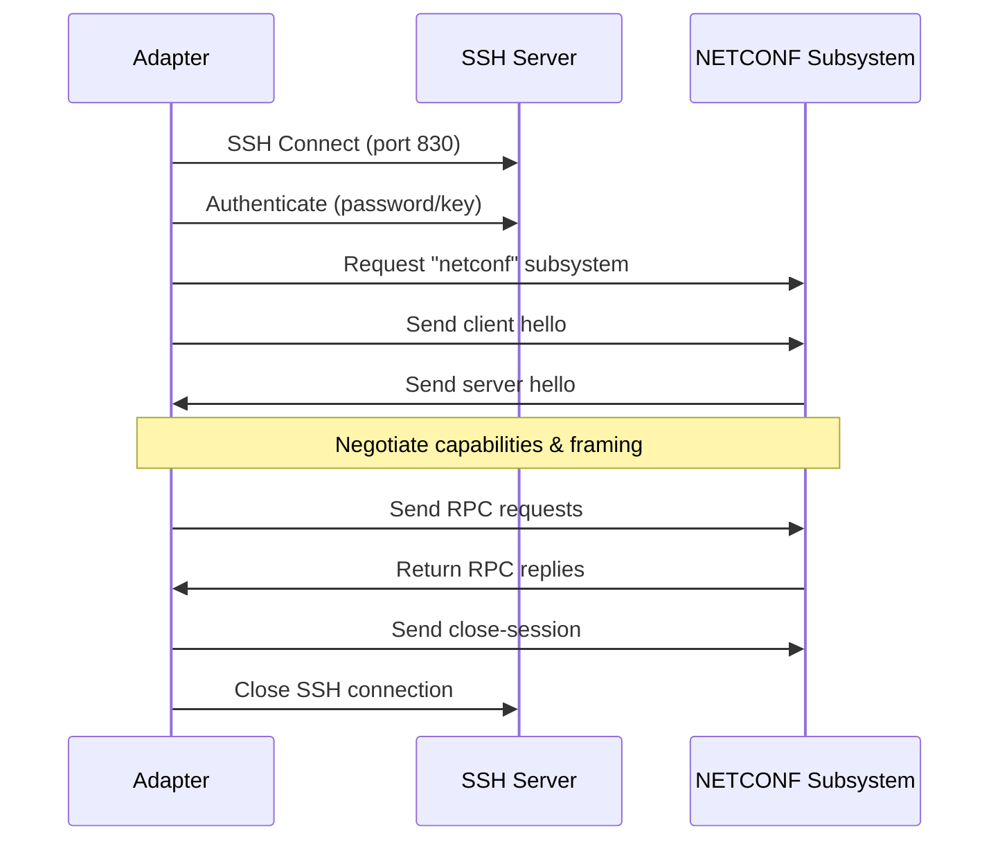

## Overview

The NETCONF protocol adapter implements RFC 6241 (NETCONF Configuration Protocol) over SSH, enabling management of network devices that support the NETCONF subsystem. It integrates with the proxy agent system as both a generic `ProtocolAdapter` and an extended `NetconfAdapter` with typed operations.

**Key features**:

- Full RFC 6241 operation set (get-config, edit-config, lock, commit, etc.)
- NETCONF 1.0 (EOM framing) and 1.1 (chunked framing, RFC 6242)
- Automatic capability negotiation and framing mode selection
- YANG model metadata extraction from server capabilities
- Subtree and XPath filter construction helpers
- Reuses existing SSH credentials (no new credential types)

## Configuration

### Adapter Configuration

```yaml
proxy:
  devices:
    - id: router-01
      address: 192.168.1.1
      protocol: netconf
      port: 830
```

The adapter accepts the following configuration options:

| Field | Type | Default | Description |
|-------|------|---------|-------------|
| `port` | int | 830 | NETCONF SSH subsystem port |
| `timeout` | duration | 30s | Connection timeout |
| `keep_alive` | bool | true | Enable SSH keepalive |
| `keep_alive_interval` | duration | 30s | Keepalive interval |
| `max_retries` | int | 3 | Connection retry attempts |
| `retry_delay` | duration | 5s | Delay between retries |

### Credentials

NETCONF over SSH uses standard SSH credentials. No new credential types are required.

**Password authentication**:

```yaml
credentials:
  router-01:
    type: ssh-password
    username: admin
    password: "${ROUTER_PASSWORD}"
```

**Key-based authentication**:

```yaml
credentials:
  router-01:
    type: ssh-key
    username: admin
    private_key_path: /etc/keystone-core/keys/router-01.pem
```

## Operations

### Execute Interface

The generic `Execute()` method accepts string commands in the format `operation [args] [body]`:

| Command | Format | Example |
|---------|--------|---------|
| get-config | `get-config [source] [filter-xml]` | `get-config running <interfaces/>` |
| get | `get [filter-xml]` | `get <system/>` |
| edit-config | `edit-config target config-xml` | `edit-config candidate <config>...</config>` |
| copy-config | `copy-config source target` | `copy-config running startup` |
| delete-config | `delete-config target` | `delete-config startup` |
| lock | `lock target` | `lock candidate` |
| unlock | `unlock target` | `unlock candidate` |
| commit | `commit` | `commit` |
| discard-changes | `discard-changes` | `discard-changes` |
| validate | `validate [source]` | `validate candidate` |
| kill-session | `kill-session session-id` | `kill-session 42` |

### Datastores

Valid datastores for NETCONF operations:

| Datastore | Description |
|-----------|-------------|
| `running` | Currently active configuration |
| `candidate` | Staging configuration (requires `:candidate` capability) |
| `startup` | Configuration loaded at boot (requires `:startup` capability) |

### Typed Operations (NetconfAdapter)

The extended `NetconfAdapter` interface provides typed methods that return structured results:

```go
adapter.GetConfig(ctx, "running", nil)
adapter.EditConfig(ctx, "candidate", configXML, &protocols.NetconfEditOptions{
    DefaultOperation: "merge",
    TestOption:       "test-then-set",
    ErrorOption:      "rollback-on-error",
})
adapter.Lock(ctx, "candidate")
adapter.Commit(ctx)
adapter.Unlock(ctx, "candidate")
```

### Edit Options

`EditConfig` accepts optional edit parameters:

| Option | Values | Description |
|--------|--------|-------------|
| `default_operation` | `merge`, `replace`, `none` | How to apply changes (default: merge) |
| `test_option` | `test-then-set`, `set`, `test-only` | Validation behavior (requires `:validate`) |
| `error_option` | `stop-on-error`, `continue-on-error`, `rollback-on-error` | Error handling strategy |

## Capabilities

### Client Capabilities

The adapter advertises NETCONF 1.0 and 1.1 base capabilities:

- `urn:ietf:params:netconf:base:1.0`
- `urn:ietf:params:netconf:base:1.1`

### Server Capability Detection

After connecting, query server capabilities:

```go
caps := adapter.ServerCapabilities()
```

Helper functions check for specific capabilities:

| Helper | Capability |
|--------|-----------|
| `SupportsCandidate()` | `:candidate` datastore |
| `SupportsWritableRunning()` | `:writable-running` |
| `SupportsValidate()` | `:validate` |
| `SupportsRollbackOnError()` | `:rollback-on-error` |
| `SupportsConfirmedCommit()` | `:confirmed-commit` |
| `SupportsStartup()` | `:startup` datastore |
| `SupportsXPath()` | `:xpath` filtering |
| `SupportsURL()` | `:url` source/target |
| `SupportsBase11()` | NETCONF 1.1 framing |

### YANG Model Discovery

`ParseCapabilities()` extracts YANG model metadata from capability URIs:

```go
models := ParseCapabilities(caps)
// Returns []YANGModel with Module, Revision, Namespace, Features
```

## Filters

### Subtree Filters

```go
filter := SubtreeFilter("<interfaces/>")
data, err := adapter.GetConfig(ctx, "running", &protocols.NetconfFilter{
    Type:    "subtree",
    Content: "<interfaces/>",
})
```

### XPath Filters

```go
filter := XPathFilter("/interfaces/interface[name='eth0']")
```

Requires the server to advertise the `:xpath` capability.

### Path-to-Subtree Conversion

Convert slash-delimited paths to subtree filter XML:

```go
filter := PathToSubtree("interfaces/interface")
// Produces: <interfaces><interface/></interfaces>
```

## Transport

### Framing Modes

The adapter automatically negotiates the framing mode during the hello exchange:

- **EOM (End-of-Message)**: NETCONF 1.0 default. Messages terminated by `]]>]]>`.
- **Chunked**: NETCONF 1.1 (RFC 6242). Length-prefixed chunks for reliable framing.

If both sides advertise `base:1.1`, chunked framing is used. Otherwise, EOM framing is used.

### Connection Lifecycle



## Vendor Notes

The adapter has been tested with hello messages from the following platforms:

| Vendor | Platform | Session Format |
|--------|----------|----------------|
| Juniper | JUNOS | Standard NETCONF 1.0/1.1 |
| Cisco | IOS-XE | Standard NETCONF 1.0/1.1 |
| Nokia | SR OS | Standard NETCONF 1.0/1.1 |

### Common Vendor Differences

- **Candidate support**: Most enterprise platforms support the candidate datastore. Some older firmware may only support writable-running.
- **XPath filters**: Not universally supported. Check `SupportsXPath()` before using.
- **Confirmed commit**: Available on platforms advertising `:confirmed-commit`. Useful for safe configuration changes with automatic rollback.

## Error Handling

NETCONF RPC errors are returned as structured `RPCError` values containing:

| Field | Description |
|-------|-------------|
| `Type` | `transport`, `rpc`, `protocol`, `application` |
| `Tag` | Error tag (e.g., `invalid-value`, `lock-denied`) |
| `Severity` | `error` or `warning` |
| `Message` | Human-readable error description |
| `Path` | XPath to the error location (optional) |
| `Info` | Additional error information (optional) |

Errors with severity `warning` do not cause operation failure. Only `error` severity triggers a Go error return.

## Examples

### Retrieve Running Configuration

```bash
kscorectl proxy exec router-01 --protocol netconf "get-config running"
```

### Apply Configuration Change

```bash
kscorectl proxy exec router-01 --protocol netconf \
  "edit-config candidate <config><system><hostname>router-01</hostname></system></config>"
```

### Lock-Edit-Commit Workflow

```bash
kscorectl proxy exec router-01 --protocol netconf "lock candidate"
kscorectl proxy exec router-01 --protocol netconf \
  "edit-config candidate <config>...</config>"
kscorectl proxy exec router-01 --protocol netconf "validate candidate"
kscorectl proxy exec router-01 --protocol netconf "commit"
kscorectl proxy exec router-01 --protocol netconf "unlock candidate"
```

### Copy Running to Startup

```bash
kscorectl proxy exec router-01 --protocol netconf "copy-config running startup"
```

## NETCONF State Modules

NETCONF state modules provide idempotent, declarative configuration management using OpenConfig YANG models over NETCONF. Each module implements the lock/edit/validate/commit/unlock workflow on the candidate datastore.

| Module | OpenConfig Model | Description |
|--------|-----------------|-------------|
| `netconf_interface` | `openconfig-interfaces` | Interface configuration (IP, MTU, admin state) |
| `netconf_vlan` | `openconfig-vlan` | VLAN management (create, name, state) |
| `netconf_routing` | `openconfig-network-instance` | Static routes with VRF support |
| `netconf_acl` | `openconfig-acl` | IPv4/IPv6 access control lists |

These modules work with any NETCONF-capable device that supports the corresponding OpenConfig models, including Cisco IOS-XE, Juniper JUNOS, Arista EOS, Nokia SR OS, and others.

See the [Proxy State Modules Reference]() for parameter details and examples.

## See Also

- [Proxy State Modules Reference]() - Complete module reference including NETCONF modules
- [Protocol Compatibility Matrix]() - NETCONF capability matrix by vendor
- [Vendor Configuration Guide]() - NETCONF device setup
- [RESTCONF Protocol Reference]() - HTTP-based protocol for YANG data
- [gNMI Protocol Reference]() - gRPC-based streaming telemetry and configuration
- [Telnet Protocol Reference]() - Legacy CLI access for network devices
- [Proxy Agents]() - Managing unmanaged devices
