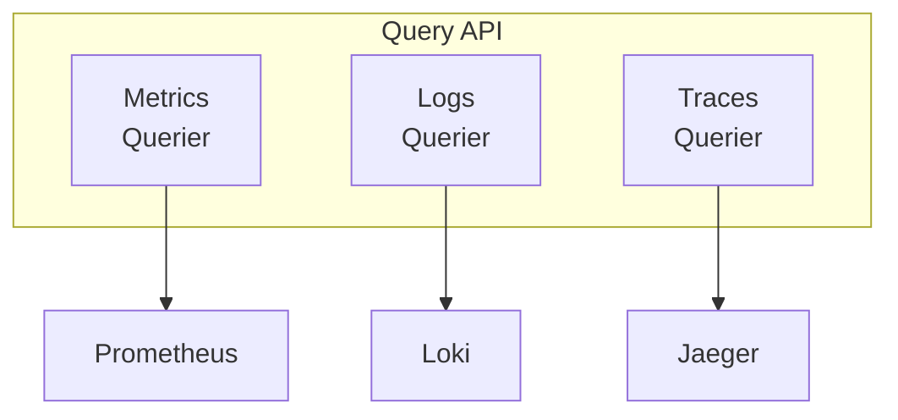

The Query API provides a unified interface for querying observability data from various backends. It supports metrics (Prometheus), logs (Loki), and traces (Jaeger) through a consistent API.

> **Note:** The Query API is an internal package (`internal/query`) and is not part of the public Go SDK. The Go examples below illustrate the internal implementation. External query API endpoints (REST/gRPC) are not yet available.

## Overview

The Query API abstracts away the differences between various observability backends, providing:

- **Metrics**: PromQL queries against Prometheus or compatible backends
- **Logs**: LogQL queries against Grafana Loki or in-memory storage
- **Traces**: Search and retrieval from Jaeger or compatible backends



## Metrics Querying

### PrometheusQuerier

The `PrometheusQuerier` executes PromQL queries against Prometheus.

#### Configuration

```go
import "github.com/shawnbutts/keystone-core/internal/query"

// Create a Prometheus querier
querier, err := query.NewPrometheusQuerier("http://prometheus:9090")
if err != nil {
    log.Fatal(err)
}
```

#### MetricsQuery Structure

| Field | Type | Description |
|-------|------|-------------|
| `query` | `string` | The PromQL query expression (required) |
| `time` | `*time.Time` | Evaluation timestamp for instant queries |
| `range` | `*TimeRange` | Time range for range queries |
| `step` | `time.Duration` | Query resolution step (default: 15s) |
| `timeout` | `time.Duration` | Query timeout |

#### TimeRange Structure

| Field | Type | Description |
|-------|------|-------------|
| `start` | `time.Time` | Start of the time range |
| `end` | `time.Time` | End of the time range |

#### Instant Query

Execute a point-in-time query:

```go
ctx := context.Background()
result, err := querier.Query(ctx, &query.MetricsQuery{
    Query: `up{job="kscore-server"}`,
})
if err != nil {
    log.Fatal(err)
}

fmt.Printf("Result type: %s\n", result.ResultType)
// Result type: vector
```

#### Range Query

Execute a query over a time range:

```go
now := time.Now()
result, err := querier.QueryRange(ctx, &query.MetricsQuery{
    Query: `rate(kscore_commands_total[5m])`,
    Range: &query.TimeRange{
        Start: now.Add(-1 * time.Hour),
        End:   now,
    },
    Step: 30 * time.Second,
})
if err != nil {
    log.Fatal(err)
}

fmt.Printf("Result type: %s\n", result.ResultType)
// Result type: matrix
```

#### MetricsResult Structure

| Field | Type | Description |
|-------|------|-------------|
| `result_type` | `string` | Type: `matrix`, `vector`, `scalar`, `string` |
| `result` | `interface{}` | Query result data |
| `warnings` | `[]string` | Any warnings from the query |

#### Result Types

**Vector** (instant query results):

```json
{
  "result_type": "vector",
  "result": [
    {
      "metric": {"job": "kscore-server", "instance": "server1:8080"},
      "value": 1.0,
      "timestamp": "2026-01-10T12:00:00Z"
    }
  ]
}
```

**Matrix** (range query results):

```json
{
  "result_type": "matrix",
  "result": [
    {
      "metric": {"job": "kscore-server", "instance": "server1:8080"},
      "values": [
        {"timestamp": "2026-01-10T11:00:00Z", "value": 0.5},
        {"timestamp": "2026-01-10T11:30:00Z", "value": 0.7},
        {"timestamp": "2026-01-10T12:00:00Z", "value": 0.6}
      ]
    }
  ]
}
```

## Logs Querying

### LokiQuerier

The `LokiQuerier` queries logs from Grafana Loki.

#### Configuration

```go
// Simple configuration
querier := query.NewLokiQuerier("http://loki:3100")

// Full configuration with authentication
querier := query.NewLokiQuerierWithConfig(&query.LokiConfig{
    Address:  "https://loki.example.com",
    Username: "user",
    Password: "pass",
    TenantID: "my-org",         // For multi-tenant Loki
    Timeout:  30 * time.Second,
})
```

#### LokiConfig Structure

| Field | Type | Description |
|-------|------|-------------|
| `address` | `string` | Loki server address (required) |
| `username` | `string` | Basic auth username (optional) |
| `password` | `string` | Basic auth password (optional) |
| `tenant_id` | `string` | Multi-tenant org ID (optional) |
| `tls_config` | `*tls.Config` | TLS configuration (optional) |
| `timeout` | `time.Duration` | HTTP request timeout |

#### LogsQuery Structure

| Field | Type | Description |
|-------|------|-------------|
| `query` | `string` | LogQL query expression |
| `range` | `TimeRange` | Time range for the query (required) |
| `limit` | `int` | Maximum entries to return (default: 100) |
| `direction` | `string` | Sort direction: `forward` or `backward` |
| `start` | `string` | Pagination cursor |

#### Query Logs

```go
ctx := context.Background()
now := time.Now()

result, err := querier.Query(ctx, &query.LogsQuery{
    Query: `{job="kscore-agent"} |= "error"`,
    Range: query.TimeRange{
        Start: now.Add(-1 * time.Hour),
        End:   now,
    },
    Limit:     100,
    Direction: "backward", // Most recent first
})
if err != nil {
    log.Fatal(err)
}

for _, entry := range result.Entries {
    fmt.Printf("[%s] %s\n", entry.Timestamp.Format(time.RFC3339), entry.Line)
}
```

#### LogsResult Structure

| Field | Type | Description |
|-------|------|-------------|
| `entries` | `[]LogEntry` | Log entries |
| `stats` | `*LogsStats` | Query statistics |

#### LogEntry Structure

| Field | Type | Description |
|-------|------|-------------|
| `timestamp` | `time.Time` | When the log was generated |
| `line` | `string` | The log message |
| `labels` | `map[string]string` | Log labels (e.g., job, instance) |

#### LogsStats Structure

| Field | Type | Description |
|-------|------|-------------|
| `bytes_processed` | `int64` | Bytes processed in query |
| `lines_processed` | `int64` | Lines processed |
| `total_bytes_processed` | `int64` | Total bytes in time range |
| `exec_time` | `float64` | Query execution time (seconds) |

#### Get Available Labels

```go
// Get all label names
labels, err := querier.Labels(ctx, startTime, endTime)
// Returns: ["job", "instance", "level", "service", ...]

// Get values for a specific label
values, err := querier.LabelValues(ctx, "job", startTime, endTime)
// Returns: ["kscore-server", "kscore-agent", "kscore-gateway", ...]
```

### InMemoryLogsQuerier

For testing and development, use the in-memory implementation:

```go
querier := query.NewInMemoryLogsQuerier()

// Add test entries
querier.AddEntry(query.LogEntry{
    Timestamp: time.Now(),
    Line:      "Agent connected successfully",
    Labels:    map[string]string{"job": "kscore-agent", "level": "info"},
})

// Query works the same as LokiQuerier
result, err := querier.Query(ctx, &query.LogsQuery{
    Query: "connected",
    Range: query.TimeRange{
        Start: time.Now().Add(-1 * time.Hour),
        End:   time.Now(),
    },
})
```

## Traces Querying

### JaegerQuerier

The `JaegerQuerier` queries traces from Jaeger.

#### Configuration

```go
// Simple configuration
querier := query.NewJaegerQuerier("http://jaeger-query:16686")

// Full configuration
querier := query.NewJaegerQuerierWithConfig(&query.JaegerConfig{
    Address:  "https://jaeger.example.com",
    Username: "user",
    Password: "pass",
    Timeout:  30 * time.Second,
})
```

#### JaegerConfig Structure

| Field | Type | Description |
|-------|------|-------------|
| `address` | `string` | Jaeger query service address (required) |
| `username` | `string` | Basic auth username (optional) |
| `password` | `string` | Basic auth password (optional) |
| `tls_config` | `*tls.Config` | TLS configuration (optional) |
| `timeout` | `time.Duration` | HTTP request timeout |

#### TracesQuery Structure

| Field | Type | Description |
|-------|------|-------------|
| `service` | `string` | Filter by service name |
| `operation` | `string` | Filter by operation name |
| `tags` | `map[string]string` | Filter by span tags |
| `range` | `*TimeRange` | Time range for the query |
| `min_duration` | `time.Duration` | Minimum trace duration |
| `max_duration` | `time.Duration` | Maximum trace duration |
| `limit` | `int` | Maximum traces to return (default: 20) |

#### Search Traces

```go
ctx := context.Background()
now := time.Now()

result, err := querier.Query(ctx, &query.TracesQuery{
    Service:   "kscore-server",
    Operation: "ExecuteCommand",
    Range: &query.TimeRange{
        Start: now.Add(-1 * time.Hour),
        End:   now,
    },
    MinDuration: 100 * time.Millisecond, // Find slow operations
    Limit:       50,
})
if err != nil {
    log.Fatal(err)
}

fmt.Printf("Found %d traces (total: %d)\n", len(result.Traces), result.Total)
```

#### Get Single Trace

```go
trace, err := querier.GetTrace(ctx, "abc123def456")
if err != nil {
    log.Fatal(err)
}

fmt.Printf("Trace %s has %d spans\n", trace.TraceID, len(trace.Spans))
for _, span := range trace.Spans {
    fmt.Printf("  - %s: %s (%v)\n", span.SpanID, span.OperationName, span.Duration)
}
```

#### Get Available Services and Operations

```go
// Get all services
services, err := querier.GetServices(ctx)
// Returns: ["kscore-server", "kscore-agent", "kscore-gateway", ...]

// Get operations for a service
operations, err := querier.GetOperations(ctx, "kscore-server")
// Returns: ["ExecuteCommand", "ApplyState", "HandleHeartbeat", ...]
```

#### TracesResult Structure

| Field | Type | Description |
|-------|------|-------------|
| `traces` | `[]TraceResult` | Matching traces |
| `total` | `int` | Total matching traces |

#### TraceResult Structure

| Field | Type | Description |
|-------|------|-------------|
| `trace_id` | `string` | Unique trace identifier |
| `spans` | `[]Span` | Spans in this trace |
| `processes` | `map[string]Process` | Processes in this trace |
| `warnings` | `[]string` | Any warnings |

#### Span Structure

| Field | Type | Description |
|-------|------|-------------|
| `trace_id` | `string` | Parent trace ID |
| `span_id` | `string` | Unique span identifier |
| `operation_name` | `string` | Operation name |
| `references` | `[]SpanRef` | References to other spans |
| `start_time` | `time.Time` | When the span started |
| `duration` | `time.Duration` | Span duration |
| `tags` | `map[string]interface{}` | Span tags |
| `logs` | `[]SpanLog` | Span log events |
| `process_id` | `string` | Process that created this span |

#### SpanRef Structure

| Field | Type | Description |
|-------|------|-------------|
| `ref_type` | `string` | Reference type: `CHILD_OF` or `FOLLOWS_FROM` |
| `trace_id` | `string` | Referenced trace ID |
| `span_id` | `string` | Referenced span ID |

#### Process Structure

| Field | Type | Description |
|-------|------|-------------|
| `service_name` | `string` | Service name |
| `tags` | `map[string]interface{}` | Process-level tags |

### InMemoryTracesQuerier

For testing and development:

```go
querier := query.NewInMemoryTracesQuerier()

// Add test traces
querier.AddTrace(&query.TraceResult{
    TraceID: "abc123",
    Spans: []query.Span{
        {
            TraceID:       "abc123",
            SpanID:        "span1",
            OperationName: "ExecuteCommand",
            StartTime:     time.Now(),
            Duration:      150 * time.Millisecond,
            Tags:          map[string]interface{}{"command": "uptime"},
        },
    },
    Processes: map[string]query.Process{
        "p1": {ServiceName: "kscore-server"},
    },
})
```

## Common Patterns

### Error Handling

All queriers return errors that should be checked:

```go
result, err := querier.Query(ctx, query)
if err != nil {
    // Check for specific error types
    if strings.Contains(err.Error(), "not found") {
        // Handle not found
    } else if strings.Contains(err.Error(), "timeout") {
        // Handle timeout
    } else {
        // Handle other errors
    }
}
```

### Context Timeouts

Always use context timeouts for production code:

```go
ctx, cancel := context.WithTimeout(context.Background(), 30*time.Second)
defer cancel()

result, err := querier.Query(ctx, query)
```

### Pagination

For large result sets, use pagination. The `Start` cursor format depends on the backend:

- **LokiQuerier**: Nanosecond Unix timestamp string (passed directly to the Loki API `start` parameter)
- **InMemoryLogsQuerier**: RFC 3339 Nano formatted timestamp

```go
// Logs pagination (Loki backend)
var allEntries []query.LogEntry
start := ""

for {
    result, err := querier.Query(ctx, &query.LogsQuery{
        Query: `{job="kscore-agent"}`,
        Range: timeRange,
        Limit: 1000,
        Start: start,
    })
    if err != nil {
        break
    }

    allEntries = append(allEntries, result.Entries...)

    if len(result.Entries) < 1000 {
        break // No more results
    }

    // Get cursor for next page from last entry timestamp
    lastTS := result.Entries[len(result.Entries)-1].Timestamp
    start = strconv.FormatInt(lastTS.UnixNano(), 10)
}
```

## Query Language Reference

### PromQL (Metrics)

| Expression | Description |
|------------|-------------|
| `up{job="kscore-server"}` | Current up status |
| `rate(kscore_commands_total[5m])` | Command rate per second |
| `sum by (agent_id) (kscore_agent_commands_total)` | Commands by agent |
| `histogram_quantile(0.95, rate(kscore_command_duration_seconds_bucket[5m]))` | P95 latency |

### LogQL (Logs)

| Expression | Description |
|------------|-------------|
| `{job="kscore-agent"}` | All agent logs |
| `{job="kscore-agent"} \|= "error"` | Logs containing "error" |
| `{job="kscore-agent"} \| json` | Parse JSON logs |
| `{job="kscore-agent"} \| logfmt \| level="error"` | Filter parsed logs |
| `rate({job="kscore-agent"} \|= "error"[5m])` | Error rate |

### Trace Filters

| Filter | Description |
|--------|-------------|
| `service=kscore-server` | Filter by service |
| `operation=ExecuteCommand` | Filter by operation |
| `tags.error=true` | Filter by tag |
| `minDuration=100ms` | Minimum duration |
| `maxDuration=1s` | Maximum duration |

## Best Practices

1. **Use appropriate time ranges**: Query only the data you need to reduce load
2. **Limit results**: Use the `limit` parameter to prevent overwhelming responses
3. **Add timeouts**: Always set context timeouts in production
4. **Cache when possible**: Cache frequently-used query results
5. **Monitor query performance**: Track query execution times via stats
6. **Use labels efficiently**: Filter early with labels to reduce data processing

## See Also

- [Metrics Reference](../metrics/) - Available Prometheus metrics
- [Observability Concepts](../../concepts/observability/) - Architecture overview
- [Monitoring Operations](../../operations/monitoring/) - Operational guide
