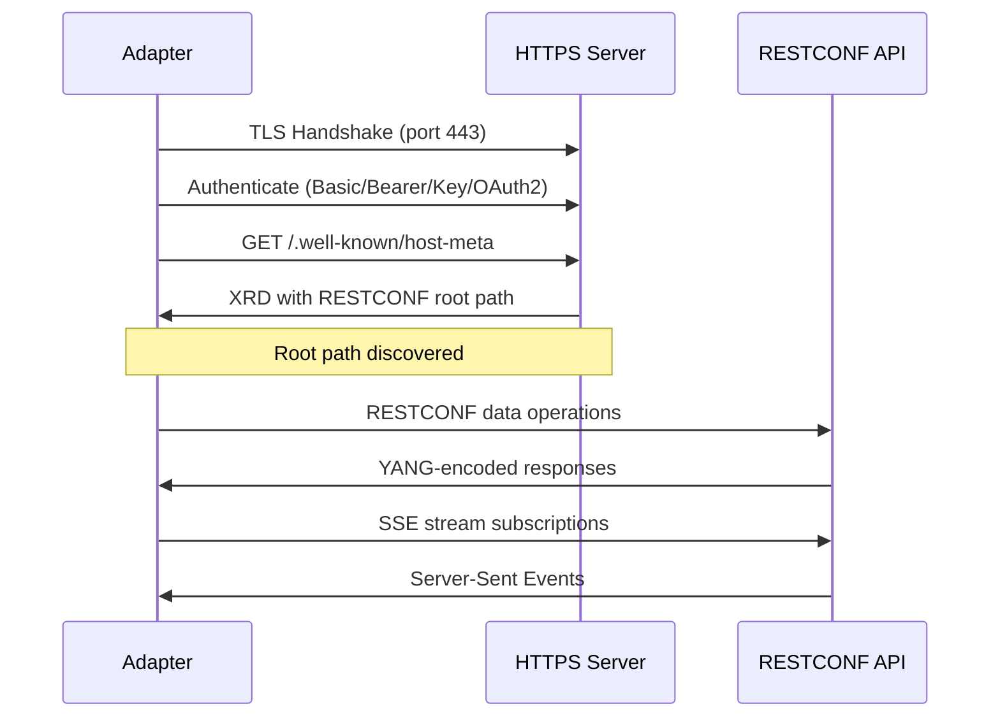

## Overview

The RESTCONF protocol adapter implements RFC 8040 (RESTCONF Protocol) over HTTPS, providing HTTP-based access to YANG-modeled configuration and operational data on network devices. It integrates with the proxy agent system as both a generic `ProtocolAdapter` and an extended `RestconfAdapter` with typed operations.

RESTCONF complements NETCONF by providing the same YANG data model access via REST APIs instead of XML-over-SSH.

**Key features**:
- Full RFC 8040 data operation set (GET, POST, PUT, PATCH, DELETE)
- YANG RPC/action invocation
- Server-Sent Events (SSE) for notification streams
- Well-known root path discovery (RFC 6415)
- YANG library version and module listing
- JSON and XML YANG data encoding
- Reuses existing REST credentials (no new credential types)

## Configuration

### Adapter Configuration

```yaml
proxy:
  devices:
    - id: router-01
      address: 192.168.1.1
      protocol: restconf
      port: 443
```

The adapter accepts the following configuration options:

| Field | Type | Default | Description |
|-------|------|---------|-------------|
| `port` | int | 443 | RESTCONF HTTPS port |
| `root_path` | string | (discovered) | Override RESTCONF API root (skip discovery) |
| `encoding` | string | `application/yang-data+json` | Default YANG data format |
| `validate_ssl` | bool | true | Enable TLS certificate validation |
| `default_headers` | map | (none) | HTTP headers added to all requests |
| `rate_limit_per_second` | int | 0 | Request rate limit (0 = unlimited) |
| `discover_root` | bool | true | Enable well-known root path discovery |
| `timeout` | duration | 30s | Request timeout |
| `max_retries` | int | 3 | Request retry attempts |
| `retry_delay` | duration | 5s | Delay between retries |

### Credentials

RESTCONF uses standard REST/HTTP credentials. No new credential types are required.

**Basic authentication**:

```yaml
credentials:
  router-01:
    type: rest_basic
    username: admin
    password: "${ROUTER_PASSWORD}"
```

**Bearer token**:

```yaml
credentials:
  router-01:
    type: rest_bearer
    token: "${API_TOKEN}"
```

**API key**:

```yaml
credentials:
  router-01:
    type: rest_apikey
    api_key: "${API_KEY}"
    header_name: "X-API-Key"
```

**OAuth2 client credentials**:

```yaml
credentials:
  router-01:
    type: rest_oauth2
    client_id: "${CLIENT_ID}"
    client_secret: "${CLIENT_SECRET}"
    token_url: "https://auth.example.com/token"
    scopes:
      - read
      - write
```

## Operations

### Execute Interface

The generic `Execute()` method accepts string commands in the format `operation [args] [body]`:

| Command | Format | Example |
|---------|--------|---------|
| get-data | `get-data path` | `get-data /ietf-interfaces:interfaces` |
| post-data | `post-data path body` | `post-data /ietf-interfaces:interfaces {"interface":{"name":"eth1"}}` |
| put-data | `put-data path body` | `put-data /ietf-interfaces:interfaces/interface=eth0 {"enabled":false}` |
| patch-data | `patch-data path body` | `patch-data /ietf-interfaces:interfaces/interface=eth0 {"enabled":true}` |
| delete-data | `delete-data path` | `delete-data /ietf-interfaces:interfaces/interface=eth99` |
| invoke | `invoke operation [input]` | `invoke ietf-system:restart` |
| yang-library | `yang-library` | `yang-library` |
| modules | `modules` | `modules` |
| Raw HTTP | `METHOD /path [body]` | `GET /restconf/data/...` |

Raw HTTP passthrough supports `GET`, `POST`, `PUT`, `PATCH`, `DELETE`, `HEAD`, and `OPTIONS` methods.

### Typed Operations (RestconfAdapter)

The extended `RestconfAdapter` interface provides typed methods:

```go
// Retrieve data
data, err := adapter.GetData(ctx, "ietf-interfaces:interfaces", &protocols.RestconfQueryOptions{
    Depth:   3,
    Fields:  "name;enabled",
    Content: "config",
})

// Create resource
err := adapter.PostData(ctx, "ietf-interfaces:interfaces", createJSON)

// Replace resource
err := adapter.PutData(ctx, "ietf-interfaces:interfaces/interface=eth0", replaceJSON)

// Merge into resource
err := adapter.PatchData(ctx, "ietf-interfaces:interfaces/interface=eth0", patchJSON)

// Delete resource
err := adapter.DeleteData(ctx, "ietf-interfaces:interfaces/interface=eth99")

// Invoke RPC/action
output, err := adapter.InvokeOperation(ctx, "ietf-system:restart", nil)
```

### Query Parameters

`GetData` accepts optional query parameters per RFC 8040 Section 4.8:

| Parameter | Type | Description |
|-----------|------|-------------|
| `depth` | int | Limit nested data depth (1 = no children) |
| `fields` | string | Select specific fields (`name;enabled`) |
| `content` | string | Filter by config/state: `all`, `config`, `nonconfig` |
| `with_defaults` | string | Default value handling: `report-all`, `report-all-tagged`, `trim`, `explicit` |
| `filter` | string | XPath or subtree filter expression |

## Discovery

### Root Path Discovery

On connection, the adapter discovers the RESTCONF API root via RFC 6415:

1. Fetch `/.well-known/host-meta` for an XRD document
2. Parse the `restconf` link from the XRD
3. Fall back to `/restconf` if discovery fails

Override discovery by setting `root_path` in the adapter configuration.

### YANG Library

Query the server's YANG library version and available modules:

```go
version, err := adapter.YANGLibraryVersion(ctx)
modules, err := adapter.ServerModules(ctx)
```

Via the Execute interface:

```bash
kscorectl proxy exec router-01 --protocol restconf "yang-library"
kscorectl proxy exec router-01 --protocol restconf "modules"
```

## Notification Streams

The adapter supports RESTCONF notification streams via Server-Sent Events (SSE, RFC 8040 Section 6):

```go
sub, err := adapter.Subscribe(ctx, "NETCONF")
defer sub.Close()

for event := range sub.Events() {
    fmt.Printf("Event: %s, Data: %s\n", event.Event, event.Data)
}
```

Each `StreamEvent` contains:

| Field | Description |
|-------|-------------|
| `ID` | Event identifier |
| `Event` | Event type (e.g., `push-update`) |
| `Data` | Event payload (YANG data) |

## Media Types

| Media Type | Usage |
|------------|-------|
| `application/yang-data+json` | JSON-encoded YANG data (default) |
| `application/yang-data+xml` | XML-encoded YANG data |
| `application/yang-patch+json` | JSON YANG patch |
| `application/yang-patch+xml` | XML YANG patch |

The `Accept` and `Content-Type` headers are set automatically based on the configured encoding.

## Connection Lifecycle



## Error Handling

RESTCONF errors follow the RFC 8040 error response format (`ietf-restconf:errors`). The adapter parses both JSON and XML error envelopes.

Error fields:

| Field | Description |
|-------|-------------|
| `error-type` | `transport`, `rpc`, `protocol`, `application` |
| `error-tag` | Error tag (e.g., `invalid-value`, `data-missing`) |
| `error-app-tag` | Application-specific error tag (optional) |
| `error-path` | Instance identifier to the error node (optional) |
| `error-message` | Human-readable error description (optional) |

HTTP status codes 400+ are treated as errors. The adapter attempts to parse the RESTCONF error envelope from the response body.

## Examples

### Retrieve Interface Configuration

```bash
kscorectl proxy exec router-01 --protocol restconf "get-data /ietf-interfaces:interfaces"
```

### Create a New Interface

```bash
kscorectl proxy exec router-01 --protocol restconf \
  'post-data /ietf-interfaces:interfaces {"interface":{"name":"eth1","type":"iana-if-type:ethernetCsmacd"}}'
```

### Update Interface State

```bash
kscorectl proxy exec router-01 --protocol restconf \
  'patch-data /ietf-interfaces:interfaces/interface=eth0 {"enabled":false}'
```

### Delete an Interface

```bash
kscorectl proxy exec router-01 --protocol restconf \
  "delete-data /ietf-interfaces:interfaces/interface=eth99"
```

### Invoke an RPC Operation

```bash
kscorectl proxy exec router-01 --protocol restconf "invoke ietf-system:restart"
```

### Raw HTTP Request

```bash
kscorectl proxy exec router-01 --protocol restconf \
  "GET /restconf/data/ietf-system:system/hostname"
```

## See Also

- [NETCONF Protocol Reference]() - XML-over-SSH protocol for YANG data
- [gNMI Protocol Reference]() - gRPC-based streaming telemetry and configuration
- [Telnet Protocol Reference]() - Legacy CLI access for network devices
- [Proxy Agents]() - Managing unmanaged devices
