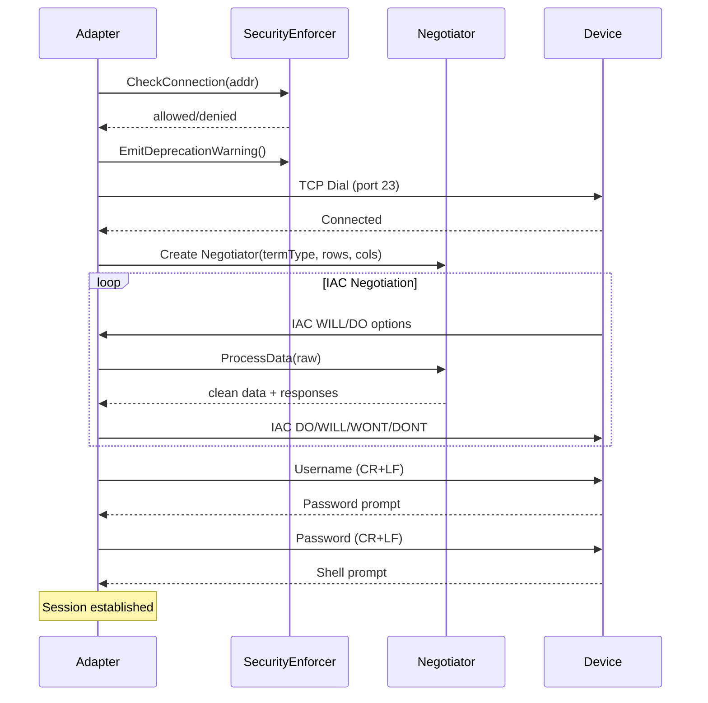

## Overview

The Telnet protocol adapter implements RFC 854/855 for managing legacy network devices that only support Telnet CLI access. Because Telnet transmits data in plaintext, the adapter enforces security controls (IP allowlisting, deprecation warnings, audit logging, session time limits) at the framework level.

**Key features**:

- RFC 854/855 IAC negotiation state machine (WILL/WONT/DO/DONT, sub-negotiation)
- Expect-style I/O with prompt detection and pattern matching
- Security-first design: IP allowlisting, deprecation warnings, audit logging
- Persistent session model with CR+LF line endings
- Reuses SSH password credentials (no new credential types)

## Configuration

### Adapter Configuration

```yaml
proxy:
  devices:
    - id: legacy-switch-01
      address: 192.168.1.10
      protocol: telnet
      port: 23
      credential_ref: switch-password-creds
      profile_id: cisco-ios
```

### Config Fields

| Field | Type | Default | Description |
|-------|------|---------|-------------|
| `port` | int | `23` | Telnet TCP port |
| `prompt` | string | `"# "` | Expected shell prompt pattern |
| `term_type` | string | `"vt100"` | Terminal type for IAC negotiation |
| `rows` | uint16 | `24` | Terminal height |
| `cols` | uint16 | `80` | Terminal width |
| `login_prompts` | []string | `["ogin:", "sername:"]` | Patterns identifying the login prompt |
| `password_prompts` | []string | `["assword:"]` | Patterns identifying the password prompt |

### Security Configuration

```yaml
proxy:
  telnet:
    security:
      allowed_networks:
        - "10.0.0.0/8"
        - "172.16.0.0/12"
      require_audit: true
      deprecation_warning: true
      max_session_duration: "1h"
```

| Field | Type | Default | Description |
|-------|------|---------|-------------|
| `allowed_networks` | []string | `[]` (all allowed) | CIDR allowlist for Telnet connections |
| `require_audit` | bool | `false` | Log every command for audit trail |
| `deprecation_warning` | bool | `true` | Log a warning on every Telnet connection |
| `max_session_duration` | duration | `0` (no limit) | Maximum session lifetime |

## Credentials

Telnet uses `SSHPasswordCredential` for authentication:

```yaml
credentials:
  switch-password-creds:
    type: ssh_password
    username: admin
    password: "${SWITCH_PASSWORD}"
```

The adapter performs prompt-based login: it waits for the login prompt, sends the username, waits for the password prompt, sends the password, then waits for the shell prompt.

## Connection Lifecycle



## IAC Negotiation

The adapter implements a byte-level state machine for RFC 854/855 IAC (Interpret As Command) negotiation. The negotiator strips IAC sequences from output data and produces response bytes to write back to the server.

### Negotiation Policy

| Option | Server WILL | Server DO |
|--------|-------------|-----------|
| Echo (1) | Accept (DO) | Refuse (WONT) |
| Suppress Go Ahead (3) | Accept (DO) | Accept (WILL) |
| Terminal Type (24) | N/A | Accept (WILL), sub-negotiate type |
| Window Size / NAWS (31) | N/A | Accept (WILL), sub-negotiate dimensions |
| All others | Refuse (DONT) | Refuse (WONT) |

### Sub-negotiation

- **Terminal Type**: Responds with the configured `term_type` (default `vt100`)
- **Window Size (NAWS)**: Sends configured `cols` and `rows` as 16-bit big-endian values

## Operations

### Execute

The `Execute` method sends a command and reads until the prompt returns:

1. Send command with CR+LF termination (per RFC 854)
2. Read output, processing IAC sequences inline
3. Strip echoed command and prompt from output
4. Return cleaned output as `ExecuteResult.Stdout`

Exit codes: `0` for success, `1` for errors (Telnet has no native exit code mechanism).

### ExecuteExpect

For interactive commands that produce non-standard prompts (e.g., `enable` → `Password:`):

```go
result, err := session.ExecuteExpect(ctx, "enable",
    []string{"Password:", "# "}, 30*time.Second)
```

### Health Check

Sends an IAC NOP (no-operation) to verify the TCP connection is alive. Also checks session expiry if `max_session_duration` is configured.

## Security

Telnet transmits all data including credentials in plaintext. The adapter enforces security controls to mitigate risk:

### IP Allowlisting

Restrict which addresses can be reached via Telnet:

```yaml
security:
  allowed_networks:
    - "10.0.0.0/8"
```

Connections to addresses outside the allowlist are rejected before the TCP dial. An empty list allows all addresses.

### Deprecation Warning

When enabled (default), logs a warning on every connection:

```
WARN telnet connection uses unencrypted protocol; consider migrating to SSH
     device_id=legacy-switch-01 address=10.0.0.1:23 protocol=telnet
```

### Audit Logging

When `require_audit` is enabled, every command execution is logged:

```
INFO telnet command executed device_id=legacy-switch-01 command="show version" duration=150ms protocol=telnet
ERROR telnet command failed device_id=legacy-switch-01 command="bad-cmd" duration=50ms protocol=telnet error="timeout"
```

### Session Duration Limit

Set `max_session_duration` to automatically expire long-running sessions. Expired sessions return an error on the next `Execute` or `HealthCheck` call.

## Examples

### Basic Device Management

```yaml
proxy:
  devices:
    - id: legacy-switch-01
      type: switch
      vendor: cisco
      protocol: telnet
      address: 10.0.1.10
      port: 23
      credential_ref: switch-creds
      profile_id: cisco-ios
```

### Locked-Down Environment

```yaml
proxy:
  telnet:
    security:
      allowed_networks:
        - "10.0.1.0/24"
      require_audit: true
      deprecation_warning: true
      max_session_duration: "30m"
```

### Custom Prompts

For devices with non-standard login or shell prompts:

```yaml
proxy:
  telnet:
    login_prompts: ["Username:", "login:"]
    password_prompts: ["Password:", "Passcode:"]
    prompt: "switch> "
```

## See Also

- [NETCONF Protocol Reference]()
- [RESTCONF Protocol Reference]()
- [gNMI Protocol Reference]() - gRPC-based streaming telemetry and configuration
- [Proxy Agents]()
